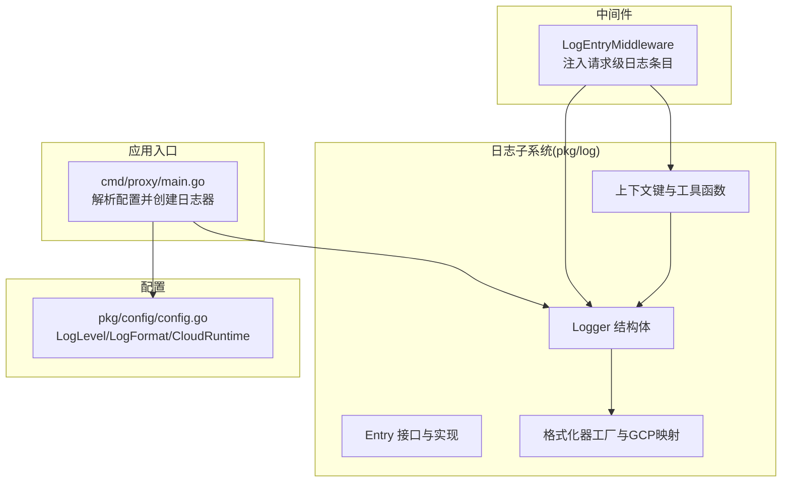
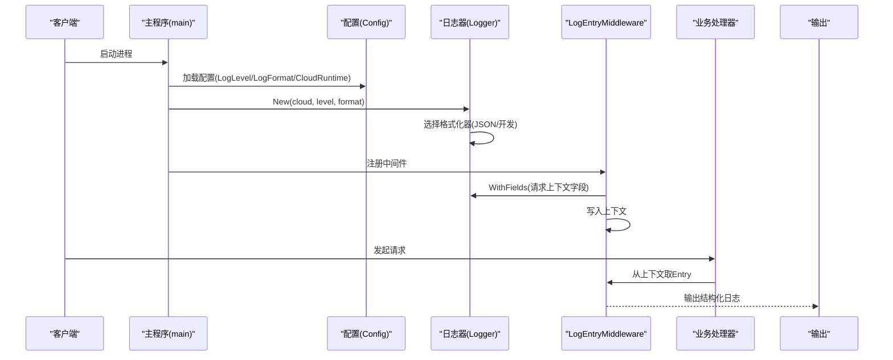
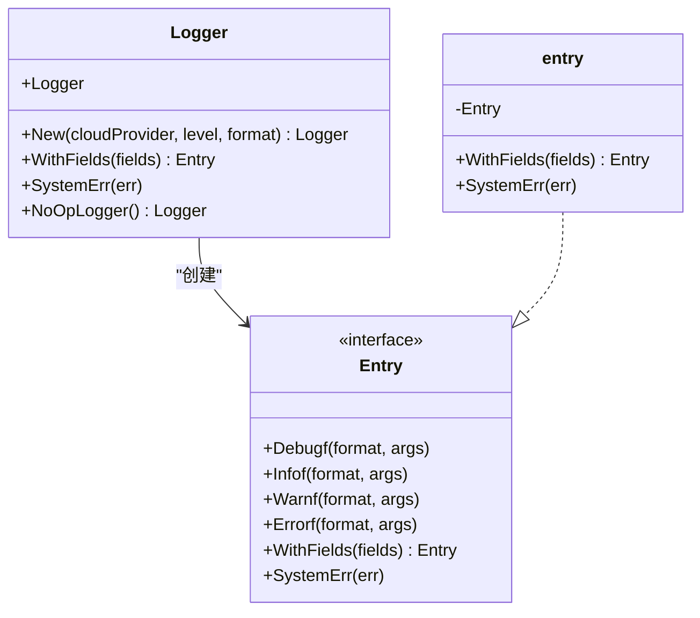
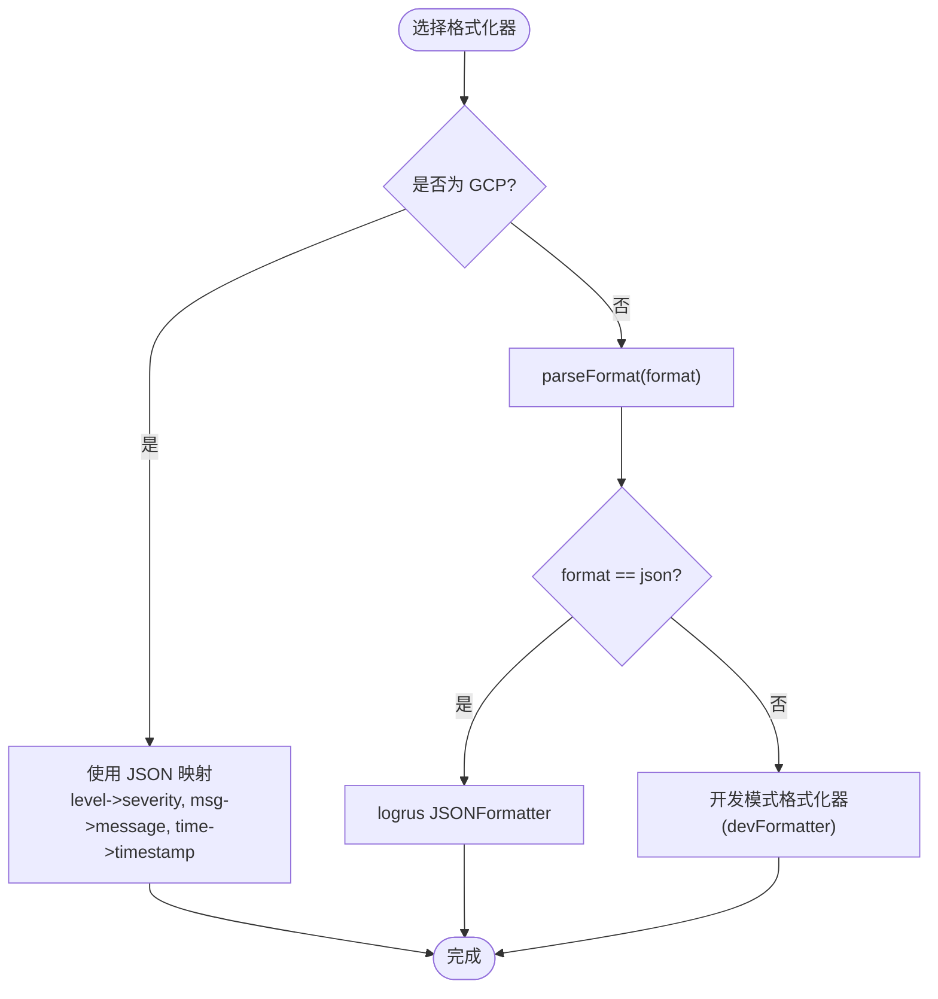
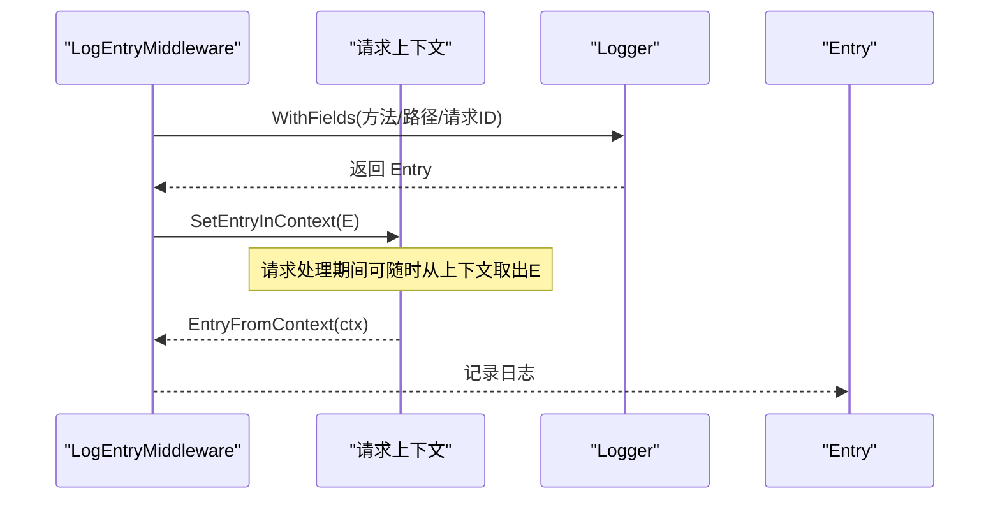
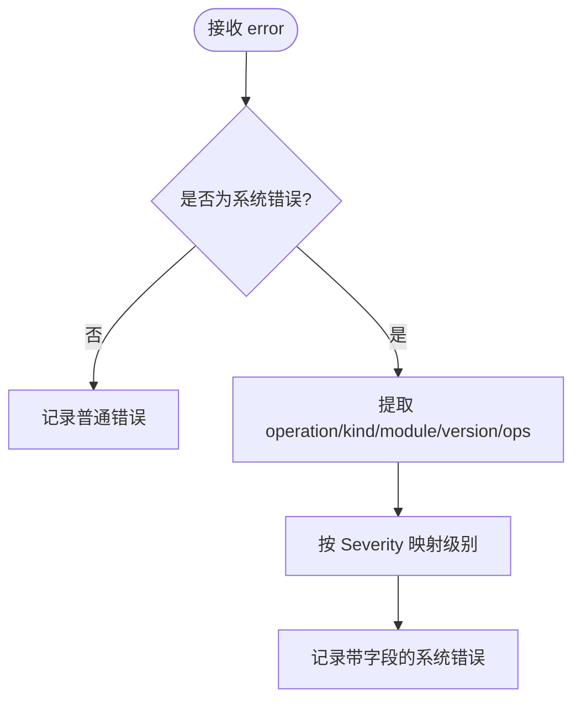
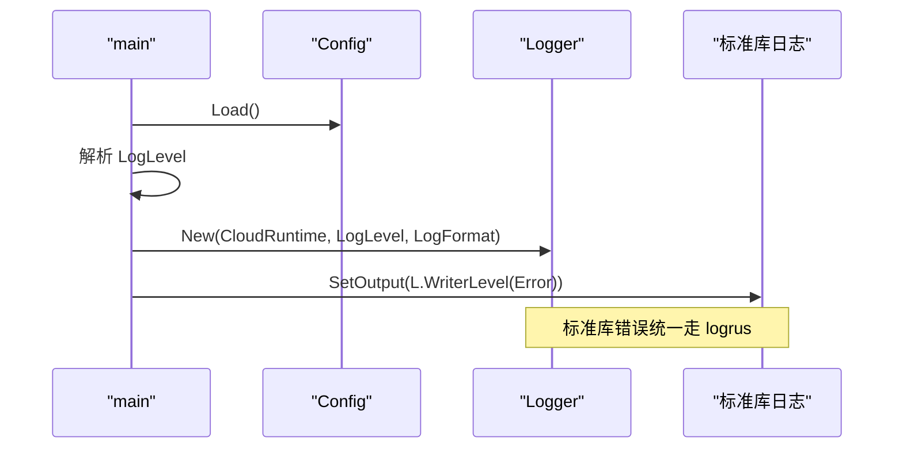
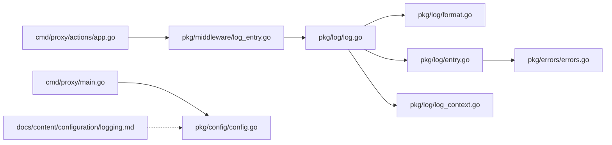

# 日志系统

<cite>
**本文引用的文件**
- [pkg/log/log.go](file://pkg/log/log.go)
- [pkg/log/format.go](file://pkg/log/format.go)
- [pkg/log/entry.go](file://pkg/log/entry.go)
- [pkg/log/log_context.go](file://pkg/log/log_context.go)
- [cmd/proxy/main.go](file://cmd/proxy/main.go)
- [pkg/config/config.go](file://pkg/config/config.go)
- [pkg/middleware/log_entry.go](file://pkg/middleware/log_entry.go)
- [docs/content/configuration/logging.md](file://docs/content/configuration/logging.md)
- [pkg/errors/errors.go](file://pkg/errors/errors.go)
- [pkg/log/log_test.go](file://pkg/log/log_test.go)
- [cmd/proxy/actions/app.go](file://cmd/proxy/actions/app.go)
</cite>

## 目录
1. [简介](#简介)
2. [项目结构](#项目结构)
3. [核心组件](#核心组件)
4. [架构总览](#架构总览)
5. [组件详解](#组件详解)
6. [依赖关系分析](#依赖关系分析)
7. [性能与优化](#性能与优化)
8. [故障排查指南](#故障排查指南)
9. [结论](#结论)
10. [附录：配置与最佳实践](#附录配置与最佳实践)

## 简介
本文件系统性阐述 Athens 的日志系统设计与实现，覆盖以下主题：
- 设计架构与关键组件
- Logrus 集成与配置项
- 日志级别、格式化器选择与云平台适配
- 日志上下文管理、字段附加与错误记录机制
- 不同云平台（GCP、AWS、Azure）的日志格式化建议
- 日志轮转、性能优化与调试技巧
- 开发者最佳实践与常见问题解答

## 项目结构
日志系统位于 pkg/log，并通过中间件在请求链路中注入上下文日志条目；应用入口根据配置创建日志器并接入标准库日志输出。

**图表来源**
- [cmd/proxy/main.go](file://cmd/proxy/main.go#L29-L62)
- [pkg/log/log.go](file://pkg/log/log.go#L17-L27)
- [pkg/log/format.go](file://pkg/log/format.go#L14-L22)
- [pkg/log/log_context.go](file://pkg/log/log_context.go#L9-L25)
- [pkg/middleware/log_entry.go](file://pkg/middleware/log_entry.go#L14-L29)
- [pkg/config/config.go](file://pkg/config/config.go#L30-L32)

**章节来源**
- [cmd/proxy/main.go](file://cmd/proxy/main.go#L29-L62)
- [pkg/config/config.go](file://pkg/config/config.go#L30-L32)

## 核心组件
- Logger：封装 logrus.Logger，负责构造、设置级别与格式化器，并提供便捷方法创建 Entry。
- Entry：抽象日志条目接口，支持带字段的链式构建与按错误严重度自动分级记录。
- 上下文工具：在请求上下文中存储/提取日志条目，便于在整个处理链复用。
- 格式化器：内置开发友好格式与 GCP 专用 JSON 映射；默认支持 json/plain 两种模式。

**章节来源**
- [pkg/log/log.go](file://pkg/log/log.go#L9-L11)
- [pkg/log/entry.go](file://pkg/log/entry.go#L13-L26)
- [pkg/log/log_context.go](file://pkg/log/log_context.go#L7-L25)
- [pkg/log/format.go](file://pkg/log/format.go#L14-L22)

## 架构总览
日志系统围绕“配置驱动 + 中间件注入 + 统一格式化”的思路组织，确保在不同运行环境（本地开发、容器、云平台）下具备一致且可读的日志输出。

**图表来源**
- [cmd/proxy/main.go](file://cmd/proxy/main.go#L35-L62)
- [pkg/middleware/log_entry.go](file://pkg/middleware/log_entry.go#L14-L29)
- [pkg/log/log.go](file://pkg/log/log.go#L17-L27)
- [pkg/log/format.go](file://pkg/log/format.go#L67-L73)

## 组件详解

### Logger 与 Entry 抽象
- Logger 提供 WithFields 构建带上下文字段的日志条目；SystemErr 将系统错误按严重度映射到对应日志级别并附加标准化字段。
- Entry 接口屏蔽底层实现差异，保证每次创建都是独立副本，避免字段被后续调用覆盖。

**图表来源**
- [pkg/log/log.go](file://pkg/log/log.go#L9-L11)
- [pkg/log/entry.go](file://pkg/log/entry.go#L13-L26)
- [pkg/log/entry.go](file://pkg/log/entry.go#L28-L35)

**章节来源**
- [pkg/log/log.go](file://pkg/log/log.go#L17-L27)
- [pkg/log/entry.go](file://pkg/log/entry.go#L13-L26)
- [pkg/log/entry.go](file://pkg/log/entry.go#L37-L55)

### 格式化器与云平台适配
- GCP 专用 JSON 映射：将 level/msg/time 字段重命名为 severity/message/timestamp，便于云日志收集与查询。
- 开发模式：彩色终端输出，带时间戳与排序后的键值对字段。
- 默认格式：支持 json/plain；未指定时采用开发模式。

**图表来源**
- [pkg/log/format.go](file://pkg/log/format.go#L14-L22)
- [pkg/log/format.go](file://pkg/log/format.go#L67-L73)

**章节来源**
- [pkg/log/format.go](file://pkg/log/format.go#L14-L22)
- [pkg/log/format.go](file://pkg/log/format.go#L24-L56)
- [pkg/log/format.go](file://pkg/log/format.go#L67-L73)

### 日志上下文管理
- 使用自定义上下文键在请求生命周期内传递日志条目，避免重复构造。
- 若上下文无条目或类型断言失败，则回退到空操作日志器，保证健壮性。

**图表来源**
- [pkg/middleware/log_entry.go](file://pkg/middleware/log_entry.go#L14-L29)
- [pkg/log/log_context.go](file://pkg/log/log_context.go#L11-L25)

**章节来源**
- [pkg/log/log_context.go](file://pkg/log/log_context.go#L9-L25)
- [pkg/middleware/log_entry.go](file://pkg/middleware/log_entry.go#L14-L29)

### 错误记录机制
- 对非系统错误直接按普通错误记录；对系统错误，提取操作、种类、模块、版本、操作栈等字段，并依据错误严重度映射到 debug/info/warn/error 级别。

**图表来源**
- [pkg/log/entry.go](file://pkg/log/entry.go#L37-L55)
- [pkg/errors/errors.go](file://pkg/errors/errors.go#L129-L144)

**章节来源**
- [pkg/log/entry.go](file://pkg/log/entry.go#L37-L55)
- [pkg/errors/errors.go](file://pkg/errors/errors.go#L24-L41)
- [pkg/errors/errors.go](file://pkg/errors/errors.go#L129-L144)

### 应用入口与标准库集成
- 入口根据配置解析日志级别与格式，创建日志器，并将标准库日志输出重定向至 logrus Writer，统一由日志器处理。

**图表来源**
- [cmd/proxy/main.go](file://cmd/proxy/main.go#L35-L58)
- [pkg/config/config.go](file://pkg/config/config.go#L30-L32)

**章节来源**
- [cmd/proxy/main.go](file://cmd/proxy/main.go#L35-L58)
- [pkg/config/config.go](file://pkg/config/config.go#L30-L32)

## 依赖关系分析
- Logger 依赖 logrus；Entry 依赖 logrus.Entry；上下文工具依赖 context；格式化器依赖 logrus 与颜色库。
- 中间件依赖 Logger 与请求 ID 工具；应用入口依赖配置与 Logger。
- 文档说明了标准与运行时两种配置方式及 GCP 适配要点。

**图表来源**
- [pkg/log/log.go](file://pkg/log/log.go#L3-L5)
- [pkg/log/format.go](file://pkg/log/format.go#L3-L12)
- [pkg/log/entry.go](file://pkg/log/entry.go#L3-L6)
- [pkg/log/log_context.go](file://pkg/log/log_context.go#L3-L5)
- [pkg/middleware/log_entry.go](file://pkg/middleware/log_entry.go#L3-L10)
- [cmd/proxy/actions/app.go](file://cmd/proxy/actions/app.go#L3-L15)
- [cmd/proxy/main.go](file://cmd/proxy/main.go#L3-L22)
- [pkg/config/config.go](file://pkg/config/config.go#L22-L66)
- [docs/content/configuration/logging.md](file://docs/content/configuration/logging.md#L1-L18)
- [pkg/errors/errors.go](file://pkg/errors/errors.go#L3-L10)

**章节来源**
- [pkg/log/log.go](file://pkg/log/log.go#L3-L5)
- [pkg/log/format.go](file://pkg/log/format.go#L3-L12)
- [pkg/log/entry.go](file://pkg/log/entry.go#L3-L6)
- [pkg/log/log_context.go](file://pkg/log/log_context.go#L3-L5)
- [pkg/middleware/log_entry.go](file://pkg/middleware/log_entry.go#L3-L10)
- [cmd/proxy/actions/app.go](file://cmd/proxy/actions/app.go#L3-L15)
- [cmd/proxy/main.go](file://cmd/proxy/main.go#L3-L22)
- [pkg/config/config.go](file://pkg/config/config.go#L22-L66)
- [docs/content/configuration/logging.md](file://docs/content/configuration/logging.md#L1-L18)
- [pkg/errors/errors.go](file://pkg/errors/errors.go#L3-L10)

## 性能与优化
- 选择合适格式化器：生产环境优先 JSON，便于日志采集与检索；开发环境可选 plain 以提升可读性。
- 控制日志级别：仅在必要时开启 debug，避免高并发下的 I/O 压力。
- 使用上下文日志：减少重复字段拼接与对象创建，提高链路一致性。
- 标准库桥接：将标准库错误统一经 logrus 处理，减少分支判断与输出分散。
- 轮转策略：建议结合外部日志代理（如 Fluent Bit、Vector）或云原生日志组件进行轮转与归档，避免应用侧频繁 IO。

[本节为通用指导，无需特定文件引用]

## 故障排查指南
- 日志为空或缺失
  - 检查日志级别是否高于当前记录级别。
  - 确认 CloudRuntime 与 LogFormat 的组合是否正确。
  - 核查中间件是否正确注入上下文日志条目。
- 字段顺序与可读性
  - 开发模式下字段按键名排序输出；生产环境建议使用 JSON。
- GCP 平台字段不匹配
  - 确保使用 GCP 运行时，以便 level/msg/time 映射为 severity/message/timestamp。
- 错误分级不符合预期
  - 系统错误会根据 Severity 自动映射；若未生效，检查错误是否为系统错误类型。

**章节来源**
- [pkg/log/log_test.go](file://pkg/log/log_test.go#L24-L122)
- [pkg/log/format.go](file://pkg/log/format.go#L14-L22)
- [pkg/log/entry.go](file://pkg/log/entry.go#L37-L55)

## 结论
Athens 的日志系统以 Logrus 为核心，通过统一的 Logger/Entry 抽象、上下文注入与格式化器工厂，实现了在多运行环境下的稳定与可读性。配合配置驱动与中间件集成，开发者可在不同云平台与部署形态中快速落地一致的日志方案。

[本节为总结性内容，无需特定文件引用]

## 附录：配置与最佳实践

### 配置项说明
- LogLevel：控制日志级别，支持 debug/info/warn/error 等。
- LogFormat：控制输出格式，支持 json/plain；留空时采用开发模式。
- CloudRuntime：当设置为 GCP 时，启用 GCP 专用 JSON 字段映射；其他值则按 LogFormat 选择格式化器。

**章节来源**
- [pkg/config/config.go](file://pkg/config/config.go#L30-L32)
- [docs/content/configuration/logging.md](file://docs/content/configuration/logging.md#L9-L17)

### 云平台适配建议
- GCP
  - 使用 CloudRuntime=GCP，自动启用 JSON 映射，字段名为 severity/message/timestamp。
- AWS/Azure
  - 当前代码未提供专用格式化器；建议在应用层扩展格式化器，将 level/msg/time 映射为平台推荐字段（如 level/message/timestamp 或 aws_level/azure_level 等），并在日志采集端做字段重写。
  - 若使用云厂商日志服务，请遵循其字段命名规范并结合日志代理进行格式转换。

**章节来源**
- [pkg/log/format.go](file://pkg/log/format.go#L14-L22)
- [docs/content/configuration/logging.md](file://docs/content/configuration/logging.md#L15-L17)

### 最佳实践
- 在中间件层统一注入请求级上下文日志条目，贯穿整个请求生命周期。
- 对系统错误使用 SystemErr，自动附加 operation/kind/module/version/ops 等字段并按严重度分级。
- 生产环境优先 JSON 格式，便于日志聚合与检索；开发环境可选 plain 以提升可读性。
- 将标准库日志重定向至 logrus，保持输出一致性。
- 严格区分业务错误与系统错误，避免将业务异常误判为系统错误导致级别过高。

**章节来源**
- [pkg/middleware/log_entry.go](file://pkg/middleware/log_entry.go#L14-L29)
- [pkg/log/entry.go](file://pkg/log/entry.go#L37-L55)
- [cmd/proxy/main.go](file://cmd/proxy/main.go#L47-L58)