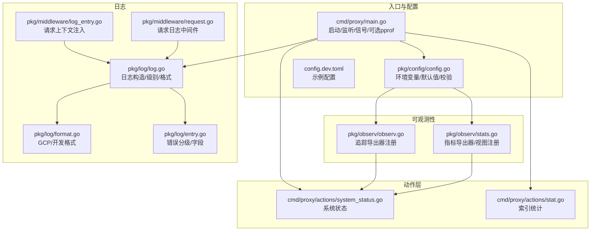
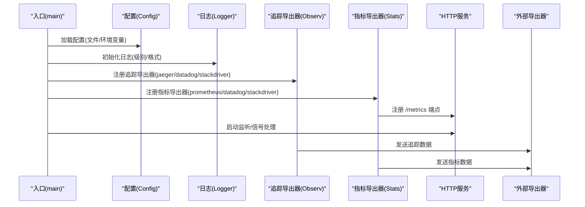
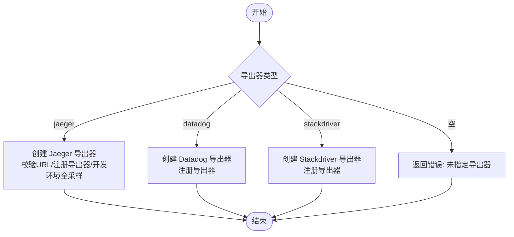
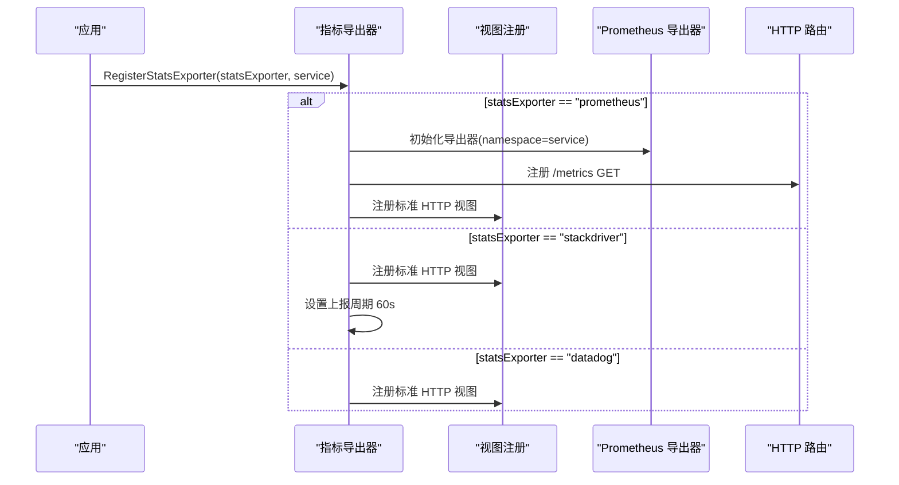
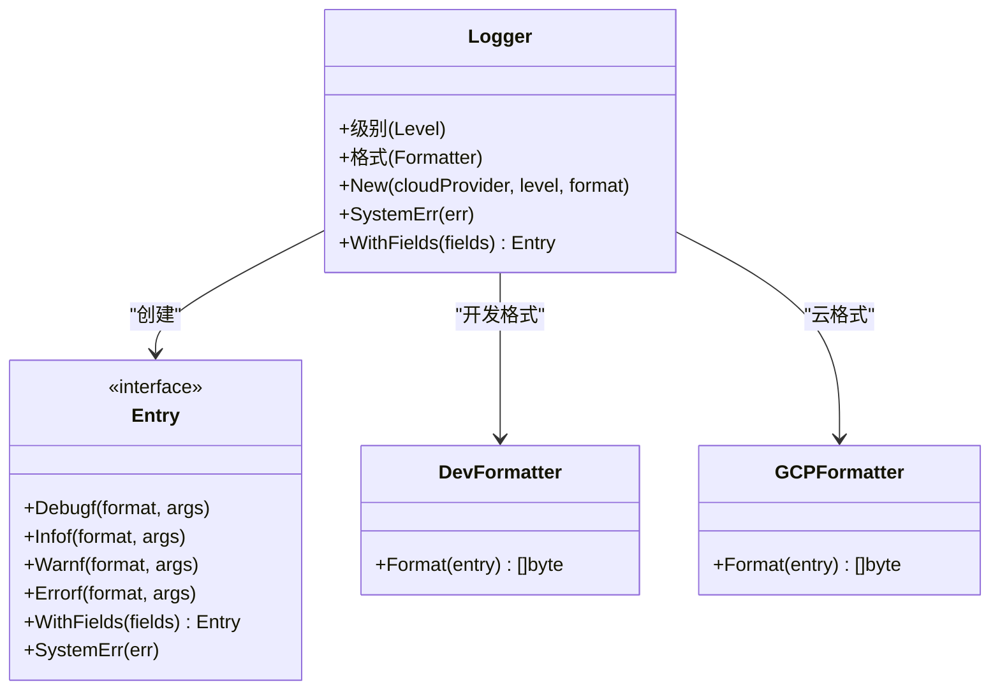
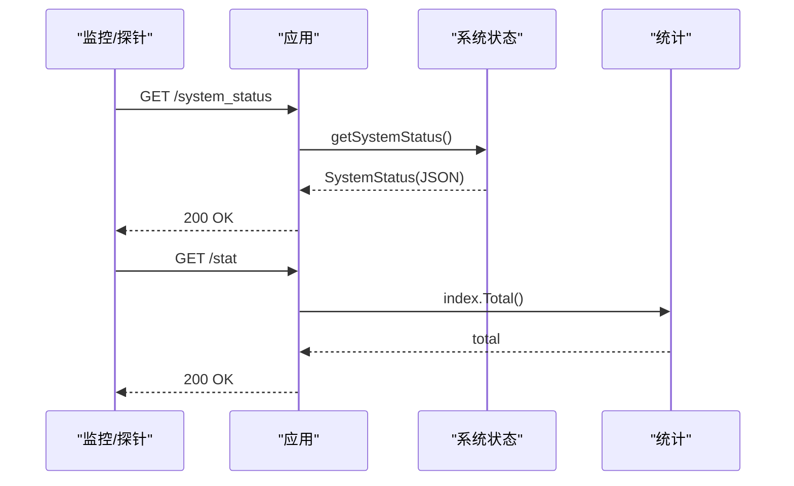
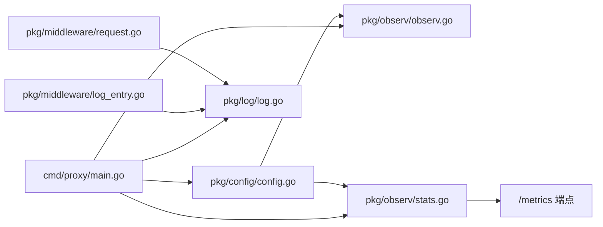

# 监控与可观测性

<cite>
**本文引用的文件**
- [cmd/proxy/main.go](file://cmd/proxy/main.go)
- [pkg/config/config.go](file://pkg/config/config.go)
- [config.dev.toml](file://config.dev.toml)
- [pkg/observ/observ.go](file://pkg/observ/observ.go)
- [pkg/observ/stats.go](file://pkg/observ/stats.go)
- [pkg/log/log.go](file://pkg/log/log.go)
- [pkg/log/format.go](file://pkg/log/format.go)
- [pkg/log/entry.go](file://pkg/log/entry.go)
- [pkg/middleware/log_entry.go](file://pkg/middleware/log_entry.go)
- [pkg/middleware/request.go](file://pkg/middleware/request.go)
- [cmd/proxy/actions/system_status.go](file://cmd/proxy/actions/system_status.go)
- [cmd/proxy/actions/stat.go](file://cmd/proxy/actions/stat.go)
</cite>

## 目录
1. [简介](#简介)
2. [项目结构](#项目结构)
3. [核心组件](#核心组件)
4. [架构总览](#架构总览)
5. [组件详解](#组件详解)
6. [依赖关系分析](#依赖关系分析)
7. [性能考量](#性能考量)
8. [故障排除指南](#故障排除指南)
9. [结论](#结论)
10. [附录](#附录)

## 简介
本文件面向运维与开发人员，系统化阐述 Athens 的监控与可观测性体系，覆盖以下方面：
- 分布式追踪：OpenCensus 集成、Jaeger/数据狗/Stackdriver 导出器注册与采样策略
- 指标采集：基于 OpenCensus 的 HTTP 视图（请求量、延迟、字节数、状态码分布等）与 Prometheus 导出端点
- 日志系统：日志级别、格式（开发/云原生）、上下文字段注入与错误分级记录
- 性能监控：指标含义、采集频率与存储策略
- 健康与系统状态：健康检查、就绪检查与系统运行态指标
- 故障排除：日志定位、pprof 开启、常见问题与监控方案

## 项目结构
与监控可观测性直接相关的代码主要分布在如下模块：
- 启动与入口：应用启动、监听、信号处理、可选 pprof
- 配置：日志、追踪、指标导出器、端口、单飞机制等
- 可观测性：追踪导出器注册、指标导出器注册与视图注册
- 日志：日志构造、格式化、上下文注入、错误分级
- 中间件：请求日志中间件、请求上下文日志条目注入
- 动作层：系统状态、统计接口（供外部监控拉取）

**图表来源**
- [cmd/proxy/main.go](file://cmd/proxy/main.go#L29-L127)
- [pkg/config/config.go](file://pkg/config/config.go#L21-L66)
- [config.dev.toml](file://config.dev.toml#L218-L234)
- [pkg/observ/observ.go](file://pkg/observ/observ.go#L14-L31)
- [pkg/observ/stats.go](file://pkg/observ/stats.go#L17-L46)
- [pkg/log/log.go](file://pkg/log/log.go#L13-L27)
- [pkg/log/format.go](file://pkg/log/format.go#L14-L22)
- [pkg/log/entry.go](file://pkg/log/entry.go#L37-L55)
- [pkg/middleware/log_entry.go](file://pkg/middleware/log_entry.go#L12-L29)
- [pkg/middleware/request.go](file://pkg/middleware/request.go#L22-L33)
- [cmd/proxy/actions/system_status.go](file://cmd/proxy/actions/system_status.go#L26-L64)
- [cmd/proxy/actions/stat.go](file://cmd/proxy/actions/stat.go#L15-L31)

**章节来源**
- [cmd/proxy/main.go](file://cmd/proxy/main.go#L29-L127)
- [pkg/config/config.go](file://pkg/config/config.go#L21-L66)
- [config.dev.toml](file://config.dev.toml#L218-L234)

## 核心组件
- 追踪导出器注册：支持 jaeger、datadog、stackdriver；开发环境默认全量采样
- 指标导出器注册：支持 prometheus、datadog、stackdriver；注册标准 HTTP 视图
- 日志系统：按云平台选择 JSON 格式或开发友好格式；统一错误分级与上下文字段
- 请求日志中间件：在请求处理前后记录状态码与上下文字段
- 系统状态与统计：提供健康/就绪与系统运行态指标，便于外部监控拉取

**章节来源**
- [pkg/observ/observ.go](file://pkg/observ/observ.go#L14-L31)
- [pkg/observ/stats.go](file://pkg/observ/stats.go#L17-L46)
- [pkg/log/log.go](file://pkg/log/log.go#L13-L27)
- [pkg/log/format.go](file://pkg/log/format.go#L14-L22)
- [pkg/log/entry.go](file://pkg/log/entry.go#L37-L55)
- [pkg/middleware/log_entry.go](file://pkg/middleware/log_entry.go#L12-L29)
- [pkg/middleware/request.go](file://pkg/middleware/request.go#L22-L33)
- [cmd/proxy/actions/system_status.go](file://cmd/proxy/actions/system_status.go#L26-L64)
- [cmd/proxy/actions/stat.go](file://cmd/proxy/actions/stat.go#L15-L31)

## 架构总览
下图展示从应用启动到可观测性导出的关键流程。

**图表来源**
- [cmd/proxy/main.go](file://cmd/proxy/main.go#L35-L62)
- [pkg/config/config.go](file://pkg/config/config.go#L36-L38)
- [pkg/observ/observ.go](file://pkg/observ/observ.go#L17-L31)
- [pkg/observ/stats.go](file://pkg/observ/stats.go#L19-L45)

## 组件详解

### 追踪与分布式追踪
- 支持导出器类型：jaeger、datadog、stackdriver
- 开发环境默认全量采样，生产环境建议配置采样策略
- 导出器初始化失败会返回错误，避免静默失败
- Jaeger 导出器包含服务名与固定 IP 标签，便于时钟偏移对齐

**图表来源**
- [pkg/observ/observ.go](file://pkg/observ/observ.go#L17-L31)
- [pkg/observ/observ.go](file://pkg/observ/observ.go#L36-L58)
- [pkg/observ/observ.go](file://pkg/observ/observ.go#L69-L77)
- [pkg/observ/observ.go](file://pkg/observ/observ.go#L79-L87)

**章节来源**
- [pkg/observ/observ.go](file://pkg/observ/observ.go#L14-L31)
- [pkg/observ/observ.go](file://pkg/observ/observ.go#L33-L58)
- [pkg/observ/observ.go](file://pkg/observ/observ.go#L67-L87)

### 指标与 Prometheus 集成
- 支持导出器类型：prometheus、datadog、stackdriver
- 注册标准 HTTP 视图：请求计数、响应字节、延迟、状态码分布、请求方法分布、客户端字节与延迟分布、完成计数
- Prometheus 导出器通过路由暴露 /metrics 端点
- Stackdriver 导出器设置上报周期为 60 秒

**图表来源**
- [pkg/observ/stats.go](file://pkg/observ/stats.go#L19-L46)
- [pkg/observ/stats.go](file://pkg/observ/stats.go#L48-L63)
- [pkg/observ/stats.go](file://pkg/observ/stats.go#L76-L90)
- [pkg/observ/stats.go](file://pkg/observ/stats.go#L92-L110)

**章节来源**
- [pkg/observ/stats.go](file://pkg/observ/stats.go#L17-L46)
- [pkg/observ/stats.go](file://pkg/observ/stats.go#L48-L63)
- [pkg/observ/stats.go](file://pkg/observ/stats.go#L76-L90)
- [pkg/observ/stats.go](file://pkg/observ/stats.go#L92-L110)

### 日志系统与格式化
- 日志构造：根据云平台选择 GCP JSON 格式或开发友好格式；支持级别控制
- 错误分级：将错误映射为 warn/info/debug/error 并附加操作、种类、模块、版本、操作链等字段
- 上下文注入：中间件在请求上下文中注入请求方法、路径、请求 ID 与日志条目
- 请求日志：在请求完成后输出状态码与上下文字段，便于开发调试

**图表来源**
- [pkg/log/log.go](file://pkg/log/log.go#L7-L27)
- [pkg/log/entry.go](file://pkg/log/entry.go#L8-L26)
- [pkg/log/format.go](file://pkg/log/format.go#L14-L22)
- [pkg/log/format.go](file://pkg/log/format.go#L24-L56)

**章节来源**
- [pkg/log/log.go](file://pkg/log/log.go#L13-L27)
- [pkg/log/format.go](file://pkg/log/format.go#L14-L22)
- [pkg/log/format.go](file://pkg/log/format.go#L24-L56)
- [pkg/log/entry.go](file://pkg/log/entry.go#L37-L55)
- [pkg/middleware/log_entry.go](file://pkg/middleware/log_entry.go#L12-L29)
- [pkg/middleware/request.go](file://pkg/middleware/request.go#L22-L33)

### 系统状态与健康/就绪检查
- 系统状态接口：提供运行时长、版本、Go 版本、内存占用等信息
- 健康/就绪检查：可通过 /health 与 /readyz 路径进行探测（基础认证例外路径）
- 统计接口：提供索引总量统计，便于监控面板聚合

**图表来源**
- [cmd/proxy/actions/system_status.go](file://cmd/proxy/actions/system_status.go#L26-L64)
- [cmd/proxy/actions/stat.go](file://cmd/proxy/actions/stat.go#L15-L31)

**章节来源**
- [cmd/proxy/actions/system_status.go](file://cmd/proxy/actions/system_status.go#L26-L64)
- [cmd/proxy/actions/stat.go](file://cmd/proxy/actions/stat.go#L15-L31)

## 依赖关系分析
- 入口依赖配置加载与日志初始化，随后注册追踪与指标导出器
- 配置中定义了追踪与指标导出器类型、导出器 URL/ProjectID、日志级别与格式等关键参数
- 日志中间件贯穿请求生命周期，确保每个请求都有上下文日志条目
- 指标导出器注册后自动采集 HTTP 视图，Prometheus 通过 /metrics 暴露

**图表来源**
- [cmd/proxy/main.go](file://cmd/proxy/main.go#L35-L62)
- [pkg/config/config.go](file://pkg/config/config.go#L36-L38)
- [pkg/observ/observ.go](file://pkg/observ/observ.go#L17-L31)
- [pkg/observ/stats.go](file://pkg/observ/stats.go#L19-L45)
- [pkg/middleware/log_entry.go](file://pkg/middleware/log_entry.go#L12-L29)
- [pkg/middleware/request.go](file://pkg/middleware/request.go#L22-L33)

**章节来源**
- [cmd/proxy/main.go](file://cmd/proxy/main.go#L35-L62)
- [pkg/config/config.go](file://pkg/config/config.go#L36-L38)
- [pkg/observ/observ.go](file://pkg/observ/observ.go#L17-L31)
- [pkg/observ/stats.go](file://pkg/observ/stats.go#L19-L45)
- [pkg/middleware/log_entry.go](file://pkg/middleware/log_entry.go#L12-L29)
- [pkg/middleware/request.go](file://pkg/middleware/request.go#L22-L33)

## 性能考量
- 指标采集频率
  - Prometheus：无显式上报周期，由 Prometheus 抓取决定
  - Stackdriver：上报周期固定为 60 秒
- 追踪采样
  - 开发环境默认全量采样，生产环境建议配置采样策略以降低开销
- 日志级别
  - 生产环境建议使用 info 或更高级别，避免过多 debug 输出
- pprof
  - 可选开启，建议仅在排障时启用并限制访问端口

[本节为通用指导，无需特定文件来源]

## 故障排除指南
- 启动失败或导出器未生效
  - 检查追踪/指标导出器类型与 URL/ProjectID 是否正确
  - 查看启动日志中关于导出器初始化的错误信息
- 指标缺失
  - 确认已注册指标导出器且 /metrics 路由已注册
  - 检查 Prometheus 抓取目标是否可达
- 日志异常
  - 核对日志级别与格式配置
  - 使用请求日志中间件确认请求状态码与上下文字段
- 排障工具
  - 可选 pprof 端口用于性能分析，注意安全暴露范围
- 常见问题
  - 导出器 URL 为空：追踪导出器初始化会报错
  - 未指定导出器：指标与追踪均不会被采集

**章节来源**
- [pkg/observ/observ.go](file://pkg/observ/observ.go#L36-L40)
- [pkg/observ/stats.go](file://pkg/observ/stats.go#L23-L40)
- [cmd/proxy/main.go](file://cmd/proxy/main.go#L69-L77)
- [pkg/middleware/request.go](file://pkg/middleware/request.go#L22-L33)

## 结论
Athens 的监控与可观测性以 OpenCensus 为核心，结合 Jaeger/数据狗/Stackdriver 实现分布式追踪，通过 Prometheus/数据狗/Stackdriver 提供指标采集与可视化。日志系统支持多格式与错误分级，配合请求中间件实现上下文追踪。建议在生产环境合理配置采样率、上报周期与日志级别，并通过 /metrics 与系统状态接口完善监控面板与告警策略。

[本节为总结，无需特定文件来源]

## 附录

### 配置项与监控相关要点
- 追踪导出器类型与 URL/ProjectID
  - 类型：ATHENS_TRACE_EXPORTER
  - URL/ProjectID：ATHENS_TRACE_EXPORTER_URL
- 指标导出器类型
  - 类型：ATHENS_STATS_EXPORTER
- 日志级别与格式
  - 级别：ATHENS_LOG_LEVEL
  - 格式：ATHENS_LOG_FORMAT
  - 云运行时：ATHENS_CLOUD_RUNTIME
- 端口与 pprof
  - 端口：ATHENS_PORT 或 PORT
  - pprof：ATHENS_ENABLE_PPROF、ATHENS_PPROF_PORT

**章节来源**
- [pkg/config/config.go](file://pkg/config/config.go#L36-L38)
- [pkg/config/config.go](file://pkg/config/config.go#L30-L32)
- [pkg/config/config.go](file://pkg/config/config.go#L33-L34)
- [pkg/config/config.go](file://pkg/config/config.go#L41-L42)
- [config.dev.toml](file://config.dev.toml#L218-L234)
- [config.dev.toml](file://config.dev.toml#L76-L84)
- [config.dev.toml](file://config.dev.toml#L91-L98)
- [config.dev.toml](file://config.dev.toml#L134-L143)