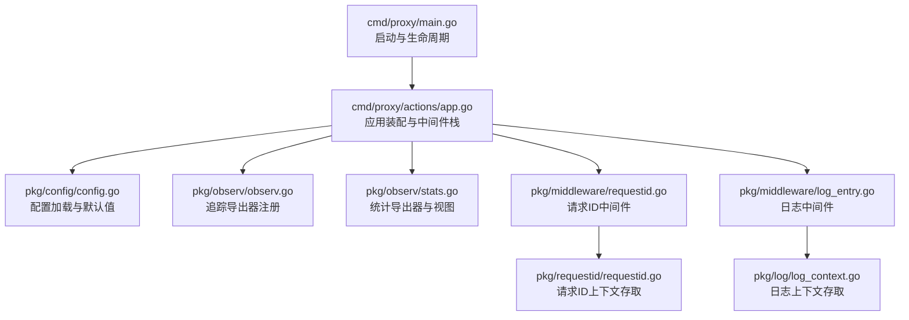
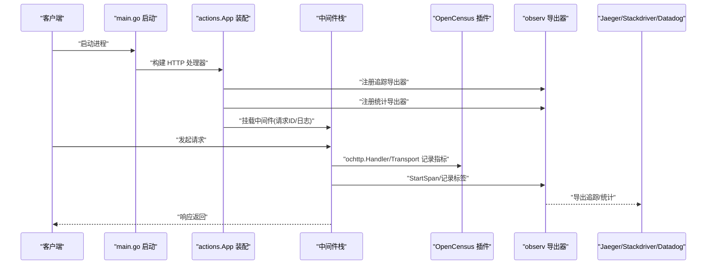
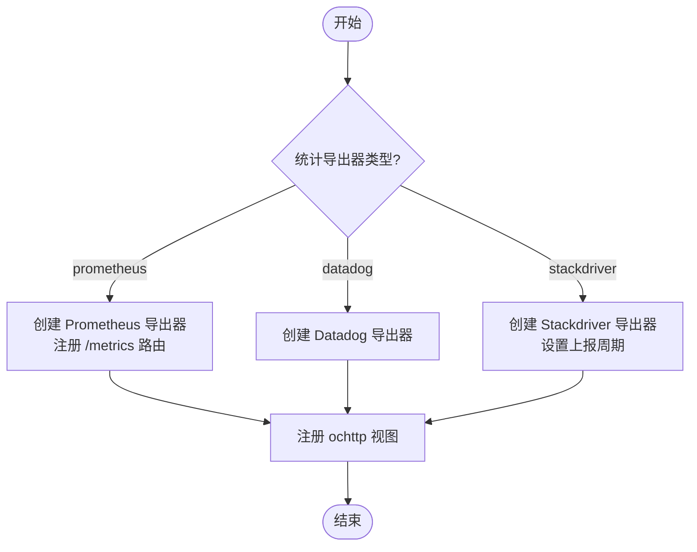
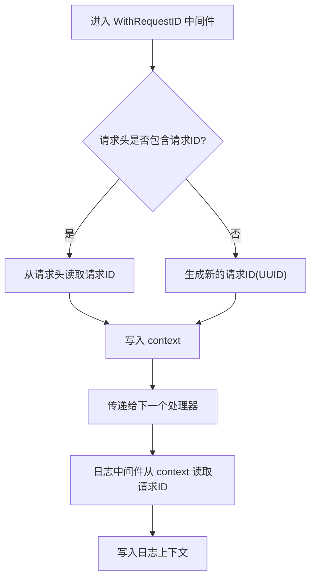
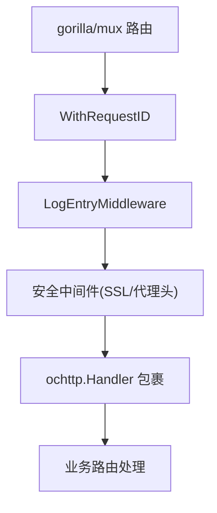
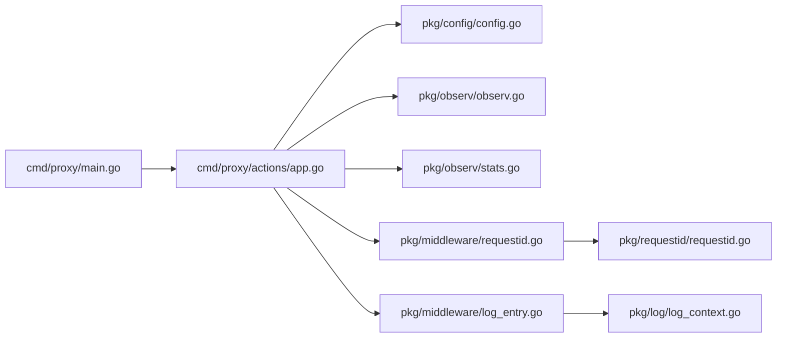

# 追踪系统

<cite>
**本文引用的文件**
- [cmd/proxy/main.go](file://cmd/proxy/main.go)
- [cmd/proxy/actions/app.go](file://cmd/proxy/actions/app.go)
- [pkg/config/config.go](file://pkg/config/config.go)
- [pkg/observ/observ.go](file://pkg/observ/observ.go)
- [pkg/observ/stats.go](file://pkg/observ/stats.go)
- [pkg/middleware/requestid.go](file://pkg/middleware/requestid.go)
- [pkg/requestid/requestid.go](file://pkg/requestid/requestid.go)
- [pkg/middleware/log_entry.go](file://pkg/middleware/log_entry.go)
- [pkg/log/log_context.go](file://pkg/log/log_context.go)
- [config.dev.toml](file://config.dev.toml)
</cite>

## 目录
1. [简介](#简介)
2. [项目结构](#项目结构)
3. [核心组件](#核心组件)
4. [架构总览](#架构总览)
5. [组件详解](#组件详解)
6. [依赖关系分析](#依赖关系分析)
7. [性能考量](#性能考量)
8. [故障排查指南](#故障排查指南)
9. [结论](#结论)
10. [附录](#附录)

## 简介
本文件面向开发者与运维人员，系统性阐述 Athens 的分布式追踪体系，包括 OpenCensus 与 Jaeger 的集成配置、追踪上下文传播、链路追踪实现、请求 ID 生成、采样策略、数据收集与可视化、性能瓶颈定位与错误追踪、调试工具使用、配置优化、存储策略与隐私保护等。目标是帮助你在多服务环境中快速建立可观测性能力，并以最小开销获得最大收益。

## 项目结构
追踪系统在应用中的位置与职责如下：
- 入口与生命周期：服务启动、监听端口、优雅关闭
- 应用装配：注册追踪导出器、统计导出器、中间件栈（含请求 ID 与日志）
- 配置：追踪导出器类型与地址、统计导出器类型、环境变量等
- 观测层：OpenCensus 导出器注册、Jaeger/Stackdriver/Datadog 支持、统计视图注册
- 上下文传播：请求 ID 在请求上下文与日志上下文中的传递



图表来源
- [cmd/proxy/main.go](file://cmd/proxy/main.go#L29-L127)
- [cmd/proxy/actions/app.go](file://cmd/proxy/actions/app.go#L23-L138)
- [pkg/config/config.go](file://pkg/config/config.go#L22-L66)
- [pkg/observ/observ.go](file://pkg/observ/observ.go#L17-L93)
- [pkg/observ/stats.go](file://pkg/observ/stats.go#L19-L110)
- [pkg/middleware/requestid.go](file://pkg/middleware/requestid.go#L13-L23)
- [pkg/requestid/requestid.go](file://pkg/requestid/requestid.go#L11-L21)
- [pkg/middleware/log_entry.go](file://pkg/middleware/log_entry.go#L14-L29)
- [pkg/log/log_context.go](file://pkg/log/log_context.go#L11-L24)

章节来源
- [cmd/proxy/main.go](file://cmd/proxy/main.go#L29-L127)
- [cmd/proxy/actions/app.go](file://cmd/proxy/actions/app.go#L23-L138)
- [pkg/config/config.go](file://pkg/config/config.go#L22-L66)

## 核心组件
- 追踪导出器注册：根据配置选择 Jaeger/Stackdriver/Datadog，按开发/生产环境应用默认采样策略
- 统计导出器注册：支持 Prometheus、Stackdriver、Datadog；注册 ochttp 内置视图
- 请求 ID 中间件：从请求头或生成 UUID，注入上下文并在日志中透传
- 日志中间件：将请求方法、路径、请求 ID 注入日志上下文
- OpenCensus 插件：HTTP Handler/Transport 埋点，自动采集延迟、字节数、状态码等

章节来源
- [pkg/observ/observ.go](file://pkg/observ/observ.go#L17-L93)
- [pkg/observ/stats.go](file://pkg/observ/stats.go#L19-L110)
- [pkg/middleware/requestid.go](file://pkg/middleware/requestid.go#L13-L23)
- [pkg/requestid/requestid.go](file://pkg/requestid/requestid.go#L11-L21)
- [pkg/middleware/log_entry.go](file://pkg/middleware/log_entry.go#L14-L29)
- [pkg/log/log_context.go](file://pkg/log/log_context.go#L11-L24)

## 架构总览
下图展示从请求进入应用到追踪与统计导出的整体流程，以及关键组件之间的交互。



图表来源
- [cmd/proxy/main.go](file://cmd/proxy/main.go#L29-L127)
- [cmd/proxy/actions/app.go](file://cmd/proxy/actions/app.go#L74-L135)
- [pkg/observ/observ.go](file://pkg/observ/observ.go#L17-L93)
- [pkg/observ/stats.go](file://pkg/observ/stats.go#L19-L110)

## 组件详解

### 追踪导出器注册与采样策略
- 导出器类型：支持 jaeger、datadog、stackdriver；未指定则不导出追踪
- 默认采样：开发环境默认全量采样；生产环境使用默认采样策略
- Jaeger 导出器：通过配置项设置导出端点与服务名；内置 ip 标签用于时钟同步
- 错误处理：当导出器 URL 为空或初始化失败时返回错误，应用仍可运行但不导出

```mermaid
flowchart TD
Start(["开始"]) --> CheckType{"导出器类型?"}
CheckType --> |jaeger| Jaeger["创建 Jaeger 导出器"]
CheckType --> |datadog| DD["创建 Datadog 导出器"]
CheckType --> |stackdriver| SD["创建 Stackdriver 导出器"]
CheckType --> |""| None["无导出器(跳过)"]
Jaeger --> EnvCheck{"环境=development?"}
DD --> EnvCheck
SD --> EnvCheck
EnvCheck --> |是| Always["AlwaysSample"]
EnvCheck --> |否| Default["默认采样策略"]
Jaeger --> Flush["注册并返回 Flush 函数"]
DD --> Stop["注册并返回 Stop 函数"]
SD --> FlushSD["注册并返回 Flush 函数"]
None --> End(["结束"])
Always --> End
Default --> End
Flush --> End
Stop --> End
FlushSD --> End
```

图表来源
- [pkg/observ/observ.go](file://pkg/observ/observ.go#L17-L93)

章节来源
- [pkg/observ/observ.go](file://pkg/observ/observ.go#L17-L93)

### 统计导出器与视图注册
- 统计导出器：支持 prometheus、datadog、stackdriver
- 视图注册：自动注册 ochttp 的服务端/客户端关键指标（请求数、字节数、延迟分布、完成数等）
- Prometheus：在路由上暴露 /metrics；Stackdriver：设置上报周期并返回 Flush



图表来源
- [pkg/observ/stats.go](file://pkg/observ/stats.go#L19-L110)

章节来源
- [pkg/observ/stats.go](file://pkg/observ/stats.go#L19-L110)

### 请求 ID 生成与上下文传播
- 请求 ID 来源：优先读取请求头；若不存在则生成新 ID
- 上下文存储：将请求 ID 存入 context，供日志与后续处理使用
- 请求头键名：统一使用固定头部键名，便于跨服务传递
- 日志中间件：将请求 ID 注入日志上下文，确保每条日志可关联同一请求



图表来源
- [pkg/middleware/requestid.go](file://pkg/middleware/requestid.go#L13-L23)
- [pkg/requestid/requestid.go](file://pkg/requestid/requestid.go#L11-L21)
- [pkg/middleware/log_entry.go](file://pkg/middleware/log_entry.go#L14-L29)
- [pkg/log/log_context.go](file://pkg/log/log_context.go#L11-L24)

章节来源
- [pkg/middleware/requestid.go](file://pkg/middleware/requestid.go#L13-L23)
- [pkg/requestid/requestid.go](file://pkg/requestid/requestid.go#L11-L21)
- [pkg/middleware/log_entry.go](file://pkg/middleware/log_entry.go#L14-L29)
- [pkg/log/log_context.go](file://pkg/log/log_context.go#L11-L24)

### 应用装配与中间件栈
- 中间件顺序：请求 ID → 日志 → 安全头（如强制 HTTPS）→ 可选 BasicAuth/过滤/校验钩子
- OpenCensus 插件：使用 ochttp.Handler 包裹整个路由，自动采集 HTTP 指标
- 统计导出器：根据配置注册 Prometheus/Stackdriver/Datadog
- 追踪导出器：根据配置注册 Jaeger/Stackdriver/Datadog



图表来源
- [cmd/proxy/actions/app.go](file://cmd/proxy/actions/app.go#L46-L135)

章节来源
- [cmd/proxy/actions/app.go](file://cmd/proxy/actions/app.go#L46-L135)

### 配置与默认值
- 追踪导出器：可通过环境变量或配置文件设置类型与导出地址
- 统计导出器：默认启用 Prometheus
- 环境变量：GoEnv 控制采样策略；Port/UnixSocket 决定监听方式
- 开发模式默认值：包含默认追踪导出地址与统计导出器

章节来源
- [pkg/config/config.go](file://pkg/config/config.go#L36-L38)
- [pkg/config/config.go](file://pkg/config/config.go#L158-L168)
- [config.dev.toml](file://config.dev.toml#L218-L234)
- [config.dev.toml](file://config.dev.toml#L223-L228)

## 依赖关系分析
- 入口依赖应用装配模块，应用装配模块依赖配置、观测与中间件
- 观测模块依赖 OpenCensus 生态与第三方导出器
- 中间件依赖请求 ID 与日志上下文模块



图表来源
- [cmd/proxy/main.go](file://cmd/proxy/main.go#L29-L127)
- [cmd/proxy/actions/app.go](file://cmd/proxy/actions/app.go#L23-L138)
- [pkg/config/config.go](file://pkg/config/config.go#L22-L66)
- [pkg/observ/observ.go](file://pkg/observ/observ.go#L17-L93)
- [pkg/observ/stats.go](file://pkg/observ/stats.go#L19-L110)
- [pkg/middleware/requestid.go](file://pkg/middleware/requestid.go#L13-L23)
- [pkg/requestid/requestid.go](file://pkg/requestid/requestid.go#L11-L21)
- [pkg/middleware/log_entry.go](file://pkg/middleware/log_entry.go#L14-L29)
- [pkg/log/log_context.go](file://pkg/log/log_context.go#L11-L24)

章节来源
- [cmd/proxy/main.go](file://cmd/proxy/main.go#L29-L127)
- [cmd/proxy/actions/app.go](file://cmd/proxy/actions/app.go#L23-L138)

## 性能考量
- 采样策略：开发环境全量采样便于调试；生产环境使用默认策略以降低开销
- 指标维度：ochttp 内置视图覆盖延迟、吞吐、字节数与状态码分布，建议结合业务自定义视图
- 导出器选择：Prometheus 适合高基数指标与即时查询；Jaeger/Stackdriver/Datadog 适合集中式聚合与检索
- 端口与安全：pprof 独立端口避免暴露敏感信息；TLS 证书与端口配置需谨慎
- 关闭流程：优雅关闭等待超时，确保未完成请求得到妥善处理

[本节为通用指导，无需特定文件引用]

## 故障排查指南
- 追踪未导出：检查导出器类型与 URL 是否正确；确认环境变量与配置文件一致
- 统计未上报：确认统计导出器类型与路由是否注册；Prometheus 需检查 /metrics 路由
- 请求 ID 缺失：确认请求头是否携带请求 ID；中间件是否正确注入上下文
- 日志无请求 ID：检查日志中间件是否在中间件栈中；确认日志上下文是否正确读取
- pprof 暴露问题：确认独立端口与访问控制；避免在公网暴露

章节来源
- [pkg/observ/observ.go](file://pkg/observ/observ.go#L17-L31)
- [pkg/observ/stats.go](file://pkg/observ/stats.go#L19-L46)
- [pkg/middleware/requestid.go](file://pkg/middleware/requestid.go#L13-L23)
- [pkg/middleware/log_entry.go](file://pkg/middleware/log_entry.go#L14-L29)
- [cmd/proxy/main.go](file://cmd/proxy/main.go#L69-L77)

## 结论
Athens 的追踪系统基于 OpenCensus 与 gorilla/mux/ochttp 插件，实现了从请求进入、指标采集、上下文传播到导出器输出的完整链路。通过配置化导出器与采样策略，既能满足开发调试需求，也能在生产环境保持较低开销。配合 Prometheus/Stackdriver/Datadog 等导出器，可实现链路可视化、性能分析与错误追踪，为分布式系统调试与优化提供坚实基础。

[本节为总结，无需特定文件引用]

## 附录

### 追踪数据可视化与调试
- Jaeger UI：通过 Jaeger 导出器查看服务拓扑、跨度耗时与错误
- Prometheus：访问 /metrics 查看指标；结合 Grafana 做可视化
- Stackdriver/Datadog：在对应平台查看聚合与告警

[本节为通用指导，无需特定文件引用]

### 配置优化与最佳实践
- 开发环境：开启 AlwaysSample，便于全量追踪
- 生产环境：使用默认采样策略，降低 CPU/网络开销
- 导出器选择：根据团队技术栈与预算选择合适导出器
- 请求 ID：统一头部键名，确保跨服务一致性
- 日志：将请求 ID 注入日志上下文，提升关联分析效率

章节来源
- [pkg/observ/observ.go](file://pkg/observ/observ.go#L60-L65)
- [pkg/middleware/requestid.go](file://pkg/middleware/requestid.go#L13-L23)
- [pkg/middleware/log_entry.go](file://pkg/middleware/log_entry.go#L14-L29)
- [config.dev.toml](file://config.dev.toml#L218-L234)

### 隐私保护与安全
- pprof 独立端口暴露：避免与业务端口同端口，防止敏感信息泄露
- TLS：在生产环境启用证书与密钥，避免明文传输
- 过滤与鉴权：结合 BasicAuth、过滤规则与校验钩子，限制访问范围

章节来源
- [cmd/proxy/main.go](file://cmd/proxy/main.go#L69-L109)
- [cmd/proxy/actions/app.go](file://cmd/proxy/actions/app.go#L96-L118)
- [pkg/config/config.go](file://pkg/config/config.go#L52-L53)