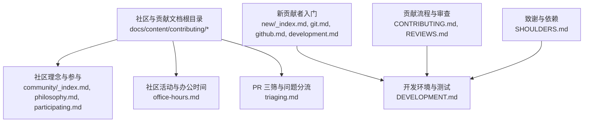
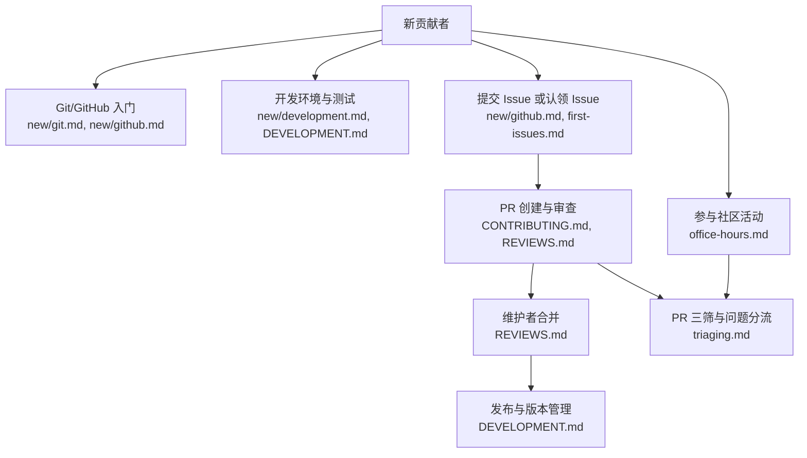
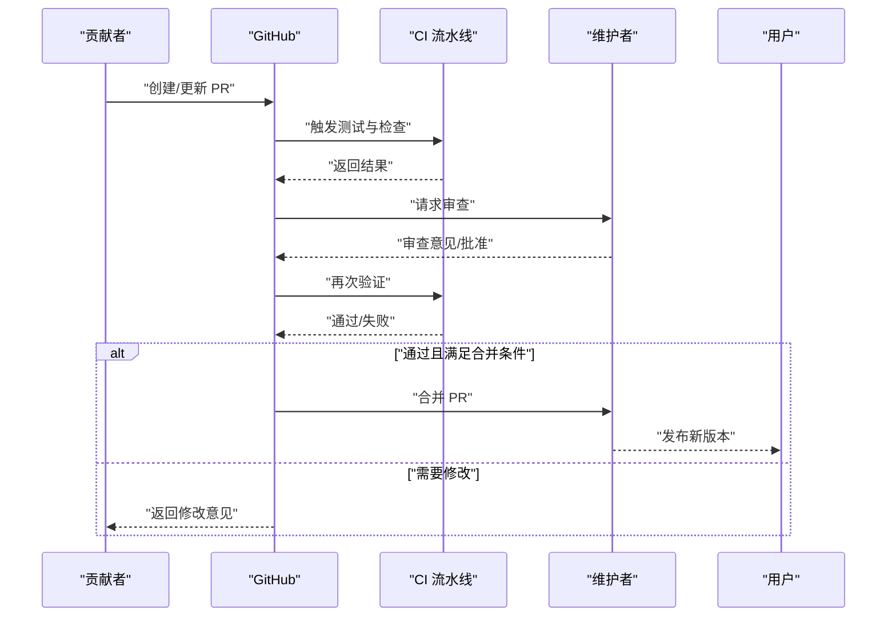
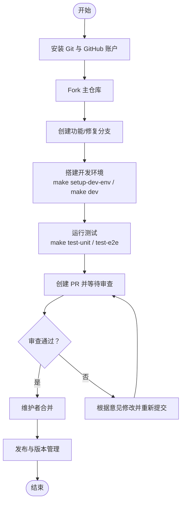
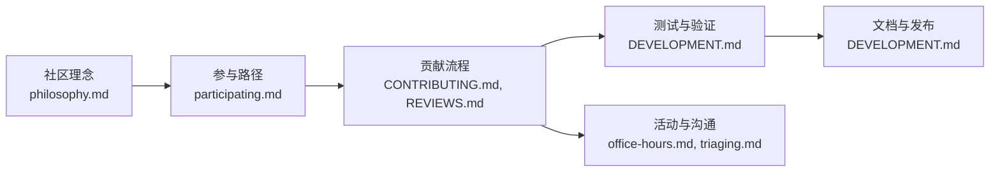

# 社区与贡献

<cite>
**本文引用的文件**
- [CONTRIBUTING.md](file://CONTRIBUTING.md)
- [DEVELOPMENT.md](file://DEVELOPMENT.md)
- [REVIEWS.md](file://REVIEWS.md)
- [PHILOSOPHY.md](file://PHILOSOPHY.md)
- [SHOULDERS.md](file://SHOULDERS.md)
- [docs/content/contributing/community/_index.md](file://docs/content/contributing/community/_index.md)
- [docs/content/contributing/community/philosophy.md](file://docs/content/contributing/community/philosophy.md)
- [docs/content/contributing/community/participating.md](file://docs/content/contributing/community/participating.md)
- [docs/content/contributing/community/triaging.md](file://docs/content/contributing/community/triaging.md)
- [docs/content/contributing/community/office-hours.md](file://docs/content/contributing/community/office-hours.md)
- [docs/content/contributing/new/_index.md](file://docs/content/contributing/new/_index.md)
- [docs/content/contributing/new/development.md](file://docs/content/contributing/new/development.md)
- [docs/content/contributing/new/git.md](file://docs/content/contributing/new/git.md)
- [docs/content/contributing/new/github.md](file://docs/content/contributing/new/github.md)
- [docs/content/contributing/first-issues.md](file://docs/content/contributing/first-issues.md)
</cite>

## 目录
1. [简介](#简介)
2. [项目结构](#项目结构)
3. [核心组件](#核心组件)
4. [架构总览](#架构总览)
5. [详细组件分析](#详细组件分析)
6. [依赖分析](#依赖分析)
7. [性能考虑](#性能考虑)
8. [故障排查指南](#故障排查指南)
9. [结论](#结论)
10. [附录](#附录)

## 简介
本指南面向所有希望参与 Athens 社区与贡献的人员，涵盖社区文化与行为准则、参与方式、贡献流程（Issue 提交、Pull Request 创建与代码审查）、新贡献者入门路径、治理结构与角色职责、社区活动与沟通渠道，以及维护者管理与协作最佳实践。目标是营造友好、多元、包容的社区氛围，帮助不同背景的贡献者高效参与。

## 项目结构
本仓库包含后端服务、前端界面、测试与脚本、以及完整的社区与贡献文档。社区与贡献相关的权威文档主要分布在以下位置：
- 根级贡献与开发指南：CONTRIBUTING.md、DEVELOPMENT.md、REVIEWS.md
- 社区理念与参与：docs/content/contributing/community/*
- 新贡献者入门：docs/content/contributing/new/*
- 贡献者与维护者角色：docs/content/contributing/community/participating.md
- 社区活动与办公时间：docs/content/contributing/community/office-hours.md
- 问题分流与 PR 三筛：docs/content/contributing/community/triaging.md
- 首次贡献议题模板：docs/content/contributing/first-issues.md
- 致谢与依赖：SHOULDERS.md

**图表来源**
- [docs/content/contributing/community/_index.md](file://docs/content/contributing/community/_index.md#L1-L18)
- [docs/content/contributing/community/philosophy.md](file://docs/content/contributing/community/philosophy.md#L1-L69)
- [docs/content/contributing/community/participating.md](file://docs/content/contributing/community/participating.md#L1-L104)
- [docs/content/contributing/community/office-hours.md](file://docs/content/contributing/community/office-hours.md#L1-L30)
- [docs/content/contributing/community/triaging.md](file://docs/content/contributing/community/triaging.md#L1-L71)
- [docs/content/contributing/new/_index.md](file://docs/content/contributing/new/_index.md#L1-L15)
- [docs/content/contributing/new/git.md](file://docs/content/contributing/new/git.md#L1-L76)
- [docs/content/contributing/new/github.md](file://docs/content/contributing/new/github.md#L1-L107)
- [docs/content/contributing/new/development.md](file://docs/content/contributing/new/development.md#L1-L93)
- [CONTRIBUTING.md](file://CONTRIBUTING.md#L1-L41)
- [REVIEWS.md](file://REVIEWS.md#L1-L79)
- [DEVELOPMENT.md](file://DEVELOPMENT.md#L1-L314)
- [SHOULDERS.md](file://SHOULDERS.md#L1-L107)

**章节来源**
- [CONTRIBUTING.md](file://CONTRIBUTING.md#L1-L41)
- [DEVELOPMENT.md](file://DEVELOPMENT.md#L1-L314)
- [REVIEWS.md](file://REVIEWS.md#L1-L79)
- [PHILOSOPHY.md](file://PHILOSOPHY.md#L1-L5)
- [SHOULDERS.md](file://SHOULDERS.md#L1-L107)
- [docs/content/contributing/community/_index.md](file://docs/content/contributing/community/_index.md#L1-L18)
- [docs/content/contributing/community/philosophy.md](file://docs/content/contributing/community/philosophy.md#L1-L69)
- [docs/content/contributing/community/participating.md](file://docs/content/contributing/community/participating.md#L1-L104)
- [docs/content/contributing/community/triaging.md](file://docs/content/contributing/community/triaging.md#L1-L71)
- [docs/content/contributing/community/office-hours.md](file://docs/content/contributing/community/office-hours.md#L1-L30)
- [docs/content/contributing/new/_index.md](file://docs/content/contributing/new/_index.md#L1-L15)
- [docs/content/contributing/new/development.md](file://docs/content/contributing/new/development.md#L1-L93)
- [docs/content/contributing/new/git.md](file://docs/content/contributing/new/git.md#L1-L76)
- [docs/content/contributing/new/github.md](file://docs/content/contributing/new/github.md#L1-L107)
- [docs/content/contributing/first-issues.md](file://docs/content/contributing/first-issues.md#L1-L48)

## 核心组件
- 社区文化与行为准则
  - 哲学与原则：友善、降低认知负荷、聚焦社区、鼓励提问
  - 包容性与多样性：欢迎所有人，尊重差异，促进新成员融入
- 参与角色与晋升路径
  - 社区成员 → 贡献者 → 维护者
  - 贡献者具备读取权限与 PR 审查建议权
- 贡献流程
  - Issue 提交与认领
  - 开发环境搭建与验证
  - PR 创建与审查
  - 合并与发布
- 社区活动与沟通
  - 办公时间（Office Hours）
  - PR 三筛（周一、三、五）
  - Slack 与 Zoom 等沟通渠道
- 新贡献者支持
  - Git/GitHub 入门
  - 开发环境与测试指南
  - 首次贡献议题模板

**章节来源**
- [docs/content/contributing/community/philosophy.md](file://docs/content/contributing/community/philosophy.md#L12-L69)
- [docs/content/contributing/community/participating.md](file://docs/content/contributing/community/participating.md#L18-L104)
- [docs/content/contributing/community/triaging.md](file://docs/content/contributing/community/triaging.md#L10-L71)
- [docs/content/contributing/community/office-hours.md](file://docs/content/contributing/community/office-hours.md#L7-L30)
- [docs/content/contributing/new/git.md](file://docs/content/contributing/new/git.md#L9-L76)
- [docs/content/contributing/new/github.md](file://docs/content/contributing/new/github.md#L10-L107)
- [docs/content/contributing/new/development.md](file://docs/content/contributing/new/development.md#L6-L93)
- [docs/content/contributing/first-issues.md](file://docs/content/contributing/first-issues.md#L25-L48)

## 架构总览
下图展示了从“新贡献者”到“PR 审查与合并”的整体流程，以及社区活动与治理支撑：

**图表来源**
- [docs/content/contributing/new/git.md](file://docs/content/contributing/new/git.md#L1-L76)
- [docs/content/contributing/new/github.md](file://docs/content/contributing/new/github.md#L1-L107)
- [docs/content/contributing/new/development.md](file://docs/content/contributing/new/development.md#L1-L93)
- [docs/content/contributing/first-issues.md](file://docs/content/contributing/first-issues.md#L1-L48)
- [CONTRIBUTING.md](file://CONTRIBUTING.md#L6-L41)
- [REVIEWS.md](file://REVIEWS.md#L10-L79)
- [docs/content/contributing/community/triaging.md](file://docs/content/contributing/community/triaging.md#L10-L71)
- [docs/content/contributing/community/office-hours.md](file://docs/content/contributing/community/office-hours.md#L7-L30)
- [DEVELOPMENT.md](file://DEVELOPMENT.md#L243-L314)

## 详细组件分析

### 社区文化与行为准则
- 指导原则
  - 友善、包容、尊重差异
  - 降低认知负荷，简化上手流程
  - 聚焦社区建设，避免“单打独斗”
  - 鼓励提问与记录答案，形成知识沉淀
- 行为边界
  - 明确社区行为准则与致谢清单，尊重他人贡献
- 多元与包容
  - 强调“绝对欢迎”，不论编程经验、身份背景等

**章节来源**
- [docs/content/contributing/community/philosophy.md](file://docs/content/contributing/community/philosophy.md#L12-L69)
- [docs/content/contributing/community/_index.md](file://docs/content/contributing/community/_index.md#L11-L18)
- [PHILOSOPHY.md](file://PHILOSOPHY.md#L1-L5)
- [SHOULDERS.md](file://SHOULDERS.md#L1-L107)

### 参与角色与晋升路径
- 角色定义
  - 社区成员：可评论、提 PR、审阅 PR、参加办公时间
  - 贡献者：具备读取权限，可被指派任务与审阅 PR
  - 维护者：最终批准与合并 PR，负责发布与治理
- 晋升路径
  - 积极参与、定期出席办公时间、高质量审阅与贡献
  - 与维护者沟通，获得反馈与指导

**章节来源**
- [docs/content/contributing/community/participating.md](file://docs/content/contributing/community/participating.md#L18-L104)

### 贡献流程与规范
- Issue 提交与认领
  - 使用模板描述问题或特性；无现成 Issue 时先开讨论
  - 认领时在 Issue 下留言表达意向，避免重复劳动
- 开发与验证
  - 使用 Makefile 快速搭建本地环境与依赖
  - 运行单元测试、端到端测试与静态检查，确保通过 CI 标准
- PR 创建与审查
  - 遵循审查流程与类型选择（请求修改、评论、批准）
  - 重要变更需至少一名维护者审查并通过 CI
  - 遵循“先审阅、再合并”的原则，保持开放期以便跨时区审阅
- 合并与发布
  - 维护者使用 Squash 合并策略，遵循语义化版本号
  - 发布由自动化流程配合维护者操作完成

**图表来源**
- [CONTRIBUTING.md](file://CONTRIBUTING.md#L6-L41)
- [REVIEWS.md](file://REVIEWS.md#L10-L79)
- [DEVELOPMENT.md](file://DEVELOPMENT.md#L243-L314)

**章节来源**
- [CONTRIBUTING.md](file://CONTRIBUTING.md#L6-L41)
- [REVIEWS.md](file://REVIEWS.md#L10-L79)
- [DEVELOPMENT.md](file://DEVELOPMENT.md#L166-L220)

### 新贡献者入门
- Git/GitHub 基础
  - 安装与基本概念（仓库、分支、提交、远程、推送/拉取）
  - 推荐交互式教程与官方书籍
- GitHub 工作流
  - Fork 与分支、PR 创建、审查与讨论
  - 小改动可直接跳过 Issue，但建议遵循模板
- 开发环境与测试
  - 使用 Docker Compose 快速启动依赖
  - 运行单元测试、端到端测试与文档构建
  - 本地静态检查（lint）与格式化

**图表来源**
- [docs/content/contributing/new/git.md](file://docs/content/contributing/new/git.md#L23-L76)
- [docs/content/contributing/new/github.md](file://docs/content/contributing/new/github.md#L37-L107)
- [docs/content/contributing/new/development.md](file://docs/content/contributing/new/development.md#L40-L93)
- [CONTRIBUTING.md](file://CONTRIBUTING.md#L13-L29)
- [DEVELOPMENT.md](file://DEVELOPMENT.md#L146-L220)

**章节来源**
- [docs/content/contributing/new/git.md](file://docs/content/contributing/new/git.md#L1-L76)
- [docs/content/contributing/new/github.md](file://docs/content/contributing/new/github.md#L1-L107)
- [docs/content/contributing/new/development.md](file://docs/content/contributing/new/development.md#L1-L93)
- [CONTRIBUTING.md](file://CONTRIBUTING.md#L13-L29)

### 社区活动与沟通
- 办公时间（Office Hours）
  - 每周二下午 US 太平洋时间约 1 小时，Zoom 在线交流
  - 低压力环境，适合新成员深入理解代码库
- PR 三筛（Triaging）
  - 每周一、三、五对较旧 PR 进行提醒与跟进
  - 促进审阅循环，避免停滞
- 沟通渠道
  - Gophers Slack 的 #athens 频道
  - Twitter 与公告渠道

**章节来源**
- [docs/content/contributing/community/office-hours.md](file://docs/content/contributing/community/office-hours.md#L7-L30)
- [docs/content/contributing/community/triaging.md](file://docs/content/contributing/community/triaging.md#L10-L71)

### 维护者管理与协作最佳实践
- 审查流程
  - 至少一名维护者审查，重要变更保持开放期
  - 使用“请求修改/评论/批准”明确表达意见
- 合并策略
  - 使用 Squash 合并，确保提交历史整洁
- 发布与版本
  - 语义化版本，代码冻结与发布分支策略
  - 自动化流水线配合手动确认

**章节来源**
- [REVIEWS.md](file://REVIEWS.md#L10-L79)
- [DEVELOPMENT.md](file://DEVELOPMENT.md#L243-L314)

## 依赖分析
- 社区文档依赖关系
  - 社区理念与参与文档为贡献流程提供价值观基础
  - 新贡献者文档承接入门链路，减少上手成本
  - PR 三筛与办公时间保障社区协作效率
- 技术工具链
  - Makefile 与 Docker Compose 降低环境复杂度
  - CI/CD 与静态检查保证质量门槛
  - 文档渲染（Hugo）与发布自动化

**图表来源**
- [docs/content/contributing/community/philosophy.md](file://docs/content/contributing/community/philosophy.md#L1-L69)
- [docs/content/contributing/community/participating.md](file://docs/content/contributing/community/participating.md#L1-L104)
- [CONTRIBUTING.md](file://CONTRIBUTING.md#L1-L41)
- [REVIEWS.md](file://REVIEWS.md#L1-L79)
- [DEVELOPMENT.md](file://DEVELOPMENT.md#L1-L314)
- [docs/content/contributing/community/office-hours.md](file://docs/content/contributing/community/office-hours.md#L1-L30)
- [docs/content/contributing/community/triaging.md](file://docs/content/contributing/community/triaging.md#L1-L71)

**章节来源**
- [docs/content/contributing/community/philosophy.md](file://docs/content/contributing/community/philosophy.md#L1-L69)
- [docs/content/contributing/community/participating.md](file://docs/content/contributing/community/participating.md#L1-L104)
- [CONTRIBUTING.md](file://CONTRIBUTING.md#L1-L41)
- [REVIEWS.md](file://REVIEWS.md#L1-L79)
- [DEVELOPMENT.md](file://DEVELOPMENT.md#L1-L314)
- [docs/content/contributing/community/office-hours.md](file://docs/content/contributing/community/office-hours.md#L1-L30)
- [docs/content/contributing/community/triaging.md](file://docs/content/contributing/community/triaging.md#L1-L71)

## 性能考虑
- 降低贡献者认知负荷
  - 使用一键式脚本与容器化依赖
  - 清晰的测试与验证步骤，减少本地环境差异带来的失败
- 提升协作效率
  - PR 三筛与办公时间减少停滞与重复沟通
  - 明确的审查类型与合并策略，缩短反馈周期

[本节为通用建议，不直接分析具体文件]

## 故障排查指南
- 本地测试失败
  - 确认已按开发指南启动依赖服务
  - 使用 Makefile 提供的命令运行测试与清理
- CI 失败
  - 在本地执行相同的静态检查与测试
  - 关注审查意见与日志输出，逐项修复
- 环境依赖问题
  - 使用 Docker Compose 启动最小依赖集合
  - 如需完整依赖，参考开发指南中的“全部依赖”命令

**章节来源**
- [DEVELOPMENT.md](file://DEVELOPMENT.md#L146-L220)
- [CONTRIBUTING.md](file://CONTRIBUTING.md#L9-L29)

## 结论
通过清晰的社区文化、完善的参与路径、标准化的贡献流程与高效的协作机制，Athens 希望吸引并培养更多优秀贡献者。建议新贡献者从“入门文档”开始，逐步参与“办公时间”与“PR 三筛”，在实践中提升能力；维护者应坚持“审查优先、合并谨慎”的原则，保障项目健康演进。

[本节为总结性内容，不直接分析具体文件]

## 附录
- 首次贡献议题模板要点
  - 明确需求与背景
  - 提供参考链接与已有尝试
  - 对新手友好，提供起点建议
- 致谢与依赖
  - 列出项目所依赖的优秀开源库，体现“站在巨人肩膀上”的协作精神

**章节来源**
- [docs/content/contributing/first-issues.md](file://docs/content/contributing/first-issues.md#L25-L48)
- [SHOULDERS.md](file://SHOULDERS.md#L1-L107)