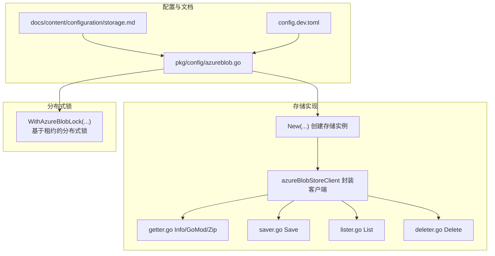
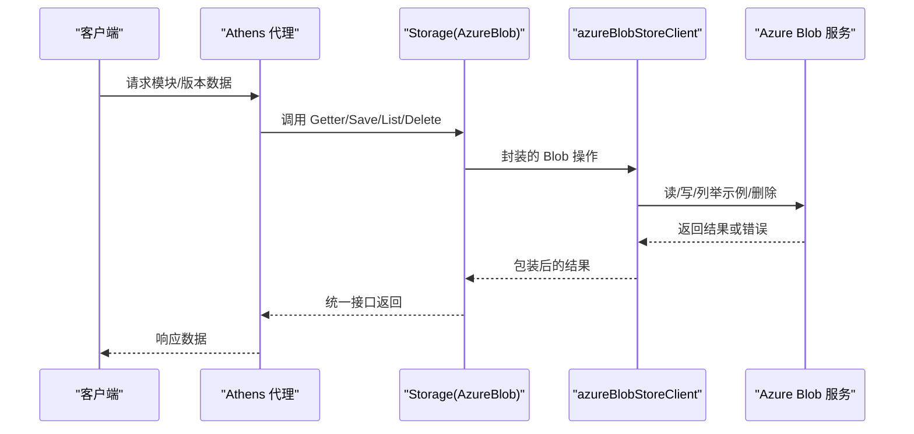
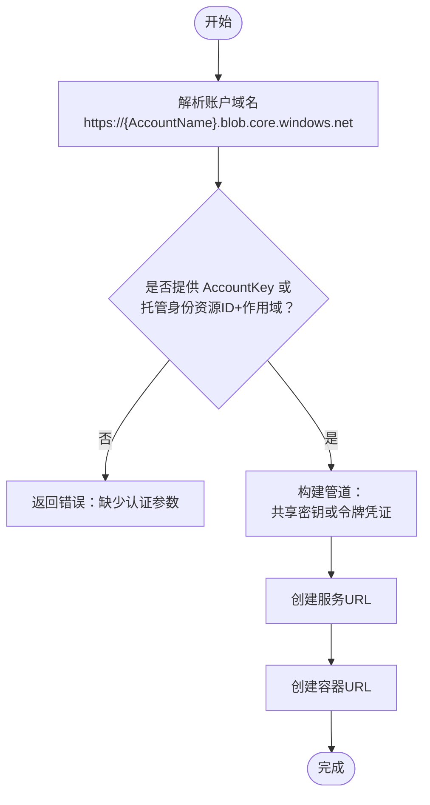
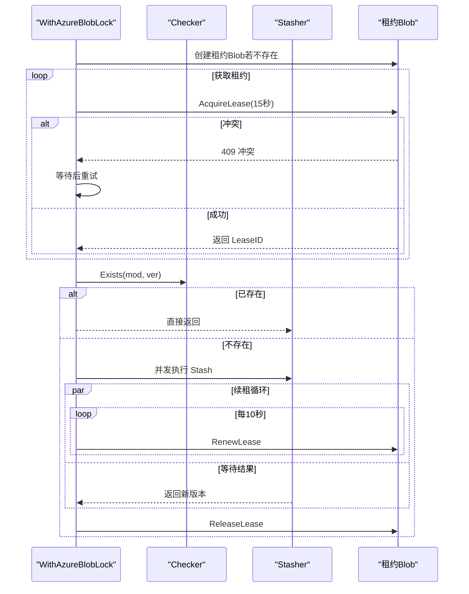
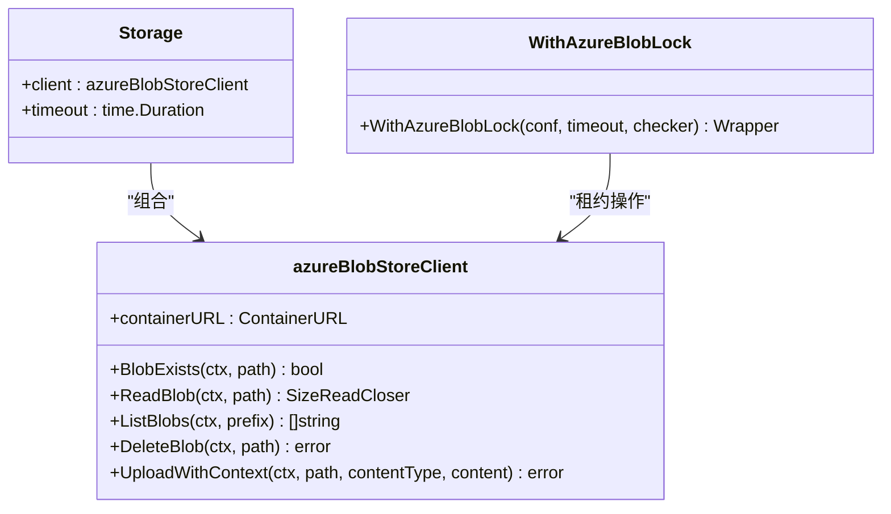

# Azure Blob配置

<cite>
**本文引用的文件**
- [pkg/config/azureblob.go](file://pkg/config/azureblob.go)
- [pkg/storage/azureblob/azureblob.go](file://pkg/storage/azureblob/azureblob.go)
- [pkg/storage/azureblob/getter.go](file://pkg/storage/azureblob/getter.go)
- [pkg/storage/azureblob/saver.go](file://pkg/storage/azureblob/saver.go)
- [pkg/storage/azureblob/lister.go](file://pkg/storage/azureblob/lister.go)
- [pkg/storage/azureblob/deleter.go](file://pkg/storage/azureblob/deleter.go)
- [pkg/stash/with_azureblob.go](file://pkg/stash/with_azureblob.go)
- [docs/content/configuration/storage.md](file://docs/content/configuration/storage.md)
- [config.dev.toml](file://config.dev.toml)
- [pkg/storage/azureblob/azureblob_test.go](file://pkg/storage/azureblob/azureblob_test.go)
</cite>

## 目录
1. [简介](#简介)
2. [项目结构](#项目结构)
3. [核心组件](#核心组件)
4. [架构总览](#架构总览)
5. [详细组件分析](#详细组件分析)
6. [依赖关系分析](#依赖关系分析)
7. [性能与成本优化](#性能与成本优化)
8. [安全与合规](#安全与合规)
9. [故障排查指南](#故障排查指南)
10. [结论](#结论)
11. [附录：配置示例与最佳实践](#附录配置示例与最佳实践)

## 简介
本文件面向在 Athens 中使用 Azure Blob 存储作为后端的用户与运维人员，系统性说明 Azure 存储账户配置参数、认证方式与权限管理、部署配置（含热/冷/归档层）、性能优化、成本控制与安全合规建议，并提供可操作的配置示例与排障指引。

## 项目结构
与 Azure Blob 配置直接相关的代码与文档分布如下：
- 配置模型定义：pkg/config/azureblob.go
- 存储实现与客户端封装：pkg/storage/azureblob/*.go
- 分布式锁（单飞机制）：pkg/stash/with_azureblob.go
- 文档与示例配置：docs/content/configuration/storage.md、config.dev.toml
- 测试与环境变量：pkg/storage/azureblob/azureblob_test.go

图表来源
- [pkg/config/azureblob.go](file://pkg/config/azureblob.go#L1-L11)
- [pkg/storage/azureblob/azureblob.go](file://pkg/storage/azureblob/azureblob.go#L92-L106)
- [pkg/storage/azureblob/getter.go](file://pkg/storage/azureblob/getter.go#L14-L95)
- [pkg/storage/azureblob/saver.go](file://pkg/storage/azureblob/saver.go#L13-L25)
- [pkg/storage/azureblob/lister.go](file://pkg/storage/azureblob/lister.go#L11-L43)
- [pkg/storage/azureblob/deleter.go](file://pkg/storage/azureblob/deleter.go#L11-L28)
- [pkg/stash/with_azureblob.go](file://pkg/stash/with_azureblob.go#L22-L78)
- [docs/content/configuration/storage.md](file://docs/content/configuration/storage.md#L313-L353)
- [config.dev.toml](file://config.dev.toml#L538-L558)

章节来源
- [pkg/config/azureblob.go](file://pkg/config/azureblob.go#L1-L11)
- [pkg/storage/azureblob/azureblob.go](file://pkg/storage/azureblob/azureblob.go#L92-L106)
- [docs/content/configuration/storage.md](file://docs/content/configuration/storage.md#L313-L353)
- [config.dev.toml](file://config.dev.toml#L538-L558)

## 核心组件
- 配置模型：AzureBlobConfig 定义了账户名、账户密钥、托管身份资源ID、凭据作用域、容器名等关键字段。
- 存储实现：Storage 结构体封装了对 Azure Blob 的读写、列举、删除与存在性检查；内部通过 azureBlobStoreClient 调用 SDK。
- 分布式锁：WithAzureBlobLock 基于 Blob 租约实现多实例并发写入的强一致单飞机制。
- 接口实现：Getter/Setter/Lister/Deleter 接口由 Storage 实现，统一对外提供模块版本数据的存取能力。

章节来源
- [pkg/config/azureblob.go](file://pkg/config/azureblob.go#L4-L10)
- [pkg/storage/azureblob/azureblob.go](file://pkg/storage/azureblob/azureblob.go#L84-L106)
- [pkg/stash/with_azureblob.go](file://pkg/stash/with_azureblob.go#L22-L78)
- [pkg/storage/azureblob/getter.go](file://pkg/storage/azureblob/getter.go#L14-L95)
- [pkg/storage/azureblob/saver.go](file://pkg/storage/azureblob/saver.go#L13-L25)
- [pkg/storage/azureblob/lister.go](file://pkg/storage/azureblob/lister.go#L11-L43)
- [pkg/storage/azureblob/deleter.go](file://pkg/storage/azureblob/deleter.go#L11-L28)

## 架构总览
下图展示了 Athens 使用 Azure Blob 作为存储后端的整体调用链路与组件交互：

图表来源
- [pkg/storage/azureblob/getter.go](file://pkg/storage/azureblob/getter.go#L14-L95)
- [pkg/storage/azureblob/saver.go](file://pkg/storage/azureblob/saver.go#L13-L25)
- [pkg/storage/azureblob/lister.go](file://pkg/storage/azureblob/lister.go#L11-L43)
- [pkg/storage/azureblob/deleter.go](file://pkg/storage/azureblob/deleter.go#L11-L28)
- [pkg/storage/azureblob/azureblob.go](file://pkg/storage/azureblob/azureblob.go#L128-L160)

## 详细组件分析

### 配置模型与参数说明
- AccountName：Azure 存储账户名，用于构造服务 URL。
- AccountKey：共享密钥，启用基于共享密钥的认证。
- ManagedIdentityResourceId：托管身份资源ID，启用基于托管身份的认证。
- CredentialScope：令牌请求的作用域（与托管身份配合使用）。
- ContainerName：容器名，必须预先存在且可访问。

章节来源
- [pkg/config/azureblob.go](file://pkg/config/azureblob.go#L4-L10)
- [docs/content/configuration/storage.md](file://docs/content/configuration/storage.md#L332-L352)
- [config.dev.toml](file://config.dev.toml#L538-L558)

### 认证方式与权限管理
- 共享密钥（AccountKey）
  - 当提供 AccountKey 时，使用共享密钥凭证进行认证。
  - 适合本地开发或非 AKS 环境。
- 托管身份（Managed Identity）
  - 当提供 ManagedIdentityResourceId 和 CredentialScope 时，使用托管身份获取令牌并刷新。
  - 支持自动令牌刷新与容错重试。
- 权限最小化
  - 建议仅授予对象读写所需权限（如对象创建者/查看者/传统桶只读）。
  - 在 AKS 等平台，为工作负载分配最小权限的托管身份。

章节来源
- [pkg/storage/azureblob/azureblob.go](file://pkg/storage/azureblob/azureblob.go#L32-L82)
- [pkg/stash/with_azureblob.go](file://pkg/stash/with_azureblob.go#L24-L78)

### 初始化与客户端创建流程

图表来源
- [pkg/storage/azureblob/azureblob.go](file://pkg/storage/azureblob/azureblob.go#L92-L106)
- [pkg/storage/azureblob/azureblob.go](file://pkg/storage/azureblob/azureblob.go#L32-L82)

### 分布式锁（单飞）机制
- 基于 Blob 租约实现强一致的并发写入控制。
- 获取租约失败时采用轮询重试，避免冲突。
- 锁超时与续租逻辑确保长时间任务的正确性。

图表来源
- [pkg/stash/with_azureblob.go](file://pkg/stash/with_azureblob.go#L91-L144)
- [pkg/stash/with_azureblob.go](file://pkg/stash/with_azureblob.go#L162-L201)

### 数据读写与列表删除
- 读取：Info/GoMod/Zip 三类数据分别对应不同后缀的 Blob。
- 写入：通过上传流的方式分块缓冲上传，支持设置 HTTP 头（如 Content-Type）。
- 列表：按前缀列出 Blob 名称并提取版本号。
- 删除：先校验存在性，再删除对应 Blob。

章节来源
- [pkg/storage/azureblob/getter.go](file://pkg/storage/azureblob/getter.go#L14-L95)
- [pkg/storage/azureblob/saver.go](file://pkg/storage/azureblob/saver.go#L13-L25)
- [pkg/storage/azureblob/lister.go](file://pkg/storage/azureblob/lister.go#L11-L43)
- [pkg/storage/azureblob/deleter.go](file://pkg/storage/azureblob/deleter.go#L11-L28)
- [pkg/storage/azureblob/azureblob.go](file://pkg/storage/azureblob/azureblob.go#L173-L194)

## 依赖关系分析
- Storage 依赖 azureBlobStoreClient 提供的 Blob 操作。
- azureBlobStoreClient 依赖 Azure SDK 的凭证与管道。
- WithAzureBlobLock 依赖容器 URL 与租约机制实现分布式锁。
- Getter/Setter/Lister/Deleter 接口统一抽象，便于替换后端。

图表来源
- [pkg/storage/azureblob/azureblob.go](file://pkg/storage/azureblob/azureblob.go#L84-L106)
- [pkg/storage/azureblob/azureblob.go](file://pkg/storage/azureblob/azureblob.go#L21-L82)
- [pkg/stash/with_azureblob.go](file://pkg/stash/with_azureblob.go#L22-L78)

## 性能与成本优化
- 上传性能
  - 使用分块缓冲上传（固定缓冲大小与并发缓冲数），减少内存占用并提升吞吐。
  - 合理设置 Content-Type，有助于浏览器/CDN 缓存与预检优化。
- 下载性能
  - 读取时使用带重试的 Reader，提高网络抖动下的稳定性。
- 列表性能
  - 通过前缀过滤减少遍历范围；注意 Azure Blob 的分页标记处理。
- 成本控制
  - 选择合适的热/冷/归档层（Tier），结合访问频率与生命周期策略。
  - 使用压缩与去重策略降低存储体积。
- 连接与超时
  - 合理设置全局超时与后端超时，避免长连接占用资源。
- CDN 与边缘缓存
  - 对静态模块数据开启 CDN 缓存，降低直接访问 Blob 的次数。

章节来源
- [pkg/storage/azureblob/azureblob.go](file://pkg/storage/azureblob/azureblob.go#L173-L194)
- [config.dev.toml](file://config.dev.toml#L116-L120)

## 安全与合规
- 认证与授权
  - 优先使用托管身份，避免长期持有共享密钥。
  - 严格限制托管身份的作用域与权限，遵循最小权限原则。
- 数据加密
  - 启用传输加密（HTTPS/TLS）与静态加密（服务端默认或客户密钥加密）。
- 日志与审计
  - 开启 Azure Storage 访问日志与诊断指标，定期审计异常访问。
- 合规与备份
  - 配置保留策略与生命周期规则，满足合规要求。
  - 定期备份关键元数据与索引，验证恢复流程。

章节来源
- [pkg/storage/azureblob/azureblob.go](file://pkg/storage/azureblob/azureblob.go#L32-L82)
- [docs/content/configuration/storage.md](file://docs/content/configuration/storage.md#L313-L353)

## 故障排查指南
- 常见错误与定位
  - 认证参数缺失：当未提供 AccountKey 且未配置托管身份或作用域时会报错。
  - 容器不存在或权限不足：初始化时需确保容器已存在且具备读写权限。
  - 租约冲突：多实例并发写入时可能出现 409 冲突，检查租约获取与续租逻辑。
- 诊断步骤
  - 检查环境变量与配置文件中的 AccountName/AccountKey/ContainerName 是否正确。
  - 验证托管身份资源ID与作用域是否匹配目标存储账户。
  - 查看上传/下载日志与错误码，确认网络连通性与超时设置。
- 单元测试与基准
  - 可通过测试框架创建临时容器并运行一致性测试与基准测试，验证功能与性能。

章节来源
- [pkg/storage/azureblob/azureblob.go](file://pkg/storage/azureblob/azureblob.go#L92-L106)
- [pkg/stash/with_azureblob.go](file://pkg/stash/with_azureblob.go#L24-L78)
- [pkg/storage/azureblob/azureblob_test.go](file://pkg/storage/azureblob/azureblob_test.go#L15-L25)

## 结论
通过 Azure Blob 作为 Athens 的存储后端，可在云原生环境下实现高可用、可扩展的模块缓存。合理配置认证参数、采用托管身份与最小权限原则、结合性能与成本优化策略，以及完善的监控与合规流程，能够显著提升系统的安全性与可靠性。

## 附录：配置示例与最佳实践
- 配置示例（来自文档与示例配置文件）
  - 使用共享密钥：设置 AccountName、AccountKey、ContainerName。
  - 使用托管身份：设置 ManagedIdentityResourceId、CredentialScope、ContainerName。
  - 示例参考路径：
    - [docs/content/configuration/storage.md](file://docs/content/configuration/storage.md#L326-L353)
    - [config.dev.toml](file://config.dev.toml#L538-L558)
- 部署最佳实践
  - 热存储：高频访问模块与最新版本。
  - 冷存储：近期不常访问的历史版本。
  - 归档：极低频访问的长期存档版本。
  - 生命周期策略：根据访问模式设置过渡与删除规则。
- 监控与备份
  - 指标采集：启用 Azure Monitor 指标与日志。
  - 备份策略：定期导出索引与元数据，验证恢复路径。
  - 合规：启用合规性报告与审计日志。

章节来源
- [docs/content/configuration/storage.md](file://docs/content/configuration/storage.md#L313-L353)
- [config.dev.toml](file://config.dev.toml#L538-L558)