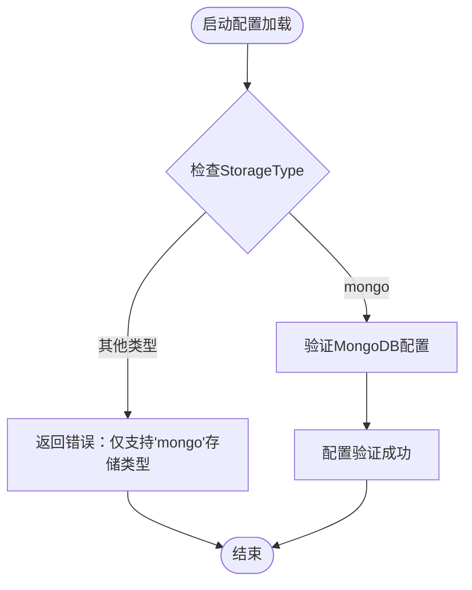

# Azure Blob配置

<cite>
**本文引用的文件**
- [pkg/config/config.go](file://pkg/config/config.go)
- [pkg/config/storage.go](file://pkg/config/storage.go)
- [docs/content/configuration/storage.md](file://docs/content/configuration/storage.md)
- [config.dev.toml](file://config.dev.toml)
- [config.devh.toml](file://config.devh.toml)
</cite>

## 更新摘要
**所做更改**
- 更新了所有提及Azure Blob存储配置的内容，反映该功能已被完全移除
- 移除了Azure Blob存储的配置参数说明和认证方式描述
- 更新了配置验证逻辑的相关内容
- 移除了相关的架构图和组件分析

## 目录
1. [简介](#简介)
2. [当前支持的存储类型](#当前支持的存储类型)
3. [MongoDB存储配置](#mongodb存储配置)
4. [配置验证与错误处理](#配置验证与错误处理)
5. [迁移指南](#迁移指南)
6. [结论](#结论)

## 简介
本文档原本旨在说明Azure Blob存储配置，但根据最新的代码变更，Azure Blob存储配置功能已被完全移除，不再支持Azure Blob存储选项。本文档现已更新为反映这一变更，并提供MongoDB存储的配置信息以及迁移指导。

**重要说明**：Azure Blob存储配置功能已在当前版本中被移除，不再提供支持。

## 当前支持的存储类型
根据配置验证逻辑，当前版本仅支持MongoDB存储类型：



**图表来源**
- [pkg/config/config.go](file://pkg/config/config.go#L299-L304)

**章节来源**
- [pkg/config/config.go](file://pkg/config/config.go#L299-L304)

## MongoDB存储配置
由于Azure Blob存储已被移除，当前唯一支持的存储类型是MongoDB。MongoDB配置结构如下：

### 基本配置结构
```toml
[Storage]
    [Storage.Mongo]
        # MongoDB连接字符串
        URL = "mongodb://localhost:27017"
        
        # 数据库名称
        Database = "athens"
        
        # 集合前缀
        CollectionPrefix = "athens_"
```

### 配置参数说明
- **URL**：MongoDB连接字符串，支持标准MongoDB连接语法
- **Database**：要使用的数据库名称
- **CollectionPrefix**：集合名称前缀，用于隔离不同环境的数据

**章节来源**
- [pkg/config/storage.go](file://pkg/config/storage.go#L3-L6)

## 配置验证与错误处理
配置验证逻辑明确限制了存储类型的可用性：

### 验证规则
1. **存储类型验证**：仅允许`"mongo"`类型
2. **错误处理**：对于任何其他存储类型都会返回明确的错误消息
3. **MongoDB配置验证**：仅验证MongoDB特定配置项

### 错误消息示例
```
only 'mongo' storage type is supported, got: "azureblob"
```

**章节来源**
- [pkg/config/config.go](file://pkg/config/config.go#L299-L304)

## 迁移指南
如果您的应用程序之前使用Azure Blob存储，以下是迁移建议：

### 迁移步骤
1. **评估需求**：确定是否需要MongoDB或其他存储解决方案
2. **准备MongoDB**：部署并配置MongoDB实例
3. **更新配置**：将Azure Blob配置迁移到MongoDB配置格式
4. **数据迁移**：如果需要，从Azure Blob迁移现有数据到MongoDB
5. **测试验证**：验证新配置的正确性和性能

### 配置对比
| Azure Blob配置 | MongoDB配置 |
|---------------|-------------|
| AccountName | URL |
| AccountKey | 无需密钥（取决于MongoDB配置） |
| ContainerName | Database |
| StorageResource | CollectionPrefix |

**章节来源**
- [pkg/config/config.go](file://pkg/config/config.go#L299-L304)

## 结论
Azure Blob存储配置功能已在当前版本中被完全移除，不再提供支持。用户需要迁移到MongoDB存储或其他替代方案。新的配置验证逻辑明确限制了存储类型的可用性，确保系统只能使用受支持的存储后端。

建议用户：
- 立即停止使用Azure Blob存储配置
- 迁移到MongoDB存储配置
- 更新所有相关部署配置
- 进行充分的测试验证