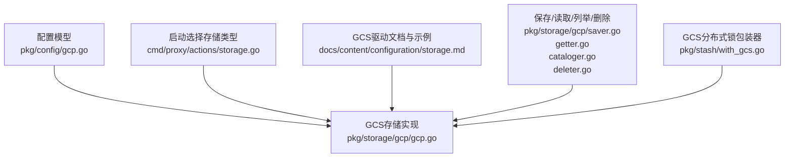
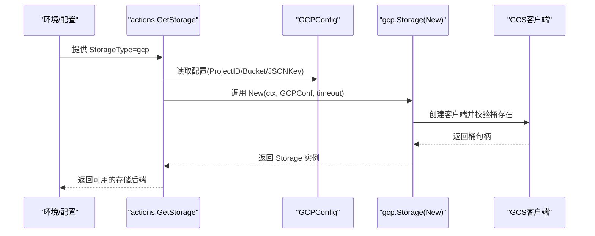
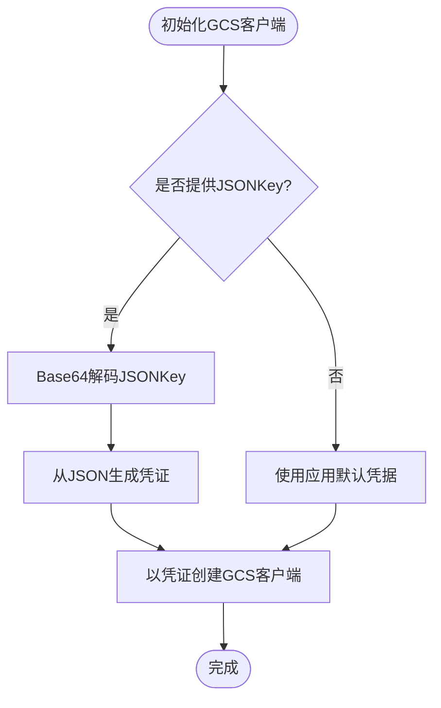
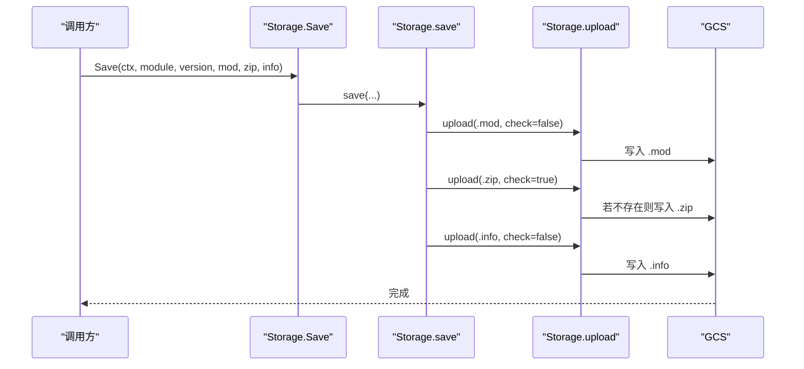
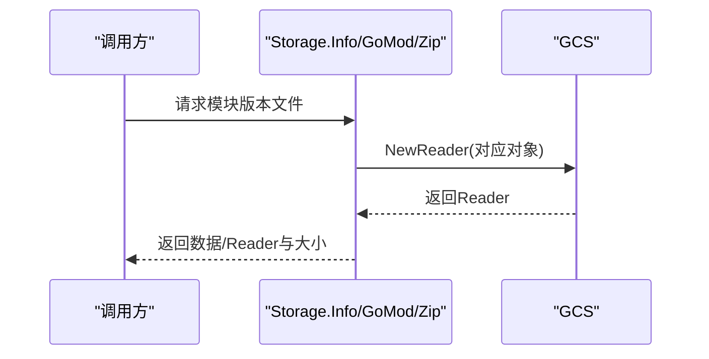
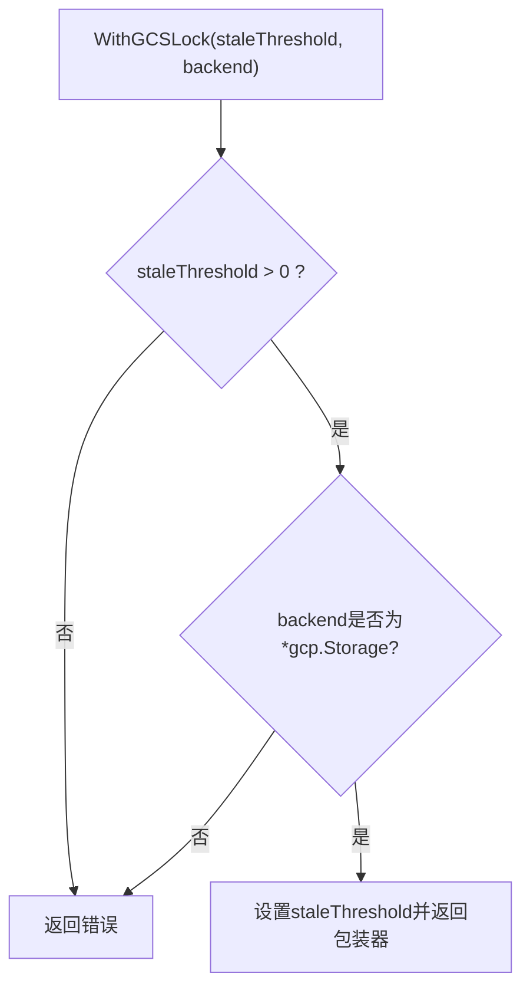
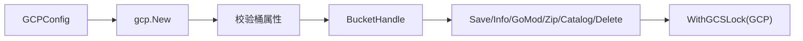

# Google Cloud Storage配置

<cite>
**本文档引用的文件**
- [gcp.go](file://pkg/config/gcp.go)
- [gcp.go](file://pkg/storage/gcp/gcp.go)
- [doc.go](file://pkg/storage/gcp/doc.go)
- [README.md](file://pkg/storage/gcp/README.md)
- [storage.go](file://cmd/proxy/actions/storage.go)
- [storage.md](file://docs/content/configuration/storage.md)
- [saver.go](file://pkg/storage/gcp/saver.go)
- [getter.go](file://pkg/storage/gcp/getter.go)
- [cataloger.go](file://pkg/storage/gcp/cataloger.go)
- [deleter.go](file://pkg/storage/gcp/deleter.go)
- [with_gcs.go](file://pkg/stash/with_gcs.go)
- [gcp_test.go](file://pkg/storage/gcp/gcp_test.go)
</cite>

## 目录
1. [简介](#简介)
2. [项目结构](#项目结构)
3. [核心组件](#核心组件)
4. [架构总览](#架构总览)
5. [详细组件分析](#详细组件分析)
6. [依赖关系分析](#依赖关系分析)
7. [性能与成本优化](#性能与成本优化)
8. [安全与访问控制](#安全与访问控制)
9. [部署与配置示例](#部署与配置示例)
10. [监控、备份与数据保护](#监控备份与数据保护)
11. [故障排查指南](#故障排查指南)
12. [结论](#结论)

## 简介
本文件系统性梳理 Athens 在 Google Cloud Storage (GCS) 上的配置与使用方式，覆盖以下主题：
- GCS 项目配置参数：ProjectID、Bucket、ServiceAccountJSON、Endpoint 的作用与设置要点
- 认证方式：服务账号、应用默认凭据、工作负载身份（概念性说明）
- 访问控制列表（ACL）与可见性策略
- 部署配置示例：标准/近线/冷存储的生命周期策略配置思路
- 成本优化、性能特征与安全配置
- 监控、备份与数据保护最佳实践

## 项目结构
围绕 GCS 的关键代码分布在以下模块：
- 配置模型：pkg/config/gcp.go
- GCS 存储驱动：pkg/storage/gcp/*.go
- 启动时存储选择：cmd/proxy/actions/storage.go
- 文档与示例：docs/content/configuration/storage.md
- 分布式锁（GCS单飞机制）：pkg/stash/with_gcs.go

**图表来源**
- [gcp.go](file://pkg/config/gcp.go#L1-L8)
- [gcp.go](file://pkg/storage/gcp/gcp.go#L1-L74)
- [storage.go](file://cmd/proxy/actions/storage.go#L24-L60)
- [storage.md](file://docs/content/configuration/storage.md#L107-L128)
- [saver.go](file://pkg/storage/gcp/saver.go#L1-L112)
- [getter.go](file://pkg/storage/gcp/getter.go#L1-L68)
- [cataloger.go](file://pkg/storage/gcp/cataloger.go#L1-L58)
- [deleter.go](file://pkg/storage/gcp/deleter.go#L1-L34)
- [with_gcs.go](file://pkg/stash/with_gcs.go#L1-L51)

**章节来源**
- [gcp.go](file://pkg/config/gcp.go#L1-L8)
- [gcp.go](file://pkg/storage/gcp/gcp.go#L1-L74)
- [storage.go](file://cmd/proxy/actions/storage.go#L24-L60)
- [storage.md](file://docs/content/configuration/storage.md#L107-L128)

## 核心组件
- GCPConfig：定义 GCS 所需的关键配置项，包括 ProjectID、Bucket、ServiceAccountJSON（通过 JSONKey 字段承载）。
- Storage：实现 Backend 接口，封装 GCS 客户端、桶句柄、超时与单飞阈值等。
- 操作接口：Save、Info、GoMod、Zip、Catalog、Delete 等，分别对应上传、下载、列举与删除。

**章节来源**
- [gcp.go](file://pkg/config/gcp.go#L4-L8)
- [gcp.go](file://pkg/storage/gcp/gcp.go#L16-L22)
- [saver.go](file://pkg/storage/gcp/saver.go#L23-L32)
- [getter.go](file://pkg/storage/gcp/getter.go#L15-L60)
- [cataloger.go](file://pkg/storage/gcp/cataloger.go#L16-L46)
- [deleter.go](file://pkg/storage/gcp/deleter.go#L11-L33)

## 架构总览
下图展示 Athens 如何在运行时根据配置选择 GCS 作为存储后端，并通过 GCS 驱动完成模块文件的存取。

**图表来源**
- [storage.go](file://cmd/proxy/actions/storage.go#L24-L60)
- [gcp.go](file://pkg/storage/gcp/gcp.go#L32-L47)
- [gcp.go](file://pkg/config/gcp.go#L4-L8)

## 详细组件分析

### 配置模型与参数说明
- ProjectID：GCP 项目标识，用于创建/验证存储桶。
- Bucket：存储桶名称，必填项。
- ServiceAccountJSON：服务账号 JSON 的 Base64 编码（通过 JSONKey 字段传入），用于显式提供认证凭据。
- Endpoint：当前 GCS 驱动未直接暴露 Endpoint 字段；如需自定义端点，请参考 S3/Minio 等其他后端的 Endpoint 使用方式。

注意：代码中存在对“ATHENS_STORAGE_GCP_SA”环境变量的文档引用，但实际配置结构体字段名为 JSONKey。请以配置结构体为准。

**章节来源**
- [gcp.go](file://pkg/config/gcp.go#L4-L8)
- [doc.go](file://pkg/storage/gcp/doc.go#L7-L18)
- [README.md](file://pkg/storage/gcp/README.md#L10-L20)
- [storage.md](file://docs/content/configuration/storage.md#L119-L128)

### 认证方式与凭据注入
- 显式服务账号：当配置了 JSONKey（即服务账号 JSON 的 Base64）时，驱动会将其解码并注入到 GCS 客户端。
- 应用默认凭据：当未提供显式凭据时，GCS 客户端将尝试使用应用默认凭据（例如在 GAE 等环境中自动提供）。
- 工作负载身份：可通过应用默认凭据链路间接支持（具体取决于运行环境与凭据链配置）。本仓库未直接暴露工作负载身份专用字段。

**图表来源**
- [gcp.go](file://pkg/storage/gcp/gcp.go#L51-L74)

**章节来源**
- [gcp.go](file://pkg/storage/gcp/gcp.go#L24-L31)
- [gcp.go](file://pkg/storage/gcp/gcp.go#L51-L74)

### 访问控制列表（ACL）与可见性
- 上传行为：驱动在上传时未显式设置 ACL，默认遵循 GCS 项目/桶的默认权限策略。
- 可见性：注释指出上传的文件在存储桶中为公开可访问（基于 ACL 规则）。若需要私有存储，需结合项目级默认权限或在上传时显式设置 ACL（当前实现未暴露该能力）。

**章节来源**
- [saver.go](file://pkg/storage/gcp/saver.go#L93-L95)

### 保存流程（Save）
- 保存顺序：先保存 .mod，再保存 .zip（带存在性检查优化），最后保存 .info。
- 幂等性：若对象已存在，返回“已存在”错误，避免重复上传。
- 条件写入：使用 DoesNotExist 条件确保并发场景下的原子性。

**图表来源**
- [saver.go](file://pkg/storage/gcp/saver.go#L23-L65)
- [saver.go](file://pkg/storage/gcp/saver.go#L67-L112)

**章节来源**
- [saver.go](file://pkg/storage/gcp/saver.go#L23-L65)
- [saver.go](file://pkg/storage/gcp/saver.go#L67-L112)

### 读取流程（Info/GoMod/Zip）
- Info：读取 .info 文件内容。
- GoMod：读取 .mod 文件内容。
- Zip：返回 .zip 文件的只读流及大小。

**图表来源**
- [getter.go](file://pkg/storage/gcp/getter.go#L15-L60)

**章节来源**
- [getter.go](file://pkg/storage/gcp/getter.go#L15-L60)

### 列举与删除（Catalog/Delete）
- Catalog：基于对象前缀匹配列举模块版本，内部通过分页迭代对象并解析 .info 对象名。
- Delete：先检查版本是否存在，再批量删除 .mod/.zip/.info 三个对象。

**章节来源**
- [cataloger.go](file://pkg/storage/gcp/cataloger.go#L16-L58)
- [deleter.go](file://pkg/storage/gcp/deleter.go#L11-L33)

### 分布式锁（GCS单飞机制）
- 仅适用于 GCP 存储后端，通过修改 Storage 的过期阈值实现。
- 限制：阈值必须大于 0，否则报错；且要求传入的后端必须为 gcp.Storage 类型。

**图表来源**
- [with_gcs.go](file://pkg/stash/with_gcs.go#L14-L31)

**章节来源**
- [with_gcs.go](file://pkg/stash/with_gcs.go#L14-L31)

## 依赖关系分析
- 配置层依赖：GCPConfig 由配置加载模块注入，随后传递给 gcp.Storage.New。
- 运行时选择：actions.GetStorage 根据 StorageType=gcp 选择 gcp.New。
- 驱动实现：gcp.Storage 基于 cloud.google.com/go/storage 客户端操作桶与对象。
- 单飞机制：stash.WithGCSLock 仅在 GCP 存储后端上启用。

**图表来源**
- [gcp.go](file://pkg/storage/gcp/gcp.go#L32-L47)
- [storage.go](file://cmd/proxy/actions/storage.go#L51-L55)
- [with_gcs.go](file://pkg/stash/with_gcs.go#L14-L31)

**章节来源**
- [gcp.go](file://pkg/storage/gcp/gcp.go#L32-L47)
- [storage.go](file://cmd/proxy/actions/storage.go#L51-L55)
- [with_gcs.go](file://pkg/stash/with_gcs.go#L14-L31)

## 性能与成本优化
- 上传优化：在保存 .zip 前进行存在性检查，避免重复上传大文件，降低网络与存储开销。
- 并发一致性：使用条件写入（DoesNotExist）保证幂等，减少冲突重试。
- 生命周期策略：建议结合 GCS 生命周期规则（如标准/近线/冷存储）实现成本优化，具体策略在 GCS 控制台或 Terraform 中配置，不涉及本驱动代码层面改动。

**章节来源**
- [saver.go](file://pkg/storage/gcp/saver.go#L74-L87)
- [saver.go](file://pkg/storage/gcp/saver.go#L89-L91)

## 安全与访问控制
- 凭据注入：优先使用显式服务账号（JSONKey），确保可控的最小权限。
- 默认可见性：当前实现未显式设置 ACL，默认遵循项目/桶策略；若需私有存储，应在项目级设置默认权限或在上传时显式设置 ACL（当前驱动未暴露该能力）。
- 最小权限：建议授予“存储对象创建者”等最小必要权限。

**章节来源**
- [gcp.go](file://pkg/storage/gcp/gcp.go#L51-L74)
- [README.md](file://pkg/storage/gcp/README.md#L16-L20)
- [saver.go](file://pkg/storage/gcp/saver.go#L93-L95)

## 部署与配置示例
- 基础配置（config.toml）：
  - StorageType = "gcp"
  - [Storage.GCP] 下设置 ProjectID 与 Bucket
- 环境变量：
  - ATHENS_STORAGE_TYPE=gcp
  - GOOGLE_CLOUD_PROJECT
  - ATHENS_STORAGE_GCP_BUCKET
  - ATHENS_STORAGE_GCP_JSON_KEY（可选，Base64 编码的服务账号 JSON）
- 单飞机制（GCP）：
  - SingleFlightType = "gcp"
  - 可选配置：StaleThreshold（秒）

说明：Endpoint 字段在 GCS 驱动中未直接暴露；如需自定义端点，请参考 S3/Minio 等后端的 Endpoint 使用方式。

**章节来源**
- [storage.md](file://docs/content/configuration/storage.md#L107-L128)
- [storage.md](file://docs/content/configuration/storage.md#L521-L530)
- [gcp.go](file://pkg/config/gcp.go#L4-L8)

## 监控、备份与数据保护
- 监控：结合 GCS 自带的监控指标（如请求量、传输字节数、错误率）与日志（可在 GCP 日志中查看），建议开启细粒度指标采集。
- 备份与恢复：建议通过 GCS 版本控制与保留策略实现数据保护；定期导出清单（Catalog）用于审计与恢复演练。
- 数据保护：结合 IAM 策略限制访问范围；对敏感元数据与二进制包采用最小权限与加密传输。

[本节为通用最佳实践说明，不直接分析具体源码文件]

## 故障排查指南
- 桶不存在：初始化时若桶不存在，将返回明确提示，需先在 GCS 控制台创建桶。
- 凭据问题：若 JSONKey 解码失败或凭据无效，将返回相应错误；请确认 Base64 编码正确与权限足够。
- 已存在错误：上传时若对象已存在，返回“已存在”，属于预期行为，无需重试。
- 单飞阈值：设置小于等于 0 的阈值将导致初始化失败。

**章节来源**
- [gcp.go](file://pkg/storage/gcp/gcp.go#L39-L44)
- [gcp.go](file://pkg/storage/gcp/gcp.go#L55-L58)
- [saver.go](file://pkg/storage/gcp/saver.go#L103-L108)
- [with_gcs.go](file://pkg/stash/with_gcs.go#L17-L19)

## 结论
- GCS 驱动通过简洁的配置模型与标准的 GCS 客户端实现模块文件的可靠存取。
- 当前实现侧重上传能力与默认公开可见性；如需私有存储或更细粒度的 ACL 控制，建议在项目级策略中完善。
- 通过生命周期策略与单飞机制，可进一步优化成本与并发一致性。
- 建议在生产环境结合 IAM、日志与监控体系，形成完整的安全与可观测性闭环。