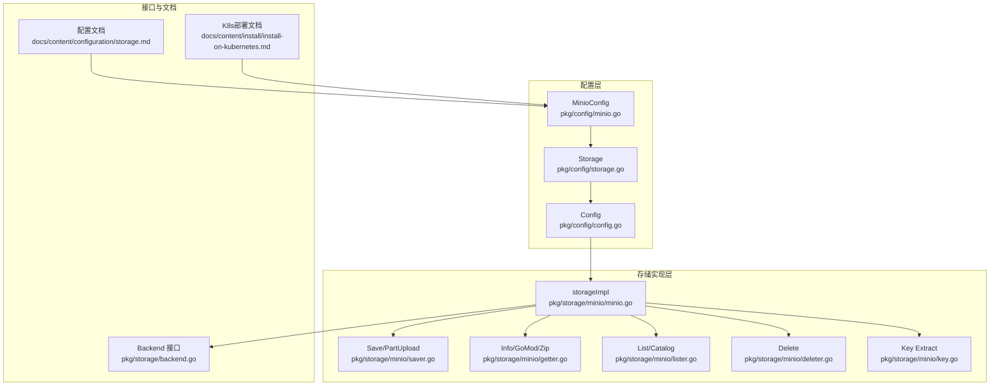
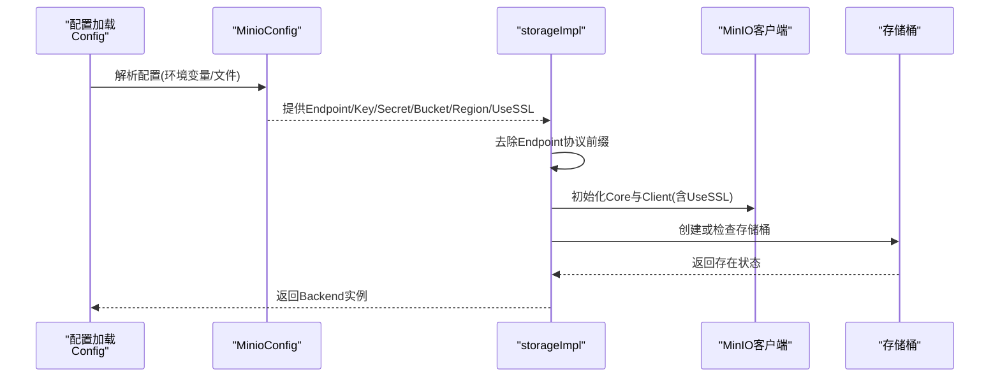
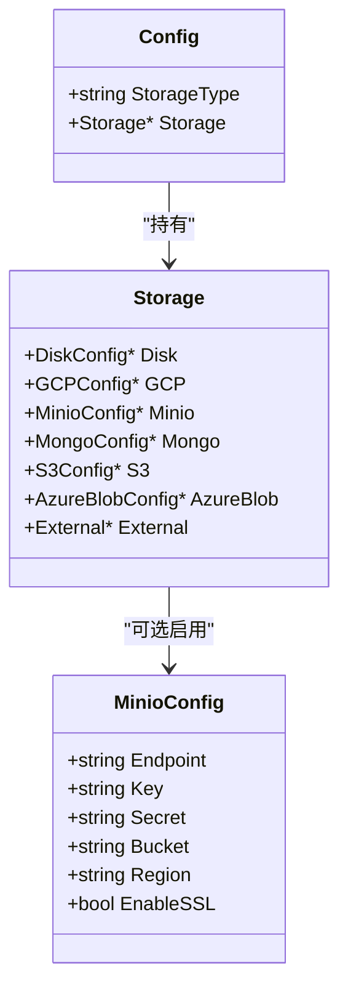
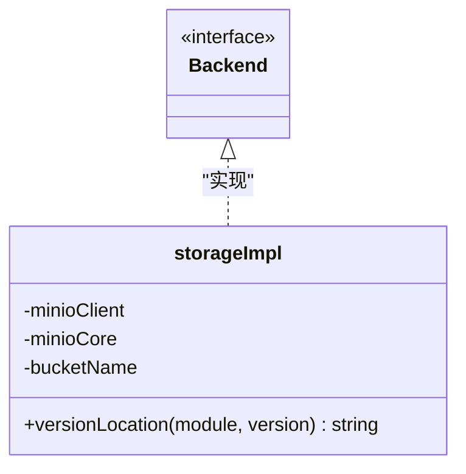
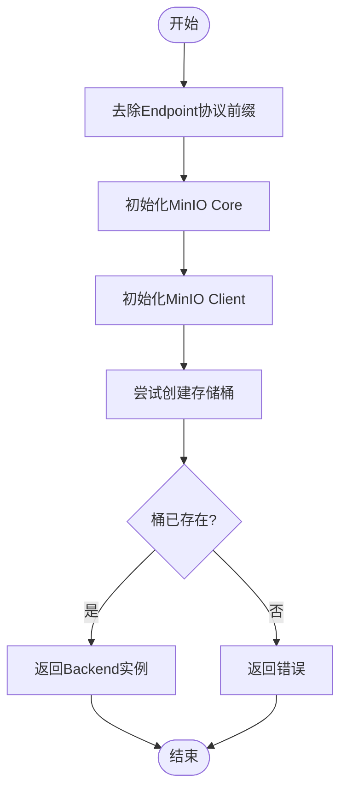
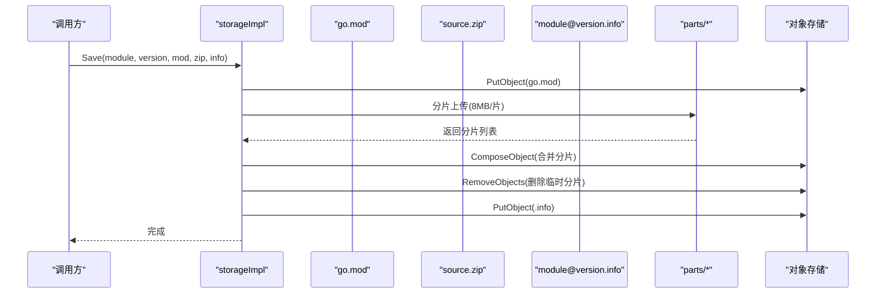
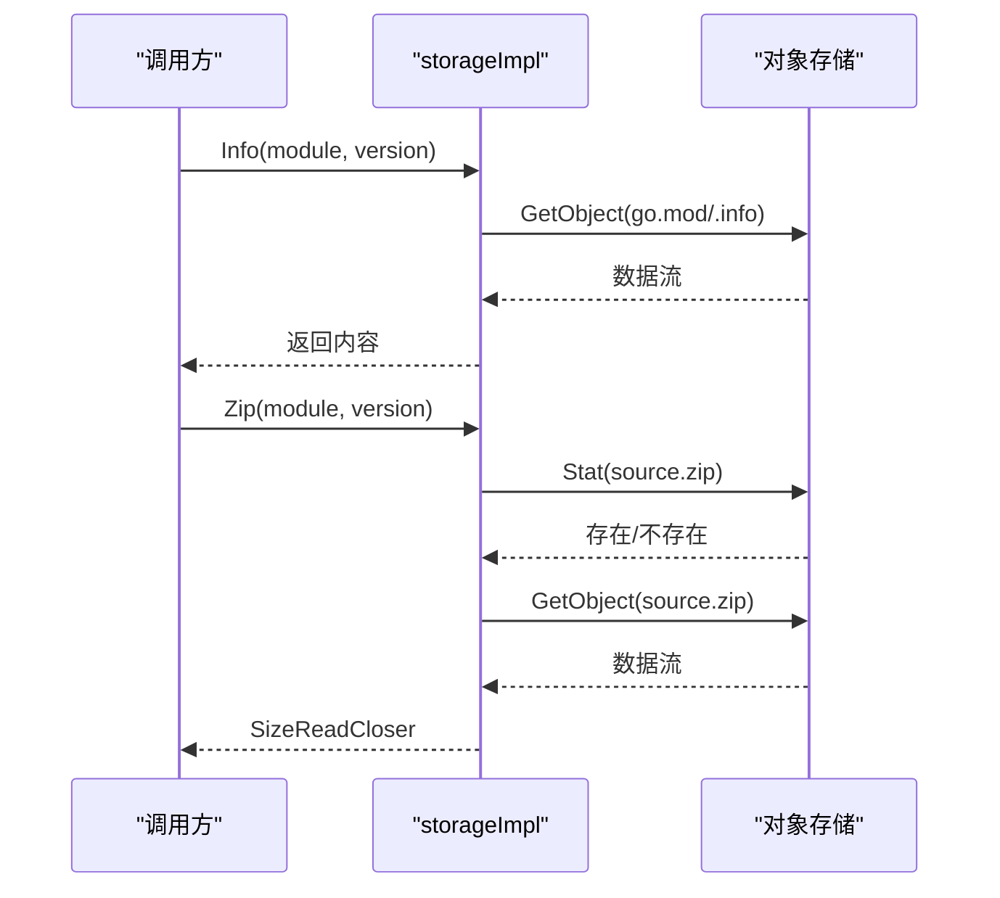
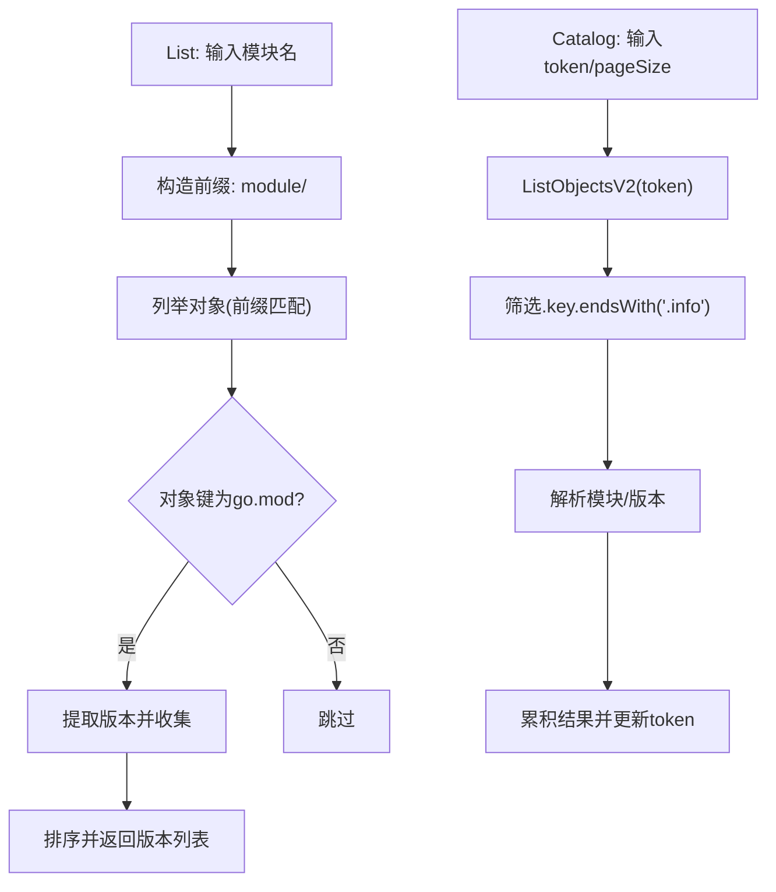
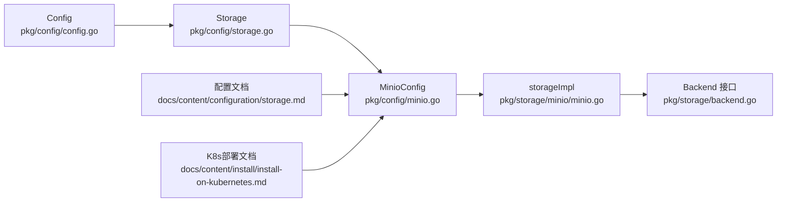

# MinIO配置

<cite>
**本文档引用的文件**
- [pkg/config/minio.go](file://pkg/config/minio.go)
- [pkg/config/storage.go](file://pkg/config/storage.go)
- [pkg/config/config.go](file://pkg/config/config.go)
- [pkg/storage/minio/minio.go](file://pkg/storage/minio/minio.go)
- [pkg/storage/minio/saver.go](file://pkg/storage/minio/saver.go)
- [pkg/storage/minio/getter.go](file://pkg/storage/minio/getter.go)
- [pkg/storage/minio/lister.go](file://pkg/storage/minio/lister.go)
- [pkg/storage/minio/deleter.go](file://pkg/storage/minio/deleter.go)
- [pkg/storage/minio/key.go](file://pkg/storage/minio/key.go)
- [pkg/storage/backend.go](file://pkg/storage/backend.go)
- [docs/content/configuration/storage.md](file://docs/content/configuration/storage.md)
- [docs/content/install/install-on-kubernetes.md](file://docs/content/install/install-on-kubernetes.md)
</cite>

## 目录
1. [简介](#简介)
2. [项目结构](#项目结构)
3. [核心组件](#核心组件)
4. [架构总览](#架构总览)
5. [详细组件分析](#详细组件分析)
6. [依赖关系分析](#依赖关系分析)
7. [性能考虑](#性能考虑)
8. [故障排查指南](#故障排查指南)
9. [结论](#结论)
10. [附录](#附录)

## 简介
本文件系统性地阐述 Athens 中基于 MinIO 的对象存储配置与实现细节，覆盖以下主题：
- MinIO 存储配置参数：Endpoint、AccessKey、SecretKey、Bucket、Region、UseSSL 等
- 认证方式与存储卷配置：访问密钥/密钥对与可选的区域设置
- 部署配置示例：单节点与分布式集群的典型用法
- 性能优化、数据冗余与安全配置建议
- 监控、备份与故障恢复最佳实践

## 项目结构
围绕 MinIO 的配置与实现，主要涉及以下模块：
- 配置层：定义 MinIO 参数结构体与全局配置解析
- 存储实现层：MinIO 客户端初始化、桶管理、对象读写与列举
- 文档层：官方配置示例与部署指导

**图表来源**
- [pkg/config/minio.go](file://pkg/config/minio.go#L1-L12)
- [pkg/config/storage.go](file://pkg/config/storage.go#L1-L13)
- [pkg/config/config.go](file://pkg/config/config.go#L21-L66)
- [pkg/storage/minio/minio.go](file://pkg/storage/minio/minio.go#L14-L18)
- [pkg/storage/minio/saver.go](file://pkg/storage/minio/saver.go#L16-L39)
- [pkg/storage/minio/getter.go](file://pkg/storage/minio/getter.go#L15-L72)
- [pkg/storage/minio/lister.go](file://pkg/storage/minio/lister.go#L12-L37)
- [pkg/storage/minio/deleter.go](file://pkg/storage/minio/deleter.go#L11-L42)
- [pkg/storage/minio/key.go](file://pkg/storage/minio/key.go#L8-L21)
- [pkg/storage/backend.go](file://pkg/storage/backend.go#L3-L9)
- [docs/content/configuration/storage.md](file://docs/content/configuration/storage.md#L210-L242)
- [docs/content/install/install-on-kubernetes.md](file://docs/content/install/install-on-kubernetes.md#L169-L178)

**章节来源**
- [pkg/config/minio.go](file://pkg/config/minio.go#L1-L12)
- [pkg/config/storage.go](file://pkg/config/storage.go#L1-L13)
- [pkg/config/config.go](file://pkg/config/config.go#L21-L66)
- [pkg/storage/minio/minio.go](file://pkg/storage/minio/minio.go#L14-L18)
- [pkg/storage/backend.go](file://pkg/storage/backend.go#L3-L9)
- [docs/content/configuration/storage.md](file://docs/content/configuration/storage.md#L210-L242)
- [docs/content/install/install-on-kubernetes.md](file://docs/content/install/install-on-kubernetes.md#L169-L178)

## 核心组件
- MinioConfig：定义连接 MinIO 所需的关键参数，包括 Endpoint、AccessKey、SecretKey、Bucket、Region、UseSSL，并通过环境变量进行注入与校验。
- Storage 结构：聚合各后端配置，其中 Minio 字段承载 MinIO 配置。
- storageImpl：实现 Backend 接口，封装 MinIO 客户端与桶操作。

关键字段说明
- Endpoint：MinIO 服务端点地址（支持 http/https 前缀，内部会去除协议前缀）
- AccessKey/SecretKey：访问凭据，用于鉴权
- Bucket：存储桶名称
- Region：可选的区域信息
- UseSSL：是否启用 SSL/TLS 连接

**章节来源**
- [pkg/config/minio.go](file://pkg/config/minio.go#L5-L12)
- [pkg/config/storage.go](file://pkg/config/storage.go#L4-L12)
- [pkg/storage/minio/minio.go](file://pkg/storage/minio/minio.go#L14-L18)
- [pkg/storage/minio/minio.go](file://pkg/storage/minio/minio.go#L26-L56)

## 架构总览
下图展示 Athens 如何加载配置并通过 MinIO 实现模块的存取流程：

**图表来源**
- [pkg/config/config.go](file://pkg/config/config.go#L229-L254)
- [pkg/config/minio.go](file://pkg/config/minio.go#L5-L12)
- [pkg/storage/minio/minio.go](file://pkg/storage/minio/minio.go#L26-L56)

## 详细组件分析

### 配置模型与验证
- MinioConfig 作为存储配置的一部分，被全局 Config 结构持有，并在解析时进行字段级校验（如必填项）。
- Storage 聚合多后端配置，其中 Minio 字段为指针类型，便于按需启用。

**图表来源**
- [pkg/config/config.go](file://pkg/config/config.go#L22-L66)
- [pkg/config/storage.go](file://pkg/config/storage.go#L4-L12)
- [pkg/config/minio.go](file://pkg/config/minio.go#L5-L12)

**章节来源**
- [pkg/config/config.go](file://pkg/config/config.go#L229-L254)
- [pkg/config/storage.go](file://pkg/config/storage.go#L4-L12)
- [pkg/config/minio.go](file://pkg/config/minio.go#L5-L12)

### 存储实现与对象模型
- storageImpl 实现 Backend 接口，内部持有 MinIO Core 与 Client，并记录目标存储桶名称。
- 对象键命名采用“模块/版本”的层级结构，便于列举与检索。

**图表来源**
- [pkg/storage/backend.go](file://pkg/storage/backend.go#L3-L9)
- [pkg/storage/minio/minio.go](file://pkg/storage/minio/minio.go#L14-L22)

**章节来源**
- [pkg/storage/backend.go](file://pkg/storage/backend.go#L3-L9)
- [pkg/storage/minio/minio.go](file://pkg/storage/minio/minio.go#L14-L22)

### 桶管理与初始化流程
- 初始化时先尝试创建桶，若失败则检查桶是否存在；仅当明确不存在时才返回错误，否则视为已存在并继续。

**图表来源**
- [pkg/storage/minio/minio.go](file://pkg/storage/minio/minio.go#L26-L56)

**章节来源**
- [pkg/storage/minio/minio.go](file://pkg/storage/minio/minio.go#L26-L56)

### 写入流程（Save/分片上传）
- 将 go.mod 与 .info 文件直接上传至目标路径
- 使用 8MB 分片策略将 source.zip 流式切分为多个对象，再通过组合对象合并，最后清理临时分片

**图表来源**
- [pkg/storage/minio/saver.go](file://pkg/storage/minio/saver.go#L16-L91)

**章节来源**
- [pkg/storage/minio/saver.go](file://pkg/storage/minio/saver.go#L16-L91)

### 读取流程（Info/GoMod/Zip）
- Info/GoMod 通过 GET 对象读取内容
- Zip 先 Stat 校验存在性，再以流式方式返回带大小信息的读取器

**图表来源**
- [pkg/storage/minio/getter.go](file://pkg/storage/minio/getter.go#L15-L72)

**章节来源**
- [pkg/storage/minio/getter.go](file://pkg/storage/minio/getter.go#L15-L72)

### 列举与目录遍历
- List 通过前缀匹配模块下的对象，提取版本号并排序返回
- Catalog 使用分页游标遍历对象，解析 .info 对象定位模块与版本

**图表来源**
- [pkg/storage/minio/lister.go](file://pkg/storage/minio/lister.go#L12-L37)
- [pkg/storage/minio/key.go](file://pkg/storage/minio/key.go#L8-L21)

**章节来源**
- [pkg/storage/minio/lister.go](file://pkg/storage/minio/lister.go#L12-L37)
- [pkg/storage/minio/key.go](file://pkg/storage/minio/key.go#L8-L21)

### 删除流程
- Delete 先检查对象是否存在，存在则依次删除 go.mod、source.zip、.info

**章节来源**
- [pkg/storage/minio/deleter.go](file://pkg/storage/minio/deleter.go#L11-L42)

## 依赖关系分析
- 配置到实现的依赖：Config -> Storage.Minio -> MinioConfig -> storageImpl.NewStorage
- 接口到实现：Backend 接口由 storageImpl 实现
- 文档与配置：官方文档提供配置示例与部署指引

**图表来源**
- [pkg/config/config.go](file://pkg/config/config.go#L22-L66)
- [pkg/config/storage.go](file://pkg/config/storage.go#L4-L12)
- [pkg/config/minio.go](file://pkg/config/minio.go#L5-L12)
- [pkg/storage/minio/minio.go](file://pkg/storage/minio/minio.go#L26-L56)
- [pkg/storage/backend.go](file://pkg/storage/backend.go#L3-L9)
- [docs/content/configuration/storage.md](file://docs/content/configuration/storage.md#L210-L242)
- [docs/content/install/install-on-kubernetes.md](file://docs/content/install/install-on-kubernetes.md#L169-L178)

**章节来源**
- [pkg/config/config.go](file://pkg/config/config.go#L229-L254)
- [pkg/config/storage.go](file://pkg/config/storage.go#L4-L12)
- [pkg/config/minio.go](file://pkg/config/minio.go#L5-L12)
- [pkg/storage/minio/minio.go](file://pkg/storage/minio/minio.go#L26-L56)
- [pkg/storage/backend.go](file://pkg/storage/backend.go#L3-L9)
- [docs/content/configuration/storage.md](file://docs/content/configuration/storage.md#L210-L242)
- [docs/content/install/install-on-kubernetes.md](file://docs/content/install/install-on-kubernetes.md#L169-L178)

## 性能考虑
- 分片上传策略：将未知大小的源码压缩包按固定大小切分为多个对象，避免客户端过度缓冲，提升稳定性与内存占用控制
- 合并与清理：通过组合对象将分片合并为最终文件，并及时清理临时分片，减少存储冗余
- 列举优化：使用前缀匹配与分页游标，降低全量扫描成本

**章节来源**
- [pkg/storage/minio/saver.go](file://pkg/storage/minio/saver.go#L68-L91)
- [pkg/storage/minio/lister.go](file://pkg/storage/minio/lister.go#L12-L37)

## 故障排查指南
常见问题与处理思路
- 桶创建失败：检查桶命名规范与权限；确认 Endpoint 协议前缀已被正确去除
- 权限不足：核对 AccessKey/SecretKey 与目标桶策略；确保具备创建/删除/列举权限
- 连接异常：确认 UseSSL 设置与证书配置；验证网络连通性
- 对象不存在：在读取前先进行存在性检查；区分 404 场景并转换为统一错误类型

**章节来源**
- [pkg/storage/minio/minio.go](file://pkg/storage/minio/minio.go#L26-L56)
- [pkg/storage/minio/getter.go](file://pkg/storage/minio/getter.go#L74-L82)
- [pkg/storage/minio/deleter.go](file://pkg/storage/minio/deleter.go#L11-L42)

## 结论
通过清晰的配置模型与稳健的存储实现，Athens 在 MinIO 上实现了模块的可靠持久化与高效访问。结合合理的部署与运维实践，可在生产环境中获得稳定、可扩展的对象存储能力。

## 附录

### 配置参数详解
- Endpoint：MinIO 服务端点（支持 http/https，内部自动去除协议前缀）
- AccessKey：访问密钥 ID
- SecretKey：访问密钥
- Bucket：存储桶名称
- Region：可选区域
- UseSSL：是否启用 SSL/TLS

**章节来源**
- [pkg/config/minio.go](file://pkg/config/minio.go#L5-L12)
- [pkg/storage/minio/minio.go](file://pkg/storage/minio/minio.go#L28-L33)

### 认证方式与存储卷配置
- 认证：使用 AccessKey/SecretKey 进行鉴权；可通过环境变量注入
- 存储卷：以桶为单位进行逻辑隔离；对象键采用“模块/版本”层次组织

**章节来源**
- [pkg/config/minio.go](file://pkg/config/minio.go#L5-L12)
- [pkg/storage/minio/minio.go](file://pkg/storage/minio/minio.go#L20-L22)

### 部署配置示例
- 单节点 MinIO：参考官方配置文档中的 MinIO 示例
- 分布式集群：通过 Endpoint 指向集群服务地址，Bucket 与凭据保持一致

**章节来源**
- [docs/content/configuration/storage.md](file://docs/content/configuration/storage.md#L210-L242)
- [docs/content/install/install-on-kubernetes.md](file://docs/content/install/install-on-kubernetes.md#L169-L178)

### 性能优化、数据冗余与安全配置
- 性能：合理设置分片大小、使用组合对象合并、避免全量列举
- 数据冗余：定期清理临时分片、监控对象数量与大小分布
- 安全：最小权限原则授予 AccessKey、启用 SSL、限制网络访问范围

**章节来源**
- [pkg/storage/minio/saver.go](file://pkg/storage/minio/saver.go#L68-L91)
- [pkg/storage/minio/minio.go](file://pkg/storage/minio/minio.go#L34-L56)

### 监控、备份与故障恢复最佳实践
- 监控：关注对象存储的请求延迟、错误率与桶容量趋势
- 备份：定期导出关键元数据与重要版本，验证恢复流程
- 故障恢复：在多副本 MinIO 集群中优先恢复关键节点，逐步恢复其他节点

[本节为通用实践建议，不直接分析具体文件]