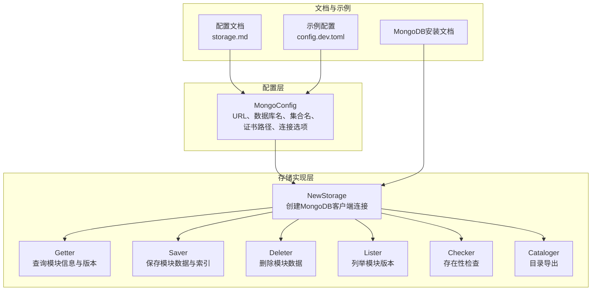
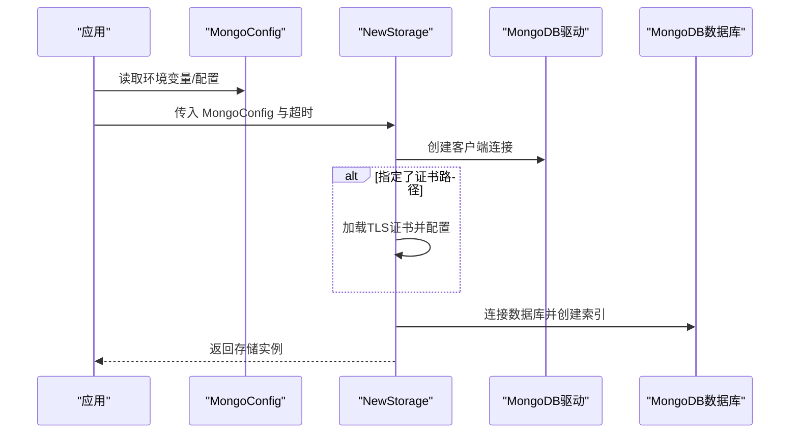
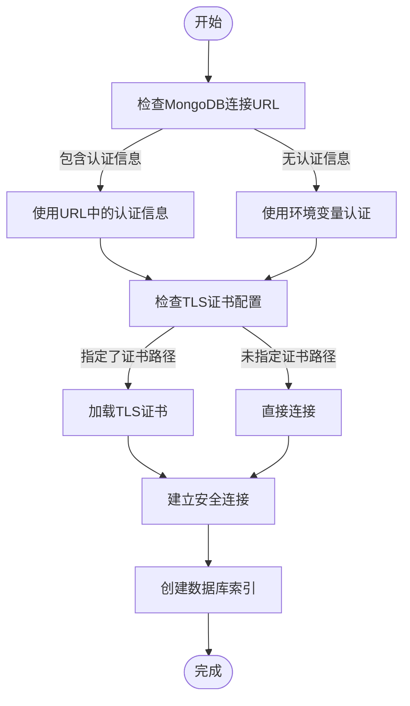
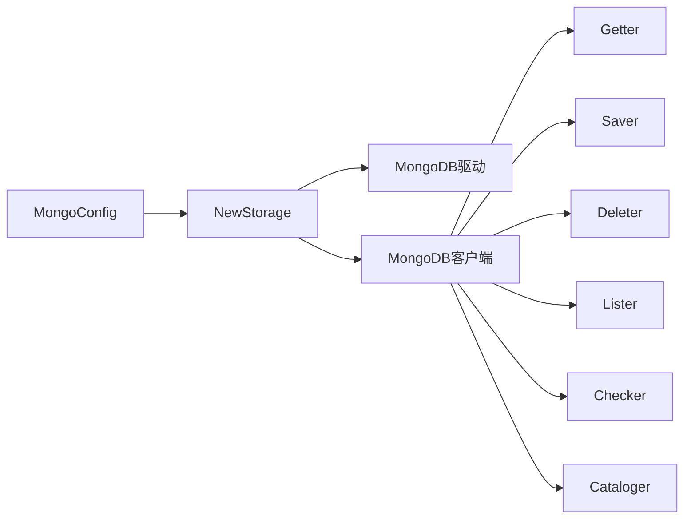

# S3存储配置

<cite>
**本文档引用的文件**
- [pkg/config/config.go](file://pkg/config/config.go)
- [pkg/config/storage.go](file://pkg/config/storage.go)
- [cmd/proxy/actions/storage.go](file://cmd/proxy/actions/storage.go)
- [pkg/config/mongo.go](file://pkg/config/mongo.go)
- [pkg/storage/mongo/mongo.go](file://pkg/storage/mongo/mongo.go)
- [docs/content/configuration/storage.md](file://docs/content/configuration/storage.md)
- [config.dev.toml](file://config.dev.toml)
- [docs/content/install/install-on-aws-ecs-fargate.md](file://docs/content/install/install-on-aws-ecs-fargate.md)
</cite>

## 更新摘要
**所做更改**
- 移除了所有关于AWS S3存储配置的内容，因为该功能已被完全移除
- 更新了架构图和配置示例，现在只显示MongoDB存储选项
- 修改了故障排查指南，移除了S3相关的故障排除步骤
- 更新了结论部分，反映当前仅支持MongoDB存储的事实

## 目录
1. [简介](#简介)
2. [项目结构](#项目结构)
3. [核心组件](#核心组件)
4. [架构总览](#架构总览)
5. [详细组件分析](#详细组件分析)
6. [依赖关系分析](#依赖关系分析)
7. [性能与成本优化](#性能与成本优化)
8. [故障排查指南](#故障排查指南)
9. [结论](#结论)
10. [附录](#附录)

## 简介
本文件系统性梳理 Athens 中基于 MongoDB 的存储配置与实现，涵盖配置参数、认证方式、数据库连接与索引管理、部署示例、成本优化、性能特征与安全配置，并提供监控、备份与合规的最佳实践。内容以仓库中的源码与文档为依据，确保可追溯与可验证。

**重要说明**：AWS S3存储配置功能已在最新版本中完全移除，不再支持S3存储选项。当前版本仅支持MongoDB作为存储后端。

## 项目结构
MongoDB 存储相关代码集中在以下模块：
- 配置模型：pkg/config/mongo.go 定义了 MongoConfig 结构体及各字段含义与环境变量映射
- 存储实现：pkg/storage/mongo/mongo.go 实现了 MongoDB 客户端初始化、TLS配置与索引管理
- 接口实现：getter/saver/deleter/lister/checker/cataloger 分别实现读取、保存、删除、列举、存在性检查与目录导出
- 文档与示例：docs/content/configuration/storage.md 提供配置说明；config.dev.toml 提供示例配置；安装文档展示MongoDB部署

**图表来源**
- [pkg/config/mongo.go](file://pkg/config/mongo.go#L3-L10)
- [pkg/storage/mongo/mongo.go](file://pkg/storage/mongo/mongo.go#L30-L50)
- [cmd/proxy/actions/storage.go](file://cmd/proxy/actions/storage.go#L15-L26)

**章节来源**
- [pkg/config/mongo.go](file://pkg/config/mongo.go#L3-L10)
- [pkg/storage/mongo/mongo.go](file://pkg/storage/mongo/mongo.go#L30-L50)
- [cmd/proxy/actions/storage.go](file://cmd/proxy/actions/storage.go#L15-L26)

## 核心组件
- MongoConfig：定义所有 MongoDB 存储所需的配置项，包括连接URL、默认数据库名、默认集合名、证书路径和安全连接选项，并通过 envconfig 注解映射到环境变量。
- NewStorage：根据 MongoConfig 初始化 MongoDB 客户端连接，支持TLS证书验证、连接超时配置和索引创建。
- Getter/Saver/Deleter/Lister/Checker/Cataloger：实现模块元数据、go.mod、zip 包的读写删查与版本列举、存在性检查、全量目录导出。

**章节来源**
- [pkg/config/mongo.go](file://pkg/config/mongo.go#L3-L10)
- [pkg/storage/mongo/mongo.go](file://pkg/storage/mongo/mongo.go#L30-L50)
- [cmd/proxy/actions/storage.go](file://cmd/proxy/actions/storage.go#L15-L26)

## 架构总览
MongoDB 存储在 Athens 中采用"配置驱动 + MongoDB驱动"的模式：
- 配置层：MongoConfig 映射环境变量，决定连接参数、数据库选择和集合命名
- 初始化层：NewStorage 使用 MongoDB 官方驱动创建客户端连接，按需配置TLS和索引
- 接口层：通过统一的 Backend 接口实现读写删查与目录能力

**图表来源**
- [pkg/storage/mongo/mongo.go](file://pkg/storage/mongo/mongo.go#L30-L50)
- [pkg/storage/mongo/mongo.go](file://pkg/storage/mongo/mongo.go#L74-L116)

**章节来源**
- [pkg/storage/mongo/mongo.go](file://pkg/storage/mongo/mongo.go#L30-L50)

## 详细组件分析

### 配置参数与环境变量映射
- URL：MongoDB连接字符串，必填
- DefaultDBName：默认数据库名，默认为"athens"
- DefaultCollectionName：默认集合名，默认为"modules"
- CertPath：TLS证书文件路径（可选）
- InsecureConn：是否允许不安全连接（开发环境使用）

**章节来源**
- [pkg/config/mongo.go](file://pkg/config/mongo.go#L3-L10)
- [docs/content/configuration/storage.md](file://docs/content/configuration/storage.md#L1-L50)
- [config.dev.toml](file://config.dev.toml#L1-L50)

### 认证方式与连接配置
- 支持标准MongoDB连接字符串格式，可包含认证信息
- 支持TLS证书验证，通过CertPath指定证书文件
- 支持InsecureConn选项用于开发环境（不推荐生产使用）
- 连接超时通过全局超时配置控制

**图表来源**
- [pkg/storage/mongo/mongo.go](file://pkg/storage/mongo/mongo.go#L74-L116)

**章节来源**
- [pkg/storage/mongo/mongo.go](file://pkg/storage/mongo/mongo.go#L74-L116)
- [docs/content/configuration/storage.md](file://docs/content/configuration/storage.md#L1-L50)

### 数据库连接与索引管理
- 数据库连接：使用MongoDB官方驱动创建客户端连接，支持连接超时配置
- TLS配置：可选的证书验证，支持系统证书池和自定义证书
- 索引创建：自动创建唯一稀疏索引，包含base_url、module、version字段
- 数据库初始化：支持自定义数据库名和集合名，默认使用"athens"和"modules"

**章节来源**
- [pkg/storage/mongo/mongo.go](file://pkg/storage/mongo/mongo.go#L52-L72)
- [pkg/storage/mongo/mongo.go](file://pkg/storage/mongo/mongo.go#L118-L121)

### 读取、保存、删除与列举
- 读取：通过查询模块信息和版本号获取对应的数据
- 保存：将模块数据保存到指定的数据库和集合中
- 删除：删除指定模块的所有版本数据
- 列举：列出指定模块的所有版本信息
- 存在性检查：检查模块是否存在
- 目录导出：导出完整的模块目录结构

**章节来源**
- [pkg/storage/mongo/mongo.go](file://pkg/storage/mongo/mongo.go#L30-L50)

## 依赖关系分析
- NewStorage 依赖 MongoDB 官方驱动，支持TLS配置和连接选项
- Getter/Saver/Deleter/Lister/Checker/Cataloger 均依赖 MongoDB 客户端连接
- 配置层通过 envconfig 注解与环境变量交互，便于容器化部署

**图表来源**
- [pkg/config/mongo.go](file://pkg/config/mongo.go#L3-L10)
- [pkg/storage/mongo/mongo.go](file://pkg/storage/mongo/mongo.go#L30-L50)

**章节来源**
- [pkg/storage/mongo/mongo.go](file://pkg/storage/mongo/mongo.go#L30-L50)

## 性能与成本优化
- 性能特征
  - 连接池：MongoDB驱动内置连接池管理
  - 索引优化：自动创建唯一稀疏索引，提升查询性能
  - 批量操作：支持批量插入和查询操作
- 成本优化建议（基于MongoDB通用实践）
  - 连接复用：合理配置连接池大小，避免频繁创建连接
  - 索引维护：定期分析查询模式，优化索引策略
  - 数据压缩：启用MongoDB压缩选项，减少存储空间
  - 分片集群：对于大规模数据，考虑使用分片集群
- 安全配置
  - 认证授权：使用MongoDB内置认证机制
  - 网络隔离：在受信任网络中运行MongoDB
  - 备份策略：定期备份数据库，确保数据安全

**章节来源**
- [pkg/storage/mongo/mongo.go](file://pkg/storage/mongo/mongo.go#L52-L72)

## 故障排查指南
- 连接失败
  - 检查MongoDB连接URL格式是否正确
  - 确认MongoDB服务正在运行且可访问
  - 验证认证信息是否正确
- TLS证书问题
  - 检查证书文件路径是否正确
  - 验证证书格式和有效期
  - 确认系统证书池配置
- 索引创建失败
  - 检查数据库权限是否足够
  - 确认目标数据库和集合存在
  - 验证索引键的有效性

**章节来源**
- [pkg/storage/mongo/mongo.go](file://pkg/storage/mongo/mongo.go#L74-L116)
- [docs/content/configuration/storage.md](file://docs/content/configuration/storage.md#L1-L50)

## 结论
本仓库当前仅支持MongoDB作为存储后端，配置驱动与MongoDB驱动的集成提供了稳定可靠的存储解决方案。通过合理的连接配置、索引管理和安全设置，可以在保证性能与安全的前提下实现高效的数据存储与访问。

## 附录

### 部署配置示例
- MongoDB连接配置
  - 在配置中设置MongoDB连接URL、数据库名和集合名
  - 参考文档与示例配置文件中的MongoDB段落
- TLS安全配置
  - 在生产环境中配置TLS证书验证
  - 使用InsecureConn选项仅限开发环境使用

**章节来源**
- [docs/content/configuration/storage.md](file://docs/content/configuration/storage.md#L1-L50)
- [config.dev.toml](file://config.dev.toml#L1-L50)

### 监控、备份与合规最佳实践
- 监控
  - 使用MongoDB自带的监控工具和指标
  - 监控连接数、查询性能和存储使用情况
- 备份
  - 使用MongoDB官方备份工具定期备份
  - 测试备份恢复流程，确保数据可恢复性
- 合规
  - 实施适当的访问控制和审计日志
  - 定期审查数据库权限和访问策略

**章节来源**
- [docs/content/configuration/storage.md](file://docs/content/configuration/storage.md#L1-L50)