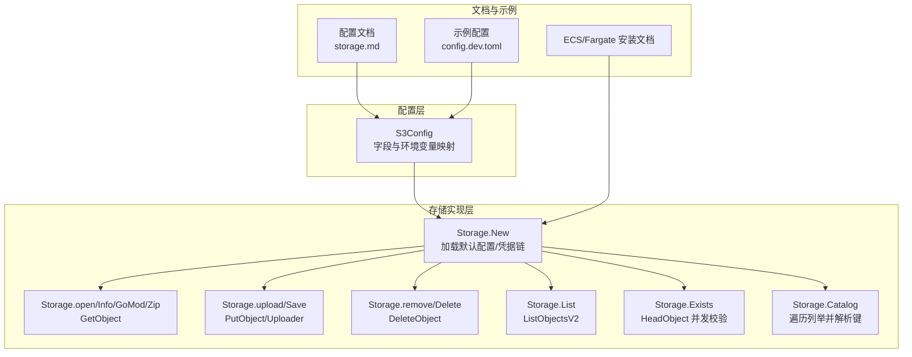
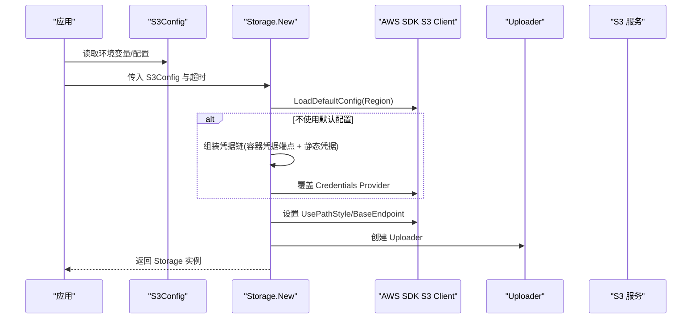
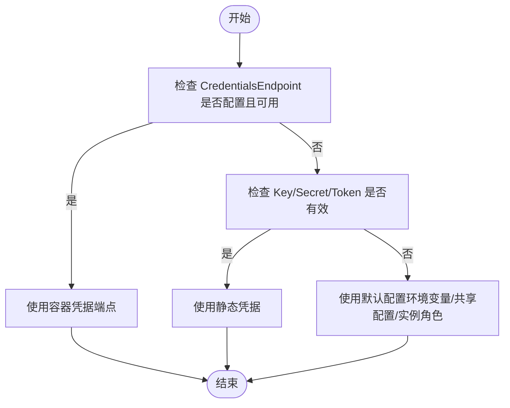
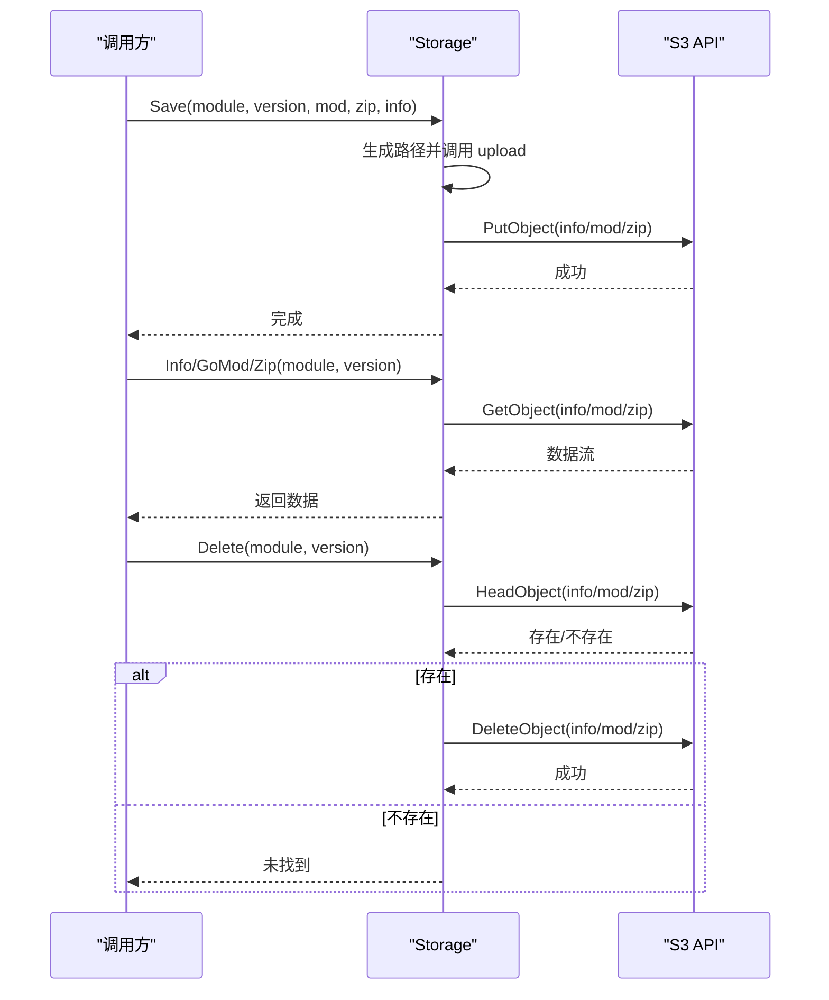
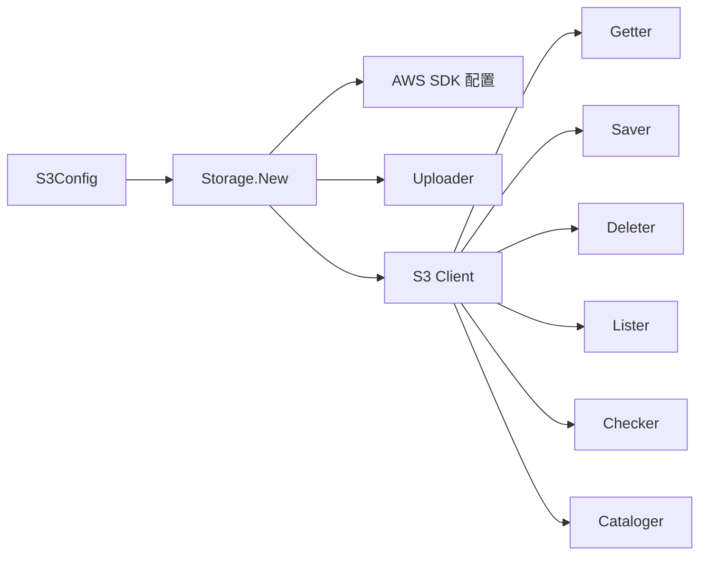

# S3存储配置

<cite>
**本文档引用的文件**
- [pkg/config/s3.go](file://pkg/config/s3.go)
- [pkg/storage/s3/s3.go](file://pkg/storage/s3/s3.go)
- [pkg/storage/s3/getter.go](file://pkg/storage/s3/getter.go)
- [pkg/storage/s3/saver.go](file://pkg/storage/s3/saver.go)
- [pkg/storage/s3/deleter.go](file://pkg/storage/s3/deleter.go)
- [pkg/storage/s3/lister.go](file://pkg/storage/s3/lister.go)
- [pkg/storage/s3/checker.go](file://pkg/storage/s3/checker.go)
- [pkg/storage/s3/cataloger.go](file://pkg/storage/s3/cataloger.go)
- [docs/content/configuration/storage.md](file://docs/content/configuration/storage.md)
- [config.dev.toml](file://config.dev.toml)
- [docs/content/install/install-on-aws-ecs-fargate.md](file://docs/content/install/install-on-aws-ecs-fargate.md)
</cite>

## 目录
1. [简介](#简介)
2. [项目结构](#项目结构)
3. [核心组件](#核心组件)
4. [架构总览](#架构总览)
5. [详细组件分析](#详细组件分析)
6. [依赖关系分析](#依赖关系分析)
7. [性能与成本优化](#性能与成本优化)
8. [故障排查指南](#故障排查指南)
9. [结论](#结论)
10. [附录](#附录)

## 简介
本文件系统性梳理 Athens 中基于 AWS S3 的存储配置与实现，涵盖配置参数、认证方式、桶权限与跨区域复制、部署示例、成本优化、性能特征与安全配置，并提供监控、备份与合规的最佳实践。内容以仓库中的源码与文档为依据，确保可追溯与可验证。

## 项目结构
S3 存储相关代码集中在以下模块：
- 配置模型：pkg/config/s3.go 定义了 S3Config 结构体及各字段含义与环境变量映射
- 存储实现：pkg/storage/s3/s3.go 实现了 S3 客户端初始化、凭据链、路径样式与自定义端点
- 接口实现：getter/saver/deleter/lister/checker/cataloger 分别实现读取、保存、删除、列举、存在性检查与目录导出
- 文档与示例：docs/content/configuration/storage.md 提供配置说明；config.dev.toml 提供示例配置；安装文档展示 ECS/Fargate 场景下的权限与环境变量

图表来源
- [pkg/config/s3.go](file://pkg/config/s3.go#L1-L16)
- [pkg/storage/s3/s3.go](file://pkg/storage/s3/s3.go#L34-L74)
- [pkg/storage/s3/getter.go](file://pkg/storage/s3/getter.go#L17-L38)
- [pkg/storage/s3/saver.go](file://pkg/storage/s3/saver.go#L15-L28)
- [pkg/storage/s3/deleter.go](file://pkg/storage/s3/deleter.go#L13-L29)
- [pkg/storage/s3/lister.go](file://pkg/storage/s3/lister.go#L15-L39)
- [pkg/storage/s3/checker.go](file://pkg/storage/s3/checker.go#L15-L57)
- [pkg/storage/s3/cataloger.go](file://pkg/storage/s3/cataloger.go#L17-L51)
- [docs/content/configuration/storage.md](file://docs/content/configuration/storage.md#L129-L209)
- [config.dev.toml](file://config.dev.toml#L473-L536)
- [docs/content/install/install-on-aws-ecs-fargate.md](file://docs/content/install/install-on-aws-ecs-fargate.md#L117-L131)

章节来源
- [pkg/config/s3.go](file://pkg/config/s3.go#L1-L16)
- [pkg/storage/s3/s3.go](file://pkg/storage/s3/s3.go#L18-L74)
- [docs/content/configuration/storage.md](file://docs/content/configuration/storage.md#L129-L209)

## 核心组件
- S3Config：定义所有 S3 存储所需的配置项，包括 Region、Access Key/Secret Key/Token、Bucket、UseDefaultConfiguration、ForcePathStyle、CredentialsEndpoint、AwsContainerCredentialsRelativeURI、Endpoint 等，并通过 envconfig 注解映射到环境变量。
- Storage.New：根据 S3Config 初始化 AWS SDK 配置，支持自定义凭据链（容器凭据端点 + 静态凭据），以及路径样式与自定义端点。
- Getter/Saver/Deleter/Lister/Checker/Cataloger：实现模块元数据、go.mod、zip 包的读写删查与版本列举、存在性检查、全量目录导出。

章节来源
- [pkg/config/s3.go](file://pkg/config/s3.go#L3-L15)
- [pkg/storage/s3/s3.go](file://pkg/storage/s3/s3.go#L34-L74)
- [pkg/storage/s3/getter.go](file://pkg/storage/s3/getter.go#L17-L38)
- [pkg/storage/s3/saver.go](file://pkg/storage/s3/saver.go#L15-L28)
- [pkg/storage/s3/deleter.go](file://pkg/storage/s3/deleter.go#L13-L29)
- [pkg/storage/s3/lister.go](file://pkg/storage/s3/lister.go#L15-L39)
- [pkg/storage/s3/checker.go](file://pkg/storage/s3/checker.go#L15-L57)
- [pkg/storage/s3/cataloger.go](file://pkg/storage/s3/cataloger.go#L17-L51)

## 架构总览
S3 存储在 Athens 中采用“配置驱动 + AWS SDK”的模式：
- 配置层：S3Config 映射环境变量，决定 Region、凭据来源、桶名、路径样式与自定义端点
- 初始化层：Storage.New 使用 AWS SDK 默认配置加载器，按需替换凭据链与客户端选项
- 接口层：通过统一的 Backend 接口实现读写删查与目录能力

图表来源
- [pkg/storage/s3/s3.go](file://pkg/storage/s3/s3.go#L34-L74)

章节来源
- [pkg/storage/s3/s3.go](file://pkg/storage/s3/s3.go#L34-L74)

## 详细组件分析

### 配置参数与环境变量映射
- Region：AWS 区域，必填
- Key/Secret/Token：访问密钥、密钥、会话令牌（可选）
- Bucket：S3 桶名，必填
- UseDefaultConfiguration：是否仅使用默认配置（不推荐长期使用）
- ForcePathStyle：是否强制使用路径样式的 S3 端点
- CredentialsEndpoint：容器凭据端点（如 ECS/Fargate 元数据端点）
- AwsContainerCredentialsRelativeURI：容器相对 URI（与上一参数拼接）
- Endpoint：自定义 S3 端点（覆盖默认端点）

章节来源
- [pkg/config/s3.go](file://pkg/config/s3.go#L5-L14)
- [docs/content/configuration/storage.md](file://docs/content/configuration/storage.md#L157-L208)
- [config.dev.toml](file://config.dev.toml#L488-L536)

### 认证方式与凭据链
- 支持三种认证来源，优先级顺序如下：
  1) 容器凭据端点（如 ECS/Fargate 元数据端点）返回有效结果时优先使用
  2) 配置中的 Key/Secret/Token 有效时使用
  3) 否则回退到默认配置（环境变量、共享配置文件、EC2 实例角色等）
- 当 UseDefaultConfiguration=false 时，会显式构建凭据链，优先尝试容器凭据端点，再尝试静态凭据
- 对于 ECS/Fargate，建议使用 CredentialsEndpoint=http://169.254.170.2 与 AwsContainerCredentialsRelativeURI（如 /v2/credentials）组合

图表来源
- [pkg/storage/s3/s3.go](file://pkg/storage/s3/s3.go#L47-L56)
- [docs/content/configuration/storage.md](file://docs/content/configuration/storage.md#L143-L155)
- [docs/content/install/install-on-aws-ecs-fargate.md](file://docs/content/install/install-on-aws-ecs-fargate.md#L117-L131)

章节来源
- [pkg/storage/s3/s3.go](file://pkg/storage/s3/s3.go#L47-L56)
- [docs/content/configuration/storage.md](file://docs/content/configuration/storage.md#L143-L155)
- [docs/content/install/install-on-aws-ecs-fargate.md](file://docs/content/install/install-on-aws-ecs-fargate.md#L117-L131)

### 桶权限与跨区域复制
- ECS/Fargate 示例文档提供了最小权限策略，包括：
  - 列举桶与获取位置：s3:ListBucket、s3:GetBucketLocation
  - 对桶内对象的增删改查：s3:PutObject、s3:GetObject、s3:DeleteObject
  - STS 假设角色与标记会话：sts:AssumeRole、sts:TagSession
- 跨区域复制：可通过 S3 自身的跨区域复制功能实现，但不在本仓库代码范围内；建议结合生命周期策略与智能分层进行成本优化

章节来源
- [docs/content/install/install-on-aws-ecs-fargate.md](file://docs/content/install/install-on-aws-ecs-fargate.md#L54-L115)

### 路径样式与自定义端点
- ForcePathStyle：当为 true 时，使用路径样式的 S3 端点（兼容某些兼容 S3 的对象存储）
- Endpoint：自定义 S3 端点（覆盖默认生成的端点），仍需提供 Region

章节来源
- [pkg/storage/s3/s3.go](file://pkg/storage/s3/s3.go#L59-L64)
- [docs/content/configuration/storage.md](file://docs/content/configuration/storage.md#L178-L208)

### 读取、保存、删除与列举
- 读取：Info/GoMod/Zip 通过 GetObject 获取对象流，NoSuchKey 视为未找到
- 保存：Save 调用上传器 PutObject，按模块版本命名规则写入 info/mod/zip
- 删除：Delete 先检查存在性，再调用 DeleteObject 删除
- 列举：List 通过 ListObjectsV2 按前缀列出 .info 文件并提取版本号
- 存在性检查：Exists 并发 HEAD 三个关键文件，任一缺失即视为不存在
- 目录导出：Catalog 逐页列举 .info 对象并解析模块与版本

图表来源
- [pkg/storage/s3/saver.go](file://pkg/storage/s3/saver.go#L15-L28)
- [pkg/storage/s3/getter.go](file://pkg/storage/s3/getter.go#L17-L38)
- [pkg/storage/s3/deleter.go](file://pkg/storage/s3/deleter.go#L13-L29)

章节来源
- [pkg/storage/s3/getter.go](file://pkg/storage/s3/getter.go#L17-L38)
- [pkg/storage/s3/saver.go](file://pkg/storage/s3/saver.go#L15-L28)
- [pkg/storage/s3/deleter.go](file://pkg/storage/s3/deleter.go#L13-L29)
- [pkg/storage/s3/lister.go](file://pkg/storage/s3/lister.go#L15-L39)
- [pkg/storage/s3/checker.go](file://pkg/storage/s3/checker.go#L15-L57)
- [pkg/storage/s3/cataloger.go](file://pkg/storage/s3/cataloger.go#L17-L51)

## 依赖关系分析
- Storage.New 依赖 AWS SDK 的配置加载器与凭据提供器，支持自定义凭据链与客户端选项
- Getter/Saver/Deleter/Lister/Checker/Cataloger 均依赖 S3 API 客户端与上传器
- 配置层通过 envconfig 注解与环境变量交互，便于容器化部署

图表来源
- [pkg/config/s3.go](file://pkg/config/s3.go#L3-L15)
- [pkg/storage/s3/s3.go](file://pkg/storage/s3/s3.go#L34-L74)
- [pkg/storage/s3/getter.go](file://pkg/storage/s3/getter.go#L17-L38)
- [pkg/storage/s3/saver.go](file://pkg/storage/s3/saver.go#L15-L28)
- [pkg/storage/s3/deleter.go](file://pkg/storage/s3/deleter.go#L13-L29)
- [pkg/storage/s3/lister.go](file://pkg/storage/s3/lister.go#L15-L39)
- [pkg/storage/s3/checker.go](file://pkg/storage/s3/checker.go#L15-L57)
- [pkg/storage/s3/cataloger.go](file://pkg/storage/s3/cataloger.go#L17-L51)

章节来源
- [pkg/storage/s3/s3.go](file://pkg/storage/s3/s3.go#L34-L74)

## 性能与成本优化
- 性能特征
  - 上传：使用 AWS SDK 的上传器，具备并发与断点续传能力（由 SDK 决定）
  - 下载：直接流式读取对象，避免一次性加载大包
  - 并发检查：Exists 对 info/mod/zip 三文件并发 HEAD，任一缺失即判定不存在
- 成本优化建议（基于 S3 通用实践，非仓库特定实现）
  - 生命周期策略：对冷数据启用智能分层或归档存储，降低长期存储成本
  - 跨区域复制：在多区域部署时，利用复制减少跨区访问延迟与费用
  - 传输加密：启用 S3 默认加密与传输加密，满足合规要求
  - 版本控制：按需开启版本控制，配合生命周期策略管理历史版本
  - 前缀设计：合理组织对象前缀，提升列举与检索效率
- 安全配置
  - 最小权限：遵循安装文档中的最小权限策略
  - 凭据管理：优先使用容器凭据端点或实例角色，避免硬编码密钥
  - VPC/私有网关：在受限网络中访问 S3，必要时使用 VPC 终端节点

章节来源
- [pkg/storage/s3/checker.go](file://pkg/storage/s3/checker.go#L22-L56)
- [docs/content/install/install-on-aws-ecs-fargate.md](file://docs/content/install/install-on-aws-ecs-fargate.md#L54-L115)

## 故障排查指南
- 认证失败
  - 检查 UseDefaultConfiguration 与凭据链设置，确认容器凭据端点可达且返回有效凭据
  - 若使用静态凭据，确认 Key/Secret/Token 正确
- 端点问题
  - 若使用兼容 S3 的对象存储，启用 ForcePathStyle
  - 自定义 Endpoint 时必须提供 Region
- 权限不足
  - 确认策略包含 s3:ListBucket、s3:GetBucketLocation、s3:PutObject、s3:GetObject、s3:DeleteObject
- 对象不存在
  - Exists 并发检查任一缺失即视为未找到；确认模块版本命名与后缀一致

章节来源
- [pkg/storage/s3/s3.go](file://pkg/storage/s3/s3.go#L47-L64)
- [pkg/storage/s3/checker.go](file://pkg/storage/s3/checker.go#L22-L56)
- [docs/content/configuration/storage.md](file://docs/content/configuration/storage.md#L178-L208)
- [docs/content/install/install-on-aws-ecs-fargate.md](file://docs/content/install/install-on-aws-ecs-fargate.md#L54-L115)

## 结论
本仓库对 AWS S3 的集成以简洁清晰的方式实现了配置驱动与凭据链管理，支持路径样式与自定义端点，满足多种部署场景（含 ECS/Fargate）。结合最小权限策略与生命周期/智能分层等通用实践，可在保证安全与合规的前提下实现成本优化与性能提升。

## 附录

### 部署配置示例
- 标准存储（S3 Standard）
  - 在配置中设置 Region、Bucket、凭据来源（推荐容器凭据端点或默认配置）
  - 参考文档与示例配置文件中的 S3 段落
- 低频访问存储（S3 Infrequent Access）
  - 在 S3 桶上配置生命周期规则，将长期未访问的对象迁移到 IA 或更低层级
- 智能分层存储（S3 Intelligent-Tiering）
  - 在 S3 桶上启用智能分层，自动迁移至不同访问层，降低长期存储成本

章节来源
- [docs/content/configuration/storage.md](file://docs/content/configuration/storage.md#L129-L209)
- [config.dev.toml](file://config.dev.toml#L473-L536)

### 监控、备份与合规最佳实践
- 监控
  - 使用 CloudWatch 指标与日志记录 S3 请求与错误
  - 对关键操作（上传/下载/删除）增加可观测性埋点
- 备份
  - 开启版本控制，结合生命周期策略管理历史版本
  - 跨区域复制实现异地容灾
- 合规
  - 启用默认加密与传输加密
  - 严格最小权限策略，定期审计 IAM 策略与访问日志

章节来源
- [docs/content/install/install-on-aws-ecs-fargate.md](file://docs/content/install/install-on-aws-ecs-fargate.md#L54-L115)