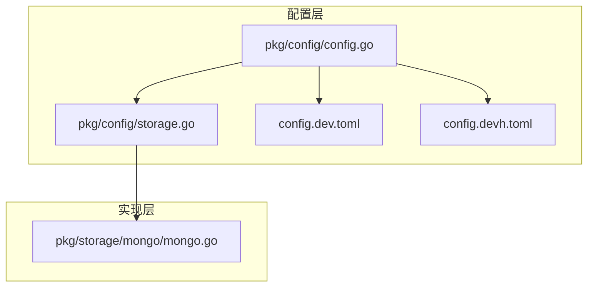
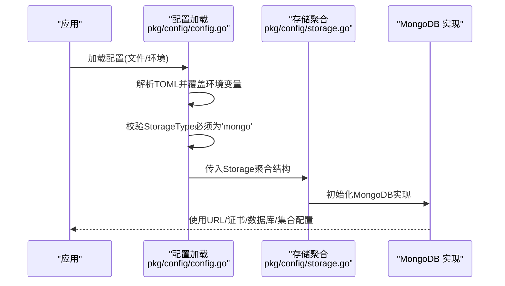
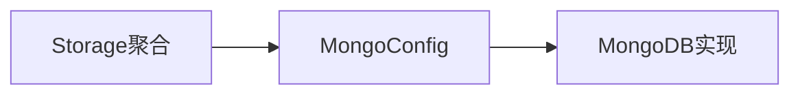

# 云存储配置

<cite>
**本文引用的文件**
- [pkg/config/storage.go](file://pkg/config/storage.go)
- [pkg/config/config.go](file://pkg/config/config.go)
- [cmd/proxy/actions/storage.go](file://cmd/proxy/actions/storage.go)
- [docs/content/configuration/storage.md](file://docs/content/configuration/storage.md)
- [config.dev.toml](file://config.dev.toml)
- [config.devh.toml](file://config.devh.toml)
</cite>

## 更新摘要
**所做更改**
- 移除了所有关于 AWS S3、Azure Blob、Google Cloud Storage 和 MinIO 的配置内容
- 更新了架构总览，仅保留 MongoDB 存储后端
- 删除了所有云存储相关的配置示例和环境变量说明
- 更新了故障排查指南，移除了云存储相关的问题诊断

## 目录
1. [简介](#简介)
2. [项目结构](#项目结构)
3. [核心组件](#核心组件)
4. [架构总览](#架构总览)
5. [详细组件分析](#详细组件分析)
6. [依赖关系分析](#依赖关系分析)
7. [性能考虑](#性能考虑)
8. [故障排查指南](#故障排查指南)
9. [结论](#结论)
10. [附录](#附录)

## 简介
本文件面向云存储配置的综合文档，聚焦于 Athens 代理在 MongoDB 存储后端上的配置与最佳实践。**重要说明：该版本中，云存储配置功能已被完全移除，不再支持 AWS S3、Azure Blob、Google Cloud Storage 和 MinIO 等对象存储后端。目前仅支持 MongoDB 作为存储后端。** 内容涵盖 MongoDB 连接配置、认证方式、数据库设置、集合配置、访问权限管理、性能调优、安全配置、监控、备份与灾难恢复等主题，并提供 MongoDB 部署的配置示例与参考路径。

## 项目结构
围绕 MongoDB 存储配置，项目的关键文件与职责如下：
- 配置定义与解析
  - 存储类型聚合：pkg/config/storage.go（仅支持 MongoDB）
  - 统一配置加载与校验：pkg/config/config.go
  - 示例配置文件：config.dev.toml、config.devh.toml
- 文档与示例
  - 存储配置文档：docs/content/configuration/storage.md
- 存储实现
  - MongoDB 实现：pkg/storage/mongo/mongo.go

**图表来源**
- [pkg/config/config.go](file://pkg/config/config.go#L21-L66)
- [pkg/config/storage.go](file://pkg/config/storage.go#L3-L7)
- [cmd/proxy/actions/storage.go](file://cmd/proxy/actions/storage.go#L13-L26)

**章节来源**
- [pkg/config/storage.go](file://pkg/config/storage.go#L3-L7)
- [pkg/config/config.go](file://pkg/config/config.go#L21-L66)
- [docs/content/configuration/storage.md](file://docs/content/configuration/storage.md#L7-L530)

## 核心组件
- 存储类型聚合：**已简化为仅支持 MongoDB**，统一承载 MongoDB 配置，便于集中校验与选择。
- 配置加载与校验：支持从 TOML 文件与环境变量加载，严格校验 StorageType 为 "mongo" 时的 MongoDB 配置。
- 文档与示例：提供 MongoDB 的配置示例、环境变量映射与注意事项。

**章节来源**
- [pkg/config/storage.go](file://pkg/config/storage.go#L3-L7)
- [pkg/config/config.go](file://pkg/config/config.go#L299-L304)
- [docs/content/configuration/storage.md](file://docs/content/configuration/storage.md#L71-L107)

## 架构总览
下图展示 Athens 如何根据配置选择并初始化 MongoDB 存储后端，以及关键认证与连接参数的流向。

**图表来源**
- [pkg/config/config.go](file://pkg/config/config.go#L299-L304)
- [pkg/config/storage.go](file://pkg/config/storage.go#L3-L7)
- [cmd/proxy/actions/storage.go](file://cmd/proxy/actions/storage.go#L13-L26)

## 详细组件分析

### MongoDB 配置
- 连接配置
  - 支持完整的 MongoDB 连接字符串，包括副本集、认证、SSL 等配置。
  - 支持自定义数据库名称和集合名称。
- 证书与安全
  - 支持 SSL/TLS 连接配置，可指定证书路径。
  - 支持不安全连接（仅开发环境使用）。
- 环境变量映射
  - ATHENS_STORAGE_TYPE（必须为 "mongo"）
  - ATHENS_MONGO_STORAGE_URL（MongoDB 连接字符串）
  - ATHENS_MONGO_DEFAULT_DATABASE（默认数据库名）
  - ATHENS_MONGO_CERT_PATH（证书路径）
  - ATHENS_MONGO_INSECURE（是否允许不安全连接）

**章节来源**
- [pkg/config/config.go](file://pkg/config/config.go#L146-L213)
- [docs/content/configuration/storage.md](file://docs/content/configuration/storage.md#L71-L107)
- [config.dev.toml](file://config.dev.toml#L454-L471)

### 配置加载与校验
- 配置来源
  - 优先使用命令行指定的配置文件；否则回退到当前目录下的默认文件；最后使用内置默认值并叠加环境变量覆盖。
- 校验逻辑
  - 严格校验 StorageType 必须为 "mongo"，否则返回错误。
  - 对 MongoDB 配置进行结构化校验。
- 环境变量覆盖
  - 通过 envconfig 自动映射，支持复杂列表与端口格式处理。

**章节来源**
- [pkg/config/config.go](file://pkg/config/config.go#L127-L144)
- [pkg/config/config.go](file://pkg/config/config.go#L299-L304)
- [pkg/config/config.go](file://pkg/config/config.go#L256-L273)

## 依赖关系分析
- 配置到实现的依赖
  - 仅支持 MongoDB 配置结构体（MongoConfig）作为输入，驱动 MongoDB 实现模块初始化。
- 配置聚合与校验
  - Storage 聚合结构体仅承载 MongoDB 配置，validateStorage 严格校验存储类型。
- 文档与示例的一致性
  - docs 配置文档与 config.dev.toml 中的键名、示例值保持一致，便于对照。

**图表来源**
- [pkg/config/storage.go](file://pkg/config/storage.go#L3-L7)
- [cmd/proxy/actions/storage.go](file://cmd/proxy/actions/storage.go#L13-L26)

**章节来源**
- [pkg/config/storage.go](file://pkg/config/storage.go#L3-L7)
- [pkg/config/config.go](file://pkg/config/config.go#L299-L304)

## 性能考虑
- 连接池与超时
  - MongoDB 连接字符串支持超时配置，可根据网络环境调整。
  - 副本集配置支持读写分离和高可用。
- SSL/TLS 性能
  - SSL 连接会增加 CPU 开销，生产环境建议启用但注意性能影响。
- 日志与可观测性
  - 支持日志级别与格式、统计导出（Prometheus）、追踪导出（Jaeger 等），建议在生产环境开启并配置相应后端。

**章节来源**
- [docs/content/configuration/storage.md](file://docs/content/configuration/storage.md#L71-L107)
- [config.dev.toml](file://config.dev.toml#L454-L471)
- [pkg/config/config.go](file://pkg/config/config.go#L37-L38)

## 故障排查指南
- 常见问题定位
  - 配置未生效：确认 StorageType 必须为 "mongo"；检查环境变量覆盖顺序与端口格式。
  - MongoDB 连接失败：检查连接字符串格式、认证信息、SSL 配置。
  - 数据库权限问题：确认用户具有必要的数据库和集合权限。
- 建议步骤
  - 逐步启用日志与统计导出，观察错误堆栈与指标。
  - 在测试环境先验证数据库连接和权限，再迁移至生产。

**章节来源**
- [pkg/config/config.go](file://pkg/config/config.go#L299-L304)
- [cmd/proxy/actions/storage.go](file://cmd/proxy/actions/storage.go#L13-L26)

## 结论
**重要更新：该版本中，云存储配置功能已被完全移除，不再支持 AWS S3、Azure Blob、Google Cloud Storage 和 MinIO 等对象存储后端。目前 Athens 代理仅支持 MongoDB 作为存储后端。** 本文基于 Athens 的配置与实现，系统梳理了 MongoDB 存储的配置要点与最佳实践。通过明确的连接配置、认证方式、数据库与集合设置、访问控制、性能与安全配置、监控与灾备策略，可帮助团队在公有云与私有云环境下稳定、高效地部署与运维 Athens 代理的 MongoDB 存储后端。

## 附录
- 配置示例参考路径
  - MongoDB：docs 配置章节与 config.dev.toml 的 [Storage.Mongo] 段落
- 环境变量一览（MongoDB 相关）
  - ATHENS_STORAGE_TYPE：必须设置为 "mongo"
  - ATHENS_MONGO_STORAGE_URL：MongoDB 连接字符串
  - ATHENS_MONGO_DEFAULT_DATABASE：默认数据库名
  - ATHENS_MONGO_CERT_PATH：证书路径
  - ATHENS_MONGO_INSECURE：是否允许不安全连接

**章节来源**
- [docs/content/configuration/storage.md](file://docs/content/configuration/storage.md#L71-L107)
- [config.dev.toml](file://config.dev.toml#L454-L471)
- [config.devh.toml](file://config.devh.toml#L404-L421)