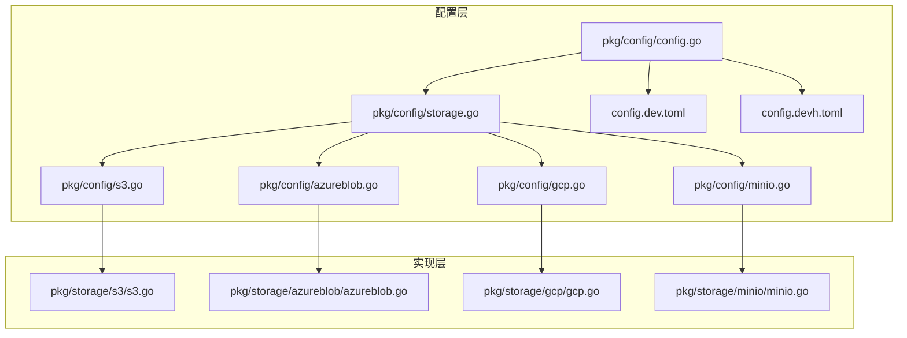
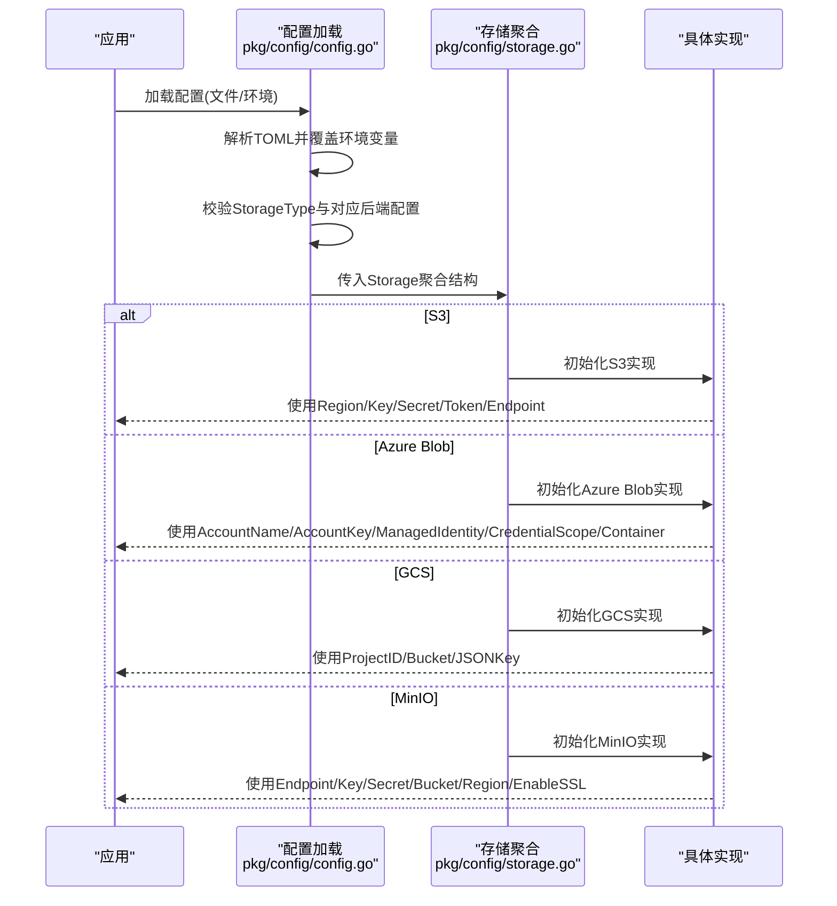
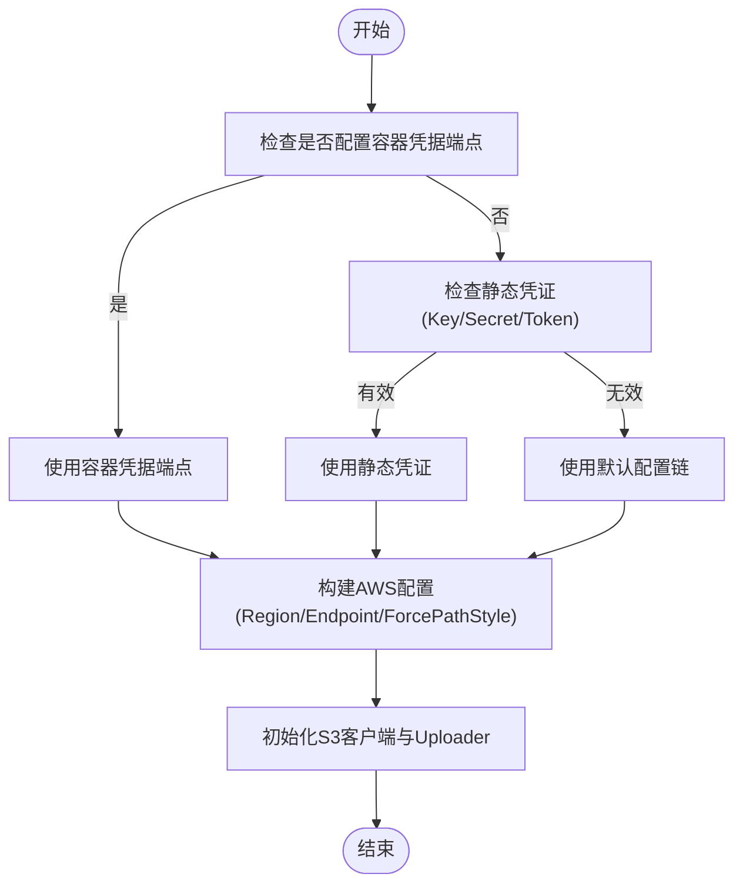
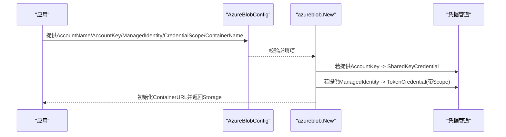
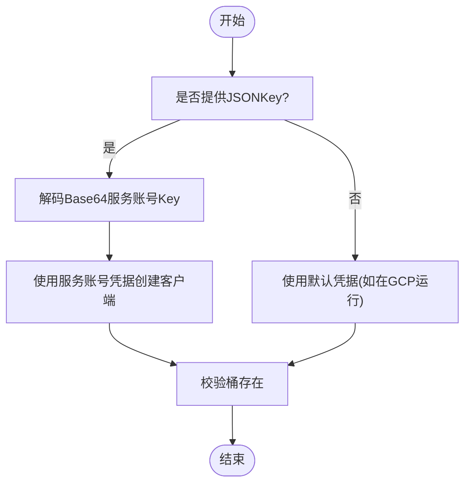
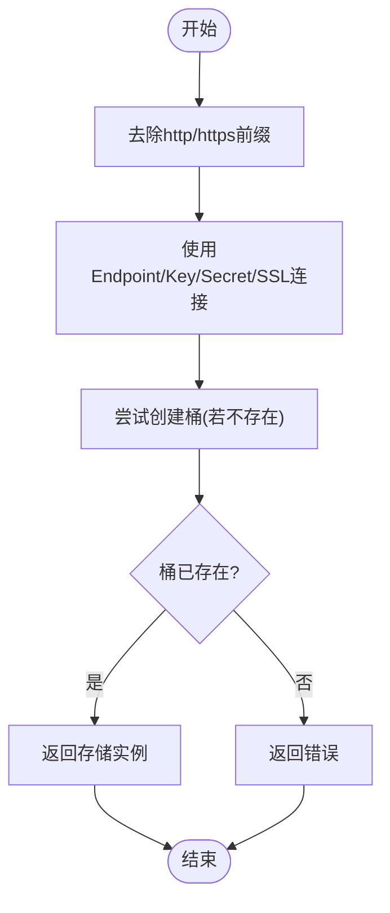
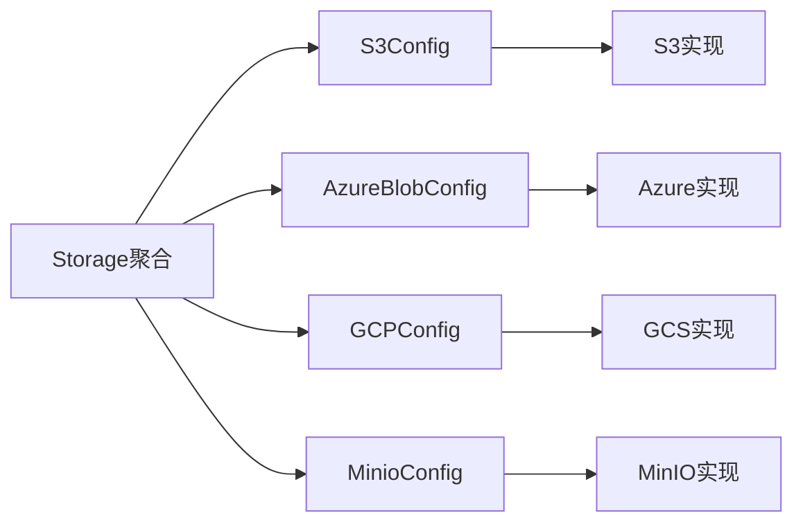

# 云存储配置

<cite>
**本文引用的文件**
- [pkg/config/storage.go](file://pkg/config/storage.go)
- [pkg/config/s3.go](file://pkg/config/s3.go)
- [pkg/config/azureblob.go](file://pkg/config/azureblob.go)
- [pkg/config/gcp.go](file://pkg/config/gcp.go)
- [pkg/config/minio.go](file://pkg/config/minio.go)
- [pkg/config/config.go](file://pkg/config/config.go)
- [docs/content/configuration/storage.md](file://docs/content/configuration/storage.md)
- [config.dev.toml](file://config.dev.toml)
- [config.devh.toml](file://config.devh.toml)
- [pkg/storage/s3/s3.go](file://pkg/storage/s3/s3.go)
- [pkg/storage/azureblob/azureblob.go](file://pkg/storage/azureblob/azureblob.go)
- [pkg/storage/gcp/gcp.go](file://pkg/storage/gcp/gcp.go)
- [pkg/storage/minio/minio.go](file://pkg/storage/minio/minio.go)
</cite>

## 目录
1. [简介](#简介)
2. [项目结构](#项目结构)
3. [核心组件](#核心组件)
4. [架构总览](#架构总览)
5. [详细组件分析](#详细组件分析)
6. [依赖关系分析](#依赖关系分析)
7. [性能考虑](#性能考虑)
8. [故障排查指南](#故障排查指南)
9. [结论](#结论)
10. [附录](#附录)

## 简介
本文件面向云存储配置的综合文档，聚焦于 Athens 代理在多种对象存储后端（AWS S3、Azure Blob、Google Cloud Storage、MinIO/兼容对象存储）上的配置与最佳实践。内容涵盖认证方式、区域设置、桶/容器配置、访问权限管理、成本优化、性能调优、安全配置、监控、备份与灾难恢复等主题，并提供公有云与私有云部署的配置示例与参考路径。

## 项目结构
围绕云存储配置，项目的关键文件与职责如下：
- 配置定义与解析
  - 存储类型聚合：pkg/config/storage.go
  - 各后端配置结构体：pkg/config/s3.go、pkg/config/azureblob.go、pkg/config/gcp.go、pkg/config/minio.go
  - 统一配置加载与校验：pkg/config/config.go
  - 示例配置文件：config.dev.toml、config.devh.toml
- 文档与示例
  - 存储配置文档：docs/content/configuration/storage.md
- 存储实现
  - S3 实现：pkg/storage/s3/s3.go
  - Azure Blob 实现：pkg/storage/azureblob/azureblob.go
  - GCS 实现：pkg/storage/gcp/gcp.go
  - MinIO 实现：pkg/storage/minio/minio.go

图表来源
- [pkg/config/config.go](file://pkg/config/config.go#L21-L66)
- [pkg/config/storage.go](file://pkg/config/storage.go#L3-L12)
- [pkg/config/s3.go](file://pkg/config/s3.go#L3-L15)
- [pkg/config/azureblob.go](file://pkg/config/azureblob.go#L3-L10)
- [pkg/config/gcp.go](file://pkg/config/gcp.go#L3-L8)
- [pkg/config/minio.go](file://pkg/config/minio.go#L3-L12)
- [pkg/storage/s3/s3.go](file://pkg/storage/s3/s3.go#L34-L74)
- [pkg/storage/azureblob/azureblob.go](file://pkg/storage/azureblob/azureblob.go#L92-L106)
- [pkg/storage/gcp/gcp.go](file://pkg/storage/gcp/gcp.go#L32-L47)
- [pkg/storage/minio/minio.go](file://pkg/storage/minio/minio.go#L26-L56)

章节来源
- [pkg/config/storage.go](file://pkg/config/storage.go#L3-L12)
- [pkg/config/config.go](file://pkg/config/config.go#L21-L66)
- [docs/content/configuration/storage.md](file://docs/content/configuration/storage.md#L7-L530)

## 核心组件
- 存储类型聚合：统一承载各后端配置，便于集中校验与选择。
- 各后端配置结构体：定义认证、区域、端点、桶/容器、SSL 等关键字段。
- 配置加载与校验：支持从 TOML 文件与环境变量加载，按 StorageType 校验对应后端配置。
- 文档与示例：提供各后端的配置示例、环境变量映射与注意事项。

章节来源
- [pkg/config/storage.go](file://pkg/config/storage.go#L3-L12)
- [pkg/config/s3.go](file://pkg/config/s3.go#L3-L15)
- [pkg/config/azureblob.go](file://pkg/config/azureblob.go#L3-L10)
- [pkg/config/gcp.go](file://pkg/config/gcp.go#L3-L8)
- [pkg/config/minio.go](file://pkg/config/minio.go#L3-L12)
- [pkg/config/config.go](file://pkg/config/config.go#L282-L320)
- [docs/content/configuration/storage.md](file://docs/content/configuration/storage.md#L107-L530)

## 架构总览
下图展示 Athens 如何根据配置选择并初始化各云存储后端，以及关键认证与端点参数的流向。

图表来源
- [pkg/config/config.go](file://pkg/config/config.go#L229-L254)
- [pkg/config/config.go](file://pkg/config/config.go#L299-L320)
- [pkg/config/storage.go](file://pkg/config/storage.go#L3-L12)
- [pkg/storage/s3/s3.go](file://pkg/storage/s3/s3.go#L34-L74)
- [pkg/storage/azureblob/azureblob.go](file://pkg/storage/azureblob/azureblob.go#L92-L106)
- [pkg/storage/gcp/gcp.go](file://pkg/storage/gcp/gcp.go#L32-L47)
- [pkg/storage/minio/minio.go](file://pkg/storage/minio/minio.go#L26-L56)

## 详细组件分析

### AWS S3 配置
- 认证方式
  - 支持静态凭证（Key/Secret/Token）、默认配置链、容器内凭据端点、自定义端点等。
  - 支持路径风格访问与自定义 Endpoint。
- 区域与桶
  - Region 必填；Bucket 必填；可选 ForcePathStyle。
- 端点与容器凭据
  - 支持 CredentialsEndpoint 与 AwsContainerCredentialsRelativeURI（适用于 ECS/Fargate）。
- 环境变量映射
  - AWS_REGION、AWS_ACCESS_KEY_ID、AWS_SECRET_ACCESS_KEY、AWS_SESSION_TOKEN、AWS_FORCE_PATH_STYLE、AWS_CREDENTIALS_ENDPOINT、AWS_CONTAINER_CREDENTIALS_RELATIVE_URI、AWS_ENDPOINT、ATHENS_S3_BUCKET_NAME。
- 配置示例参考
  - docs 配置章节与 config.dev.toml 中的 [Storage.S3] 段落。

图表来源
- [pkg/storage/s3/s3.go](file://pkg/storage/s3/s3.go#L34-L74)
- [pkg/config/s3.go](file://pkg/config/s3.go#L3-L15)
- [docs/content/configuration/storage.md](file://docs/content/configuration/storage.md#L129-L209)
- [config.dev.toml](file://config.dev.toml#L473-L537)

章节来源
- [pkg/config/s3.go](file://pkg/config/s3.go#L3-L15)
- [pkg/storage/s3/s3.go](file://pkg/storage/s3/s3.go#L34-L74)
- [docs/content/configuration/storage.md](file://docs/content/configuration/storage.md#L129-L209)
- [config.dev.toml](file://config.dev.toml#L473-L537)

### Azure Blob 配置
- 认证方式
  - 支持共享密钥与托管身份（Managed Identity），需提供资源范围（CredentialScope）。
- 桶/容器与区域
  - AccountName、ContainerName 必填；支持托管身份资源 ID 与资源范围。
- 端到端流程
  - 校验至少提供 AccountKey 或（ManagedIdentityResourceID 与 CredentialScope）。
  - 构建服务 URL 与管道，初始化容器句柄。

图表来源
- [pkg/config/azureblob.go](file://pkg/config/azureblob.go#L3-L10)
- [pkg/storage/azureblob/azureblob.go](file://pkg/storage/azureblob/azureblob.go#L92-L106)
- [pkg/storage/azureblob/azureblob.go](file://pkg/storage/azureblob/azureblob.go#L32-L82)

章节来源
- [pkg/config/azureblob.go](file://pkg/config/azureblob.go#L3-L10)
- [pkg/storage/azureblob/azureblob.go](file://pkg/storage/azureblob/azureblob.go#L92-L106)
- [docs/content/configuration/storage.md](file://docs/content/configuration/storage.md#L313-L353)

### Google Cloud Storage 配置
- 认证方式
  - 支持默认凭据（运行于 GCP 时自动获取）与服务账号 JSON Key（Base64 编码）。
- 项目与桶
  - ProjectID、Bucket 必填；可选 JSONKey。
- 端到端流程
  - 若提供 JSONKey 则解码并注入凭据；否则使用默认凭据。
  - 校验桶是否存在。

图表来源
- [pkg/config/gcp.go](file://pkg/config/gcp.go#L3-L8)
- [pkg/storage/gcp/gcp.go](file://pkg/storage/gcp/gcp.go#L32-L47)
- [pkg/storage/gcp/gcp.go](file://pkg/storage/gcp/gcp.go#L51-L74)

章节来源
- [pkg/config/gcp.go](file://pkg/config/gcp.go#L3-L8)
- [pkg/storage/gcp/gcp.go](file://pkg/storage/gcp/gcp.go#L32-L47)
- [docs/content/configuration/storage.md](file://docs/content/configuration/storage.md#L107-L128)

### MinIO/兼容对象存储（含 DigitalOcean Spaces、Alibaba OSS）配置
- 认证与端点
  - Endpoint、Key、Secret、Bucket 必填；可选 Region、EnableSSL。
- 端到端流程
  - 去除协议前缀后连接；创建/确认桶存在；返回实现实例。

图表来源
- [pkg/config/minio.go](file://pkg/config/minio.go#L3-L12)
- [pkg/storage/minio/minio.go](file://pkg/storage/minio/minio.go#L26-L56)
- [pkg/storage/minio/minio.go](file://pkg/storage/minio/minio.go#L58-L66)

章节来源
- [pkg/config/minio.go](file://pkg/config/minio.go#L3-L12)
- [pkg/storage/minio/minio.go](file://pkg/storage/minio/minio.go#L26-L56)
- [docs/content/configuration/storage.md](file://docs/content/configuration/storage.md#L210-L312)

### 配置加载与校验
- 配置来源
  - 优先使用命令行指定的配置文件；否则回退到当前目录下的默认文件；最后使用内置默认值并叠加环境变量覆盖。
- 校验逻辑
  - 先整体校验非 Storage/Index 字段；再按 StorageType 对应校验各后端结构体。
- 环境变量覆盖
  - 通过 envconfig 自动映射，支持复杂列表与端口格式处理。

章节来源
- [pkg/config/config.go](file://pkg/config/config.go#L127-L144)
- [pkg/config/config.go](file://pkg/config/config.go#L229-L254)
- [pkg/config/config.go](file://pkg/config/config.go#L282-L320)
- [pkg/config/config.go](file://pkg/config/config.go#L256-L273)

## 依赖关系分析
- 配置到实现的依赖
  - 各后端配置结构体（S3Config、AzureBlobConfig、GCPConfig、MinioConfig）作为输入，驱动对应实现模块初始化。
- 配置聚合与校验
  - Storage 聚合结构体承载各后端配置，validateStorage 按 StorageType 分派校验。
- 文档与示例的一致性
  - docs 配置文档与 config.dev.toml 中的键名、示例值保持一致，便于对照。

图表来源
- [pkg/config/storage.go](file://pkg/config/storage.go#L3-L12)
- [pkg/config/s3.go](file://pkg/config/s3.go#L3-L15)
- [pkg/config/azureblob.go](file://pkg/config/azureblob.go#L3-L10)
- [pkg/config/gcp.go](file://pkg/config/gcp.go#L3-L8)
- [pkg/config/minio.go](file://pkg/config/minio.go#L3-L12)

章节来源
- [pkg/config/storage.go](file://pkg/config/storage.go#L3-L12)
- [pkg/config/config.go](file://pkg/config/config.go#L299-L320)

## 性能考虑
- 并发与单飞（Single Flight）
  - 多实例共享同一存储时，需启用分布式锁机制（etcd、redis、redis-sentinel、gcp、azureblob）以避免重复写入。
- 传输与连接
  - MinIO/兼容对象存储支持 EnableSSL；S3 支持 ForcePathStyle 与自定义 Endpoint，按网络与合规要求选择。
- 日志与可观测性
  - 支持日志级别与格式、统计导出（Prometheus）、追踪导出（Jaeger 等），建议在生产环境开启并配置相应后端。

章节来源
- [docs/content/configuration/storage.md](file://docs/content/configuration/storage.md#L392-L530)
- [config.dev.toml](file://config.dev.toml#L290-L327)
- [pkg/config/config.go](file://pkg/config/config.go#L37-L38)

## 故障排查指南
- 常见问题定位
  - 配置未生效：确认 StorageType 与对应后端配置段落正确；检查环境变量覆盖顺序与端口格式。
  - S3 凭证链问题：优先检查容器凭据端点与相对 URI；其次检查静态凭证；最后回退默认配置。
  - Azure Blob：确保提供 AccountKey 或（托管身份资源 ID + 资源范围）之一。
  - GCS：若非 GCP 环境，需提供服务账号 JSONKey 或设置默认凭据环境变量。
  - MinIO：确认 Endpoint 协议前缀已被移除；桶名称符合规范；SSL 开关与 Region 设置正确。
- 建议步骤
  - 逐步启用日志与统计导出，观察错误堆栈与指标。
  - 在测试环境先验证桶/容器存在与权限，再迁移至生产。

章节来源
- [pkg/config/config.go](file://pkg/config/config.go#L229-L254)
- [pkg/storage/s3/s3.go](file://pkg/storage/s3/s3.go#L34-L74)
- [pkg/storage/azureblob/azureblob.go](file://pkg/storage/azureblob/azureblob.go#L92-L106)
- [pkg/storage/gcp/gcp.go](file://pkg/storage/gcp/gcp.go#L32-L47)
- [pkg/storage/minio/minio.go](file://pkg/storage/minio/minio.go#L26-L56)

## 结论
本文基于 Athens 的配置与实现，系统梳理了 AWS S3、Azure Blob、Google Cloud Storage、MinIO/兼容对象存储的配置要点与最佳实践。通过明确的认证方式、区域与桶/容器设置、访问控制、性能与成本优化、安全加固、监控与灾备策略，可帮助团队在公有云与私有云环境下稳定、高效地部署与运维 Athens 代理的云存储后端。

## 附录
- 配置示例参考路径
  - AWS S3：docs 配置章节与 config.dev.toml 的 [Storage.S3] 段落
  - Azure Blob：docs 配置章节与 config.dev.toml 的 [Storage.AzureBlob] 段落
  - GCS：docs 配置章节与 config.dev.toml 的 [Storage.GCP] 段落
  - MinIO/兼容对象存储：docs 配置章节与 config.dev.toml 的 [Storage.Minio] 段落
- 环境变量一览（节选）
  - S3：AWS_REGION、AWS_ACCESS_KEY_ID、AWS_SECRET_ACCESS_KEY、AWS_SESSION_TOKEN、AWS_FORCE_PATH_STYLE、AWS_CREDENTIALS_ENDPOINT、AWS_CONTAINER_CREDENTIALS_RELATIVE_URI、AWS_ENDPOINT、ATHENS_S3_BUCKET_NAME
  - Azure Blob：ATHENS_AZURE_ACCOUNT_NAME、ATHENS_AZURE_ACCOUNT_KEY、ATHENS_AZURE_MANAGED_IDENTITY_RESOURCE_ID、ATHENS_AZURE_CREDENTIAL_SCOPE、ATHENS_AZURE_CONTAINER_NAME
  - GCS：GOOGLE_CLOUD_PROJECT、ATHENS_STORAGE_GCP_BUCKET、ATHENS_STORAGE_GCP_JSON_KEY
  - MinIO：ATHENS_MINIO_ENDPOINT、ATHENS_MINIO_ACCESS_KEY_ID、ATHENS_MINIO_SECRET_ACCESS_KEY、ATHENS_MINIO_BUCKET_NAME、ATHENS_MINIO_REGION、ATHENS_MINIO_USE_SSL

章节来源
- [docs/content/configuration/storage.md](file://docs/content/configuration/storage.md#L107-L530)
- [config.dev.toml](file://config.dev.toml#L404-L566)
- [config.devh.toml](file://config.devh.toml#L355-L510)