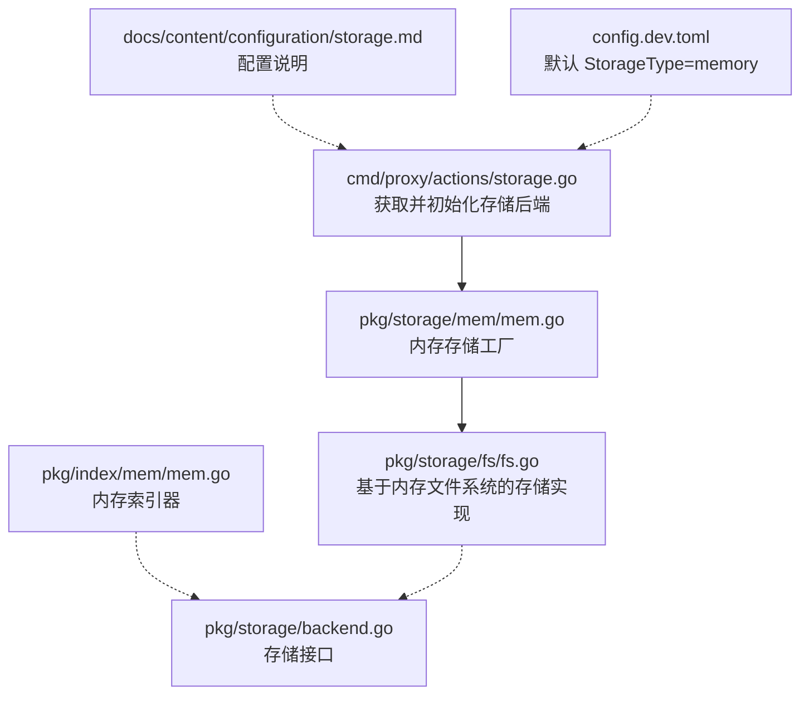
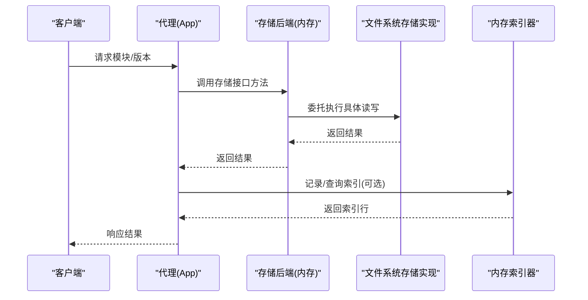
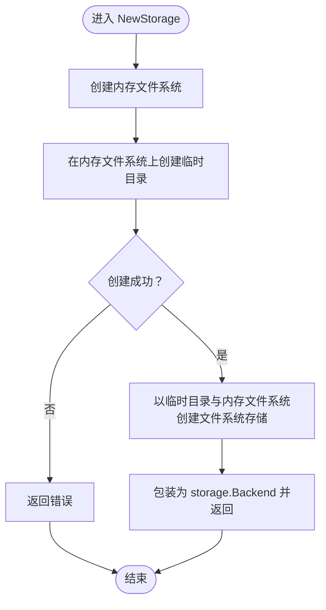
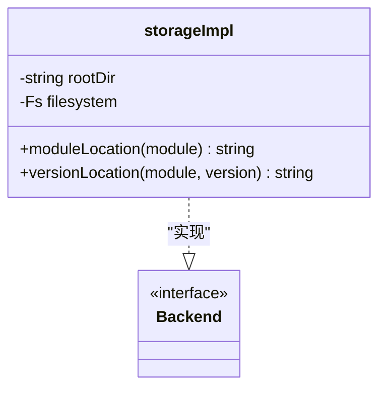
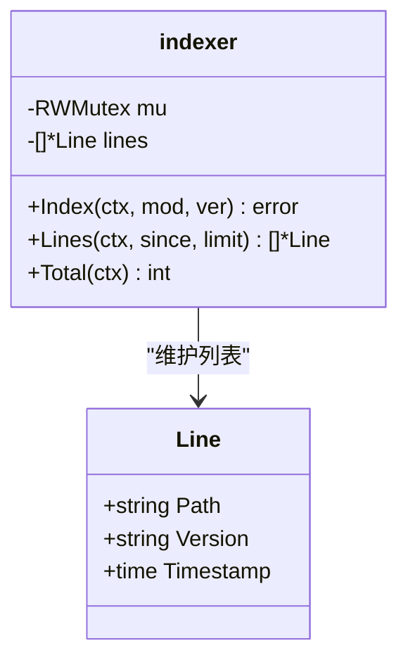
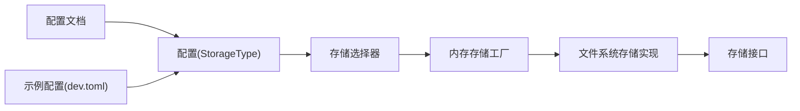

# 内存存储配置

<cite>
**本文引用的文件**
- [pkg/storage/mem/mem.go](file://pkg/storage/mem/mem.go)
- [cmd/proxy/actions/storage.go](file://cmd/proxy/actions/storage.go)
- [docs/content/configuration/storage.md](file://docs/content/configuration/storage.md)
- [pkg/storage/fs/fs.go](file://pkg/storage/fs/fs.go)
- [pkg/index/mem/mem.go](file://pkg/index/mem/mem.go)
- [pkg/storage/backend.go](file://pkg/storage/backend.go)
- [pkg/storage/compliance/tests.go](file://pkg/storage/compliance/tests.go)
- [config.dev.toml](file://config.dev.toml)
</cite>

## 目录
1. [简介](#简介)
2. [项目结构](#项目结构)
3. [核心组件](#核心组件)
4. [架构总览](#架构总览)
5. [详细组件分析](#详细组件分析)
6. [依赖关系分析](#依赖关系分析)
7. [性能与限制](#性能与限制)
8. [故障排查指南](#故障排查指南)
9. [结论](#结论)
10. [附录：配置示例与最佳实践](#附录配置示例与最佳实践)

## 简介
本篇文档聚焦于 Athens 中“内存存储”（memory storage）的配置与使用，涵盖其工作原理、适用场景、限制与性能特征，并提供可操作的配置示例与优化建议。根据官方文档，内存存储无需额外配置，默认即为开发用途，且在进程生命周期内有效；一旦进程退出或重启，数据将丢失。

## 项目结构
与内存存储相关的关键代码与文档分布如下：
- 存储后端选择与初始化：cmd/proxy/actions/storage.go
- 内存存储实现：pkg/storage/mem/mem.go
- 文件系统抽象层（内存存储基于该层实现）：pkg/storage/fs/fs.go
- 索引器（内存版本）：pkg/index/mem/mem.go
- 存储接口定义：pkg/storage/backend.go
- 配置文档（含内存存储说明）：docs/content/configuration/storage.md
- 示例配置文件（包含默认 StorageType）：config.dev.toml

**图示来源**
- [cmd/proxy/actions/storage.go](file://cmd/proxy/actions/storage.go#L24-L76)
- [pkg/storage/mem/mem.go](file://pkg/storage/mem/mem.go#L12-L27)
- [pkg/storage/fs/fs.go](file://pkg/storage/fs/fs.go#L26-L39)
- [pkg/index/mem/mem.go](file://pkg/index/mem/mem.go#L13-L16)
- [pkg/storage/backend.go](file://pkg/storage/backend.go#L3-L9)
- [docs/content/configuration/storage.md](file://docs/content/configuration/storage.md#L41-L51)
- [config.dev.toml](file://config.dev.toml#L122-L126)

**章节来源**
- [cmd/proxy/actions/storage.go](file://cmd/proxy/actions/storage.go#L24-L76)
- [pkg/storage/mem/mem.go](file://pkg/storage/mem/mem.go#L12-L27)
- [pkg/storage/fs/fs.go](file://pkg/storage/fs/fs.go#L26-L39)
- [pkg/index/mem/mem.go](file://pkg/index/mem/mem.go#L13-L16)
- [pkg/storage/backend.go](file://pkg/storage/backend.go#L3-L9)
- [docs/content/configuration/storage.md](file://docs/content/configuration/storage.md#L41-L51)
- [config.dev.toml](file://config.dev.toml#L122-L126)

## 核心组件
- 内存存储工厂：负责创建基于内存文件系统的存储实例，内部通过 afero 的内存文件系统实现，并委托给文件系统存储实现。
- 文件系统存储实现：统一的 Lister/Getter/Saver/Deleter 后端，支持清空与重建根目录等操作。
- 存储接口：定义了存储后端的统一能力边界。
- 索引器（内存）：提供模块版本索引的内存实现，用于记录模块路径、版本与时间戳。
- 存储后端选择器：根据配置的 StorageType 返回对应存储后端实例。

**章节来源**
- [pkg/storage/mem/mem.go](file://pkg/storage/mem/mem.go#L12-L27)
- [pkg/storage/fs/fs.go](file://pkg/storage/fs/fs.go#L26-L39)
- [pkg/storage/backend.go](file://pkg/storage/backend.go#L3-L9)
- [pkg/index/mem/mem.go](file://pkg/index/mem/mem.go#L13-L62)
- [cmd/proxy/actions/storage.go](file://cmd/proxy/actions/storage.go#L24-L76)

## 架构总览
内存存储的运行时架构如下：代理根据配置选择内存存储类型，调用工厂创建内存存储实例；该实例基于 afero 内存文件系统，再委托文件系统存储实现完成具体读写；索引器在内存中维护模块版本清单。

**图示来源**
- [cmd/proxy/actions/storage.go](file://cmd/proxy/actions/storage.go#L24-L76)
- [pkg/storage/mem/mem.go](file://pkg/storage/mem/mem.go#L12-L27)
- [pkg/storage/fs/fs.go](file://pkg/storage/fs/fs.go#L26-L39)
- [pkg/index/mem/mem.go](file://pkg/index/mem/mem.go#L23-L56)

## 详细组件分析

### 组件一：内存存储工厂
- 功能要点
  - 使用 afero.NewMemMapFs 创建内存文件系统
  - 在内存文件系统上创建临时目录作为根路径
  - 将根路径与内存文件系统传入文件系统存储实现，返回统一的存储后端接口
- 错误处理
  - 若无法创建临时目录或从内存文件系统创建存储，会包装错误并返回
- 适用性
  - 默认开发用途，适合快速验证与本地测试
  - 不适用于生产或需要持久化的场景

**图示来源**
- [pkg/storage/mem/mem.go](file://pkg/storage/mem/mem.go#L12-L27)

**章节来源**
- [pkg/storage/mem/mem.go](file://pkg/storage/mem/mem.go#L12-L27)

### 组件二：文件系统存储实现（内存存储的基础）
- 功能要点
  - 以 rootDir 为根目录，基于 afero.Fs 实现统一的存储能力
  - 提供模块与版本路径拼接工具
  - 支持清空并重建根目录
- 关键行为
  - 初始化时校验根目录是否存在
  - 清空时删除并重建根目录

**图示来源**
- [pkg/storage/fs/fs.go](file://pkg/storage/fs/fs.go#L13-L39)

**章节来源**
- [pkg/storage/fs/fs.go](file://pkg/storage/fs/fs.go#L13-L39)

### 组件三：存储接口与一致性保障
- 接口职责
  - 定义 Lister、Getter、Saver、Deleter 的组合能力
- 一致性与合规性
  - 存储实现需满足统一的合规性测试，确保基本行为一致（如不存在时返回特定错误类型、列表/删除/存在性检查等）

**章节来源**
- [pkg/storage/backend.go](file://pkg/storage/backend.go#L3-L9)
- [pkg/storage/compliance/tests.go](file://pkg/storage/compliance/tests.go#L16-L28)

### 组件四：内存索引器
- 功能要点
  - 以线性切片保存模块路径、版本与时间戳
  - 读写采用互斥锁保护
  - 支持按时间窗口与限制数量返回索引行
- 注意事项
  - 仅在内存中维护，不提供持久化
  - 适合小规模、短期使用场景

**图示来源**
- [pkg/index/mem/mem.go](file://pkg/index/mem/mem.go#L18-L62)

**章节来源**
- [pkg/index/mem/mem.go](file://pkg/index/mem/mem.go#L18-L62)

### 组件五：存储后端选择器
- 功能要点
  - 根据 StorageType 返回对应存储后端
  - memory 分支直接调用内存存储工厂
  - 其他类型分支进行相应配置校验与初始化
- 与内存存储的关系
  - 当 StorageType="memory" 时，返回内存存储实例

**章节来源**
- [cmd/proxy/actions/storage.go](file://cmd/proxy/actions/storage.go#L24-L76)

## 依赖关系分析
- 内存存储依赖 afero 内存文件系统，通过文件系统存储实现提供统一的存储接口
- 存储后端选择器在启动阶段根据配置决定使用哪种存储类型
- 文档与示例配置明确了默认值与开发用途

**图示来源**
- [cmd/proxy/actions/storage.go](file://cmd/proxy/actions/storage.go#L24-L76)
- [pkg/storage/mem/mem.go](file://pkg/storage/mem/mem.go#L12-L27)
- [pkg/storage/fs/fs.go](file://pkg/storage/fs/fs.go#L26-L39)
- [docs/content/configuration/storage.md](file://docs/content/configuration/storage.md#L41-L51)
- [config.dev.toml](file://config.dev.toml#L122-L126)

**章节来源**
- [cmd/proxy/actions/storage.go](file://cmd/proxy/actions/storage.go#L24-L76)
- [pkg/storage/mem/mem.go](file://pkg/storage/mem/mem.go#L12-L27)
- [pkg/storage/fs/fs.go](file://pkg/storage/fs/fs.go#L26-L39)
- [docs/content/configuration/storage.md](file://docs/content/configuration/storage.md#L41-L51)
- [config.dev.toml](file://config.dev.toml#L122-L126)

## 性能与限制
- 特点
  - 基于内存文件系统，读写速度较快
  - 无磁盘 IO 开销，适合本地开发与测试
- 限制
  - 数据驻留在进程内存中，进程退出或重启后数据丢失
  - 不具备持久化能力，不适合生产或需要长期保留的场景
  - 与单机内存大小相关，超出内存容量将受系统限制
- 与其他存储后端对比
  - 相比磁盘存储：无磁盘 IO，但不具备持久化
  - 相比对象存储（S3/GCS/Azure Blob）：读写更快，但不具备跨实例共享与持久化
  - 相比数据库存储（Mongo/MySQL/Postgres）：读写更快，但不具备强一致与持久化特性（除非配合外部持久化介质）
- 选择标准
  - 仅当需要快速本地验证、临时部署或开发测试时选用
  - 生产环境建议选择具备持久化与高可用性的存储后端

**章节来源**
- [docs/content/configuration/storage.md](file://docs/content/configuration/storage.md#L41-L51)
- [pkg/storage/mem/mem.go](file://pkg/storage/mem/mem.go#L12-L27)
- [pkg/storage/fs/fs.go](file://pkg/storage/fs/fs.go#L26-L39)

## 故障排查指南
- 常见问题
  - 进程重启后模块缺失：属于预期行为，内存存储不具备持久化
  - 配置错误导致无法加载内存存储：检查 StorageType 是否为 "memory"
  - 内存不足导致写入失败：关注系统内存与模块体积
- 定位步骤
  - 确认配置文件中的 StorageType 设置
  - 查看启动日志中是否成功创建内存存储实例
  - 使用合规性测试验证基本功能（存在性、列表、删除、获取等）
- 参考实现
  - 存储后端选择器对未知类型返回错误
  - 内存存储工厂在创建失败时返回带上下文的错误

**章节来源**
- [cmd/proxy/actions/storage.go](file://cmd/proxy/actions/storage.go#L73-L75)
- [pkg/storage/mem/mem.go](file://pkg/storage/mem/mem.go#L18-L26)
- [pkg/storage/compliance/tests.go](file://pkg/storage/compliance/tests.go#L16-L28)

## 结论
内存存储是 Athens 的轻量级开发存储方案，具备快速、易用、无需配置的特点，但不提供持久化能力。它最适合开发测试与临时部署场景。生产环境应选择具备持久化与高可用性的存储后端，并结合合适的单飞机制（如 etcd/redis 等）以保证并发一致性。

## 附录：配置示例与最佳实践
- 配置示例
  - 在配置文件中设置 StorageType 为 "memory"，即可启用内存存储
  - 示例配置文件中默认 StorageType 即为 "memory"
- 使用场景
  - 开发测试：快速拉起代理，验证模块下载与缓存流程
  - 临时部署：无外设磁盘或对象存储资源的短期环境
- 最佳实践
  - 明确区分开发与生产环境，避免在生产使用内存存储
  - 如需在多实例间共享与去重，结合单飞机制（如 etcd/redis）以避免重复下载
  - 对于需要长期保留的模块，优先选择磁盘或对象存储后端

**章节来源**
- [docs/content/configuration/storage.md](file://docs/content/configuration/storage.md#L41-L51)
- [config.dev.toml](file://config.dev.toml#L122-L126)