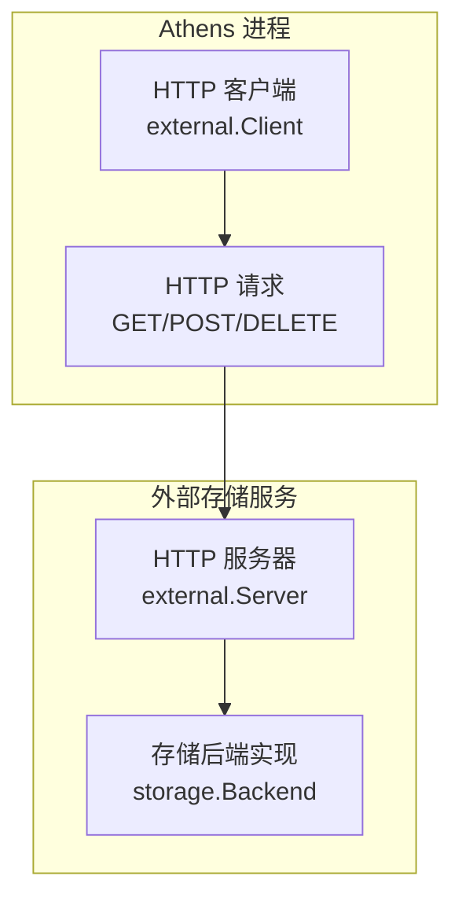
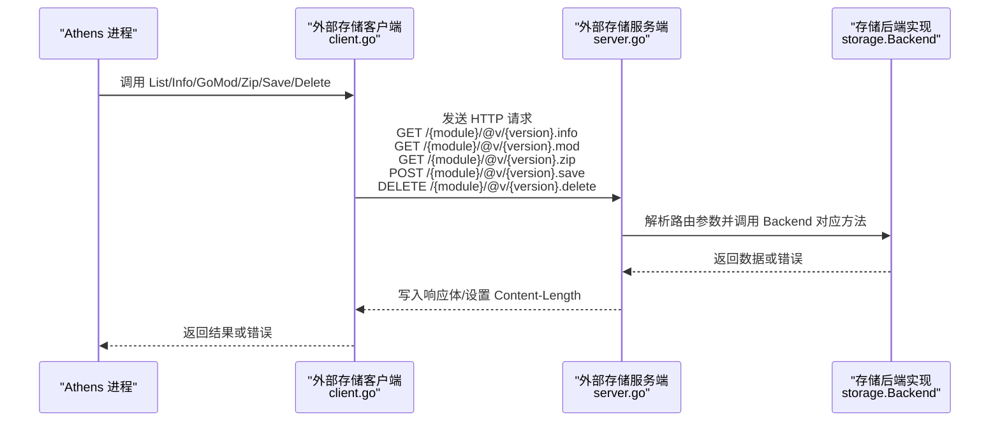
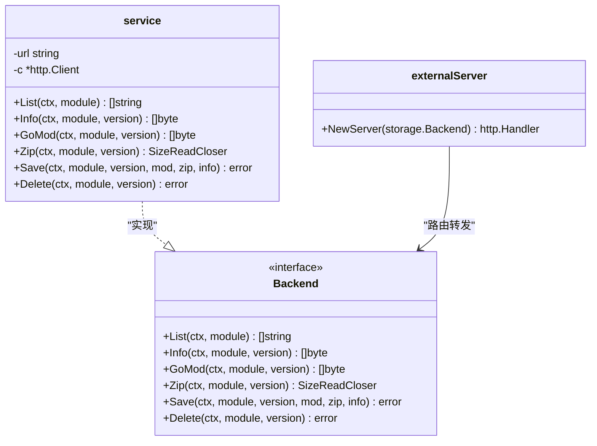
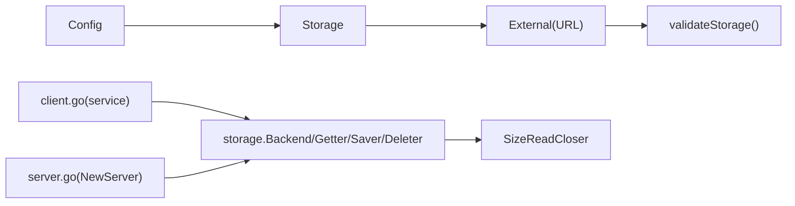

# 外部存储配置

<cite>
**本文档引用的文件**
- [pkg/config/external.go](file://pkg/config/external.go)
- [pkg/config/storage.go](file://pkg/config/storage.go)
- [pkg/config/config.go](file://pkg/config/config.go)
- [pkg/storage/external/client.go](file://pkg/storage/external/client.go)
- [pkg/storage/external/server.go](file://pkg/storage/external/server.go)
- [pkg/storage/backend.go](file://pkg/storage/backend.go)
- [pkg/storage/getter.go](file://pkg/storage/getter.go)
- [pkg/storage/saver.go](file://pkg/storage/saver.go)
- [pkg/storage/deleter.go](file://pkg/storage/deleter.go)
- [docs/content/configuration/storage.md](file://docs/content/configuration/storage.md)
- [config.dev.toml](file://config.dev.toml)
</cite>

## 目录
1. [简介](#简介)
2. [项目结构](#项目结构)
3. [核心组件](#核心组件)
4. [架构总览](#架构总览)
5. [详细组件分析](#详细组件分析)
6. [依赖关系分析](#依赖关系分析)
7. [性能考虑](#性能考虑)
8. [故障处理指南](#故障处理指南)
9. [结论](#结论)
10. [附录](#附录)

## 简介
本文件系统化阐述 Athens 外部存储（External Storage）的配置与集成方案，覆盖以下关键主题：
- 外部存储的配置参数与环境变量映射
- 通信协议与数据传输格式
- API 端点规范与调用流程
- 认证与安全注意事项
- 自定义存储后端的实现与集成步骤
- 性能优化、故障处理与监控策略
- 扩展性设计与最佳实践

## 项目结构
外部存储能力由“客户端”和“服务端”两部分组成：
- 客户端：在 Athens 侧以 HTTP 客户端形式访问外部存储服务
- 服务端：为自定义存储后端提供 HTTP 接口，适配 Athens 的存储抽象

图表来源
- [pkg/storage/external/client.go](file://pkg/storage/external/client.go#L24-L30)
- [pkg/storage/external/server.go](file://pkg/storage/external/server.go#L21-L132)

章节来源
- [pkg/storage/external/client.go](file://pkg/storage/external/client.go#L1-L191)
- [pkg/storage/external/server.go](file://pkg/storage/external/server.go#L1-L133)

## 核心组件
- 配置模型
  - 外部存储配置结构体仅包含一个必填字段：外部存储服务的根 URL
  - 该配置通过环境变量进行注入与校验
- 存储接口
  - Backend 组合了 Lister、Getter、Saver、Deleter 四个接口，统一抽象模块版本的列举、读取、保存与删除
- 客户端与服务端
  - 客户端封装 HTTP 调用，按约定路径与扩展名访问服务端
  - 服务端将 HTTP 路由映射到 Backend 的对应方法，并负责请求解析与响应返回

章节来源
- [pkg/config/external.go](file://pkg/config/external.go#L1-L7)
- [pkg/config/storage.go](file://pkg/config/storage.go#L1-L13)
- [pkg/storage/backend.go](file://pkg/storage/backend.go#L1-L10)
- [pkg/storage/getter.go](file://pkg/storage/getter.go#L1-L37)
- [pkg/storage/saver.go](file://pkg/storage/saver.go#L1-L12)
- [pkg/storage/deleter.go](file://pkg/storage/deleter.go#L1-L11)

## 架构总览
外部存储的交互遵循“HTTP REST 风格”的约定式路径与扩展名，客户端通过标准 HTTP 方法发起请求，服务端将请求参数解析为 Backend 的方法调用。

图表来源
- [pkg/storage/external/client.go](file://pkg/storage/external/client.go#L32-L123)
- [pkg/storage/external/server.go](file://pkg/storage/external/server.go#L23-L130)
- [pkg/storage/getter.go](file://pkg/storage/getter.go#L9-L13)
- [pkg/storage/saver.go](file://pkg/storage/saver.go#L9-L11)
- [pkg/storage/deleter.go](file://pkg/storage/deleter.go#L6-L10)

## 详细组件分析

### 配置参数与环境变量
- 外部存储配置项
  - 字段：URL（必填）
  - 环境变量：ATHENS_EXTERNAL_STORAGE_URL
  - 校验规则：required
- 配置加载与验证
  - 在配置加载时，根据 StorageType 选择性地对各后端配置进行校验
  - 当 StorageType 为 external 时，将对 External 结构体执行校验

章节来源
- [pkg/config/external.go](file://pkg/config/external.go#L1-L7)
- [pkg/config/storage.go](file://pkg/config/storage.go#L1-L13)
- [pkg/config/config.go](file://pkg/config/config.go#L299-L320)

### API 端点与数据传输格式
- 端点约定
  - 列表版本：GET /{module}/@v/{version}.list
  - 版本信息：GET /{module}/@v/{version}.info
  - 模块文件：GET /{module}/@v/{version}.mod
  - 压缩包：GET /{module}/@v/{version}.zip
  - 保存模块：POST /{module}/@v/{version}.save
  - 删除模块：DELETE /{module}/@v/{version}.delete
- 数据传输格式
  - GET 类型响应：二进制数据（如 .info/.mod/.zip），可携带 Content-Length
  - 保存模块：使用 multipart/form-data，包含三个字段：
    - mod.info：版本信息
    - mod.mod：go.mod 文件内容
    - mod.zip：模块压缩包流
- 错误处理
  - 非 200 响应：客户端会读取响应体并返回带状态码的错误

章节来源
- [pkg/storage/external/client.go](file://pkg/storage/external/client.go#L32-L123)
- [pkg/storage/external/server.go](file://pkg/storage/external/server.go#L23-L130)

### 认证与安全
- 认证机制
  - 外部存储未内置专用认证；客户端以明文 HTTP/HTTPS 访问服务端
  - 若需认证，建议在服务端网关或反向代理层实现（如 Basic Auth、Token 鉴权等）
- 安全建议
  - 使用 HTTPS 传输，避免中间人攻击
  - 在服务端实现访问控制与速率限制
  - 对 .save 接口进行输入校验与大小限制，防止恶意上传

章节来源
- [pkg/storage/external/client.go](file://pkg/storage/external/client.go#L98-L112)
- [pkg/storage/external/server.go](file://pkg/storage/external/server.go#L79-L116)

### 自定义存储后端实现与集成
- 实现步骤
  - 实现 storage.Backend 接口（组合 Lister、Getter、Saver、Deleter）
  - 使用 external.NewServer 将后端包装为 HTTP Handler
  - 启动 HTTP 服务，监听指定端口
- 配置集成
  - 将 StorageType 设置为 external
  - 在 [Storage.External] 中配置 URL 指向你的服务地址
- 示例参考
  - 文档提供了最小实现示例与配置片段

章节来源
- [pkg/storage/backend.go](file://pkg/storage/backend.go#L1-L10)
- [pkg/storage/external/server.go](file://pkg/storage/external/server.go#L18-L21)
- [docs/content/configuration/storage.md](file://docs/content/configuration/storage.md#L354-L391)
- [config.dev.toml](file://config.dev.toml#L559-L566)

### 客户端与服务端类图

图表来源
- [pkg/storage/backend.go](file://pkg/storage/backend.go#L4-L9)
- [pkg/storage/external/client.go](file://pkg/storage/external/client.go#L18-L30)
- [pkg/storage/external/server.go](file://pkg/storage/external/server.go#L21-L21)

## 依赖关系分析
- 配置层
  - Config.Storage 包含 Storage.External
  - validateStorage 在 StorageType=external 时校验 External
- 接口层
  - Backend 组合 Getter、Saver、Deleter
  - Getter 提供 SizeReadCloser 用于 .zip 下载
- 通信层
  - client 依赖 http.Client 与 multipart 编码
  - server 依赖 gorilla/mux 路由与路径参数解析

图表来源
- [pkg/config/config.go](file://pkg/config/config.go#L299-L320)
- [pkg/config/storage.go](file://pkg/config/storage.go#L4-L12)
- [pkg/storage/external/client.go](file://pkg/storage/external/client.go#L18-L30)
- [pkg/storage/external/server.go](file://pkg/storage/external/server.go#L21-L21)
- [pkg/storage/getter.go](file://pkg/storage/getter.go#L15-L27)

章节来源
- [pkg/config/config.go](file://pkg/config/config.go#L299-L320)
- [pkg/storage/external/client.go](file://pkg/storage/external/client.go#L1-L191)
- [pkg/storage/external/server.go](file://pkg/storage/external/server.go#L1-L133)

## 性能考虑
- 并发与连接
  - 客户端默认使用标准库 http.Client；可通过传入自定义 *http.Client 调整超时、连接池等参数
- 传输优化
  - .zip 下载通过 SizeReadCloser 传递 Content-Length，便于客户端预估与缓冲
  - .save 使用 multipart/form-data，注意控制文件大小与内存占用
- 缓存与预热
  - 可在服务端实现缓存层（如内存/Redis）以减少重复计算与 IO
- 网络与限流
  - 在反向代理层启用连接数、QPS 限制与健康检查
- 日志与追踪
  - 建议记录关键路径耗时与错误码分布，结合分布式追踪定位瓶颈

## 故障处理指南
- 常见错误类型
  - 非 200 响应：客户端会读取响应体并返回带状态码的错误
  - Content-Length 解析失败：当响应头存在非法值时抛出解析错误
  - multipart 上传失败：任一字段写入失败均会导致错误
- 排查步骤
  - 检查服务端日志与状态码
  - 核对模块路径编码是否符合 module.EscapePath 规则
  - 验证 .save 的 multipart 字段完整性与大小限制
- 重试与降级
  - 客户端可在外层实现指数退避重试
  - 在网络不稳定场景下，可考虑回退至其他存储后端或本地缓存

章节来源
- [pkg/storage/external/client.go](file://pkg/storage/external/client.go#L108-L112)
- [pkg/storage/external/client.go](file://pkg/storage/external/client.go#L182-L188)
- [pkg/storage/external/server.go](file://pkg/storage/external/server.go#L84-L116)

## 结论
外部存储为 Athens 提供了高度灵活的扩展能力：通过统一的 HTTP 接口与标准的存储接口抽象，用户可以快速接入自定义存储后端。在生产环境中，建议结合 HTTPS、访问控制、限流与监控，确保系统的安全性与稳定性。

## 附录

### API 端点一览（按方法）
- List：GET /{module}/@v/{version}.list
- Info：GET /{module}/@v/{version}.info
- GoMod：GET /{module}/@v/{version}.mod
- Zip：GET /{module}/@v/{version}.zip
- Save：POST /{module}/@v/{version}.save（multipart/form-data）
- Delete：DELETE /{module}/@v/{version}.delete

章节来源
- [pkg/storage/external/client.go](file://pkg/storage/external/client.go#L32-L123)
- [pkg/storage/external/server.go](file://pkg/storage/external/server.go#L23-L130)

### 配置示例（节选）
- StorageType = "external"
- [Storage.External]
  - URL = "<你的外部存储服务地址>"

章节来源
- [docs/content/configuration/storage.md](file://docs/content/configuration/storage.md#L361-L369)
- [config.dev.toml](file://config.dev.toml#L559-L566)