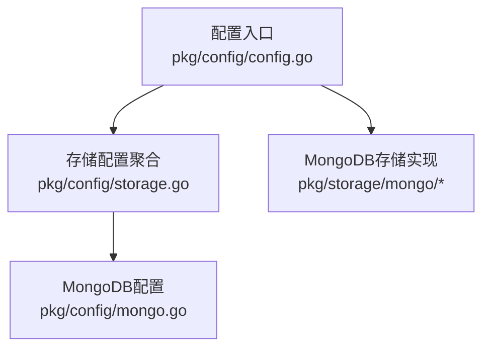
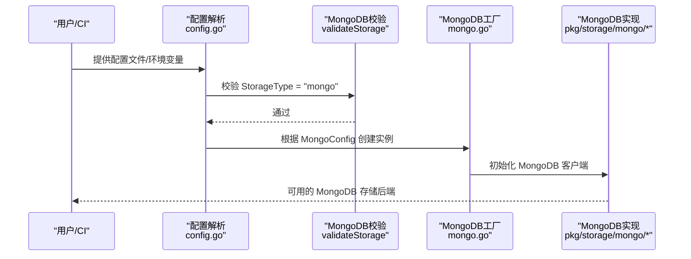
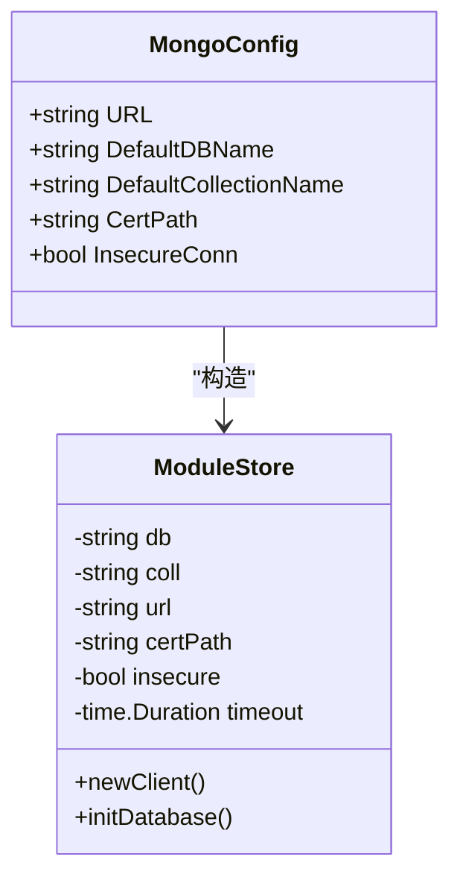
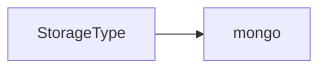

# 存储后端配置

<cite>
**本文档引用的文件**
- [pkg/config/storage.go](file://pkg/config/storage.go)
- [pkg/config/config.go](file://pkg/config/config.go)
- [pkg/config/mongo.go](file://pkg/config/mongo.go)
- [pkg/storage/mongo/mongo.go](file://pkg/storage/mongo/mongo.go)
- [docs/content/configuration/storage.md](file://docs/content/configuration/storage.md)
- [config.dev.toml](file://config.dev.toml)
- [config.devh.toml](file://config.devh.toml)
</cite>

## 更新摘要
**所做更改**
- 更新了存储后端支持情况，MongoDB成为唯一支持的存储后端
- 简化了存储配置系统，移除了对其他存储后端的支持
- 更新了配置验证逻辑，只支持'mongo'存储类型
- 更新了配置示例，反映了当前的单一存储后端架构

## 目录
1. [简介](#简介)
2. [项目结构](#项目结构)
3. [核心组件](#核心组件)
4. [架构总览](#架构总览)
5. [详细组件分析](#详细组件分析)
6. [依赖关系分析](#依赖关系分析)
7. [性能考量](#性能考量)
8. [故障排查指南](#故障排查指南)
9. [结论](#结论)
10. [附录](#附录)

## 简介
本文件系统性梳理 Athens 的存储后端配置，重点介绍 MongoDB 作为唯一支持的存储后端。文档提供 MongoDB 配置参数、连接与认证方式、性能优化建议、选择指南、最佳实践与限制说明，并给出生产环境的安全与性能调优要点。

**重要更新**：在最新版本中，MongoDB 成为唯一支持的存储后端，存储配置系统大幅简化，仅支持 MongoDB 配置。

## 项目结构
- 配置定义集中在 pkg/config 下，包含 Storage 结构体及 MongoDB 配置结构体
- 文档位于 docs/content/configuration/storage.md，提供详尽的 MongoDB 配置说明与示例
- MongoDB 存储实现位于 pkg/storage/mongo 下，负责与 MongoDB 数据库交互
- 示例配置文件 config.dev.toml 与 config.devh.toml 提供 MongoDB 配置示例

**图表来源**
- [pkg/config/config.go](file://pkg/config/config.go#L22-L66)
- [pkg/config/storage.go](file://pkg/config/storage.go#L4-L12)

**章节来源**
- [pkg/config/config.go](file://pkg/config/config.go#L22-L66)
- [pkg/config/storage.go](file://pkg/config/storage.go#L4-L12)

## 核心组件
- 存储类型验证：通过 validateStorage 实现，仅支持 "mongo" 类型
- MongoDB 配置结构体：MongoConfig，包含 URL、DefaultDBName、DefaultCollectionName、CertPath、InsecureConn 等字段
- 配置加载与环境变量覆盖：Load/ParseConfigFile/envOverride；默认值与权限检查
- MongoDB 存储实现：在 pkg/storage/mongo 下实现 Backend 接口，负责上传、下载、列举、删除等操作

**章节来源**
- [pkg/config/config.go](file://pkg/config/config.go#L282-L320)
- [pkg/config/storage.go](file://pkg/config/storage.go#L4-L12)
- [pkg/config/mongo.go](file://pkg/config/mongo.go#L4-L10)
- [pkg/storage/mongo/mongo.go](file://pkg/storage/mongo/mongo.go#L19-L50)

## 架构总览
存储后端的配置与实现遵循"配置驱动 + 接口抽象"的设计：Config 中的 StorageType 决定实例化 MongoDB 后端；validateStorage 对应结构体进行字段校验；具体实现封装 MongoDB 客户端操作。

**图表来源**
- [pkg/config/config.go](file://pkg/config/config.go#L282-L320)
- [pkg/storage/mongo/mongo.go](file://pkg/storage/mongo/mongo.go#L30-L50)

## 详细组件分析

### MongoDB（mongo）
- 用途：使用 MongoDB 存储模块数据
- 关键配置
  - StorageType = "mongo"
  - Storage.Mongo.URL：MongoDB 连接串（环境变量 ATHENS_MONGO_STORAGE_URL）
  - Storage.Mongo.DefaultDBName：默认数据库（默认 "athens"）
  - Storage.Mongo.DefaultCollectionName：默认集合（默认 "modules"）
  - Storage.Mongo.CertPath：证书路径（环境变量 ATHENS_MONGO_CERT_PATH）
  - Storage.Mongo.InsecureConn：允许不安全连接（仅开发）
- 行为：自动创建数据库与集合；建立唯一稀疏索引；支持自定义 CA 证书
- 限制：需要可访问的 MongoDB 集群；注意副本集/认证配置
- 生产建议：启用 TLS/认证；合理设置超时；监控连接池与索引

**图表来源**
- [pkg/config/mongo.go](file://pkg/config/mongo.go#L4-L10)
- [pkg/storage/mongo/mongo.go](file://pkg/storage/mongo/mongo.go#L20-L28)

**章节来源**
- [docs/content/configuration/storage.md](file://docs/content/configuration/storage.md#L71-L107)
- [pkg/config/mongo.go](file://pkg/config/mongo.go#L4-L10)
- [pkg/storage/mongo/mongo.go](file://pkg/storage/mongo/mongo.go#L52-L72)

## 依赖关系分析
- 配置到实现的映射
  - mongo → MongoDB 客户端
- 验证逻辑简化
  - 仅支持 "mongo" 存储类型
  - 移除了对其他存储后端的支持

**图表来源**
- [pkg/config/config.go](file://pkg/config/config.go#L299-L320)

**章节来源**
- [pkg/config/config.go](file://pkg/config/config.go#L299-L320)

## 性能考量
- 连接与认证
  - MongoDB：启用 TLS；设置连接超时
- 数据库优化
  - 自动创建唯一稀疏索引；合理设置数据库和集合名称
- 监控与可观测性
  - Prometheus 指标导出（StatsExporter）
  - 分布式追踪（TraceExporter/TraceExporterURL）

**章节来源**
- [docs/content/configuration/storage.md](file://docs/content/configuration/storage.md#L392-L530)
- [config.dev.toml](file://config.dev.toml#L329-L391)
- [config.devh.toml](file://config.devh.toml#L285-L342)

## 故障排查指南
- 配置校验失败
  - 检查 StorageType 是否为 "mongo"；对应配置字段是否满足 validate 校验
- 权限与认证问题
  - MongoDB：确认 URL 格式正确；证书路径有效；InsecureConn 与证书配置冲突
- 连接与超时
  - MongoDB：连接超时设置；TLS 配置；数据库访问权限
- 数据库问题
  - MongoDB：数据库和集合存在性；索引创建；权限配置

**章节来源**
- [pkg/config/config.go](file://pkg/config/config.go#L282-L297)
- [pkg/storage/mongo/mongo.go](file://pkg/storage/mongo/mongo.go#L74-L116)

## 结论
- MongoDB 成为唯一支持的存储后端，简化了配置和维护复杂度
- 开发阶段推荐 MongoDB；生产阶段优先 MongoDB
- 配置优先使用环境变量覆盖；生产环境严格校验权限与证书
- 结合业务规模与合规要求选择合适的 MongoDB 部署方案

## 附录

### 配置参数速查（MongoDB）
- MongoDB 存储
  - StorageType = "mongo"
  - Storage.Mongo.URL（环境变量：ATHENS_MONGO_STORAGE_URL）
  - Storage.Mongo.DefaultDBName（默认：athens）
  - Storage.Mongo.DefaultCollectionName（默认：modules）
  - Storage.Mongo.CertPath（环境变量：ATHENS_MONGO_CERT_PATH）
  - Storage.Mongo.InsecureConn（环境变量：ATHENS_MONGO_INSECURE）

**章节来源**
- [docs/content/configuration/storage.md](file://docs/content/configuration/storage.md#L71-L107)
- [config.dev.toml](file://config.dev.toml#L454-L471)
- [config.devh.toml](file://config.devh.toml#L404-L421)