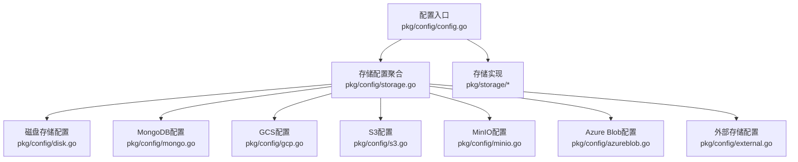
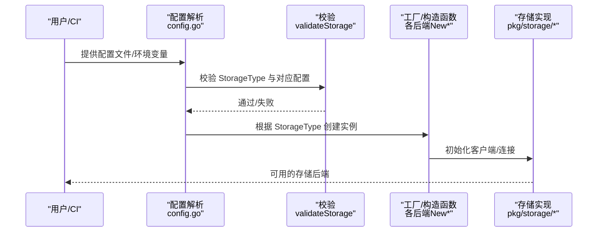
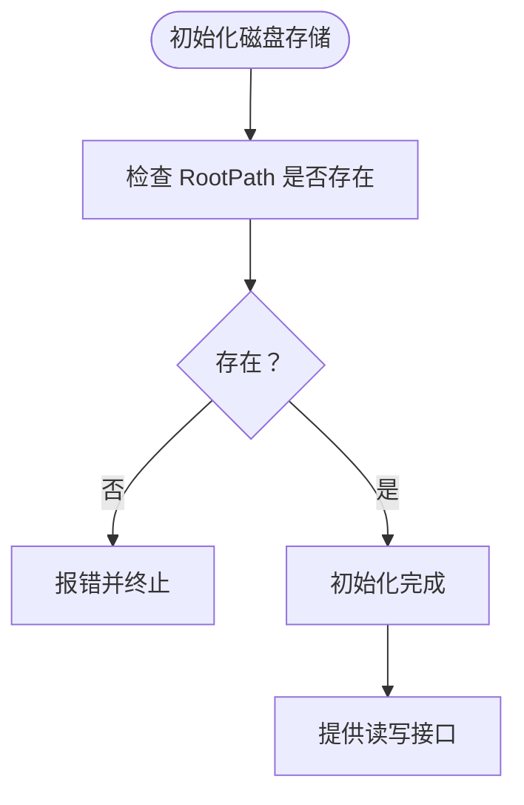
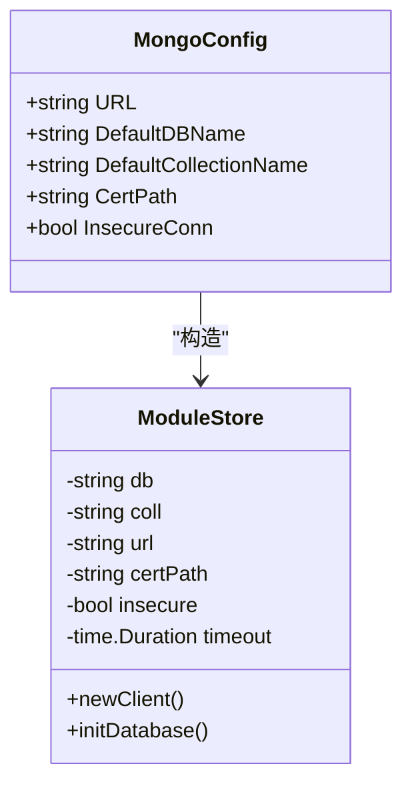
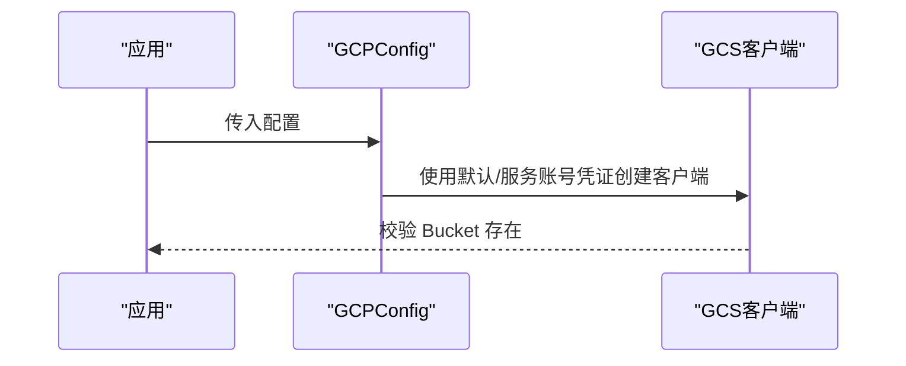
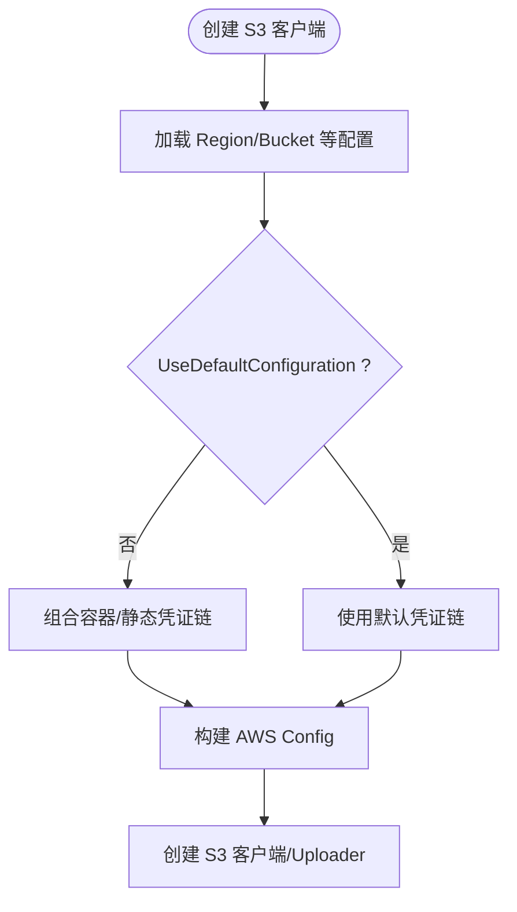
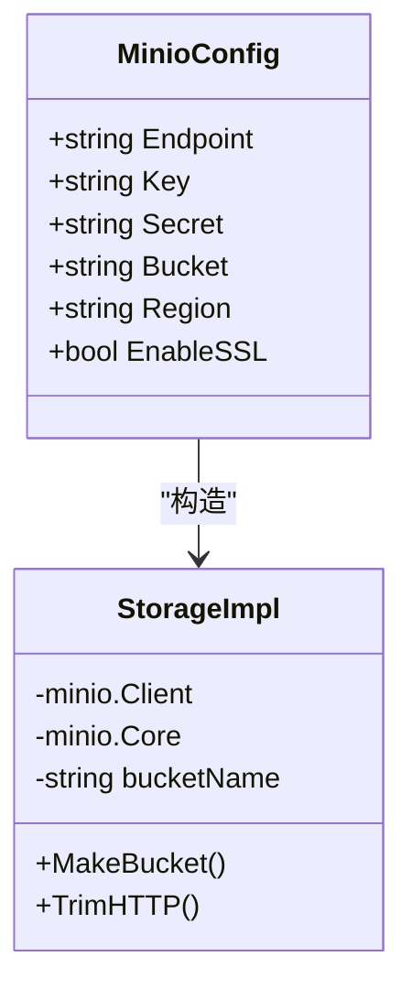
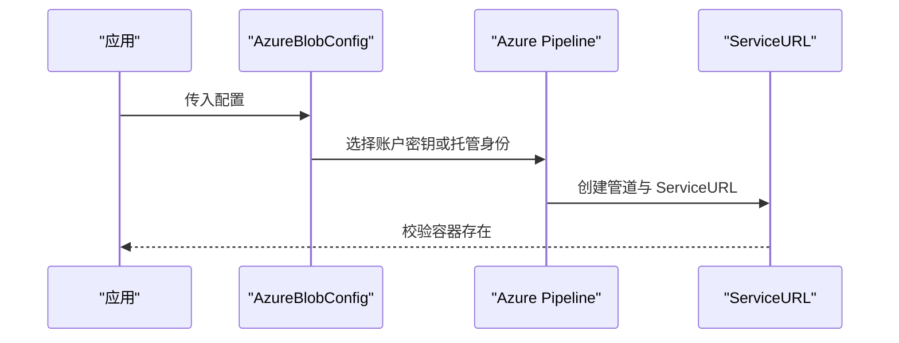
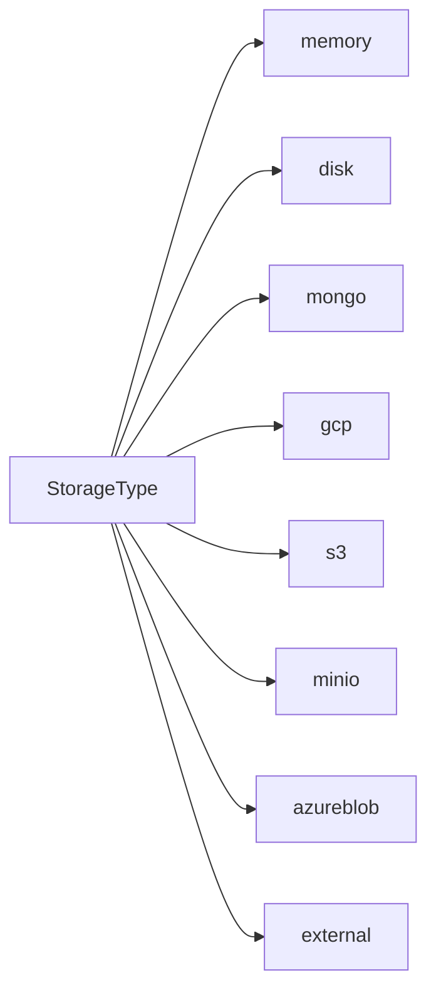

# 存储后端配置

<cite>
**本文档引用的文件**
- [pkg/config/storage.go](file://pkg/config/storage.go)
- [pkg/config/config.go](file://pkg/config/config.go)
- [docs/content/configuration/storage.md](file://docs/content/configuration/storage.md)
- [config.dev.toml](file://config.dev.toml)
- [config.devh.toml](file://config.devh.toml)
- [pkg/config/disk.go](file://pkg/config/disk.go)
- [pkg/config/mongo.go](file://pkg/config/mongo.go)
- [pkg/config/gcp.go](file://pkg/config/gcp.go)
- [pkg/config/s3.go](file://pkg/config/s3.go)
- [pkg/config/minio.go](file://pkg/config/minio.go)
- [pkg/config/azureblob.go](file://pkg/config/azureblob.go)
- [pkg/config/external.go](file://pkg/config/external.go)
- [pkg/storage/fs/fs.go](file://pkg/storage/fs/fs.go)
- [pkg/storage/mongo/mongo.go](file://pkg/storage/mongo/mongo.go)
- [pkg/storage/s3/s3.go](file://pkg/storage/s3/s3.go)
- [pkg/storage/azureblob/azureblob.go](file://pkg/storage/azureblob/azureblob.go)
- [pkg/storage/gcp/gcp.go](file://pkg/storage/gcp/gcp.go)
- [pkg/storage/minio/minio.go](file://pkg/storage/minio/minio.go)
</cite>

## 目录
1. [简介](#简介)
2. [项目结构](#项目结构)
3. [核心组件](#核心组件)
4. [架构总览](#架构总览)
5. [详细组件分析](#详细组件分析)
6. [依赖关系分析](#依赖关系分析)
7. [性能考量](#性能考量)
8. [故障排查指南](#故障排查指南)
9. [结论](#结论)
10. [附录](#附录)

## 简介
本文件系统性梳理 Athens 的存储后端配置，覆盖内存、磁盘、MongoDB、Google Cloud Storage、AWS S3、MinIO（含 DigitalOcean Spaces、阿里 OSS）、Azure Blob Storage 以及外部存储等后端。文档提供各后端的配置参数、连接与认证方式、性能优化建议、选择指南、最佳实践与限制说明，并给出生产环境的安全与性能调优要点。

## 项目结构
- 配置定义集中在 pkg/config 下，包含 Storage 结构体及各后端配置结构体
- 文档位于 docs/content/configuration/storage.md，提供详尽的配置说明与示例
- 各存储后端在 pkg/storage 下实现具体逻辑，负责与对象存储或文件系统交互
- 示例配置文件 config.dev.toml 与 config.devh.toml 提供多语言示例

图表来源
- [pkg/config/config.go](file://pkg/config/config.go#L22-L66)
- [pkg/config/storage.go](file://pkg/config/storage.go#L4-L12)

章节来源
- [pkg/config/config.go](file://pkg/config/config.go#L22-L66)
- [pkg/config/storage.go](file://pkg/config/storage.go#L4-L12)

## 核心组件
- 存储类型枚举与校验：通过 StorageType 与 validateStorage 实现，支持 memory、disk、mongo、gcp、minio、s3、azureblob、external
- 各后端配置结构体：DiskConfig、MongoConfig、GCPConfig、S3Config、MinioConfig、AzureBlobConfig、External
- 配置加载与环境变量覆盖：Load/ParseConfigFile/envOverride；默认值与权限检查
- 存储实现：各后端在 pkg/storage 下实现 Backend 接口，负责上传、下载、列举、删除等操作

章节来源
- [pkg/config/config.go](file://pkg/config/config.go#L282-L320)
- [pkg/config/storage.go](file://pkg/config/storage.go#L4-L12)
- [pkg/config/disk.go](file://pkg/config/disk.go#L4-L6)
- [pkg/config/mongo.go](file://pkg/config/mongo.go#L4-L10)
- [pkg/config/gcp.go](file://pkg/config/gcp.go#L4-L8)
- [pkg/config/s3.go](file://pkg/config/s3.go#L4-L15)
- [pkg/config/minio.go](file://pkg/config/minio.go#L4-L12)
- [pkg/config/azureblob.go](file://pkg/config/azureblob.go#L4-L10)
- [pkg/config/external.go](file://pkg/config/external.go#L4-L6)

## 架构总览
存储后端的配置与实现遵循“配置驱动 + 接口抽象”的设计：Config 中的 StorageType 决定实例化哪个后端；validateStorage 对应结构体进行字段校验；具体实现封装第三方 SDK 或文件系统操作。

图表来源
- [pkg/config/config.go](file://pkg/config/config.go#L282-L320)
- [pkg/storage/s3/s3.go](file://pkg/storage/s3/s3.go#L35-L74)
- [pkg/storage/gcp/gcp.go](file://pkg/storage/gcp/gcp.go#L32-L47)
- [pkg/storage/mongo/mongo.go](file://pkg/storage/mongo/mongo.go#L32-L50)
- [pkg/storage/azureblob/azureblob.go](file://pkg/storage/azureblob/azureblob.go#L92-L106)
- [pkg/storage/minio/minio.go](file://pkg/storage/minio/minio.go#L26-L56)
- [pkg/storage/fs/fs.go](file://pkg/storage/fs/fs.go#L29-L39)

## 详细组件分析

### 内存存储（memory）
- 用途：默认开发用途，数据驻留在本地内存
- 配置：无需额外配置项
- 限制：非持久化，重启丢失；不适合生产
- 性能：极快，适合本地开发与小规模测试

章节来源
- [docs/content/configuration/storage.md](file://docs/content/configuration/storage.md#L41-L52)
- [pkg/config/config.go](file://pkg/config/config.go#L146-L213)

### 磁盘存储（disk）
- 用途：将模块以文件形式存储在本地文件系统
- 关键配置
  - StorageType = "disk"
  - Storage.Disk.RootPath：磁盘根路径（环境变量 ATHENS_DISK_STORAGE_ROOT）
- 行为：初始化时校验根目录是否存在；提供 Clear 清理能力
- 限制：单机文件系统；跨节点共享需网络存储
- 生产建议：预填充离线缓存；监控磁盘空间与 IO

图表来源
- [pkg/storage/fs/fs.go](file://pkg/storage/fs/fs.go#L31-L39)

章节来源
- [docs/content/configuration/storage.md](file://docs/content/configuration/storage.md#L53-L70)
- [pkg/config/disk.go](file://pkg/config/disk.go#L4-L6)
- [pkg/storage/fs/fs.go](file://pkg/storage/fs/fs.go#L29-L39)

### MongoDB（mongo）
- 用途：使用 MongoDB 存储模块数据
- 关键配置
  - StorageType = "mongo"
  - Storage.Mongo.URL：MongoDB 连接串（环境变量 ATHENS_MONGO_STORAGE_URL）
  - Storage.Mongo.DefaultDBName：默认数据库（默认 "athens"）
  - Storage.Mongo.DefaultCollectionName：默认集合（默认 "modules"）
  - Storage.Mongo.CertPath：证书路径（环境变量 ATHENS_MONGO_CERT_PATH）
  - Storage.Mongo.InsecureConn：允许不安全连接（仅开发）
- 行为：自动创建数据库与集合；建立唯一稀疏索引；支持自定义 CA 证书
- 限制：需要可访问的 MongoDB 集群；注意副本集/认证配置
- 生产建议：启用 TLS/认证；合理设置超时；监控连接池与索引

图表来源
- [pkg/config/mongo.go](file://pkg/config/mongo.go#L4-L10)
- [pkg/storage/mongo/mongo.go](file://pkg/storage/mongo/mongo.go#L20-L28)

章节来源
- [docs/content/configuration/storage.md](file://docs/content/configuration/storage.md#L71-L107)
- [pkg/config/mongo.go](file://pkg/config/mongo.go#L4-L10)
- [pkg/storage/mongo/mongo.go](file://pkg/storage/mongo/mongo.go#L52-L72)

### Google Cloud Storage（gcp）
- 用途：使用 GCS 作为对象存储
- 关键配置
  - StorageType = "gcp"
  - Storage.GCP.ProjectID：GCP 项目 ID（环境变量 GOOGLE_CLOUD_PROJECT）
  - Storage.GCP.Bucket：GCS Bucket（环境变量 ATHENS_STORAGE_GCP_BUCKET）
  - Storage.GCP.JSONKey：服务账号密钥（base64 编码，环境变量 ATHENS_STORAGE_GCP_JSON_KEY）
- 认证：支持默认凭证（运行于 GCP）或显式服务账号密钥
- 限制：需提前创建 Bucket；注意 IAM 角色
- 生产建议：最小权限原则；启用对象版本控制；使用 VPC-SC（如合规要求）

图表来源
- [pkg/config/gcp.go](file://pkg/config/gcp.go#L4-L8)
- [pkg/storage/gcp/gcp.go](file://pkg/storage/gcp/gcp.go#L32-L47)

章节来源
- [docs/content/configuration/storage.md](file://docs/content/configuration/storage.md#L108-L128)
- [pkg/config/gcp.go](file://pkg/config/gcp.go#L4-L8)
- [pkg/storage/gcp/gcp.go](file://pkg/storage/gcp/gcp.go#L51-L74)

### AWS S3（s3）
- 用途：使用 S3 兼容对象存储
- 关键配置
  - StorageType = "s3"
  - Storage.S3.Region：区域（环境变量 AWS_REGION）
  - Storage.S3.Key/Secret/Token：凭证（环境变量 AWS_ACCESS_KEY_ID/SECRET_ACCESS_KEY/SESSION_TOKEN）
  - Storage.S3.Bucket：桶名（环境变量 ATHENS_S3_BUCKET_NAME）
  - Storage.S3.UseDefaultConfiguration：使用默认配置（环境变量 AWS_USE_DEFAULT_CONFIGURATION）
  - Storage.S3.ForcePathStyle：强制路径风格（环境变量 AWS_FORCE_PATH_STYLE）
  - Storage.S3.CredentialsEndpoint/AwsContainerCredentialsRelativeURI：容器凭证端点（环境变量 AWS_CREDENTIALS_ENDPOINT/AWS_CONTAINER_CREDENTIALS_RELATIVE_URI）
  - Storage.S3.Endpoint：自定义端点（环境变量 AWS_ENDPOINT）
- 认证优先级：容器凭证端点 > 显式 Key/Secret/Token > 默认配置
- 限制：需具备写入权限；注意跨区域复制与合规
- 生产建议：使用 IAM 角色/OIDC；启用桶策略与加密；合理设置生命周期

图表来源
- [pkg/config/s3.go](file://pkg/config/s3.go#L4-L15)
- [pkg/storage/s3/s3.go](file://pkg/storage/s3/s3.go#L35-L74)

章节来源
- [docs/content/configuration/storage.md](file://docs/content/configuration/storage.md#L129-L210)
- [pkg/config/s3.go](file://pkg/config/s3.go#L4-L15)
- [pkg/storage/s3/s3.go](file://pkg/storage/s3/s3.go#L35-L74)

### MinIO（含 DigitalOcean Spaces、阿里 OSS）
- 用途：MinIO 或兼容 S3 的对象存储；DigitalOcean Spaces 与阿里 OSS 通过 MinIO 客户端适配
- 关键配置
  - StorageType = "minio"
  - Storage.Minio.Endpoint：端点（环境变量 ATHENS_MINIO_ENDPOINT）
  - Storage.Minio.Key/Secret：访问密钥（环境变量 ATHENS_MINIO_ACCESS_KEY_ID/SECRET_ACCESS_KEY）
  - Storage.Minio.Bucket：桶名（环境变量 ATHENS_MINIO_BUCKET_NAME）
  - Storage.Minio.Region：区域（环境变量 ATHENS_MINIO_REGION）
  - Storage.Minio.EnableSSL：启用 SSL（环境变量 ATHENS_MINIO_USE_SSL）
- DigitalOcean Spaces
  - Endpoint 为 spaces 地址；Region 为空间所在区域
- 阿里 OSS
  - Endpoint 为 OSS 域名；Bucket 为父目录前缀
- 限制：端点需正确去除协议前缀；注意路径风格差异
- 生产建议：启用 HTTPS；最小权限；监控容量与带宽

图表来源
- [pkg/config/minio.go](file://pkg/config/minio.go#L4-L12)
- [pkg/storage/minio/minio.go](file://pkg/storage/minio/minio.go#L14-L22)

章节来源
- [docs/content/configuration/storage.md](file://docs/content/configuration/storage.md#L210-L313)
- [pkg/config/minio.go](file://pkg/config/minio.go#L4-L12)
- [pkg/storage/minio/minio.go](file://pkg/storage/minio/minio.go#L26-L56)

### Azure Blob Storage（azureblob）
- 用途：使用 Azure Blob 作为对象存储
- 关键配置
  - StorageType = "azureblob"
  - Storage.AzureBlob.AccountName：存储账户（环境变量 ATHENS_AZURE_ACCOUNT_NAME）
  - Storage.AzureBlob.AccountKey：账户密钥（环境变量 ATHENS_AZURE_ACCOUNT_KEY）
  - Storage.AzureBlob.ManagedIdentityResourceId：托管身份资源 ID（环境变量 ATHENS_AZURE_MANAGED_IDENTITY_RESOURCE_ID）
  - Storage.AzureBlob.CredentialScope：凭据作用域（环境变量 ATHENS_AZURE_CREDENTIAL_SCOPE）
  - Storage.AzureBlob.ContainerName：容器名（环境变量 ATHENS_AZURE_CONTAINER_NAME）
- 认证：账户密钥或托管身份（需提供作用域）
- 限制：容器必须存在；注意 Token 刷新与过期
- 生产建议：优先托管身份；启用 HTTPS；设置访问策略

图表来源
- [pkg/config/azureblob.go](file://pkg/config/azureblob.go#L4-L10)
- [pkg/storage/azureblob/azureblob.go](file://pkg/storage/azureblob/azureblob.go#L92-L106)

章节来源
- [docs/content/configuration/storage.md](file://docs/content/configuration/storage.md#L313-L353)
- [pkg/config/azureblob.go](file://pkg/config/azureblob.go#L4-L10)
- [pkg/storage/azureblob/azureblob.go](file://pkg/storage/azureblob/azureblob.go#L32-L82)

### 外部存储（external）
- 用途：通过 HTTP 与自实现的存储后端对接
- 关键配置
  - StorageType = "external"
  - Storage.External.URL：外部存储服务地址（环境变量 ATHENS_EXTERNAL_STORAGE_URL）
- 实现：需实现 storage.Backend 接口并通过 external.NewServer 暴露 HTTP 服务
- 限制：需自行保证高可用与一致性
- 生产建议：内置健康检查与限流；使用反向代理与 TLS

章节来源
- [docs/content/configuration/storage.md](file://docs/content/configuration/storage.md#L354-L391)
- [pkg/config/external.go](file://pkg/config/external.go#L4-L6)
- [pkg/storage/external/server.go](file://pkg/storage/external/server.go)

## 依赖关系分析
- 配置到实现的映射
  - memory → 内存态（默认）
  - disk → 文件系统（afero）
  - mongo → MongoDB 客户端
  - gcp → GCS 客户端
  - s3 → AWS SDK
  - minio → MinIO 客户端
  - azureblob → Azure SDK
  - external → HTTP 客户端
- 单飞（SingleFlight）与存储后端耦合
  - gcp/azureblob 可直接利用后端强一致特性
  - 其他后端可通过 etcd/redis/redis-sentinel 实现分布式锁

图表来源
- [pkg/config/config.go](file://pkg/config/config.go#L299-L320)

章节来源
- [pkg/config/config.go](file://pkg/config/config.go#L299-L320)
- [docs/content/configuration/storage.md](file://docs/content/configuration/storage.md#L392-L530)

## 性能考量
- 并发与单飞
  - 多实例共享同一存储时，需启用 SingleFlight（etcd/redis/redis-sentinel/gcp/azureblob）
  - Redis/Redis-Sentinel 可自定义 TTL/Timeout/MaxRetries
- 传输与连接
  - S3/MinIO：合理设置 ForcePathStyle；自定义 Endpoint 时仍需 Region
  - GCS/Mongo/Azure：启用 TLS；设置连接超时
- IO 与缓存
  - 磁盘存储：预热缓存；监控磁盘 IO；使用 SSD
  - 对象存储：批量上传/下载；分块大小与并发度调优
- 监控与可观测性
  - Prometheus 指标导出（StatsExporter）
  - 分布式追踪（TraceExporter/TraceExporterURL）

章节来源
- [docs/content/configuration/storage.md](file://docs/content/configuration/storage.md#L392-L530)
- [config.dev.toml](file://config.dev.toml#L329-L391)
- [config.devh.toml](file://config.devh.toml#L285-L342)

## 故障排查指南
- 配置校验失败
  - 检查 StorageType 是否合法；对应配置字段是否满足 validate 校验
- 权限与认证问题
  - GCS：确认 JSONKey 正确解码；服务账号具备所需 IAM 角色
  - S3：确认 Region/Bucket；凭证链顺序；UseDefaultConfiguration 与显式凭证冲突
  - Azure：账户密钥与托管身份至少提供一项；作用域正确
  - MinIO：端点去除协议前缀；EnableSSL 与证书匹配
- 连接与超时
  - MongoDB：证书路径与 InsecureConn 冲突；连接超时设置
  - 所有后端：TimeoutConf 与后端 SDK 超时联动
- 文件系统问题
  - 磁盘存储：RootPath 存在性；权限与磁盘空间

章节来源
- [pkg/config/config.go](file://pkg/config/config.go#L282-L297)
- [pkg/storage/gcp/gcp.go](file://pkg/storage/gcp/gcp.go#L39-L44)
- [pkg/storage/s3/s3.go](file://pkg/storage/s3/s3.go#L76-L98)
- [pkg/storage/azureblob/azureblob.go](file://pkg/storage/azureblob/azureblob.go#L98-L100)
- [pkg/storage/minio/minio.go](file://pkg/storage/minio/minio.go#L61-L65)
- [pkg/storage/mongo/mongo.go](file://pkg/storage/mongo/mongo.go#L74-L116)
- [pkg/storage/fs/fs.go](file://pkg/storage/fs/fs.go#L31-L39)

## 结论
- 开发阶段推荐 memory/disk；生产阶段优先对象存储（GCS/S3/MinIO/Azure Blob）
- 多实例共享存储必须启用 SingleFlight；优先利用后端强一致特性
- 配置优先使用环境变量覆盖；生产环境严格校验权限与证书
- 结合业务规模与合规要求选择合适的后端与参数

## 附录

### 配置参数速查（按后端）
- 磁盘存储
  - StorageType = "disk"
  - Storage.Disk.RootPath（环境变量：ATHENS_DISK_STORAGE_ROOT）
- MongoDB
  - StorageType = "mongo"
  - Storage.Mongo.URL（环境变量：ATHENS_MONGO_STORAGE_URL）
  - Storage.Mongo.DefaultDBName（默认：athens）
  - Storage.Mongo.DefaultCollectionName（默认：modules）
  - Storage.Mongo.CertPath（环境变量：ATHENS_MONGO_CERT_PATH）
  - Storage.Mongo.InsecureConn（环境变量：ATHENS_MONGO_INSECURE）
- GCS
  - StorageType = "gcp"
  - Storage.GCP.ProjectID（环境变量：GOOGLE_CLOUD_PROJECT）
  - Storage.GCP.Bucket（环境变量：ATHENS_STORAGE_GCP_BUCKET）
  - Storage.GCP.JSONKey（环境变量：ATHENS_STORAGE_GCP_JSON_KEY）
- S3
  - StorageType = "s3"
  - Storage.S3.Region（环境变量：AWS_REGION）
  - Storage.S3.Key/Secret/Token（环境变量：AWS_ACCESS_KEY_ID/SECRET_ACCESS_KEY/SESSION_TOKEN）
  - Storage.S3.Bucket（环境变量：ATHENS_S3_BUCKET_NAME）
  - Storage.S3.UseDefaultConfiguration（环境变量：AWS_USE_DEFAULT_CONFIGURATION）
  - Storage.S3.ForcePathStyle（环境变量：AWS_FORCE_PATH_STYLE）
  - Storage.S3.CredentialsEndpoint（环境变量：AWS_CREDENTIALS_ENDPOINT）
  - Storage.S3.AwsContainerCredentialsRelativeURI（环境变量：AWS_CONTAINER_CREDENTIALS_RELATIVE_URI）
  - Storage.S3.Endpoint（环境变量：AWS_ENDPOINT）
- MinIO/DigitalOcean/阿里 OSS
  - StorageType = "minio"
  - Storage.Minio.Endpoint（环境变量：ATHENS_MINIO_ENDPOINT）
  - Storage.Minio.Key/Secret（环境变量：ATHENS_MINIO_ACCESS_KEY_ID/SECRET_ACCESS_KEY）
  - Storage.Minio.Bucket（环境变量：ATHENS_MINIO_BUCKET_NAME）
  - Storage.Minio.Region（环境变量：ATHENS_MINIO_REGION）
  - Storage.Minio.EnableSSL（环境变量：ATHENS_MINIO_USE_SSL）
- Azure Blob
  - StorageType = "azureblob"
  - Storage.AzureBlob.AccountName（环境变量：ATHENS_AZURE_ACCOUNT_NAME）
  - Storage.AzureBlob.AccountKey（环境变量：ATHENS_AZURE_ACCOUNT_KEY）
  - Storage.AzureBlob.ManagedIdentityResourceId（环境变量：ATHENS_AZURE_MANAGED_IDENTITY_RESOURCE_ID）
  - Storage.AzureBlob.CredentialScope（环境变量：ATHENS_AZURE_CREDENTIAL_SCOPE）
  - Storage.AzureBlob.ContainerName（环境变量：ATHENS_AZURE_CONTAINER_NAME）
- 外部存储
  - StorageType = "external"
  - Storage.External.URL（环境变量：ATHENS_EXTERNAL_STORAGE_URL）

章节来源
- [docs/content/configuration/storage.md](file://docs/content/configuration/storage.md#L41-L391)
- [config.dev.toml](file://config.dev.toml#L392-L566)
- [config.devh.toml](file://config.devh.toml#L343-L510)