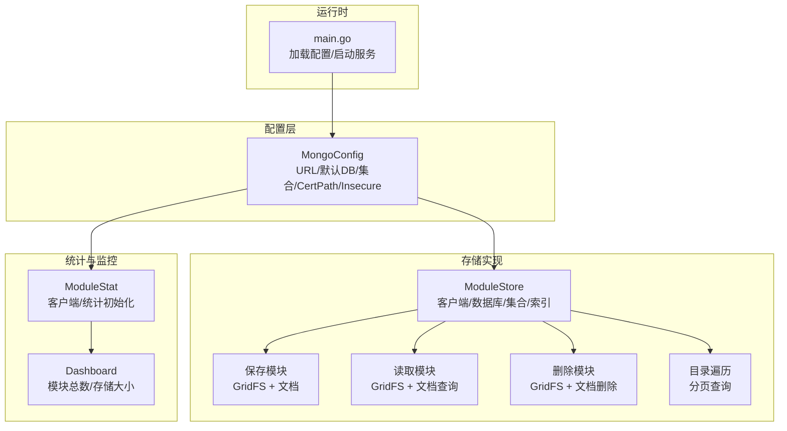
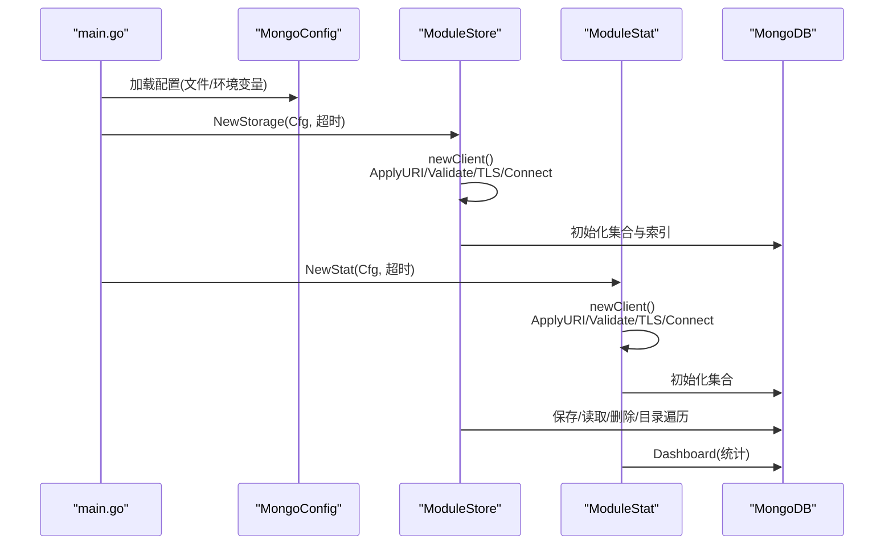
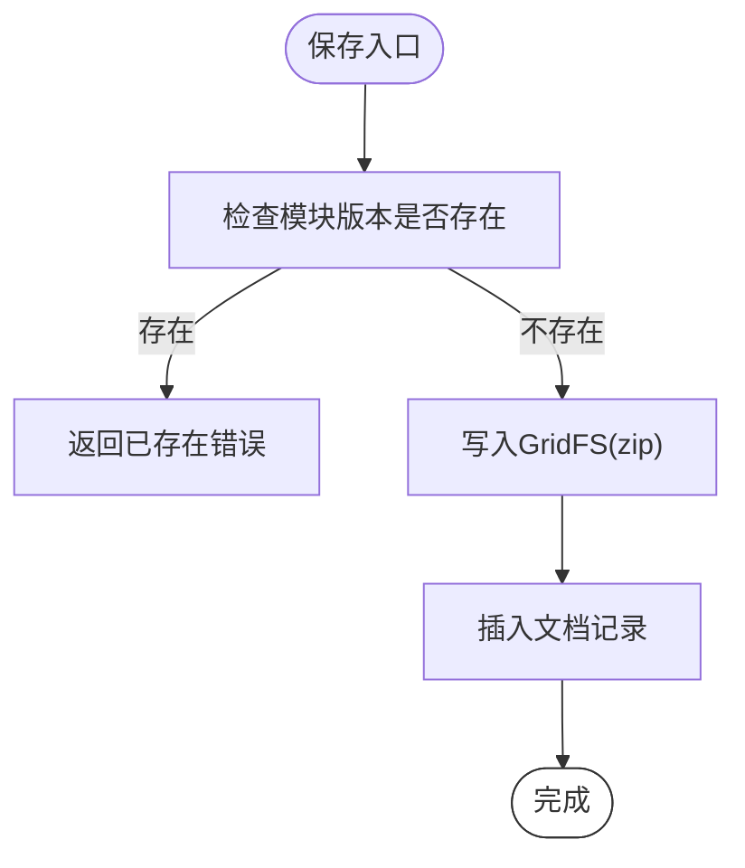
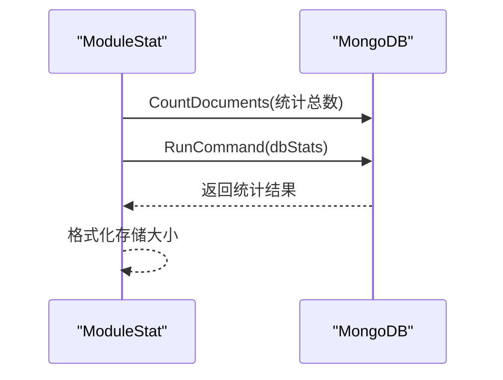
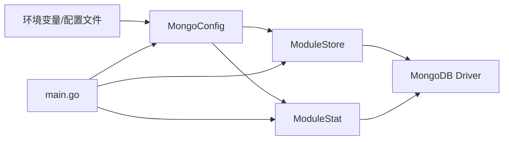

# MongoDB配置

<cite>
**本文引用的文件**
- [pkg/config/mongo.go](file://pkg/config/mongo.go)
- [pkg/storage/mongo/mongo.go](file://pkg/storage/mongo/mongo.go)
- [pkg/storage/mongo/saver.go](file://pkg/storage/mongo/saver.go)
- [pkg/storage/mongo/getter.go](file://pkg/storage/mongo/getter.go)
- [pkg/storage/mongo/deleter.go](file://pkg/storage/mongo/deleter.go)
- [pkg/storage/mongo/cataloger.go](file://pkg/storage/mongo/cataloger.go)
- [pkg/stat/mongo/mongo.go](file://pkg/stat/mongo/mongo.go)
- [pkg/stat/mongo/dashboard.go](file://pkg/stat/mongo/dashboard.go)
- [config.dev.toml](file://config.dev.toml)
- [.env](file://.env)
- [pkg/storage/mongo/mongo_test.go](file://pkg/storage/mongo/mongo_test.go)
- [pkg/stat/mongo/mongo_test.go](file://pkg/stat/mongo/mongo_test.go)
- [cmd/proxy/main.go](file://cmd/proxy/main.go)
</cite>

## 目录
1. [简介](#简介)
2. [项目结构](#项目结构)
3. [核心组件](#核心组件)
4. [架构总览](#架构总览)
5. [详细组件分析](#详细组件分析)
6. [依赖关系分析](#依赖关系分析)
7. [性能考量](#性能考量)
8. [故障排查指南](#故障排查指南)
9. [结论](#结论)
10. [附录](#附录)

## 简介
本文件面向使用 Athens 作为 Go 模块代理时，将 MongoDB 作为存储后端的配置与运维指南。内容涵盖：
- 连接参数、认证方式与配置项
- 连接字符串格式、副本集配置与认证机制
- 单机、副本集、分片集群的配置示例
- 存储性能特征、索引策略与数据压缩
- 监控、备份与故障转移最佳实践

## 项目结构
与 MongoDB 配置直接相关的代码位于以下模块：
- 配置模型：pkg/config/mongo.go
- 存储实现：pkg/storage/mongo/*
- 统计与仪表盘：pkg/stat/mongo/*
- 示例配置：config.dev.toml、.env
- 测试用例：pkg/storage/mongo/mongo_test.go、pkg/stat/mongo/mongo_test.go
- 入口程序：cmd/proxy/main.go（负责加载配置）

图表来源
- [pkg/config/mongo.go](file://pkg/config/mongo.go#L1-L11)
- [pkg/storage/mongo/mongo.go](file://pkg/storage/mongo/mongo.go#L1-L121)
- [pkg/stat/mongo/mongo.go](file://pkg/stat/mongo/mongo.go#L1-L104)
- [cmd/proxy/main.go](file://cmd/proxy/main.go#L1-L128)

章节来源
- [pkg/config/mongo.go](file://pkg/config/mongo.go#L1-L11)
- [pkg/storage/mongo/mongo.go](file://pkg/storage/mongo/mongo.go#L1-L121)
- [pkg/stat/mongo/mongo.go](file://pkg/stat/mongo/mongo.go#L1-L104)
- [cmd/proxy/main.go](file://cmd/proxy/main.go#L1-L128)

## 核心组件
- 配置模型 MongoConfig：定义连接字符串、默认数据库名、默认集合名、证书路径、是否允许不安全连接等。
- ModuleStore：封装 MongoDB 客户端、数据库名、集合名、TLS 配置、超时；初始化索引；实现保存、读取、删除、目录遍历。
- ModuleStat：封装统计客户端，提供 Dashboard 接口用于统计模块总数与数据库大小。
- 配置文件与环境变量：通过 TOML 配置文件与环境变量覆盖默认值。

章节来源
- [pkg/config/mongo.go](file://pkg/config/mongo.go#L1-L11)
- [pkg/storage/mongo/mongo.go](file://pkg/storage/mongo/mongo.go#L1-L121)
- [pkg/stat/mongo/mongo.go](file://pkg/stat/mongo/mongo.go#L1-L104)

## 架构总览
下图展示从配置加载到存储操作的关键流程与组件交互。

图表来源
- [cmd/proxy/main.go](file://cmd/proxy/main.go#L1-L128)
- [pkg/config/mongo.go](file://pkg/config/mongo.go#L1-L11)
- [pkg/storage/mongo/mongo.go](file://pkg/storage/mongo/mongo.go#L30-L116)
- [pkg/stat/mongo/mongo.go](file://pkg/stat/mongo/mongo.go#L29-L103)

## 详细组件分析

### 配置模型与连接参数
- 连接字符串 URL：必须提供，支持单机、副本集、分片集群的连接串。
- 默认数据库名 DefaultDBName：未在 URL 中指定时使用默认值。
- 默认集合名 DefaultCollectionName：未在 URL 中指定时使用默认值。
- 证书路径 CertPath：可选，用于自定义 CA 证书链。
- 不安全连接 InsecureConn：仅开发用途，生产禁用。

章节来源
- [pkg/config/mongo.go](file://pkg/config/mongo.go#L1-L11)
- [config.dev.toml](file://config.dev.toml#L455-L471)
- [.env](file://.env#L1-L2)

### 连接字符串格式与认证机制
- 支持标准 MongoDB 连接字符串，可包含用户名密码、认证源、副本集名称等。
- 通过 ApplyURI 应用连接串，Validate 校验合法性。
- TLS 配置：当提供证书路径时，优先使用系统证书池，若无则创建新池；将 PEM 证书加入池，并设置 TLSConfig；最终设置到 ClientOptions 并建立连接。
- 超时控制：设置连接超时，避免长时间阻塞。

章节来源
- [pkg/storage/mongo/mongo.go](file://pkg/storage/mongo/mongo.go#L74-L116)
- [pkg/stat/mongo/mongo.go](file://pkg/stat/mongo/mongo.go#L60-L103)

### 副本集与分片集群配置
- 副本集：连接串中包含多个种子节点与副本集名称，驱动自动发现与主从切换。
- 分片集群：连接串可指向 mongos 或直接连接分片节点，由驱动处理路由与一致性。
- 认证源：通过 authSource 指定认证数据库，确保跨库权限正确。

章节来源
- [config.dev.toml](file://config.dev.toml#L455-L471)
- [.env](file://.env#L1-L2)

### 存储实现与索引策略
- 数据模型：集合中存储模块元数据（mod/info），大体积压缩包通过 GridFS 存储。
- 索引：在 base_url、module、version 上建立稀疏唯一索引，加速去重与查询。
- 保存流程：先检查是否存在，不存在则写入 GridFS（zip），再写入文档记录。
- 读取流程：分别返回 .info、go.mod、zip；zip 通过 fs.files 查询长度以支持流式下载。
- 删除流程：先查找 GridFS 文件并删除，再删除对应文档。
- 目录遍历：按 _id 分页扫描，返回模块与版本列表。

图表来源
- [pkg/storage/mongo/saver.go](file://pkg/storage/mongo/saver.go#L15-L68)

章节来源
- [pkg/storage/mongo/mongo.go](file://pkg/storage/mongo/mongo.go#L52-L72)
- [pkg/storage/mongo/saver.go](file://pkg/storage/mongo/saver.go#L15-L68)
- [pkg/storage/mongo/getter.go](file://pkg/storage/mongo/getter.go#L15-L114)
- [pkg/storage/mongo/deleter.go](file://pkg/storage/mongo/deleter.go#L13-L64)
- [pkg/storage/mongo/cataloger.go](file://pkg/storage/mongo/cataloger.go#L17-L67)

### 统计与监控
- 统计客户端：与存储客户端相同的初始化流程，但专注于统计接口。
- Dashboard：统计模块总数与数据库总大小（通过 dbStats），并格式化为 GB 字符串。

图表来源
- [pkg/stat/mongo/mongo.go](file://pkg/stat/mongo/mongo.go#L29-L44)
- [pkg/stat/mongo/dashboard.go](file://pkg/stat/mongo/dashboard.go#L13-L50)

章节来源
- [pkg/stat/mongo/mongo.go](file://pkg/stat/mongo/mongo.go#L1-L104)
- [pkg/stat/mongo/dashboard.go](file://pkg/stat/mongo/dashboard.go#L1-L51)

### 配置示例与部署形态

#### 单机部署
- 连接串示例：指向单一主机端口。
- 认证：用户名密码与认证源需正确配置。
- TLS：如启用，提供证书路径与信任池。

章节来源
- [config.dev.toml](file://config.dev.toml#L455-L471)
- [.env](file://.env#L1-L2)

#### 副本集部署
- 连接串示例：包含多个种子节点与副本集名称。
- 认证：通过 authSource 指定认证数据库。
- 故障转移：驱动自动处理主从切换与重试。

章节来源
- [config.dev.toml](file://config.dev.toml#L455-L471)
- [.env](file://.env#L1-L2)

#### 分片集群部署
- 连接串示例：可指向 mongos 或分片节点。
- 认证：统一的认证源与用户权限。
- 性能：通过分片提升水平扩展能力。

章节来源
- [config.dev.toml](file://config.dev.toml#L455-L471)
- [.env](file://.env#L1-L2)

## 依赖关系分析
- 配置层依赖 envconfig 与验证器，确保字段合法。
- 存储层依赖 MongoDB Driver，使用 ApplyURI、TLS、GridFS、索引创建等能力。
- 统计层复用存储层的客户端初始化逻辑。
- 运行时通过 main.go 加载配置并创建存储与统计实例。

图表来源
- [pkg/config/mongo.go](file://pkg/config/mongo.go#L1-L11)
- [pkg/storage/mongo/mongo.go](file://pkg/storage/mongo/mongo.go#L30-L116)
- [pkg/stat/mongo/mongo.go](file://pkg/stat/mongo/mongo.go#L29-L103)
- [cmd/proxy/main.go](file://cmd/proxy/main.go#L1-L128)

章节来源
- [pkg/config/mongo.go](file://pkg/config/mongo.go#L1-L11)
- [pkg/storage/mongo/mongo.go](file://pkg/storage/mongo/mongo.go#L1-L121)
- [pkg/stat/mongo/mongo.go](file://pkg/stat/mongo/mongo.go#L1-L104)
- [cmd/proxy/main.go](file://cmd/proxy/main.go#L1-L128)

## 性能考量
- 索引策略：在 base_url、module、version 上建立稀疏唯一索引，减少重复写入与提高查询效率。
- GridFS：大体积压缩包采用 GridFS 存储，避免单文档过大；读取时通过 fs.files 获取长度，支持流式传输。
- 超时控制：连接与查询均设置超时，避免长时间阻塞影响吞吐。
- 副本集/分片：副本集提供高可用与自动故障转移；分片集群提供水平扩展能力。
- 压缩：模块压缩包本身为 zip 格式，MongoDB 不对 GridFS 内容进行额外压缩；可根据业务需求在应用侧或网络层做压缩优化。

章节来源
- [pkg/storage/mongo/mongo.go](file://pkg/storage/mongo/mongo.go#L52-L72)
- [pkg/storage/mongo/saver.go](file://pkg/storage/mongo/saver.go#L15-L68)
- [pkg/storage/mongo/getter.go](file://pkg/storage/mongo/getter.go#L43-L81)

## 故障排查指南
- 连接失败
  - 检查连接字符串格式与参数（主机、端口、认证源、副本集）。
  - 若启用 TLS，确认证书路径有效且可被解析。
  - 查看连接超时设置是否合理。
- 认证失败
  - 确认用户名、密码与认证源配置正确。
  - 在副本集/分片环境中，确保认证源数据库存在且用户具备相应权限。
- 索引问题
  - 确认集合初始化时索引创建成功。
  - 如需重建索引，可在维护窗口执行。
- GridFS 文件缺失
  - 保存时先写入 GridFS，再写入文档；删除时先删 GridFS，再删文档。
  - 使用 fs.files 查询文件是否存在。
- 统计异常
  - 确保统计客户端与存储客户端使用相同配置。
  - 检查 dbStats 命令返回字段类型与数值范围。

章节来源
- [pkg/storage/mongo/mongo.go](file://pkg/storage/mongo/mongo.go#L74-L116)
- [pkg/storage/mongo/saver.go](file://pkg/storage/mongo/saver.go#L15-L68)
- [pkg/storage/mongo/deleter.go](file://pkg/storage/mongo/deleter.go#L13-L64)
- [pkg/stat/mongo/mongo.go](file://pkg/stat/mongo/mongo.go#L29-L103)

## 结论
通过上述配置与实现，Athens 可以稳定地将 MongoDB 作为存储后端，支持单机、副本集与分片集群等多种部署形态。合理的连接参数、TLS 配置、索引策略与超时控制，能够满足生产环境的高可用与高性能要求。配合统计接口与监控实践，可进一步完善运维保障。

## 附录

### 配置项一览
- 连接字符串 URL：必须提供，支持单机/副本集/分片集群。
- 默认数据库名 DefaultDBName：未在 URL 中指定时使用默认值。
- 默认集合名 DefaultCollectionName：未在 URL 中指定时使用默认值。
- 证书路径 CertPath：可选，用于自定义 CA 证书链。
- 不安全连接 InsecureConn：仅开发用途，生产禁用。

章节来源
- [pkg/config/mongo.go](file://pkg/config/mongo.go#L1-L11)
- [config.dev.toml](file://config.dev.toml#L455-L471)

### 连接字符串示例
- 副本集示例：包含多个种子节点与副本集名称，以及认证源。
- 环境变量示例：通过 MONGO_URL 提供连接串。

章节来源
- [config.dev.toml](file://config.dev.toml#L455-L471)
- [.env](file://.env#L1-L2)

### 测试参考
- 配置校验测试：验证空 URL、错误 URL 方案的处理。
- 默认值覆盖测试：验证数据库名与集合名的默认值与覆盖行为。

章节来源
- [pkg/storage/mongo/mongo_test.go](file://pkg/storage/mongo/mongo_test.go#L183-L205)
- [pkg/storage/mongo/mongo_test.go](file://pkg/storage/mongo/mongo_test.go#L150-L181)
- [pkg/stat/mongo/mongo_test.go](file://pkg/stat/mongo/mongo_test.go#L11-L34)