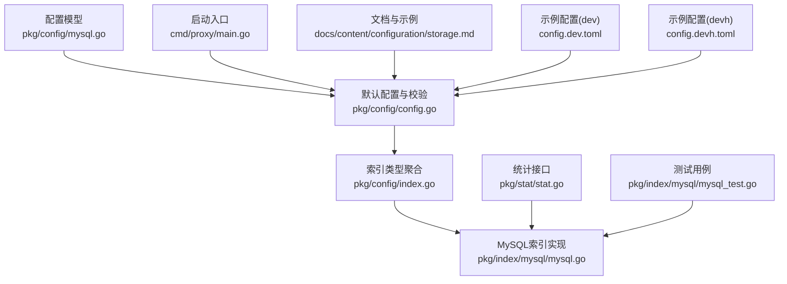
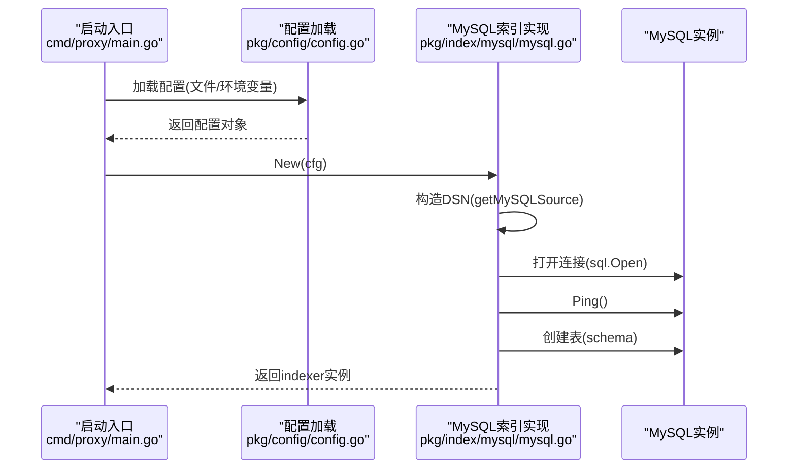
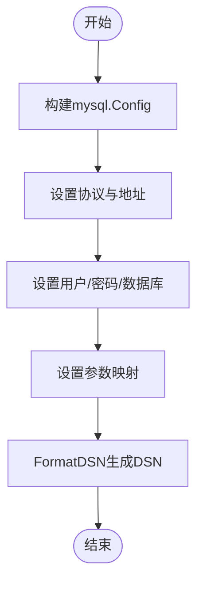
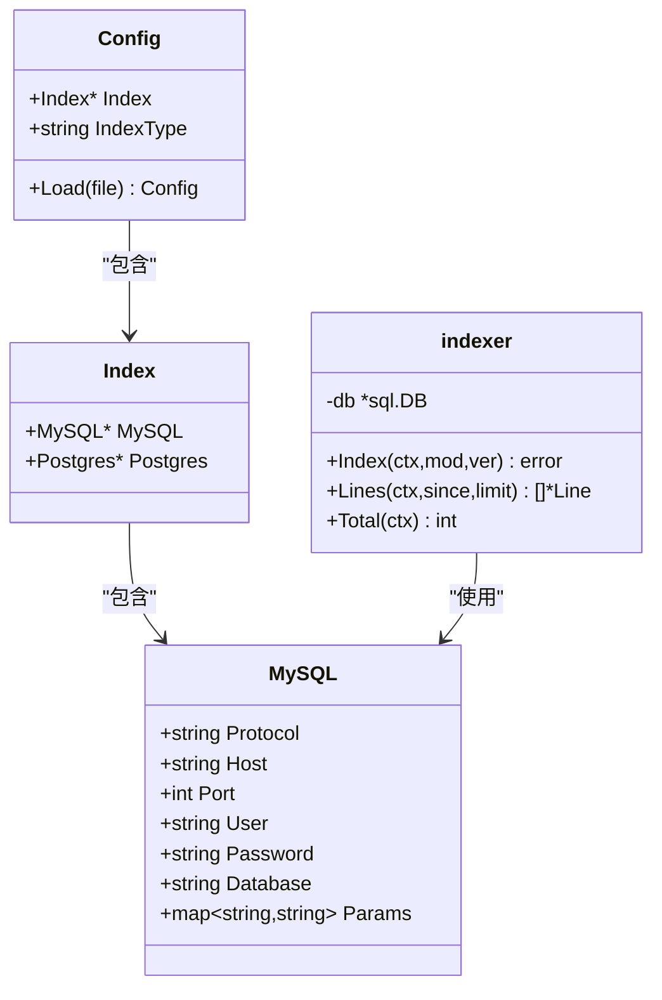

# MySQL配置

<cite>
**本文引用的文件**
- [pkg/config/mysql.go](file://pkg/config/mysql.go)
- [pkg/config/config.go](file://pkg/config/config.go)
- [pkg/config/index.go](file://pkg/config/index.go)
- [pkg/index/mysql/mysql.go](file://pkg/index/mysql/mysql.go)
- [docs/content/configuration/storage.md](file://docs/content/configuration/storage.md)
- [config.dev.toml](file://config.dev.toml)
- [config.devh.toml](file://config.devh.toml)
- [cmd/proxy/main.go](file://cmd/proxy/main.go)
- [pkg/stat/stat.go](file://pkg/stat/stat.go)
- [pkg/index/mysql/mysql_test.go](file://pkg/index/mysql/mysql_test.go)
</cite>

## 目录
1. [简介](#简介)
2. [项目结构](#项目结构)
3. [核心组件](#核心组件)
4. [架构总览](#架构总览)
5. [详细组件分析](#详细组件分析)
6. [依赖关系分析](#依赖关系分析)
7. [性能考量](#性能考量)
8. [故障排查指南](#故障排查指南)
9. [结论](#结论)
10. [附录](#附录)

## 简介
本文件面向需要在 Athens 中使用 MySQL 作为索引存储的用户，系统性说明：
- 连接参数与认证配置（含环境变量覆盖）
- 连接字符串格式与参数传递机制
- 字符集与事务隔离级别的现状与建议
- 单机与主从复制部署的配置要点
- 索引策略与存储引擎选择
- 监控、备份恢复与性能调优最佳实践

## 项目结构
与 MySQL 配置相关的核心位置如下：
- 配置模型定义：pkg/config/mysql.go
- 默认配置与环境变量解析：pkg/config/config.go
- 索引类型聚合：pkg/config/index.go
- MySQL 索引实现：pkg/index/mysql/mysql.go
- 文档与示例配置：docs/content/configuration/storage.md、config.dev.toml、config.devh.toml
- 启动入口与配置加载：cmd/proxy/main.go
- 统计接口：pkg/stat/stat.go
- 测试用例：pkg/index/mysql/mysql_test.go

图表来源
- [pkg/config/mysql.go](file://pkg/config/mysql.go#L1-L13)
- [pkg/config/config.go](file://pkg/config/config.go#L187-L213)
- [pkg/config/index.go](file://pkg/config/index.go#L1-L7)
- [pkg/index/mysql/mysql.go](file://pkg/index/mysql/mysql.go#L1-L137)
- [cmd/proxy/main.go](file://cmd/proxy/main.go#L29-L60)
- [docs/content/configuration/storage.md](file://docs/content/configuration/storage.md#L1-L530)
- [config.dev.toml](file://config.dev.toml#L567-L600)
- [config.devh.toml](file://config.devh.toml#L511-L544)
- [pkg/stat/stat.go](file://pkg/stat/stat.go#L1-L10)
- [pkg/index/mysql/mysql_test.go](file://pkg/index/mysql/mysql_test.go#L1-L35)

章节来源
- [pkg/config/mysql.go](file://pkg/config/mysql.go#L1-L13)
- [pkg/config/config.go](file://pkg/config/config.go#L187-L213)
- [pkg/config/index.go](file://pkg/config/index.go#L1-L7)
- [pkg/index/mysql/mysql.go](file://pkg/index/mysql/mysql.go#L1-L137)
- [cmd/proxy/main.go](file://cmd/proxy/main.go#L29-L60)
- [docs/content/configuration/storage.md](file://docs/content/configuration/storage.md#L1-L530)
- [config.dev.toml](file://config.dev.toml#L567-L600)
- [config.devh.toml](file://config.devh.toml#L511-L544)
- [pkg/stat/stat.go](file://pkg/stat/stat.go#L1-L10)
- [pkg/index/mysql/mysql_test.go](file://pkg/index/mysql/mysql_test.go#L1-L35)

## 核心组件
- MySQL 配置模型：定义了协议、主机、端口、用户、密码、数据库与参数映射等字段，并支持通过环境变量覆盖。
- 默认配置与校验：在开发模式下提供默认值；生产模式下进行严格校验；支持环境变量覆盖端口等。
- MySQL 索引实现：负责建立连接、创建表、执行插入与查询操作，并对唯一约束冲突进行错误分类。

章节来源
- [pkg/config/mysql.go](file://pkg/config/mysql.go#L4-L12)
- [pkg/config/config.go](file://pkg/config/config.go#L187-L213)
- [pkg/index/mysql/mysql.go](file://pkg/index/mysql/mysql.go#L19-L33)

## 架构总览
MySQL 在 Athens 中的角色是“索引存储”，用于记录模块导入路径与版本信息的时间线。整体流程如下：
- 启动时加载配置（文件或环境变量）
- 初始化 MySQL 索引器：构造连接字符串、打开连接、Ping 校验、创建表
- 提供 Index/Lines/Total 接口供上层使用

图表来源
- [cmd/proxy/main.go](file://cmd/proxy/main.go#L35-L60)
- [pkg/config/config.go](file://pkg/config/config.go#L187-L213)
- [pkg/index/mysql/mysql.go](file://pkg/index/mysql/mysql.go#L19-L33)

## 详细组件分析

### MySQL 配置模型与环境变量
- 字段与验证规则：协议、主机、端口、用户、密码、数据库、参数映射均支持环境变量覆盖，部分字段为必填。
- 环境变量前缀：ATHENS_INDEX_MYSQL_*
- 参数映射：以键值对形式传入，最终拼接到 DSN 中。

章节来源
- [pkg/config/mysql.go](file://pkg/config/mysql.go#L4-L12)

### 默认配置与开发示例
- 开发模式默认值：包含协议、主机、端口、用户、数据库及参数映射（如 parseTime、timeout）。
- 示例配置文件：dev 与 devh 版本均提供 TOML 示例，展示如何设置各字段与参数。

章节来源
- [pkg/config/config.go](file://pkg/config/config.go#L187-L213)
- [config.dev.toml](file://config.dev.toml#L567-L600)
- [config.devh.toml](file://config.devh.toml#L511-L544)

### 连接字符串格式与参数传递
- DSN 构造：通过 go-sql-driver/mysql 的 Config 对象组装 Net/Addr/User/Passwd/DBName/Params，再 FormatDSN 输出。
- 参数传递：所有 Params 键值对直接拼接到 DSN，因此可按驱动规范传入超时、字符集、TLS 等参数。

图表来源
- [pkg/index/mysql/mysql.go](file://pkg/index/mysql/mysql.go#L114-L123)

章节来源
- [pkg/index/mysql/mysql.go](file://pkg/index/mysql/mysql.go#L114-L123)

### 认证与安全
- 用户名/密码：通过配置模型与环境变量注入。
- TLS：可通过 Params 传递相关参数（例如驱动支持的 TLS 选项），具体取决于所用驱动版本与 MySQL 服务器配置。
- 生产建议：使用只读账号用于查询，写入账号最小权限；结合网络隔离与防火墙限制访问。

章节来源
- [pkg/config/mysql.go](file://pkg/config/mysql.go#L8-L10)
- [pkg/index/mysql/mysql.go](file://pkg/index/mysql/mysql.go#L114-L123)

### 字符集与事务隔离级别
- 字符集：当前建表语句显式指定 CHARACTER SET utf8，适用于 ASCII 兼容场景；若需更广泛的 Unicode 支持，建议在 MySQL 服务器层面调整默认字符集或在 Params 中传入 charset 参数。
- 事务隔离级别：代码未显式设置隔离级别，默认遵循 MySQL 服务器默认隔离级别。生产环境中建议明确设置（如 READ-COMMITTED 或 REPEATABLE-READ），并在应用侧配合连接池参数控制一致性与并发。

章节来源
- [pkg/index/mysql/mysql.go](file://pkg/index/mysql/mysql.go#L35-L56)

### 索引策略与存储引擎
- 表结构：包含自增主键、导入路径、版本号、时间戳字段；对 timestamp 建有普通索引，对 (path, version) 建有唯一索引。
- 存储引擎：未在代码中显式指定，默认使用服务器默认引擎（如 InnoDB）。建议在生产中显式指定 ENGINE=InnoDB 并根据业务量规划分区或归档策略。

章节来源
- [pkg/index/mysql/mysql.go](file://pkg/index/mysql/mysql.go#L35-L56)

### 连接生命周期与错误处理
- 连接建立：Open -> Ping -> 创建表 -> 返回 indexer。
- 错误分类：针对 MySQL 唯一约束冲突（重复索引）进行专门分类，便于上层处理幂等写入。

章节来源
- [pkg/index/mysql/mysql.go](file://pkg/index/mysql/mysql.go#L19-L33)
- [pkg/index/mysql/mysql.go](file://pkg/index/mysql/mysql.go#L125-L136)

### 部署配置示例

#### 单机部署
- 使用 config.dev.toml 或 config.devh.toml 中的 [Index.MySQL] 段落进行配置。
- 关键点：确保 Host/Port/User/Password/Database 正确；必要时在 Params 中设置 parseTime、timeout 等。

章节来源
- [config.dev.toml](file://config.dev.toml#L567-L600)
- [config.devh.toml](file://config.devh.toml#L511-L544)

#### 主从复制部署
- 应用侧无需改动：只需在 MySQL 层面配置主从复制，应用通过相同 DSN 连接即可。
- 建议：在 Params 中设置 readTimeout/writeTimeout，确保读写分离或只读副本场景下的稳定性；在只读副本上避免写入操作。

章节来源
- [pkg/index/mysql/mysql.go](file://pkg/index/mysql/mysql.go#L114-L123)

### 监控、备份与性能调优

#### 监控
- 指标导出：可通过 Athens 的统计接口与外部监控系统集成（参考统计接口定义）。
- 建议：关注慢查询、连接数、锁等待、QPS 等指标；结合 MySQL 自身的 slow log、performance_schema。

章节来源
- [pkg/stat/stat.go](file://pkg/stat/stat.go#L1-L10)

#### 备份与恢复
- 建议：使用 MySQL 官方工具（如 mysqldump、Percona XtraBackup）进行定期全备与增量备份。
- 恢复策略：制定 RPO/RTO 目标，验证备份数据可用性与恢复演练。

#### 性能调优
- 连接池：合理设置最大连接数、空闲连接数与连接超时；在 Params 中设置合适的超时参数。
- SQL 优化：利用现有索引（timestamp、(path,version)）；避免全表扫描；对高频查询添加 EXPLAIN 分析。
- 存储引擎：使用 InnoDB 并启用合适的缓冲池大小、日志文件大小；根据业务选择合适的行格式与压缩策略。
- 字符集：如需更广的字符集支持，可在服务器层面统一字符集并确保 DSN 参数一致。

## 依赖关系分析

图表来源
- [pkg/config/mysql.go](file://pkg/config/mysql.go#L4-L12)
- [pkg/config/index.go](file://pkg/config/index.go#L1-L7)
- [pkg/config/config.go](file://pkg/config/config.go#L22-L66)
- [pkg/index/mysql/mysql.go](file://pkg/index/mysql/mysql.go#L58-L60)

章节来源
- [pkg/config/mysql.go](file://pkg/config/mysql.go#L4-L12)
- [pkg/config/index.go](file://pkg/config/index.go#L1-L7)
- [pkg/config/config.go](file://pkg/config/config.go#L22-L66)
- [pkg/index/mysql/mysql.go](file://pkg/index/mysql/mysql.go#L58-L60)

## 性能考量
- 连接参数：通过 Params 传递超时、字符集等，确保与 MySQL 服务器配置一致。
- 索引设计：现有索引覆盖时间范围查询与去重，建议结合实际查询模式评估是否需要额外索引。
- 存储引擎：InnoDB 适合大多数 OLTP 场景；根据数据量与访问模式选择合适的缓冲池与日志配置。
- 并发与一致性：明确事务隔离级别，避免长事务导致锁竞争；合理设置连接池大小与超时。

## 故障排查指南
- 连接失败：检查 Host/Port/User/Password/Database 与 Params；确认网络连通与防火墙策略。
- 唯一约束冲突：Index 写入时可能因重复 (path, version) 导致冲突，应进行幂等处理。
- 字符集问题：若出现乱码，检查服务器字符集与 DSN charset 参数；确保应用与数据库一致。
- 性能问题：使用 EXPLAIN 分析慢查询；结合监控指标定位瓶颈；调整连接池与 MySQL 参数。

章节来源
- [pkg/index/mysql/mysql.go](file://pkg/index/mysql/mysql.go#L125-L136)
- [pkg/index/mysql/mysql_test.go](file://pkg/index/mysql/mysql_test.go#L11-L21)

## 结论
- Athens 的 MySQL 索引实现简洁可靠，通过 DSN 参数灵活传递连接选项。
- 生产部署建议明确字符集、事务隔离级别与存储引擎策略，并配套完善的监控、备份与性能调优方案。
- 主从复制与只读副本等高可用方案可在不改变应用代码的前提下实现。

## 附录

### 环境变量与配置项对照
- 环境变量前缀：ATHENS_INDEX_MYSQL_*
- 关键项：Protocol、Host、Port、User、Password、Database、Params
- 示例：TOML 文件中的 [Index.MySQL] 段落与 Params 映射

章节来源
- [pkg/config/mysql.go](file://pkg/config/mysql.go#L4-L12)
- [config.dev.toml](file://config.dev.toml#L567-L600)
- [config.devh.toml](file://config.devh.toml#L511-L544)