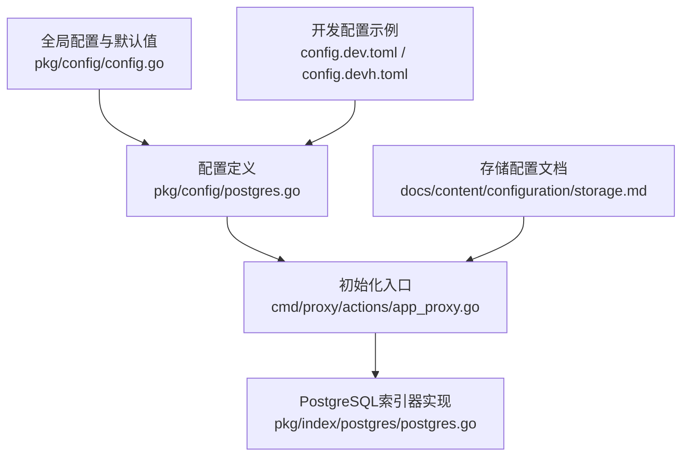
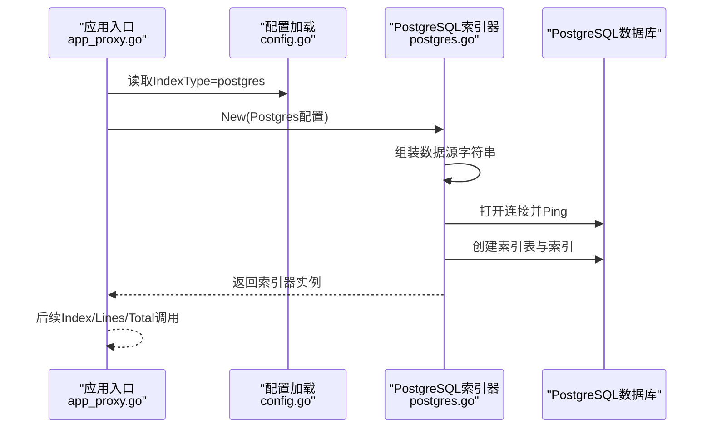
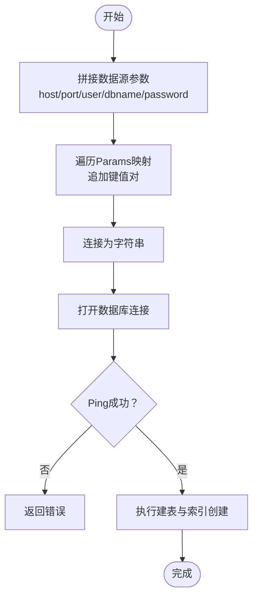
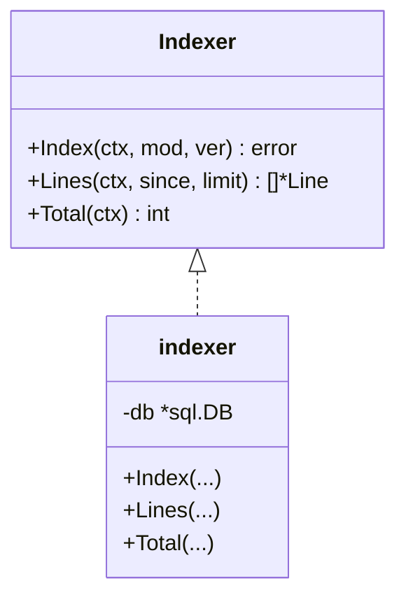
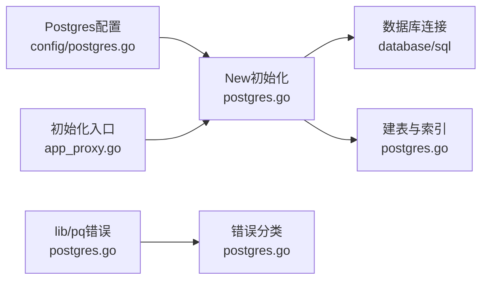

# PostgreSQL配置

<cite>
**本文引用的文件**
- [pkg/index/postgres/postgres.go](file://pkg/index/postgres/postgres.go)
- [pkg/config/postgres.go](file://pkg/config/postgres.go)
- [pkg/config/config.go](file://pkg/config/config.go)
- [cmd/proxy/actions/app_proxy.go](file://cmd/proxy/actions/app_proxy.go)
- [config.dev.toml](file://config.dev.toml)
- [config.devh.toml](file://config.devh.toml)
- [docs/content/configuration/storage.md](file://docs/content/configuration/storage.md)
- [pkg/index/postgres/postgres_test.go](file://pkg/index/postgres/postgres_test.go)
</cite>

## 目录
1. [简介](#简介)
2. [项目结构](#项目结构)
3. [核心组件](#核心组件)
4. [架构总览](#架构总览)
5. [详细组件分析](#详细组件分析)
6. [依赖关系分析](#依赖关系分析)
7. [性能考虑](#性能考虑)
8. [故障排查指南](#故障排查指南)
9. [结论](#结论)
10. [附录](#附录)

## 简介
本文件面向使用 Athens 作为 Go 模块代理时，配置与使用 PostgreSQL 作为索引后端的场景。内容涵盖：
- PostgreSQL 连接参数与认证方式
- 连接字符串格式与扩展配置项
- 高级配置选项与性能调优建议
- 单机与高可用集群部署示例
- 特性、扩展机制与数据类型支持
- 监控、备份与性能优化最佳实践

## 项目结构
与 PostgreSQL 存储相关的核心代码与配置分布在以下模块：
- 配置定义：Postgres 结构体与默认值
- 初始化入口：根据配置创建索引器
- 实现：PostgreSQL 索引器的连接、建表、写入与查询
- 配置示例：开发配置文件中的 PostgreSQL 参数段落
- 文档：存储配置文档中对索引类型的说明

图表来源
- [pkg/config/postgres.go](file://pkg/config/postgres.go#L1-L11)
- [cmd/proxy/actions/app_proxy.go](file://cmd/proxy/actions/app_proxy.go#L225-L235)
- [pkg/index/postgres/postgres.go](file://pkg/index/postgres/postgres.go#L1-L131)
- [pkg/config/config.go](file://pkg/config/config.go#L200-L213)
- [config.dev.toml](file://config.dev.toml#L600-L627)
- [config.devh.toml](file://config.devh.toml#L544-L549)
- [docs/content/configuration/storage.md](file://docs/content/configuration/storage.md#L317-L321)

章节来源
- [pkg/config/postgres.go](file://pkg/config/postgres.go#L1-L11)
- [pkg/config/config.go](file://pkg/config/config.go#L200-L213)
- [cmd/proxy/actions/app_proxy.go](file://cmd/proxy/actions/app_proxy.go#L225-L235)
- [pkg/index/postgres/postgres.go](file://pkg/index/postgres/postgres.go#L1-L131)
- [config.dev.toml](file://config.dev.toml#L600-L627)
- [config.devh.toml](file://config.devh.toml#L544-L549)
- [docs/content/configuration/storage.md](file://docs/content/configuration/storage.md#L317-L321)

## 核心组件
- Postgres 配置结构体：定义主机、端口、用户、密码、数据库与参数映射。
- 默认配置：提供默认主机、端口、数据库与常用参数（如连接超时、SSL 模式）。
- 初始化流程：根据配置构造数据源字符串，打开数据库连接并创建索引表。
- 索引器接口：提供 Index、Lines、Total 等方法，封装插入、查询与计数逻辑。

章节来源
- [pkg/config/postgres.go](file://pkg/config/postgres.go#L1-L11)
- [pkg/config/config.go](file://pkg/config/config.go#L200-L213)
- [pkg/index/postgres/postgres.go](file://pkg/index/postgres/postgres.go#L16-L35)
- [pkg/index/postgres/postgres.go](file://pkg/index/postgres/postgres.go#L58-L104)

## 架构总览
PostgreSQL 作为 Athens 的索引后端，负责记录模块路径、版本与时间戳，并支持增量拉取与总数统计。初始化时自动创建索引表及必要索引；运行时通过 SQL 执行插入与查询。

图表来源
- [cmd/proxy/actions/app_proxy.go](file://cmd/proxy/actions/app_proxy.go#L225-L235)
- [pkg/config/config.go](file://pkg/config/config.go#L200-L213)
- [pkg/index/postgres/postgres.go](file://pkg/index/postgres/postgres.go#L16-L35)

## 详细组件分析

### Postgres 配置结构与默认值
- 字段含义
  - Host：数据库主机地址
  - Port：数据库端口
  - User：数据库用户名
  - Password：数据库密码
  - Database：数据库名
  - Params：附加连接参数映射
- 默认值与校验
  - 默认主机、端口、数据库与常用参数（如连接超时、SSL 模式）
  - 使用注解进行环境变量映射与必填校验

章节来源
- [pkg/config/postgres.go](file://pkg/config/postgres.go#L1-L11)
- [pkg/config/config.go](file://pkg/config/config.go#L200-L213)

### 数据源字符串构建与连接
- 数据源拼接规则
  - 固定参数：host、port、user、dbname、password
  - 动态参数：遍历 Params 映射，逐项拼接
- 连接与初始化
  - 打开连接并执行 Ping 校验
  - 依次执行建表语句，创建索引表与索引
- 错误分类
  - 基于 PostgreSQL 错误码进行分类（如唯一键冲突）

图表来源
- [pkg/index/postgres/postgres.go](file://pkg/index/postgres/postgres.go#L106-L117)
- [pkg/index/postgres/postgres.go](file://pkg/index/postgres/postgres.go#L20-L35)

章节来源
- [pkg/index/postgres/postgres.go](file://pkg/index/postgres/postgres.go#L106-L117)
- [pkg/index/postgres/postgres.go](file://pkg/index/postgres/postgres.go#L20-L35)
- [pkg/index/postgres/postgres.go](file://pkg/index/postgres/postgres.go#L119-L130)

### 索引器接口与实现
- 接口方法
  - Index(ctx, mod, ver)：插入一条索引记录
  - Lines(ctx, since, limit)：查询自某时刻起的增量记录
  - Total(ctx)：统计总记录数
- 实现要点
  - 插入使用当前时间的 RFC3339Nano 字符串
  - 查询使用时间比较与 LIMIT 控制
  - 计数使用 COUNT(*)

图表来源
- [pkg/index/postgres/postgres.go](file://pkg/index/postgres/postgres.go#L54-L104)

章节来源
- [pkg/index/postgres/postgres.go](file://pkg/index/postgres/postgres.go#L54-L104)

### 配置示例与环境变量覆盖
- 开发配置示例
  - Index.Postgres 段落包含 Host、Port、User、Password、Database 与 Params
  - Params 中包含 connect_timeout 与 sslmode
- 环境变量覆盖
  - 通过注解映射到环境变量名，可在运行时覆盖配置
- 初始化入口
  - IndexType=postgres 时，调用 postgres.New 传入配置

章节来源
- [config.dev.toml](file://config.dev.toml#L600-L627)
- [config.devh.toml](file://config.devh.toml#L544-L549)
- [cmd/proxy/actions/app_proxy.go](file://cmd/proxy/actions/app_proxy.go#L225-L235)
- [pkg/config/postgres.go](file://pkg/config/postgres.go#L1-L11)

### 测试与合规性
- 测试条件
  - 通过环境变量 TEST_INDEX_POSTGRES 控制是否运行 PostgreSQL 索引器测试
- 测试流程
  - 加载配置，创建索引器，运行合规性测试集
  - 提供清理方法删除索引表数据

章节来源
- [pkg/index/postgres/postgres_test.go](file://pkg/index/postgres/postgres_test.go#L11-L21)
- [pkg/index/postgres/postgres_test.go](file://pkg/index/postgres/postgres_test.go#L23-L26)
- [pkg/index/postgres/postgres_test.go](file://pkg/index/postgres/postgres_test.go#L28-L35)

## 依赖关系分析
- 配置到实现的依赖
  - 配置结构体被索引器实现使用
  - 初始化入口根据配置类型选择具体实现
- 外部依赖
  - lib/pq 错误类型用于错误分类
  - database/sql 用于数据库操作

图表来源
- [pkg/config/postgres.go](file://pkg/config/postgres.go#L1-L11)
- [pkg/index/postgres/postgres.go](file://pkg/index/postgres/postgres.go#L16-L35)
- [pkg/index/postgres/postgres.go](file://pkg/index/postgres/postgres.go#L37-L52)
- [pkg/index/postgres/postgres.go](file://pkg/index/postgres/postgres.go#L119-L130)
- [cmd/proxy/actions/app_proxy.go](file://cmd/proxy/actions/app_proxy.go#L225-L235)

章节来源
- [pkg/config/postgres.go](file://pkg/config/postgres.go#L1-L11)
- [pkg/index/postgres/postgres.go](file://pkg/index/postgres/postgres.go#L16-L35)
- [pkg/index/postgres/postgres.go](file://pkg/index/postgres/postgres.go#L37-L52)
- [pkg/index/postgres/postgres.go](file://pkg/index/postgres/postgres.go#L119-L130)
- [cmd/proxy/actions/app_proxy.go](file://cmd/proxy/actions/app_proxy.go#L225-L235)

## 性能考虑
- 连接参数
  - connect_timeout：控制连接建立超时，避免长时间阻塞
  - sslmode：生产环境建议开启 SSL，保障传输安全
- 表与索引
  - 自动创建索引表与时间戳索引，提升查询效率
  - 唯一索引保证模块路径+版本组合的唯一性
- 查询与限制
  - Lines 查询支持时间过滤与 LIMIT 控制，避免一次性返回过多数据
- 并发与锁
  - 若与其他后端配合使用，可结合 Athens 的 SingleFlight 机制避免重复写入

章节来源
- [pkg/config/config.go](file://pkg/config/config.go#L206-L210)
- [pkg/index/postgres/postgres.go](file://pkg/index/postgres/postgres.go#L37-L52)
- [pkg/index/postgres/postgres.go](file://pkg/index/postgres/postgres.go#L73-L94)

## 故障排查指南
- 连接失败
  - 检查主机、端口、用户、密码与数据库名是否正确
  - 确认 Params 中的连接参数（如 sslmode、connect_timeout）符合目标环境
- 建表失败
  - 确认数据库具备创建表权限
  - 检查数据库服务状态与网络连通性
- 唯一键冲突
  - 插入重复的模块路径+版本组合会导致冲突，应避免重复写入或使用幂等逻辑
- 测试运行
  - 设置 TEST_INDEX_POSTGRES=true 以运行 PostgreSQL 索引器测试
  - 使用测试配置加载函数获取 Postgres 配置并创建索引器

章节来源
- [pkg/index/postgres/postgres.go](file://pkg/index/postgres/postgres.go#L119-L130)
- [pkg/index/postgres/postgres_test.go](file://pkg/index/postgres/postgres_test.go#L11-L21)
- [pkg/index/postgres/postgres_test.go](file://pkg/index/postgres/postgres_test.go#L28-L35)

## 结论
PostgreSQL 作为 Athens 的索引后端，提供了简洁可靠的配置方式与完善的初始化流程。通过合理的连接参数与索引设计，可在单机与高可用场景下满足模块索引的写入与查询需求。建议在生产环境启用 SSL、合理设置超时与连接池参数，并结合监控与备份策略保障稳定性。

## 附录

### 连接参数与认证方式
- 主机与端口：通过 Host 与 Port 指定
- 用户与密码：通过 User 与 Password 指定
- 数据库：通过 Database 指定
- 扩展参数：通过 Params 映射添加任意驱动支持的键值对

章节来源
- [pkg/config/postgres.go](file://pkg/config/postgres.go#L1-L11)
- [pkg/index/postgres/postgres.go](file://pkg/index/postgres/postgres.go#L106-L117)

### 连接字符串格式与扩展配置
- 格式：固定参数 + 动态参数映射
- 示例：host、port、user、dbname、password 与 Params 中的键值对
- 扩展：可添加如 sslmode、connect_timeout 等参数

章节来源
- [pkg/index/postgres/postgres.go](file://pkg/index/postgres/postgres.go#L106-L117)
- [pkg/config/config.go](file://pkg/config/config.go#L206-L210)

### 高级配置选项与性能调优
- 连接超时：connect_timeout
- SSL 模式：sslmode
- 建议：生产环境开启 SSL，合理设置超时与连接池大小

章节来源
- [pkg/config/config.go](file://pkg/config/config.go#L206-L210)

### 部署示例：单机与高可用集群
- 单机
  - 使用本地主机与默认端口，设置 User、Password、Database 与 Params
- 高可用集群
  - 通过 Params 指定连接参数（如 sslmode），并在网络层面确保可达性
  - 生产环境建议启用 SSL 与合适的超时设置

章节来源
- [config.dev.toml](file://config.dev.toml#L600-L627)
- [config.devh.toml](file://config.devh.toml#L544-L549)
- [pkg/config/config.go](file://pkg/config/config.go#L206-L210)

### 特性、扩展机制与数据类型支持
- 特性
  - 自动建表与索引创建
  - 插入、增量查询、总数统计
- 扩展机制
  - 通过 Params 映射扩展连接参数
- 数据类型支持
  - 时间戳使用 RFC3339Nano 字符串，便于排序与比较

章节来源
- [pkg/index/postgres/postgres.go](file://pkg/index/postgres/postgres.go#L37-L52)
- [pkg/index/postgres/postgres.go](file://pkg/index/postgres/postgres.go#L58-L104)

### 监控、备份策略与最佳实践
- 监控
  - 观察数据库连接状态与查询延迟
  - 关注唯一键冲突与写入失败
- 备份
  - 定期备份索引表，确保可恢复
- 最佳实践
  - 生产环境启用 SSL
  - 合理设置超时与连接池
  - 使用唯一索引避免重复写入

章节来源
- [pkg/index/postgres/postgres.go](file://pkg/index/postgres/postgres.go#L119-L130)
- [docs/content/configuration/storage.md](file://docs/content/configuration/storage.md#L317-L321)