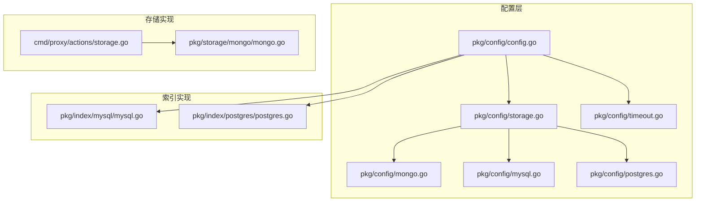
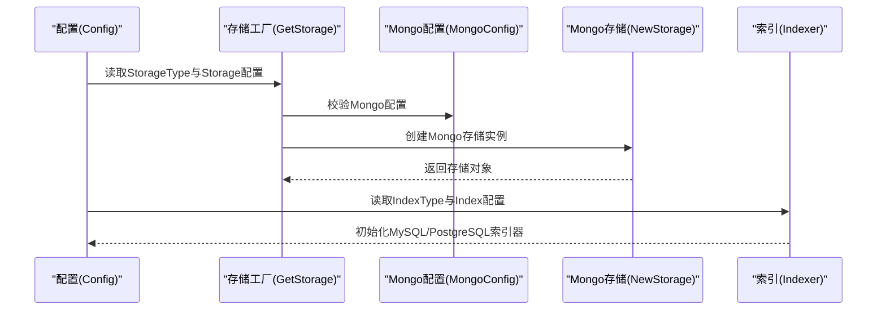
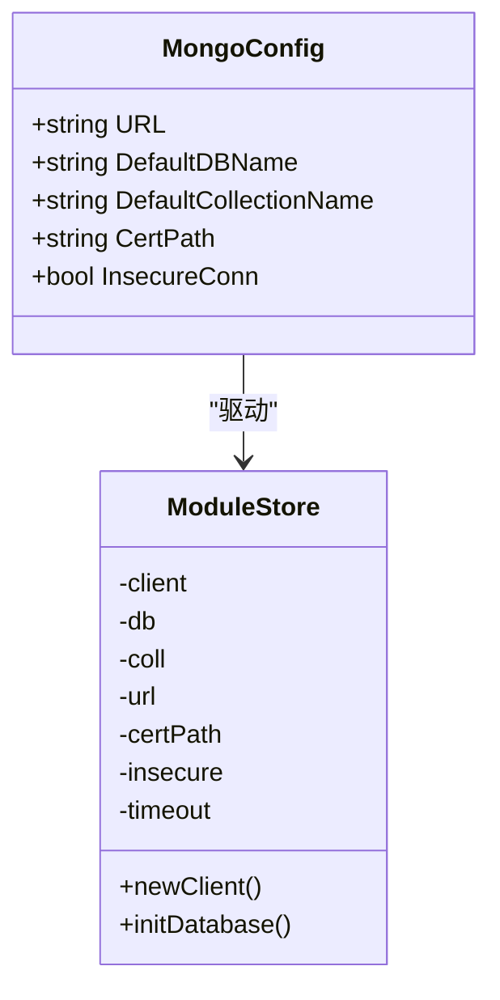
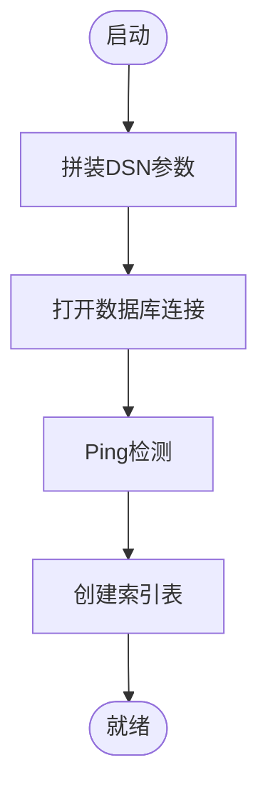
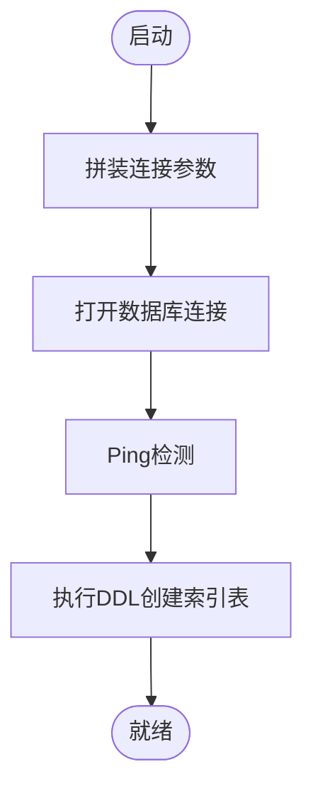
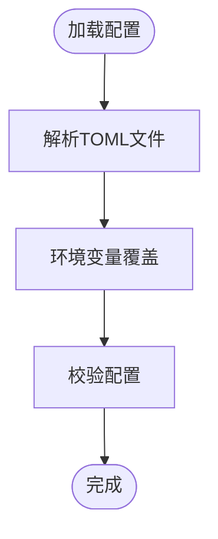
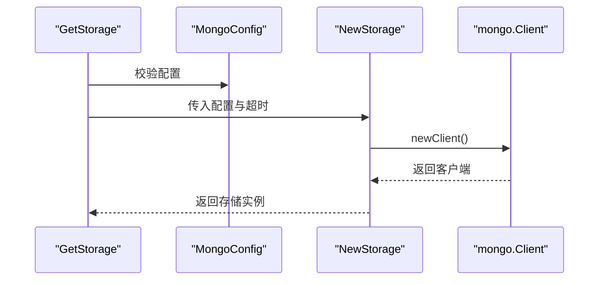
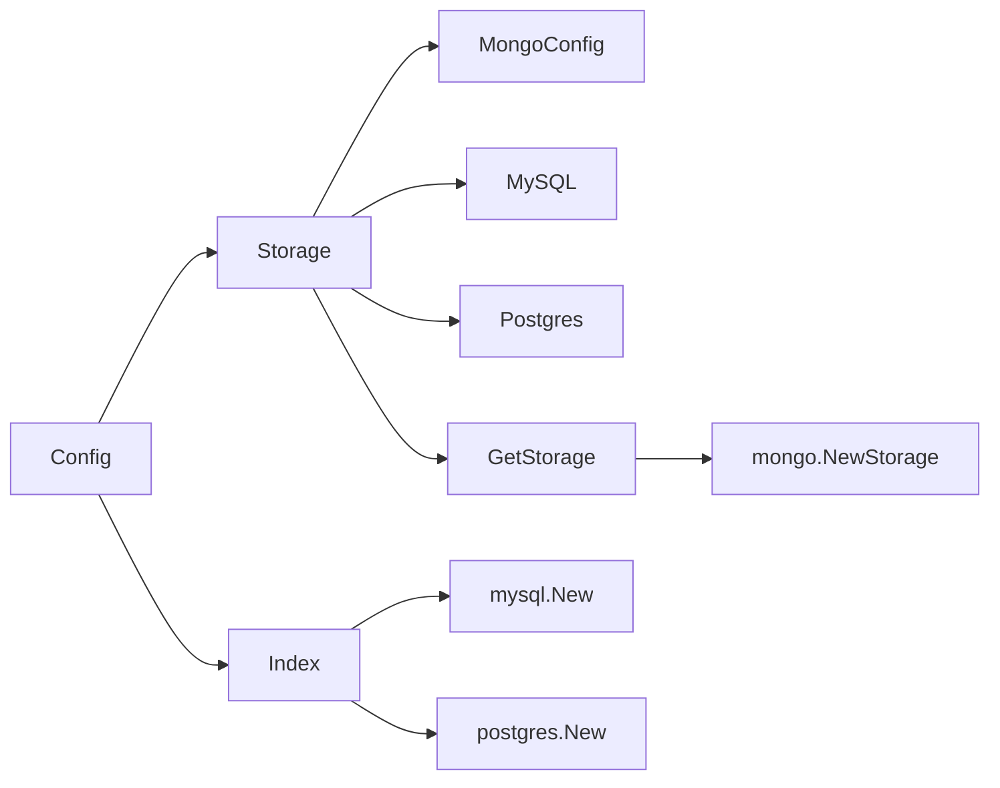

# 数据库存储配置

<cite>
**本文引用的文件**
- [pkg/config/storage.go](file://pkg/config/storage.go)
- [pkg/config/mongo.go](file://pkg/config/mongo.go)
- [pkg/config/mysql.go](file://pkg/config/mysql.go)
- [pkg/config/postgres.go](file://pkg/config/postgres.go)
- [pkg/config/config.go](file://pkg/config/config.go)
- [pkg/config/timeout.go](file://pkg/config/timeout.go)
- [pkg/storage/mongo/mongo.go](file://pkg/storage/mongo/mongo.go)
- [pkg/index/mysql/mysql.go](file://pkg/index/mysql/mysql.go)
- [pkg/index/postgres/postgres.go](file://pkg/index/postgres/postgres.go)
- [cmd/proxy/actions/storage.go](file://cmd/proxy/actions/storage.go)
- [docs/content/configuration/storage.md](file://docs/content/configuration/storage.md)
- [config.dev.toml](file://config.dev.toml)
- [config.devh.toml](file://config.devh.toml)
- [.env](file://.env)
- [pkg/stat/mongo/dashboard.go](file://pkg/stat/mongo/dashboard.go)
</cite>

## 目录
1. [简介](#简介)
2. [项目结构](#项目结构)
3. [核心组件](#核心组件)
4. [架构总览](#架构总览)
5. [详细组件分析](#详细组件分析)
6. [依赖关系分析](#依赖关系分析)
7. [性能考量](#性能考量)
8. [故障排查指南](#故障排查指南)
9. [结论](#结论)
10. [附录](#附录)

## 简介
本文件面向数据库存储配置，聚焦于MongoDB、MySQL与PostgreSQL三类后端的配置选项、连接参数、认证方式、连接池与性能优化建议，并结合项目中的配置结构与实现细节，给出单机与集群部署的参考方法。同时总结监控、备份恢复与高可用部署的最佳实践，帮助读者在生产环境中稳定运行。

## 项目结构
围绕数据库存储配置的关键目录与文件如下：
- 配置定义：pkg/config 下的 storage.go、mongo.go、mysql.go、postgres.go、config.go、timeout.go
- 存储实现：pkg/storage/mongo/mongo.go（MongoDB）、cmd/proxy/actions/storage.go（存储工厂）
- 索引实现：pkg/index/mysql/mysql.go、pkg/index/postgres/postgres.go
- 文档与示例：docs/content/configuration/storage.md、config.dev.toml、config.devh.toml、.env

图表来源
- [pkg/config/config.go](file://pkg/config/config.go#L22-L66)
- [pkg/config/storage.go](file://pkg/config/storage.go#L4-L12)
- [pkg/config/mongo.go](file://pkg/config/mongo.go#L4-L10)
- [pkg/config/mysql.go](file://pkg/config/mysql.go#L4-L12)
- [pkg/config/postgres.go](file://pkg/config/postgres.go#L4-L11)
- [pkg/config/timeout.go](file://pkg/config/timeout.go#L6-L17)
- [pkg/storage/mongo/mongo.go](file://pkg/storage/mongo/mongo.go#L32-L50)
- [cmd/proxy/actions/storage.go](file://cmd/proxy/actions/storage.go#L25-L76)
- [pkg/index/mysql/mysql.go](file://pkg/index/mysql/mysql.go#L19-L33)
- [pkg/index/postgres/postgres.go](file://pkg/index/postgres/postgres.go#L19-L35)

章节来源
- [pkg/config/config.go](file://pkg/config/config.go#L22-L66)
- [pkg/config/storage.go](file://pkg/config/storage.go#L4-L12)
- [pkg/config/mongo.go](file://pkg/config/mongo.go#L4-L10)
- [pkg/config/mysql.go](file://pkg/config/mysql.go#L4-L12)
- [pkg/config/postgres.go](file://pkg/config/postgres.go#L4-L11)
- [pkg/config/timeout.go](file://pkg/config/timeout.go#L6-L17)
- [pkg/storage/mongo/mongo.go](file://pkg/storage/mongo/mongo.go#L32-L50)
- [cmd/proxy/actions/storage.go](file://cmd/proxy/actions/storage.go#L25-L76)
- [pkg/index/mysql/mysql.go](file://pkg/index/mysql/mysql.go#L19-L33)
- [pkg/index/postgres/postgres.go](file://pkg/index/postgres/postgres.go#L19-L35)

## 核心组件
- 存储配置聚合：Storage 结构体聚合了各后端配置（磁盘、GCP、Minio、Mongo、S3、AzureBlob、External），用于统一加载与校验。
- MongoDB 配置：MongoConfig 提供连接URL、默认数据库与集合名、证书路径与不安全连接开关。
- MySQL 配置：MySQL 结构体包含协议、主机、端口、用户、密码、数据库与参数映射。
- PostgreSQL 配置：Postgres 结构体包含主机、端口、用户、密码、数据库与参数映射。
- 配置加载与校验：Config 负责解析 TOML 文件、环境变量覆盖、字段校验与存储/索引类型校验。
- 存储工厂：GetStorage 根据配置选择具体存储实现，MongoDB 通过 NewStorage 初始化客户端并建立索引。
- 索引实现：MySQL 与 PostgreSQL 的索引器负责创建索引表、插入索引记录、按时间范围查询与统计总数。

章节来源
- [pkg/config/storage.go](file://pkg/config/storage.go#L4-L12)
- [pkg/config/mongo.go](file://pkg/config/mongo.go#L4-L10)
- [pkg/config/mysql.go](file://pkg/config/mysql.go#L4-L12)
- [pkg/config/postgres.go](file://pkg/config/postgres.go#L4-L11)
- [pkg/config/config.go](file://pkg/config/config.go#L22-L66)
- [cmd/proxy/actions/storage.go](file://cmd/proxy/actions/storage.go#L25-L76)
- [pkg/storage/mongo/mongo.go](file://pkg/storage/mongo/mongo.go#L32-L50)
- [pkg/index/mysql/mysql.go](file://pkg/index/mysql/mysql.go#L19-L33)
- [pkg/index/postgres/postgres.go](file://pkg/index/postgres/postgres.go#L19-L35)

## 架构总览
下图展示配置到存储实现的整体流程，以及索引后端与存储的关系。

图表来源
- [pkg/config/config.go](file://pkg/config/config.go#L282-L333)
- [cmd/proxy/actions/storage.go](file://cmd/proxy/actions/storage.go#L25-L76)
- [pkg/storage/mongo/mongo.go](file://pkg/storage/mongo/mongo.go#L32-L50)
- [pkg/index/mysql/mysql.go](file://pkg/index/mysql/mysql.go#L19-L33)
- [pkg/index/postgres/postgres.go](file://pkg/index/postgres/postgres.go#L19-L35)

## 详细组件分析

### MongoDB 存储配置
- 连接参数
  - URL：完整连接字符串，支持副本集与认证源等参数。
  - DefaultDBName：默认数据库名，默认“athens”。
  - DefaultCollectionName：默认集合名，默认“modules”。
- 认证与安全
  - CertPath：自定义证书路径，用于TLS连接。
  - InsecureConn：允许不安全连接（开发用途）。
- 连接池与超时
  - 通过全局 Timeout 配置传入存储构造函数，Mongo 客户端设置连接超时。
- 初始化与索引
  - 启动时创建数据库与集合，并建立唯一稀疏索引（base_url、module、version）。
- 集群部署要点
  - 使用副本集连接串；在配置文件中提供认证源与副本集名称；必要时配置证书路径与InsecureConn仅限开发。
- 监控与运维
  - 可通过统计模块获取模块总数与数据库大小，辅助容量规划与健康检查。

图表来源
- [pkg/config/mongo.go](file://pkg/config/mongo.go#L4-L10)
- [pkg/storage/mongo/mongo.go](file://pkg/storage/mongo/mongo.go#L20-L28)

章节来源
- [pkg/config/mongo.go](file://pkg/config/mongo.go#L4-L10)
- [pkg/storage/mongo/mongo.go](file://pkg/storage/mongo/mongo.go#L32-L72)
- [pkg/config/timeout.go](file://pkg/config/timeout.go#L6-L17)
- [docs/content/configuration/storage.md](file://docs/content/configuration/storage.md#L71-L107)
- [config.dev.toml](file://config.dev.toml#L455-L472)
- [.env](file://.env#L1-L2)

### MySQL 索引配置
- 连接参数
  - Protocol：传输协议（如 tcp）。
  - Host/Port：主机与端口。
  - User/Password：用户与密码。
  - Database：数据库名。
  - Params：连接参数映射（如 parseTime、timeout）。
- 初始化与索引
  - 启动时创建 indexes 表，包含 path、version、timestamp 字段，并建立时间索引与唯一索引。
- 性能优化建议
  - 合理设置连接参数（如超时、字符集），使用唯一索引避免重复写入。
  - 控制查询范围（since 时间）以减少扫描量。

图表来源
- [pkg/index/mysql/mysql.go](file://pkg/index/mysql/mysql.go#L19-L33)
- [pkg/index/mysql/mysql.go](file://pkg/index/mysql/mysql.go#L114-L123)

章节来源
- [pkg/config/mysql.go](file://pkg/config/mysql.go#L4-L12)
- [pkg/index/mysql/mysql.go](file://pkg/index/mysql/mysql.go#L19-L33)
- [pkg/index/mysql/mysql.go](file://pkg/index/mysql/mysql.go#L35-L56)
- [config.dev.toml](file://config.dev.toml#L568-L600)

### PostgreSQL 索引配置
- 连接参数
  - Host/Port/User/Password/Database：标准连接参数。
  - Params：连接参数映射（如 connect_timeout、sslmode）。
- 初始化与索引
  - 启动时创建 indexes 表与时间索引、唯一索引。
- 性能优化建议
  - 合理设置 sslmode 与超时；使用唯一索引避免重复写入；按时间范围查询。

图表来源
- [pkg/index/postgres/postgres.go](file://pkg/index/postgres/postgres.go#L19-L35)
- [pkg/index/postgres/postgres.go](file://pkg/index/postgres/postgres.go#L106-L117)

章节来源
- [pkg/config/postgres.go](file://pkg/config/postgres.go#L4-L11)
- [pkg/index/postgres/postgres.go](file://pkg/index/postgres/postgres.go#L19-L35)
- [pkg/index/postgres/postgres.go](file://pkg/index/postgres/postgres.go#L37-L52)
- [config.dev.toml](file://config.dev.toml#L600-L627)

### 配置加载与校验
- 配置来源
  - 优先解析 TOML 文件；若未指定则回退默认配置；随后应用环境变量覆盖。
- 字段校验
  - 对必填字段进行校验；根据 StorageType/IndexType 分别校验对应配置结构。
- 超时配置
  - TimeoutConf 提供统一的超时配置与转换为 time.Duration 的方法。

图表来源
- [pkg/config/config.go](file://pkg/config/config.go#L129-L144)
- [pkg/config/config.go](file://pkg/config/config.go#L229-L254)
- [pkg/config/config.go](file://pkg/config/config.go#L282-L297)
- [pkg/config/timeout.go](file://pkg/config/timeout.go#L6-L17)

章节来源
- [pkg/config/config.go](file://pkg/config/config.go#L129-L144)
- [pkg/config/config.go](file://pkg/config/config.go#L229-L254)
- [pkg/config/config.go](file://pkg/config/config.go#L282-L297)
- [pkg/config/timeout.go](file://pkg/config/timeout.go#L6-L17)

### 存储工厂与MongoDB初始化
- 工厂选择
  - 根据 StorageType 选择具体存储实现；MongoDB 通过 NewStorage 初始化客户端。
- MongoDB 初始化
  - newClient 应用连接串、TLS配置（可选证书与InsecureConn）、连接超时。
  - initDatabase 创建数据库与集合，并建立唯一稀疏索引。

图表来源
- [cmd/proxy/actions/storage.go](file://cmd/proxy/actions/storage.go#L25-L76)
- [pkg/storage/mongo/mongo.go](file://pkg/storage/mongo/mongo.go#L32-L50)
- [pkg/storage/mongo/mongo.go](file://pkg/storage/mongo/mongo.go#L74-L116)

章节来源
- [cmd/proxy/actions/storage.go](file://cmd/proxy/actions/storage.go#L25-L76)
- [pkg/storage/mongo/mongo.go](file://pkg/storage/mongo/mongo.go#L32-L50)
- [pkg/storage/mongo/mongo.go](file://pkg/storage/mongo/mongo.go#L74-L116)

## 依赖关系分析
- 配置到实现的耦合
  - Config 与 Storage/Index 结构体分别约束存储与索引配置的类型与字段。
  - GetStorage 将配置与具体实现解耦，便于扩展新存储后端。
- 外部依赖
  - MongoDB：go.mongodb.org/mongo-driver
  - MySQL：go-sql-driver/mysql
  - PostgreSQL：lib/pq
- 环境变量与默认值
  - 大多数配置项支持环境变量覆盖，且提供默认值，便于快速启动与生产部署。

图表来源
- [pkg/config/config.go](file://pkg/config/config.go#L22-L66)
- [pkg/config/storage.go](file://pkg/config/storage.go#L4-L12)
- [cmd/proxy/actions/storage.go](file://cmd/proxy/actions/storage.go#L25-L76)
- [pkg/index/mysql/mysql.go](file://pkg/index/mysql/mysql.go#L19-L33)
- [pkg/index/postgres/postgres.go](file://pkg/index/postgres/postgres.go#L19-L35)

章节来源
- [pkg/config/config.go](file://pkg/config/config.go#L22-L66)
- [pkg/config/storage.go](file://pkg/config/storage.go#L4-L12)
- [cmd/proxy/actions/storage.go](file://cmd/proxy/actions/storage.go#L25-L76)
- [pkg/index/mysql/mysql.go](file://pkg/index/mysql/mysql.go#L19-L33)
- [pkg/index/postgres/postgres.go](file://pkg/index/postgres/postgres.go#L19-L35)

## 性能考量
- 连接超时与稳定性
  - 通过 TimeoutConf 统一设置存储连接超时，避免长时间阻塞导致资源占用。
- 索引设计
  - MySQL/PostgreSQL 索引表包含时间戳与唯一索引，有利于按时间范围查询与去重。
- TLS 与证书
  - MongoDB 支持自定义证书与不安全连接开关，生产环境应使用证书并禁用不安全连接。
- 并发与锁
  - 单实例使用 memory 单飞；多实例需使用 etcd/redis/redis-sentinel/GCP/AzureBlob 等分布式锁，避免并发写入冲突。

章节来源
- [pkg/config/timeout.go](file://pkg/config/timeout.go#L6-L17)
- [pkg/index/mysql/mysql.go](file://pkg/index/mysql/mysql.go#L35-L56)
- [pkg/index/postgres/postgres.go](file://pkg/index/postgres/postgres.go#L37-L52)
- [pkg/config/mongo.go](file://pkg/config/mongo.go#L4-L10)
- [docs/content/configuration/storage.md](file://docs/content/configuration/storage.md#L392-L530)

## 故障排查指南
- MongoDB 连接问题
  - 检查 URL 是否正确（副本集、认证源、端口）；确认证书路径与 InsecureConn 设置；核对连接超时。
  - 可通过统计接口获取模块总数与数据库大小，辅助定位异常。
- MySQL/PostgreSQL 连接问题
  - 校验主机、端口、用户、密码与数据库；检查参数映射（如 parseTime、timeout、sslmode）。
  - 查看索引表是否成功创建，确认唯一索引与时间索引是否存在。
- 配置加载问题
  - 确认 TOML 文件路径与权限；检查环境变量覆盖是否生效；使用默认配置进行最小化复现。

章节来源
- [pkg/storage/mongo/mongo.go](file://pkg/storage/mongo/mongo.go#L74-L116)
- [pkg/stat/mongo/dashboard.go](file://pkg/stat/mongo/dashboard.go#L13-L51)
- [pkg/index/mysql/mysql.go](file://pkg/index/mysql/mysql.go#L19-L33)
- [pkg/index/postgres/postgres.go](file://pkg/index/postgres/postgres.go#L19-L35)
- [pkg/config/config.go](file://pkg/config/config.go#L129-L144)

## 结论
本文梳理了 Athens 中 MongoDB、MySQL、PostgreSQL 的配置与实现要点，强调了连接参数、认证与安全、索引设计与超时控制的重要性，并提供了单机与集群部署的参考方法。结合监控与分布式锁机制，可在生产环境中获得更高的可靠性与性能表现。

## 附录
- 配置示例与最佳实践
  - MongoDB：在配置文件中设置 URL、默认数据库与集合名；集群部署使用副本集连接串；生产环境配置证书路径。
  - MySQL/PostgreSQL：在配置文件中设置主机、端口、用户、密码与数据库；通过 Params 传递连接参数；确保索引表创建成功。
  - 索引后端：IndexType 支持 none/memory/mysql/postgres，按需启用。
- 监控与运维
  - 使用统计接口获取模块总数与数据库大小；结合日志与指标导出器进行监控。
- 高可用与备份
  - MongoDB 副本集；MySQL/PostgreSQL 主从复制；定期备份与恢复演练；结合分布式锁避免并发写入冲突。

章节来源
- [docs/content/configuration/storage.md](file://docs/content/configuration/storage.md#L71-L107)
- [config.dev.toml](file://config.dev.toml#L455-L472)
- [config.dev.toml](file://config.dev.toml#L568-L627)
- [pkg/stat/mongo/dashboard.go](file://pkg/stat/mongo/dashboard.go#L13-L51)