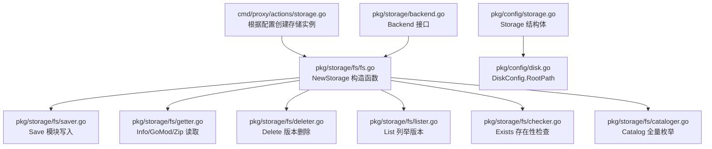
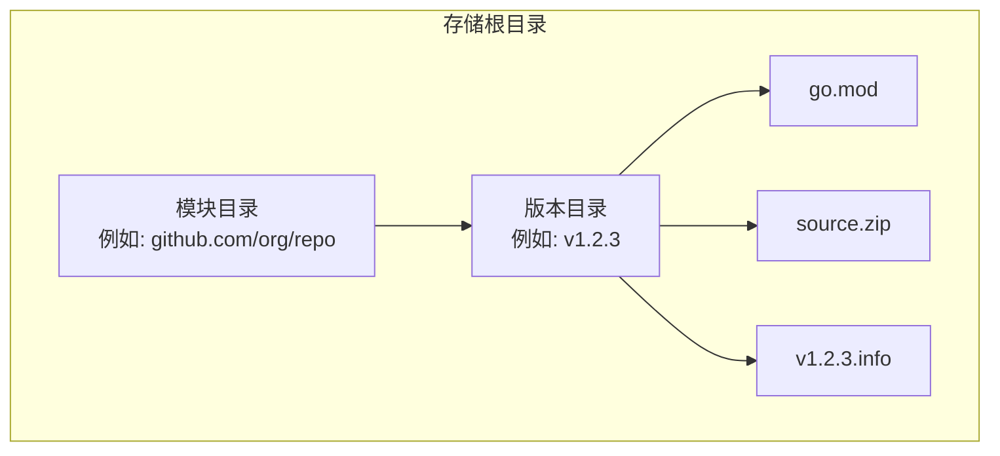
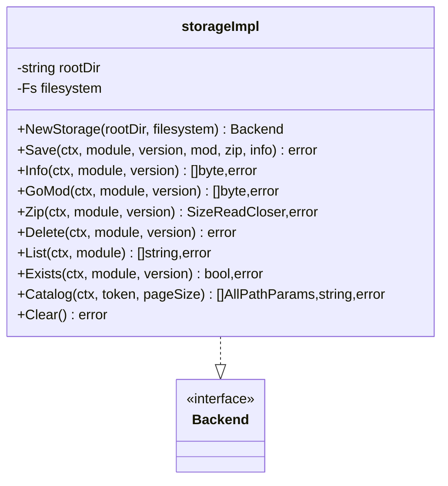
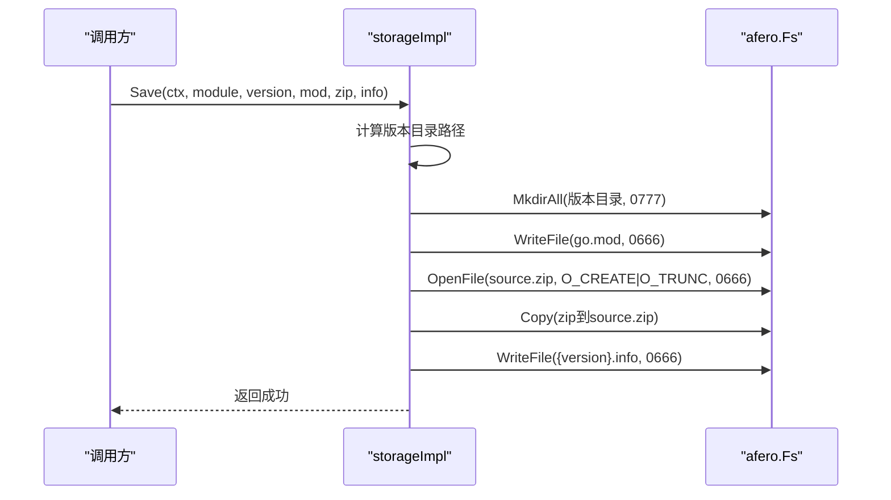
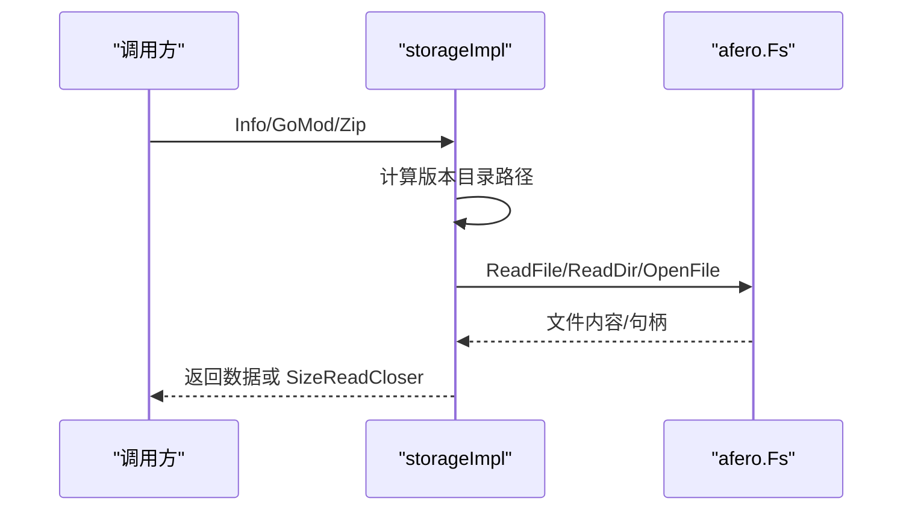
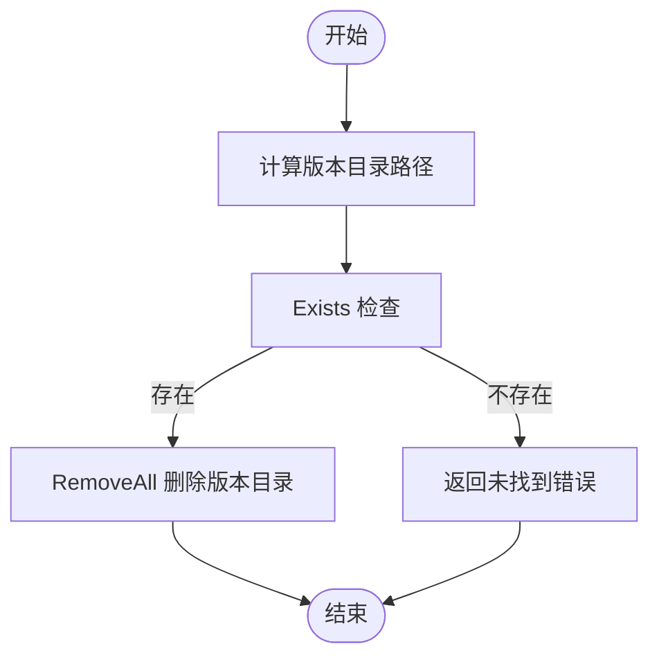
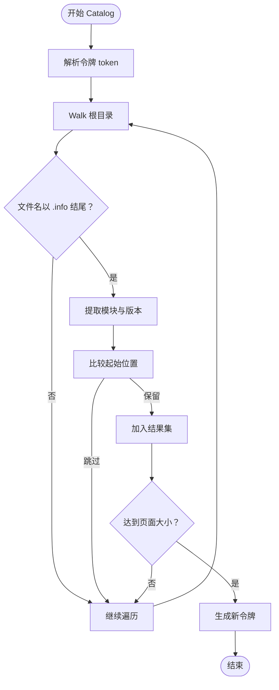
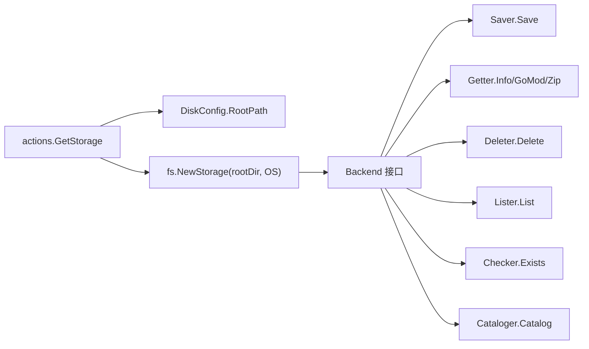

# 文件系统存储配置

<cite>
**本文引用的文件列表**
- [pkg/storage/fs/fs.go](file://pkg/storage/fs/fs.go)
- [pkg/storage/fs/saver.go](file://pkg/storage/fs/saver.go)
- [pkg/storage/fs/getter.go](file://pkg/storage/fs/getter.go)
- [pkg/storage/fs/deleter.go](file://pkg/storage/fs/deleter.go)
- [pkg/storage/fs/lister.go](file://pkg/storage/fs/lister.go)
- [pkg/storage/fs/checker.go](file://pkg/storage/fs/checker.go)
- [pkg/storage/fs/cataloger.go](file://pkg/storage/fs/cataloger.go)
- [pkg/config/disk.go](file://pkg/config/disk.go)
- [pkg/config/storage.go](file://pkg/config/storage.go)
- [pkg/storage/backend.go](file://pkg/storage/backend.go)
- [cmd/proxy/actions/storage.go](file://cmd/proxy/actions/storage.go)
- [docs/content/configuration/storage.md](file://docs/content/configuration/storage.md)
- [config.dev.toml](file://config.dev.toml)
</cite>

## 目录
1. [简介](#简介)
2. [项目结构与定位](#项目结构与定位)
3. [核心组件](#核心组件)
4. [架构总览](#架构总览)
5. [详细组件分析](#详细组件分析)
6. [依赖关系分析](#依赖关系分析)
7. [性能与可靠性](#性能与可靠性)
8. [配置参数详解](#配置参数详解)
9. [适用场景与限制](#适用场景与限制)
10. [故障排查与最佳实践](#故障排查与最佳实践)
11. [结论](#结论)

## 简介
本文件系统存储配置文档聚焦于 Athens 的“磁盘（Disk）”存储后端，系统性说明其特点、适用场景、限制以及配置要点。内容覆盖：
- 存储布局与数据组织方式
- 配置参数（存储路径、权限、空间管理、清理策略）
- 本地磁盘与网络文件系统的使用建议
- 性能特征、可靠性考虑与备份策略
- 磁盘空间监控、自动清理与故障恢复的最佳实践

## 项目结构与定位
- 文件系统存储位于 pkg/storage/fs，实现 Backend 接口的完整能力：列举版本、读取模块信息、保存模块、删除版本、存在性检查、目录遍历等。
- 配置通过 pkg/config 中的 DiskConfig 和 Storage 结构体定义，并在运行时由 cmd/proxy/actions/storage.go 根据环境变量或配置文件选择具体存储类型。
- 文档层在 docs/content/configuration/storage.md 提供了官方配置说明与示例。

图表来源
- [cmd/proxy/actions/storage.go](file://cmd/proxy/actions/storage.go#L24-L76)
- [pkg/storage/fs/fs.go](file://pkg/storage/fs/fs.go#L26-L39)
- [pkg/storage/fs/saver.go](file://pkg/storage/fs/saver.go#L14-L51)
- [pkg/storage/fs/getter.go](file://pkg/storage/fs/getter.go#L14-L55)
- [pkg/storage/fs/deleter.go](file://pkg/storage/fs/deleter.go#L10-L24)
- [pkg/storage/fs/lister.go](file://pkg/storage/fs/lister.go#L14-L38)
- [pkg/storage/fs/checker.go](file://pkg/storage/fs/checker.go#L12-L27)
- [pkg/storage/fs/cataloger.go](file://pkg/storage/fs/cataloger.go#L18-L68)
- [pkg/config/storage.go](file://pkg/config/storage.go#L3-L12)
- [pkg/config/disk.go](file://pkg/config/disk.go#L3-L6)
- [pkg/storage/backend.go](file://pkg/storage/backend.go#L3-L9)

章节来源
- [cmd/proxy/actions/storage.go](file://cmd/proxy/actions/storage.go#L24-L76)
- [pkg/storage/fs/fs.go](file://pkg/storage/fs/fs.go#L26-L39)
- [pkg/config/storage.go](file://pkg/config/storage.go#L3-L12)
- [pkg/config/disk.go](file://pkg/config/disk.go#L3-L6)
- [pkg/storage/backend.go](file://pkg/storage/backend.go#L3-L9)

## 核心组件
- storageImpl：文件系统存储实现，持有根目录与底层文件系统抽象（afero.Fs），负责模块与版本目录的构建、文件写入与读取、删除、列举、存在性检查、全量目录遍历等。
- Backend 接口：统一聚合 Lister、Getter、Saver、Deleter 四大能力，确保实现的一致性与可替换性。
- DiskConfig：磁盘存储的配置结构，仅包含 RootPath 字段，用于指定存储根目录。
- Storage：顶层配置容器，其中 Disk 字段承载磁盘配置。

章节来源
- [pkg/storage/fs/fs.go](file://pkg/storage/fs/fs.go#L13-L39)
- [pkg/storage/backend.go](file://pkg/storage/backend.go#L3-L9)
- [pkg/config/disk.go](file://pkg/config/disk.go#L3-L6)
- [pkg/config/storage.go](file://pkg/config/storage.go#L3-L12)

## 架构总览
文件系统存储以“模块/版本”两级目录组织数据，每个版本目录包含三个文件：
- go.mod：模块元数据
- source.zip：模块源码压缩包
- {version}.info：版本信息文件

图表来源
- [pkg/storage/fs/saver.go](file://pkg/storage/fs/saver.go#L14-L51)
- [pkg/storage/fs/getter.go](file://pkg/storage/fs/getter.go#L14-L55)
- [pkg/storage/fs/checker.go](file://pkg/storage/fs/checker.go#L12-L27)

章节来源
- [pkg/storage/fs/saver.go](file://pkg/storage/fs/saver.go#L14-L51)
- [pkg/storage/fs/getter.go](file://pkg/storage/fs/getter.go#L14-L55)
- [pkg/storage/fs/checker.go](file://pkg/storage/fs/checker.go#L12-L27)

## 详细组件分析

### 组件：storageImpl（文件系统存储实现）
- 责任边界
  - 构造与初始化：校验根目录存在性，返回 Backend 实例
  - 数据读写：保存、读取、删除、列举、存在性检查、全量目录遍历
  - 目录组织：模块级与版本级目录结构
- 关键方法
  - NewStorage：校验根目录存在性，返回 storageImpl
  - Save：创建版本目录，写入 go.mod、source.zip、{version}.info
  - Info/GoMod/Zip：按需读取版本目录中的文件
  - Delete：删除版本目录
  - List：列出模块下所有合法语义化版本子目录
  - Exists：判断版本目录是否包含三个文件
  - Catalog：基于文件系统遍历，生成模块/版本分页列表
  - Clear：清空并重建根目录（用于重置）

图表来源
- [pkg/storage/fs/fs.go](file://pkg/storage/fs/fs.go#L13-L47)
- [pkg/storage/backend.go](file://pkg/storage/backend.go#L3-L9)

章节来源
- [pkg/storage/fs/fs.go](file://pkg/storage/fs/fs.go#L13-L47)

### 组件：保存流程（Save）
- 步骤
  - 计算版本目录路径并创建
  - 写入 go.mod
  - 写入 source.zip
  - 写入 {version}.info
- 权限与安全
  - 目录与文件创建采用默认权限模式，最终权限受进程 umask 影响；建议结合部署环境的 umask 与文件系统 ACL 控制访问

图表来源
- [pkg/storage/fs/saver.go](file://pkg/storage/fs/saver.go#L14-L51)

章节来源
- [pkg/storage/fs/saver.go](file://pkg/storage/fs/saver.go#L14-L51)

### 组件：读取流程（Info/GoMod/Zip）
- Info：读取 {version}.info
- GoMod：读取 go.mod
- Zip：打开 source.zip 并包装为 SizeReadCloser

图表来源
- [pkg/storage/fs/getter.go](file://pkg/storage/fs/getter.go#L14-L55)

章节来源
- [pkg/storage/fs/getter.go](file://pkg/storage/fs/getter.go#L14-L55)

### 组件：删除流程（Delete）
- 先检查版本是否存在，再删除整个版本目录

图表来源
- [pkg/storage/fs/deleter.go](file://pkg/storage/fs/deleter.go#L10-L24)
- [pkg/storage/fs/checker.go](file://pkg/storage/fs/checker.go#L12-L27)

章节来源
- [pkg/storage/fs/deleter.go](file://pkg/storage/fs/deleter.go#L10-L24)
- [pkg/storage/fs/checker.go](file://pkg/storage/fs/checker.go#L12-L27)

### 组件：列举与全量遍历（List/Catalog）
- List：读取模块目录下的子目录，过滤出语义化版本名
- Catalog：遍历根目录，收集所有 .info 文件对应的模块/版本，支持分页与令牌续传

图表来源
- [pkg/storage/fs/cataloger.go](file://pkg/storage/fs/cataloger.go#L18-L68)

章节来源
- [pkg/storage/fs/lister.go](file://pkg/storage/fs/lister.go#L14-L38)
- [pkg/storage/fs/cataloger.go](file://pkg/storage/fs/cataloger.go#L18-L68)

## 依赖关系分析
- 运行时装配
  - actions.GetStorage 根据 StorageType 与配置创建对应存储实例；当 StorageType=disk 时，使用 DiskConfig.RootPath 初始化 fs.NewStorage，并注入 afero.OS 文件系统。
- 接口契约
  - storageImpl 实现 Backend 接口，从而统一对外暴露 Lister/Getter/Saver/Deleter 能力。
- 外部依赖
  - afero：提供跨平台文件系统抽象，便于测试与替换（如内存文件系统）。
  - 观测：每个关键操作均开启 OpenCensus Span，便于追踪与性能分析。

图表来源
- [cmd/proxy/actions/storage.go](file://cmd/proxy/actions/storage.go#L24-L76)
- [pkg/storage/fs/fs.go](file://pkg/storage/fs/fs.go#L26-L39)
- [pkg/storage/backend.go](file://pkg/storage/backend.go#L3-L9)

章节来源
- [cmd/proxy/actions/storage.go](file://cmd/proxy/actions/storage.go#L24-L76)
- [pkg/storage/backend.go](file://pkg/storage/backend.go#L3-L9)

## 性能与可靠性
- 性能特征
  - 顺序写入：Save 会顺序写入 go.mod、source.zip、{version}.info，适合顺序 IO 场景。
  - 读取路径：Info/GoMod/Zip 均为直接文件读取，延迟主要取决于底层文件系统与网络挂载性能。
  - 遍历开销：Catalog 使用文件系统遍历，页面大小与令牌机制有助于分批处理。
- 可靠性考虑
  - 文件系统一致性：依赖底层文件系统与挂载协议的原子性与一致性保证。
  - 并发控制：多实例共享同一存储时，需要分布式锁（Single Flight）避免并发写冲突；该机制与磁盘存储本身无关，但与部署架构强相关。
- 备份策略
  - 建议对存储根目录进行周期性快照或镜像备份。
  - 对于网络文件系统，遵循其自带的备份与高可用方案。

[本节为通用指导，不直接分析具体文件]

## 配置参数详解
- 存储类型与入口
  - StorageType=disk：启用磁盘存储
  - Storage.Disk.RootPath：指定存储根目录
- 环境变量
  - ATHENS_STORAGE_TYPE：覆盖 StorageType
  - ATHENS_DISK_STORAGE_ROOT：覆盖 Storage.Disk.RootPath
- 配置示例来源
  - 官方文档示例与开发配置文件中均提供了完整的磁盘存储配置片段

章节来源
- [docs/content/configuration/storage.md](file://docs/content/configuration/storage.md#L53-L69)
- [config.dev.toml](file://config.dev.toml#L392-L403)
- [pkg/config/disk.go](file://pkg/config/disk.go#L3-L6)
- [pkg/config/storage.go](file://pkg/config/storage.go#L3-L12)
- [cmd/proxy/actions/storage.go](file://cmd/proxy/actions/storage.go#L35-L45)

## 适用场景与限制
- 适用场景
  - 单机或本地磁盘缓存
  - 小规模团队或 CI/CD 缓存
  - 作为离线预填充的落地介质
- 限制
  - 不具备内置的并发写保护；多实例共享存储需配合分布式锁（Single Flight）
  - 无内置的配额与淘汰策略；需要外部脚本或工具进行空间管理
  - 无法自动清理过期版本；需要自建策略与执行器

[本节为概念性总结，不直接分析具体文件]

## 故障排查与最佳实践
- 常见问题
  - 根目录不存在：NewStorage 会在初始化阶段报错，需确认 RootPath 是否存在且可访问
  - 权限不足：保存/读取失败可能源于 umask 或文件系统 ACL 设置不当
  - 并发冲突：多实例同时写入相同模块版本可能导致竞争条件，需启用分布式锁
- 最佳实践
  - 空间管理
    - 使用外部脚本定期扫描 Catalog 输出，统计模块数量与体积，设定阈值触发清理
    - 清理策略：按版本排序，优先删除旧版本；或按模块维度保留最近 N 个版本
  - 自动清理
    - 在 Cron 或定时任务中执行清理逻辑，避免与上游下载高峰重叠
  - 备份与恢复
    - 对存储根目录进行周期性快照；验证恢复流程，确保可回滚
  - 监控
    - 监控磁盘使用率、IO 延迟、目录项数量；异常告警联动人工介入
  - 网络文件系统
    - 选择合适的挂载选项（如异步写、缓存策略），并评估断连重试与一致性影响
- 参考实现路径
  - Catalog 分页与令牌：用于批量扫描与统计
  - List/Exists：用于快速判断版本是否存在
  - Delete：用于执行清理动作

章节来源
- [pkg/storage/fs/fs.go](file://pkg/storage/fs/fs.go#L26-L39)
- [pkg/storage/fs/cataloger.go](file://pkg/storage/fs/cataloger.go#L18-L68)
- [pkg/storage/fs/lister.go](file://pkg/storage/fs/lister.go#L14-L38)
- [pkg/storage/fs/checker.go](file://pkg/storage/fs/checker.go#L12-L27)
- [pkg/storage/fs/deleter.go](file://pkg/storage/fs/deleter.go#L10-L24)

## 结论
文件系统存储为 Athens 提供了简单、直观且易于运维的本地/网络磁盘缓存方案。其优势在于实现简洁、部署门槛低；局限在于缺乏并发写保护与空间治理能力。通过合理的部署架构（分布式锁）、完善的监控与备份策略，以及自动化清理脚本，可在生产环境中稳定运行。建议在多实例共享存储时，务必启用分布式锁，并结合 Catalog/List/Exists/Delete 等能力构建自动化运维体系。