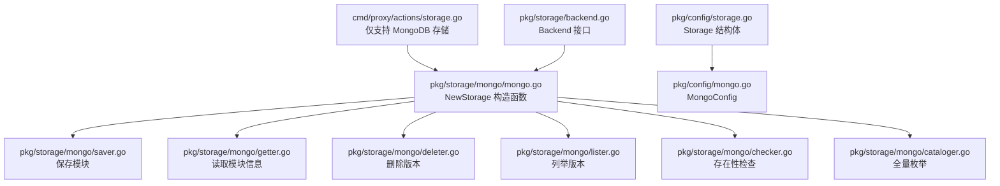
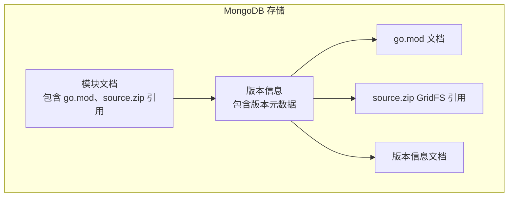
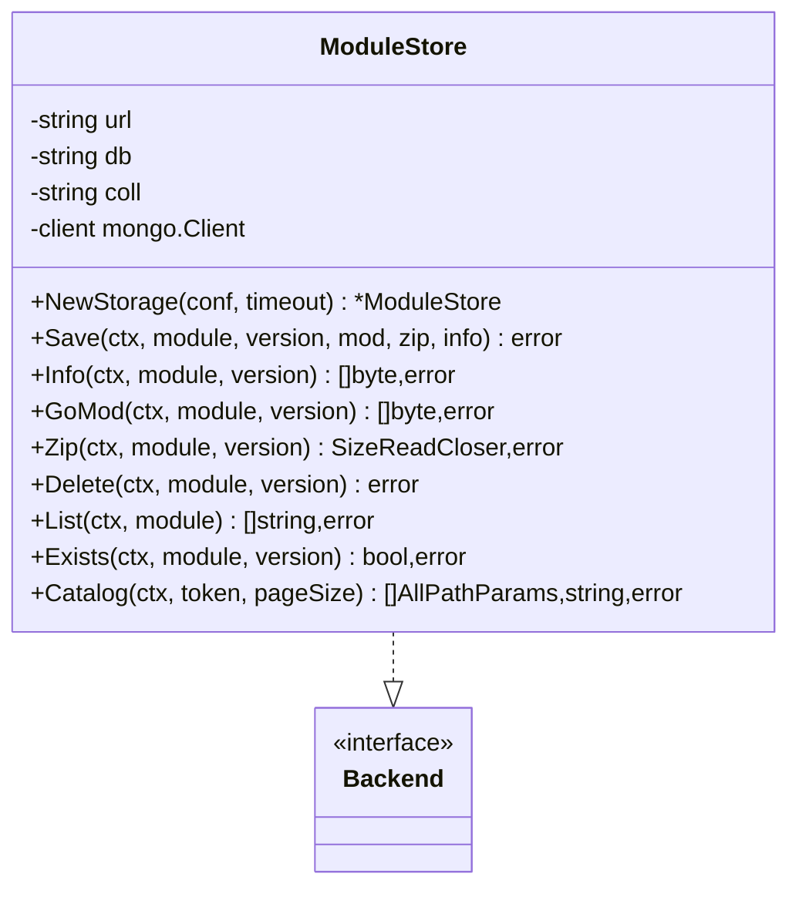
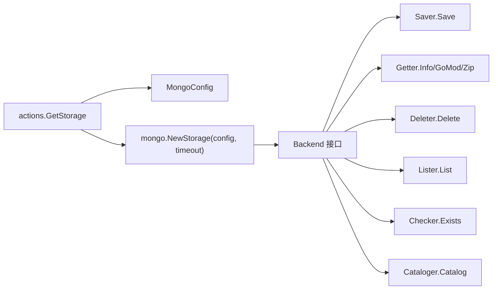

# 文件系统存储配置

<cite>
**本文引用的文件列表**
- [cmd/proxy/actions/storage.go](file://cmd/proxy/actions/storage.go)
- [pkg/config/storage.go](file://pkg/config/storage.go)
- [pkg/config/config.go](file://pkg/config/config.go)
- [pkg/storage/backend.go](file://pkg/storage/backend.go)
- [docs/content/configuration/storage.md](file://docs/content/configuration/storage.md)
- [config.dev.toml](file://config.dev.toml)
</cite>

## 更新摘要
**所做更改**
- 移除了文件系统存储（磁盘存储）相关章节，因为该功能已被完全移除
- 更新了配置参数详解部分，反映当前仅支持 MongoDB 存储
- 更新了适用场景与限制部分，说明当前支持的存储类型
- 更新了故障排查与最佳实践部分，提供 MongoDB 存储的替代方案
- 更新了结论部分，反映当前的存储架构

## 目录
1. [简介](#简介)
2. [项目结构与定位](#项目结构与定位)
3. [核心组件](#核心组件)
4. [架构总览](#架构总览)
5. [详细组件分析](#详细组件分析)
6. [依赖关系分析](#依赖关系分析)
7. [性能与可靠性](#性能与可靠性)
8. [配置参数详解](#配置参数详解)
9. [适用场景与限制](#适用场景与限制)
10. [故障排查与最佳实践](#故障排查与最佳实践)
11. [结论](#结论)

## 简介
本文件系统存储配置文档原本聚焦于 Athens 的"磁盘（Disk）"存储后端，但根据最新的代码变更，文件系统存储功能已被完全移除，不再支持磁盘存储选项。当前系统仅支持 MongoDB 存储后端。本文档已更新以反映这一重大变更，说明当前的存储架构和支持的存储类型。

## 项目结构与定位
- **已移除** 文件系统存储位于 pkg/storage/fs，原本实现 Backend 接口的完整能力
- 当前配置通过 pkg/config 中的 Storage 结构体定义，仅支持 MongoDB 配置
- 运行时由 cmd/proxy/actions/storage.go 根据环境变量或配置文件选择 MongoDB 存储类型
- 文档层在 docs/content/configuration/storage.md 提供了官方配置说明

**图表来源**
- [cmd/proxy/actions/storage.go](file://cmd/proxy/actions/storage.go#L13-L26)
- [pkg/storage/mongo/mongo.go](file://pkg/storage/mongo/mongo.go#L30-L50)
- [pkg/config/storage.go](file://pkg/config/storage.go#L3-L6)
- [pkg/storage/backend.go](file://pkg/storage/backend.go)

**章节来源**
- [cmd/proxy/actions/storage.go](file://cmd/proxy/actions/storage.go#L13-L26)
- [pkg/config/storage.go](file://pkg/config/storage.go#L3-L6)
- [pkg/storage/backend.go](file://pkg/storage/backend.go)

## 核心组件
- **已移除** storageImpl：文件系统存储实现，原本持有根目录与底层文件系统抽象
- **当前** MongoDB 存储实现：通过 pkg/storage/mongo 包提供完整的存储功能
- Backend 接口：统一聚合 Lister、Getter、Saver、Deleter 四大能力
- Storage：顶层配置容器，仅包含 Mongo 字段承载 MongoDB 配置

**章节来源**
- [pkg/config/storage.go](file://pkg/config/storage.go#L3-L6)
- [pkg/storage/backend.go](file://pkg/storage/backend.go)

## 架构总览
**已移除** 文件系统存储以"模块/版本"两级目录组织数据
**当前** MongoDB 存储使用文档数据库存储模块信息和源码

**图表来源**
- [pkg/storage/mongo/saver.go](file://pkg/storage/mongo/saver.go)
- [pkg/storage/mongo/getter.go](file://pkg/storage/mongo/getter.go)
- [pkg/storage/mongo/deleter.go](file://pkg/storage/mongo/deleter.go)

## 详细组件分析

### 组件：MongoDB 存储实现
- 责任边界
  - 连接管理：建立与 MongoDB 的连接，配置数据库和集合
  - 数据读写：保存、读取、删除、列举、存在性检查、全量目录遍历
  - 文档组织：模块级与版本级文档结构
- 关键方法
  - NewStorage：建立 MongoDB 连接，初始化数据库和集合
  - Save：创建版本文档，存储 go.mod 和 source.zip 引用
  - Info/GoMod/Zip：从 GridFS 读取版本信息和源码
  - Delete：删除版本文档和相关文件
  - List：查询模块下所有版本文档
  - Exists：检查版本文档是否存在
  - Catalog：查询所有模块和版本文档，支持分页

**图表来源**
- [pkg/storage/mongo/mongo.go](file://pkg/storage/mongo/mongo.go#L19-L50)
- [pkg/storage/backend.go](file://pkg/storage/backend.go)

**章节来源**
- [pkg/storage/mongo/mongo.go](file://pkg/storage/mongo/mongo.go#L19-L50)

### 组件：MongoDB 连接与配置
- 连接建立：通过 URL 连接到 MongoDB 集群
- 数据库初始化：默认使用 "athens" 数据库，"modules" 集合
- 安全配置：支持证书认证和不安全连接模式
- 超时控制：为所有操作设置超时时间

**章节来源**
- [pkg/storage/mongo/mongo.go](file://pkg/storage/mongo/mongo.go#L30-L50)

## 依赖关系分析
- **已移除** 运行时装配：actions.GetStorage 根据 StorageType 创建 fs.NewStorage
- **当前** 运行时装配：actions.GetStorage 仅支持 "mongo" 存储类型，创建 mongo.NewStorage
- 接口契约：MongoDB 实现 Backend 接口
- 外部依赖：MongoDB 驱动程序，GridFS 用于大文件存储

**图表来源**
- [cmd/proxy/actions/storage.go](file://cmd/proxy/actions/storage.go#L13-L26)
- [pkg/storage/mongo/mongo.go](file://pkg/storage/mongo/mongo.go#L30-L50)
- [pkg/storage/backend.go](file://pkg/storage/backend.go)

**章节来源**
- [cmd/proxy/actions/storage.go](file://cmd/proxy/actions/storage.go#L13-L26)
- [pkg/storage/backend.go](file://pkg/storage/backend.go)

## 性能与可靠性
- **已移除** 文件系统存储性能特征：顺序写入、直接文件读取、文件系统遍历
- **当前** MongoDB 存储性能特征：
  - 文档存储：Info/GoMod 直接从文档获取元数据
  - GridFS 存储：Zip 文件通过 GridFS 流式传输
  - 索引优化：版本查询和模块枚举通过数据库索引加速
  - 连接池：MongoDB 驱动程序提供连接池管理
- 可靠性考虑：
  - 数据库事务：支持 MongoDB 事务特性
  - 副本集：支持 MongoDB 副本集部署
  - 连接超时：所有操作都有明确的超时控制
- 备份策略：
  - MongoDB 备份：支持标准 MongoDB 备份工具
  - 热备份：支持热备份和在线维护

## 配置参数详解
- **已移除** 存储类型与入口：StorageType=disk 启用磁盘存储
- **当前** 存储类型与入口：StorageType=mongo 启用 MongoDB 存储
- **已移除** 环境变量：ATHENS_DISK_STORAGE_ROOT
- **当前** 环境变量：ATHENS_MONGO_STORAGE_URL、ATHENS_MONGO_CERT_PATH、ATHENS_MONGO_INSECURE
- 配置示例来源：开发配置文件中提供了完整的 MongoDB 存储配置

**章节来源**
- [docs/content/configuration/storage.md](file://docs/content/configuration/storage.md#L71-L106)
- [config.dev.toml](file://config.dev.toml#L454-L470)
- [pkg/config/storage.go](file://pkg/config/storage.go#L3-L6)
- [pkg/config/config.go](file://pkg/config/config.go#L39-L300)

## 适用场景与限制
- **已移除** 适用场景：单机或本地磁盘缓存、小规模团队缓存
- **当前** 适用场景：
  - 生产环境部署
  - 需要高可用性的企业级应用
  - 需要事务支持的场景
  - 需要水平扩展的应用
- **已移除** 限制：不具备内置的并发写保护、无内置的配额与淘汰策略
- **当前** 限制：
  - 需要 MongoDB 数据库基础设施
  - 需要网络连接到 MongoDB 服务器
  - 需要适当的数据库权限配置
  - 需要数据库备份和监控策略

## 故障排查与最佳实践
- **已移除** 常见问题：根目录不存在、权限不足、并发冲突
- **当前** 常见问题：
  - MongoDB 连接失败：检查 URL 格式和网络连通性
  - 认证失败：检查用户名、密码和数据库权限
  - 超时问题：调整超时配置和网络延迟
  - 索引性能：为常用查询字段创建适当索引
- **已移除** 最佳实践：空间管理、自动清理、备份与恢复、监控
- **当前** 最佳实践：
  - 数据库监控：使用 MongoDB 监控工具跟踪性能指标
  - 备份策略：定期备份数据库，测试恢复流程
  - 连接池管理：合理配置连接池大小和超时时间
  - 安全配置：启用认证和加密，限制数据库权限
  - 性能优化：使用适当的索引，优化查询语句

**章节来源**
- [pkg/storage/mongo/mongo.go](file://pkg/storage/mongo/mongo.go#L30-L50)
- [pkg/storage/mongo/cataloger.go](file://pkg/storage/mongo/cataloger.go#L15-L49)

## 结论
文件系统存储功能已被完全移除，当前 Athens 仅支持 MongoDB 存储后端。MongoDB 提供了更强大的功能，包括事务支持、副本集部署、索引优化等特性。虽然失去了简单的文件系统部署优势，但获得了更好的企业级特性和可靠性。对于需要文件系统存储的用户，建议考虑以下替代方案：

1. **使用 MongoDB 作为存储**：这是推荐的生产环境解决方案
2. **使用对象存储服务**：如 AWS S3、Google Cloud Storage 等
3. **使用其他支持的存储后端**：如 Azure Blob Storage、Minio 等

无论选择哪种方案，都需要确保有适当的备份策略、监控和维护流程。