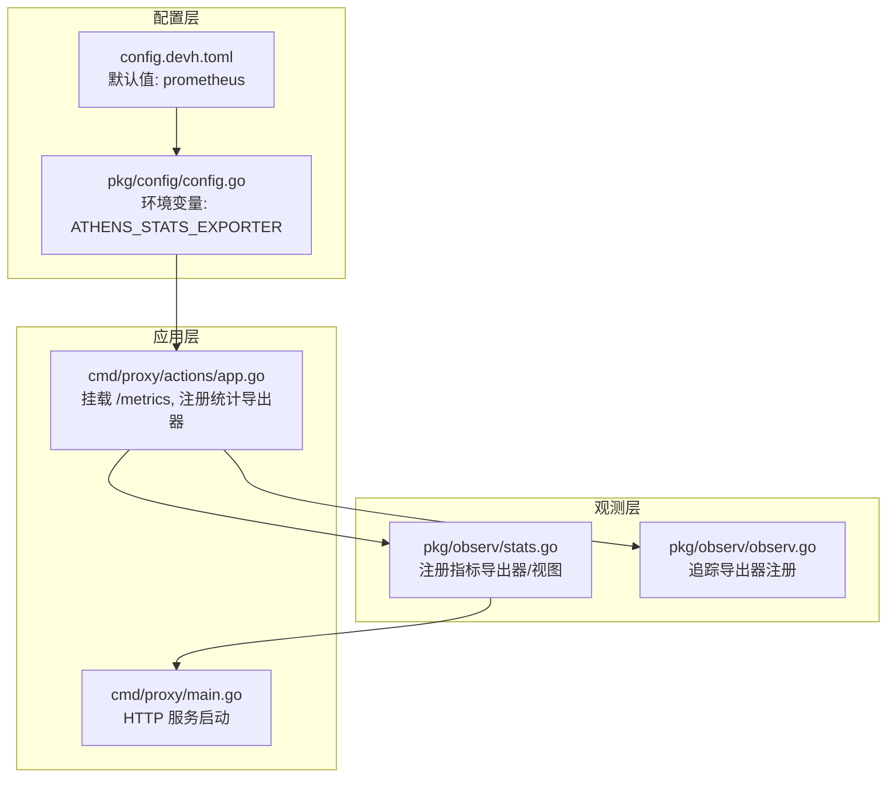
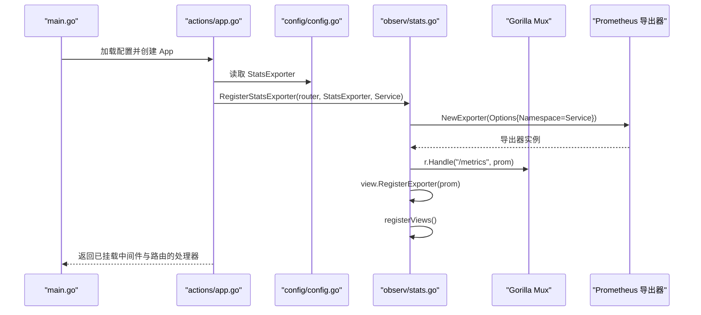
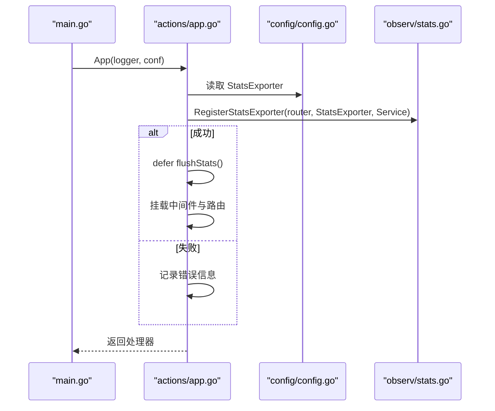
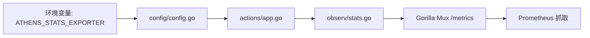

# 指标配置

<cite>
**本文引用的文件**
- [pkg/observ/stats.go](file://pkg/observ/stats.go)
- [pkg/observ/observ.go](file://pkg/observ/observ.go)
- [cmd/proxy/actions/app.go](file://cmd/proxy/actions/app.go)
- [cmd/proxy/main.go](file://cmd/proxy/main.go)
- [pkg/config/config.go](file://pkg/config/config.go)
- [config.devh.toml](file://config.devh.toml)
- [config.dev.toml](file://config.dev.toml)
</cite>

## 目录
1. [简介](#简介)
2. [项目结构](#项目结构)
3. [核心组件](#核心组件)
4. [架构总览](#架构总览)
5. [详细组件分析](#详细组件分析)
6. [依赖关系分析](#依赖关系分析)
7. [性能考量](#性能考量)
8. [故障排查指南](#故障排查指南)
9. [结论](#结论)
10. [附录](#附录)

## 简介
本文件聚焦于 Athens 的指标配置与导出，围绕以下主题展开：
- 指标导出器配置（ATHENS_STATS_EXPORTER）
- 指标收集参数与暴露端点
- Prometheus 指标格式、自定义指标与标签管理
- 不同导出器的配置示例
- 性能开销、数据保留与查询优化
- 监控、告警与最佳实践

## 项目结构
与指标相关的核心代码分布在以下模块：
- 配置加载与环境变量解析：pkg/config
- 指标导出器注册与视图注册：pkg/observ
- 应用启动与路由挂载：cmd/proxy/actions、cmd/proxy/main



图表来源
- [pkg/config/config.go](file://pkg/config/config.go#L37-L38)
- [config.devh.toml](file://config.devh.toml#L206-L210)
- [pkg/observ/stats.go](file://pkg/observ/stats.go#L17-L46)
- [cmd/proxy/actions/app.go](file://cmd/proxy/actions/app.go#L86-L94)
- [cmd/proxy/main.go](file://cmd/proxy/main.go#L64-L98)

章节来源
- [pkg/config/config.go](file://pkg/config/config.go#L37-L38)
- [config.devh.toml](file://config.devh.toml#L206-L210)
- [pkg/observ/stats.go](file://pkg/observ/stats.go#L17-L46)
- [cmd/proxy/actions/app.go](file://cmd/proxy/actions/app.go#L86-L94)
- [cmd/proxy/main.go](file://cmd/proxy/main.go#L64-L98)

## 核心组件
- 指标导出器注册器：负责根据配置选择导出器并注册视图，当前支持 prometheus、stackdriver、datadog。
- 视图注册器：注册一组 HTTP 与客户端相关的统计视图，用于采集服务端请求计数、响应字节、延迟、状态码分布、客户端往返延迟等。
- 暴露端点：在路由上挂载 /metrics，供 Prometheus 抓取。

章节来源
- [pkg/observ/stats.go](file://pkg/observ/stats.go#L17-L46)
- [pkg/observ/stats.go](file://pkg/observ/stats.go#L92-L110)

## 架构总览
下图展示了从应用启动到指标暴露的关键流程：



图表来源
- [cmd/proxy/main.go](file://cmd/proxy/main.go#L59-L62)
- [cmd/proxy/actions/app.go](file://cmd/proxy/actions/app.go#L86-L94)
- [pkg/config/config.go](file://pkg/config/config.go#L37-L38)
- [pkg/observ/stats.go](file://pkg/observ/stats.go#L48-L63)
- [pkg/observ/stats.go](file://pkg/observ/stats.go#L92-L110)

## 详细组件分析

### 组件A：指标导出器与视图注册
- 导出器选择
  - prometheus：创建导出器并注册到路由，暴露 /metrics。
  - stackdriver：注册导出器并设置上报周期。
  - datadog：注册导出器并在停止时释放资源。
- 视图注册
  - 注册一组 HTTP 服务端与客户端的统计视图，包括请求计数、响应字节、延迟、状态码分布、请求方法分布、客户端往返延迟分布、客户端完成计数等。

```mermaid
flowchart TD
Start(["进入 RegisterStatsExporter"]) --> CheckType{"StatsExporter 类型"}
CheckType --> |prometheus| RegProm["registerPrometheusExporter"]
CheckType --> |stackdriver| RegSD["registerStatsStackDriverExporter"]
CheckType --> |datadog| RegDD["registerStatsDataDogExporter"]
CheckType --> |""| ErrEmpty["返回错误: 未指定导出器"]
CheckType --> |其他| ErrUnsupported["返回错误: 不支持的导出器"]
RegProm --> Views["registerViews()"]
RegSD --> Views
RegDD --> Views
Views --> End(["返回停止函数/成功"])
ErrEmpty --> End
ErrUnsupported --> End
```

图表来源
- [pkg/observ/stats.go](file://pkg/observ/stats.go#L17-L46)
- [pkg/observ/stats.go](file://pkg/observ/stats.go#L92-L110)

章节来源
- [pkg/observ/stats.go](file://pkg/observ/stats.go#L17-L46)
- [pkg/observ/stats.go](file://pkg/observ/stats.go#L48-L63)
- [pkg/observ/stats.go](file://pkg/observ/stats.go#L76-L90)
- [pkg/observ/stats.go](file://pkg/observ/stats.go#L92-L110)

### 组件B：应用启动与路由挂载
- 应用启动时读取配置，调用指标导出器注册器，并在成功时挂载 /metrics 到路由。
- 若配置未设置或不支持的导出器，记录信息并继续运行（不影响业务，仅不导出指标）。



图表来源
- [cmd/proxy/main.go](file://cmd/proxy/main.go#L59-L62)
- [cmd/proxy/actions/app.go](file://cmd/proxy/actions/app.go#L86-L94)
- [pkg/config/config.go](file://pkg/config/config.go#L37-L38)
- [pkg/observ/stats.go](file://pkg/observ/stats.go#L17-L46)

章节来源
- [cmd/proxy/actions/app.go](file://cmd/proxy/actions/app.go#L86-L94)
- [cmd/proxy/main.go](file://cmd/proxy/main.go#L64-L98)

### 组件C：Prometheus 指标格式与标签
- 导出器命名空间
  - 使用服务名作为命名空间，便于在多服务环境中区分指标。
- 暴露端点
  - 在路由上挂载 /metrics，供 Prometheus 抓取。
- 自定义指标与标签
  - 通过注册视图，自动产生一组 HTTP 相关指标；若需扩展，可在视图注册处添加新的视图。

章节来源
- [pkg/observ/stats.go](file://pkg/observ/stats.go#L50-L53)
- [pkg/observ/stats.go](file://pkg/observ/stats.go#L57-L58)
- [pkg/observ/stats.go](file://pkg/observ/stats.go#L92-L110)

## 依赖关系分析
- 配置依赖
  - 应用通过环境变量 ATHENS_STATS_EXPORTER 读取指标导出器类型。
  - 默认配置文件提供默认值 prometheus。
- 观测依赖
  - 指标导出器注册器依赖 OpenCensus 视图与 HTTP 插件。
  - 路由依赖 Gorilla Mux。
- 运行时依赖
  - HTTP 服务器在启动时监听端口或 Unix Socket。



图表来源
- [pkg/config/config.go](file://pkg/config/config.go#L37-L38)
- [config.devh.toml](file://config.devh.toml#L206-L210)
- [cmd/proxy/actions/app.go](file://cmd/proxy/actions/app.go#L86-L94)
- [pkg/observ/stats.go](file://pkg/observ/stats.go#L57-L58)

章节来源
- [pkg/config/config.go](file://pkg/config/config.go#L37-L38)
- [config.devh.toml](file://config.devh.toml#L206-L210)
- [cmd/proxy/actions/app.go](file://cmd/proxy/actions/app.go#L86-L94)
- [pkg/observ/stats.go](file://pkg/observ/stats.go#L57-L58)

## 性能考量
- 指标开销
  - 指标导出器与视图注册在应用启动阶段完成，运行时对请求路径的影响主要来自 OpenCensus 插件与视图上报。默认视图集合覆盖常见 HTTP 指标，通常开销可控。
- 数据保留
  - Prometheus 侧的保留策略由 Prometheus 服务器配置决定，与 Athens 无关。
- 查询优化
  - 建议结合服务命名空间与标签进行查询，避免全量扫描。
  - 对高基数标签（如路径参数）谨慎使用，必要时在 Prometheus 中降采样或聚合。

[本节为通用指导，无需具体文件分析]

## 故障排查指南
- 未设置导出器
  - 现象：应用启动时记录“未指定 StatsExporter”，指标不会被导出。
  - 处理：设置环境变量 ATHENS_STATS_EXPORTER 为 prometheus。
- 不支持的导出器
  - 现象：应用启动时记录“不支持的 StatsExporter”。
  - 处理：将导出器改为 prometheus、stackdriver 或 datadog。
- /metrics 无法访问
  - 现象：Prometheus 无法抓取 /metrics。
  - 排查：确认应用已成功注册导出器并挂载 /metrics；检查端口/Unix Socket 配置与防火墙。
- 指标缺失
  - 现象：Prometheus 抓取到指标但缺少预期视图。
  - 排查：确认已注册视图；检查服务命名空间是否正确。

章节来源
- [pkg/observ/stats.go](file://pkg/observ/stats.go#L36-L40)
- [pkg/observ/stats.go](file://pkg/observ/stats.go#L17-L46)
- [cmd/proxy/actions/app.go](file://cmd/proxy/actions/app.go#L86-L94)

## 结论
- Athens 通过配置项 ATHENS_STATS_EXPORTER 选择指标导出器，默认值为 prometheus。
- 应用启动时注册视图并挂载 /metrics，便于 Prometheus 抓取。
- 当前内置视图覆盖 HTTP 服务端与客户端关键指标，满足常规监控需求。
- 如需扩展指标，可在视图注册处增加新视图；同时关注性能与标签基数控制。

[本节为总结性内容，无需具体文件分析]

## 附录

### A. 指标导出器配置示例
- 环境变量方式
  - 设置 ATHENS_STATS_EXPORTER 为 prometheus、stackdriver 或 datadog。
- 配置文件方式
  - 在配置文件中设置 StatsExporter 字段为 prometheus。

章节来源
- [pkg/config/config.go](file://pkg/config/config.go#L37-L38)
- [config.devh.toml](file://config.devh.toml#L206-L210)
- [config.dev.toml](file://config.dev.toml#L230-L234)

### B. 暴露端点与服务命名空间
- 端点：/metrics
- 命名空间：服务名（Service），用于区分多服务实例。

章节来源
- [pkg/observ/stats.go](file://pkg/observ/stats.go#L50-L53)
- [pkg/observ/stats.go](file://pkg/observ/stats.go#L57-L58)

### C. 默认配置与环境变量映射
- 默认值：prometheus
- 环境变量：ATHENS_STATS_EXPORTER
- 配置文件键：StatsExporter

章节来源
- [pkg/config/config.go](file://pkg/config/config.go#L146-L162)
- [pkg/config/config.go](file://pkg/config/config.go#L37-L38)
- [config.devh.toml](file://config.devh.toml#L206-L210)