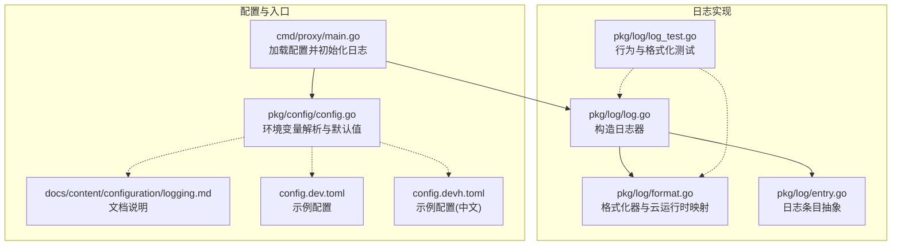
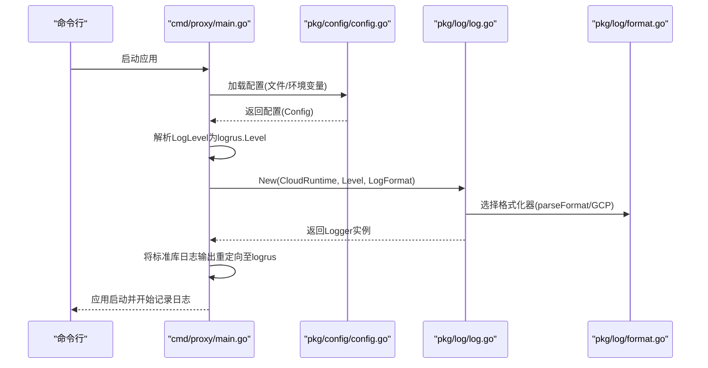
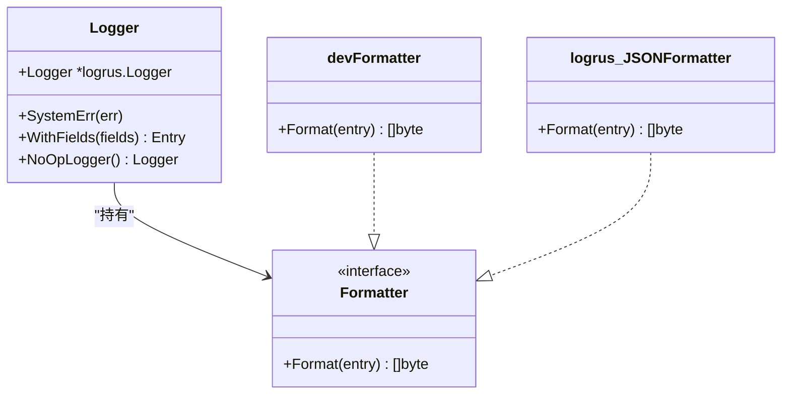
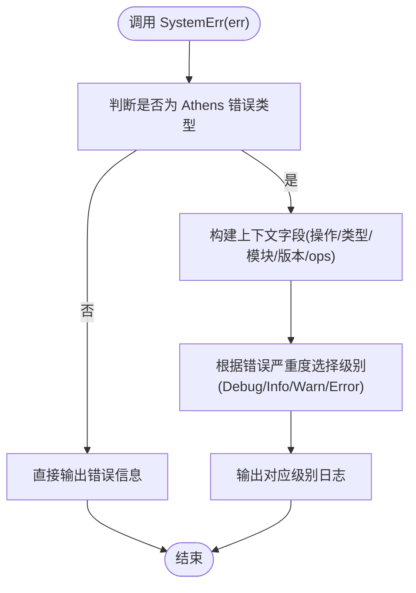
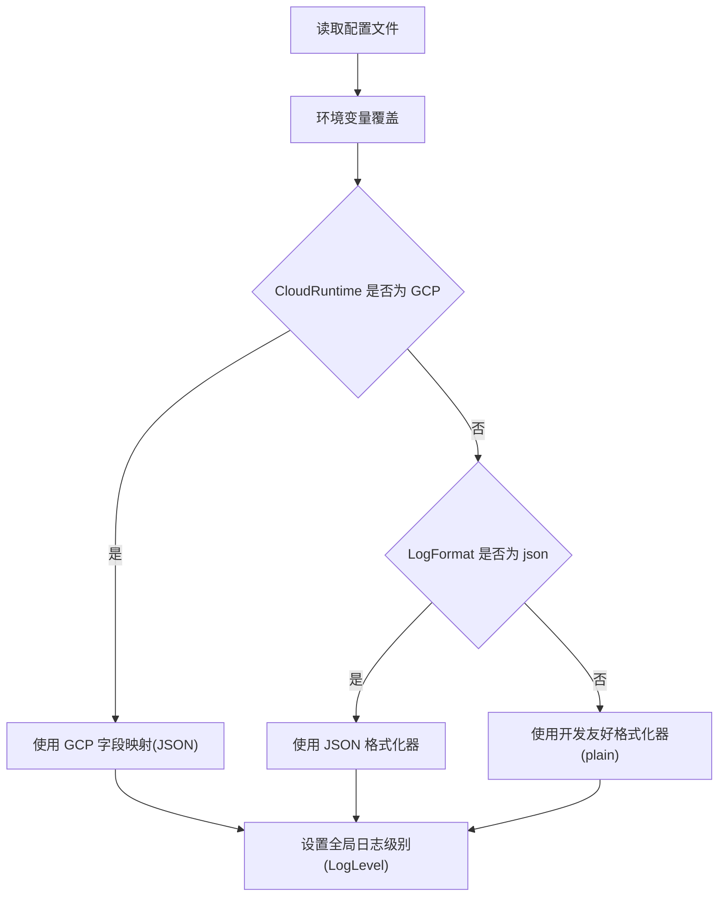
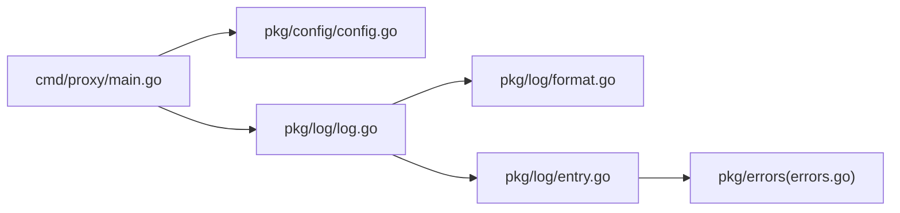

# 日志配置

<cite>
**本文引用的文件**
- [pkg/log/log.go](file://pkg/log/log.go)
- [pkg/log/format.go](file://pkg/log/format.go)
- [pkg/log/entry.go](file://pkg/log/entry.go)
- [pkg/log/log_test.go](file://pkg/log/log_test.go)
- [pkg/config/config.go](file://pkg/config/config.go)
- [cmd/proxy/main.go](file://cmd/proxy/main.go)
- [docs/content/configuration/logging.md](file://docs/content/configuration/logging.md)
- [config.dev.toml](file://config.dev.toml)
- [config.devh.toml](file://config.devh.toml)
</cite>

## 目录
1. [简介](#简介)
2. [项目结构](#项目结构)
3. [核心组件](#核心组件)
4. [架构总览](#架构总览)
5. [详细组件分析](#详细组件分析)
6. [依赖关系分析](#依赖关系分析)
7. [性能考量](#性能考量)
8. [故障排除指南](#故障排除指南)
9. [结论](#结论)
10. [附录](#附录)

## 简介
本文件系统性阐述 Athens 的日志配置与使用，涵盖日志级别、输出格式、云运行时适配、配置参数、示例与最佳实践，并结合源码说明日志在应用中的装配流程与行为特征。

## 项目结构
与日志相关的核心代码集中在 pkg/log 与 pkg/config，入口程序 cmd/proxy/main.go 负责加载配置并初始化日志记录器；文档 docs/content/configuration/logging.md 提供了高层说明。

**图表来源**
- [pkg/log/log.go](file://pkg/log/log.go#L1-L48)
- [pkg/log/format.go](file://pkg/log/format.go#L1-L74)
- [pkg/log/entry.go](file://pkg/log/entry.go#L1-L67)
- [pkg/log/log_test.go](file://pkg/log/log_test.go#L1-L152)
- [pkg/config/config.go](file://pkg/config/config.go#L1-L376)
- [cmd/proxy/main.go](file://cmd/proxy/main.go#L1-L128)
- [docs/content/configuration/logging.md](file://docs/content/configuration/logging.md#L1-L18)
- [config.dev.toml](file://config.dev.toml#L76-L89)
- [config.devh.toml](file://config.devh.toml#L60-L73)

**章节来源**
- [pkg/log/log.go](file://pkg/log/log.go#L1-L48)
- [pkg/log/format.go](file://pkg/log/format.go#L1-L74)
- [pkg/log/entry.go](file://pkg/log/entry.go#L1-L67)
- [pkg/config/config.go](file://pkg/config/config.go#L1-L376)
- [cmd/proxy/main.go](file://cmd/proxy/main.go#L1-L128)
- [docs/content/configuration/logging.md](file://docs/content/configuration/logging.md#L1-L18)
- [config.dev.toml](file://config.dev.toml#L76-L89)
- [config.devh.toml](file://config.devh.toml#L60-L73)

## 核心组件
- 日志器构造与云运行时适配：根据 CloudRuntime 选择 GCP 字段映射或普通格式化器；根据 LogFormat 选择 plain/json；根据 LogLevel 设置全局级别。
- 格式化器：plain 使用带颜色与排序字段的开发友好格式；json 使用标准 JSON；GCP 运行时将 level/msg/time 映射为 severity/message/timestamp。
- 日志条目抽象：统一 Debugf/Infof/Warnf/Errorf 与 WithFields/SystemErr 接口，保证上下文字段不被覆盖。
- 配置加载：支持 TOML 配置文件与环境变量覆盖；默认开发模式 debug/plain；生产模式可通过环境变量调整。

**章节来源**
- [pkg/log/log.go](file://pkg/log/log.go#L13-L27)
- [pkg/log/format.go](file://pkg/log/format.go#L14-L22)
- [pkg/log/format.go](file://pkg/log/format.go#L24-L56)
- [pkg/log/format.go](file://pkg/log/format.go#L67-L73)
- [pkg/log/entry.go](file://pkg/log/entry.go#L13-L26)
- [pkg/log/entry.go](file://pkg/log/entry.go#L37-L55)
- [pkg/config/config.go](file://pkg/config/config.go#L146-L173)
- [pkg/config/config.go](file://pkg/config/config.go#L29-L32)

## 架构总览
下图展示了从配置加载到日志器初始化再到日志输出的整体流程。

**图表来源**
- [cmd/proxy/main.go](file://cmd/proxy/main.go#L35-L58)
- [pkg/config/config.go](file://pkg/config/config.go#L127-L144)
- [pkg/config/config.go](file://pkg/config/config.go#L29-L32)
- [pkg/log/log.go](file://pkg/log/log.go#L17-L27)
- [pkg/log/format.go](file://pkg/log/format.go#L67-L73)

## 详细组件分析

### 日志器与格式化器
- New(CloudRuntime, Level, LogFormat)：根据 CloudRuntime 选择 GCP JSON 字段映射或 parseFormat；parseFormat 根据 LogFormat 选择 json/plain。
- getGCPFormatter：将 logrus 字段映射为 GCP 期望的 severity/message/timestamp。
- getDevFormatter：开发友好格式，带颜色与字段排序。
- parseFormat：兼容空字符串（默认 plain）与显式 json/plain。

**图表来源**
- [pkg/log/log.go](file://pkg/log/log.go#L9-L11)
- [pkg/log/log.go](file://pkg/log/log.go#L17-L27)
- [pkg/log/format.go](file://pkg/log/format.go#L14-L22)
- [pkg/log/format.go](file://pkg/log/format.go#L24-L56)
- [pkg/log/format.go](file://pkg/log/format.go#L67-L73)

**章节来源**
- [pkg/log/log.go](file://pkg/log/log.go#L13-L27)
- [pkg/log/format.go](file://pkg/log/format.go#L14-L22)
- [pkg/log/format.go](file://pkg/log/format.go#L24-L56)
- [pkg/log/format.go](file://pkg/log/format.go#L67-L73)

### 日志条目抽象与错误分级
- Entry 接口：统一日志方法与上下文字段附加；SystemErr 根据错误严重度输出相应级别并附加操作、类型、模块、版本等字段。
- 错误字段映射：从错误对象提取 operation/kind/module/version/ops 等键值，便于检索与聚合。

**图表来源**
- [pkg/log/entry.go](file://pkg/log/entry.go#L37-L55)
- [pkg/log/entry.go](file://pkg/log/entry.go#L57-L66)

**章节来源**
- [pkg/log/entry.go](file://pkg/log/entry.go#L13-L26)
- [pkg/log/entry.go](file://pkg/log/entry.go#L37-L55)
- [pkg/log/entry.go](file://pkg/log/entry.go#L57-L66)

### 配置参数与环境变量
- 日志级别：LogLevel 对应 logrus 支持的所有级别（如 debug、info、warn/warning、error 等），通过环境变量 ATHENS_LOG_LEVEL 设置。
- 输出格式：LogFormat 支持空字符串（默认 plain）、json；通过 ATHENS_LOG_FORMAT 设置。
- 云运行时：CloudRuntime 支持 none、GCP；通过 ATHENS_CLOUD_RUNTIME 设置。GCP 运行时会将字段映射为 severity/message/timestamp。
- 默认值：开发模式默认 LogLevel=debug、LogFormat=plain、CloudRuntime=none。
- 文档与示例：docs/content/configuration/logging.md 说明标准与运行时配置；config.dev.toml 与 config.devh.toml 提供注释示例。

**图表来源**
- [pkg/config/config.go](file://pkg/config/config.go#L127-L144)
- [pkg/config/config.go](file://pkg/config/config.go#L29-L32)
- [pkg/config/config.go](file://pkg/config/config.go#L146-L173)
- [pkg/log/log.go](file://pkg/log/log.go#L17-L27)
- [pkg/log/format.go](file://pkg/log/format.go#L14-L22)
- [pkg/log/format.go](file://pkg/log/format.go#L67-L73)

**章节来源**
- [pkg/config/config.go](file://pkg/config/config.go#L29-L32)
- [pkg/config/config.go](file://pkg/config/config.go#L146-L173)
- [docs/content/configuration/logging.md](file://docs/content/configuration/logging.md#L9-L17)
- [config.dev.toml](file://config.dev.toml#L76-L89)
- [config.devh.toml](file://config.devh.toml#L60-L73)

### 示例：开发与生产环境
- 开发环境
  - 默认：LogLevel=debug、LogFormat=plain、CloudRuntime=none
  - 适合本地调试，输出易读、带颜色
- 生产环境
  - 建议：LogLevel=info 或 warn；LogFormat=json；CloudRuntime=none 或 GCP
  - 便于日志采集与结构化检索
- 环境变量覆盖
  - 通过设置 ATHENS_LOG_LEVEL、ATHENS_LOG_FORMAT、ATHENS_CLOUD_RUNTIME 调整行为

**章节来源**
- [pkg/config/config.go](file://pkg/config/config.go#L146-L173)
- [docs/content/configuration/logging.md](file://docs/content/configuration/logging.md#L9-L17)
- [config.dev.toml](file://config.dev.toml#L76-L89)
- [config.devh.toml](file://config.devh.toml#L60-L73)

## 依赖关系分析
- cmd/proxy/main.go 依赖 pkg/config 加载配置，再调用 pkg/log.New 初始化日志器。
- pkg/log/log.go 依赖 pkg/log/format.go 选择格式化器。
- 日志器通过 logrus 实现，entry.go 通过 errors 包将错误分级输出。

**图表来源**
- [cmd/proxy/main.go](file://cmd/proxy/main.go#L35-L58)
- [pkg/config/config.go](file://pkg/config/config.go#L127-L144)
- [pkg/log/log.go](file://pkg/log/log.go#L17-L27)
- [pkg/log/format.go](file://pkg/log/format.go#L67-L73)
- [pkg/log/entry.go](file://pkg/log/entry.go#L37-L42)

**章节来源**
- [cmd/proxy/main.go](file://cmd/proxy/main.go#L35-L58)
- [pkg/log/log.go](file://pkg/log/log.go#L17-L27)
- [pkg/log/format.go](file://pkg/log/format.go#L67-L73)
- [pkg/log/entry.go](file://pkg/log/entry.go#L37-L42)

## 性能考量
- 日志级别控制：在高吞吐场景建议提升到 info/warn，避免过多 debug 日志带来的 CPU 与 I/O 开销。
- 输出格式：JSON 更利于结构化日志系统解析与传输，plain 适合本地开发。
- 云运行时：GCP 运行时会使用 JSON 并重命名字段，减少被平台丢弃的风险。
- 标准库桥接：将标准库日志重定向到 logrus，避免额外的格式化成本与重复输出。

**章节来源**
- [docs/content/configuration/logging.md](file://docs/content/configuration/logging.md#L9-L17)
- [pkg/log/format.go](file://pkg/log/format.go#L14-L22)
- [cmd/proxy/main.go](file://cmd/proxy/main.go#L47-L57)

## 故障排除指南
- 日志级别无效
  - 现象：启动时报错提示无法解析日志级别
  - 排查：确认 ATHENS_LOG_LEVEL 的值为 logrus 支持的级别（如 debug、info、warn、error 等）
  - 参考：入口程序解析 LogLevel 的逻辑
- 输出格式不符合预期
  - 现象：期望 json 却出现 plain，或反之
  - 排查：检查 ATHENS_LOG_FORMAT 与 CloudRuntime 的组合；GCP 运行时强制使用 JSON 并重命名字段
  - 参考：格式化器选择逻辑与测试用例
- GCP 字段映射异常
  - 现象：日志字段未显示 severity/message/timestamp
  - 排查：确认 CloudRuntime 设置为 GCP；检查日志输出是否为 JSON
  - 参考：GCP 字段映射定义与测试用例
- 错误分级输出不符合预期
  - 现象：错误未按 Warn/Info/Debug/Error 分级输出
  - 排查：确认错误对象是否为 Athens 错误类型；检查错误严重度设置
  - 参考：SystemErr 逻辑与错误字段映射

**章节来源**
- [cmd/proxy/main.go](file://cmd/proxy/main.go#L40-L43)
- [pkg/log/log.go](file://pkg/log/log.go#L17-L27)
- [pkg/log/format.go](file://pkg/log/format.go#L14-L22)
- [pkg/log/entry.go](file://pkg/log/entry.go#L37-L55)
- [pkg/log/log_test.go](file://pkg/log/log_test.go#L24-L123)

## 结论
Athens 的日志体系以 logrus 为基础，通过配置参数灵活控制日志级别、输出格式与云运行时适配。开发与生产场景可通过环境变量快速切换；配合结构化 JSON 输出与 GCP 字段映射，满足可观测性与平台集成需求。

## 附录

### 环境变量与配置项对照
- ATHENS_LOG_LEVEL：日志级别（参考 logrus 支持的级别）
- ATHENS_LOG_FORMAT：输出格式（空字符串/""、json、plain）
- ATHENS_CLOUD_RUNTIME：云运行时（none、GCP）

**章节来源**
- [pkg/config/config.go](file://pkg/config/config.go#L29-L32)
- [docs/content/configuration/logging.md](file://docs/content/configuration/logging.md#L9-L17)
- [config.dev.toml](file://config.dev.toml#L76-L89)
- [config.devh.toml](file://config.devh.toml#L60-L73)