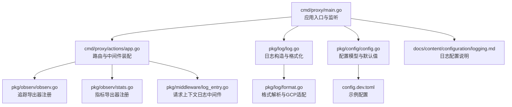
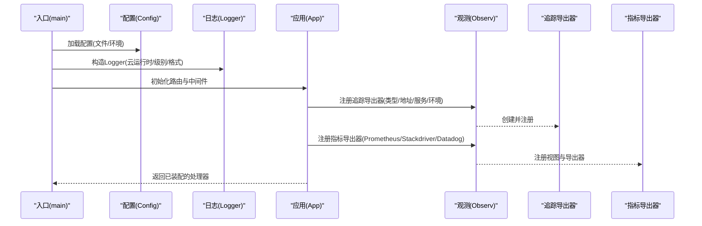
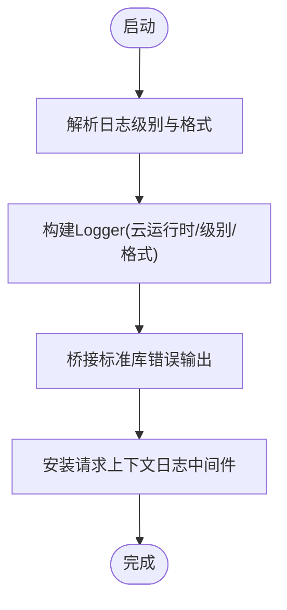
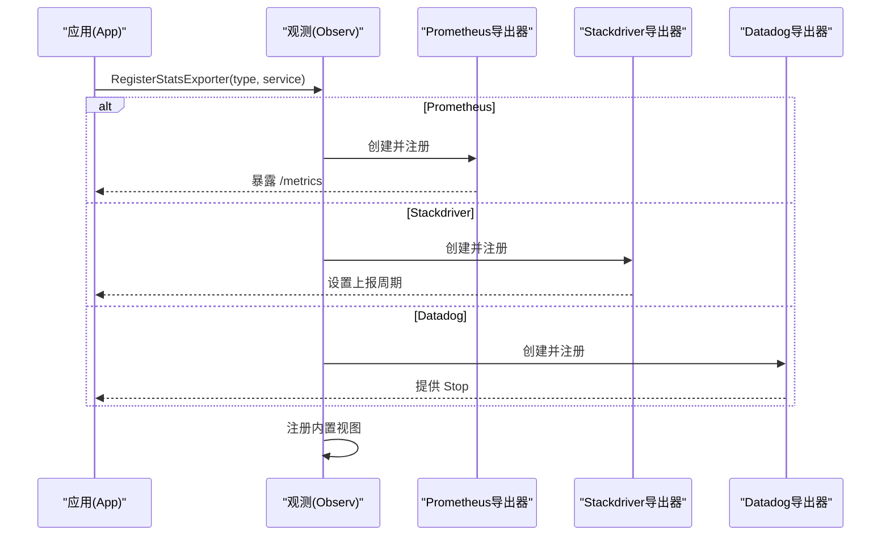
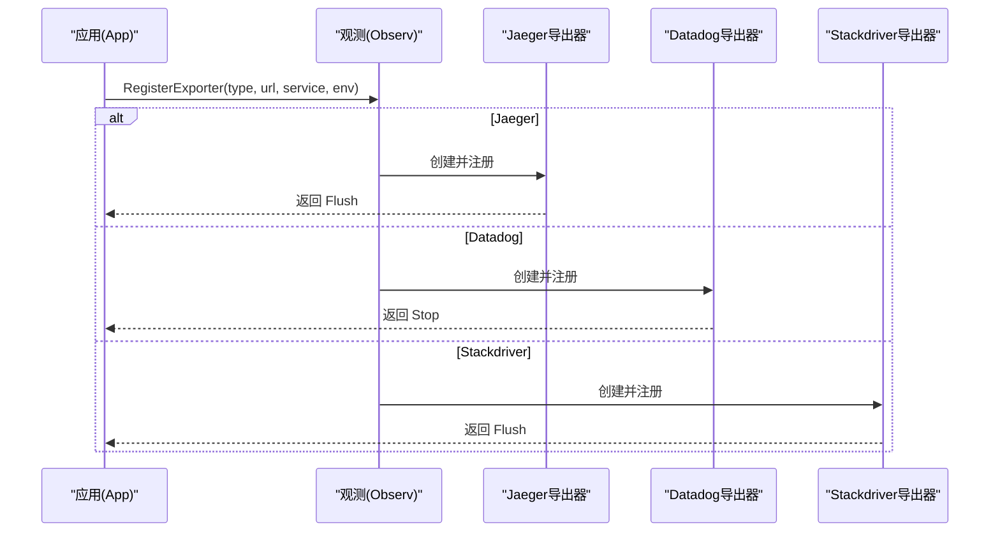
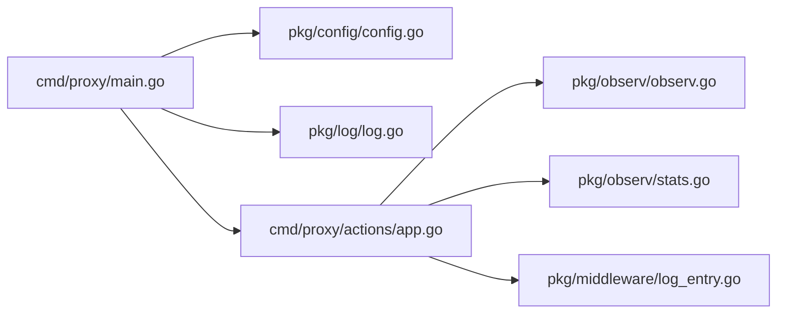

# 监控配置

<cite>
**本文引用的文件**
- [cmd/proxy/main.go](file://cmd/proxy/main.go)
- [cmd/proxy/actions/app.go](file://cmd/proxy/actions/app.go)
- [pkg/config/config.go](file://pkg/config/config.go)
- [config.dev.toml](file://config.dev.toml)
- [pkg/log/log.go](file://pkg/log/log.go)
- [pkg/log/format.go](file://pkg/log/format.go)
- [pkg/log/entry.go](file://pkg/log/entry.go)
- [pkg/middleware/log_entry.go](file://pkg/middleware/log_entry.go)
- [pkg/observ/observ.go](file://pkg/observ/observ.go)
- [pkg/observ/stats.go](file://pkg/observ/stats.go)
- [docs/content/configuration/logging.md](file://docs/content/configuration/logging.md)
</cite>

## 目录
1. [简介](#简介)
2. [项目结构](#项目结构)
3. [核心组件](#核心组件)
4. [架构总览](#架构总览)
5. [组件详解](#组件详解)
6. [依赖关系分析](#依赖关系分析)
7. [性能考量](#性能考量)
8. [故障排除指南](#故障排除指南)
9. [结论](#结论)
10. [附录](#附录)

## 简介
本文件面向运维与开发人员，系统化梳理 Athens 代理的监控配置，覆盖以下方面：
- 日志配置：日志级别、输出格式、云运行时适配、pprof 性能分析端口
- 指标与性能监控：OpenCensus 指标采集、Prometheus 导出器、上报周期与视图
- 分布式追踪：OpenCensus 追踪导出器（Jaeger、Datadog、Stackdriver），采样策略
- 配置示例：如何在配置文件与环境变量中启用各监控项
- 数据收集频率、存储策略与告警建议
- 性能优化、故障排除与最佳实践

## 项目结构
与监控相关的核心位置如下：
- 应用入口与启动：cmd/proxy/main.go
- 应用路由与中间件装配：cmd/proxy/actions/app.go
- 全局配置模型与默认值：pkg/config/config.go、config.dev.toml
- 日志子系统：pkg/log/*、pkg/middleware/log_entry.go
- 观测性（追踪与指标）：pkg/observ/*
- 文档：docs/content/configuration/logging.md

图表来源
- [cmd/proxy/main.go](file://cmd/proxy/main.go#L29-L127)
- [cmd/proxy/actions/app.go](file://cmd/proxy/actions/app.go#L60-L139)
- [pkg/config/config.go](file://pkg/config/config.go#L21-L66)
- [config.dev.toml](file://config.dev.toml#L1-L628)
- [pkg/log/log.go](file://pkg/log/log.go#L13-L27)
- [pkg/log/format.go](file://pkg/log/format.go#L67-L74)
- [pkg/middleware/log_entry.go](file://pkg/middleware/log_entry.go#L14-L29)
- [pkg/observ/observ.go](file://pkg/observ/observ.go#L17-L31)
- [pkg/observ/stats.go](file://pkg/observ/stats.go#L19-L46)
- [docs/content/configuration/logging.md](file://docs/content/configuration/logging.md#L1-L18)

章节来源
- [cmd/proxy/main.go](file://cmd/proxy/main.go#L29-L127)
- [cmd/proxy/actions/app.go](file://cmd/proxy/actions/app.go#L60-L139)
- [pkg/config/config.go](file://pkg/config/config.go#L21-L66)
- [config.dev.toml](file://config.dev.toml#L1-L628)
- [pkg/log/log.go](file://pkg/log/log.go#L13-L27)
- [pkg/log/format.go](file://pkg/log/format.go#L67-L74)
- [pkg/middleware/log_entry.go](file://pkg/middleware/log_entry.go#L14-L29)
- [pkg/observ/observ.go](file://pkg/observ/observ.go#L17-L31)
- [pkg/observ/stats.go](file://pkg/observ/stats.go#L19-L46)
- [docs/content/configuration/logging.md](file://docs/content/configuration/logging.md#L1-L18)

## 核心组件
- 配置模型与默认值
  - 关键字段：日志级别、日志格式、云运行时、pprof 开关与端口、追踪导出器类型与地址、指标导出器类型、服务名等
  - 默认值：日志级别为调试、日志格式为纯文本、指标导出器为 Prometheus、追踪导出器默认未启用
- 日志子系统
  - 基于 logrus 的统一 Logger；支持按云运行时重命名字段；支持纯文本与 JSON 输出；提供带上下文的 Entry 抽象
- 观测性（追踪与指标）
  - 追踪：基于 OpenCensus，支持 Jaeger、Datadog、Stackdriver；开发环境默认全量采样
  - 指标：基于 OpenCensus 视图，内置 HTTP 请求/响应字节数、延迟、状态码分布等；Prometheus 导出器暴露 /metrics；Stackdriver 上报周期可配置

章节来源
- [pkg/config/config.go](file://pkg/config/config.go#L21-L66)
- [pkg/config/config.go](file://pkg/config/config.go#L146-L213)
- [pkg/log/log.go](file://pkg/log/log.go#L13-L27)
- [pkg/log/format.go](file://pkg/log/format.go#L14-L22)
- [pkg/log/format.go](file://pkg/log/format.go#L67-L74)
- [pkg/log/entry.go](file://pkg/log/entry.go#L8-L26)
- [pkg/observ/observ.go](file://pkg/observ/observ.go#L17-L31)
- [pkg/observ/observ.go](file://pkg/observ/observ.go#L60-L65)
- [pkg/observ/stats.go](file://pkg/observ/stats.go#L19-L46)
- [pkg/observ/stats.go](file://pkg/observ/stats.go#L92-L110)

## 架构总览
下图展示监控配置在启动流程中的装配路径与交互。

图表来源
- [cmd/proxy/main.go](file://cmd/proxy/main.go#L35-L62)
- [cmd/proxy/actions/app.go](file://cmd/proxy/actions/app.go#L67-L94)
- [pkg/observ/observ.go](file://pkg/observ/observ.go#L17-L31)
- [pkg/observ/stats.go](file://pkg/observ/stats.go#L19-L46)

章节来源
- [cmd/proxy/main.go](file://cmd/proxy/main.go#L35-L62)
- [cmd/proxy/actions/app.go](file://cmd/proxy/actions/app.go#L67-L94)
- [pkg/observ/observ.go](file://pkg/observ/observ.go#L17-L31)
- [pkg/observ/stats.go](file://pkg/observ/stats.go#L19-L46)

## 组件详解

### 日志配置
- 日志级别与格式
  - 支持通过配置项或环境变量设置日志级别与输出格式
  - 当云运行时为 GCP 时，日志字段会按 GCP 标准重命名以适配平台
  - 开发模式默认纯文本输出，生产模式建议使用 JSON
- 日志输出与标准库桥接
  - 启动时将标准库错误输出桥接到 logrus，确保统一格式
- 日志上下文
  - 中间件在每个请求上下文中注入方法、路径、请求 ID 等字段，便于关联排查

图表来源
- [cmd/proxy/main.go](file://cmd/proxy/main.go#L40-L58)
- [pkg/log/log.go](file://pkg/log/log.go#L13-L27)
- [pkg/log/format.go](file://pkg/log/format.go#L67-L74)
- [pkg/middleware/log_entry.go](file://pkg/middleware/log_entry.go#L14-L29)

章节来源
- [pkg/config/config.go](file://pkg/config/config.go#L30-L31)
- [pkg/config/config.go](file://pkg/config/config.go#L146-L158)
- [pkg/log/log.go](file://pkg/log/log.go#L13-L27)
- [pkg/log/format.go](file://pkg/log/format.go#L14-L22)
- [pkg/log/format.go](file://pkg/log/format.go#L67-L74)
- [pkg/middleware/log_entry.go](file://pkg/middleware/log_entry.go#L14-L29)
- [docs/content/configuration/logging.md](file://docs/content/configuration/logging.md#L10-L17)

### 指标与性能监控
- 指标导出器
  - Prometheus：注册 /metrics 路由，导出内置 HTTP 视图（请求计数、字节数、延迟、状态码分布、客户端指标等）
  - Stackdriver：设置上报周期为 60 秒
  - Datadog：初始化导出器并在停止时清理
- 上报视图
  - 内置注册了 HTTP 服务端与客户端的关键指标视图，无需额外手工定义
- 服务名与命名空间
  - Prometheus 导出器使用服务名为命名空间前缀

图表来源
- [pkg/observ/stats.go](file://pkg/observ/stats.go#L19-L46)
- [pkg/observ/stats.go](file://pkg/observ/stats.go#L48-L63)
- [pkg/observ/stats.go](file://pkg/observ/stats.go#L65-L74)
- [pkg/observ/stats.go](file://pkg/observ/stats.go#L76-L90)
- [pkg/observ/stats.go](file://pkg/observ/stats.go#L92-L110)

章节来源
- [pkg/config/config.go](file://pkg/config/config.go#L38-L38)
- [pkg/config/config.go](file://pkg/config/config.go#L157-L158)
- [pkg/observ/stats.go](file://pkg/observ/stats.go#L19-L46)
- [pkg/observ/stats.go](file://pkg/observ/stats.go#L92-L110)

### 分布式追踪
- 追踪导出器
  - Jaeger：根据 URL 创建导出器并注册；开发环境默认全量采样
  - Datadog：通过地址与服务名创建导出器并注册
  - Stackdriver：通过项目 ID 创建导出器并注册
- 服务名与环境
  - 服务名来自配置；环境用于控制采样策略
- 资源管理
  - 注册导出器后返回 Flush/Stop 函数，在应用关闭时调用以确保数据落盘

图表来源
- [pkg/observ/observ.go](file://pkg/observ/observ.go#L17-L31)
- [pkg/observ/observ.go](file://pkg/observ/observ.go#L33-L58)
- [pkg/observ/observ.go](file://pkg/observ/observ.go#L67-L77)
- [pkg/observ/observ.go](file://pkg/observ/observ.go#L79-L87)
- [pkg/observ/observ.go](file://pkg/observ/observ.go#L60-L65)

章节来源
- [pkg/config/config.go](file://pkg/config/config.go#L36-L37)
- [pkg/config/config.go](file://pkg/config/config.go#L165-L165)
- [pkg/observ/observ.go](file://pkg/observ/observ.go#L17-L31)
- [pkg/observ/observ.go](file://pkg/observ/observ.go#L60-L65)

### 配置示例与环境变量
- 日志
  - 日志级别：LogLevel 或 ATHENS_LOG_LEVEL
  - 日志格式：LogFormat 或 ATHENS_LOG_FORMAT（支持空/“json”/“plain”）
  - 云运行时：CloudRuntime 或 ATHENS_CLOUD_RUNTIME（如 GCP）
- 指标
  - 指标导出器：StatsExporter 或 ATHENS_STATS_EXPORTER（默认 Prometheus）
- 追踪
  - 追踪导出器：TraceExporter 或 ATHENS_TRACE_EXPORTER（支持 jaeger/datadog/stackdriver）
  - 追踪导出器地址：TraceExporterURL 或 ATHENS_TRACE_EXPORTER_URL（如 Jaeger 地址）
- pprof
  - 开关：EnablePprof 或 ATHENS_ENABLE_PPROF
  - 端口：PprofPort 或 ATHENS_PPROF_PORT

章节来源
- [pkg/config/config.go](file://pkg/config/config.go#L29-L39)
- [pkg/config/config.go](file://pkg/config/config.go#L146-L158)
- [config.dev.toml](file://config.dev.toml#L76-L84)
- [config.dev.toml](file://config.dev.toml#L218-L234)
- [config.dev.toml](file://config.dev.toml#L91-L97)

## 依赖关系分析
- 启动阶段
  - main 加载配置并构造 Logger，随后装配 App
- App 阶段
  - 注册追踪导出器与指标导出器，并将处理链包裹为 HTTP Handler
- 日志中间件
  - 在请求进入时注入上下文日志条目，贯穿后续处理

图表来源
- [cmd/proxy/main.go](file://cmd/proxy/main.go#L35-L62)
- [cmd/proxy/actions/app.go](file://cmd/proxy/actions/app.go#L67-L94)
- [pkg/config/config.go](file://pkg/config/config.go#L21-L66)
- [pkg/log/log.go](file://pkg/log/log.go#L13-L27)
- [pkg/observ/observ.go](file://pkg/observ/observ.go#L17-L31)
- [pkg/observ/stats.go](file://pkg/observ/stats.go#L19-L46)
- [pkg/middleware/log_entry.go](file://pkg/middleware/log_entry.go#L14-L29)

章节来源
- [cmd/proxy/main.go](file://cmd/proxy/main.go#L35-L62)
- [cmd/proxy/actions/app.go](file://cmd/proxy/actions/app.go#L67-L94)
- [pkg/middleware/log_entry.go](file://pkg/middleware/log_entry.go#L14-L29)

## 性能考量
- 指标上报周期
  - Stackdriver 上报周期默认 60 秒，可根据平台与成本需求调整
- 采样策略
  - 开发环境默认全量采样，生产环境建议结合追踪系统能力设置合理采样率
- pprof 安全
  - pprof 独立端口暴露，仅在需要时开启，避免对外暴露造成性能影响或安全风险
- 日志开销
  - 生产环境建议使用 JSON 格式并配合外部日志收集系统，避免过多字段导致日志体积膨胀

章节来源
- [pkg/observ/stats.go](file://pkg/observ/stats.go#L87-L87)
- [pkg/observ/observ.go](file://pkg/observ/observ.go#L62-L64)
- [cmd/proxy/main.go](file://cmd/proxy/main.go#L69-L77)
- [pkg/log/format.go](file://pkg/log/format.go#L14-L22)

## 故障排除指南
- 日志无法输出或格式异常
  - 检查日志级别与格式配置是否正确
  - 若在 GCP 运行时，请确认字段映射是否按预期
- 指标未上报
  - 确认指标导出器类型与服务名配置正确
  - Prometheus：检查 /metrics 路由是否可达
  - Stackdriver：确认项目 ID 与上报周期
- 追踪未导出
  - 确认追踪导出器类型与地址配置正确
  - 开发环境默认全量采样，若未看到数据，检查导出器初始化是否成功
- pprof 无法访问
  - 确认 pprof 已启用且端口未冲突
- 日志上下文缺失
  - 检查是否正确安装请求上下文日志中间件

章节来源
- [pkg/observ/stats.go](file://pkg/observ/stats.go#L36-L46)
- [pkg/observ/observ.go](file://pkg/observ/observ.go#L26-L31)
- [cmd/proxy/main.go](file://cmd/proxy/main.go#L69-L77)
- [pkg/middleware/log_entry.go](file://pkg/middleware/log_entry.go#L14-L29)

## 结论
本文件从配置模型、日志、指标与追踪三方面梳理了 Athens 的监控能力。通过合理的配置与最佳实践，可在不同环境中获得一致可观测性体验，并为后续扩展与告警打下基础。

## 附录

### 配置项速查表
- 日志
  - 日志级别：LogLevel / ATHENS_LOG_LEVEL
  - 日志格式：LogFormat / ATHENS_LOG_FORMAT
  - 云运行时：CloudRuntime / ATHENS_CLOUD_RUNTIME
- 指标
  - 指标导出器：StatsExporter / ATHENS_STATS_EXPORTER
- 追踪
  - 追踪导出器：TraceExporter / ATHENS_TRACE_EXPORTER
  - 追踪导出器地址：TraceExporterURL / ATHENS_TRACE_EXPORTER_URL
- pprof
  - 开关：EnablePprof / ATHENS_ENABLE_PPROF
  - 端口：PprofPort / ATHENS_PPROF_PORT

章节来源
- [pkg/config/config.go](file://pkg/config/config.go#L29-L39)
- [pkg/config/config.go](file://pkg/config/config.go#L146-L158)
- [config.dev.toml](file://config.dev.toml#L76-L84)
- [config.dev.toml](file://config.dev.toml#L218-L234)
- [config.dev.toml](file://config.dev.toml#L91-L97)