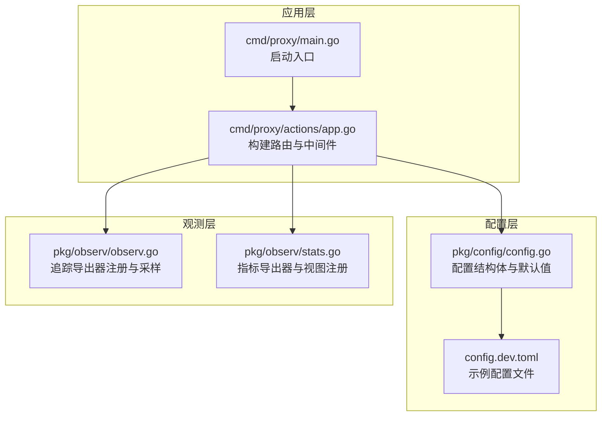
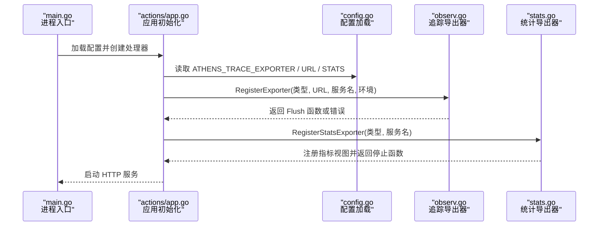
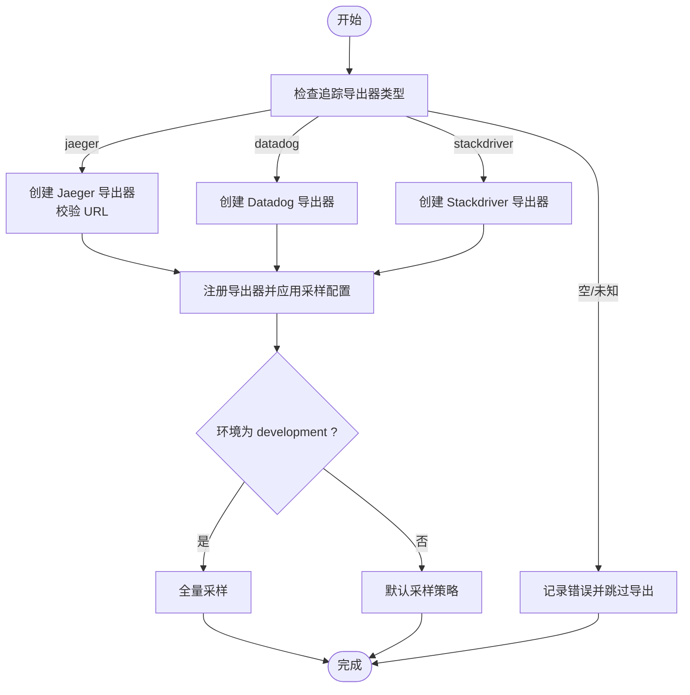
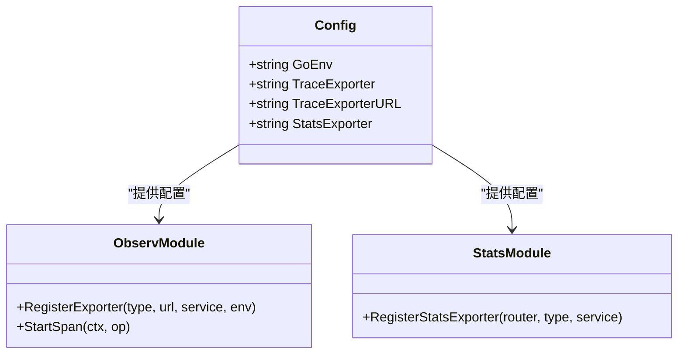
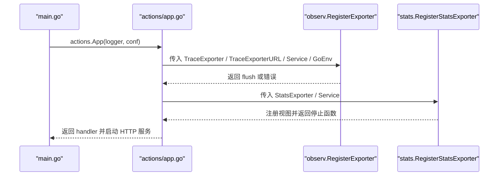
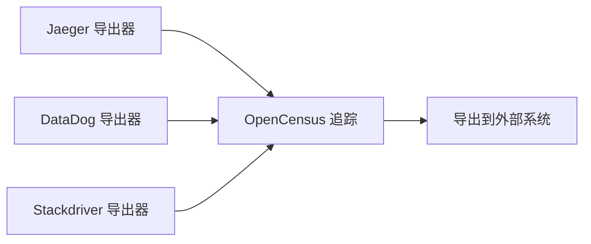
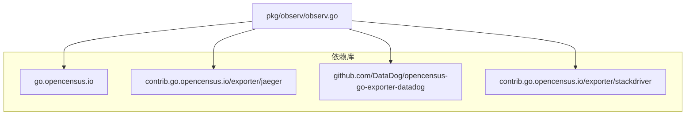

# 追踪配置

<cite>
**本文引用的文件**
- [pkg/observ/observ.go](file://pkg/observ/observ.go)
- [pkg/observ/stats.go](file://pkg/observ/stats.go)
- [pkg/config/config.go](file://pkg/config/config.go)
- [cmd/proxy/actions/app.go](file://cmd/proxy/actions/app.go)
- [cmd/proxy/main.go](file://cmd/proxy/main.go)
- [config.dev.toml](file://config.dev.toml)
- [go.mod](file://go.mod)
</cite>

## 目录
1. [简介](#简介)
2. [项目结构](#项目结构)
3. [核心组件](#核心组件)
4. [架构总览](#架构总览)
5. [详细组件分析](#详细组件分析)
6. [依赖关系分析](#依赖关系分析)
7. [性能考量](#性能考量)
8. [故障排查指南](#故障排查指南)
9. [结论](#结论)
10. [附录](#附录)

## 简介
本文件系统性说明 Athens 的追踪配置与实现，涵盖以下内容：
- 追踪导出器类型与环境变量配置（ATHENS_TRACE_EXPORTER、ATHENS_TRACE_EXPORTER_URL）
- 采样策略与默认行为（开发环境全量采样）
- 与 Jaeger、Zipkin、DataDog、Stackdriver 等系统的集成方式与差异
- 分布式追踪与性能分析的配置示例
- 追踪数据的采集、存储与查询路径
- 性能影响、隐私考虑与最佳实践

## 项目结构
追踪能力由观测模块提供，并在应用启动时根据配置注册导出器；统计指标通过独立的统计导出器模块进行采集与暴露。

**图表来源**
- [cmd/proxy/main.go](file://cmd/proxy/main.go#L29-L128)
- [cmd/proxy/actions/app.go](file://cmd/proxy/actions/app.go#L46-L84)
- [pkg/config/config.go](file://pkg/config/config.go#L22-L66)
- [config.dev.toml](file://config.dev.toml#L218-L229)
- [pkg/observ/observ.go](file://pkg/observ/observ.go#L14-L65)
- [pkg/observ/stats.go](file://pkg/observ/stats.go#L17-L46)

**章节来源**
- [cmd/proxy/main.go](file://cmd/proxy/main.go#L29-L128)
- [cmd/proxy/actions/app.go](file://cmd/proxy/actions/app.go#L46-L84)
- [pkg/config/config.go](file://pkg/config/config.go#L22-L66)
- [config.dev.toml](file://config.dev.toml#L218-L229)

## 核心组件
- 追踪导出器注册：根据环境变量选择导出目标（jaeger、datadog、stackdriver），并在开发环境应用全量采样。
- 统计导出器：支持 Prometheus、DataDog、Stackdriver，注册常用 HTTP 指标视图。
- 配置项：ATHENS_TRACE_EXPORTER、ATHENS_TRACE_EXPORTER_URL、ATHENS_STATS_EXPORTER。
- 启动流程：应用启动时加载配置，注册追踪与统计导出器，错误时记录但不影响服务运行。

**章节来源**
- [pkg/observ/observ.go](file://pkg/observ/observ.go#L14-L65)
- [pkg/observ/stats.go](file://pkg/observ/stats.go#L17-L46)
- [pkg/config/config.go](file://pkg/config/config.go#L36-L37)
- [cmd/proxy/actions/app.go](file://cmd/proxy/actions/app.go#L74-L84)

## 架构总览
下图展示从应用启动到追踪导出的关键交互：

**图表来源**
- [cmd/proxy/main.go](file://cmd/proxy/main.go#L35-L62)
- [cmd/proxy/actions/app.go](file://cmd/proxy/actions/app.go#L74-L84)
- [pkg/config/config.go](file://pkg/config/config.go#L257-L273)
- [pkg/observ/observ.go](file://pkg/observ/observ.go#L14-L65)
- [pkg/observ/stats.go](file://pkg/observ/stats.go#L17-L46)

## 详细组件分析

### 追踪导出器与采样策略
- 支持导出器类型：jaeger、datadog、stackdriver；未指定或不支持时记录错误但不中断服务。
- 开发环境默认全量采样，生产环境默认按 OpenCensus 默认策略采样。
- Jaeger 导出器需要提供导出端点 URL；若为空则报错并跳过导出。
- Datadog 与 Stackdriver 导出器分别通过地址与项目 ID 初始化。

**图表来源**
- [pkg/observ/observ.go](file://pkg/observ/observ.go#L14-L65)

**章节来源**
- [pkg/observ/observ.go](file://pkg/observ/observ.go#L14-L65)

### 配置参数与默认值
- 追踪导出器类型：ATHENS_TRACE_EXPORTER（可选值：jaeger、datadog、stackdriver）
- 追踪导出端点：ATHENS_TRACE_EXPORTER_URL（Jaeger 端点 URL；Stackdriver 使用项目 ID）
- 统计导出器：ATHENS_STATS_EXPORTER（可选值：prometheus；其他类型在统计模块中支持）
- 默认值：示例配置文件中默认追踪导出器为空字符串，便于按需启用。

**图表来源**
- [pkg/config/config.go](file://pkg/config/config.go#L22-L66)
- [pkg/observ/observ.go](file://pkg/observ/observ.go#L14-L31)
- [pkg/observ/stats.go](file://pkg/observ/stats.go#L17-L46)

**章节来源**
- [pkg/config/config.go](file://pkg/config/config.go#L36-L37)
- [pkg/config/config.go](file://pkg/config/config.go#L146-L173)
- [config.dev.toml](file://config.dev.toml#L218-L229)

### 应用启动与导出器注册流程
- main 加载配置并创建日志器与处理器。
- actions 在构建路由前调用 RegisterExporter，传入导出器类型、URL、服务名与环境变量。
- 若导出器创建失败，记录信息但继续启动；成功则在应用退出时调用返回的 Flush/Stop 函数。

**图表来源**
- [cmd/proxy/main.go](file://cmd/proxy/main.go#L35-L62)
- [cmd/proxy/actions/app.go](file://cmd/proxy/actions/app.go#L74-L84)
- [pkg/observ/observ.go](file://pkg/observ/observ.go#L14-L31)
- [pkg/observ/stats.go](file://pkg/observ/stats.go#L17-L46)

**章节来源**
- [cmd/proxy/main.go](file://cmd/proxy/main.go#L35-L62)
- [cmd/proxy/actions/app.go](file://cmd/proxy/actions/app.go#L74-L84)

### 与 Jaeger、Zipkin、DataDog、Stackdriver 的集成
- Jaeger：通过 ATHENS_TRACE_EXPORTER_URL 指定端点；内部以固定服务名与标签注册导出器；开发环境全量采样。
- Zipkin：当前代码未直接实现 Zipkin 导出器；如需集成，可在 RegisterExporter 中扩展分支并添加相应依赖。
- DataDog：通过 TraceAddr 与服务名初始化导出器；与 OpenCensus 集成。
- Stackdriver：通过项目 ID 初始化导出器；适用于 GCP 环境。

**图表来源**
- [pkg/observ/observ.go](file://pkg/observ/observ.go#L14-L87)
- [go.mod](file://go.mod#L7-L9)

**章节来源**
- [pkg/observ/observ.go](file://pkg/observ/observ.go#L14-L87)
- [go.mod](file://go.mod#L7-L9)

### 分布式追踪与性能分析配置示例
- 开启 Jaeger 追踪：设置 ATHENS_TRACE_EXPORTER=jaeger，ATHENS_TRACE_EXPORTER_URL 指向 Jaeger Collector 端点。
- 开启 DataDog 追踪：设置 ATHENS_TRACE_EXPORTER=datadog，ATHENS_TRACE_EXPORTER_URL 指向 Datadog Agent 地址。
- 开启 Stackdriver 追踪：设置 ATHENS_TRACE_EXPORTER=stackdriver，ATHENS_TRACE_EXPORTER_URL 为 GCP 项目 ID。
- 开启 Prometheus 指标：设置 ATHENS_STATS_EXPORTER=prometheus，访问 /metrics 获取指标。

提示：示例配置文件中已给出默认追踪导出器为空，便于按需启用。

**章节来源**
- [config.dev.toml](file://config.dev.toml#L218-L229)
- [pkg/config/config.go](file://pkg/config/config.go#L146-L173)
- [pkg/observ/stats.go](file://pkg/observ/stats.go#L48-L63)

### 追踪数据的收集、存储与查询
- 收集：OpenCensus 在应用中生成 Span，按配置注册导出器。
- 存储：由外部系统负责存储（如 Jaeger、DataDog、Stackdriver）。
- 查询：通过对应系统的 Web UI 或 API 查询链路与指标。

注意：当前代码未内置追踪数据持久化逻辑，导出器仅负责上报。

**章节来源**
- [pkg/observ/observ.go](file://pkg/observ/observ.go#L14-L65)
- [pkg/observ/stats.go](file://pkg/observ/stats.go#L17-L46)

## 依赖关系分析
- 观测模块依赖 OpenCensus 及各导出器库；示例依赖来自 go.mod。
- 应用通过 actions 在启动阶段注册导出器，main 负责服务生命周期管理。

**图表来源**
- [go.mod](file://go.mod#L7-L9)
- [pkg/observ/observ.go](file://pkg/observ/observ.go#L3-L12)

**章节来源**
- [go.mod](file://go.mod#L7-L9)
- [pkg/observ/observ.go](file://pkg/observ/observ.go#L3-L12)

## 性能考量
- 采样策略：开发环境全量采样便于调试，生产环境默认采样以降低开销。
- 导出器开销：网络传输与序列化会带来额外 CPU 与带宽消耗，建议在高流量场景谨慎开启或限制采样率。
- 上游依赖：Jaeger/Agent/Stackdriver 等外部系统稳定性直接影响导出成功率与延迟。

[本节为通用指导，无需特定文件引用]

## 故障排查指南
- 导出器未指定：返回错误提示“未指定导出器”，服务仍可运行。
- 导出器 URL 为空（Jaeger）：返回错误提示“导出器 URL 为空”，跳过导出。
- 不支持的导出器类型：返回错误提示“不支持的导出器类型”，请确认拼写或扩展支持。
- 开发环境无采样：若期望在开发环境减少采样，可在配置中调整环境变量或自定义采样策略。

**章节来源**
- [pkg/observ/observ.go](file://pkg/observ/observ.go#L17-L30)
- [pkg/observ/observ.go](file://pkg/observ/observ.go#L36-L40)

## 结论
- 追踪配置通过环境变量灵活控制，支持多种外部系统导出。
- 开发环境默认全量采样，生产环境采用默认采样策略，兼顾可观测性与性能。
- 建议在生产环境中结合业务流量与资源情况评估采样率与导出频率，避免对性能造成显著影响。

[本节为总结性内容，无需特定文件引用]

## 附录

### 关键配置项速查
- ATHENS_TRACE_EXPORTER：追踪导出器类型（jaeger、datadog、stackdriver）
- ATHENS_TRACE_EXPORTER_URL：导出端点（Jaeger 端点 URL；Stackdriver 项目 ID）
- ATHENS_STATS_EXPORTER：统计导出器类型（prometheus 等）

**章节来源**
- [pkg/config/config.go](file://pkg/config/config.go#L36-L37)
- [config.dev.toml](file://config.dev.toml#L218-L229)