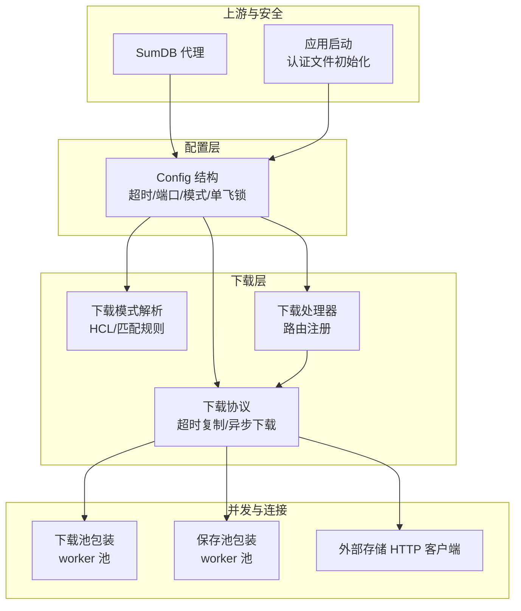
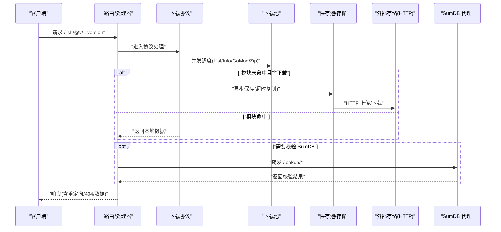
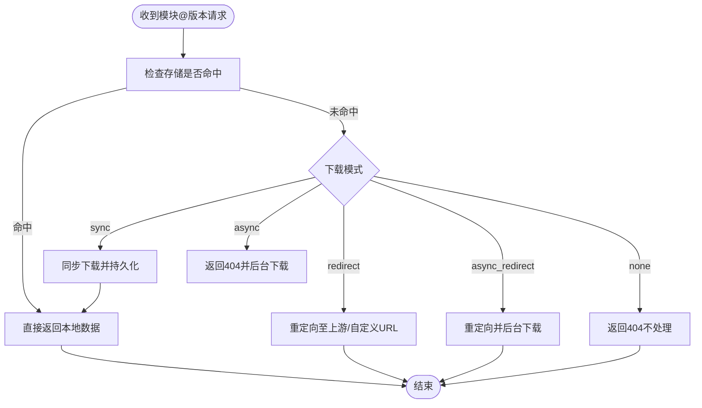
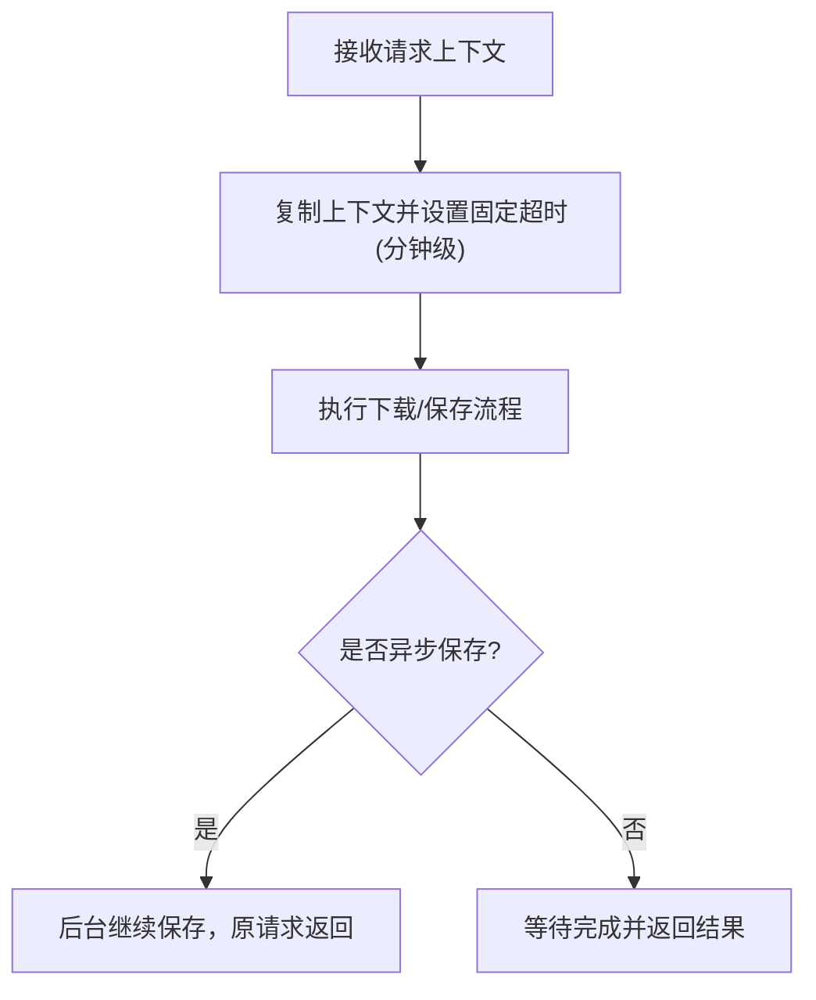
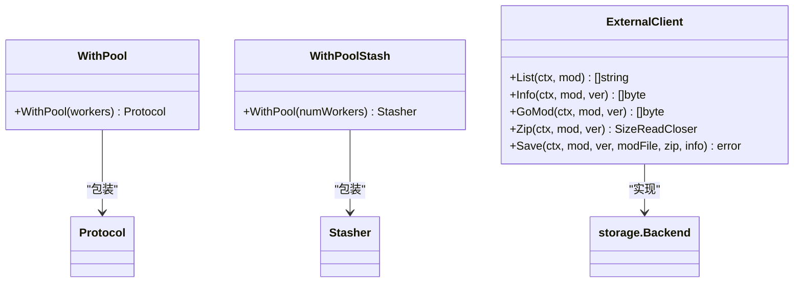
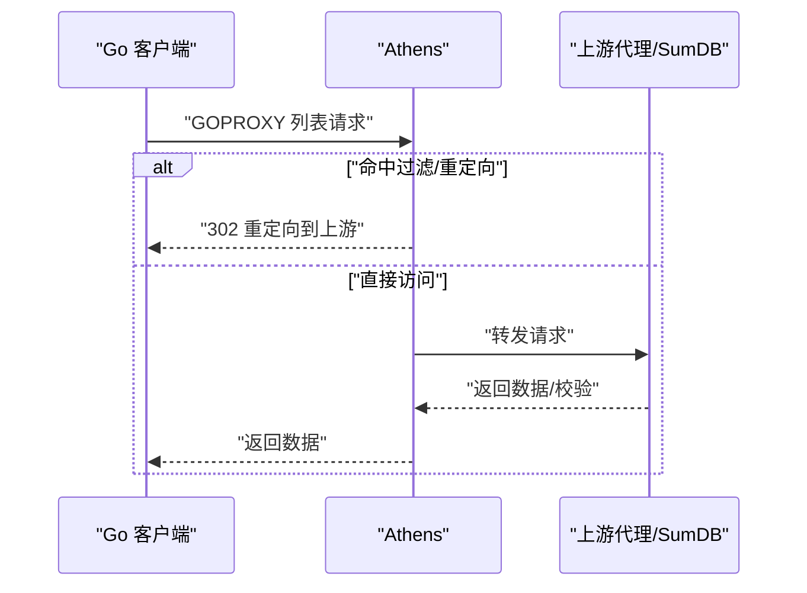
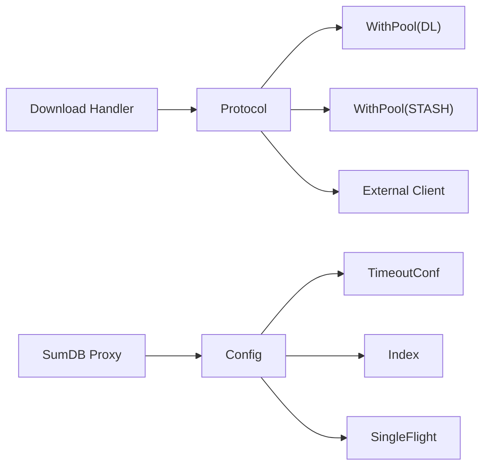

# 网络配置

<cite>
**本文引用的文件**
- [pkg/config/config.go](file://pkg/config/config.go)
- [pkg/config/timeout.go](file://pkg/config/timeout.go)
- [pkg/config/index.go](file://pkg/config/index.go)
- [pkg/config/singleflight.go](file://pkg/config/singleflight.go)
- [pkg/download/mode/mode.go](file://pkg/download/mode/mode.go)
- [pkg/download/addons/with_pool.go](file://pkg/download/addons/with_pool.go)
- [pkg/stash/with_pool.go](file://pkg/stash/with_pool.go)
- [pkg/download/protocol.go](file://pkg/download/protocol.go)
- [pkg/download/handler.go](file://pkg/download/handler.go)
- [pkg/module/go_get_fetcher.go](file://pkg/module/go_get_fetcher.go)
- [pkg/storage/external/client.go](file://pkg/storage/external/client.go)
- [cmd/proxy/actions/app.go](file://cmd/proxy/actions/app.go)
- [cmd/proxy/actions/sumdb.go](file://cmd/proxy/actions/sumdb.go)
- [scripts/liveness_probe/main.go](file://scripts/liveness_probe/main.go)
- [config.dev.toml](file://config.dev.toml)
- [config.devh.toml](file://config.devh.toml)
- [docs/content/configuration/download.md](file://docs/content/configuration/download.md)
</cite>

## 目录
1. [简介](#简介)
2. [项目结构](#项目结构)
3. [核心组件](#核心组件)
4. [架构总览](#架构总览)
5. [详细组件分析](#详细组件分析)
6. [依赖关系分析](#依赖关系分析)
7. [性能考量](#性能考量)
8. [故障排查指南](#故障排查指南)
9. [结论](#结论)
10. [附录](#附录)

## 简介
本章节面向需要在企业内网、代理环境或高延迟网络下稳定运行 Athens 的运维与开发人员，系统化梳理网络相关配置参数与实现机制，包括下载模式、网络模式、超时设置、代理配置、HTTP 客户端与连接池、负载均衡策略、性能优化、故障恢复与安全注意事项，并提供可操作的配置示例与调试方法。

## 项目结构
围绕网络配置的关键模块分布如下：
- 配置加载与默认值：pkg/config
- 下载模式与行为控制：pkg/download/mode
- 请求并发与连接池包装：pkg/download/addons 与 pkg/stash
- 下载协议与路由：pkg/download
- 外部存储 HTTP 客户端：pkg/storage/external
- 上游 SumDB 代理：cmd/proxy/actions/sumdb.go
- 启动与认证初始化：cmd/proxy/actions/app.go
- 示例配置：config.dev.toml、config.devh.toml
- 文档：docs/content/configuration/download.md

**图表来源**
- [pkg/config/config.go](file://pkg/config/config.go#L22-L66)
- [pkg/download/mode/mode.go](file://pkg/download/mode/mode.go#L34-L46)
- [pkg/download/handler.go](file://pkg/download/handler.go#L41-L57)
- [pkg/download/protocol.go](file://pkg/download/protocol.go#L253-L306)
- [pkg/download/addons/with_pool.go](file://pkg/download/addons/with_pool.go#L27-L35)
- [pkg/stash/with_pool.go](file://pkg/stash/with_pool.go#L20-L29)
- [pkg/storage/external/client.go](file://pkg/storage/external/client.go#L24-L30)
- [cmd/proxy/actions/sumdb.go](file://cmd/proxy/actions/sumdb.go#L12-L23)
- [cmd/proxy/actions/app.go](file://cmd/proxy/actions/app.go#L23-L44)

**章节来源**
- [pkg/config/config.go](file://pkg/config/config.go#L22-L66)
- [config.dev.toml](file://config.dev.toml#L116-L120)
- [config.devh.toml](file://config.devh.toml#L118-L121)

## 核心组件
- 配置中心（Config）：统一承载超时、端口、网络模式、下载模式、单飞锁、索引与存储等网络相关参数；支持从 TOML 文件与环境变量加载与覆盖。
- 下载模式（DownloadFile/Mode）：通过 HCL 文件定义“当模块未命中存储时”的行为（同步/异步/重定向/无），并支持按路径模式覆盖。
- 下载协议（Protocol）：封装下载流程，内置针对长时间下载任务的上下文超时复制与异步落盘策略。
- 并发与连接池（WithPool）：为 List/Info/GoMod/Zip 等操作提供 worker 池，降低并发竞争与资源消耗。
- 外部存储 HTTP 客户端：封装对外部存储服务的 GET/POST/DELETE 请求，支持 Content-Length 解析与错误码处理。
- 上游 SumDB 代理：反向代理 SumDB 请求，支持基于模式的 GONOSUMDB 行为。
- 应用启动与认证：在启动阶段根据配置初始化 .netrc/.hgrc，保障访问私有仓库的凭据注入。

**章节来源**
- [pkg/config/config.go](file://pkg/config/config.go#L22-L66)
- [pkg/download/mode/mode.go](file://pkg/download/mode/mode.go#L34-L46)
- [pkg/download/protocol.go](file://pkg/download/protocol.go#L253-L306)
- [pkg/download/addons/with_pool.go](file://pkg/download/addons/with_pool.go#L27-L35)
- [pkg/stash/with_pool.go](file://pkg/stash/with_pool.go#L20-L29)
- [pkg/storage/external/client.go](file://pkg/storage/external/client.go#L24-L30)
- [cmd/proxy/actions/sumdb.go](file://cmd/proxy/actions/sumdb.go#L12-L23)
- [cmd/proxy/actions/app.go](file://cmd/proxy/actions/app.go#L23-L44)

## 架构总览
下图展示从客户端请求到下载与存储的网络路径，以及关键的超时与并发控制点。

**图表来源**
- [pkg/download/handler.go](file://pkg/download/handler.go#L41-L57)
- [pkg/download/protocol.go](file://pkg/download/protocol.go#L253-L306)
- [pkg/download/addons/with_pool.go](file://pkg/download/addons/with_pool.go#L49-L128)
- [pkg/stash/with_pool.go](file://pkg/stash/with_pool.go#L43-L60)
- [pkg/storage/external/client.go](file://pkg/storage/external/client.go#L158-L190)
- [cmd/proxy/actions/sumdb.go](file://cmd/proxy/actions/sumdb.go#L12-L23)

## 详细组件分析

### 下载模式与网络模式
- 下载模式（DownloadMode）：支持 sync/async/redirect/async_redirect/none，以及基于 HCL 的路径模式覆盖；可结合 DownloadURL 控制重定向目标。
- 网络模式（NetworkMode）：strict/offline/fallback，影响 /list 合并策略与错误传播行为，提升内网离线场景的稳定性。

**图表来源**
- [pkg/download/mode/mode.go](file://pkg/download/mode/mode.go#L76-L82)
- [docs/content/configuration/download.md](file://docs/content/configuration/download.md#L29-L33)
- [config.dev.toml](file://config.dev.toml#L250-L283)

**章节来源**
- [pkg/download/mode/mode.go](file://pkg/download/mode/mode.go#L34-L46)
- [docs/content/configuration/download.md](file://docs/content/configuration/download.md#L16-L74)
- [config.dev.toml](file://config.dev.toml#L250-L283)

### 超时设置与上下文复制
- 全局超时（TimeoutConf.Timeout）：作为默认外部网络调用超时基准，单位秒。
- 协议层超时复制：针对长时间下载（如 go mod download），协议内部创建带固定超时的新上下文，避免请求完成导致的上下文取消，确保异步落盘流程持续进行。

**图表来源**
- [pkg/config/timeout.go](file://pkg/config/timeout.go#L6-L18)
- [pkg/download/protocol.go](file://pkg/download/protocol.go#L301-L306)

**章节来源**
- [pkg/config/timeout.go](file://pkg/config/timeout.go#L6-L18)
- [pkg/download/protocol.go](file://pkg/download/protocol.go#L253-L306)

### HTTP 客户端与连接池
- 外部存储 HTTP 客户端：封装 GET/POST/DELETE 请求，自动解析 Content-Length，统一错误处理；支持传入自定义 *http.Client。
- 下载池与保存池：通过 WithPool 包装协议与保存器，将 List/Info/GoMod/Zip 等方法转为工作池执行，减少并发竞争与资源争用。
- Go 命令行工具：通过 go mod download 获取模块，使用 GOPROXY/GOPRIVATE 等环境变量控制上游与私有仓库访问。

**图表来源**
- [pkg/download/addons/with_pool.go](file://pkg/download/addons/with_pool.go#L27-L35)
- [pkg/stash/with_pool.go](file://pkg/stash/with_pool.go#L20-L29)
- [pkg/storage/external/client.go](file://pkg/storage/external/client.go#L24-L30)

**章节来源**
- [pkg/storage/external/client.go](file://pkg/storage/external/client.go#L158-L190)
- [pkg/download/addons/with_pool.go](file://pkg/download/addons/with_pool.go#L49-L128)
- [pkg/stash/with_pool.go](file://pkg/stash/with_pool.go#L43-L60)
- [pkg/module/go_get_fetcher.go](file://pkg/module/go_get_fetcher.go#L118-L163)

### 上游与代理配置
- GOPROXY/GOPRIVATE：通过 GoBinaryEnvVars 注入，控制 go 命令的上游代理与私有仓库访问。
- GlobalEndpoint/FilterFile：用于将未命中的模块请求重定向到上游代理（如 proxy.golang.org）。
- SumDB 代理：反向代理 /lookup/*，支持基于模式的 GONOSUMDB 行为。

**图表来源**
- [config.dev.toml](file://config.dev.toml#L18-L46)
- [config.dev.toml](file://config.dev.toml#L145-L153)
- [cmd/proxy/actions/sumdb.go](file://cmd/proxy/actions/sumdb.go#L12-L23)

**章节来源**
- [config.dev.toml](file://config.dev.toml#L18-L46)
- [config.dev.toml](file://config.dev.toml#L145-L153)
- [cmd/proxy/actions/sumdb.go](file://cmd/proxy/actions/sumdb.go#L12-L23)

### 单飞锁与分布式一致性
- SingleFlight 支持 memory/etcd/redis/redis-sentinel/gcp/azureblob 等后端，避免并发写入同一模块导致的数据竞争。
- Redis 锁配置包含 TTL/Timeout/MaxRetries 等参数，可按环境调优。

**章节来源**
- [pkg/config/singleflight.go](file://pkg/config/singleflight.go#L6-L11)
- [pkg/config/singleflight.go](file://pkg/config/singleflight.go#L39-L53)
- [config.dev.toml](file://config.dev.toml#L290-L315)

### 端口、Unix Socket 与 TLS
- 端口与 Unix Socket：支持 TCP 端口与 Unix Domain Socket 二选一监听；端口可由 ATHENS_PORT 或 PORT 覆盖。
- TLS：通过 TLSCertFile/TLSKeyFile 启用 HTTPS。

**章节来源**
- [config.dev.toml](file://config.dev.toml#L134-L143)
- [config.devh.toml](file://config.devh.toml#L118-L127)
- [cmd/proxy/actions/app.go](file://cmd/proxy/actions/app.go#L23-L44)

## 依赖关系分析
- 配置层依赖：Config 组合 TimeoutConf、Index、SingleFlight 等子配置。
- 下载层依赖：Handler 注册路由，Protocol 实现下载流程，WithPool 包装并发。
- 外部依赖：外部存储 HTTP 客户端依赖标准库 http；Go 命令行工具依赖 GOPROXY/GOPRIVATE 环境变量。
- 上游依赖：SumDB 代理依赖 httputil.ReverseProxy。

**图表来源**
- [pkg/config/config.go](file://pkg/config/config.go#L22-L66)
- [pkg/config/timeout.go](file://pkg/config/timeout.go#L6-L18)
- [pkg/download/handler.go](file://pkg/download/handler.go#L41-L57)
- [pkg/download/addons/with_pool.go](file://pkg/download/addons/with_pool.go#L27-L35)
- [pkg/storage/external/client.go](file://pkg/storage/external/client.go#L24-L30)
- [cmd/proxy/actions/sumdb.go](file://cmd/proxy/actions/sumdb.go#L12-L23)

**章节来源**
- [pkg/config/config.go](file://pkg/config/config.go#L22-L66)
- [pkg/download/handler.go](file://pkg/download/handler.go#L41-L57)

## 性能考量
- 并发控制
  - 使用 WithPool 对 List/Info/GoMod/Zip 等操作进行工作池化，避免高并发下的资源争用。
  - Protocol 层对长时间下载采用独立超时上下文，保证异步落盘的连续性。
- 超时与重试
  - 全局超时（Timeout）与协议层超时复制相结合，避免请求完成导致的提前取消。
  - Redis 锁的 TTL/Timeout/MaxRetries 可按网络状况调优，降低锁竞争与抖动。
- 存储与网络
  - 外部存储 HTTP 客户端解析 Content-Length，便于监控与限速；建议在高延迟网络下调小并发或增加超时。
- 上游代理
  - 通过 GOPROXY/GOPRIVATE 与 GlobalEndpoint/FilterFile 将未命中模块重定向至可靠上游，减少本地压力。

**章节来源**
- [pkg/download/addons/with_pool.go](file://pkg/download/addons/with_pool.go#L49-L128)
- [pkg/stash/with_pool.go](file://pkg/stash/with_pool.go#L43-L60)
- [pkg/download/protocol.go](file://pkg/download/protocol.go#L253-L306)
- [pkg/config/singleflight.go](file://pkg/config/singleflight.go#L39-L53)
- [pkg/storage/external/client.go](file://pkg/storage/external/client.go#L182-L188)
- [config.dev.toml](file://config.dev.toml#L18-L46)

## 故障排查指南
- 健康探针
  - 使用 liveness_probe 检查 GOPROXY 指向的 Athens 是否可达，超时默认 1 分钟，请求超时 5 秒。
- 日志与追踪
  - 通过 LogLevel/LogFormat/CloudRuntime 控制日志输出；开启 pprof 与统计导出器便于性能分析。
- 认证问题
  - 启动时根据配置初始化 .netrc/.hgrc，避免访问私有仓库失败。
- 上游限流
  - 当 go 命令返回 GitHub 限流错误时，协议层识别并返回速率限制错误类型，便于前端或客户端处理。

**章节来源**
- [scripts/liveness_probe/main.go](file://scripts/liveness_probe/main.go#L17-L59)
- [cmd/proxy/actions/app.go](file://cmd/proxy/actions/app.go#L23-L44)
- [pkg/module/go_get_fetcher.go](file://pkg/module/go_get_fetcher.go#L148-L151)
- [config.dev.toml](file://config.dev.toml#L91-L98)

## 结论
通过将下载模式、网络模式、超时策略、并发池化与上游代理有机结合，Athens 能够在复杂网络环境下提供稳定、可控且可扩展的模块代理能力。建议在生产环境中结合实际网络条件调整超时、并发与锁参数，并通过健康探针与日志监控持续优化。

## 附录

### 配置参数清单与说明
- 超时（Timeout）：全局外部网络调用超时（秒）
- 端口（Port/UnixSocket）：监听端口或 Unix 域套接字
- TLS（TLSCertFile/TLSKeyFile）：启用 HTTPS
- 下载模式（DownloadMode/DownloadURL）：未命中时的行为与重定向地址
- 网络模式（NetworkMode）：/list 合并策略
- 单飞锁（SingleFlightType/Redis/Etcd/GCP）：并发写入保护
- 上游（GlobalEndpoint/FilterFile/GOPROXY/GOPRIVATE）：未命中时的上游代理
- 并发（GoGetWorkers/ProtocolWorkers）：Go 命令并发与协议处理并发

**章节来源**
- [pkg/config/timeout.go](file://pkg/config/timeout.go#L6-L18)
- [config.dev.toml](file://config.dev.toml#L116-L120)
- [config.dev.toml](file://config.dev.toml#L134-L143)
- [config.dev.toml](file://config.dev.toml#L250-L283)
- [config.dev.toml](file://config.dev.toml#L290-L315)
- [config.dev.toml](file://config.dev.toml#L145-L153)
- [config.dev.toml](file://config.dev.toml#L18-L46)
- [config.dev.toml](file://config.dev.toml#L48-L74)

### 示例场景与配置要点
- 内网部署
  - 关闭公网 GOPROXY，仅保留内网代理；设置 NetworkMode 为 offline/fallback 以提升稳定性。
  - 使用 FilterFile/GlobalEndpoint 将特定路径重定向到内网上游。
- 代理环境
  - 通过 GoBinaryEnvVars 设置 GOPROXY 与 GOPRIVATE，确保 go 命令正确访问代理与私有仓库。
- 高延迟网络
  - 提升 Timeout；适度降低 GoGetWorkers/ProtocolWorkers；启用 WithPool 平滑并发；必要时使用 async_redirect 缓解首屏等待。

**章节来源**
- [docs/content/configuration/download.md](file://docs/content/configuration/download.md#L75-L103)
- [config.dev.toml](file://config.dev.toml#L18-L46)
- [config.dev.toml](file://config.dev.toml#L270-L283)