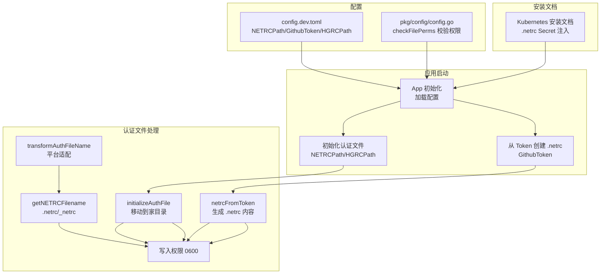
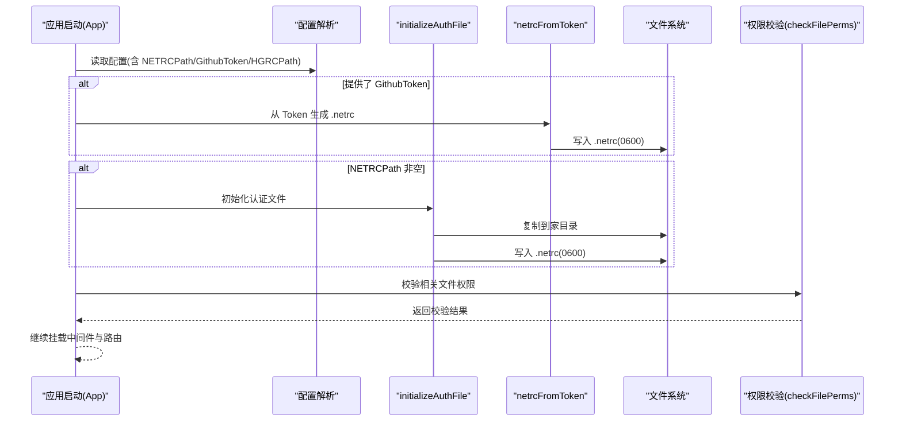
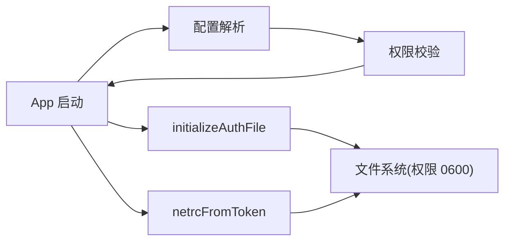

# .netrc文件配置

<cite>
**本文引用的文件列表**
- [cmd/proxy/actions/auth.go](file://cmd/proxy/actions/auth.go)
- [cmd/proxy/actions/app.go](file://cmd/proxy/actions/app.go)
- [pkg/config/config.go](file://pkg/config/config.go)
- [config.dev.toml](file://config.dev.toml)
- [docs/content/install/install-on-kubernetes.md](file://docs/content/install/install-on-kubernetes.md)
- [cmd/proxy/actions/basicauth.go](file://cmd/proxy/actions/basicauth.go)
</cite>

## 目录
1. [简介](#简介)
2. [项目结构](#项目结构)
3. [核心组件](#核心组件)
4. [架构总览](#架构总览)
5. [详细组件分析](#详细组件分析)
6. [依赖关系分析](#依赖关系分析)
7. [性能考量](#性能考量)
8. [故障排除指南](#故障排除指南)
9. [结论](#结论)
10. [附录](#附录)

## 简介
本文件面向需要在 Athens 代理中使用 .netrc 文件进行私有仓库认证的用户与运维人员，系统性说明 .netrc 文件的标准格式、文件位置、配置语法、主机/用户名/密码字段配置方法、多主机配置方式、安全存储与权限、平台差异、兼容性与故障排除，以及调试技巧与最佳实践。文档内容基于代码库中的实现与配置项进行整理，确保可操作性与准确性。

## 项目结构
与 .netrc 配置相关的核心代码集中在以下模块：
- 应用启动与初始化：负责读取配置、校验冲突、将外部 .netrc/hgrc 移动到用户家目录，并写入受控权限。
- 认证文件处理：提供从 GitHub Token 自动生成 .netrc 的能力，以及根据平台选择 .netrc 文件名（Windows 使用 _netrc）。
- 配置文件：定义 NETRCPath、GithubToken、HGRCPath 等关键配置项及其环境变量覆盖。
- Kubernetes 安装文档：说明如何以 Secret 形式注入 .netrc 文件并启用。

图表来源
- [cmd/proxy/actions/app.go](file://cmd/proxy/actions/app.go#L23-L44)
- [cmd/proxy/actions/auth.go](file://cmd/proxy/actions/auth.go#L13-L67)
- [pkg/config/config.go](file://pkg/config/config.go#L349-L375)
- [config.dev.toml](file://config.dev.toml#L192-L216)
- [docs/content/install/install-on-kubernetes.md](file://docs/content/install/install-on-kubernetes.md#L258-L271)

章节来源
- [cmd/proxy/actions/app.go](file://cmd/proxy/actions/app.go#L23-L44)
- [cmd/proxy/actions/auth.go](file://cmd/proxy/actions/auth.go#L13-L67)
- [pkg/config/config.go](file://pkg/config/config.go#L349-L375)
- [config.dev.toml](file://config.dev.toml#L192-L216)
- [docs/content/install/install-on-kubernetes.md](file://docs/content/install/install-on-kubernetes.md#L258-L271)

## 核心组件
- 应用启动流程（App）：在启动时根据配置决定是否从 GitHub Token 生成 .netrc，以及是否从指定路径初始化 .netrc/hgrc 到用户家目录；同时会进行基本认证中间件的挂载。
- 认证文件初始化（initializeAuthFile）：将外部提供的 .netrc/hgrc 文件复制到用户家目录，并设置严格权限（0600）。
- 从 Token 生成 .netrc（netrcFromToken）：当提供 GithubToken 时，自动生成 .netrc 文件，覆盖可能已存在的同名文件。
- 平台文件名适配（transformAuthFileName/getNETRCFilename）：在 Windows 上使用 _netrc，在类 Unix 上使用 .netrc。
- 权限校验（checkFilePerms）：对配置中涉及的文件进行权限校验，确保不被世界或其他组读取。
- 配置项（config.dev.toml）：NETRCPath、GithubToken、HGRCPath 等，支持环境变量覆盖。

章节来源
- [cmd/proxy/actions/app.go](file://cmd/proxy/actions/app.go#L23-L44)
- [cmd/proxy/actions/auth.go](file://cmd/proxy/actions/auth.go#L13-L67)
- [pkg/config/config.go](file://pkg/config/config.go#L349-L375)
- [config.dev.toml](file://config.dev.toml#L192-L216)

## 架构总览
下图展示 .netrc 配置在应用启动阶段的关键交互流程，包括配置解析、文件初始化、权限设置与平台适配。

图表来源
- [cmd/proxy/actions/app.go](file://cmd/proxy/actions/app.go#L23-L44)
- [cmd/proxy/actions/auth.go](file://cmd/proxy/actions/auth.go#L13-L67)
- [pkg/config/config.go](file://pkg/config/config.go#L349-L375)

## 详细组件分析

### .netrc 文件标准格式与语法
- 文件位置
  - 类 Unix 系统：~/.netrc
  - Windows 系统：~/_netrc
- 基本语法要点
  - 使用“machine”关键字标识目标主机。
  - 使用“login”关键字指定用户名。
  - 可选使用“password”关键字指定密码。
  - 支持多主机条目，每个主机独立一行。
- 示例（概念性说明）
  - 单主机：machine example.com login alice password secret
  - 多主机：分别列出多个 machine 条目，每行一个主机配置

章节来源
- [cmd/proxy/actions/auth.go](file://cmd/proxy/actions/auth.go#L62-L67)

### .netrc 文件位置与平台差异
- 平台适配
  - Windows 使用 _netrc
  - 类 Unix 使用 .netrc
- 文件名转换逻辑
  - 当外部传入的文件名为 netrc（忽略前导点或下划线）时，会被转换为平台对应的 .netrc 或 _netrc

章节来源
- [cmd/proxy/actions/auth.go](file://cmd/proxy/actions/auth.go#L55-L67)

### 主机名、用户名与密码字段配置
- 主机名：machine 关键字后跟主机域名或 IP。
- 用户名：login 关键字后跟用户名。
- 密码：password 关键字后跟密码（可选，取决于上游工具对 .netrc 的解析策略）。
- 多主机配置：为每个主机单独添加一条 machine/login/password 行。

章节来源
- [cmd/proxy/actions/auth.go](file://cmd/proxy/actions/auth.go#L42-L52)

### 从 GitHub Token 自动生成 .netrc
- 当配置中提供 GithubToken 时，应用会在启动时自动创建 .netrc 文件，内容包含针对 github.com 的登录信息。
- 该行为会覆盖用户家目录中可能已有的 .netrc 文件（Windows 使用 _netrc）。

章节来源
- [cmd/proxy/actions/app.go](file://cmd/proxy/actions/app.go#L24-L32)
- [cmd/proxy/actions/auth.go](file://cmd/proxy/actions/auth.go#L40-L52)

### 从外部路径初始化 .netrc/hgrc
- 若配置中提供 NETRCPath 或 HGRCPath，应用会读取对应文件并复制到用户家目录，文件名按平台规则转换。
- 写入时强制设置权限为 0600，确保只有当前用户可读写。

章节来源
- [cmd/proxy/actions/app.go](file://cmd/proxy/actions/app.go#L33-L44)
- [cmd/proxy/actions/auth.go](file://cmd/proxy/actions/auth.go#L13-L38)

### 权限与安全存储
- 写入 .netrc 时使用 0600 权限，避免其他用户或组读取。
- 权限校验函数会对配置中涉及的文件进行校验，确保不被世界或其他组读取。
- 在 Kubernetes 中，建议通过 Secret 注入 .netrc 文件，避免明文暴露。

章节来源
- [cmd/proxy/actions/auth.go](file://cmd/proxy/actions/auth.go#L33-L34)
- [pkg/config/config.go](file://pkg/config/config.go#L349-L375)
- [docs/content/install/install-on-kubernetes.md](file://docs/content/install/install-on-kubernetes.md#L258-L271)

### 配置项与环境变量
- NETRCPath：初始 .netrc 文件所在路径，应用启动时会将其复制到用户家目录。
- GithubToken：替代 .netrc 的方式，应用会自动生成 .netrc。
- HGRCPath：初始 .hgrc 文件所在路径，行为与 .netrc 类似。
- 环境变量覆盖：上述配置项均支持通过环境变量覆盖。

章节来源
- [config.dev.toml](file://config.dev.toml#L192-L216)

### 多主机配置示例（概念性说明）
- 单主机示例：machine example.com login alice password secret
- 多主机示例：分别为 github.com、gitlab.example.com、bitbucket.example.com 各自配置一行 machine/login/password

章节来源
- [cmd/proxy/actions/auth.go](file://cmd/proxy/actions/auth.go#L42-L52)

### 兼容性与平台差异
- 平台差异：Windows 使用 _netrc，类 Unix 使用 .netrc。
- 文件名转换：当外部文件名为 netrc（忽略前导点或下划线）时，会被转换为平台对应文件名。
- Kubernetes 支持：可通过 Secret 注入 .netrc，并在部署时启用。

章节来源
- [cmd/proxy/actions/auth.go](file://cmd/proxy/actions/auth.go#L55-L67)
- [docs/content/install/install-on-kubernetes.md](file://docs/content/install/install-on-kubernetes.md#L258-L271)

### 故障排除与调试技巧
- 常见问题
  - 同时提供 GithubToken 与 NETRCPath：应用会报错，禁止同时使用两种方式。
  - 权限错误：若 .netrc/hgrc 权限不符合要求，权限校验会失败。
  - 平台文件名不匹配：确认外部文件名是否为 netrc（忽略前导点或下划线），否则不会触发平台转换。
- 调试步骤
  - 检查应用启动日志，确认是否成功从 Token 生成 .netrc 或从 NETRCPath 初始化。
  - 确认家目录下的 .netrc/_netrc 是否存在且权限为 0600。
  - 在 Kubernetes 中确认 Secret 名称与键名正确，且部署时启用了 .netrc 功能。

章节来源
- [cmd/proxy/actions/app.go](file://cmd/proxy/actions/app.go#L24-L32)
- [pkg/config/config.go](file://pkg/config/config.go#L349-L375)
- [docs/content/install/install-on-kubernetes.md](file://docs/content/install/install-on-kubernetes.md#L258-L271)

## 依赖关系分析
- 应用启动依赖配置模块，配置模块提供 NETRCPath/GithubToken/HGRCPath 等关键参数。
- 认证文件处理依赖平台库以确定家目录与平台文件名。
- 权限校验在启动阶段执行，确保安全合规。

图表来源
- [cmd/proxy/actions/app.go](file://cmd/proxy/actions/app.go#L23-L44)
- [cmd/proxy/actions/auth.go](file://cmd/proxy/actions/auth.go#L13-L67)
- [pkg/config/config.go](file://pkg/config/config.go#L349-L375)

章节来源
- [cmd/proxy/actions/app.go](file://cmd/proxy/actions/app.go#L23-L44)
- [cmd/proxy/actions/auth.go](file://cmd/proxy/actions/auth.go#L13-L67)
- [pkg/config/config.go](file://pkg/config/config.go#L349-L375)

## 性能考量
- .netrc 文件读取与写入发生在应用启动阶段，对运行时性能影响极小。
- 权限校验为一次性检查，开销可忽略。
- 在容器化部署中，建议将 .netrc 作为 Secret 注入，避免频繁磁盘 IO。

## 故障排除指南
- 同时提供 GithubToken 与 NETRCPath：启动时报错，需二选一。
- 权限不符合要求：检查 .netrc/hgrc 权限是否为 0600。
- 平台文件名不生效：确认外部文件名是否为 netrc（忽略前导点或下划线）。
- Kubernetes Secret 未生效：确认 Secret 名称、键名与部署配置一致，并启用 .netrc 功能。

章节来源
- [cmd/proxy/actions/app.go](file://cmd/proxy/actions/app.go#L24-L32)
- [pkg/config/config.go](file://pkg/config/config.go#L349-L375)
- [docs/content/install/install-on-kubernetes.md](file://docs/content/install/install-on-kubernetes.md#L258-L271)

## 结论
通过在应用启动阶段对 .netrc 文件进行标准化处理（平台适配、权限设置、从 Token 自动生成），Athens 能够在不同平台上稳定地使用 .netrc 进行私有仓库认证。结合 Kubernetes Secret 注入与严格的权限校验，可有效提升安全性与可维护性。建议在生产环境中采用 Secret 注入与最小权限原则，并定期审查 .netrc 内容与权限。

## 附录
- 最佳实践
  - 使用 Kubernetes Secret 注入 .netrc，避免明文存储。
  - 为 .netrc 设置严格权限 0600。
  - 在 Windows 环境下注意使用 _netrc 文件名。
  - 避免同时提供 GithubToken 与 NETRCPath。
  - 对敏感配置项使用环境变量覆盖，减少配置文件暴露风险。