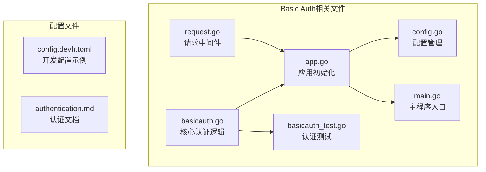
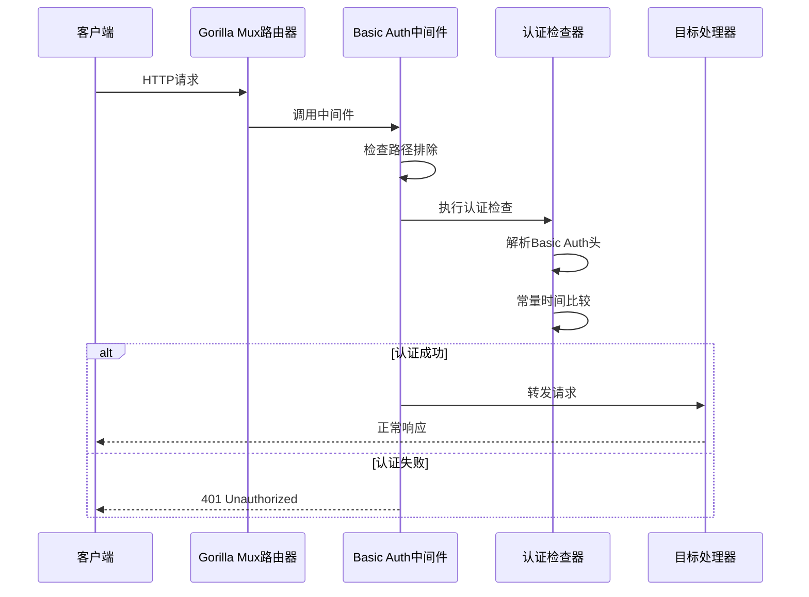
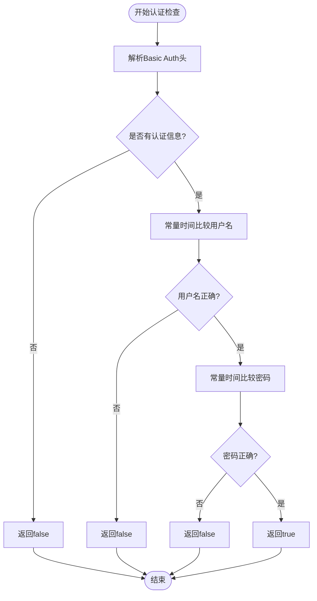
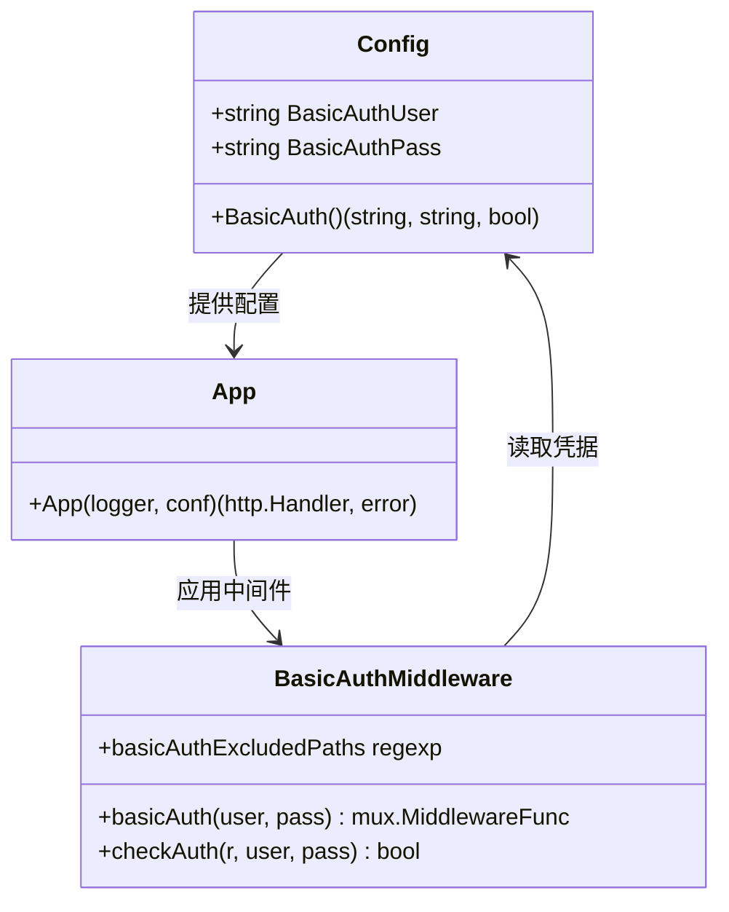
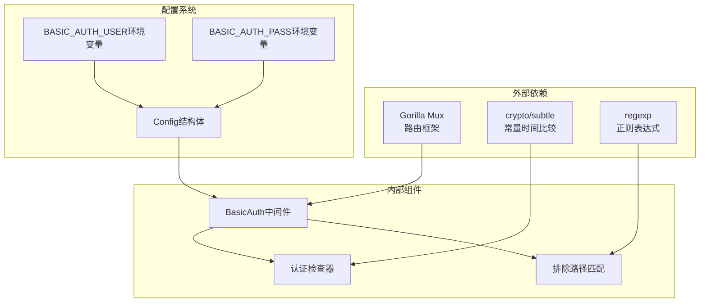
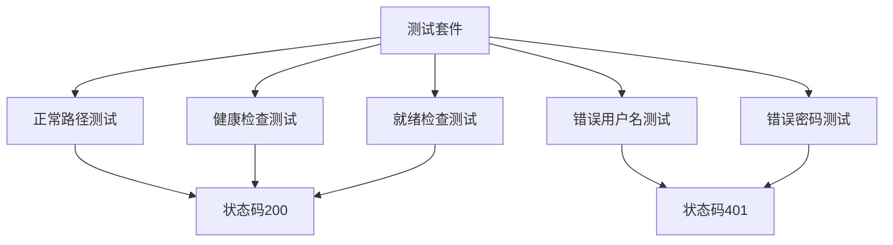

# Basic Auth配置

<cite>
**本文档引用的文件**
- [basicauth.go](file://cmd/proxy/actions/basicauth.go)
- [basicauth_test.go](file://cmd/proxy/actions/basicauth_test.go)
- [app.go](file://cmd/proxy/actions/app.go)
- [config.go](file://pkg/config/config.go)
- [main.go](file://cmd/proxy/main.go)
- [request.go](file://pkg/middleware/request.go)
- [authentication.md](file://docs/content/configuration/authentication.md)
</cite>

## 目录
1. [简介](#简介)
2. [项目结构](#项目结构)
3. [核心组件](#核心组件)
4. [架构概览](#架构概览)
5. [详细组件分析](#详细组件分析)
6. [依赖关系分析](#依赖关系分析)
7. [性能考虑](#性能考虑)
8. [故障排除指南](#故障排除指南)
9. [结论](#结论)

## 简介

Basic Auth认证配置是Athens代理服务器的重要安全功能，它提供了HTTP基本认证机制来保护代理服务免受未授权访问。本文档详细说明了Basic Auth中间件的工作原理、认证检查流程、常量时间比较算法和安全考虑，以及如何配置和使用Basic Auth认证。

## 项目结构

Basic Auth功能主要分布在以下文件中：



**图表来源**
- [basicauth.go](file://cmd/proxy/actions/basicauth.go#L1-L43)
- [app.go](file://cmd/proxy/actions/app.go#L1-L139)
- [config.go](file://pkg/config/config.go#L1-L376)

**章节来源**
- [basicauth.go](file://cmd/proxy/actions/basicauth.go#L1-L43)
- [app.go](file://cmd/proxy/actions/app.go#L1-L139)
- [config.go](file://pkg/config/config.go#L1-L376)

## 核心组件

### Basic Auth中间件架构

Basic Auth中间件采用Gorilla Mux中间件模式，提供了以下核心功能：

1. **路径排除机制** - 支持特定路径绕过认证
2. **常量时间比较** - 防止时序攻击
3. **标准HTTP认证头** - 兼容标准浏览器行为
4. **条件认证** - 仅对需要保护的路径进行认证

### 认证排除路径配置

系统预定义了两个特殊路径可以绕过Basic Auth认证：

- `/healthz` - 健康检查端点
- `/readyz` - 就绪检查端点

这些路径使用正则表达式 `^/(health|ready)z$` 进行匹配，确保监控和健康检查不受认证限制。

**章节来源**
- [basicauth.go](file://cmd/proxy/actions/basicauth.go#L11-L12)
- [basicauth_test.go](file://cmd/proxy/actions/basicauth_test.go#L48-L62)

## 架构概览

Basic Auth认证在Athens中的集成架构如下：



**图表来源**
- [basicauth.go](file://cmd/proxy/actions/basicauth.go#L14-L27)
- [basicauth.go](file://cmd/proxy/actions/basicauth.go#L29-L42)

## 详细组件分析

### basicAuthExcludedPaths正则表达式

Basic Auth排除路径使用正则表达式 `^/(health|ready)z$` 进行精确匹配：

```mermaid
flowchart TD
Start([请求到达]) --> CheckPath{检查URL路径}
CheckPath --> |匹配"/healthz"| SkipAuth[跳过认证]
CheckPath --> |匹配"/readyz"| SkipAuth
CheckPath --> |其他路径| NeedAuth[需要认证]
SkipAuth --> Continue[继续处理]
NeedAuth --> CheckAuth[执行认证检查]
CheckAuth --> AuthOK{认证通过?}
AuthOK --> |是| Continue
AuthOK --> |否| Return401[返回401]
Continue --> End([请求完成])
Return401 --> End
```

**图表来源**
- [basicauth.go](file://cmd/proxy/actions/basicauth.go#L11-L12)
- [basicauth.go](file://cmd/proxy/actions/basicauth.go#L17-L21)

### checkAuth函数实现原理

认证检查函数实现了完整的HTTP基本认证流程：



**图表来源**
- [basicauth.go](file://cmd/proxy/actions/basicauth.go#L29-L42)

### 常量时间比较算法

系统使用 `crypto/subtle` 包提供的常量时间比较算法来防止时序攻击：

- **用户比较**: `subtle.ConstantTimeCompare([]byte(user), []byte(givenUser))`
- **密码比较**: `subtle.ConstantTimeCompare([]byte(pass), []byte(givenPass))`

这种算法确保比较操作的时间复杂度与输入无关，有效防止侧信道攻击。

**章节来源**
- [basicauth.go](file://cmd/proxy/actions/basicauth.go#L35-L41)

### 配置系统集成

Basic Auth配置通过环境变量和配置文件进行管理：



**图表来源**
- [config.go](file://pkg/config/config.go#L22-L66)
- [config.go](file://pkg/config/config.go#L215-L222)
- [app.go](file://cmd/proxy/actions/app.go#L95-L99)
- [basicauth.go](file://cmd/proxy/actions/basicauth.go#L14-L27)

**章节来源**
- [config.go](file://pkg/config/config.go#L43-L44)
- [config.go](file://pkg/config/config.go#L215-L222)
- [app.go](file://cmd/proxy/actions/app.go#L95-L99)

## 依赖关系分析

Basic Auth功能的依赖关系图：



**图表来源**
- [basicauth.go](file://cmd/proxy/actions/basicauth.go#L3-L8)
- [config.go](file://pkg/config/config.go#L43-L44)

**章节来源**
- [basicauth.go](file://cmd/proxy/actions/basicauth.go#L1-L43)
- [config.go](file://pkg/config/config.go#L1-L376)

## 性能考虑

### 认证性能优化

1. **常量时间比较**: 使用 `crypto/subtle` 包确保比较操作具有恒定时间复杂度
2. **早期退出**: 认证失败时立即返回，避免不必要的处理
3. **正则表达式缓存**: 正则表达式编译一次后重复使用
4. **内存效率**: 字节切片比较避免字符串复制

### 内存使用分析

- 用户名和密码比较使用原始字节切片，避免额外的内存分配
- 正则表达式编译结果存储在全局变量中，减少重复编译开销
- 中间件函数闭包捕获最小必要状态

## 故障排除指南

### 常见认证问题

#### 1. 401 Unauthorized错误

**可能原因**:
- 错误的用户名或密码
- 缺少Authorization头
- 认证信息格式不正确

**解决方案**:
- 验证用户名和密码配置
- 确认客户端发送正确的Basic Auth头
- 检查网络代理配置

#### 2. 健康检查失败

**可能原因**:
- Basic Auth中间件阻止了健康检查
- 排除路径配置错误

**解决方案**:
- 确认 `/healthz` 和 `/readyz` 路径在排除列表中
- 验证正则表达式匹配逻辑

#### 3. 时序攻击防护

**安全考虑**:
- 系统使用常量时间比较防止时序分析
- 即使用户名错误也会执行完整的密码比较

**章节来源**
- [basicauth_test.go](file://cmd/proxy/actions/basicauth_test.go#L31-L46)
- [basicauth.go](file://cmd/proxy/actions/basicauth.go#L35-L41)

### 测试验证

系统提供了完整的单元测试来验证Basic Auth功能：



**图表来源**
- [basicauth_test.go](file://cmd/proxy/actions/basicauth_test.go#L15-L63)

**章节来源**
- [basicauth_test.go](file://cmd/proxy/actions/basicauth_test.go#L65-L88)

## 结论

Basic Auth认证配置为Athens代理服务器提供了基础但有效的安全保护。通过以下关键特性确保了系统的安全性：

1. **路径选择性保护**: 仅对需要保护的路径应用认证
2. **时序攻击防护**: 使用常量时间比较算法
3. **标准兼容性**: 支持标准HTTP基本认证协议
4. **灵活配置**: 通过环境变量和配置文件进行管理

建议在生产环境中：
- 使用强密码策略
- 定期轮换认证凭据
- 结合HTTPS使用以防止明文传输
- 监控认证失败日志以检测潜在攻击

通过合理配置和使用，Basic Auth能够为Athens代理提供可靠的访问控制保护。