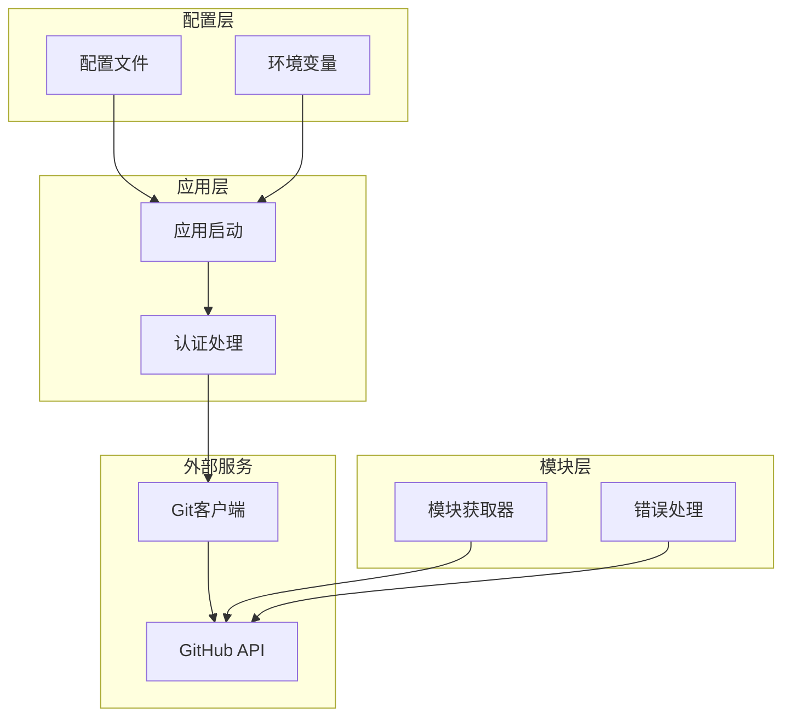
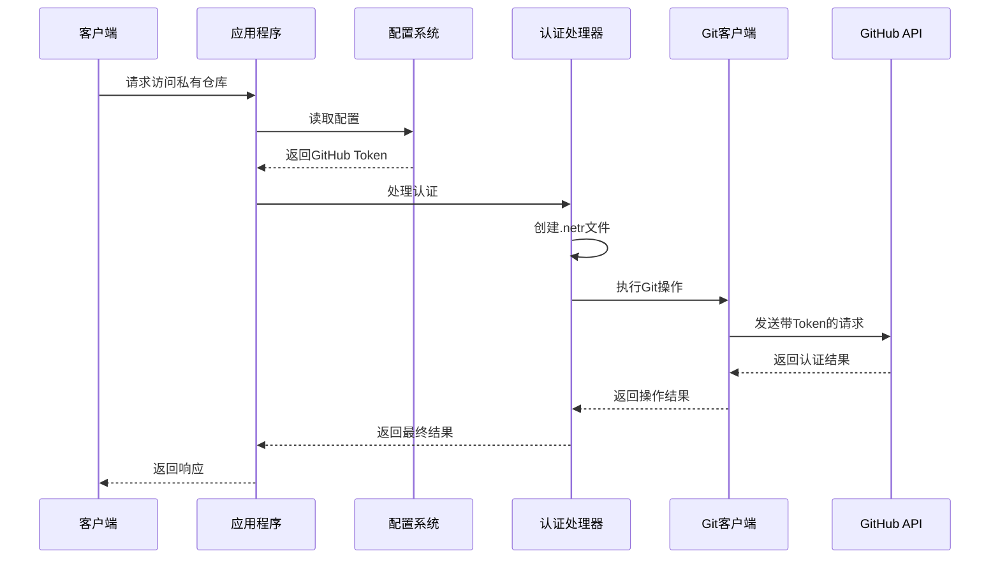
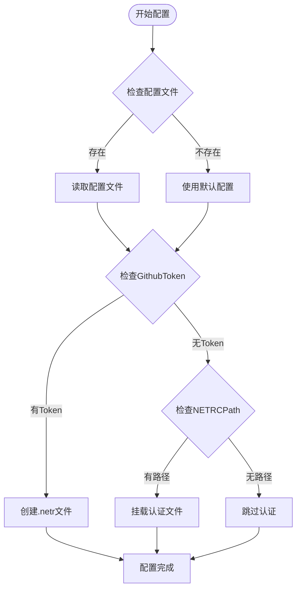
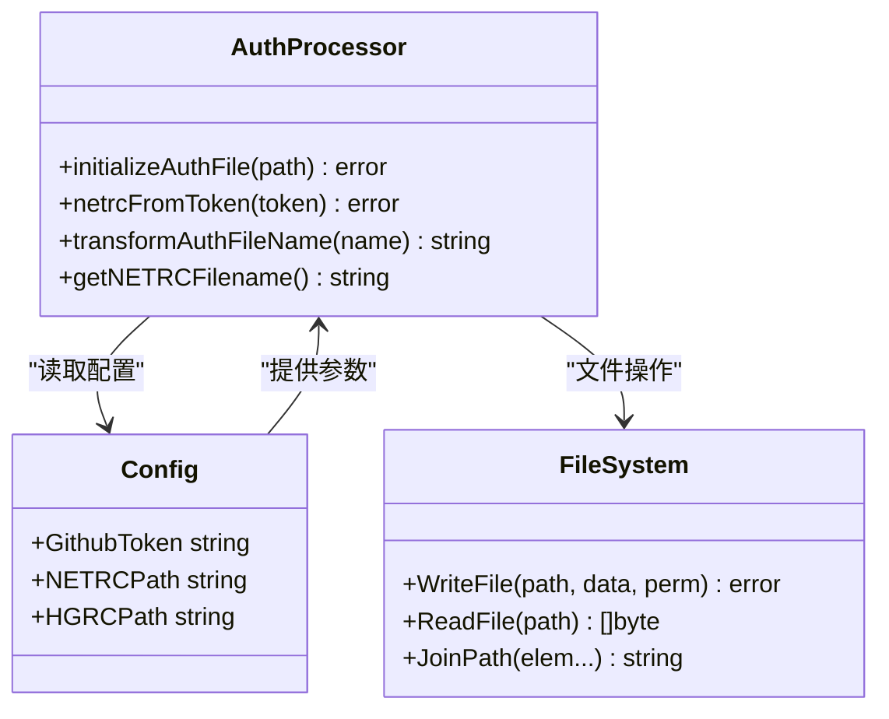
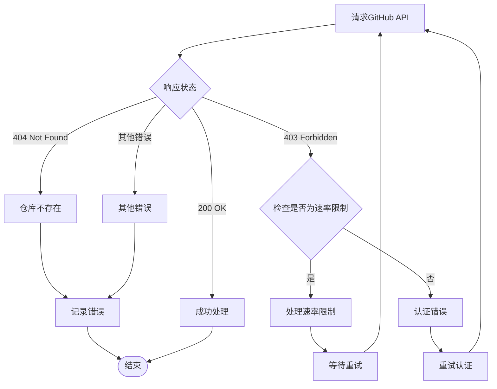
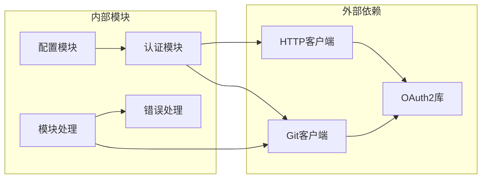

# GitHub Token配置

<cite>
**本文档引用的文件**
- [authentication.md](file://docs/content/configuration/authentication.md)
- [auth.go](file://cmd/proxy/actions/auth.go)
- [app.go](file://cmd/proxy/actions/app.go)
- [config.go](file://pkg/config/config.go)
- [config.dev.toml](file://config.dev.toml)
- [go_get_fetcher.go](file://pkg/module/go_get_fetcher.go)
- [errors.go](file://pkg/errors/errors.go)
- [gocmd.go](file://pkg/errors/gocmd.go)
- [install-on-kubernetes.zh.md](file://docs/content/install/install-on-kubernetes.zh.md)
</cite>

## 目录
1. [简介](#简介)
2. [项目结构](#项目结构)
3. [核心组件](#核心组件)
4. [架构概览](#架构概览)
5. [详细组件分析](#详细组件分析)
6. [依赖关系分析](#依赖关系分析)
7. [性能考虑](#性能考虑)
8. [故障排除指南](#故障排除指南)
9. [结论](#结论)

## 简介

本文档详细说明了在Athens代理中配置和使用GitHub Token进行认证的方法。内容涵盖GitHub Token的获取方式、权限范围、配置方法，以及在请求头中传递Token的方式、权限验证流程和GitHub API认证机制。

## 项目结构

Athens项目采用分层架构设计，GitHub Token认证功能主要涉及以下模块：

**图表来源**
- [app.go](file://cmd/proxy/actions/app.go#L23-L44)
- [auth.go](file://cmd/proxy/actions/auth.go#L13-L67)
- [config.go](file://pkg/config/config.go#L22-L66)

**章节来源**
- [app.go](file://cmd/proxy/actions/app.go#L23-L44)
- [auth.go](file://cmd/proxy/actions/auth.go#L13-L67)
- [config.go](file://pkg/config/config.go#L22-L66)

## 核心组件

### 配置系统

Athens通过多种方式支持GitHub Token配置：

1. **配置文件方式**：在配置文件中设置GithubToken字段
2. **环境变量方式**：通过ATHENS_GITHUB_TOKEN环境变量设置
3. **直接配置方式**：在应用启动时直接传入配置

### 认证处理机制

系统提供了两种主要的认证处理方式：

1. **.netrc文件生成**：将GitHub Token转换为标准的.netr格式
2. **直接认证文件挂载**：直接挂载现有的认证文件到用户主目录

**章节来源**
- [config.dev.toml](file://config.dev.toml#L192-L207)
- [config.go](file://pkg/config/config.go#L49-L50)
- [auth.go](file://cmd/proxy/actions/auth.go#L40-L53)

## 架构概览

GitHub Token认证在Athens中的整体工作流程如下：

**图表来源**
- [app.go](file://cmd/proxy/actions/app.go#L24-L32)
- [auth.go](file://cmd/proxy/actions/auth.go#L42-L52)

## 详细组件分析

### 配置文件处理

配置文件支持GitHub Token的多种配置方式：

**图表来源**
- [app.go](file://cmd/proxy/actions/app.go#L24-L38)

**章节来源**
- [config.dev.toml](file://config.dev.toml#L192-L207)
- [app.go](file://cmd/proxy/actions/app.go#L24-L38)

### 认证文件生成机制

系统提供了灵活的认证文件生成能力：

**图表来源**
- [auth.go](file://cmd/proxy/actions/auth.go#L16-L67)
- [config.go](file://pkg/config/config.go#L49-L51)

**章节来源**
- [auth.go](file://cmd/proxy/actions/auth.go#L16-L67)

### 错误处理和速率限制

系统内置了完善的错误处理机制：

**图表来源**
- [go_get_fetcher.go](file://pkg/module/go_get_fetcher.go#L165-L167)
- [errors.go](file://pkg/errors/errors.go#L12-L22)

**章节来源**
- [go_get_fetcher.go](file://pkg/module/go_get_fetcher.go#L165-L167)
- [errors.go](file://pkg/errors/errors.go#L12-L22)

## 依赖关系分析

GitHub Token认证功能的依赖关系如下：

**图表来源**
- [config.go](file://pkg/config/config.go#L3-L17)
- [auth.go](file://cmd/proxy/actions/auth.go#L3-L11)
- [go_get_fetcher.go](file://pkg/module/go_get_fetcher.go#L1-L20)

**章节来源**
- [config.go](file://pkg/config/config.go#L3-L17)
- [auth.go](file://cmd/proxy/actions/auth.go#L3-L11)

## 性能考虑

### 并发控制

Athens通过以下机制优化GitHub API调用性能：

1. **并发限制**：通过GoGetWorkers参数控制同时进行的Git操作数量
2. **单飞机制**：防止重复的模块下载和存储操作
3. **缓存策略**：利用Git的本地缓存机制减少重复请求

### 资源管理

系统提供了灵活的资源管理选项：

- **内存模式**：适合开发和测试环境
- **持久化存储**：支持多种后端存储方案
- **索引服务**：可选的数据库索引支持

## 故障排除指南

### 常见问题及解决方案

#### 认证失败

**症状**：访问私有仓库时出现401或403错误

**排查步骤**：
1. 验证GitHub Token的有效性
2. 检查Token权限范围是否正确
3. 确认认证文件已正确挂载到容器中

**解决方案**：
- 重新生成具有适当权限的GitHub Token
- 检查并修正认证文件权限
- 验证网络连接和防火墙设置

#### 速率限制问题

**症状**：频繁收到403错误，提示API速率限制

**处理方法**：
1. 实现指数退避重试机制
2. 优化并发请求数量
3. 使用更高效的缓存策略

#### 权限配置问题

**症状**：Token有效但无法访问特定仓库

**检查清单**：
- 确认Token具有repo权限
- 验证仓库所有权和访问权限
- 检查组织级别的访问控制设置

**章节来源**
- [gocmd.go](file://pkg/errors/gocmd.go#L7-L11)
- [errors.go](file://pkg/errors/errors.go#L12-L22)

## 结论

GitHub Token认证在Athens中提供了灵活且安全的私有仓库访问机制。通过配置文件、环境变量和直接配置等多种方式，用户可以根据不同的部署场景选择最适合的认证方案。

关键优势包括：
- 支持多种认证方式，适应不同部署需求
- 内置完善的错误处理和重试机制
- 提供灵活的权限管理和安全控制
- 优化的性能表现和资源利用率

建议的最佳实践：
1. 使用最小权限原则分配Token权限
2. 定期轮换和审计Token使用情况
3. 实施适当的监控和告警机制
4. 根据实际负载调整并发参数