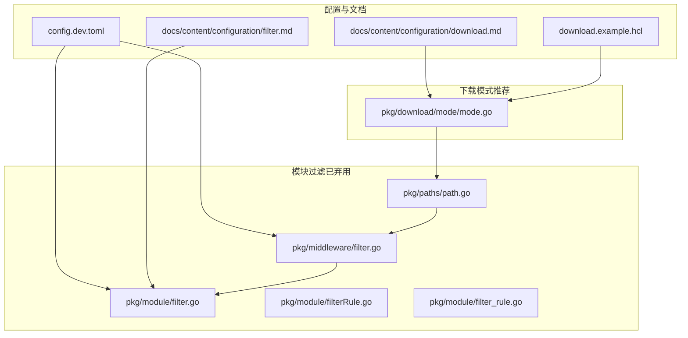
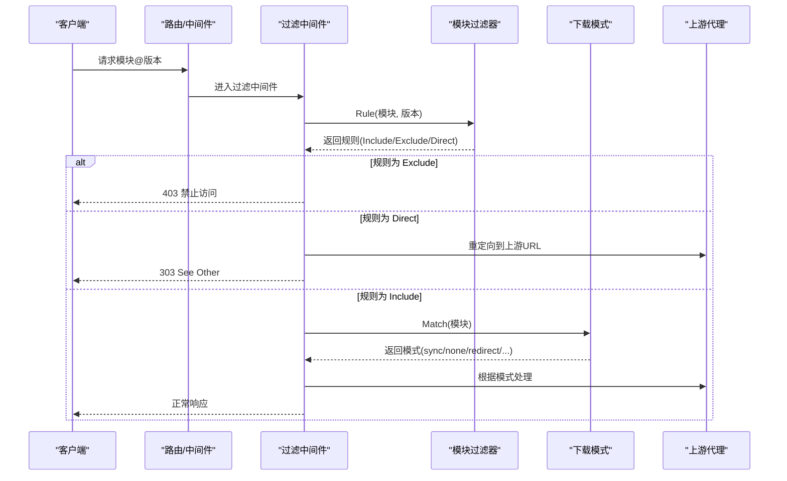
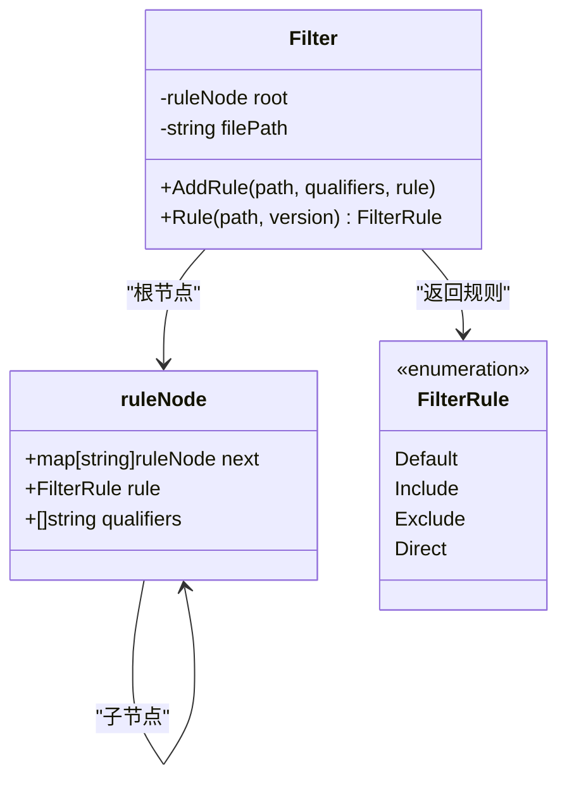
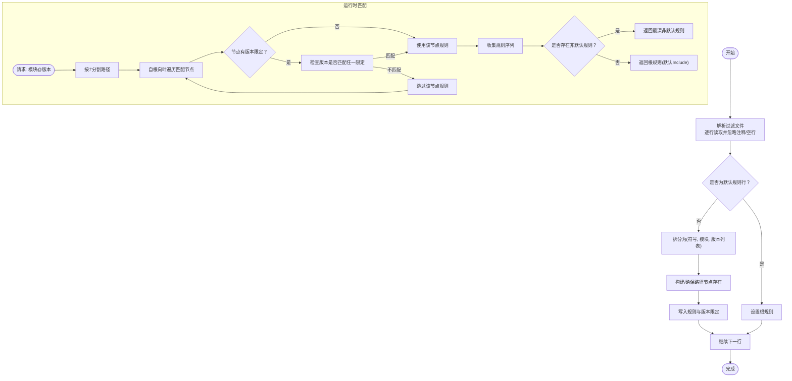
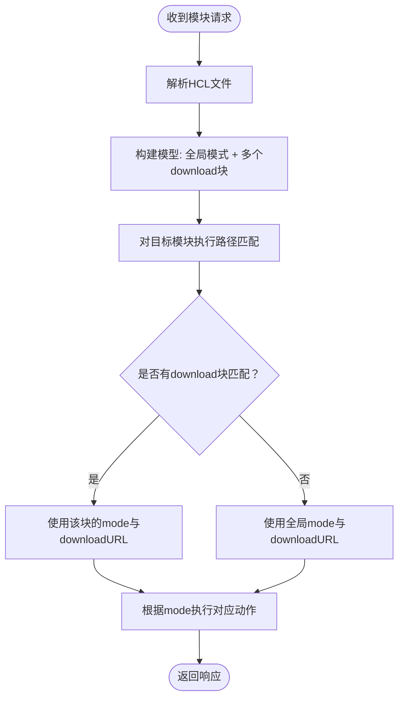
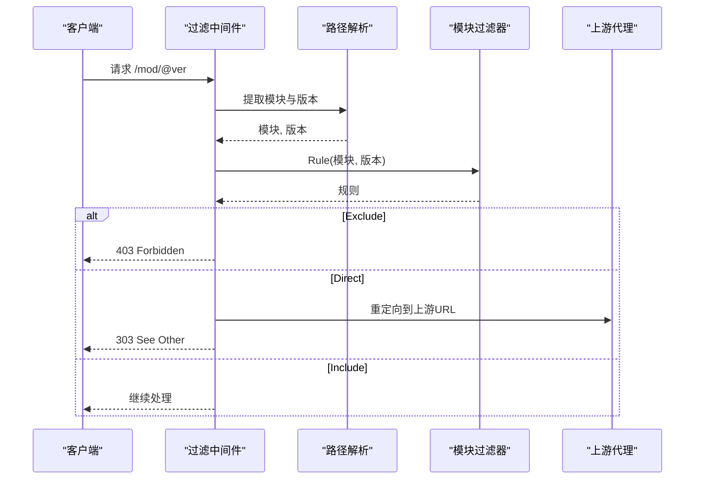
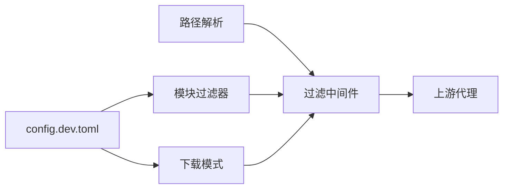

# 内容过滤配置

<cite>
**本文引用的文件**
- [pkg/module/filter.go](file://pkg/module/filter.go)
- [pkg/module/filterRule.go](file://pkg/module/filterRule.go)
- [pkg/module/filter_rule.go](file://pkg/module/filter_rule.go)
- [pkg/module/filter_test.go](file://pkg/module/filter_test.go)
- [pkg/middleware/filter.go](file://pkg/middleware/filter.go)
- [pkg/paths/path.go](file://pkg/paths/path.go)
- [pkg/download/mode/mode.go](file://pkg/download/mode/mode.go)
- [docs/content/configuration/filter.md](file://docs/content/configuration/filter.md)
- [docs/content/configuration/download.md](file://docs/content/configuration/download.md)
- [config.dev.toml](file://config.dev.toml)
- [download.example.hcl](file://download.example.hcl)
</cite>

## 目录
1. [简介](#简介)
2. [项目结构](#项目结构)
3. [核心组件](#核心组件)
4. [架构总览](#架构总览)
5. [详细组件分析](#详细组件分析)
6. [依赖关系分析](#依赖关系分析)
7. [性能考量](#性能考量)
8. [故障排查指南](#故障排查指南)
9. [结论](#结论)
10. [附录](#附录)

## 简介
本文件系统性阐述 Athens 的内容过滤与下载模式配置，重点覆盖以下方面：
- 过滤规则格式、匹配模式与策略配置
- 规则语法结构、版本限定与修饰符、匹配逻辑实现
- 白名单、黑名单与混合策略的配置示例
- 性能影响、缓存机制与实时更新策略
- 调试方法、规则优化技巧与维护策略
- 常见过滤场景的配置模板与最佳实践

说明：旧版“模块过滤文件”已弃用，推荐使用新版“下载模式文件（HCL）”。本文同时保留对旧版规则的说明以便理解演进。

## 项目结构
围绕内容过滤与下载模式的相关代码与文档分布如下：
- 模块过滤（已弃用）：规则解析、匹配逻辑、中间件拦截
- 下载模式（推荐）：HCL 解析、模式匹配、URL 重定向
- 配置入口：示例配置文件与环境变量
- 文档：过滤与下载模式的官方说明

**图示来源**
- [config.dev.toml](file://config.dev.toml#L106-L106)
- [docs/content/configuration/filter.md](file://docs/content/configuration/filter.md#L1-L96)
- [docs/content/configuration/download.md](file://docs/content/configuration/download.md#L1-L103)
- [pkg/module/filter.go](file://pkg/module/filter.go#L1-L312)
- [pkg/module/filterRule.go](file://pkg/module/filterRule.go#L1-L17)
- [pkg/module/filter_rule.go](file://pkg/module/filter_rule.go#L1-L8)
- [pkg/middleware/filter.go](file://pkg/middleware/filter.go#L1-L53)
- [pkg/paths/path.go](file://pkg/paths/path.go#L1-L80)
- [pkg/download/mode/mode.go](file://pkg/download/mode/mode.go#L1-L142)
- [download.example.hcl](file://download.example.hcl#L1-L17)

**章节来源**
- [config.dev.toml](file://config.dev.toml#L106-L106)
- [docs/content/configuration/filter.md](file://docs/content/configuration/filter.md#L1-L96)
- [docs/content/configuration/download.md](file://docs/content/configuration/download.md#L1-L103)
- [pkg/module/filter.go](file://pkg/module/filter.go#L1-L312)
- [pkg/middleware/filter.go](file://pkg/middleware/filter.go#L1-L53)
- [pkg/download/mode/mode.go](file://pkg/download/mode/mode.go#L1-L142)
- [pkg/paths/path.go](file://pkg/paths/path.go#L1-L80)
- [download.example.hcl](file://download.example.hcl#L1-L17)

## 核心组件
- 模块过滤器（已弃用）
  - 规则树结构：基于路径分段的前缀树，支持默认规则与版本限定
  - 匹配逻辑：从根到叶逐级匹配，优先返回非默认规则
  - 中间件：在请求进入处理链前根据规则执行放行、拒绝或上游直连
- 下载模式（推荐）
  - HCL 文件：定义全局模式与按路径模式的覆盖
  - 模式关键字：同步下载、异步下载、直接返回、重定向、异步重定向
  - 匹配算法：使用 Go 的路径匹配函数进行前缀匹配

**章节来源**
- [pkg/module/filter.go](file://pkg/module/filter.go#L18-L132)
- [pkg/module/filterRule.go](file://pkg/module/filterRule.go#L3-L16)
- [pkg/module/filter_rule.go](file://pkg/module/filter_rule.go#L3-L7)
- [pkg/middleware/filter.go](file://pkg/middleware/filter.go#L13-L48)
- [pkg/download/mode/mode.go](file://pkg/download/mode/mode.go#L16-L141)

## 架构总览
下图展示请求在过滤与下载模式下的处理流程：

**图示来源**
- [pkg/middleware/filter.go](file://pkg/middleware/filter.go#L15-L48)
- [pkg/module/filter.go](file://pkg/module/filter.go#L74-L82)
- [pkg/download/mode/mode.go](file://pkg/download/mode/mode.go#L120-L127)
- [pkg/paths/path.go](file://pkg/paths/path.go#L12-L31)

## 详细组件分析

### 模块过滤器（已弃用）
模块过滤器通过“过滤文件”定义 Include/Exclude/Direct 三种规则，并支持版本限定与修饰符。其核心数据结构与匹配逻辑如下：

- 规则语法要点
  - 行首符号：+（包含）、-（排除）、D（直连上游）
  - 默认规则：文件首行可设置全局默认行为
  - 版本限定：第三列逗号分隔的版本模式，支持前缀匹配与修饰符
- 版本修饰符
  - v1.2.3：精确前缀匹配
  - ~1.2.3：兼容次小版本（1.2.x 及以上）
  - ^1.2.3：兼容次小版本与补丁（1.x.y 及以上）
  - <1.2.3：低于指定版本
- 匹配逻辑
  - 从根到叶逐级匹配，遇到非默认规则即返回；若无匹配则回退至根规则
  - 版本限定：当节点存在限定时，仅当请求版本满足任一限定才计入规则序列

**图示来源**
- [pkg/module/filter.go](file://pkg/module/filter.go#L134-L193)
- [pkg/module/filter.go](file://pkg/module/filter.go#L96-L132)
- [pkg/module/filter.go](file://pkg/module/filterRule.go#L6-L16)

**章节来源**
- [docs/content/configuration/filter.md](file://docs/content/configuration/filter.md#L18-L96)
- [pkg/module/filter.go](file://pkg/module/filter.go#L18-L193)
- [pkg/module/filterRule.go](file://pkg/module/filterRule.go#L3-L16)
- [pkg/module/filter_rule.go](file://pkg/module/filter_rule.go#L3-L7)
- [pkg/module/filter_test.go](file://pkg/module/filter_test.go#L27-L225)

### 下载模式（推荐）
下载模式采用 HCL 文件定义“全局模式 + 路径模式覆盖”，并支持重定向 URL 自定义。核心能力：
- 全局模式关键字：sync、async、none、redirect、async_redirect
- 路径模式：download 块 + pattern 标签 + mode + 可选 downloadURL
- 匹配策略：顺序匹配首个命中，否则回退到全局模式；URL 同理

**图示来源**
- [pkg/download/mode/mode.go](file://pkg/download/mode/mode.go#L34-L46)
- [pkg/download/mode/mode.go](file://pkg/download/mode/mode.go#L120-L141)
- [docs/content/configuration/download.md](file://docs/content/configuration/download.md#L25-L74)

**章节来源**
- [docs/content/configuration/download.md](file://docs/content/configuration/download.md#L16-L74)
- [pkg/download/mode/mode.go](file://pkg/download/mode/mode.go#L31-L141)
- [download.example.hcl](file://download.example.hcl#L1-L17)

### 过滤中间件
过滤中间件在请求到达具体处理器之前，根据模块过滤器的规则决定：
- 放行（Include）：继续后续处理
- 拒绝（Exclude）：返回 403
- 直连上游（Direct）：重定向到上游端点

**图示来源**
- [pkg/middleware/filter.go](file://pkg/middleware/filter.go#L15-L48)
- [pkg/paths/path.go](file://pkg/paths/path.go#L12-L31)
- [pkg/module/filter.go](file://pkg/module/filter.go#L74-L82)

**章节来源**
- [pkg/middleware/filter.go](file://pkg/middleware/filter.go#L13-L48)
- [pkg/paths/path.go](file://pkg/paths/path.go#L56-L79)

## 依赖关系分析
- 模块过滤器依赖路径解析模块提取模块名与版本
- 过滤中间件依赖模块过滤器与上游端点配置
- 下载模式依赖路径匹配工具与 HCL 解析库
- 配置入口通过配置文件与环境变量启用过滤或下载模式

**图示来源**
- [config.dev.toml](file://config.dev.toml#L106-L106)
- [config.dev.toml](file://config.dev.toml#L268-L268)
- [pkg/paths/path.go](file://pkg/paths/path.go#L56-L79)
- [pkg/middleware/filter.go](file://pkg/middleware/filter.go#L15-L48)
- [pkg/download/mode/mode.go](file://pkg/download/mode/mode.go#L120-L141)

**章节来源**
- [config.dev.toml](file://config.dev.toml#L106-L106)
- [config.dev.toml](file://config.dev.toml#L268-L268)
- [pkg/paths/path.go](file://pkg/paths/path.go#L56-L79)
- [pkg/middleware/filter.go](file://pkg/middleware/filter.go#L13-L48)
- [pkg/download/mode/mode.go](file://pkg/download/mode/mode.go#L120-L141)

## 性能考量
- 规则匹配复杂度
  - 模块过滤器：每次匹配沿路径深度遍历，时间复杂度近似 O(L)，L 为模块路径分段数；版本限定线性检查，整体 O(L + K)，K 为限定数量
  - 下载模式：顺序匹配各路径块，命中后立即返回，未命中回退全局模式
- 缓存机制
  - 模块过滤器未内置缓存；建议在上层实现进程内缓存或外部缓存以减少重复解析
  - 下载模式未内置缓存；建议结合单实例并发控制与外部缓存
- 并发与一致性
  - 模块过滤器未声明并发安全；建议在初始化后只读使用
  - 单飞行（SingleFlight）可用于避免并发写入冲突（与下载模式配合）

[本节为通用性能讨论，无需特定文件来源]

## 故障排查指南
- 模块过滤文件错误
  - 行格式非法或符号不被识别会触发错误；请检查每行开头符号与字段数量
  - 版本限定格式异常会导致匹配失败；确认限定字符串符合前缀与修饰符规范
- 下载模式错误
  - HCL 解析失败或未知模式关键字会报错；检查 HCL 语法与模式值
  - 未匹配任何路径时回退到全局模式；确认 pattern 是否正确
- 调试建议
  - 使用单元测试中的断言与样例验证规则行为
  - 在中间件处打印模块与版本信息，核对规则匹配结果
  - 对比过滤文件与下载模式文件的生效顺序与优先级

**章节来源**
- [pkg/module/filter.go](file://pkg/module/filter.go#L134-L193)
- [pkg/module/filter_test.go](file://pkg/module/filter_test.go#L202-L225)
- [pkg/download/mode/mode.go](file://pkg/download/mode/mode.go#L84-L101)
- [pkg/download/mode/mode_test.go](file://pkg/download/mode/mode_test.go#L129-L154)

## 结论
- 新版下载模式（HCL）提供了更灵活、可扩展的过滤与下载策略，建议优先采用
- 旧版模块过滤文件仍可使用，但已标记弃用，迁移至下载模式可获得更好的维护性与可读性
- 在生产环境中，建议结合缓存、并发控制与监控，持续优化规则集与匹配性能

[本节为总结，无需特定文件来源]

## 附录

### 配置示例与模板

- 模块过滤文件（已弃用）
  - 示例：默认直连上游，例外包含与排除
  - 版本限定：仅允许特定主/次版本范围
  - 修饰符：~、^、< 的组合使用

- 下载模式文件（推荐）
  - 全局模式：async_redirect
  - 路径覆盖：禁止某些组织的模块、重定向到专用代理等
  - 示例参考：官方示例 HCL 文件

**章节来源**
- [docs/content/configuration/filter.md](file://docs/content/configuration/filter.md#L28-L96)
- [docs/content/configuration/download.md](file://docs/content/configuration/download.md#L39-L74)
- [download.example.hcl](file://download.example.hcl#L1-L17)

### 最佳实践
- 规则组织
  - 将默认规则置于文件顶部，随后按需覆盖
  - 使用通配符与层级路径精确控制作用域
- 版本管理
  - 优先使用语义化版本限定与修饰符，避免过于宽泛的前缀
  - 审批清单式版本控制，确保变更受控
- 性能优化
  - 减少深层路径规则数量，合并相近规则
  - 对频繁访问的模块使用更短的路径前缀
- 维护策略
  - 定期审查规则有效性，移除不再使用的条目
  - 通过自动化测试保障规则变更不影响预期行为

[本节为通用建议，无需特定文件来源]