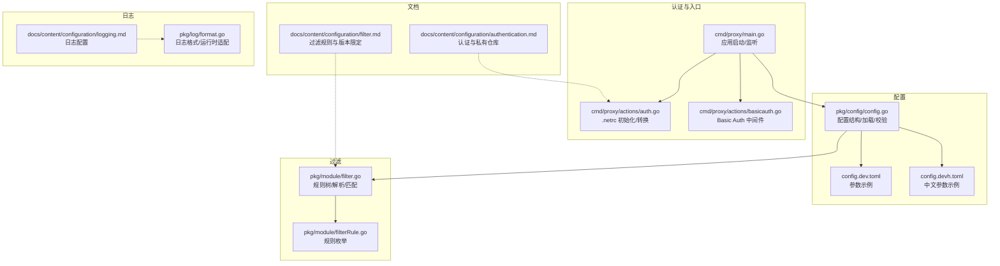
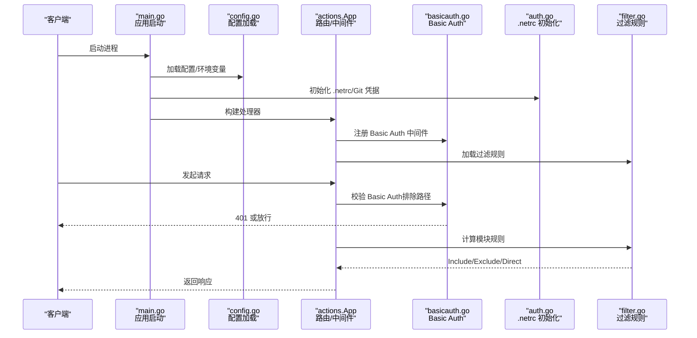
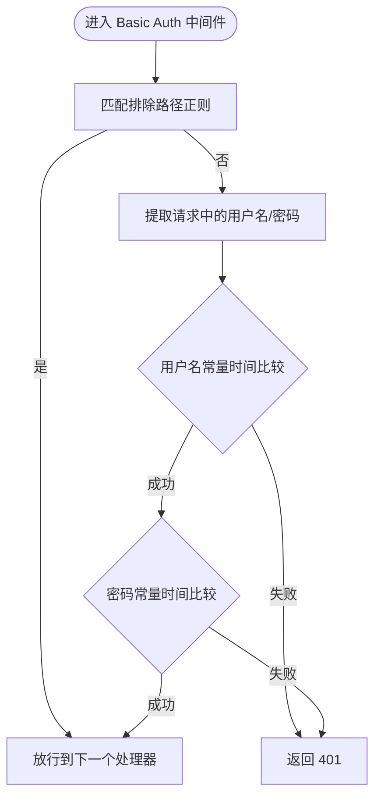
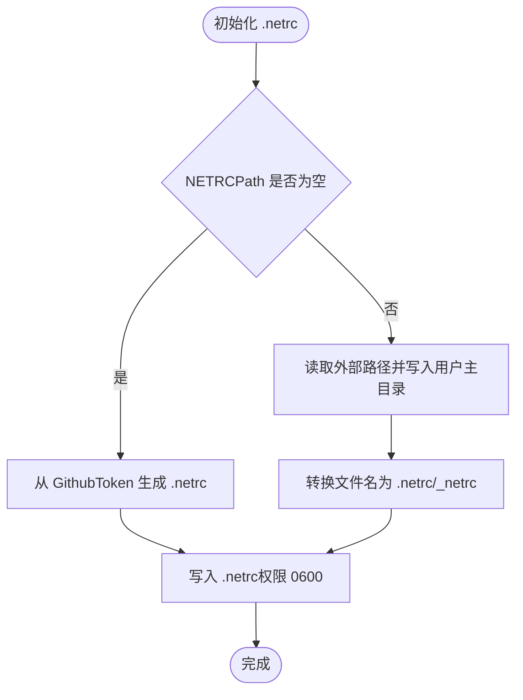
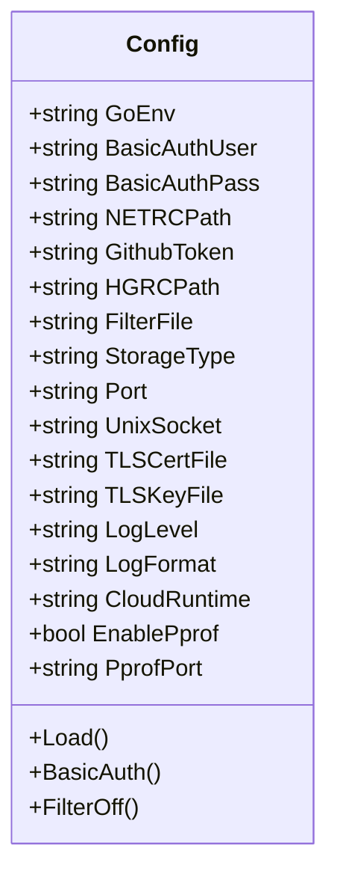
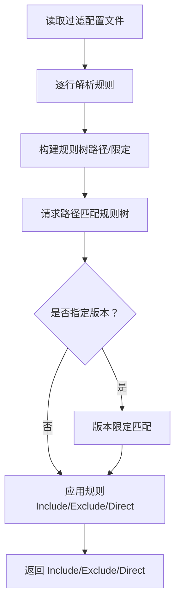
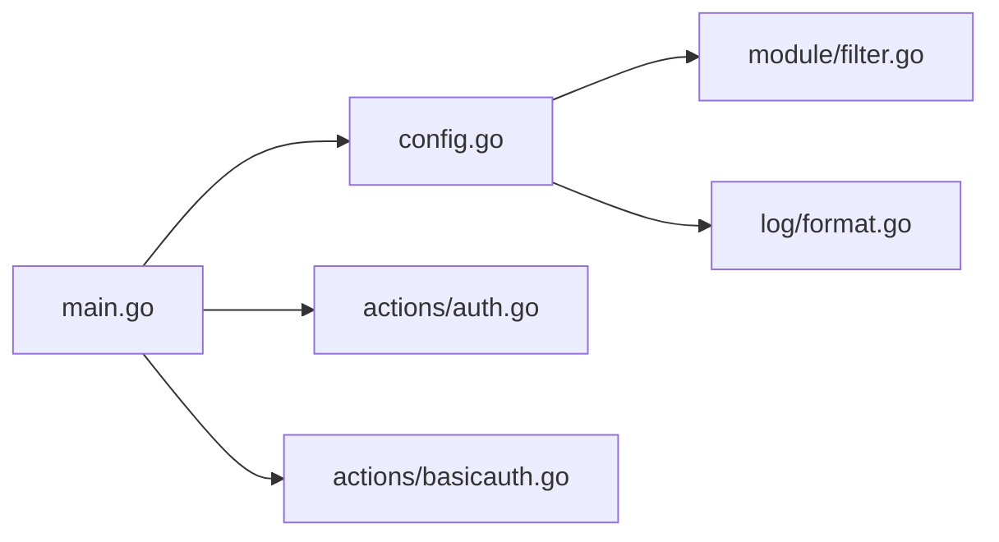

# 认证配置

<cite>
**本文引用的文件**
- [cmd/proxy/actions/auth.go](file://cmd/proxy/actions/auth.go)
- [cmd/proxy/actions/basicauth.go](file://cmd/proxy/actions/basicauth.go)
- [cmd/proxy/main.go](file://cmd/proxy/main.go)
- [pkg/config/config.go](file://pkg/config/config.go)
- [config.dev.toml](file://config.dev.toml)
- [config.devh.toml](file://config.devh.toml)
- [docs/content/configuration/authentication.md](file://docs/content/configuration/authentication.md)
- [docs/content/configuration/filter.md](file://docs/content/configuration/filter.md)
- [pkg/module/filter.go](file://pkg/module/filter.go)
- [pkg/module/filterRule.go](file://pkg/module/filterRule.go)
- [docs/content/configuration/logging.md](file://docs/content/configuration/logging.md)
- [pkg/log/format.go](file://pkg/log/format.go)
- [pkg/config/storage.go](file://pkg/config/storage.go)
</cite>

## 目录
1. [简介](#简介)
2. [项目结构](#项目结构)
3. [核心组件](#核心组件)
4. [架构总览](#架构总览)
5. [详细组件分析](#详细组件分析)
6. [依赖关系分析](#依赖关系分析)
7. [性能考量](#性能考量)
8. [故障排查指南](#故障排查指南)
9. [结论](#结论)
10. [附录](#附录)

## 简介
本文件面向 Athens 代理的认证与内容过滤配置，系统性说明以下主题：
- 支持的认证方式：Basic Auth、GitHub Token、.netrc 文件、Git 凭据助手与 GitHub Apps
- 认证配置参数、认证流程与安全注意事项
- 内容过滤机制：规则定义、版本限定、默认模式与生效顺序
- 认证与授权的关系、权限控制与访问策略
- 安全最佳实践、密码管理与审计日志配置

## 项目结构
围绕认证与过滤的关键代码与文档分布如下：
- 认证实现与入口
  - Basic Auth 中间件与排除路径
  - .netrc/Git 凭据初始化与转换
  - 应用启动与配置加载
- 配置与参数
  - TOML 配置项（Basic Auth、NETRCPath、GithubToken 等）
  - 环境变量覆盖与默认值
- 内容过滤
  - 规则树结构与规则解析
  - 版本限定匹配算法
- 文档与示例
  - 认证与私有仓库访问文档
  - 过滤规则与版本限定说明
- 日志与审计
  - 日志格式与运行时适配
  - 生产环境文件权限检查

**图表来源**
- [cmd/proxy/main.go](file://cmd/proxy/main.go#L29-L128)
- [cmd/proxy/actions/auth.go](file://cmd/proxy/actions/auth.go#L13-L67)
- [cmd/proxy/actions/basicauth.go](file://cmd/proxy/actions/basicauth.go#L11-L42)
- [pkg/config/config.go](file://pkg/config/config.go#L21-L66)
- [config.dev.toml](file://config.dev.toml#L155-L208)
- [config.devh.toml](file://config.devh.toml#L139-L184)
- [pkg/module/filter.go](file://pkg/module/filter.go#L18-L82)
- [pkg/module/filterRule.go](file://pkg/module/filterRule.go#L3-L17)
- [docs/content/configuration/authentication.md](file://docs/content/configuration/authentication.md#L1-L357)
- [docs/content/configuration/filter.md](file://docs/content/configuration/filter.md#L43-L59)
- [pkg/log/format.go](file://pkg/log/format.go#L14-L73)
- [docs/content/configuration/logging.md](file://docs/content/configuration/logging.md#L1-L18)

**章节来源**
- [cmd/proxy/main.go](file://cmd/proxy/main.go#L29-L128)
- [pkg/config/config.go](file://pkg/config/config.go#L21-L66)

## 核心组件
- Basic Auth 中间件
  - 提供基于 HTTP Basic 的请求拦截，支持排除路径（如健康检查）
  - 使用常量时间比较防止时序攻击
- .netrc/Git 凭据初始化
  - 支持从外部路径复制 .netrc 至用户主目录
  - 支持从 GitHub Token 自动生成 .netrc
  - 自动处理 Windows 与类 Unix 的文件名差异
- 配置加载与参数
  - 支持 TOML 配置文件与环境变量覆盖
  - 关键认证参数：BasicAuthUser/BasicAuthPass、NETRCPath、GithubToken、HGRCPath
- 内容过滤
  - 规则树结构，支持 Include/Exclude/Default/Direct
  - 版本限定匹配（前缀、波浪号、插入符、小于号）
- 日志与审计
  - 标准结构化日志，支持 JSON/plain 格式与运行时适配
  - 生产环境文件权限检查（过滤文件与配置文件）

**章节来源**
- [cmd/proxy/actions/basicauth.go](file://cmd/proxy/actions/basicauth.go#L11-L42)
- [cmd/proxy/actions/auth.go](file://cmd/proxy/actions/auth.go#L13-L67)
- [pkg/config/config.go](file://pkg/config/config.go#L21-L66)
- [config.dev.toml](file://config.dev.toml#L155-L208)
- [pkg/module/filter.go](file://pkg/module/filter.go#L18-L82)
- [pkg/module/filterRule.go](file://pkg/module/filterRule.go#L3-L17)
- [docs/content/configuration/logging.md](file://docs/content/configuration/logging.md#L1-L18)
- [pkg/log/format.go](file://pkg/log/format.go#L14-L73)

## 架构总览
下图展示认证与过滤在应用启动与请求处理中的交互：

**图表来源**
- [cmd/proxy/main.go](file://cmd/proxy/main.go#L29-L128)
- [pkg/config/config.go](file://pkg/config/config.go#L215-L222)
- [cmd/proxy/actions/basicauth.go](file://cmd/proxy/actions/basicauth.go#L14-L27)
- [cmd/proxy/actions/auth.go](file://cmd/proxy/actions/auth.go#L16-L52)
- [pkg/module/filter.go](file://pkg/module/filter.go#L134-L193)

## 详细组件分析

### Basic Auth 组件分析
- 功能要点
  - 排除路径正则：对健康检查等路径不做 Basic Auth 校验
  - 用户名/密码校验使用常量时间比较，降低时序攻击风险
  - 未通过校验时返回 401 并提示 Basic realm
- 安全建议
  - 结合 HTTPS 使用，避免明文传输
  - 避免在日志中记录认证凭据
  - 限制 Basic Auth 的使用范围，优先采用更安全的凭据机制

**图表来源**
- [cmd/proxy/actions/basicauth.go](file://cmd/proxy/actions/basicauth.go#L11-L42)

**章节来源**
- [cmd/proxy/actions/basicauth.go](file://cmd/proxy/actions/basicauth.go#L11-L42)

### .netrc/Git 凭据初始化组件分析
- 功能要点
  - 从外部路径复制 .netrc 到用户主目录，自动转换文件名（Windows/_netrc）
  - 从 GitHub Token 自动生成 .netrc，便于在平台受限环境下使用
- 部署建议
  - 在容器中通过卷挂载将 .netrc/HGRC 移动至用户主目录
  - 严格控制文件权限，避免泄露敏感凭据

**图表来源**
- [cmd/proxy/actions/auth.go](file://cmd/proxy/actions/auth.go#L16-L52)

**章节来源**
- [cmd/proxy/actions/auth.go](file://cmd/proxy/actions/auth.go#L13-L67)
- [config.dev.toml](file://config.dev.toml#L192-L207)

### 配置加载与参数组件分析
- 配置来源
  - TOML 配置文件（支持中文示例）
  - 环境变量覆盖（优先级高于配置文件）
  - 默认值（开发模式）
- 关键认证参数
  - BasicAuthUser/BasicAuthPass：Basic Auth 凭据
  - NETRCPath/GithubToken/HGRCPath：.netrc/Git 凭据路径与 GitHub Token
  - FilterFile：内容过滤规则文件
- 参数示例路径
  - Basic Auth 参数示例：[config.dev.toml](file://config.dev.toml#L155-L171)
  - .netrc/Git 凭据参数示例：[config.dev.toml](file://config.dev.toml#L192-L207)
  - 过滤文件参数示例：[config.dev.toml](file://config.dev.toml#L99-L106)

**图表来源**
- [pkg/config/config.go](file://pkg/config/config.go#L21-L66)
- [config.dev.toml](file://config.dev.toml#L155-L208)

**章节来源**
- [pkg/config/config.go](file://pkg/config/config.go#L21-L66)
- [pkg/config/config.go](file://pkg/config/config.go#L215-L222)
- [config.dev.toml](file://config.dev.toml#L155-L208)
- [config.devh.toml](file://config.devh.toml#L139-L184)

### 内容过滤组件分析
- 规则定义
  - Include：包含（默认行为）
  - Exclude：排除（及其子路径）
  - Direct：直接从上游获取
  - Default：继承父级行为
- 规则树与匹配
  - 从配置文件逐行解析，构建规则树
  - 支持版本限定（前缀、波浪号、插入符、小于号）
  - 未显式声明时回退到 Include
- 版本匹配算法
  - 解析语义化版本段
  - 支持 v 前缀精确匹配、~ 前缀最小增量匹配、^ 主版本匹配、< 小于比较

**图表来源**
- [pkg/module/filter.go](file://pkg/module/filter.go#L134-L193)
- [pkg/module/filter.go](file://pkg/module/filter.go#L195-L261)
- [pkg/module/filterRule.go](file://pkg/module/filterRule.go#L3-L17)

**章节来源**
- [pkg/module/filter.go](file://pkg/module/filter.go#L18-L82)
- [pkg/module/filter.go](file://pkg/module/filter.go#L134-L193)
- [pkg/module/filter.go](file://pkg/module/filter.go#L195-L261)
- [pkg/module/filterRule.go](file://pkg/module/filterRule.go#L3-L17)
- [docs/content/configuration/filter.md](file://docs/content/configuration/filter.md#L43-L59)

### 认证与授权的关系、权限控制与访问策略
- 认证（Authentication）：确认“你是谁”，如 Basic Auth、.netrc/Git 凭据
- 授权（Authorization）：决定“你能做什么”，如过滤规则对模块访问的控制
- 访问策略
  - Basic Auth 仅保护入口，不替代模块级访问控制
  - 过滤规则可实现模块级白名单/黑名单与直连策略
  - 建议结合 HTTPS、最小权限原则与定期轮换凭据

[本节为概念性说明，不直接分析具体文件]

### 安全最佳实践与密码管理
- Basic Auth
  - 仅在 HTTPS 下启用，避免明文泄露
  - 限制使用范围，优先采用 Git 凭据机制
- .netrc/Git 凭据
  - 严格控制文件权限（0600），避免世界可读
  - 在容器中通过卷挂载后移动至用户主目录
- 过滤文件
  - 生产环境启用文件权限检查，避免宽松权限
- 日志
  - 避免在日志中记录认证凭据
  - 使用结构化日志，必要时启用 JSON 格式便于审计

**章节来源**
- [cmd/proxy/actions/basicauth.go](file://cmd/proxy/actions/basicauth.go#L11-L42)
- [cmd/proxy/actions/auth.go](file://cmd/proxy/actions/auth.go#L16-L52)
- [pkg/config/config.go](file://pkg/config/config.go#L349-L375)
- [docs/content/configuration/logging.md](file://docs/content/configuration/logging.md#L1-L18)
- [pkg/log/format.go](file://pkg/log/format.go#L14-L73)

### 审计日志配置方法
- 日志格式
  - 支持 plain 与 json 两种格式
  - 运行时可适配云平台（如 GCP）字段命名
- 日志级别
  - 通过配置项控制日志详细程度
- 实践建议
  - 生产环境开启结构化日志，配合集中式日志系统
  - 对敏感字段进行脱敏处理

**章节来源**
- [docs/content/configuration/logging.md](file://docs/content/configuration/logging.md#L1-L18)
- [pkg/log/format.go](file://pkg/log/format.go#L14-L73)
- [pkg/config/config.go](file://pkg/config/config.go#L21-L66)

## 依赖关系分析
- 组件耦合
  - main.go 依赖 config.go 进行配置加载与校验
  - actions 包中的 auth.go 与 basicauth.go 分别负责 .netrc 初始化与 Basic Auth 中间件
  - 过滤模块独立于认证模块，通过配置文件驱动
- 外部依赖
  - 配置解析使用 TOML 与环境变量库
  - 日志使用 Logrus，支持多种格式与运行时适配

**图表来源**
- [cmd/proxy/main.go](file://cmd/proxy/main.go#L29-L128)
- [pkg/config/config.go](file://pkg/config/config.go#L21-L66)
- [cmd/proxy/actions/auth.go](file://cmd/proxy/actions/auth.go#L13-L67)
- [cmd/proxy/actions/basicauth.go](file://cmd/proxy/actions/basicauth.go#L11-L42)
- [pkg/module/filter.go](file://pkg/module/filter.go#L18-L82)
- [pkg/log/format.go](file://pkg/log/format.go#L14-L73)

**章节来源**
- [cmd/proxy/main.go](file://cmd/proxy/main.go#L29-L128)
- [pkg/config/config.go](file://pkg/config/config.go#L21-L66)

## 性能考量
- Basic Auth 中间件开销极小，仅在请求头解析与常量时间比较
- .netrc 初始化与过滤规则解析均为一次性操作，对请求处理影响有限
- 建议在高并发场景下结合上游缓存与合理的超时配置

[本节为通用指导，不直接分析具体文件]

## 故障排查指南
- Basic Auth 401
  - 检查 BasicAuthUser/BasicAuthPass 是否正确设置
  - 确认请求头中包含正确的 Authorization
  - 排除路径是否误匹配导致未触发校验
- .netrc/Git 凭据问题
  - 确认 NETRCPath/GithubToken/HGRCPath 是否正确
  - 检查 .netrc 文件权限是否为 0600
  - Windows 系统确认使用 _netrc
- 过滤规则不生效
  - 检查 FilterFile 路径与权限
  - 确认规则文件首行默认模式与后续规则顺序
  - 版本限定是否符合预期（前缀/波浪号/插入符/小于号）
- 日志与审计
  - 确认日志格式与运行时配置
  - 检查日志输出目标与权限

**章节来源**
- [cmd/proxy/actions/basicauth.go](file://cmd/proxy/actions/basicauth.go#L11-L42)
- [cmd/proxy/actions/auth.go](file://cmd/proxy/actions/auth.go#L16-L52)
- [pkg/config/config.go](file://pkg/config/config.go#L349-L375)
- [pkg/module/filter.go](file://pkg/module/filter.go#L134-L193)
- [docs/content/configuration/logging.md](file://docs/content/configuration/logging.md#L1-L18)

## 结论
- Basic Auth 适用于简单场景，建议配合 HTTPS 与最小权限原则
- .netrc/Git 凭据与 GitHub Token 更适合复杂私有仓库访问
- 内容过滤提供细粒度的模块访问控制，应与认证策略协同设计
- 生产环境务必重视文件权限、日志脱敏与集中审计

[本节为总结性内容，不直接分析具体文件]

## 附录
- 单机部署示例
  - 使用 Basic Auth：设置 BasicAuthUser/BasicAuthPass
  - 使用 .netrc/Git 凭据：设置 NETRCPath 或 GithubToken
  - 启用过滤：设置 FilterFile 并准备规则文件
- 多用户环境建议
  - 优先采用 Git 凭据与 GitHub Apps，减少静态凭据暴露
  - 通过过滤规则实现团队级模块白名单/黑名单
  - 强制 HTTPS 与严格的文件权限

**章节来源**
- [config.dev.toml](file://config.dev.toml#L155-L208)
- [docs/content/configuration/authentication.md](file://docs/content/configuration/authentication.md#L1-L357)
- [docs/content/configuration/filter.md](file://docs/content/configuration/filter.md#L43-L59)