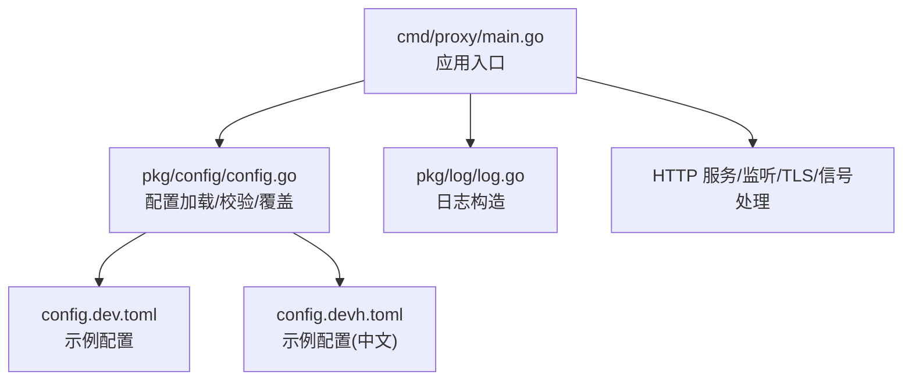
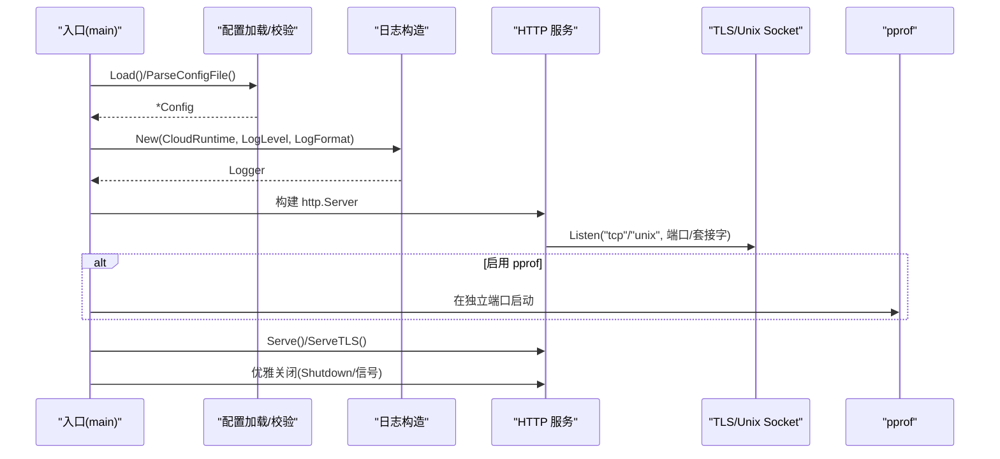
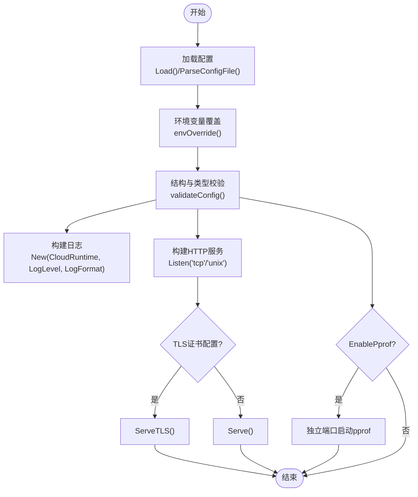

# 通用配置

<cite>
**本文引用的文件**
- [pkg/config/config.go](file://pkg/config/config.go)
- [pkg/config/timeout.go](file://pkg/config/timeout.go)
- [cmd/proxy/main.go](file://cmd/proxy/main.go)
- [pkg/log/log.go](file://pkg/log/log.go)
- [config.dev.toml](file://config.dev.toml)
- [config.devh.toml](file://config.devh.toml)
- [docs/content/configuration/logging.md](file://docs/content/configuration/logging.md)
- [docs/content/configuration/storage.md](file://docs/content/configuration/storage.md)
- [pkg/config/config_test.go](file://pkg/config/config_test.go)
</cite>

## 目录
1. [简介](#简介)
2. [项目结构](#项目结构)
3. [核心组件](#核心组件)
4. [架构总览](#架构总览)
5. [详细组件分析](#详细组件分析)
6. [依赖关系分析](#依赖关系分析)
7. [性能考量](#性能考量)
8. [故障排查指南](#故障排查指南)
9. [结论](#结论)
10. [附录](#附录)

## 简介
本文件系统性梳理 Athens 的“通用配置”选项，覆盖运行时、日志、网络、安全、调试、存储与索引等维度，明确每个配置项的作用、默认值、取值范围、使用场景、环境变量覆盖机制、配置验证规则，并给出典型部署场景下的配置组合建议与最佳实践。

## 项目结构
- 配置定义与加载：集中在 pkg/config 中，包含 Config 结构体、默认值、环境变量覆盖、配置校验与解析逻辑。
- 应用入口：cmd/proxy/main.go 加载配置、初始化日志、构建 HTTP 服务、按配置选择监听方式（TCP/Unix Socket）、TLS、pprof 等。
- 日志：pkg/log 提供基于 CloudRuntime 与 LogFormat 的日志格式化能力。
- 文档：docs/content/configuration 下提供日志、存储等专题文档，补充配置说明与示例。
- 示例配置：config.dev.toml 与 config.devh.toml 提供详尽的配置项注释与默认值参考。

图表来源
- [cmd/proxy/main.go](file://cmd/proxy/main.go#L29-L127)
- [pkg/config/config.go](file://pkg/config/config.go#L127-L254)
- [pkg/log/log.go](file://pkg/log/log.go#L17-L27)

章节来源
- [cmd/proxy/main.go](file://cmd/proxy/main.go#L29-L127)
- [pkg/config/config.go](file://pkg/config/config.go#L127-L254)
- [pkg/log/log.go](file://pkg/log/log.go#L17-L27)

## 核心组件
- 配置结构体 Config：集中承载运行时、日志、网络、安全、调试、存储、索引、超时等配置。
- 默认配置 defaultConfig：提供生产/开发模式下的默认值与行为。
- 环境变量覆盖 envOverride：优先级高于配置文件，支持 PORT 与 ATHENS_PORT 的特殊处理。
- 配置校验 validateConfig：结合结构体标签与嵌套结构校验存储/索引类型。
- 日志构造 New：依据 CloudRuntime 与 LogFormat 选择合适格式化器。

章节来源
- [pkg/config/config.go](file://pkg/config/config.go#L21-L66)
- [pkg/config/config.go](file://pkg/config/config.go#L146-L213)
- [pkg/config/config.go](file://pkg/config/config.go#L256-L280)
- [pkg/config/config.go](file://pkg/config/config.go#L282-L297)
- [pkg/log/log.go](file://pkg/log/log.go#L17-L27)

## 架构总览
下图展示了配置在应用生命周期中的作用链路：入口加载配置 -> 初始化日志 -> 构建 HTTP 服务（监听/HTTPS/Unix Socket）-> pprof/优雅关闭。

图表来源
- [cmd/proxy/main.go](file://cmd/proxy/main.go#L35-L127)
- [pkg/config/config.go](file://pkg/config/config.go#L127-L254)
- [pkg/log/log.go](file://pkg/log/log.go#L17-L27)

## 详细组件分析

### 运行时配置（GoEnv、GoBinary、GoGetWorkers、ProtocolWorkers、GoBinaryEnvVars、GoGetDir、Timeout）
- GoEnv
  - 作用：指示运行环境类型（development/production），影响日志与文件权限检查。
  - 默认值：development
  - 环境变量：GO_ENV
  - 使用场景：开发与生产环境差异化的日志与安全策略。
- GoBinary
  - 作用：指定 go 命令路径（可为 PATH 名称或绝对路径）。
  - 默认值：go
  - 环境变量：GO_BINARY_PATH
  - 使用场景：多版本 Go 或受限环境。
- GoGetWorkers
  - 作用：并发执行 go mod download 的工作数，控制磁盘/Git 并发。
  - 默认值：10
  - 环境变量：ATHENS_GOGET_WORKERS
  - 使用场景：低性能实例限制并发，避免资源耗尽。
- ProtocolWorkers
  - 作用：协议层并发处理请求数（与 GoGetWorkers 分离）。
  - 默认值：30
  - 环境变量：ATHENS_PROTOCOL_WORKERS
  - 使用场景：高并发下载协议请求。
- GoBinaryEnvVars
  - 作用：传递给 go 命令的环境变量列表；支持单个环境变量或以分号分隔的多值覆盖。
  - 默认值：["GOPROXY=direct"]
  - 环境变量：ATHENS_GO_BINARY_ENV_VARS
  - 使用场景：代理、私有仓库、调试开关等。
  - 验证规则：每项必须满足 key=value 格式；支持多等号（如 GODEBUG=netdns=cgo）。
- GoGetDir
  - 作用：模块拉取的临时目录，便于挂载大容量磁盘。
  - 默认值：空（使用系统临时目录）
  - 环境变量：ATHENS_GOGET_DIR
  - 使用场景：Kubernetes 等容器环境。
- Timeout
  - 作用：外部网络调用默认超时（秒），作为存储后端默认超时。
  - 默认值：300
  - 环境变量：ATHENS_TIMEOUT
  - 使用场景：网络不稳定或远端服务慢。

章节来源
- [pkg/config/config.go](file://pkg/config/config.go#L24-L29)
- [pkg/config/config.go](file://pkg/config/config.go#L146-L173)
- [pkg/config/config.go](file://pkg/config/config.go#L102-L125)
- [pkg/config/config.go](file://pkg/config/config.go#L256-L280)
- [pkg/config/timeout.go](file://pkg/config/timeout.go#L6-L18)
- [config.dev.toml](file://config.dev.toml#L8-L120)

### 日志配置（LogLevel、LogFormat、CloudRuntime）
- LogLevel
  - 作用：日志级别（debug/info/warn/error 等）。
  - 默认值：debug
  - 环境变量：ATHENS_LOG_LEVEL
  - 使用场景：开发调试与生产监控。
- LogFormat
  - 作用：日志输出格式（plain/json），仅在 CloudRuntime=none 时生效。
  - 默认值：plain
  - 环境变量：ATHENS_LOG_FORMAT
  - 使用场景：本地开发与云原生日志平台。
- CloudRuntime
  - 作用：云运行时（如 GCP），用于适配云日志字段命名。
  - 默认值：none
  - 环境变量：ATHENS_CLOUD_RUNTIME
  - 使用场景：GKE/Cloud Run 等平台。

章节来源
- [pkg/config/config.go](file://pkg/config/config.go#L30-L32)
- [pkg/config/config.go](file://pkg/config/config.go#L146-L173)
- [pkg/log/log.go](file://pkg/log/log.go#L17-L27)
- [docs/content/configuration/logging.md](file://docs/content/configuration/logging.md#L11-L17)

### 网络配置（Port、UnixSocket、ForceSSL、TLSCertFile、TLSKeyFile）
- Port
  - 作用：监听端口；支持数字或带冒号的字符串；PORT 优先于 ATHENS_PORT。
  - 默认值：:3000
  - 环境变量：ATHENS_PORT 或 PORT
  - 使用场景：容器编排与反向代理。
- UnixSocket
  - 作用：Unix 域套接字路径；若设置则优先于 TCP。
  - 默认值：空
  - 环境变量：ATHENS_UNIX_SOCKET
  - 使用场景：本地进程间通信。
- ForceSSL
  - 作用：强制 SSL 重定向。
  - 默认值：false
  - 环境变量：PROXY_FORCE_SSL
  - 使用场景：反向代理前置 HTTPS。
- TLSCertFile / TLSKeyFile
  - 作用：启用 HTTPS 所需的证书与私钥文件路径。
  - 默认值：空（禁用 HTTPS）
  - 环境变量：ATHENS_TLSCERT_FILE / ATHENS_TLSKEY_FILE
  - 使用场景：生产 HTTPS。

章节来源
- [pkg/config/config.go](file://pkg/config/config.go#L41-L46)
- [pkg/config/config.go](file://pkg/config/config.go#L256-L280)
- [cmd/proxy/main.go](file://cmd/proxy/main.go#L80-L114)
- [config.dev.toml](file://config.dev.toml#L128-L143)

### 安全配置（BasicAuthUser、BasicAuthPass、PathPrefix、NETRCPath、GithubToken、HGRCPath）
- BasicAuthUser / BasicAuthPass
  - 作用：Basic 认证用户名与密码（Go 命令暂不原生支持，存在泄露风险）。
  - 默认值：空
  - 环境变量：BASIC_AUTH_USER / BASIC_AUTH_PASS
  - 使用场景：过渡期保护。
- PathPrefix
  - 作用：为代理设置路径前缀（如 /proxy）。
  - 默认值：空
  - 环境变量：ATHENS_PATH_PREFIX
  - 使用场景：多服务共用域名。
- NETRCPath / HGRCPath
  - 作用：.netrc/.hgrc 文件路径，便于私有仓库认证。
  - 默认值：空
  - 环境变量：ATHENS_NETRC_PATH / ATHENS_HGRC_PATH
  - 使用场景：容器内挂载凭证。
- GithubToken
  - 作用：替代 .netrc，简化 GitHub 私有仓库访问。
  - 默认值：空
  - 环境变量：ATHENS_GITHUB_TOKEN
  - 使用场景：CI/平台集成。

章节来源
- [pkg/config/config.go](file://pkg/config/config.go#L43-L51)
- [config.dev.toml](file://config.dev.toml#L155-L216)

### 调试配置（EnablePprof、PprofPort）
- EnablePprof
  - 作用：是否启用 pprof 性能分析端点。
  - 默认值：false
  - 环境变量：ATHENS_ENABLE_PPROF
  - 使用场景：定位性能瓶颈。
- PprofPort
  - 作用：pprof 独立监听端口。
  - 默认值：:3001
  - 环境变量：ATHENS_PPROF_PORT
  - 使用场景：与业务端口隔离。

章节来源
- [pkg/config/config.go](file://pkg/config/config.go#L33-L34)
- [pkg/config/config.go](file://pkg/config/config.go#L146-L173)
- [cmd/proxy/main.go](file://cmd/proxy/main.go#L69-L77)

### 存储与索引（StorageType、IndexType、SingleFlightType、各后端配置）
- StorageType
  - 作用：存储后端类型（memory/disk/mongo/gcp/minio/s3/azureblob/external）。
  - 默认值：memory
  - 环境变量：ATHENS_STORAGE_TYPE
  - 使用场景：开发/生产/私有云。
- IndexType
  - 作用：索引后端类型（none/memory/mysql/postgres）。
  - 默认值：none
  - 环境变量：ATHENS_INDEX_TYPE
  - 使用场景：版本列表聚合与查询。
- SingleFlightType
  - 作用：并发写入控制（memory/etcd/redis/redis-sentinel/gcp/azureblob）。
  - 默认值：memory
  - 环境变量：ATHENS_SINGLE_FLIGHT_TYPE
  - 使用场景：多实例共享存储时避免重复写入。

章节来源
- [pkg/config/config.go](file://pkg/config/config.go#L39-L62)
- [pkg/config/config.go](file://pkg/config/config.go#L299-L333)
- [docs/content/configuration/storage.md](file://docs/content/configuration/storage.md#L38-L530)

### 其他通用配置
- GlobalEndpoint
  - 作用：上游代理地址（用于缓存未命中的回源）。
  - 默认值：http://localhost:3001
  - 环境变量：ATHENS_GLOBAL_ENDPOINT
- HomeTemplatePath
  - 作用：首页模板路径。
  - 默认值：/var/lib/athens/home.html
  - 环境变量：ATHENS_HOME_TEMPLATE_PATH
- FilterFile
  - 作用：包含/排除过滤器文件。
  - 默认值：空
  - 环境变量：ATHENS_FILTER_FILE
- RobotsFile
  - 作用：robots.txt 文件名。
  - 默认值：robots.txt
  - 环境变量：ATHENS_ROBOTS_FILE
- DownloadMode / DownloadURL
  - 作用：模块未命中时的处理策略与重定向目标。
  - 默认值：sync / 空
  - 环境变量：ATHENS_DOWNLOAD_MODE / ATHENS_DOWNLOAD_URL
- NetworkMode
  - 作用：/list 端点的合并策略（strict/offline/fallback）。
  - 默认值：strict
  - 环境变量：ATHENS_NETWORK_MODE
- ShutdownTimeout
  - 作用：优雅关闭等待时间（秒）。
  - 默认值：60
  - 环境变量：ATHENS_SHUTDOWN_TIMEOUT

章节来源
- [pkg/config/config.go](file://pkg/config/config.go#L40-L62)
- [pkg/config/config.go](file://pkg/config/config.go#L146-L173)
- [config.dev.toml](file://config.dev.toml#L145-L288)

## 依赖关系分析
- 配置加载与覆盖
  - 优先级：环境变量 > 配置文件 > 默认值。
  - 特殊处理：PORT 优先于 ATHENS_PORT；若均未设置，使用默认端口。
- 配置校验
  - 结构体标签驱动（required、oneof、required_without 等）。
  - 存储/索引类型校验：根据 StorageType/IndexType 对应结构体进行验证。
- 日志与运行时
  - CloudRuntime 控制日志格式器选择；LogFormat 仅在 CloudRuntime=none 生效。
- 网络与安全
  - UnixSocket 优先于 TCP；TLS 与证书文件同时设置才启用 HTTPS。
- 并发与一致性
  - SingleFlightType 决定分布式锁机制，影响多实例共享存储的一致性。

图表来源
- [pkg/config/config.go](file://pkg/config/config.go#L127-L280)
- [pkg/config/config.go](file://pkg/config/config.go#L282-L297)
- [pkg/log/log.go](file://pkg/log/log.go#L17-L27)
- [cmd/proxy/main.go](file://cmd/proxy/main.go#L69-L114)

章节来源
- [pkg/config/config.go](file://pkg/config/config.go#L127-L280)
- [pkg/config/config.go](file://pkg/config/config.go#L282-L297)
- [pkg/log/log.go](file://pkg/log/log.go#L17-L27)
- [cmd/proxy/main.go](file://cmd/proxy/main.go#L69-L114)

## 性能考量
- 并发控制
  - GoGetWorkers 与 ProtocolWorkers 需结合 CPU/磁盘/Git 并发能力调整，避免资源争用。
- 网络超时
  - Timeout 影响存储后端与上游请求的响应时间，建议根据网络状况与后端性能设置。
- pprof
  - EnablePprof 仅在诊断阶段开启，避免暴露与性能开销。
- 单飞机制
  - 多实例共享存储时，选择合适的 SingleFlightType（etcd/redis 等）以降低重复写入与冲突。

[本节为通用指导，无需特定文件引用]

## 故障排查指南
- 端口与监听
  - 若设置 UnixSocket，将忽略 TCP 端口；若未设置，确认 Port/PORT 是否正确（支持纯数字或带冒号）。
- TLS 与证书
  - 同时设置 TLSCertFile 与 TLSKeyFile 才会启用 HTTPS；否则使用明文 HTTP。
- 日志格式
  - CloudRuntime=none 时 LogFormat 生效；否则按云平台格式器输出。
- 权限与安全
  - 生产环境配置文件与过滤器文件需满足最小权限；检查文件权限掩码。
- 环境变量覆盖
  - 确认环境变量拼写与分号分隔（GoBinaryEnvVars）；PORT 优先于 ATHENS_PORT。
- 配置校验
  - StorageType/IndexType 必须与对应配置结构体匹配；NetworkMode 仅允许 strict/offline/fallback。

章节来源
- [pkg/config/config.go](file://pkg/config/config.go#L256-L280)
- [pkg/config/config.go](file://pkg/config/config.go#L282-L297)
- [pkg/config/config_test.go](file://pkg/config/config_test.go#L418-L490)
- [pkg/config/config_test.go](file://pkg/config/config_test.go#L128-L158)

## 结论
本文系统梳理了 Athens 的通用配置选项，明确了默认值、取值范围、环境变量覆盖与校验规则，并提供了典型部署场景下的配置组合思路。建议在生产环境严格控制日志与文件权限，合理设置并发与超时，谨慎启用 pprof，并根据部署形态选择合适的存储与单飞机制。

[本节为总结，无需特定文件引用]

## 附录

### 配置项一览与默认值（摘要）
- 运行时
  - GoEnv: development
  - GoBinary: go
  - GoGetWorkers: 10
  - ProtocolWorkers: 30
  - GoBinaryEnvVars: ["GOPROXY=direct"]
  - GoGetDir: 空
  - Timeout: 300
- 日志
  - LogLevel: debug
  - LogFormat: plain
  - CloudRuntime: none
- 网络
  - Port: :3000
  - UnixSocket: 空
  - ForceSSL: false
  - TLSCertFile/TLSKeyFile: 空
- 安全
  - BasicAuthUser/Pass: 空
  - PathPrefix: 空
  - NETRCPath/HGRCPath: 空
  - GithubToken: 空
- 调试
  - EnablePprof: false
  - PprofPort: :3001
- 存储/索引/并发
  - StorageType: memory
  - IndexType: none
  - SingleFlightType: memory
  - NetworkMode: strict
  - ShutdownTimeout: 60
  - DownloadMode: sync
  - DownloadURL: 空
  - FilterFile/RobotsFile/HomeTemplatePath: 见默认

章节来源
- [pkg/config/config.go](file://pkg/config/config.go#L146-L173)
- [config.dev.toml](file://config.dev.toml#L1-L297)

### 环境变量覆盖与示例
- 通用覆盖规则
  - 环境变量优先于配置文件；PORT 优先于 ATHENS_PORT。
  - GoBinaryEnvVars 使用分号分隔多值，且整体覆盖而非合并。
- 示例
  - 开发环境：GoEnv=development、LogLevel=debug、LogFormat=plain、Port=:3000、StorageType=memory。
  - 生产环境：GoEnv=production、LogLevel=info、CloudRuntime=GCP、ForceSSL=true、TLSCertFile/TLSKeyFile=已配置、StorageType=mongo/redis/etcd 等。

章节来源
- [pkg/config/config.go](file://pkg/config/config.go#L256-L280)
- [pkg/config/config_test.go](file://pkg/config/config_test.go#L70-L113)
- [config.dev.toml](file://config.dev.toml#L1-L297)

### 配置验证规则
- 必填字段：GoEnv、GoBinary、GoGetWorkers、ProtocolWorkers、LogLevel、LogFormat、CloudRuntime、StorageType、TimeoutConf.Timeout 等。
- 互斥/依赖：LogFormat 仅在 CloudRuntime=none 生效；TLS 需同时提供证书与私钥；StorageType/IndexType 需与对应配置结构体匹配。
- 网络模式：NetworkMode 仅允许 strict/offline/fallback。

章节来源
- [pkg/config/config.go](file://pkg/config/config.go#L24-L62)
- [pkg/config/config.go](file://pkg/config/config.go#L282-L297)
- [pkg/config/config_test.go](file://pkg/config/config_test.go#L636-L655)