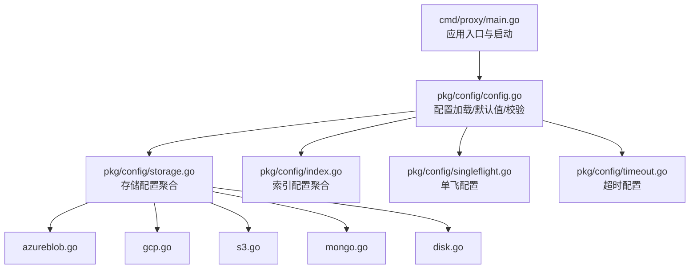
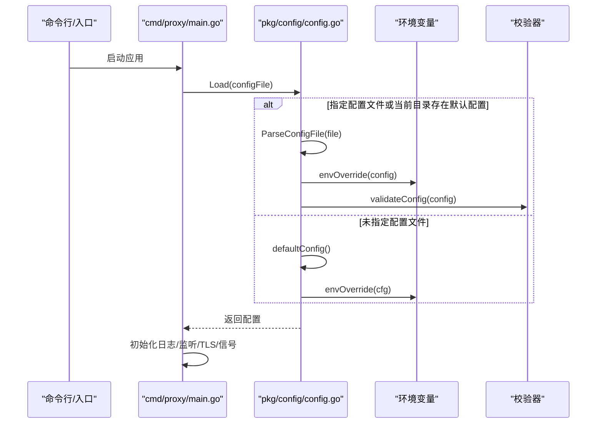
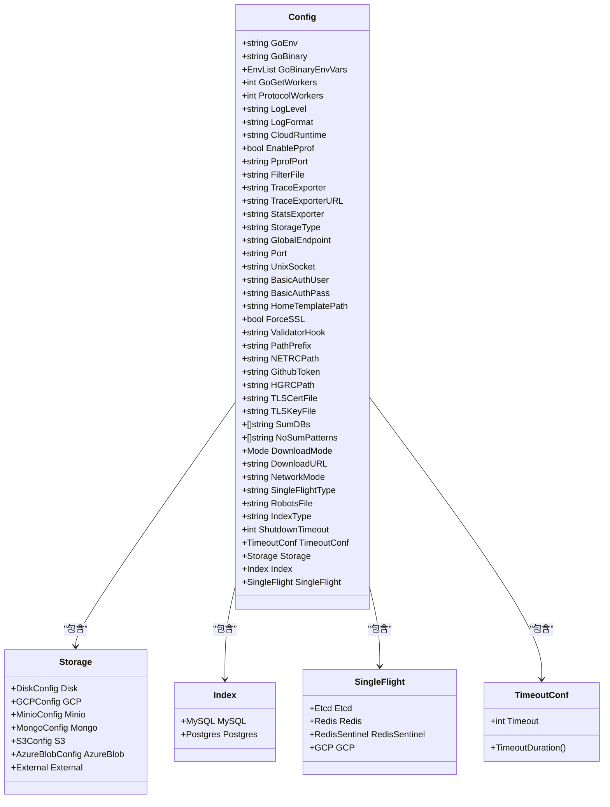

# 配置参考

<cite>
**本文引用的文件**
- [pkg/config/config.go](file://pkg/config/config.go)
- [pkg/config/storage.go](file://pkg/config/storage.go)
- [pkg/config/index.go](file://pkg/config/index.go)
- [pkg/config/singleflight.go](file://pkg/config/singleflight.go)
- [pkg/config/timeout.go](file://pkg/config/timeout.go)
- [pkg/config/azureblob.go](file://pkg/config/azureblob.go)
- [pkg/config/gcp.go](file://pkg/config/gcp.go)
- [pkg/config/s3.go](file://pkg/config/s3.go)
- [pkg/config/mongo.go](file://pkg/config/mongo.go)
- [pkg/config/disk.go](file://pkg/config/disk.go)
- [cmd/proxy/main.go](file://cmd/proxy/main.go)
- [config.dev.toml](file://config.dev.toml)
- [config.devh.toml](file://config.devh.toml)
</cite>

## 目录
1. [简介](#简介)
2. [项目结构](#项目结构)
3. [核心组件](#核心组件)
4. [架构总览](#架构总览)
5. [详细组件分析](#详细组件分析)
6. [依赖关系分析](#依赖关系分析)
7. [性能考量](#性能考量)
8. [故障排查指南](#故障排查指南)
9. [结论](#结论)
10. [附录](#附录)

## 简介
本文件为 Athens 的全面配置参考，覆盖配置文件格式、字段定义、默认值、环境变量覆盖机制、优先级规则、动态更新能力、配置验证与常见错误排查，以及各配置项的实际使用场景与最佳实践。内容基于代码实现与示例配置文件整理而成，帮助读者在不同场景下正确选择与组合配置。

## 项目结构
与配置相关的核心代码与示例配置分布如下：
- 配置加载与默认值：pkg/config/config.go
- 存储后端配置聚合：pkg/config/storage.go
- 索引后端配置聚合：pkg/config/index.go
- 单飞机制（并发控制）配置：pkg/config/singleflight.go
- 超时通用配置：pkg/config/timeout.go
- 各存储后端具体配置结构体：azureblob.go、gcp.go、s3.go、mongo.go、disk.go
- 应用入口与配置解析流程：cmd/proxy/main.go
- 示例配置文件：config.dev.toml、config.devh.toml

图表来源
- [cmd/proxy/main.go](file://cmd/proxy/main.go#L29-L127)
- [pkg/config/config.go](file://pkg/config/config.go#L127-L254)
- [pkg/config/storage.go](file://pkg/config/storage.go#L3-L12)
- [pkg/config/index.go](file://pkg/config/index.go#L3-L7)
- [pkg/config/singleflight.go](file://pkg/config/singleflight.go#L6-L11)
- [pkg/config/timeout.go](file://pkg/config/timeout.go#L6-L18)
- [pkg/config/azureblob.go](file://pkg/config/azureblob.go#L4-L10)
- [pkg/config/gcp.go](file://pkg/config/gcp.go#L4-L8)
- [pkg/config/s3.go](file://pkg/config/s3.go#L4-L15)
- [pkg/config/mongo.go](file://pkg/config/mongo.go#L4-L10)
- [pkg/config/disk.go](file://pkg/config/disk.go#L4-L6)

章节来源
- [cmd/proxy/main.go](file://cmd/proxy/main.go#L29-L127)
- [pkg/config/config.go](file://pkg/config/config.go#L127-L254)

## 核心组件
- 配置主结构体 Config：承载全局运行参数、日志、监控、存储、索引、单飞、网络模式、下载模式、超时等。
- 存储配置 Storage：按 StorageType 聚合各后端配置（磁盘、GCS、MinIO、Mongo、S3、AzureBlob、External）。
- 索引配置 Index：按 IndexType 聚合 MySQL、Postgres。
- 单飞配置 SingleFlight：Etcd、Redis、Redis-Sentinel、GCP。
- 超时配置 TimeoutConf：统一超时行为。

章节来源
- [pkg/config/config.go](file://pkg/config/config.go#L22-L66)
- [pkg/config/storage.go](file://pkg/config/storage.go#L3-L12)
- [pkg/config/index.go](file://pkg/config/index.go#L3-L7)
- [pkg/config/singleflight.go](file://pkg/config/singleflight.go#L6-L11)
- [pkg/config/timeout.go](file://pkg/config/timeout.go#L6-L18)

## 架构总览
配置加载与生效流程如下：

图表来源
- [cmd/proxy/main.go](file://cmd/proxy/main.go#L29-L127)
- [pkg/config/config.go](file://pkg/config/config.go#L127-L254)

## 详细组件分析

### 配置文件格式与默认值
- 文件格式：TOML（示例文件为 config.dev.toml、config.devh.toml）。
- 默认值来源：未显式提供配置文件时，使用 defaultConfig() 提供的默认值；随后应用环境变量覆盖。
- 加载优先级：
  1) 显式 -config_file 指定的配置文件；
  2) 当前目录下的默认文件名；
  3) 使用内置默认值并应用环境变量覆盖。

章节来源
- [pkg/config/config.go](file://pkg/config/config.go#L19-L144)
- [config.dev.toml](file://config.dev.toml#L1-L10)
- [config.devh.toml](file://config.devh.toml#L1-L6)

### 字段定义与默认值总览
以下为关键字段与默认值（来源于默认配置与注释），并标注环境变量覆盖与校验约束。为避免冗长，此处给出要点清单，详细说明见后续小节。

- 运行与网络
  - GoEnv: development（环境类型）
  - GoBinary: go（Go 可执行路径）
  - GoBinaryEnvVars: ["GOPROXY=direct"]（传递给 go 命令的环境变量列表）
  - GoGetWorkers: 10（并发 go mod download 数）
  - ProtocolWorkers: 30（协议层并发）
  - Port: :3000（监听端口，支持数字或“:端口”）
  - UnixSocket: 空（优先于 TCP）
  - TLSCertFile/TLSKeyFile: 空（启用 HTTPS）
  - ForceSSL: false（强制 SSL 重定向）
  - PathPrefix: 空（路径前缀）
  - RobotsFile: robots.txt（robots 文件）
  - ShutdownTimeout: 60（优雅关停超时，秒）

- 日志与监控
  - LogLevel: debug（日志级别）
  - LogFormat: plain（CloudRuntime=none 时生效；可选 json/空）
  - CloudRuntime: none（云运行时：none/GCP）
  - EnablePprof: false（pprof 开关）
  - PprofPort: :3001（pprof 端口）
  - TraceExporter: 空（追踪导出器）
  - TraceExporterURL: http://localhost:14268（追踪导出地址）
  - StatsExporter: prometheus（指标导出器）

- 下载与网络模式
  - DownloadMode: sync（同步下载）
  - DownloadURL: 空（重定向模式的目标 URL）
  - NetworkMode: strict（严格/离线/回退）
  - GlobalEndpoint: http://localhost:3001（上游代理）
  - FilterFile: 空（包含/排除过滤器）
  - HomeTemplatePath: /var/lib/athens/home.html（首页模板）
  - ValidatorHook: 空（模块校验钩子）
  - SumDBs: ["https://sum.golang.org"]（校验 DB 列表）
  - NoSumPatterns: []（禁用 SumDB 的模式列表）

- 存储与索引
  - StorageType: memory（后端类型）
  - IndexType: none（索引类型）
  - Timeout: 300（秒，外部调用超时，默认值）
  - SingleFlightType: memory（单飞类型）

章节来源
- [pkg/config/config.go](file://pkg/config/config.go#L146-L213)
- [pkg/config/timeout.go](file://pkg/config/timeout.go#L6-L18)
- [config.dev.toml](file://config.dev.toml#L13-L327)
- [config.devh.toml](file://config.devh.toml#L13-L283)

### 环境变量覆盖与优先级
- 环境变量覆盖顺序：
  1) 若显式设置了 ATHENS_PORT，则覆盖 PORT；
  2) 若仅设置了 PORT 且未设置 ATHENS_PORT，则使用 PORT；
  3) 若两者都未设置，则使用默认端口。
- 特殊处理：端口格式自动补全（若仅提供数字，自动加前缀“:”）。
- 环境变量覆盖范围：所有带 envconfig 标签的字段均可被覆盖；多值列表（如 GoBinaryEnvVars）通过分号分隔的单个变量传入，会整体覆盖而非拼接。

章节来源
- [pkg/config/config.go](file://pkg/config/config.go#L256-L280)
- [config.dev.toml](file://config.dev.toml#L31-L45)

### 配置验证与错误处理
- 结构体校验：使用结构体校验器对非嵌套字段进行校验；对 Storage 与 Index 的具体后端配置按类型分别校验。
- 文件权限检查：生产环境下会对配置文件与过滤器文件进行权限检查（非 Windows 平台）。
- 常见校验失败原因：
  - 缺少必填字段（如 S3 的 Region、Bucket，GCP 的 Bucket，AzureBlob 的 AccountName/ContainerName 等）。
  - 端口格式不合法。
  - 日志格式与云运行时组合不满足条件（例如 LogFormat 与 CloudRuntime 的互斥要求）。

章节来源
- [pkg/config/config.go](file://pkg/config/config.go#L282-L333)
- [pkg/config/config.go](file://pkg/config/config.go#L349-L375)

### 存储后端配置
- 支持类型：memory、disk、mongo、gcp、minio、s3、azureblob、external。
- 对应配置结构体：
  - Disk：RootPath（必填）
  - GCP：ProjectID、Bucket（必填）、JSONKey
  - S3：Region（必填）、Key、Secret、Token、Bucket（必填）、UseDefaultConfiguration、ForcePathStyle、CredentialsEndpoint、AwsContainerCredentialsRelativeURI、Endpoint
  - Mongo：URL（必填）、DefaultDBName、DefaultCollectionName、CertPath、InsecureConn
  - AzureBlob：AccountName（必填）、AccountKey、ManagedIdentityResourceID、CredentialScope、ContainerName（必填）
  - External：URL
- 默认值与校验：StorageType 决定仅加载对应后端配置；未提供的后端字段按其结构体默认值或校验规则生效。

章节来源
- [pkg/config/storage.go](file://pkg/config/storage.go#L3-L12)
- [pkg/config/disk.go](file://pkg/config/disk.go#L4-L6)
- [pkg/config/gcp.go](file://pkg/config/gcp.go#L4-L8)
- [pkg/config/s3.go](file://pkg/config/s3.go#L4-L15)
- [pkg/config/mongo.go](file://pkg/config/mongo.go#L4-L10)
- [pkg/config/azureblob.go](file://pkg/config/azureblob.go#L4-L10)
- [pkg/config/config.go](file://pkg/config/config.go#L299-L320)

### 认证与安全配置
- 基本认证：BasicAuthUser、BasicAuthPass（同时存在才启用）。
- TLS：TLSCertFile、TLSKeyFile 同时设置启用 HTTPS。
- 强制 SSL：ForceSSL=true 时强制重定向至 HTTPS。
- 私有仓库凭证：
  - NETRCPath：.netrc 文件路径（部署场景中常用于挂载到安全位置再移动到用户目录）。
  - GithubToken：替代 .netrc，便于平台（如 GAE）仅提供令牌。
  - HGRCPath：.hgrc 文件路径。

章节来源
- [pkg/config/config.go](file://pkg/config/config.go#L215-L222)
- [config.dev.toml](file://config.dev.toml#L128-L216)
- [config.devh.toml](file://config.devh.toml#L112-L192)

### 监控与可观测性配置
- 日志：LogLevel（日志级别）、LogFormat（plain/json）、CloudRuntime（none/GCP）。
- pprof：EnablePprof、PprofPort。
- 追踪：TraceExporter（jaeger/datadog/stackdriver）、TraceExporterURL。
- 指标：StatsExporter（prometheus）。
- 单飞：SingleFlightType（memory/etcd/redis/redis-sentinel/gcp/azureblob），并可配置相应后端参数。

章节来源
- [pkg/config/config.go](file://pkg/config/config.go#L30-L38)
- [pkg/config/singleflight.go](file://pkg/config/singleflight.go#L6-L11)
- [config.dev.toml](file://config.dev.toml#L86-L234)
- [config.devh.toml](file://config.devh.toml#L70-L210)

### 日志配置
- 日志级别：支持所有 logrus 级别（如 debug、info、warn、error 等）。
- 输出格式：CloudRuntime=none 时可选 json/plain；否则由云运行时决定。
- 标准库桥接：将标准日志输出重定向到 logrus，保持统一格式。

章节来源
- [cmd/proxy/main.go](file://cmd/proxy/main.go#L40-L57)
- [pkg/config/config.go](file://pkg/config/config.go#L30-L31)

### 下载与网络模式
- DownloadMode：sync/async/redirect/async_redirect/none，以及基于文件或内联 HCL 的动态策略。
- NetworkMode：strict/offline/fallback，影响 /list 等端点行为与错误提示。
- DownloadURL：当 DownloadMode 为 redirect 时生效。
- GlobalEndpoint + FilterFile：配合上游代理与过滤器使用。

章节来源
- [pkg/config/config.go](file://pkg/config/config.go#L56-L62)
- [config.dev.toml](file://config.dev.toml#L250-L288)
- [config.devh.toml](file://config.devh.toml#L224-L252)

### 单飞（并发控制）配置
- SingleFlightType：memory/etcd/redis/redis-sentinel/gcp/azureblob。
- Etcd：Endpoints（逗号分隔）。
- Redis：Endpoint、Password、LockConfig（TTL/Timeout/MaxRetries）。
- Redis-Sentinel：Endpoints、MasterName、SentinelPassword、RedisUsername/Password、LockConfig。
- GCP：StaleThreshold（过期阈值）。

章节来源
- [pkg/config/singleflight.go](file://pkg/config/singleflight.go#L6-L65)
- [config.dev.toml](file://config.dev.toml#L290-L391)
- [config.devh.toml](file://config.devh.toml#L254-L342)

### 超时配置
- TimeoutConf：Timeout（秒），统一用于外部网络调用。
- 作用范围：若各后端未单独设置超时，将使用该默认值。

章节来源
- [pkg/config/timeout.go](file://pkg/config/timeout.go#L6-L18)
- [pkg/config/config.go](file://pkg/config/config.go#L159)

### 动态配置更新支持
- 说明：配置加载后即固化，不支持运行时热重载。如需变更，需重启服务。
- 建议：通过环境变量在不同部署阶段覆盖配置，减少频繁修改配置文件带来的风险。

章节来源
- [pkg/config/config.go](file://pkg/config/config.go#L127-L144)

## 依赖关系分析

图表来源
- [pkg/config/config.go](file://pkg/config/config.go#L22-L66)
- [pkg/config/storage.go](file://pkg/config/storage.go#L3-L12)
- [pkg/config/index.go](file://pkg/config/index.go#L3-L7)
- [pkg/config/singleflight.go](file://pkg/config/singleflight.go#L6-L11)
- [pkg/config/timeout.go](file://pkg/config/timeout.go#L6-L18)

章节来源
- [pkg/config/config.go](file://pkg/config/config.go#L22-L66)

## 性能考量
- 并发参数：
  - GoGetWorkers：受磁盘与网络 I/O 影响，建议结合实例性能与存储后端能力调整。
  - ProtocolWorkers：协议层并发，避免过高导致上游压力过大。
- 存储后端：
  - 云存储（S3/GCS/AzureBlob）通常具备更高吞吐与可靠性，适合生产。
  - 本地磁盘适合开发与小规模测试。
- 单飞机制：
  - 高并发场景建议使用 etcd/redis/redis-sentinel/GCP/AzureBlob，避免重复写入。
- 日志与监控：
  - 生产环境建议开启 pprof 与指标导出，但仅在受控端口暴露。
  - 日志级别按环境调整，避免 debug 造成性能损耗。

## 故障排查指南
- 配置加载失败
  - 症状：启动时报错无法加载配置。
  - 排查：确认配置文件路径、权限与 TOML 语法；检查必填字段是否缺失。
- 端口冲突或格式错误
  - 症状：无法绑定端口或启动失败。
  - 排查：确认 Port/UnixSocket 设置；端口支持“:端口”或纯数字格式。
- 权限问题（生产环境）
  - 症状：启动报文件权限警告或异常。
  - 排查：检查配置文件与过滤器文件权限掩码，确保最小权限。
- 存储后端连接失败
  - 症状：无法连接 MongoDB/S3/GCS/AzureBlob。
  - 排查：核对连接串、密钥、区域、桶名、容器名等；确认网络可达性。
- 日志级别/格式异常
  - 症状：日志输出不符合预期。
  - 排查：确认 CloudRuntime 与 LogFormat 组合；检查日志级别设置。
- 单飞锁冲突
  - 症状：并发写入冲突或锁获取失败。
  - 排查：检查 Redis/Etcd/GCP/AzureBlob 配置；调整 LockConfig 参数。

章节来源
- [pkg/config/config.go](file://pkg/config/config.go#L243-L247)
- [pkg/config/config.go](file://pkg/config/config.go#L349-L375)
- [pkg/config/config.go](file://pkg/config/config.go#L282-L297)

## 结论
本配置参考系统梳理了 Athens 的配置体系，明确了字段定义、默认值、环境变量覆盖与优先级、验证规则及常见问题排查方法。建议在生产环境优先使用云存储与单飞机制，合理设置并发参数与日志级别，并通过环境变量在不同部署阶段灵活覆盖配置。

## 附录

### 配置示例与场景
- 开发环境（默认）
  - 使用默认配置与 plain 日志，端口 :3000，存储 memory。
  - 适用：快速启动与本地调试。
- 生产环境（云存储）
  - 选择 S3/GCS/AzureBlob 之一作为存储后端，设置 Region/Bucket/密钥等。
  - 启用 pprof 与指标导出，设置合适的日志级别。
  - 适用：高可用与弹性扩展。
- 上游代理与过滤
  - 设置 GlobalEndpoint 与 FilterFile，实现模块白名单/黑名单策略。
  - 适用：企业内网镜像与合规控制。
- 单飞与并发
  - 高并发场景启用 etcd/redis/redis-sentinel/GCP/AzureBlob 单飞。
  - 适用：多实例部署与防抖并发写入。

章节来源
- [config.dev.toml](file://config.dev.toml#L1-L628)
- [config.devh.toml](file://config.devh.toml#L1-L549)