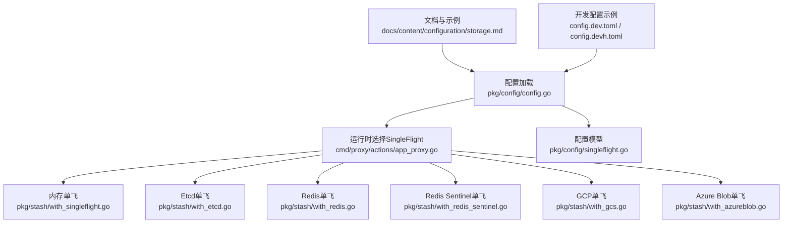
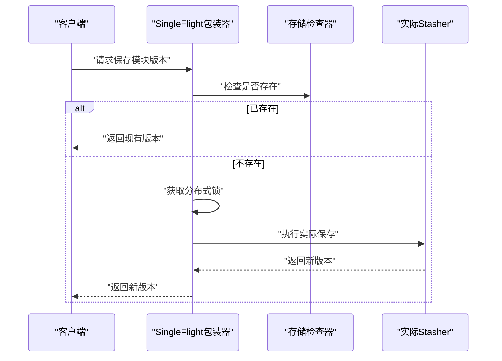
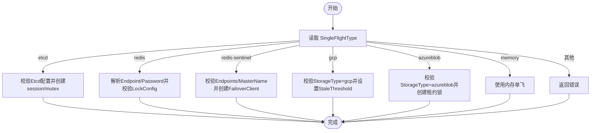
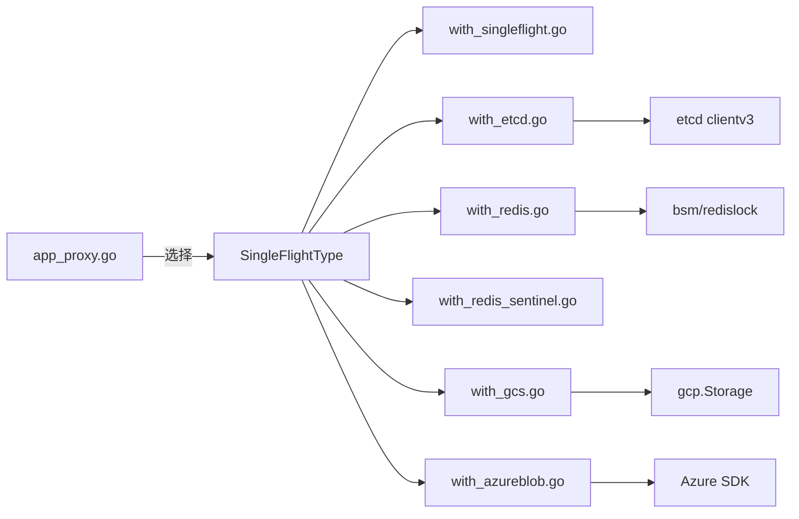

# SingleFlight分布式锁配置

<cite>
**本文档引用的文件**
- [pkg/config/singleflight.go](file://pkg/config/singleflight.go)
- [pkg/config/config.go](file://pkg/config/config.go)
- [cmd/proxy/actions/app_proxy.go](file://cmd/proxy/actions/app_proxy.go)
- [pkg/stash/with_singleflight.go](file://pkg/stash/with_singleflight.go)
- [pkg/stash/with_etcd.go](file://pkg/stash/with_etcd.go)
- [pkg/stash/with_redis.go](file://pkg/stash/with_redis.go)
- [pkg/stash/with_redis_sentinel.go](file://pkg/stash/with_redis_sentinel.go)
- [pkg/stash/with_gcs.go](file://pkg/stash/with_gcs.go)
- [pkg/stash/with_azureblob.go](file://pkg/stash/with_azureblob.go)
- [docs/content/configuration/storage.md](file://docs/content/configuration/storage.md)
- [config.dev.toml](file://config.dev.toml)
- [config.devh.toml](file://config.devh.toml)
- [pkg/stash/with_singleflight_test.go](file://pkg/stash/with_singleflight_test.go)
- [pkg/config/config_test.go](file://pkg/config/config_test.go)
- [pkg/observ/observ.go](file://pkg/observ/observ.go)
- [pkg/observ/stats.go](file://pkg/observ/stats.go)
</cite>

## 目录
1. [简介](#简介)
2. [项目结构](#项目结构)
3. [核心组件](#核心组件)
4. [架构总览](#架构总览)
5. [详细组件分析](#详细组件分析)
6. [依赖关系分析](#依赖关系分析)
7. [性能考量](#性能考量)
8. [故障排查指南](#故障排查指南)
9. [结论](#结论)
10. [附录](#附录)

## 简介
本文件系统性阐述 Athens 中 SingleFlight 分布式锁的配置与使用，覆盖配置项、锁类型选择、集群部署要点、各后端（Etcd、Redis、Redis Sentinel、GCP、Azure Blob）的配置方法与切换流程，并解释性能特征、故障处理与一致性保障。同时提供监控、调试与最佳实践建议，以及超时、重试与错误处理策略。

## 项目结构
SingleFlight 的配置与实现主要分布在以下模块：
- 配置模型与默认值：pkg/config/singleflight.go、pkg/config/config.go
- 运行时选择与装配：cmd/proxy/actions/app_proxy.go
- 各后端实现：pkg/stash/with_etcd.go、with_redis.go、with_redis_sentinel.go、with_gcs.go、with_azureblob.go
- 文档与示例：docs/content/configuration/storage.md、config.dev.toml、config.devh.toml
- 监控与可观测性：pkg/observ/observ.go、pkg/observ/stats.go

图表来源
- [pkg/config/config.go](file://pkg/config/config.go#L146-L213)
- [cmd/proxy/actions/app_proxy.go](file://cmd/proxy/actions/app_proxy.go#L167-L220)
- [pkg/config/singleflight.go](file://pkg/config/singleflight.go#L6-L11)

章节来源
- [pkg/config/config.go](file://pkg/config/config.go#L146-L213)
- [cmd/proxy/actions/app_proxy.go](file://cmd/proxy/actions/app_proxy.go#L167-L220)
- [pkg/config/singleflight.go](file://pkg/config/singleflight.go#L6-L11)

## 核心组件
- SingleFlight 配置模型：定义支持的后端及各自配置项，包括 Etcd、Redis、Redis Sentinel、GCP。
- 默认配置：dev 模式下提供默认后端参数，便于快速启动。
- 运行时装配：根据配置选择具体后端实现并注入到 stash 流水线。
- 各后端实现：Etcd 使用 mutex；Redis/Redis Sentinel 使用 redislock；GCP/Azure Blob 基于存储后端特性实现租约/锁。

章节来源
- [pkg/config/singleflight.go](file://pkg/config/singleflight.go#L6-L65)
- [pkg/config/config.go](file://pkg/config/config.go#L146-L213)
- [cmd/proxy/actions/app_proxy.go](file://cmd/proxy/actions/app_proxy.go#L167-L220)

## 架构总览
SingleFlight 在请求进入 stash 流程前进行“单飞”控制，确保同一模块版本在同一时刻仅由一个请求执行实际的下载与保存操作，其他并发请求等待结果。

图表来源
- [pkg/stash/with_etcd.go](file://pkg/stash/with_etcd.go#L37-L68)
- [pkg/stash/with_redis.go](file://pkg/stash/with_redis.go#L105-L139)
- [pkg/stash/with_gcs.go](file://pkg/stash/with_gcs.go#L37-L50)
- [pkg/stash/with_azureblob.go](file://pkg/stash/with_azureblob.go#L91-L144)

## 详细组件分析

### 配置模型与默认值
- SingleFlight 类型与后端配置：
  - Etcd：Endpoints（逗号分隔的 etcd 端点列表）
  - Redis：Endpoint、Password、LockConfig（TTL、Timeout、MaxRetries）
  - Redis Sentinel：Endpoints、MasterName、SentinelPassword、RedisUsername、RedisPassword、LockConfig
  - GCP：StaleThreshold（过期阈值，秒）
- 默认值：
  - Redis LockConfig：TTL=900s、Timeout=15s、MaxRetries=10
  - GCP：StaleThreshold=120s
  - dev 默认配置中包含上述键值，便于本地/开发环境直接使用

章节来源
- [pkg/config/singleflight.go](file://pkg/config/singleflight.go#L6-L65)
- [pkg/config/config.go](file://pkg/config/config.go#L174-L186)
- [config.dev.toml](file://config.dev.toml#L329-L391)
- [config.devh.toml](file://config.devh.toml#L285-L311)

### 运行时选择与切换
- 通过配置项 SingleFlightType 选择后端，支持：
  - memory（默认）、etcd、redis、redis-sentinel、gcp、azureblob
- 选择逻辑：
  - memory：返回内存单飞包装
  - etcd：校验配置并创建 etcd session/mutex
  - redis：解析 Endpoint/Password，校验 LockConfig，使用 redislock
  - redis-sentinel：校验 Endpoints/MasterName，使用 FailoverClient
  - gcp：要求 StorageType 必须为 gcp，设置 StaleThreshold
  - azureblob：要求 StorageType 必须为 azureblob，基于租约实现
- 不支持的组合会返回错误

图表来源
- [cmd/proxy/actions/app_proxy.go](file://cmd/proxy/actions/app_proxy.go#L167-L220)

章节来源
- [cmd/proxy/actions/app_proxy.go](file://cmd/proxy/actions/app_proxy.go#L167-L220)

### 内存单飞（本地开发）
- 作用：在单进程内对相同模块版本去重执行，避免重复下载
- 行为：记录正在处理的模块版本，后续同版本请求等待首个结果
- 适用场景：单实例或开发环境

章节来源
- [pkg/stash/with_singleflight.go](file://pkg/stash/with_singleflight.go#L12-L67)

### Etcd 单飞
- 实现：使用 etcd v3 concurrency 会话与互斥锁
- 关键点：
  - 连接超时：5s
  - 锁粒度：按模块版本键名加锁
  - 存在性检查：在持锁期间再次检查存储是否存在
- 一致性：强一致，适合跨节点高可用

章节来源
- [pkg/stash/with_etcd.go](file://pkg/stash/with_etcd.go#L15-L68)

### Redis 单飞
- 实现：使用 bsm/redislock 获取分布式锁
- 锁参数：
  - TTL：锁持有时间
  - Timeout：获取锁的超时
  - MaxRetries：获取锁的重试次数（线性退避）
- Endpoint 支持：
  - host:port 或 redis URL（遵循 Redis URI 规范）
  - 若同时提供 URL 密码与 Password，需一致，否则启动失败
- 适用场景：简单、低延迟的单实例或多实例共享锁

章节来源
- [pkg/stash/with_redis.go](file://pkg/stash/with_redis.go#L54-L139)
- [pkg/config/singleflight.go](file://pkg/config/singleflight.go#L39-L53)

### Redis Sentinel 单飞
- 实现：通过 Sentinel 发现主节点，使用 FailoverClient 连接
- 必填项：Endpoints、MasterName
- 可选项：SentinelPassword、RedisUsername、RedisPassword
- 锁参数与 Redis 相同，可独立配置

章节来源
- [pkg/stash/with_redis_sentinel.go](file://pkg/stash/with_redis_sentinel.go#L12-L43)
- [pkg/config/singleflight.go](file://pkg/config/singleflight.go#L28-L37)

### GCP 单飞
- 实现：基于 GCS 后端特性，通过修改存储后端的“过期阈值”实现单飞语义
- 要求：StorageType 必须为 gcp
- 参数：StaleThreshold（秒），用于判定上传过程是否视为“过期未解锁”
- 行为：保存失败且已存在时，直接返回现有版本

章节来源
- [pkg/stash/with_gcs.go](file://pkg/stash/with_gcs.go#L14-L50)
- [pkg/config/singleflight.go](file://pkg/config/singleflight.go#L55-L65)

### Azure Blob 单飞
- 实现：基于 Blob 租约（Lease）机制
- 要求：StorageType 必须为 azureblob
- 关键行为：
  - AcquireLease：获取租约（最小租约期限为15秒）
  - RenewLease：周期性续租
  - ReleaseLease：释放租约
  - 超时控制：整体上下文带超时，租约续租循环
- 认证：支持账户密钥或托管身份凭据

章节来源
- [pkg/stash/with_azureblob.go](file://pkg/stash/with_azureblob.go#L22-L201)
- [pkg/config/config.go](file://pkg/config/config.go#L163-L163)

### 配置示例与切换方法
- 开发配置示例（TOML）：
  - SingleFlight.Etcd.Endpoints
  - SingleFlight.Redis.{Endpoint, Password}.LockConfig.{TTL, Timeout, MaxRetries}
  - SingleFlight.RedisSentinel.{Endpoints, MasterName, ...}.LockConfig
  - SingleFlight.GCP.StaleThreshold
- 环境变量映射：
  - SingleFlightType 对应 ATHENS_SINGLE_FLIGHT_TYPE
  - 各后端键值对应 ATHENS_ETCD_ENDPOINTS、ATHENS_REDIS_*、ATHENS_REDIS_SENTINEL_*、ATHENS_GCP_STALE_THRESHOLD 等
- 切换方法：
  - 修改配置文件的 SingleFlightType 并重启
  - 或通过环境变量 ATHENS_SINGLE_FLIGHT_TYPE 动态切换

章节来源
- [docs/content/configuration/storage.md](file://docs/content/configuration/storage.md#L410-L529)
- [config.dev.toml](file://config.dev.toml#L329-L391)
- [config.devh.toml](file://config.devh.toml#L285-L311)
- [pkg/config/config_test.go](file://pkg/config/config_test.go#L373-L404)

## 依赖关系分析
- 组件耦合：
  - app_proxy 依赖配置与后端工厂函数，解耦具体实现
  - 各后端实现依赖对应的外部库（etcd、redis、gcs、azureblob）
- 外部依赖：
  - etcd：clientv3/concurrency
  - redis：go-redis/redis、bsm/redislock
  - gcs：gcp.Storage
  - azureblob：Azure SDK
- 接口契约：
  - 所有后端均实现统一的 stash.Wrapper 接口，注入到 stash 流水线

图表来源
- [cmd/proxy/actions/app_proxy.go](file://cmd/proxy/actions/app_proxy.go#L167-L220)
- [pkg/stash/with_etcd.go](file://pkg/stash/with_etcd.go#L1-L13)
- [pkg/stash/with_redis.go](file://pkg/stash/with_redis.go#L1-L14)
- [pkg/stash/with_redis_sentinel.go](file://pkg/stash/with_redis_sentinel.go#L1-L10)
- [pkg/stash/with_gcs.go](file://pkg/stash/with_gcs.go#L1-L12)
- [pkg/stash/with_azureblob.go](file://pkg/stash/with_azureblob.go#L1-L20)

章节来源
- [cmd/proxy/actions/app_proxy.go](file://cmd/proxy/actions/app_proxy.go#L167-L220)

## 性能考量
- 锁粒度：按模块版本键名，避免跨版本干扰
- Redis 锁：
  - TTL 过短：频繁续租开销；过长：阻塞释放导致延迟恢复
  - Timeout 过短：易在高负载下获取失败；过长：增加排队等待
  - MaxRetries 过少：竞争激烈时失败率上升；过多：放大退避抖动
- Etcd：
  - 适合强一致与高可用场景，但网络与仲裁成本较高
- GCP/Azure Blob：
  - 基于存储后端特性，无需额外锁服务，但受存储性能影响
- 并发模型：内存单飞在多实例间无共享，需使用分布式后端

## 故障排查指南
- 常见错误与定位：
  - gcp/azureblob 后端：StorageType 与 SingleFlightType 不匹配会报错
  - redis：Endpoint/Password 与 URL 密码冲突导致启动失败
  - redis-sentinel：Endpoints 为空或无法连接 Sentinel
  - 锁获取失败：检查 TTL/Timeout/MaxRetries 是否合理
- 单元测试参考：
  - 内存单飞并发测试验证首请求结果被后续请求复用
- 调试建议：
  - 启用日志与追踪导出（jaeger/datadog/stackdriver）
  - 启用指标导出（prometheus）观察锁获取耗时与失败率

章节来源
- [cmd/proxy/actions/app_proxy.go](file://cmd/proxy/actions/app_proxy.go#L167-L220)
- [pkg/stash/with_redis.go](file://pkg/stash/with_redis.go#L21-L52)
- [pkg/stash/with_singleflight_test.go](file://pkg/stash/with_singleflight_test.go#L13-L43)
- [pkg/observ/observ.go](file://pkg/observ/observ.go#L14-L31)
- [pkg/observ/stats.go](file://pkg/observ/stats.go#L17-L46)

## 结论
SingleFlight 通过统一接口与多种后端实现，满足不同部署形态下的分布式锁需求。生产环境建议优先考虑 Etcd 或 Redis/Redis Sentinel；云原生场景可选用 GCP/Azure Blob 后端。合理设置锁参数、监控与告警，是保障高并发稳定性与一致性的关键。

## 附录

### 锁后端配置要点速查
- Etcd
  - 必填：Endpoints（逗号分隔）
  - 适用：强一致、跨节点高可用
- Redis
  - 必填：Endpoint
  - 可选：Password、LockConfig（TTL/Timeout/MaxRetries）
  - 适用：低延迟、简单部署
- Redis Sentinel
  - 必填：Endpoints、MasterName
  - 可选：SentinelPassword、RedisUsername、RedisPassword、LockConfig
  - 适用：高可用主从切换
- GCP
  - 必填：StorageType=gcp
  - 可选：StaleThreshold
  - 适用：与 GCS 存储结合
- Azure Blob
  - 必填：StorageType=azureblob
  - 可选：认证方式（账户密钥/托管身份）
  - 适用：与 Azure Blob 存储结合

章节来源
- [docs/content/configuration/storage.md](file://docs/content/configuration/storage.md#L414-L529)
- [pkg/config/singleflight.go](file://pkg/config/singleflight.go#L6-L65)
- [pkg/config/config.go](file://pkg/config/config.go#L163-L163)

### 监控与可观测性
- 追踪导出器：jaeger、datadog、stackdriver
- 指标导出器：prometheus、stackdriver、datadog
- 建议指标：
  - 锁获取耗时分布
  - 锁获取失败计数
  - 租约续租/释放成功率
  - 存储后端调用延迟与错误

章节来源
- [pkg/observ/observ.go](file://pkg/observ/observ.go#L14-L31)
- [pkg/observ/stats.go](file://pkg/observ/stats.go#L17-L46)