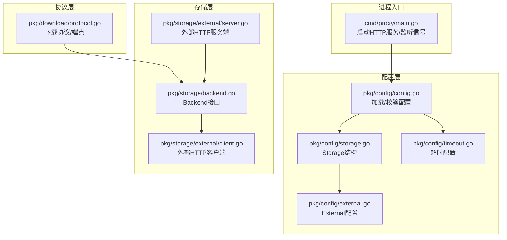
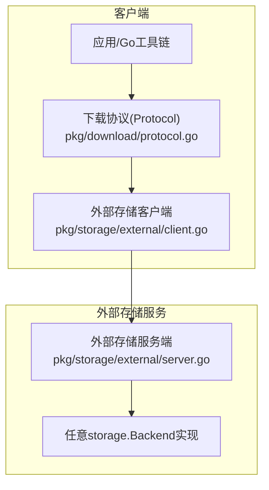
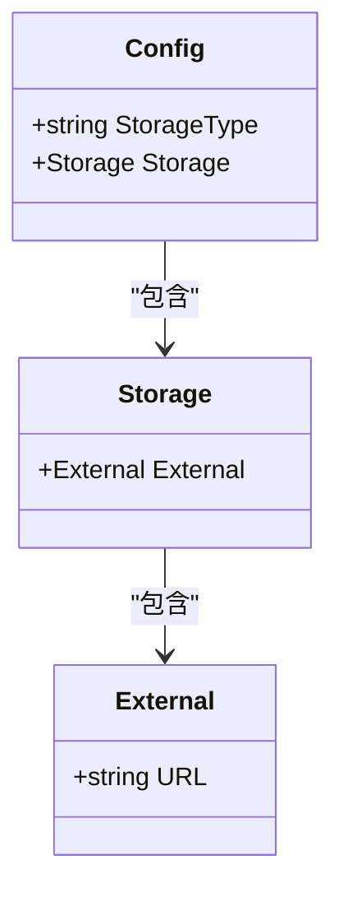
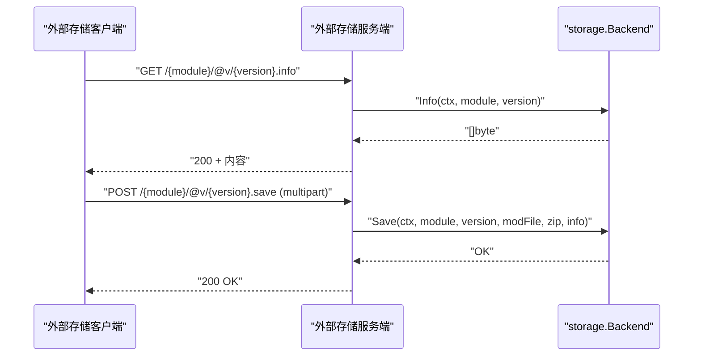
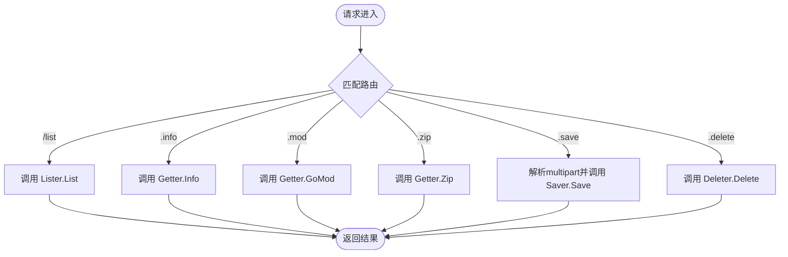
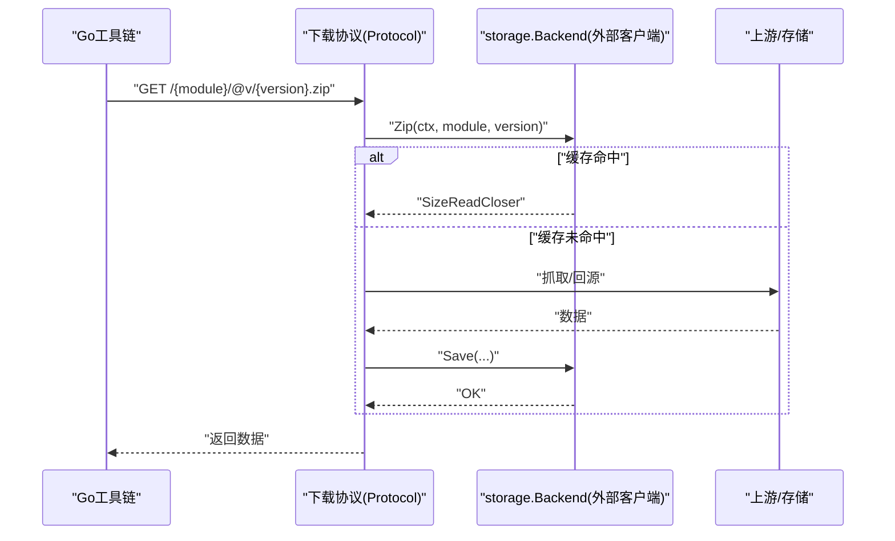
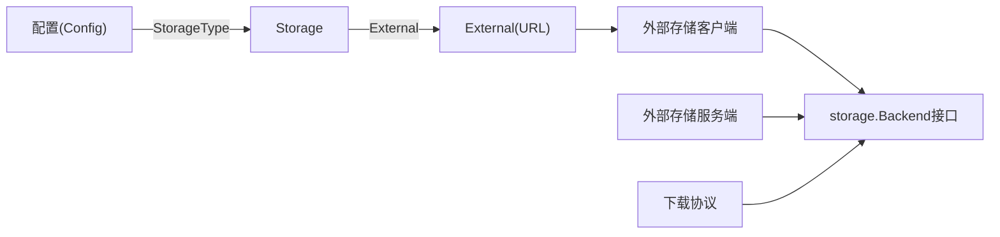

# 外部服务集成配置

<cite>
**本文引用的文件**
- [cmd/proxy/main.go](file://cmd/proxy/main.go)
- [pkg/config/config.go](file://pkg/config/config.go)
- [pkg/config/storage.go](file://pkg/config/storage.go)
- [pkg/config/external.go](file://pkg/config/external.go)
- [pkg/config/timeout.go](file://pkg/config/timeout.go)
- [pkg/storage/external/client.go](file://pkg/storage/external/client.go)
- [pkg/storage/external/server.go](file://pkg/storage/external/server.go)
- [pkg/storage/backend.go](file://pkg/storage/backend.go)
- [pkg/download/protocol.go](file://pkg/download/protocol.go)
- [config.dev.toml](file://config.dev.toml)
- [pkg/storage/external/external_test.go](file://pkg/storage/external/external_test.go)
</cite>

## 目录
1. [简介](#简介)
2. [项目结构](#项目结构)
3. [核心组件](#核心组件)
4. [架构总览](#架构总览)
5. [详细组件分析](#详细组件分析)
6. [依赖关系分析](#依赖关系分析)
7. [性能考量](#性能考量)
8. [故障处理与监控](#故障处理与监控)
9. [扩展性设计与最佳实践](#扩展性设计与最佳实践)
10. [结论](#结论)

## 简介
本文件系统化阐述 Athens 的“外部服务集成配置”，聚焦于通过 HTTP 协议对接外部存储后端的配置参数、通信协议、集成方式与运行机制。文档覆盖以下主题：
- 外部服务的 API 端点、认证与数据传输格式
- 配置参数与环境变量映射
- 客户端与服务端的交互流程
- 性能、故障处理与监控策略
- 扩展性设计（服务发现、负载均衡、熔断）与最佳实践

## 项目结构
与外部服务集成直接相关的模块分布如下：
- 配置层：解析配置文件与环境变量，校验外部存储配置
- 存储层：定义统一的存储接口；外部存储以 HTTP 客户端/服务端形式接入
- 下载协议层：封装对外暴露的下载协议端点，协调存储与上游
- 进程入口：加载配置、初始化日志与 HTTP 服务

**图表来源**
- [cmd/proxy/main.go](file://cmd/proxy/main.go#L29-L127)
- [pkg/config/config.go](file://pkg/config/config.go#L127-L254)
- [pkg/config/storage.go](file://pkg/config/storage.go#L3-L12)
- [pkg/config/external.go](file://pkg/config/external.go#L3-L6)
- [pkg/config/timeout.go](file://pkg/config/timeout.go#L5-L18)
- [pkg/storage/backend.go](file://pkg/storage/backend.go#L3-L9)
- [pkg/storage/external/client.go](file://pkg/storage/external/client.go#L23-L30)
- [pkg/storage/external/server.go](file://pkg/storage/external/server.go#L18-L21)
- [pkg/download/protocol.go](file://pkg/download/protocol.go#L20-L37)

**章节来源**
- [cmd/proxy/main.go](file://cmd/proxy/main.go#L29-L127)
- [pkg/config/config.go](file://pkg/config/config.go#L127-L254)
- [pkg/config/storage.go](file://pkg/config/storage.go#L3-L12)
- [pkg/config/external.go](file://pkg/config/external.go#L3-L6)
- [pkg/config/timeout.go](file://pkg/config/timeout.go#L5-L18)
- [pkg/storage/backend.go](file://pkg/storage/backend.go#L3-L9)
- [pkg/storage/external/client.go](file://pkg/storage/external/client.go#L23-L30)
- [pkg/storage/external/server.go](file://pkg/storage/external/server.go#L18-L21)
- [pkg/download/protocol.go](file://pkg/download/protocol.go#L20-L37)

## 核心组件
- 配置加载与校验
  - 支持从默认文件或指定文件加载配置，并通过环境变量覆盖
  - 对存储类型为 external 的配置进行校验（如 URL 必填）
- 外部存储配置结构
  - External 结构体仅包含 URL 字段，用于指向外部 HTTP 存储服务
- 外部存储客户端
  - 基于 HTTP 客户端访问外部服务的列表/读取/保存/删除等端点
  - 采用 multipart/form-data 上传模块信息、go.mod 与压缩包
- 外部存储服务端
  - 将任意 storage.Backend 实现包装为 HTTP 接口，暴露与 Go 模块代理一致的端点
- 下载协议
  - 对外暴露 /list、/info、/mod、/zip 等端点，内部通过 storage.Backend 与外部服务交互

**章节来源**
- [pkg/config/config.go](file://pkg/config/config.go#L127-L254)
- [pkg/config/external.go](file://pkg/config/external.go#L3-L6)
- [pkg/storage/external/client.go](file://pkg/storage/external/client.go#L23-L30)
- [pkg/storage/external/server.go](file://pkg/storage/external/server.go#L18-L21)
- [pkg/storage/backend.go](file://pkg/storage/backend.go#L3-L9)
- [pkg/download/protocol.go](file://pkg/download/protocol.go#L20-L37)

## 架构总览
外部服务集成采用“HTTP 后端 + 统一存储接口”的解耦设计：
- 客户端侧：通过 HTTP 访问外部存储服务，遵循 Go 模块代理的端点规范
- 服务端侧：将任意 storage.Backend 实现包装为 HTTP 服务，供客户端调用
- 协议层：对客户端请求进行路由与处理，必要时触发异步抓取与落盘

**图表来源**
- [pkg/download/protocol.go](file://pkg/download/protocol.go#L58-L73)
- [pkg/storage/external/client.go](file://pkg/storage/external/client.go#L23-L30)
- [pkg/storage/external/server.go](file://pkg/storage/external/server.go#L18-L21)
- [pkg/storage/backend.go](file://pkg/storage/backend.go#L3-L9)

## 详细组件分析

### 外部存储配置参数与环境变量
- 配置项
  - Storage.External.URL：外部存储服务的基础 URL
- 环境变量映射
  - ATHENS_EXTERNAL_STORAGE_URL：覆盖 Storage.External.URL
- 校验规则
  - 当 StorageType=external 时，URL 字段为必填

**图表来源**
- [pkg/config/config.go](file://pkg/config/config.go#L22-L66)
- [pkg/config/storage.go](file://pkg/config/storage.go#L3-L12)
- [pkg/config/external.go](file://pkg/config/external.go#L3-L6)

**章节来源**
- [pkg/config/config.go](file://pkg/config/config.go#L22-L66)
- [pkg/config/storage.go](file://pkg/config/storage.go#L3-L12)
- [pkg/config/external.go](file://pkg/config/external.go#L3-L6)
- [config.dev.toml](file://config.dev.toml#L559-L566)

### 外部存储客户端（HTTP 客户端）
- 功能
  - 列表：GET /{module}/@v/{version}.list
  - 详情：GET /{module}/@v/{version}.info
  - go.mod：GET /{module}/@v/{version}.mod
  - 压缩包：GET /{module}/@v/{version}.zip
  - 保存：POST /{module}/@v/{version}.save（multipart/form-data）
  - 删除：DELETE /{module}/@v/{version}.delete
- 数据传输
  - 上传采用 multipart/form-data，包含三个字段：mod.info、mod.mod、mod.zip
  - 下载返回二进制流，ZIP 返回 SizeReadCloser 并携带 Content-Length
- 错误处理
  - 非 200 状态码统一返回错误，包含状态码与响应体

**图表来源**
- [pkg/storage/external/client.go](file://pkg/storage/external/client.go#L32-L60)
- [pkg/storage/external/client.go](file://pkg/storage/external/client.go#L84-L113)
- [pkg/storage/external/server.go](file://pkg/storage/external/server.go#L32-L44)
- [pkg/storage/external/server.go](file://pkg/storage/external/server.go#L73-L117)

**章节来源**
- [pkg/storage/external/client.go](file://pkg/storage/external/client.go#L32-L123)
- [pkg/storage/external/server.go](file://pkg/storage/external/server.go#L23-L130)

### 外部存储服务端（HTTP 服务端）
- 路由与端点
  - GET /{module}/@v/list → 列出版本
  - GET /{module}/@v/{version}.info → 版本详情
  - GET /{module}/@v/{version}.mod → go.mod 内容
  - GET /{module}/@v/{version}.zip → 压缩包
  - POST /{module}/@v/{version}.save → 保存模块
  - DELETE /{module}/@v/{version}.delete → 删除版本
- 参数解析
  - 使用路径参数解析 module 与 version
- 数据解析
  - 保存时解析 multipart 表单中的三个文件域

**图表来源**
- [pkg/storage/external/server.go](file://pkg/storage/external/server.go#L23-L130)

**章节来源**
- [pkg/storage/external/server.go](file://pkg/storage/external/server.go#L23-L130)

### 下载协议与外部存储的衔接
- 协议端点
  - List、Info、GoMod、Zip 等均通过 storage.Backend 提供
- 外部存储集成
  - 当 StorageType=external 时，外部存储客户端作为 storage.Backend 使用
- 异步抓取与重定向
  - 根据 DownloadMode 与网络模式决定同步/异步/重定向行为

**图表来源**
- [pkg/download/protocol.go](file://pkg/download/protocol.go#L234-L251)
- [pkg/storage/external/client.go](file://pkg/storage/external/client.go#L75-L82)

**章节来源**
- [pkg/download/protocol.go](file://pkg/download/protocol.go#L234-L279)
- [pkg/storage/external/client.go](file://pkg/storage/external/client.go#L75-L82)

## 依赖关系分析
- 配置到存储的依赖
  - Config 通过 StorageType 选择具体存储实现；当 external 时，使用 External.URL 初始化外部存储客户端
- 客户端/服务端的依赖
  - 外部存储客户端依赖 HTTP 客户端与 storage.Backend 接口
  - 外部存储服务端依赖 storage.Backend 接口与路由框架
- 协议层的依赖
  - 下载协议依赖 storage.Backend 与上游列表器，结合网络模式与下载模式决定行为

**图表来源**
- [pkg/config/config.go](file://pkg/config/config.go#L22-L66)
- [pkg/config/storage.go](file://pkg/config/storage.go#L3-L12)
- [pkg/config/external.go](file://pkg/config/external.go#L3-L6)
- [pkg/storage/external/client.go](file://pkg/storage/external/client.go#L23-L30)
- [pkg/storage/external/server.go](file://pkg/storage/external/server.go#L18-L21)
- [pkg/storage/backend.go](file://pkg/storage/backend.go#L3-L9)
- [pkg/download/protocol.go](file://pkg/download/protocol.go#L58-L73)

**章节来源**
- [pkg/config/config.go](file://pkg/config/config.go#L22-L66)
- [pkg/config/storage.go](file://pkg/config/storage.go#L3-L12)
- [pkg/config/external.go](file://pkg/config/external.go#L3-L6)
- [pkg/storage/external/client.go](file://pkg/storage/external/client.go#L23-L30)
- [pkg/storage/external/server.go](file://pkg/storage/external/server.go#L18-L21)
- [pkg/storage/backend.go](file://pkg/storage/backend.go#L3-L9)
- [pkg/download/protocol.go](file://pkg/download/protocol.go#L58-L73)

## 性能考量
- 超时控制
  - 配置层提供 Timeout 字段，用于外部网络调用的默认超时
  - 外部存储客户端在请求时使用 HTTP 客户端超时（默认 http.Client）
- 并发与吞吐
  - 外部存储客户端未内置连接池与并发限制，建议在部署侧通过反向代理或服务网格统一管理
- 传输优化
  - ZIP 下载返回带大小的流，便于客户端按需处理
- 缓存与回源
  - 下载协议支持异步抓取与缓存，减少重复下载开销

**章节来源**
- [pkg/config/timeout.go](file://pkg/config/timeout.go#L5-L18)
- [pkg/storage/external/client.go](file://pkg/storage/external/client.go#L158-L190)
- [pkg/storage/external/server.go](file://pkg/storage/external/server.go#L68-L72)
- [pkg/download/protocol.go](file://pkg/download/protocol.go#L253-L279)

## 故障处理与监控
- 错误传播
  - 客户端与服务端在非 200 状态码时返回错误，包含状态码与响应体
- 日志与可观测性
  - 进程入口根据配置初始化日志；可结合 pprof 与指标导出器进行性能观测
- 健康检查
  - 可通过健康/就绪探针配合外部存储服务端的错误返回进行健康判断

**章节来源**
- [pkg/storage/external/client.go](file://pkg/storage/external/client.go#L177-L181)
- [pkg/storage/external/server.go](file://pkg/storage/external/server.go#L26-L28)
- [cmd/proxy/main.go](file://cmd/proxy/main.go#L69-L77)

## 扩展性设计与最佳实践
- 服务发现与负载均衡
  - 在部署层通过反向代理或服务网格实现外部存储服务的多实例发现与负载均衡
- 熔断与限流
  - 建议在反向代理或网关层启用熔断与限流策略，避免级联故障
- 配置与环境变量
  - 使用环境变量覆盖配置项，便于容器化与多环境管理
- 自定义服务的配置方法
  - 通过 StorageType=external 与 External.URL 指定自定义外部存储服务地址
  - 服务端可基于任意 storage.Backend 实现，满足不同后端需求
- 测试与合规
  - 提供外部存储的测试用例，确保与存储接口的兼容性

**章节来源**
- [config.dev.toml](file://config.dev.toml#L559-L566)
- [pkg/storage/external/external_test.go](file://pkg/storage/external/external_test.go#L11-L22)

## 结论
通过 HTTP 的外部存储集成方案，Athens 将存储实现与协议层解耦，既保持了与 Go 模块代理生态的一致性，又允许灵活接入任意后端。建议在生产环境中结合反向代理与服务网格完成服务发现、负载均衡与熔断限流，并通过环境变量与配置文件实现可运维的部署与扩展。