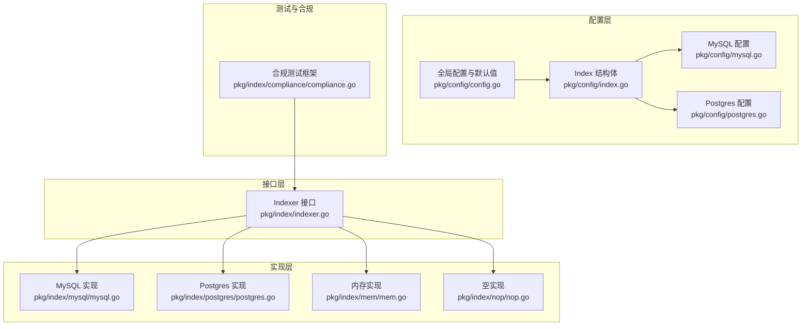
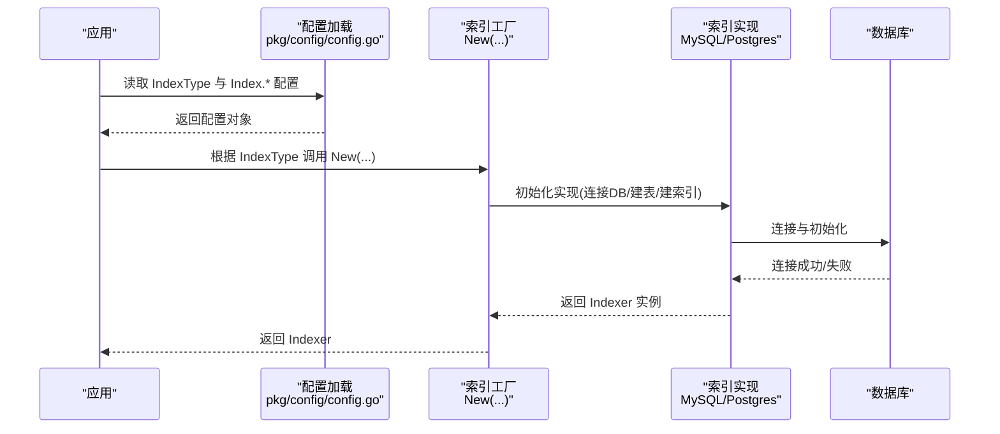
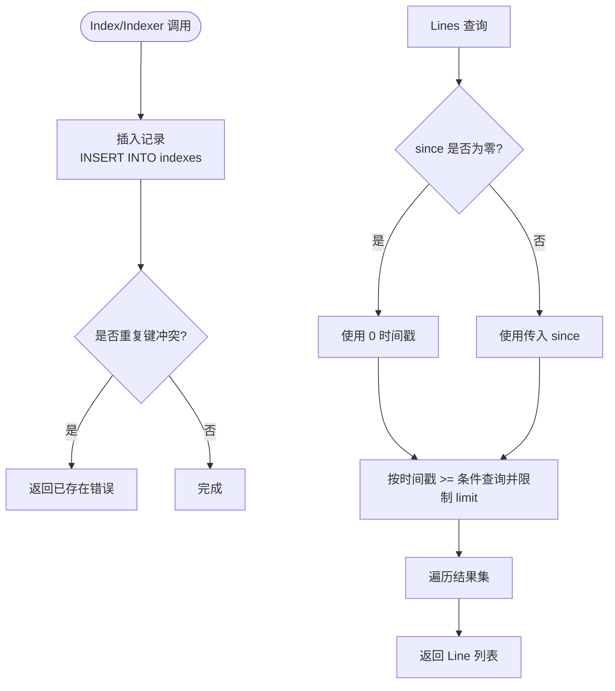
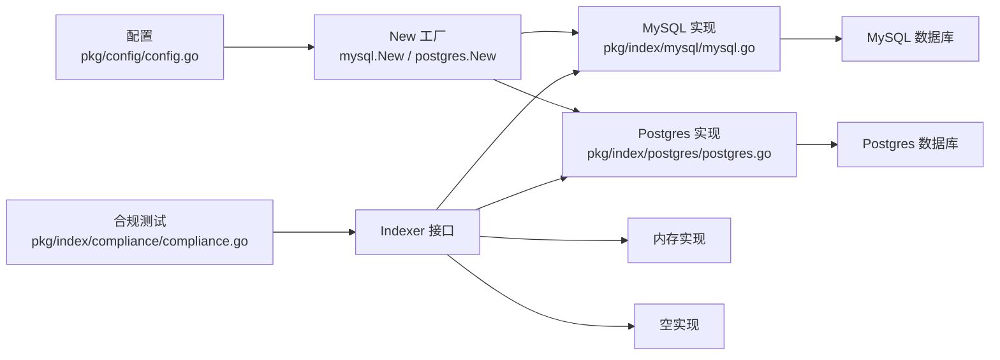

# 索引后端配置

<cite>
**本文引用的文件**
- [pkg/config/index.go](file://pkg/config/index.go)
- [pkg/config/mysql.go](file://pkg/config/mysql.go)
- [pkg/config/postgres.go](file://pkg/config/postgres.go)
- [pkg/config/config.go](file://pkg/config/config.go)
- [pkg/index/indexer.go](file://pkg/index/indexer.go)
- [pkg/index/mysql/mysql.go](file://pkg/index/mysql/mysql.go)
- [pkg/index/postgres/postgres.go](file://pkg/index/postgres/postgres.go)
- [pkg/index/mem/mem.go](file://pkg/index/mem/mem.go)
- [pkg/index/nop/nop.go](file://pkg/index/nop/nop.go)
- [pkg/index/compliance/compliance.go](file://pkg/index/compliance/compliance.go)
- [config.dev.toml](file://config.dev.toml)
- [config.devh.toml](file://config.devh.toml)
</cite>

## 目录
1. [简介](#简介)
2. [项目结构](#项目结构)
3. [核心组件](#核心组件)
4. [架构总览](#架构总览)
5. [详细组件分析](#详细组件分析)
6. [依赖关系分析](#依赖关系分析)
7. [性能考量](#性能考量)
8. [故障排查指南](#故障排查指南)
9. [结论](#结论)
10. [附录](#附录)

## 简介
本文件面向索引后端的配置与使用，聚焦以下目标：
- 解释索引后端的配置项、索引类型选择与性能优化
- 详解 MySQL、PostgreSQL 等索引后端的配置方法与适用场景
- 提供配置示例与迁移方法
- 说明索引的性能特征、数据一致性保证与查询优化
- 给出监控、备份与维护的最佳实践
- 涵盖连接池、事务隔离级别与并发控制策略

## 项目结构
索引后端配置与实现分布于以下模块：
- 配置层：定义索引后端的配置结构与默认值、校验逻辑
- 接口层：统一的索引接口抽象，屏蔽具体后端差异
- 实现层：MySQL、PostgreSQL、内存、空实现等具体实现
- 测试与合规：统一的接口合规测试框架

图表来源
- [pkg/config/index.go](file://pkg/config/index.go#L1-L8)
- [pkg/config/mysql.go](file://pkg/config/mysql.go#L1-L13)
- [pkg/config/postgres.go](file://pkg/config/postgres.go#L1-L12)
- [pkg/config/config.go](file://pkg/config/config.go#L146-L213)
- [pkg/index/indexer.go](file://pkg/index/indexer.go#L1-L30)
- [pkg/index/mysql/mysql.go](file://pkg/index/mysql/mysql.go#L1-L137)
- [pkg/index/postgres/postgres.go](file://pkg/index/postgres/postgres.go#L1-L131)
- [pkg/index/mem/mem.go](file://pkg/index/mem/mem.go#L1-L63)
- [pkg/index/nop/nop.go](file://pkg/index/nop/nop.go#L1-L27)
- [pkg/index/compliance/compliance.go](file://pkg/index/compliance/compliance.go#L1-L140)

章节来源
- [pkg/config/index.go](file://pkg/config/index.go#L1-L8)
- [pkg/config/mysql.go](file://pkg/config/mysql.go#L1-L13)
- [pkg/config/postgres.go](file://pkg/config/postgres.go#L1-L12)
- [pkg/config/config.go](file://pkg/config/config.go#L146-L213)
- [pkg/index/indexer.go](file://pkg/index/indexer.go#L1-L30)
- [pkg/index/mysql/mysql.go](file://pkg/index/mysql/mysql.go#L1-L137)
- [pkg/index/postgres/postgres.go](file://pkg/index/postgres/postgres.go#L1-L131)
- [pkg/index/mem/mem.go](file://pkg/index/mem/mem.go#L1-L63)
- [pkg/index/nop/nop.go](file://pkg/index/nop/nop.go#L1-L27)
- [pkg/index/compliance/compliance.go](file://pkg/index/compliance/compliance.go#L1-L140)

## 核心组件
- 索引接口 Indexer：定义 Index、Lines、Total 三个核心能力，统一不同后端的对外行为
- MySQL/Postgres 实现：分别对接 MySQL 与 PostgreSQL，提供插入、查询、计数与表/索引初始化
- 内存/空实现：内存实现用于开发与测试；空实现用于禁用索引
- 配置结构：Index 包含 MySQL 与 Postgres 的配置对象，并在全局配置中提供默认值与校验

章节来源
- [pkg/index/indexer.go](file://pkg/index/indexer.go#L15-L30)
- [pkg/index/mysql/mysql.go](file://pkg/index/mysql/mysql.go#L16-L33)
- [pkg/index/postgres/postgres.go](file://pkg/index/postgres/postgres.go#L16-L35)
- [pkg/index/mem/mem.go](file://pkg/index/mem/mem.go#L13-L16)
- [pkg/index/nop/nop.go](file://pkg/index/nop/nop.go#L10-L13)
- [pkg/config/index.go](file://pkg/config/index.go#L3-L8)
- [pkg/config/config.go](file://pkg/config/config.go#L187-L212)

## 架构总览
索引后端的运行流程：
- 应用启动时加载配置，解析 IndexType 并构造对应的 Indexer 实例
- 对外提供 /index 与 /list 等接口，内部通过 Indexer 执行索引写入与查询
- MySQL/Postgres 实现负责连接数据库、初始化表与索引、执行 SQL

图表来源
- [pkg/config/config.go](file://pkg/config/config.go#L322-L333)
- [pkg/index/mysql/mysql.go](file://pkg/index/mysql/mysql.go#L19-L33)
- [pkg/index/postgres/postgres.go](file://pkg/index/postgres/postgres.go#L19-L35)

## 详细组件分析

### 配置结构与默认值
- Index 结构体：包含 MySQL 与 Postgres 的配置对象
- 全局默认配置：dev 模式下默认 IndexType 为 none；可通过环境变量或配置文件覆盖
- 校验逻辑：validateIndex 根据 IndexType 对应校验 MySQL 或 Postgres 配置

章节来源
- [pkg/config/index.go](file://pkg/config/index.go#L3-L8)
- [pkg/config/config.go](file://pkg/config/config.go#L146-L213)
- [pkg/config/config.go](file://pkg/config/config.go#L322-L333)

### MySQL 配置与实现
- 配置项：协议、主机、端口、用户、密码、数据库、连接参数 Params
- DSN 构造：通过 mysql.Config 与 FormatDSN 生成连接串
- 表结构与索引：自动建表并创建唯一索引与时间戳索引
- 查询与去重：Lines 按时间戳 >= since 限制 limit 返回；重复插入按错误码映射为已存在

图表来源
- [pkg/index/mysql/mysql.go](file://pkg/index/mysql/mysql.go#L63-L101)
- [pkg/index/mysql/mysql.go](file://pkg/index/mysql/mysql.go#L125-L136)

章节来源
- [pkg/config/mysql.go](file://pkg/config/mysql.go#L3-L12)
- [pkg/index/mysql/mysql.go](file://pkg/index/mysql/mysql.go#L114-L123)
- [pkg/index/mysql/mysql.go](file://pkg/index/mysql/mysql.go#L35-L56)
- [pkg/index/mysql/mysql.go](file://pkg/index/mysql/mysql.go#L63-L101)
- [pkg/index/mysql/mysql.go](file://pkg/index/mysql/mysql.go#L125-L136)

### PostgreSQL 配置与实现
- 配置项：主机、端口、用户、密码、数据库、连接参数 Params
- 连接串构造：拼接 host/port/user/dbname/password 与 Params
- 表结构与索引：自动建表并创建时间戳索引与唯一索引
- 查询与去重：与 MySQL 类似，按时间戳条件查询并限制返回条数

章节来源
- [pkg/config/postgres.go](file://pkg/config/postgres.go#L3-L11)
- [pkg/index/postgres/postgres.go](file://pkg/index/postgres/postgres.go#L106-L117)
- [pkg/index/postgres/postgres.go](file://pkg/index/postgres/postgres.go#L37-L52)
- [pkg/index/postgres/postgres.go](file://pkg/index/postgres/postgres.go#L73-L94)
- [pkg/index/postgres/postgres.go](file://pkg/index/postgres/postgres.go#L119-L130)

### 内存与空实现
- 内存实现：线程安全的切片存储，支持重复检测、时间过滤与计数
- 空实现：不做任何操作，适合禁用索引或测试场景

章节来源
- [pkg/index/mem/mem.go](file://pkg/index/mem/mem.go#L18-L38)
- [pkg/index/mem/mem.go](file://pkg/index/mem/mem.go#L40-L55)
- [pkg/index/mem/mem.go](file://pkg/index/mem/mem.go#L58-L62)
- [pkg/index/nop/nop.go](file://pkg/index/nop/nop.go#L15-L27)

### 接口与合规测试
- Indexer 接口：统一的 Index/Lines/Total 能力
- 合规测试：提供测试用例集，覆盖空索引、顺序、limit、since 过滤、重复插入等场景

章节来源
- [pkg/index/indexer.go](file://pkg/index/indexer.go#L15-L30)
- [pkg/index/compliance/compliance.go](file://pkg/index/compliance/compliance.go#L16-L124)

## 依赖关系分析
- 配置到实现：IndexType -> New(...) -> 具体实现
- 实现到数据库：实现负责连接、建表、建索引与 SQL 执行
- 测试到接口：合规测试依赖 Indexer 接口，确保各实现行为一致

图表来源
- [pkg/config/config.go](file://pkg/config/config.go#L322-L333)
- [pkg/index/mysql/mysql.go](file://pkg/index/mysql/mysql.go#L19-L33)
- [pkg/index/postgres/postgres.go](file://pkg/index/postgres/postgres.go#L19-L35)
- [pkg/index/compliance/compliance.go](file://pkg/index/compliance/compliance.go#L19-L124)

章节来源
- [pkg/config/config.go](file://pkg/config/config.go#L322-L333)
- [pkg/index/mysql/mysql.go](file://pkg/index/mysql/mysql.go#L19-L33)
- [pkg/index/postgres/postgres.go](file://pkg/index/postgres/postgres.go#L19-L35)
- [pkg/index/compliance/compliance.go](file://pkg/index/compliance/compliance.go#L19-L124)

## 性能考量
- 索引设计
  - MySQL：时间戳列建立普通索引；path+version 建立唯一索引，避免重复
  - PostgreSQL：显式创建时间戳索引与唯一索引
- 查询优化
  - Lines 查询均以时间戳 >= since 且 LIMIT 限制返回数量，避免全表扫描
  - 唯一索引保证重复插入快速失败
- 连接与并发
  - 实现通过标准库 database/sql 进行连接与查询，未内置连接池参数
  - 若需连接池配置，建议在 Params 中传入相应驱动参数（如 MySQL 的 timeout、parseTime 等）
- 事务与一致性
  - 插入与查询未显式开启事务；重复插入错误码映射为“已存在”，保证幂等性
- 监控与可观测性
  - 可结合应用层日志与数据库慢查询日志进行监控
  - 建议在数据库侧开启慢查询与执行计划分析

章节来源
- [pkg/index/mysql/mysql.go](file://pkg/index/mysql/mysql.go#L35-L56)
- [pkg/index/mysql/mysql.go](file://pkg/index/mysql/mysql.go#L80-L101)
- [pkg/index/mysql/mysql.go](file://pkg/index/mysql/mysql.go#L125-L136)
- [pkg/index/postgres/postgres.go](file://pkg/index/postgres/postgres.go#L37-L52)
- [pkg/index/postgres/postgres.go](file://pkg/index/postgres/postgres.go#L73-L94)
- [pkg/index/postgres/postgres.go](file://pkg/index/postgres/postgres.go#L119-L130)

## 故障排查指南
- 常见错误与定位
  - 重复插入：MySQL 映射 1062 为已存在；PostgreSQL 映射 23505 为已存在
  - 连接失败：检查主机、端口、用户、密码与 Params；确认数据库可达
  - 查询异常：确认 since 参数格式与时区设置；确认索引是否存在
- 单元测试与合规
  - 使用合规测试框架验证实现行为一致性，覆盖空索引、limit、since、重复插入等场景
- 日志与诊断
  - 开启应用日志与数据库慢查询日志，定位性能瓶颈
  - 对比 Lines 查询的返回条数与 Total 计数，核对数据完整性

章节来源
- [pkg/index/mysql/mysql.go](file://pkg/index/mysql/mysql.go#L125-L136)
- [pkg/index/postgres/postgres.go](file://pkg/index/postgres/postgres.go#L119-L130)
- [pkg/index/compliance/compliance.go](file://pkg/index/compliance/compliance.go#L16-L124)

## 结论
- 通过统一的 Indexer 接口，索引后端可灵活切换；MySQL 与 PostgreSQL 均提供稳定的表结构与索引设计
- 配置层支持环境变量与配置文件双重覆盖，便于在不同环境间迁移
- 性能方面，时间戳索引与唯一索引配合 LIMIT 查询满足常见场景；如需更强的连接池控制，可在 Params 中扩展驱动参数
- 建议在生产环境启用数据库慢查询与执行计划分析，持续监控索引写入与查询延迟

## 附录

### 配置示例与迁移
- 示例配置文件
  - 开发配置（包含索引后端示例）：[config.dev.toml](file://config.dev.toml#L567-L627)
  - 中文开发配置（包含索引后端示例）：[config.devh.toml](file://config.devh.toml#L511-L549)
- 迁移步骤
  - 从 none/memory 迁移到 MySQL/PostgreSQL：设置 IndexType 为 mysql/postgres，填充对应配置段
  - 环境变量覆盖：通过环境变量 ATHENS_INDEX_TYPE、ATHENS_INDEX_MYSQL_*、ATHENS_INDEX_POSTGRES_* 覆盖
  - 参数格式：MySQL 的 Params 采用逗号分隔的键值对；Postgres 的 Params 采用空格分隔的键值对

章节来源
- [config.dev.toml](file://config.dev.toml#L567-L627)
- [config.devh.toml](file://config.devh.toml#L511-L549)
- [pkg/config/config.go](file://pkg/config/config.go#L322-L333)

### 索引类型选择与使用场景
- MySQL
  - 适合已有 MySQL 基础设施、需要简单易用的索引存储
  - 注意在 Params 中设置 parseTime、timeout 等参数以提升兼容性与稳定性
- PostgreSQL
  - 适合对 SQL 与索引能力有更高要求的场景
  - 注意在 Params 中设置 connect_timeout、sslmode 等参数
- 内存实现
  - 适合开发与测试，不持久化
- 空实现
  - 适合完全禁用索引或仅做占位

章节来源
- [pkg/config/mysql.go](file://pkg/config/mysql.go#L3-L12)
- [pkg/config/postgres.go](file://pkg/config/postgres.go#L3-L11)
- [pkg/index/mem/mem.go](file://pkg/index/mem/mem.go#L13-L16)
- [pkg/index/nop/nop.go](file://pkg/index/nop/nop.go#L10-L13)

### 监控、备份与维护最佳实践
- 监控
  - 应用层：记录 Index/Lines/Total 的耗时与错误
  - 数据库层：开启慢查询日志、执行计划分析
- 备份
  - MySQL/Postgres 建议定期备份 indexes 表，保留唯一索引与时间戳索引定义
- 维护
  - 定期清理过期数据（如有需要），重建索引以优化查询
  - 观察重复插入错误率，评估幂等性与上游去重策略

[本节为通用指导，无需列出章节来源]

### 连接池、事务隔离级别与并发控制策略
- 连接池
  - 实现未内置连接池参数；可通过驱动参数（如 MySQL 的 timeout、parseTime）间接影响连接行为
- 事务隔离级别
  - 未显式开启事务；若需更强一致性，可在应用层封装事务并在上游调用处控制
- 并发控制
  - 内存实现使用互斥锁保护；MySQL/Postgres 依赖数据库层面的唯一索引与错误码实现幂等

章节来源
- [pkg/index/mysql/mysql.go](file://pkg/index/mysql/mysql.go#L114-L123)
- [pkg/index/postgres/postgres.go](file://pkg/index/postgres/postgres.go#L106-L117)
- [pkg/index/mem/mem.go](file://pkg/index/mem/mem.go#L18-L21)