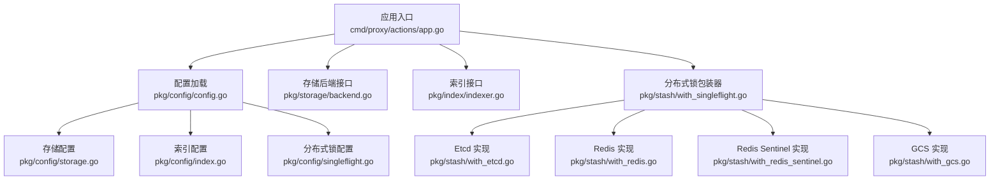
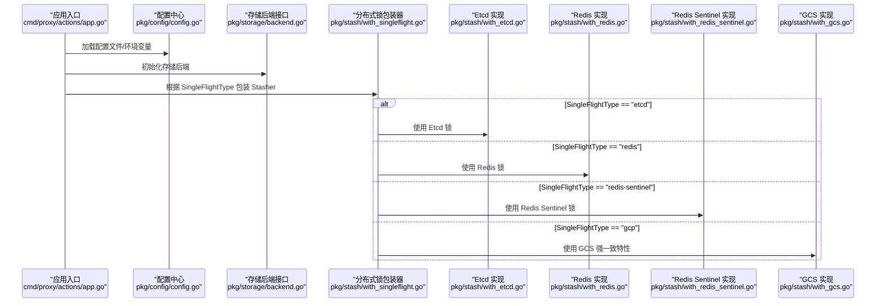
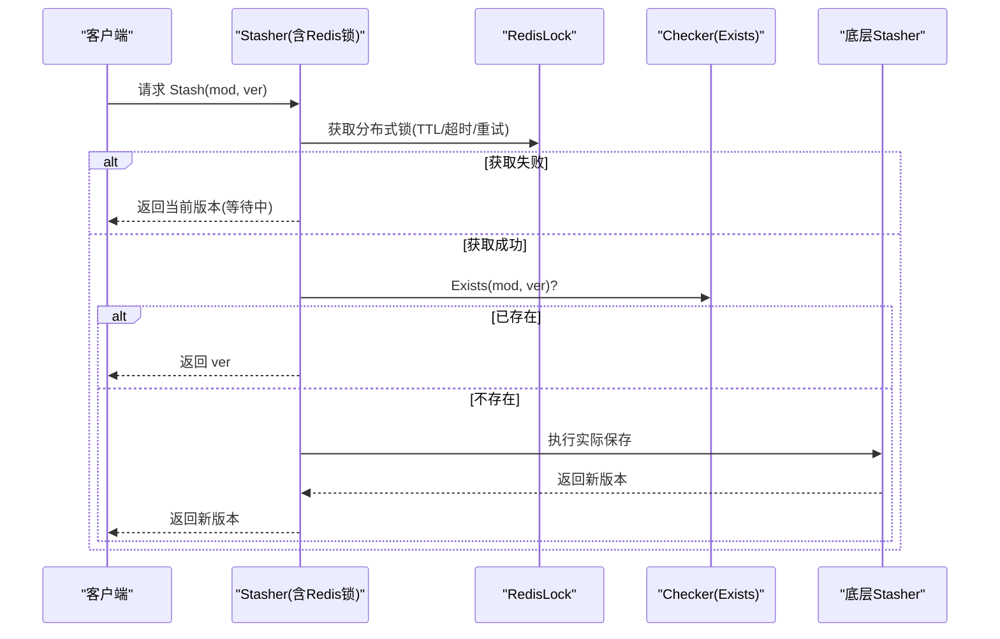
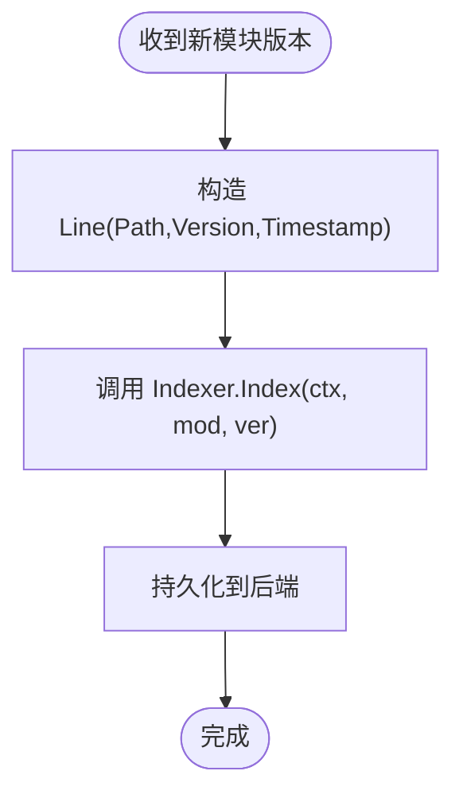
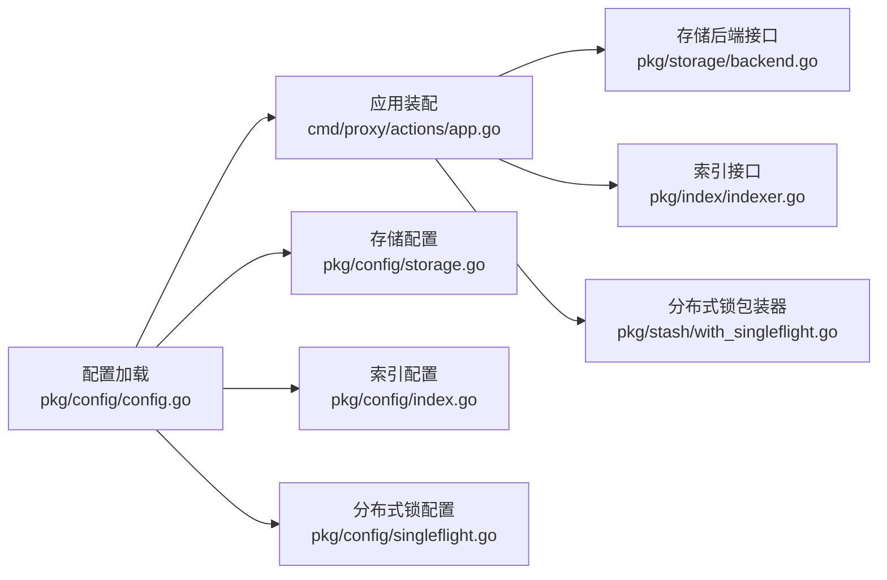

# 高级配置

<cite>
**本文引用的文件**   
- [pkg/config/config.go](file://pkg/config/config.go)
- [pkg/config/singleflight.go](file://pkg/config/singleflight.go)
- [pkg/config/index.go](file://pkg/config/index.go)
- [pkg/config/external.go](file://pkg/config/external.go)
- [pkg/config/storage.go](file://pkg/config/storage.go)
- [pkg/stash/with_singleflight.go](file://pkg/stash/with_singleflight.go)
- [pkg/stash/with_etcd.go](file://pkg/stash/with_etcd.go)
- [pkg/stash/with_redis.go](file://pkg/stash/with_redis.go)
- [pkg/stash/with_redis_sentinel.go](file://pkg/stash/with_redis_sentinel.go)
- [pkg/stash/with_gcs.go](file://pkg/stash/with_gcs.go)
- [pkg/index/indexer.go](file://pkg/index/indexer.go)
- [pkg/storage/backend.go](file://pkg/storage/backend.go)
- [cmd/proxy/actions/app.go](file://cmd/proxy/actions/app.go)
- [config.dev.toml](file://config.dev.toml)
</cite>

## 目录
1. [简介](#简介)
2. [项目结构](#项目结构)
3. [核心组件](#核心组件)
4. [架构总览](#架构总览)
5. [详细组件分析](#详细组件分析)
6. [依赖关系分析](#依赖关系分析)
7. [性能考量](#性能考量)
8. [故障排查指南](#故障排查指南)
9. [结论](#结论)
10. [附录](#附录)

## 简介
本章节面向需要在生产环境中进行高级配置与调优的用户，系统性说明以下三类高级能力的配置与使用方式：
- 分布式锁（SingleFlight）：支持内存、Etcd、Redis、Redis Sentinel、GCP、Azure Blob 等多种后端，用于并发写入去重与一致性保障。
- 索引配置（Index）：支持 none/memory/mysql/postgres 后端，用于模块版本索引与查询。
- 外部服务集成（External Storage）：通过统一接口对接自定义存储后端，便于与企业内部系统或第三方服务集成。

同时给出高可用部署与复杂网络环境下的配置思路、性能影响、故障处理与监控策略，并提供调试方法、优化建议与最佳实践。

## 项目结构
围绕高级配置的关键目录与文件如下：
- 配置模型与默认值：pkg/config/*.go
- 分布式锁包装器与后端实现：pkg/stash/*_singleflight.go、pkg/stash/*_redis*.go、pkg/stash/with_etcd.go、pkg/stash/with_gcs.go
- 索引接口与后端：pkg/index/*.go
- 存储后端接口：pkg/storage/backend.go
- 应用入口与配置加载：cmd/proxy/actions/app.go
- 示例配置：config.dev.toml

**图示来源**
- [cmd/proxy/actions/app.go](file://cmd/proxy/actions/app.go#L23-L138)
- [pkg/config/config.go](file://pkg/config/config.go#L21-L66)
- [pkg/config/storage.go](file://pkg/config/storage.go#L3-L12)
- [pkg/config/index.go](file://pkg/config/index.go#L3-L7)
- [pkg/config/singleflight.go](file://pkg/config/singleflight.go#L6-L11)
- [pkg/storage/backend.go](file://pkg/storage/backend.go#L3-L9)
- [pkg/index/indexer.go](file://pkg/index/indexer.go#L15-L29)
- [pkg/stash/with_singleflight.go](file://pkg/stash/with_singleflight.go#L12-L23)
- [pkg/stash/with_etcd.go](file://pkg/stash/with_etcd.go#L15-L29)
- [pkg/stash/with_redis.go](file://pkg/stash/with_redis.go#L54-L79)
- [pkg/stash/with_redis_sentinel.go](file://pkg/stash/with_redis_sentinel.go#L12-L43)
- [pkg/stash/with_gcs.go](file://pkg/stash/with_gcs.go#L14-L31)

**章节来源**
- [cmd/proxy/actions/app.go](file://cmd/proxy/actions/app.go#L23-L138)
- [pkg/config/config.go](file://pkg/config/config.go#L21-L66)

## 核心组件
- 配置中心（Config）：集中管理运行参数、超时、日志、追踪、指标导出、存储类型、索引类型、SingleFlight 类型及各子配置块。
- 存储配置（Storage）：声明式地为磁盘、GCP、Minio、Mongo、S3、AzureBlob、External 等后端提供参数校验与选择。
- 索引配置（Index）：声明式地为 none/memory/mysql/postgres 提供参数校验与选择。
- 分布式锁配置（SingleFlight）：声明式地为 Etcd、Redis、Redis Sentinel、GCP 等提供参数校验与选择。
- 分布式锁包装器（Stasher Wrapper）：在不改变业务逻辑的前提下，为任意 Stasher 增加分布式锁能力；并提供多后端实现以满足不同高可用需求。
- 索引接口（Indexer）：抽象模块版本索引的写入、查询与计数操作。
- 存储后端接口（Backend）：统一列出/读取/保存/删除能力，作为分布式锁包装器的 Checker 依赖。

**章节来源**
- [pkg/config/config.go](file://pkg/config/config.go#L21-L66)
- [pkg/config/storage.go](file://pkg/config/storage.go#L3-L12)
- [pkg/config/index.go](file://pkg/config/index.go#L3-L7)
- [pkg/config/singleflight.go](file://pkg/config/singleflight.go#L6-L11)
- [pkg/stash/with_singleflight.go](file://pkg/stash/with_singleflight.go#L12-L23)
- [pkg/index/indexer.go](file://pkg/index/indexer.go#L15-L29)
- [pkg/storage/backend.go](file://pkg/storage/backend.go#L3-L9)

## 架构总览
下图展示从应用启动到请求处理的关键路径，以及高级配置如何参与其中：

**图示来源**
- [cmd/proxy/actions/app.go](file://cmd/proxy/actions/app.go#L23-L138)
- [pkg/config/config.go](file://pkg/config/config.go#L282-L333)
- [pkg/stash/with_singleflight.go](file://pkg/stash/with_singleflight.go#L12-L23)
- [pkg/stash/with_etcd.go](file://pkg/stash/with_etcd.go#L15-L29)
- [pkg/stash/with_redis.go](file://pkg/stash/with_redis.go#L54-L79)
- [pkg/stash/with_redis_sentinel.go](file://pkg/stash/with_redis_sentinel.go#L12-L43)
- [pkg/stash/with_gcs.go](file://pkg/stash/with_gcs.go#L14-L31)

## 详细组件分析

### 分布式锁（SingleFlight）配置与实现
- 配置项
  - SingleFlightType：可选值包括 memory、etcd、redis、redis-sentinel、gcp、azureblob。
  - SingleFlight.Etcd：Etcd 集群端点列表。
  - SingleFlight.Redis：Redis 单实例连接信息与锁参数（TTL、超时、最大重试）。
  - SingleFlight.RedisSentinel：Redis Sentinel 连接信息、主名、哨兵/主节点密码、Redis 用户名/密码与锁参数。
  - SingleFlight.GCP：GCP 僵尸阈值（StaleThreshold），用于判定上传是否过期。
- 默认行为
  - 默认 SingleFlightType 为 memory，适合单实例部署；多实例场景需切换至 etcd/redis/redis-sentinel/gcp/azureblob。
- 关键实现
  - 内存版 SingleFlight：pkg/stash/with_singleflight.go，基于本地互斥与订阅通道实现同模块版本的串行化处理。
  - Etcd 版：pkg/stash/with_etcd.go，使用 etcd 并发锁，适合跨实例强一致。
  - Redis 版：pkg/stash/with_redis.go，使用 redislock，支持 TTL、超时与指数退避重试。
  - Redis Sentinel 版：pkg/stash/with_redis_sentinel.go，通过哨兵发现主节点，提升可用性。
  - GCP 版：pkg/stash/with_gcs.go，利用 GCS 的强一致特性，通过修改存储层阈值实现“单飞”语义。
- 典型流程（Redis 分布式锁）

**图示来源**
- [pkg/stash/with_redis.go](file://pkg/stash/with_redis.go#L105-L139)
- [pkg/stash/with_singleflight.go](file://pkg/stash/with_singleflight.go#L48-L67)

**章节来源**
- [pkg/config/config.go](file://pkg/config/config.go#L59-L63)
- [pkg/config/singleflight.go](file://pkg/config/singleflight.go#L6-L11)
- [pkg/stash/with_singleflight.go](file://pkg/stash/with_singleflight.go#L12-L23)
- [pkg/stash/with_etcd.go](file://pkg/stash/with_etcd.go#L15-L29)
- [pkg/stash/with_redis.go](file://pkg/stash/with_redis.go#L54-L79)
- [pkg/stash/with_redis_sentinel.go](file://pkg/stash/with_redis_sentinel.go#L12-L43)
- [pkg/stash/with_gcs.go](file://pkg/stash/with_gcs.go#L14-L31)

### 索引配置（Index）
- 配置项
  - IndexType：可选 none/memory/mysql/postgres。
  - Index.MySQL：协议、主机、端口、用户、密码、数据库、参数字典。
  - Index.Postgres：主机、端口、用户、密码、数据库、参数字典。
- 校验规则
  - validateIndex 在 IndexType 为 none/memory/mysql/postgres 时分别进行结构体校验。
- 接口契约
  - Indexer 定义了 Index/Lines/Total 三个方法，用于写入索引、按时间窗口查询与统计总数。
- 典型流程（索引写入）

**图示来源**
- [pkg/config/config.go](file://pkg/config/config.go#L322-L333)
- [pkg/index/indexer.go](file://pkg/index/indexer.go#L15-L29)

**章节来源**
- [pkg/config/index.go](file://pkg/config/index.go#L3-L7)
- [pkg/config/config.go](file://pkg/config/config.go#L322-L333)
- [pkg/index/indexer.go](file://pkg/index/indexer.go#L15-L29)

### 外部服务集成（External Storage）
- 配置项
  - Storage.External.URL：外部存储服务的访问地址，要求必填并通过校验。
- 作用
  - 通过统一的存储后端接口对接自定义存储实现，便于与企业内部系统或第三方服务集成。
- 注意
  - 该配置仅声明参数，具体实现由外部服务侧提供；本项目负责将其纳入统一的存储体系。

**章节来源**
- [pkg/config/external.go](file://pkg/config/external.go#L3-L6)
- [pkg/config/storage.go](file://pkg/config/storage.go#L11-L11)
- [pkg/config/config.go](file://pkg/config/config.go#L299-L320)

## 依赖关系分析
- 配置加载与验证
  - Load/ParseConfigFile/envOverride/defaultConfig 组合，确保优先级：环境变量 > 配置文件 > 默认值。
  - validateConfig 调用 validateStorage/validateIndex 对子配置进行结构化校验。
- 应用入口装配
  - App 根据配置初始化存储后端、中间件、追踪与指标导出，并挂载路由。
- 分布式锁装配
  - 根据 SingleFlightType 选择对应包装器（Etcd/Redis/Redis Sentinel/GCS/内存），并注入 Checker（Exists）以避免重复写入。

**图示来源**
- [pkg/config/config.go](file://pkg/config/config.go#L129-L273)
- [cmd/proxy/actions/app.go](file://cmd/proxy/actions/app.go#L23-L138)
- [pkg/config/storage.go](file://pkg/config/storage.go#L3-L12)
- [pkg/config/index.go](file://pkg/config/index.go#L3-L7)
- [pkg/config/singleflight.go](file://pkg/config/singleflight.go#L6-L11)
- [pkg/storage/backend.go](file://pkg/storage/backend.go#L3-L9)
- [pkg/index/indexer.go](file://pkg/index/indexer.go#L15-L29)
- [pkg/stash/with_singleflight.go](file://pkg/stash/with_singleflight.go#L12-L23)

**章节来源**
- [pkg/config/config.go](file://pkg/config/config.go#L129-L273)
- [cmd/proxy/actions/app.go](file://cmd/proxy/actions/app.go#L23-L138)

## 性能考量
- SingleFlight 选择
  - memory：单实例低延迟，多实例会失去去重效果，不推荐生产多副本。
  - etcd：强一致、跨实例共享，适合高并发写入场景；注意 etcd 集群健康与网络抖动对锁获取的影响。
  - redis/redis-sentinel：延迟低、吞吐高，适合大规模并发；需合理设置 TTL、超时与重试次数，避免“假死锁”。
  - gcp/azureblob：利用对象存储强一致特性，减少额外锁依赖，但需评估对象存储的写放大与成本。
- 索引后端
  - none：无索引，查询受限；适合只读或外部聚合场景。
  - memory：内存索引，读写快，重启丢失；适合开发/测试或短期缓存。
  - mysql/postgres：持久化索引，支持复杂查询与统计；需关注慢查询、索引设计与连接池配置。
- 外部存储
  - 通过统一接口接入，性能取决于外部服务；建议开启连接复用、限流与可观测性埋点。

[本节为通用指导，无需特定文件引用]

## 故障排查指南
- 配置校验失败
  - 使用 validateStorage/validateIndex 校验存储与索引配置；确认字段格式与必填项。
- 分布式锁异常
  - Redis：检查连接字符串、密码冲突、TTL/超时/重试配置；可通过日志定位 Obtain/Release 失败。
  - Etcd：检查端点可达性、会话创建与锁路径；关注网络分区导致的锁无法释放。
  - GCP/Azure：确认对象存储权限与阈值设置；避免僵尸锁导致的误判。
- 索引不可用
  - 核查 IndexType 与后端参数；确认数据库连通性与慢查询。
- 外部存储
  - 核查 URL 可达性与鉴权；结合外部服务日志定位问题。

**章节来源**
- [pkg/config/config.go](file://pkg/config/config.go#L299-L333)
- [pkg/stash/with_redis.go](file://pkg/stash/with_redis.go#L29-L52)
- [pkg/stash/with_etcd.go](file://pkg/stash/with_etcd.go#L18-L29)
- [pkg/stash/with_gcs.go](file://pkg/stash/with_gcs.go#L14-L31)

## 结论
- 生产多副本必须启用分布式锁；优先考虑 etcd 或 redis/redis-sentinel。
- 索引建议使用 mysql/postgres 以获得更好的查询与统计能力。
- 外部存储通过统一接口接入，便于扩展与治理。
- 配置加载遵循“环境变量 > 配置文件 > 默认值”的优先级，务必在生产环境显式覆盖敏感字段。

[本节为总结，无需特定文件引用]

## 附录

### 高可用部署与复杂网络环境配置要点
- 多实例部署
  - 将 SingleFlightType 设为 etcd/redis/redis-sentinel/gcp/azureblob，确保锁跨实例生效。
  - 使用负载均衡器与健康检查，结合 ShutdownTimeout 平滑重启。
- 复杂网络
  - 严格模式（strict）：合并上游与本地版本，失败即失败，适合强一致性场景。
  - fallback 模式：优先本地，上游失败时尽力而为，适合弱网或上游不稳定。
  - offline 模式：仅本地版本，完全离线可用。
- TLS 与认证
  - 通过证书文件与 BasicAuth 参数启用 HTTPS 与基础认证。
- 追踪与指标
  - 配置 TraceExporter/TraceExporterURL 与 StatsExporter，结合外部平台进行观测。

**章节来源**
- [config.dev.toml](file://config.dev.toml#L270-L283)
- [pkg/config/config.go](file://pkg/config/config.go#L58-L62)
- [cmd/proxy/actions/app.go](file://cmd/proxy/actions/app.go#L52-L94)

### 高级配置示例（路径引用）
- 分布式锁（Etcd/Redis/Redis Sentinel/GCP/AzureBlob）
  - 参考配置段落：[SingleFlight.Etcd](file://config.dev.toml#L329-L357)、[SingleFlight.Redis](file://config.dev.toml#L336-L357)、[SingleFlight.RedisSentinel](file://config.dev.toml#L358-L387)、[SingleFlight.GCP](file://config.dev.toml#L388-L391)
- 索引（MySQL/Postgres）
  - 参考配置段落：[Index.MySQL](file://config.dev.toml#L567-L600)、[Index.Postgres](file://config.dev.toml#L600-L627)
- 外部存储
  - 参考配置段落：[Storage.External](file://config.dev.toml#L559-L565)

**章节来源**
- [config.dev.toml](file://config.dev.toml#L329-L391)
- [config.dev.toml](file://config.dev.toml#L567-L627)
- [config.dev.toml](file://config.dev.toml#L559-L565)

### 调试方法、优化建议与最佳实践
- 调试
  - 开启日志级别与格式，必要时启用 pprof 端点定位热点。
  - 使用追踪导出器与指标导出器，建立端到端链路观测。
- 优化
  - 合理设置 SingleFlight 锁参数（TTL/超时/重试），避免过长锁导致拥塞。
  - 索引后端开启连接池与慢查询日志，定期分析瓶颈。
  - 外部存储接入前进行压测，评估延迟与吞吐。
- 最佳实践
  - 生产环境显式设置所有关键字段，避免默认值带来的风险。
  - 将敏感配置置于环境变量或密钥管理服务，避免明文写入配置文件。
  - 对外暴露的路由与认证策略应与企业安全基线保持一致。

**章节来源**
- [pkg/config/config.go](file://pkg/config/config.go#L34-L38)
- [pkg/config/config.go](file://pkg/config/config.go#L146-L213)
- [cmd/proxy/actions/app.go](file://cmd/proxy/actions/app.go#L86-L94)