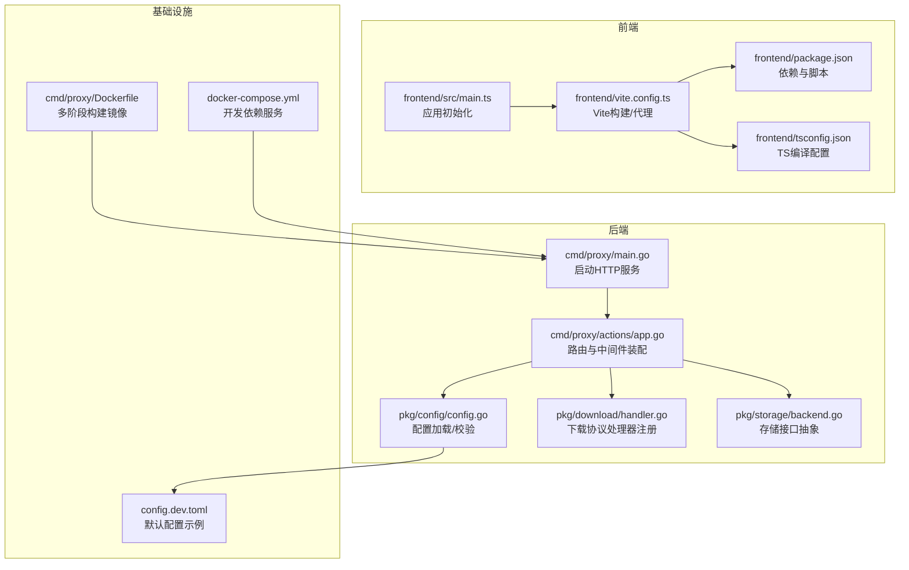
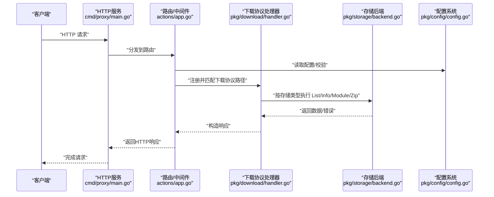
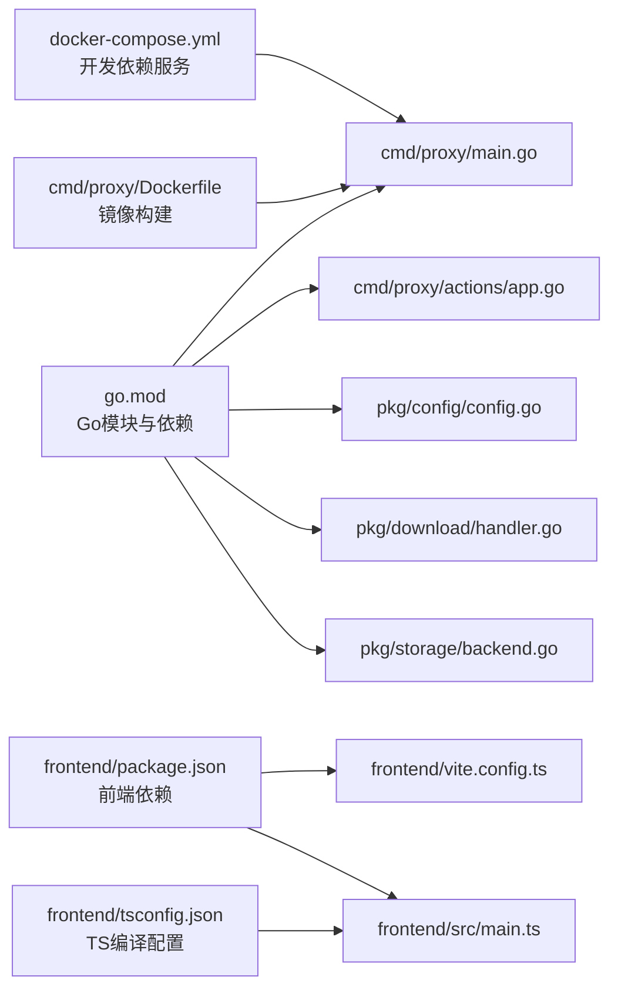

# 技术栈

<cite>
**本文引用的文件**
- [go.mod](file://go.mod)
- [frontend/package.json](file://frontend/package.json)
- [frontend/tsconfig.json](file://frontend/tsconfig.json)
- [frontend/vite.config.ts](file://frontend/vite.config.ts)
- [frontend/src/main.ts](file://frontend/src/main.ts)
- [cmd/proxy/main.go](file://cmd/proxy/main.go)
- [cmd/proxy/actions/app.go](file://cmd/proxy/actions/app.go)
- [cmd/proxy/Dockerfile](file://cmd/proxy/Dockerfile)
- [pkg/config/config.go](file://pkg/config/config.go)
- [config.dev.toml](file://config.dev.toml)
- [docker-compose.yml](file://docker-compose.yml)
- [pkg/storage/backend.go](file://pkg/storage/backend.go)
- [pkg/download/handler.go](file://pkg/download/handler.go)
- [pkg/admin/types.go](file://pkg/admin/types.go)
</cite>

## 目录
1. [引言](#引言)
2. [项目结构](#项目结构)
3. [核心组件](#核心组件)
4. [架构总览](#架构总览)
5. [详细组件分析](#详细组件分析)
6. [依赖分析](#依赖分析)
7. [性能考虑](#性能考虑)
8. [故障排查指南](#故障排查指南)
9. [结论](#结论)
10. [附录](#附录)

## 引言
本文件系统性梳理 Athens 项目的整体技术栈与架构决策，覆盖后端（Go 语言与 Gorilla Mux）、前端（Vue 3 + TypeScript + Element Plus）、基础设施（Docker 容器化与 docker-compose 开发环境）以及存储与索引的多云/多后端选择。文档同时解释技术选型原因、组件协作关系、版本兼容性与依赖管理策略，并提供可视化图示帮助读者快速理解。

## 项目结构
- 后端入口位于 cmd/proxy，通过 main.go 启动 HTTP 服务，使用 Gorilla Mux 构建路由并挂载中间件。
- 配置体系集中在 pkg/config，支持 TOML 文件与环境变量混合加载，具备严格的字段校验与默认值。
- 前端位于 frontend，基于 Vue 3 + TypeScript + Vite 构建，打包产物输出到后端静态资源目录以供内嵌访问。
- 存储与索引抽象在 pkg/storage 与 pkg/index 下，支持内存、磁盘、Mongo、MinIO、S3、Azure Blob、GCS、MySQL、Postgres 等多种后端。
- 基础设施方面，cmd/proxy/Dockerfile 提供多阶段构建镜像；docker-compose.yml 提供开发与测试所需的依赖服务（如 MongoDB、Jaeger、Redis、MinIO 等）。

图表来源
- [cmd/proxy/main.go](file://cmd/proxy/main.go#L29-L128)
- [cmd/proxy/actions/app.go](file://cmd/proxy/actions/app.go#L23-L139)
- [pkg/config/config.go](file://pkg/config/config.go#L129-L273)
- [pkg/download/handler.go](file://pkg/download/handler.go#L41-L57)
- [pkg/storage/backend.go](file://pkg/storage/backend.go#L3-L9)
- [frontend/package.json](file://frontend/package.json#L1-L30)
- [frontend/tsconfig.json](file://frontend/tsconfig.json#L1-L31)
- [frontend/vite.config.ts](file://frontend/vite.config.ts#L1-L25)
- [frontend/src/main.ts](file://frontend/src/main.ts#L1-L21)
- [cmd/proxy/Dockerfile](file://cmd/proxy/Dockerfile#L1-L61)
- [docker-compose.yml](file://docker-compose.yml#L1-L173)
- [config.dev.toml](file://config.dev.toml#L1-L628)

章节来源
- [cmd/proxy/main.go](file://cmd/proxy/main.go#L29-L128)
- [cmd/proxy/actions/app.go](file://cmd/proxy/actions/app.go#L23-L139)
- [pkg/config/config.go](file://pkg/config/config.go#L129-L273)
- [pkg/download/handler.go](file://pkg/download/handler.go#L41-L57)
- [pkg/storage/backend.go](file://pkg/storage/backend.go#L3-L9)
- [frontend/package.json](file://frontend/package.json#L1-L30)
- [frontend/tsconfig.json](file://frontend/tsconfig.json#L1-L31)
- [frontend/vite.config.ts](file://frontend/vite.config.ts#L1-L25)
- [frontend/src/main.ts](file://frontend/src/main.ts#L1-L21)
- [cmd/proxy/Dockerfile](file://cmd/proxy/Dockerfile#L1-L61)
- [docker-compose.yml](file://docker-compose.yml#L1-L173)
- [config.dev.toml](file://config.dev.toml#L1-L628)

## 核心组件
- 后端运行时与容器化
  - 运行时：Go 1.23.5（多阶段构建镜像中显式指定）
  - 容器：Alpine 基础镜像，内置 Git、Mercurial、SSH、SVN、Fossil 等版本控制工具，便于拉取私有仓库
  - 入口：/sbin/tini 作为 init，CMD 默认加载 /config/config.toml 并启动 athens-proxy
- Web 框架与路由
  - Gorilla Mux：用于声明式路由与子路径前缀支持
  - 中间件链：请求 ID、日志、安全头、可选 BasicAuth、过滤器、OpenCensus 拦截器
- 配置系统
  - 支持 TOML 文件与环境变量混合加载，字段校验（validator），默认值与权限检查
  - 关键配置项：存储类型、索引类型、网络模式、下载模式、追踪导出器、统计导出器、超时、端口/Unix Socket、HTTPS 证书、单飞机制等
- 存储与索引
  - 存储接口统一抽象 Backend（Lister/Getter/Saver/Deleter），支持内存、磁盘、Mongo、MinIO、S3、Azure Blob、GCS、External
  - 索引支持 none/memory/mysql/postgres
- 前端技术栈
  - Vue 3 + TypeScript + Vite，Element Plus UI，Pinia 状态管理，Vue Router 路由
  - 打包输出至后端静态目录，便于内嵌访问
- 基础设施与部署
  - Docker 多阶段构建，docker-compose 提供开发/测试依赖（Mongo、Jaeger、Redis、MinIO、Etcd 等）

章节来源
- [go.mod](file://go.mod#L3-L53)
- [cmd/proxy/Dockerfile](file://cmd/proxy/Dockerfile#L8-L61)
- [cmd/proxy/main.go](file://cmd/proxy/main.go#L64-L98)
- [cmd/proxy/actions/app.go](file://cmd/proxy/actions/app.go#L46-L138)
- [pkg/config/config.go](file://pkg/config/config.go#L22-L66)
- [pkg/storage/backend.go](file://pkg/storage/backend.go#L3-L9)
- [frontend/package.json](file://frontend/package.json#L11-L29)
- [frontend/vite.config.ts](file://frontend/vite.config.ts#L13-L24)
- [docker-compose.yml](file://docker-compose.yml#L3-L173)

## 架构总览
下图展示 Athens 的端到端请求流：客户端请求进入后端 HTTP 服务，经由路由与中间件处理，根据配置选择存储与索引后端，最终返回模块下载协议响应或管理后台页面。

图表来源
- [cmd/proxy/main.go](file://cmd/proxy/main.go#L64-L114)
- [cmd/proxy/actions/app.go](file://cmd/proxy/actions/app.go#L120-L131)
- [pkg/download/handler.go](file://pkg/download/handler.go#L41-L57)
- [pkg/storage/backend.go](file://pkg/storage/backend.go#L3-L9)
- [pkg/config/config.go](file://pkg/config/config.go#L229-L273)

## 详细组件分析

### 后端运行时与容器化
- 版本与基础镜像
  - Go 版本：1.23.5（构建镜像 ARG）
  - 基础镜像：Alpine 3.20
- 可用的 VCS 工具：Git、Git LFS、Mercurial、SSH、Subversion、Fossil
- 入口与命令：tini 作为 init，CMD 启动 athens-proxy 并加载 /config/config.toml
- 端口暴露：3000；支持 Unix Socket 或 TCP 监听；可选 TLS

章节来源
- [cmd/proxy/Dockerfile](file://cmd/proxy/Dockerfile#L8-L61)
- [cmd/proxy/main.go](file://cmd/proxy/main.go#L80-L98)

### Web 框架与路由（Gorilla Mux）
- 路由装配：App 函数创建 mux.Router，挂载请求 ID、日志、安全中间件
- 前缀支持：PathPrefix 子路由适配特定 Ingress 场景
- 认证与过滤：可选 BasicAuth；可选模块过滤器；可选外部验证 Hook
- 追踪与统计：OpenCensus HTTP 插件与统计导出器注册

章节来源
- [cmd/proxy/actions/app.go](file://cmd/proxy/actions/app.go#L46-L138)

### 配置系统（TOML + 环境变量）
- 加载顺序：命令行 - 文件 - 环境变量（后者覆盖前者）
- 字段校验：使用 validator 对关键字段进行结构化校验
- 默认值：dev 模式下的默认端口、日志级别、存储类型、单飞类型、索引类型等
- 权限检查：生产模式下对敏感文件权限进行检查
- 关键配置项：存储类型、索引类型、网络模式、下载模式、追踪/统计导出器、超时、端口/Unix Socket、HTTPS 证书、单飞机制、SumDB 列表等

章节来源
- [pkg/config/config.go](file://pkg/config/config.go#L129-L273)
- [config.dev.toml](file://config.dev.toml#L122-L327)

### 存储与索引抽象
- 存储接口：Backend 统一了 Lister/Getter/Saver/Deleter 四大能力
- 支持后端：memory、disk、mongo、minio、s3、azureblob、gcp、external
- 索引后端：none/memory/mysql/postgres
- 单飞机制：memory、etcd、redis、redis-sentinel、gcp、azureblob 等，用于并发写入去重

章节来源
- [pkg/storage/backend.go](file://pkg/storage/backend.go#L3-L9)
- [config.dev.toml](file://config.dev.toml#L317-L327)
- [config.dev.toml](file://config.dev.toml#L392-L628)

### 下载协议处理器
- 注册路径：/list、/latest、/info、/mod、/zip
- 缓存控制：no-cache/no-store/must-revalidate
- 日志上下文：从请求上下文提取日志条目，传入具体处理器

章节来源
- [pkg/download/handler.go](file://pkg/download/handler.go#L41-L57)

### 前端技术栈（Vue 3 + TypeScript + Element Plus）
- 依赖与脚本：Vue 3、Element Plus、Pinia、Vue Router、Axios、ECharts、Marked 等
- TypeScript：ES2020 目标、ESNext 模块解析、严格模式
- 构建与代理：Vite 构建输出到后端静态目录；开发时将 /admin/api 代理到后端
- 应用初始化：注册 Element Plus 图标、安装 Pinia/Router/Element Plus

章节来源
- [frontend/package.json](file://frontend/package.json#L11-L29)
- [frontend/tsconfig.json](file://frontend/tsconfig.json#L1-L31)
- [frontend/vite.config.ts](file://frontend/vite.config.ts#L1-L25)
- [frontend/src/main.ts](file://frontend/src/main.ts#L1-L21)

### 管理后台数据模型
- DashboardData：包含统计、下载趋势、热门模块、最近活动
- Stats：总模块数、总下载数、总仓库数、存储用量
- PopularModule：模块路径与下载次数
- RecentActivity：活动类型、消息、时间戳与详情

章节来源
- [pkg/admin/types.go](file://pkg/admin/types.go#L4-L39)

## 依赖分析
- 后端依赖管理
  - Go Modules：明确 Go 版本与第三方依赖清单，涵盖云存储 SDK（AWS、GCP、Azure）、数据库驱动、分布式锁、日志、验证、OpenCensus/Opentelemetry、etcd、Redis、Mongo 等
  - 间接依赖：大量通过 go.mod 的 indirect 列表体现，确保构建与运行时稳定性
- 前端依赖管理
  - package.json：定义运行时依赖（Vue 3、Element Plus、Axios、ECharts、Marked、Pinia、Vue Router）与开发依赖（TypeScript、Vite、Vue TSC、Sass）
  - tsconfig.json：严格 TS 编译选项，启用 bundler 模式与路径别名
- 基础设施依赖
  - docker-compose：Mongo、MinIO、Jaeger、Redis、Redis Sentinel、Etcd 集群等开发/测试依赖
  - Dockerfile：多阶段构建，仅在最终镜像中包含二进制与必要工具

图表来源
- [go.mod](file://go.mod#L3-L53)
- [frontend/package.json](file://frontend/package.json#L11-L29)
- [frontend/tsconfig.json](file://frontend/tsconfig.json#L1-L31)
- [docker-compose.yml](file://docker-compose.yml#L1-L173)
- [cmd/proxy/Dockerfile](file://cmd/proxy/Dockerfile#L1-L61)

章节来源
- [go.mod](file://go.mod#L3-L53)
- [frontend/package.json](file://frontend/package.json#L11-L29)
- [frontend/tsconfig.json](file://frontend/tsconfig.json#L1-L31)
- [docker-compose.yml](file://docker-compose.yml#L1-L173)
- [cmd/proxy/Dockerfile](file://cmd/proxy/Dockerfile#L1-L61)

## 性能考虑
- 并发与单飞
  - 下载工作线程（ProtocolWorkers）与 Go 获取工作线程（GoGetWorkers）可调，避免低性能实例资源耗尽
  - 单飞机制（memory/etcd/redis/redis-sentinel/gcp/azureblob）避免并发写入冲突
- 缓存控制
  - 下载协议处理器强制 no-cache/no-store/must-revalidate，确保一致性
- 超时与优雅停机
  - 统一超时配置（Timeout），关闭时支持优雅停机（ShutdownTimeout）
- 追踪与监控
  - OpenCensus 插件与 Prometheus 导出器，便于性能观测与告警

章节来源
- [pkg/config/config.go](file://pkg/config/config.go#L146-L213)
- [pkg/download/handler.go](file://pkg/download/handler.go#L46-L56)
- [cmd/proxy/main.go](file://cmd/proxy/main.go#L121-L126)

## 故障排查指南
- 启动失败
  - 检查配置文件与环境变量是否正确加载（优先级：命令行 > 文件 > 环境变量）
  - 确认端口/Unix Socket 是否被占用，TLS 证书路径是否有效
- 存储连接问题
  - 根据 StorageType 校验对应后端配置（URL、密钥、区域、桶/容器名等）
  - 生产模式下检查敏感文件权限
- 下载异常
  - 查看日志级别与格式（LogFormat/LogLevel），确认 BasicAuth/过滤器/验证 Hook 是否生效
  - 检查网络模式（NetworkMode）与上游可达性
- 前端无法访问
  - 确认 Vite 代理配置与后端端口一致，构建产物已复制到后端静态目录

章节来源
- [pkg/config/config.go](file://pkg/config/config.go#L129-L273)
- [cmd/proxy/main.go](file://cmd/proxy/main.go#L64-L98)
- [frontend/vite.config.ts](file://frontend/vite.config.ts#L17-L24)

## 结论
Athens 在后端采用 Go + Gorilla Mux 的轻量高效组合，配合完善的配置系统与多后端存储/索引抽象，满足企业级私有模块代理与缓存需求。前端以 Vue 3 + TypeScript + Element Plus 构建现代化管理界面，结合 Vite 的热更新与代理能力，提升开发体验。基础设施方面，Docker 多阶段构建与 docker-compose 开发环境降低了部署与调试成本。整体技术栈在可维护性、可观测性与扩展性之间取得良好平衡。

## 附录
- 版本兼容性要点
  - Go：1.23.5（构建与运行）
  - Vue：^3.3.8
  - TypeScript：^5.2.2
  - Element Plus：^2.4.2
  - Vite：^5.0.0
- 依赖管理策略
  - 后端：集中于 go.mod，明确主版本与关键依赖范围
  - 前端：package.json 明确运行时与开发依赖，tsconfig 严格约束编译行为
  - 基础设施：Dockerfile 与 docker-compose 明确镜像与服务版本