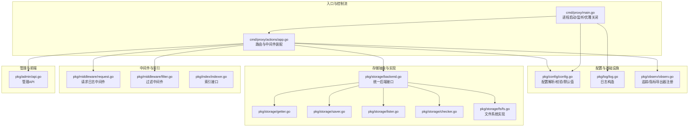
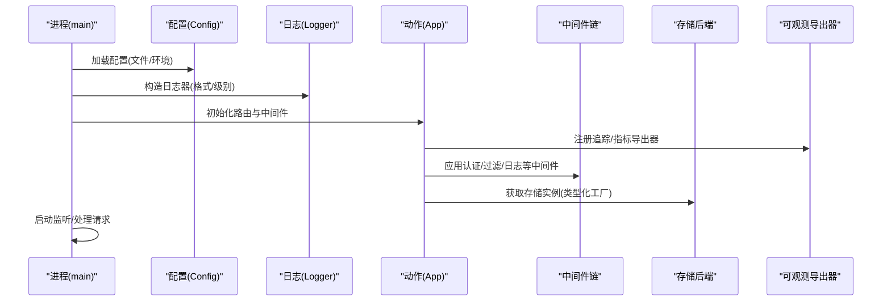
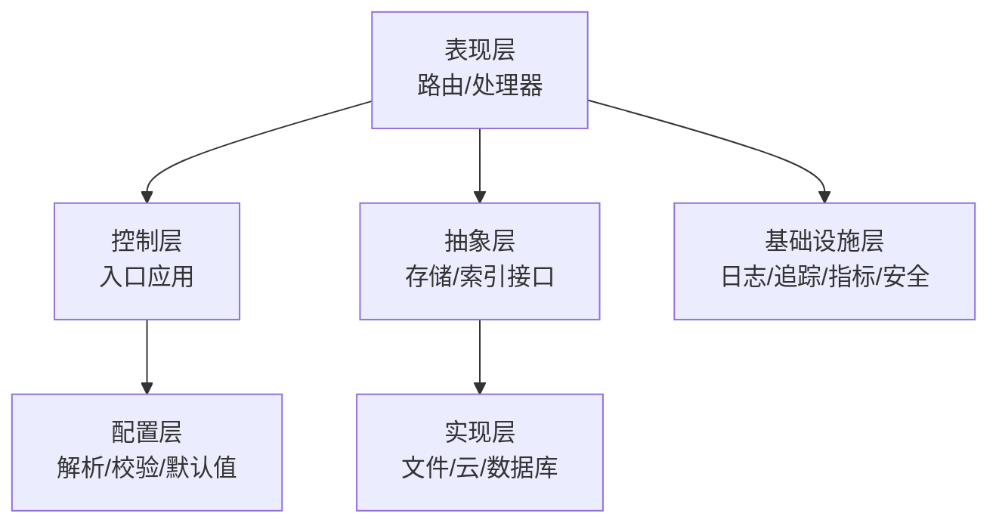
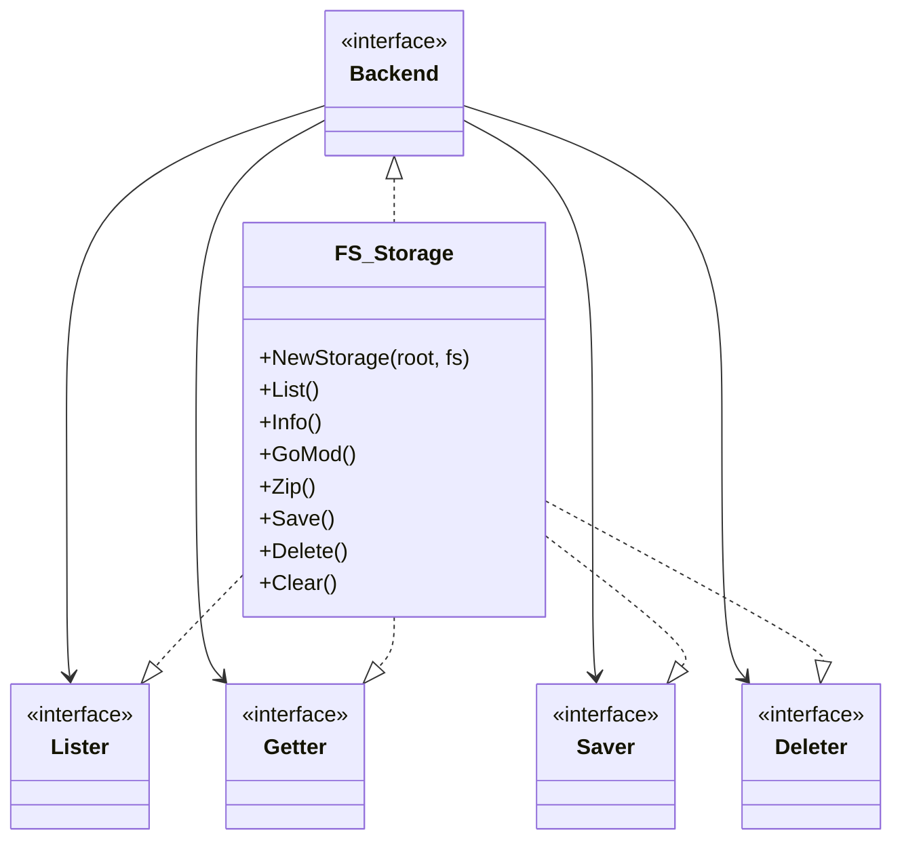
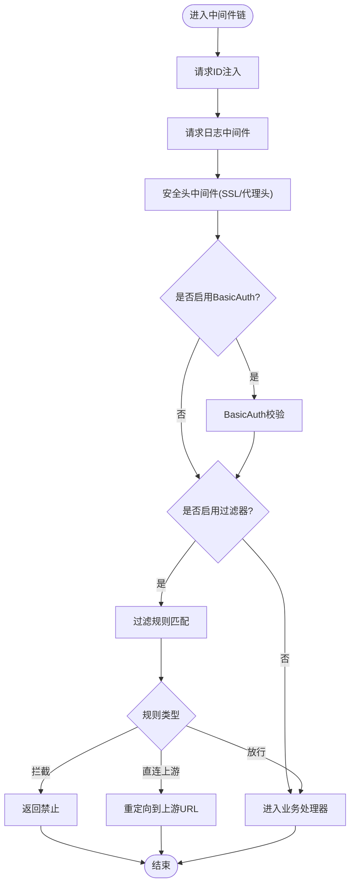
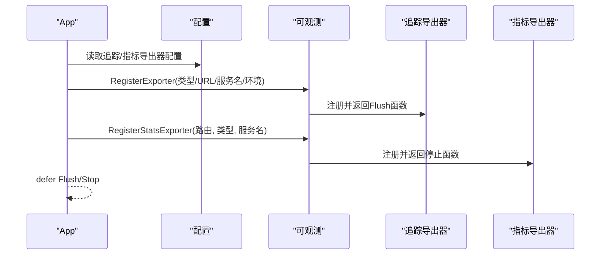
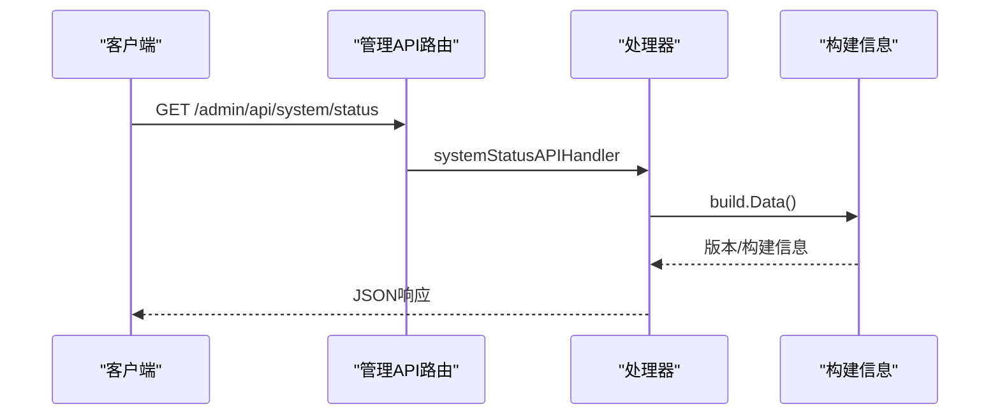
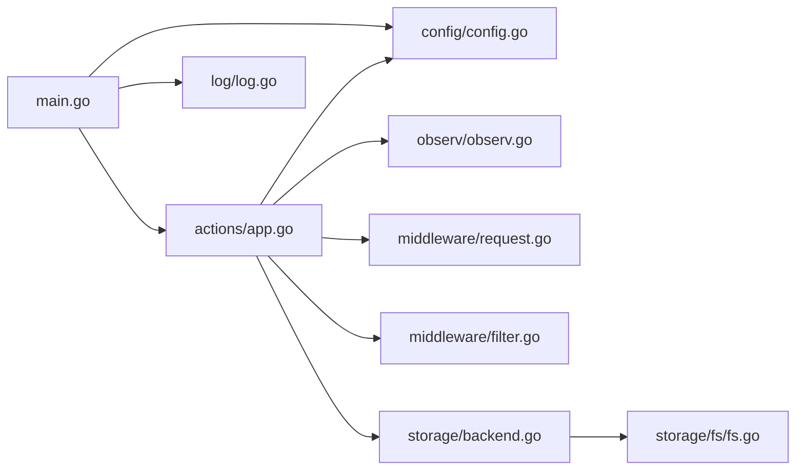

# 架构理念

<cite>
**本文引用的文件**
- [cmd/proxy/main.go](file://cmd/proxy/main.go)
- [cmd/proxy/actions/app.go](file://cmd/proxy/actions/app.go)
- [pkg/config/config.go](file://pkg/config/config.go)
- [pkg/storage/backend.go](file://pkg/storage/backend.go)
- [pkg/storage/getter.go](file://pkg/storage/getter.go)
- [pkg/storage/saver.go](file://pkg/storage/saver.go)
- [pkg/storage/lister.go](file://pkg/storage/lister.go)
- [pkg/storage/checker.go](file://pkg/storage/checker.go)
- [pkg/storage/fs/fs.go](file://pkg/storage/fs/fs.go)
- [pkg/middleware/request.go](file://pkg/middleware/request.go)
- [pkg/middleware/filter.go](file://pkg/middleware/filter.go)
- [pkg/index/indexer.go](file://pkg/index/indexer.go)
- [pkg/observ/observ.go](file://pkg/observ/observ.go)
- [pkg/log/log.go](file://pkg/log/log.go)
- [pkg/admin/api.go](file://pkg/admin/api.go)
</cite>

## 目录
1. [引言](#引言)
2. [项目结构](#项目结构)
3. [核心组件](#核心组件)
4. [架构总览](#架构总览)
5. [详细组件分析](#详细组件分析)
6. [依赖分析](#依赖分析)
7. [性能考量](#性能考量)
8. [故障排查指南](#故障排查指南)
9. [结论](#结论)

## 引言
本文件面向 Athens 项目的架构理念与设计原则，系统阐述模块化设计、接口抽象、中间件模式、分层架构、插件化扩展、可观察性、高可用与可扩展性等关键主题，并结合代码级组件关系图与流程图，帮助读者快速理解系统设计思路与落地方式。

## 项目结构
Athens 采用以“入口应用 → 动作装配 → 配置驱动 → 存储/索引/中间件/可观测”为核心的分层组织方式：
- 入口应用负责生命周期管理（启动、监听、优雅关闭）、日志与配置加载
- 动作装配负责路由注册、中间件链路拼装、导出器注册
- 配置模块提供统一的环境变量与文件配置解析、校验与默认值
- 存储子系统通过统一接口抽象多种后端（文件系统、云存储、数据库）
- 中间件提供认证、过滤、日志、请求ID等横切能力
- 可观察性模块提供链路追踪与指标导出
- 管理 API 提供系统状态、仪表盘、下载与上传等管理能力

**图表来源**
- [cmd/proxy/main.go](file://cmd/proxy/main.go#L29-L127)
- [cmd/proxy/actions/app.go](file://cmd/proxy/actions/app.go#L23-L138)
- [pkg/config/config.go](file://pkg/config/config.go#L127-L254)
- [pkg/storage/backend.go](file://pkg/storage/backend.go#L3-L9)
- [pkg/storage/getter.go](file://pkg/storage/getter.go#L8-L13)
- [pkg/storage/saver.go](file://pkg/storage/saver.go#L8-L11)
- [pkg/storage/lister.go](file://pkg/storage/lister.go#L5-L10)
- [pkg/storage/checker.go](file://pkg/storage/checker.go#L9-L14)
- [pkg/storage/fs/fs.go](file://pkg/storage/fs/fs.go#L13-L39)
- [pkg/middleware/request.go](file://pkg/middleware/request.go#L22-L33)
- [pkg/middleware/filter.go](file://pkg/middleware/filter.go#L13-L48)
- [pkg/index/indexer.go](file://pkg/index/indexer.go#L15-L29)
- [pkg/observ/observ.go](file://pkg/observ/observ.go#L14-L31)
- [pkg/log/log.go](file://pkg/log/log.go#L13-L27)
- [pkg/admin/api.go](file://pkg/admin/api.go#L15-L48)

**章节来源**
- [cmd/proxy/main.go](file://cmd/proxy/main.go#L29-L127)
- [cmd/proxy/actions/app.go](file://cmd/proxy/actions/app.go#L23-L138)
- [pkg/config/config.go](file://pkg/config/config.go#L127-L254)

## 核心组件
- 统一配置中心：集中解析 TOML 文件、环境变量覆盖、字段校验与默认值生成，支撑多后端与导出器选择
- 存储抽象层：以接口组合的方式定义 Lister/Getter/Saver/Deleter，屏蔽具体后端差异
- 中间件体系：认证、过滤、日志、请求ID、安全头注入等，形成可插拔的横切能力
- 可观察性：统一追踪与指标导出器注册，支持多厂商出口
- 管理 API：提供系统状态、仪表盘、下载/上传等管理能力

**章节来源**
- [pkg/config/config.go](file://pkg/config/config.go#L21-L66)
- [pkg/storage/backend.go](file://pkg/storage/backend.go#L3-L9)
- [pkg/middleware/filter.go](file://pkg/middleware/filter.go#L13-L48)
- [pkg/observ/observ.go](file://pkg/observ/observ.go#L14-L31)
- [pkg/admin/api.go](file://pkg/admin/api.go#L15-L48)

## 架构总览
下图展示从进程启动到请求处理的关键路径，体现“配置驱动 + 接口抽象 + 中间件链 + 导出器”的整体设计：

**图表来源**
- [cmd/proxy/main.go](file://cmd/proxy/main.go#L35-L62)
- [cmd/proxy/actions/app.go](file://cmd/proxy/actions/app.go#L46-L138)
- [pkg/config/config.go](file://pkg/config/config.go#L127-L254)
- [pkg/observ/observ.go](file://pkg/observ/observ.go#L14-L31)

## 详细组件分析

### 分层架构与职责分离
- 表现层：路由与处理器由动作装配模块集中管理，便于统一中间件与导出器接入
- 控制层：入口应用负责生命周期、信号处理、监听与优雅关闭
- 配置层：集中解析与校验，确保运行时一致性
- 抽象层：存储与索引接口定义清晰边界，便于替换与扩展
- 基础设施层：日志、追踪、指标、安全头等横切关注点通过中间件注入

[本图为概念性分层示意，无需图表来源]

### 存储抽象与插件化
- 接口组合：统一后端接口由 Lister/Getter/Saver/Deleter 组合而成，便于按需适配
- 实现解耦：不同后端仅实现所需接口，避免“胖接口”带来的负担
- 工厂选择：通过配置中的类型字段与对应配置段，动态构建具体存储实例

**图表来源**
- [pkg/storage/backend.go](file://pkg/storage/backend.go#L3-L9)
- [pkg/storage/lister.go](file://pkg/storage/lister.go#L5-L10)
- [pkg/storage/getter.go](file://pkg/storage/getter.go#L8-L13)
- [pkg/storage/saver.go](file://pkg/storage/saver.go#L8-L11)
- [pkg/storage/fs/fs.go](file://pkg/storage/fs/fs.go#L13-L39)

**章节来源**
- [pkg/storage/backend.go](file://pkg/storage/backend.go#L3-L9)
- [pkg/storage/fs/fs.go](file://pkg/storage/fs/fs.go#L13-L39)

### 中间件模式与横切关注点
- 请求日志中间件：在响应写回前记录状态码与上下文字段，便于开发调试
- 过滤中间件：基于规则对模块请求进行放行、拦截或重定向至上游代理
- 安全头与认证：统一注入 SSL 重定向与 BasicAuth，保障传输安全与访问控制

**图表来源**
- [cmd/proxy/actions/app.go](file://cmd/proxy/actions/app.go#L46-L107)
- [pkg/middleware/request.go](file://pkg/middleware/request.go#L22-L33)
- [pkg/middleware/filter.go](file://pkg/middleware/filter.go#L13-L48)

**章节来源**
- [pkg/middleware/request.go](file://pkg/middleware/request.go#L22-L33)
- [pkg/middleware/filter.go](file://pkg/middleware/filter.go#L13-L48)

### 可观察性设计
- 追踪导出器：支持 Jaeger、Datadog、Stackdriver 等，按配置动态注册并采样策略
- 指标导出器：通过路由注册 Prometheus 等指标端点，采集运行时指标
- 日志：根据云平台与格式要求构造日志器，统一输出与上下文字段

**图表来源**
- [cmd/proxy/actions/app.go](file://cmd/proxy/actions/app.go#L74-L94)
- [pkg/observ/observ.go](file://pkg/observ/observ.go#L14-L31)
- [pkg/log/log.go](file://pkg/log/log.go#L13-L27)

**章节来源**
- [pkg/observ/observ.go](file://pkg/observ/observ.go#L14-L31)
- [pkg/log/log.go](file://pkg/log/log.go#L13-L27)

### 管理 API 与系统状态
- 管理 API：提供系统状态、仪表盘、下载/上传等管理接口，便于运维与监控
- 系统状态：包含运行时间、版本、内存占用等基础信息

**图表来源**
- [pkg/admin/api.go](file://pkg/admin/api.go#L15-L48)
- [pkg/admin/api.go](file://pkg/admin/api.go#L50-L101)

**章节来源**
- [pkg/admin/api.go](file://pkg/admin/api.go#L15-L48)
- [pkg/admin/api.go](file://pkg/admin/api.go#L50-L101)

## 依赖分析
- 入口应用依赖配置与日志模块，通过动作装配组装中间件与导出器
- 动作装配依赖存储工厂、过滤器、验证钩子、索引接口等，形成完整处理链
- 存储抽象通过接口组合实现多后端插件化，文件系统实现作为最小可用示例

**图表来源**
- [cmd/proxy/main.go](file://cmd/proxy/main.go#L35-L62)
- [cmd/proxy/actions/app.go](file://cmd/proxy/actions/app.go#L23-L138)
- [pkg/config/config.go](file://pkg/config/config.go#L127-L254)
- [pkg/storage/backend.go](file://pkg/storage/backend.go#L3-L9)
- [pkg/storage/fs/fs.go](file://pkg/storage/fs/fs.go#L13-L39)

**章节来源**
- [cmd/proxy/main.go](file://cmd/proxy/main.go#L35-L62)
- [cmd/proxy/actions/app.go](file://cmd/proxy/actions/app.go#L23-L138)

## 性能考量
- 并发与工作线程：配置中提供协议与 go-get 工作者数量，便于调整吞吐
- 单飞机制：通过配置选择内存/Redis/Etcd/GCP 等单飞实现，降低重复拉取开销
- 指标导出：Prometheus 等指标导出便于容量规划与热点识别
- I/O 优化：存储接口返回带尺寸的读取器，有助于上层做缓冲与并发控制

[本节为通用性能建议，不直接分析具体文件]

## 故障排查指南
- 配置校验失败：确认配置文件与环境变量格式正确，必要时启用默认配置定位问题
- 存储后端不可用：检查后端连接参数与权限，优先使用最小可用实现（如文件系统）验证链路
- 中间件异常：逐步移除中间件定位问题；开发模式下请求日志中间件可辅助定位
- 可观测性：确认追踪/指标导出器 URL 与类型配置正确，开发环境可开启采样以便观察

**章节来源**
- [pkg/config/config.go](file://pkg/config/config.go#L282-L297)
- [pkg/storage/fs/fs.go](file://pkg/storage/fs/fs.go#L30-L38)
- [pkg/middleware/request.go](file://pkg/middleware/request.go#L22-L33)
- [pkg/observ/observ.go](file://pkg/observ/observ.go#L14-L31)

## 结论
Athens 的架构以“配置驱动 + 接口抽象 + 中间件模式”为核心，通过清晰的分层与插件化设计，实现了存储后端与功能扩展的灵活替换，同时以统一的可观察性与管理 API 支撑运维与监控。该设计既保证了工程上的可维护性，也为高可用与可扩展性提供了坚实基础。