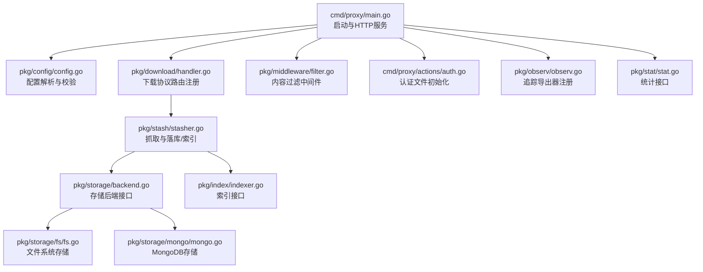
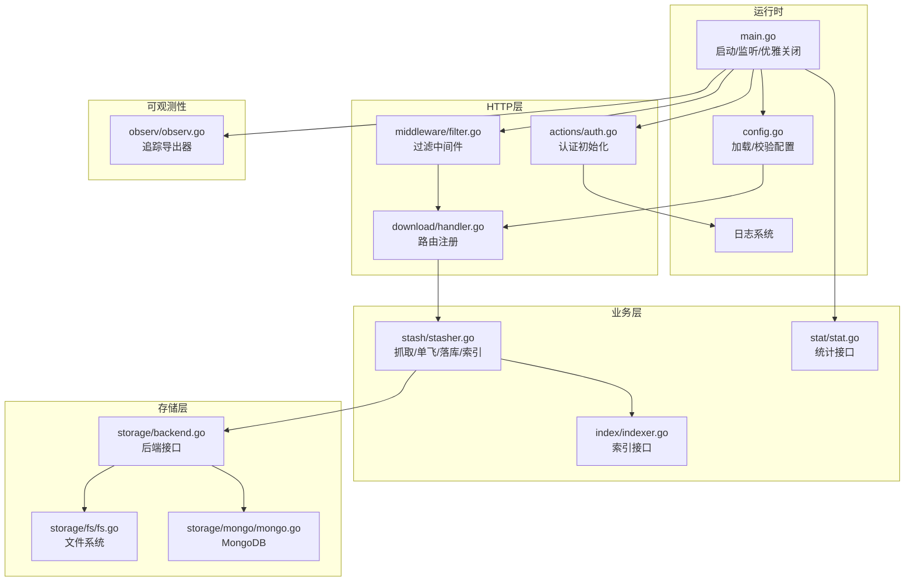
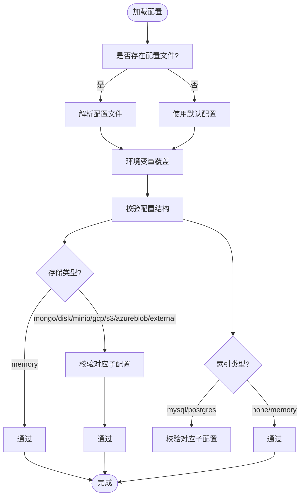
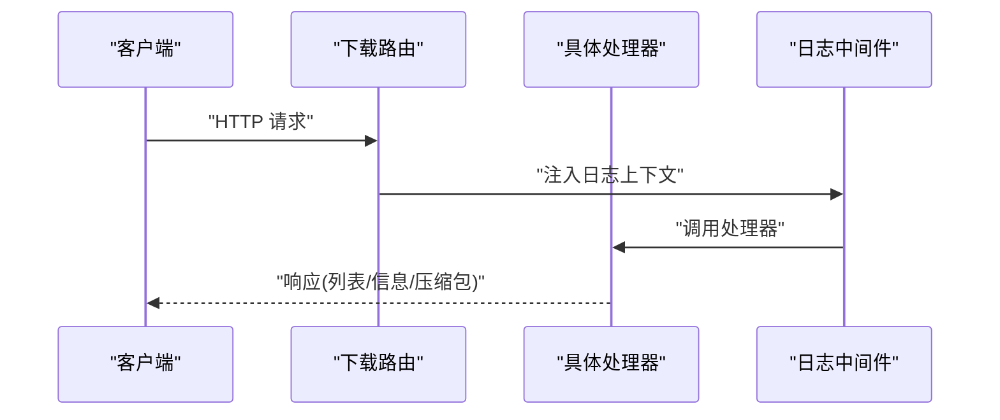
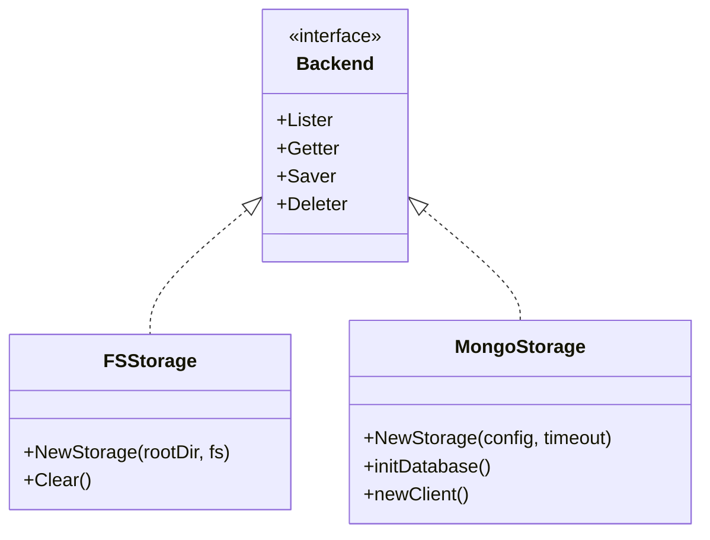
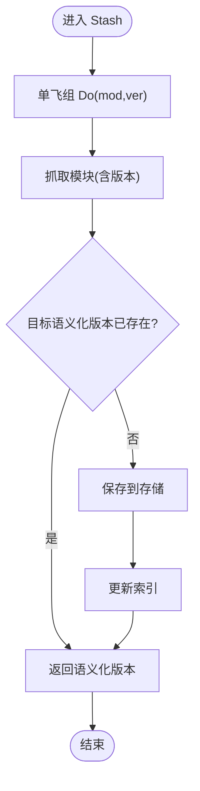
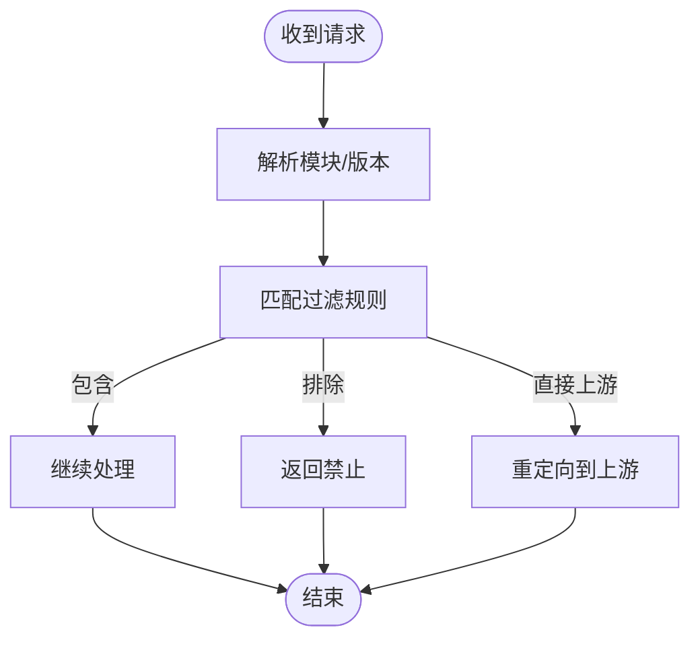
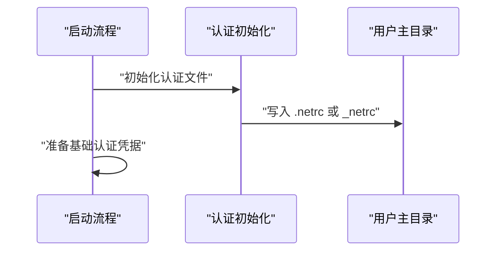
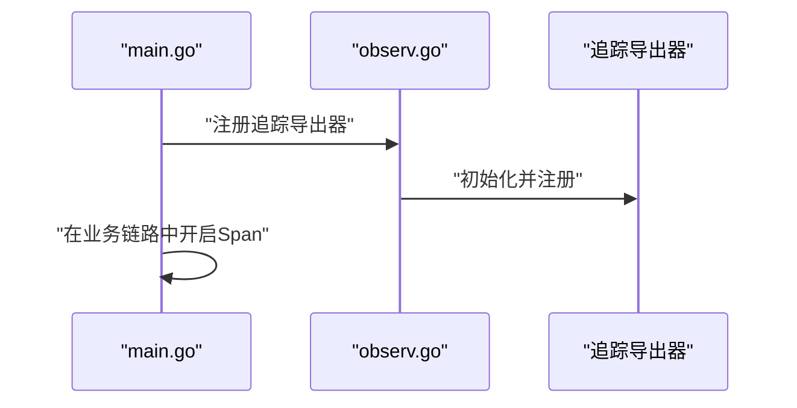
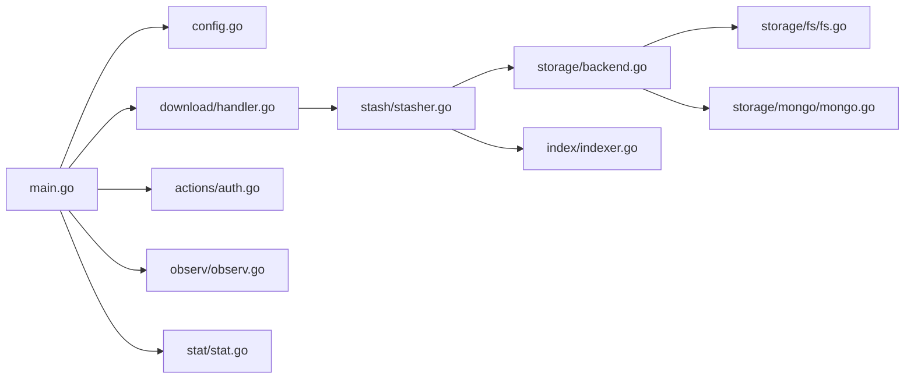

# 核心特性

<cite>
**本文引用的文件**
- [cmd/proxy/main.go](file://cmd/proxy/main.go)
- [pkg/config/config.go](file://pkg/config/config.go)
- [pkg/config/storage.go](file://pkg/config/storage.go)
- [pkg/download/handler.go](file://pkg/download/handler.go)
- [pkg/storage/backend.go](file://pkg/storage/backend.go)
- [pkg/storage/module.go](file://pkg/storage/module.go)
- [pkg/storage/fs/fs.go](file://pkg/storage/fs/fs.go)
- [pkg/storage/mongo/mongo.go](file://pkg/storage/mongo/mongo.go)
- [pkg/stash/stasher.go](file://pkg/stash/stasher.go)
- [pkg/index/indexer.go](file://pkg/index/indexer.go)
- [pkg/middleware/filter.go](file://pkg/middleware/filter.go)
- [cmd/proxy/actions/auth.go](file://cmd/proxy/actions/auth.go)
- [pkg/observ/observ.go](file://pkg/observ/observ.go)
- [pkg/stat/stat.go](file://pkg/stat/stat.go)
- [README.md](file://README.md)
</cite>

## 目录
1. [简介](#简介)
2. [项目结构](#项目结构)
3. [核心组件](#核心组件)
4. [架构总览](#架构总览)
5. [详细组件分析](#详细组件分析)
6. [依赖关系分析](#依赖关系分析)
7. [性能考量](#性能考量)
8. [故障排查指南](#故障排查指南)
9. [结论](#结论)
10. [附录](#附录)

## 简介
本节概述 Athens 作为 Go 模块代理服务器的核心定位与价值主张：实现官方模块下载协议，提供模块下载代理、版本管理、缓存与索引、安全认证、内容过滤、可观测性与统计等企业级能力，并通过高度可配置的存储后端适配多种部署形态（云存储、MongoDB、CDN、共享磁盘、内存等），满足从开发到生产的多样化需求。

## 项目结构
- 入口与运行时
  - 启动入口位于命令行程序，负责加载配置、初始化日志、构建 HTTP 处理器、启动服务与优雅关闭。
- 配置系统
  - 统一的配置模型支持多后端存储、索引、网络模式、下载模式、认证、过滤、追踪与指标导出等。
- 下载协议与路由
  - 实现 Go 模块下载协议的路由注册，处理列表、最新版本、信息与压缩包等请求。
- 存储与索引
  - 抽象存储后端接口，提供多种具体实现；同时提供索引接口以记录模块版本元数据。
- 缓存与去重
  - 使用单飞机制避免并发重复抓取，结合存储后端实现高效缓存。
- 安全与过滤
  - 支持基础认证与内容过滤中间件，按规则允许、拒绝或直连上游。
- 可观测性与统计
  - 支持多种追踪导出器与指标导出，提供仪表盘与列表统计接口。

图表来源
- [cmd/proxy/main.go](file://cmd/proxy/main.go#L29-L127)
- [pkg/config/config.go](file://pkg/config/config.go#L129-L254)
- [pkg/download/handler.go](file://pkg/download/handler.go#L39-L57)
- [pkg/stash/stasher.go](file://pkg/stash/stasher.go#L29-L39)
- [pkg/storage/backend.go](file://pkg/storage/backend.go#L3-L9)
- [pkg/storage/fs/fs.go](file://pkg/storage/fs/fs.go#L26-L39)
- [pkg/storage/mongo/mongo.go](file://pkg/storage/mongo/mongo.go#L30-L50)
- [pkg/index/indexer.go](file://pkg/index/indexer.go#L15-L29)
- [pkg/middleware/filter.go](file://pkg/middleware/filter.go#L13-L48)
- [cmd/proxy/actions/auth.go](file://cmd/proxy/actions/auth.go#L13-L38)
- [pkg/observ/observ.go](file://pkg/observ/observ.go#L14-L31)
- [pkg/stat/stat.go](file://pkg/stat/stat.go#L5-L10)

章节来源
- [cmd/proxy/main.go](file://cmd/proxy/main.go#L29-L127)
- [pkg/config/config.go](file://pkg/config/config.go#L129-L254)

## 核心组件
- 配置系统
  - 提供统一的配置结构体，支持环境变量覆盖、默认值、字段校验与存储/索引子配置的动态校验。
  - 关键能力：日志级别与格式、pprof 开关、过滤文件、追踪导出器、指标导出器、存储类型、索引类型、网络模式、下载模式、认证与上游等。
- 下载协议处理器
  - 注册模块列表、最新版本、信息与压缩包等路径，统一注入日志上下文与缓存控制中间件。
- 存储后端
  - 抽象为具备列举、读取、保存、删除能力的组合接口，便于替换与扩展。
- 索引器
  - 记录模块版本与时间戳，支持查询增量与总数统计。
- 缓存与抓取
  - 通过单飞组避免并发重复抓取，抓取成功后写入存储并更新索引。
- 内容过滤
  - 基于规则对模块/版本进行包含、排除或直连上游策略。
- 安全认证
  - 支持基础认证与认证文件初始化（.netrc/hg 等）。
- 可观测性
  - 支持 Jaeger、Datadog、Stackdriver 等追踪导出器注册与采样策略。
- 统计接口
  - 提供仪表盘与模块列表统计能力，便于运维与监控。

章节来源
- [pkg/config/config.go](file://pkg/config/config.go#L21-L66)
- [pkg/download/handler.go](file://pkg/download/handler.go#L14-L57)
- [pkg/storage/backend.go](file://pkg/storage/backend.go#L3-L9)
- [pkg/index/indexer.go](file://pkg/index/indexer.go#L15-L29)
- [pkg/stash/stasher.go](file://pkg/stash/stasher.go#L29-L39)
- [pkg/middleware/filter.go](file://pkg/middleware/filter.go#L13-L48)
- [cmd/proxy/actions/auth.go](file://cmd/proxy/actions/auth.go#L13-L38)
- [pkg/observ/observ.go](file://pkg/observ/observ.go#L14-L31)
- [pkg/stat/stat.go](file://pkg/stat/stat.go#L5-L10)

## 架构总览
下图展示了 Athens 的核心运行时架构：启动流程、配置加载、HTTP 路由、下载协议处理、抓取与存储、索引、过滤与认证、追踪与统计。

图表来源
- [cmd/proxy/main.go](file://cmd/proxy/main.go#L29-L127)
- [pkg/config/config.go](file://pkg/config/config.go#L129-L254)
- [pkg/download/handler.go](file://pkg/download/handler.go#L39-L57)
- [pkg/stash/stasher.go](file://pkg/stash/stasher.go#L49-L93)
- [pkg/storage/backend.go](file://pkg/storage/backend.go#L3-L9)
- [pkg/storage/fs/fs.go](file://pkg/storage/fs/fs.go#L26-L39)
- [pkg/storage/mongo/mongo.go](file://pkg/storage/mongo/mongo.go#L30-L50)
- [pkg/index/indexer.go](file://pkg/index/indexer.go#L15-L29)
- [pkg/middleware/filter.go](file://pkg/middleware/filter.go#L13-L48)
- [cmd/proxy/actions/auth.go](file://cmd/proxy/actions/auth.go#L13-L38)
- [pkg/observ/observ.go](file://pkg/observ/observ.go#L14-L31)
- [pkg/stat/stat.go](file://pkg/stat/stat.go#L5-L10)

## 详细组件分析

### 配置系统与高可配置性
- 配置来源与优先级
  - 支持从指定配置文件加载，若不存在则回退到默认配置并通过环境变量覆盖。
  - 端口解析与格式化，支持 PORT 与 ATHENS_PORT 的优先级。
- 字段校验与分组校验
  - 对存储类型与索引类型进行分支校验，确保对应子配置完整有效。
- 运行时开关
  - 日志级别/格式、pprof 开关与端口、追踪导出器、指标导出器、下载模式、网络模式、过滤文件、认证凭据、上游 SumDB 与 NoSum 模式等。

图表来源
- [pkg/config/config.go](file://pkg/config/config.go#L129-L254)
- [pkg/config/config.go](file://pkg/config/config.go#L282-L297)
- [pkg/config/config.go](file://pkg/config/config.go#L299-L333)

章节来源
- [pkg/config/config.go](file://pkg/config/config.go#L129-L254)
- [pkg/config/config.go](file://pkg/config/config.go#L282-L297)
- [pkg/config/config.go](file://pkg/config/config.go#L299-L333)

### 下载协议与路由
- 路由注册
  - 列表、最新版本、信息与压缩包路径统一注册，并注入缓存控制中间件。
- 请求上下文日志
  - 通过日志中间件从请求上下文中提取日志条目，传入具体处理器。
- 重定向策略
  - 在需要时根据基础 URL 与下载路径生成重定向地址。

图表来源
- [pkg/download/handler.go](file://pkg/download/handler.go#L39-L57)
- [pkg/download/handler.go](file://pkg/download/handler.go#L30-L37)

章节来源
- [pkg/download/handler.go](file://pkg/download/handler.go#L14-L57)

### 存储后端与版本管理
- 后端抽象
  - 后端接口组合了列举、读取、保存、删除能力，便于替换与扩展。
- 文件系统存储
  - 基于根目录与虚拟文件系统实现模块与版本的目录结构组织。
- MongoDB 存储
  - 建立唯一稀疏索引以加速查询，支持证书与超时配置。
- 版本模型
  - 模块版本数据结构包含模块名、版本号、模块元数据与压缩包等字段。

图表来源
- [pkg/storage/backend.go](file://pkg/storage/backend.go#L3-L9)
- [pkg/storage/fs/fs.go](file://pkg/storage/fs/fs.go#L26-L39)
- [pkg/storage/mongo/mongo.go](file://pkg/storage/mongo/mongo.go#L30-L50)

章节来源
- [pkg/storage/backend.go](file://pkg/storage/backend.go#L3-L9)
- [pkg/storage/fs/fs.go](file://pkg/storage/fs/fs.go#L26-L39)
- [pkg/storage/mongo/mongo.go](file://pkg/storage/mongo/mongo.go#L30-L50)
- [pkg/storage/module.go](file://pkg/storage/module.go#L7-L16)

### 缓存机制与抓取流程
- 单飞去重
  - 使用单飞组对同一模块与版本的并发请求进行合并，避免重复抓取。
- 抓取与落库
  - 成功抓取后，先检查目标语义化版本是否已存在，再保存到存储并更新索引。
- 超时与追踪
  - 为抓取过程设置独立超时上下文，保留追踪信息贯穿整个流程。

图表来源
- [pkg/stash/stasher.go](file://pkg/stash/stasher.go#L49-L93)

章节来源
- [pkg/stash/stasher.go](file://pkg/stash/stasher.go#L29-L39)
- [pkg/stash/stasher.go](file://pkg/stash/stasher.go#L49-L93)

### 内容过滤与上游直连
- 规则匹配
  - 对模块与版本匹配过滤规则：包含、排除、直接上游。
- 上游重定向
  - 当规则为“直接上游”时，将请求重定向至上游代理对应路径。

图表来源
- [pkg/middleware/filter.go](file://pkg/middleware/filter.go#L13-L48)

章节来源
- [pkg/middleware/filter.go](file://pkg/middleware/filter.go#L13-L48)

### 安全认证与凭据管理
- 认证文件初始化
  - 将指定路径的认证文件复制到用户主目录，兼容 .netrc 与 hg 配置文件命名。
- Token 到 .netrc
  - 支持从令牌生成 .netrc 文件，用于访问私有仓库。
- 基础认证
  - 配置用户名与密码，配合下游中间件实现鉴权。

图表来源
- [cmd/proxy/actions/auth.go](file://cmd/proxy/actions/auth.go#L13-L38)

章节来源
- [cmd/proxy/actions/auth.go](file://cmd/proxy/actions/auth.go#L13-L38)

### 可观测性与监控追踪
- 导出器注册
  - 支持 Jaeger、Datadog、Stackdriver 等追踪导出器，按环境设置采样策略。
- 跨组件集成
  - 在抓取与处理链路中开启 Span，便于端到端追踪。

图表来源
- [pkg/observ/observ.go](file://pkg/observ/observ.go#L14-L31)
- [pkg/observ/observ.go](file://pkg/observ/observ.go#L60-L65)

章节来源
- [pkg/observ/observ.go](file://pkg/observ/observ.go#L14-L31)
- [pkg/observ/observ.go](file://pkg/observ/observ.go#L60-L65)

### 统计与仪表盘
- 接口定义
  - 提供仪表盘与模块列表统计接口，便于前端展示与运维监控。

章节来源
- [pkg/stat/stat.go](file://pkg/stat/stat.go#L5-L10)

## 依赖关系分析
- 组件耦合
  - 启动入口仅依赖配置与应用工厂，路由与处理器通过接口解耦。
  - 存储与索引通过接口抽象，便于替换具体实现。
- 外部依赖
  - 日志、追踪、并发单飞、数据库驱动等均通过模块化引入，降低耦合度。
- 循环依赖
  - 未见明显循环依赖迹象，接口抽象清晰。

图表来源
- [cmd/proxy/main.go](file://cmd/proxy/main.go#L29-L127)
- [pkg/config/config.go](file://pkg/config/config.go#L129-L254)
- [pkg/download/handler.go](file://pkg/download/handler.go#L39-L57)
- [pkg/stash/stasher.go](file://pkg/stash/stasher.go#L29-L39)
- [pkg/storage/backend.go](file://pkg/storage/backend.go#L3-L9)
- [pkg/storage/fs/fs.go](file://pkg/storage/fs/fs.go#L26-L39)
- [pkg/storage/mongo/mongo.go](file://pkg/storage/mongo/mongo.go#L30-L50)
- [pkg/index/indexer.go](file://pkg/index/indexer.go#L15-L29)
- [cmd/proxy/actions/auth.go](file://cmd/proxy/actions/auth.go#L13-L38)
- [pkg/observ/observ.go](file://pkg/observ/observ.go#L14-L31)
- [pkg/stat/stat.go](file://pkg/stat/stat.go#L5-L10)

章节来源
- [cmd/proxy/main.go](file://cmd/proxy/main.go#L29-L127)
- [pkg/config/config.go](file://pkg/config/config.go#L129-L254)

## 性能考量
- 并发抓取去重
  - 单飞组显著减少重复抓取带来的带宽与 CPU 消耗。
- 缓存与索引
  - 存储后端与索引配合，提升查询效率与增量统计能力。
- 超时与资源释放
  - 抓取阶段设置独立超时，确保长时间任务不会阻塞请求生命周期。
- 日志与追踪
  - 结合 pprof 与追踪导出器，便于定位热点与瓶颈。

## 故障排查指南
- 配置问题
  - 确认配置文件与环境变量覆盖是否正确，注意端口格式与权限校验。
- 存储连接失败
  - 检查存储后端的连接参数、证书与超时设置。
- 过滤导致访问异常
  - 检查过滤规则是否误命中模块/版本，必要时临时禁用过滤文件验证。
- 认证失败
  - 确认认证文件是否正确写入用户主目录，令牌生成逻辑是否成功。
- 追踪与指标
  - 确认追踪导出器 URL 与服务名配置正确，开发环境采样策略是否启用。

章节来源
- [pkg/config/config.go](file://pkg/config/config.go#L242-L253)
- [pkg/storage/mongo/mongo.go](file://pkg/storage/mongo/mongo.go#L74-L116)
- [pkg/middleware/filter.go](file://pkg/middleware/filter.go#L13-L48)
- [cmd/proxy/actions/auth.go](file://cmd/proxy/actions/auth.go#L13-L38)
- [pkg/observ/observ.go](file://pkg/observ/observ.go#L14-L31)

## 结论
Athens 以模块化设计实现了企业级 Go 模块代理能力：通过统一配置与接口抽象，灵活适配多种存储与索引后端；借助单飞去重、缓存与索引、内容过滤与认证、可观测性与统计，满足从开发到生产的多样化需求。其高可配置性与清晰的职责边界，使其在复杂环境中具备良好的扩展性与稳定性。

## 附录
- 与其他模块代理的差异化优势
  - 多存储后端与索引后端的统一抽象，便于按需选择与迁移。
  - 强大的过滤与上游直连能力，适配企业内网与合规要求。
  - 丰富的可观测性与统计接口，便于运维与容量规划。
  - 高度可配置的认证与网络模式，适配私有仓库与受限网络。
- 实际使用场景与案例研究
  - 团队共享实例：通过共享磁盘或对象存储实现团队复用，结合索引与统计优化依赖治理。
  - 私有仓库集成：利用认证与过滤策略对接私有 Git 仓库，限制访问范围并启用上游直连。
  - 企业内网部署：结合 CDN 与缓存策略，降低外网依赖，提升下载稳定性与速度。
  - 多云与混合云：通过 S3/Azure Blob/GCS 等云存储后端，实现跨区域与灾备部署。

章节来源
- [README.md](file://README.md#L13-L38)
- [pkg/config/config.go](file://pkg/config/config.go#L21-L66)
- [pkg/storage/fs/fs.go](file://pkg/storage/fs/fs.go#L26-L39)
- [pkg/storage/mongo/mongo.go](file://pkg/storage/mongo/mongo.go#L30-L50)
- [pkg/middleware/filter.go](file://pkg/middleware/filter.go#L13-L48)
- [cmd/proxy/actions/auth.go](file://cmd/proxy/actions/auth.go#L13-L38)
- [pkg/observ/observ.go](file://pkg/observ/observ.go#L14-L31)
- [pkg/stat/stat.go](file://pkg/stat/stat.go#L5-L10)