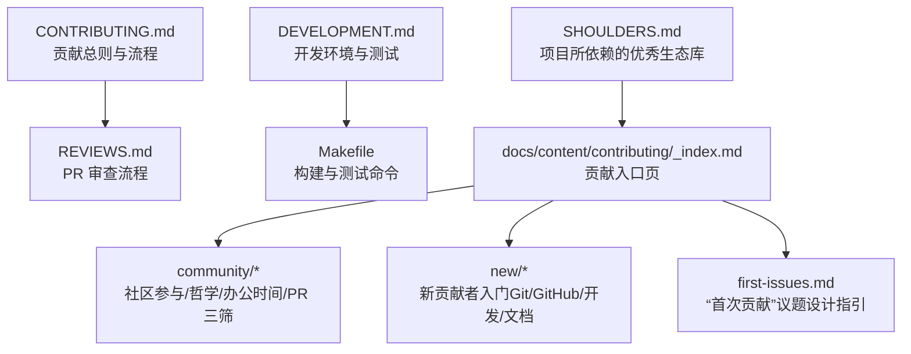
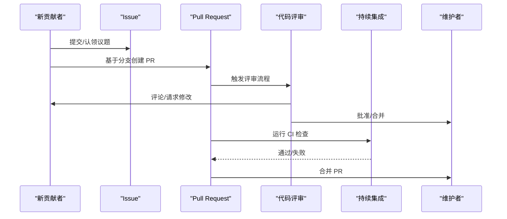
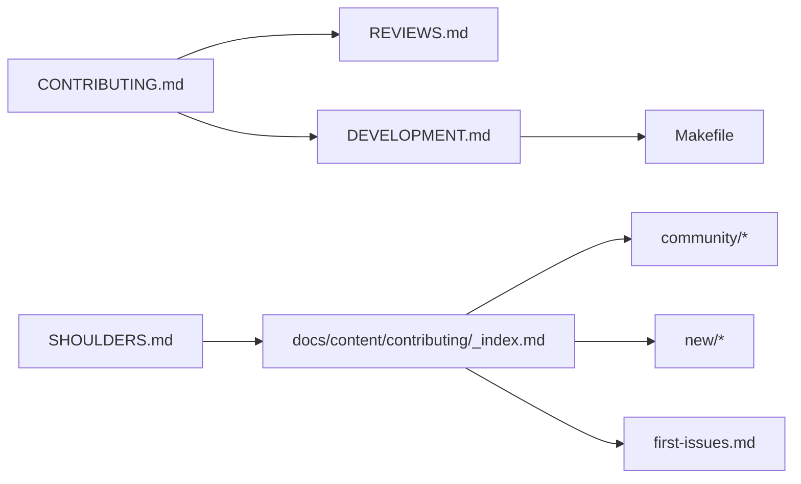

# 社区与贡献

<cite>
**本文引用的文件**
- [CONTRIBUTING.md](file://CONTRIBUTING.md)
- [DEVELOPMENT.md](file://DEVELOPMENT.md)
- [REVIEWS.md](file://REVIEWS.md)
- [Makefile](file://Makefile)
- [docs/content/contributing/_index.md](file://docs/content/contributing/_index.md)
- [docs/content/contributing/community/participating.md](file://docs/content/contributing/community/participating.md)
- [docs/content/contributing/community/philosophy.md](file://docs/content/contributing/community/philosophy.md)
- [docs/content/contributing/community/office-hours.md](file://docs/content/contributing/community/office-hours.md)
- [docs/content/contributing/community/triaging.md](file://docs/content/contributing/community/triaging.md)
- [docs/content/contributing/first-issues.md](file://docs/content/contributing/first-issues.md)
- [docs/content/contributing/new/git.md](file://docs/content/contributing/new/git.md)
- [SHOULDERS.md](file://SHOULDERS.md)
</cite>

## 目录
1. [简介](#简介)
2. [项目结构](#项目结构)
3. [核心组件](#核心组件)
4. [架构总览](#架构总览)
5. [详细组件分析](#详细组件分析)
6. [依赖分析](#依赖分析)
7. [性能考虑](#性能考虑)
8. [故障排查指南](#故障排查指南)
9. [结论](#结论)
10. [附录](#附录)

## 简介
本章节面向希望参与 Athens 开源社区的贡献者，系统介绍社区文化、行为准则、治理模式、维护者角色与决策流程，并提供从入门到协作的完整路径：如何成为社区成员、贡献者与维护者；如何提交 Issue、发起 Pull Request、进行代码评审；以及社区支持渠道（Slack、Office Hours、会议）与最佳实践。

## 项目结构
围绕“社区与贡献”的知识主要分布在以下位置：
- 顶层贡献与开发指南：CONTRIBUTING.md、DEVELOPMENT.md、REVIEWS.md、Makefile
- 在线文档（docs）中关于贡献的子站点：contributing 及其子页面（community、new、first-issues 等）
- 致谢与生态引用：SHOULDERS.md

下图展示社区与贡献相关文档与脚本之间的关系：

图表来源
- [CONTRIBUTING.md](file://CONTRIBUTING.md#L1-L41)
- [DEVELOPMENT.md](file://DEVELOPMENT.md#L1-L314)
- [Makefile](file://Makefile#L1-L131)
- [docs/content/contributing/_index.md](file://docs/content/contributing/_index.md#L1-L29)
- [docs/content/contributing/community/participating.md](file://docs/content/contributing/community/participating.md#L1-L104)
- [docs/content/contributing/community/philosophy.md](file://docs/content/contributing/community/philosophy.md#L1-L69)
- [docs/content/contributing/community/office-hours.md](file://docs/content/contributing/community/office-hours.md#L1-L30)
- [docs/content/contributing/community/triaging.md](file://docs/content/contributing/community/triaging.md#L1-L71)
- [docs/content/contributing/first-issues.md](file://docs/content/contributing/first-issues.md#L1-L48)
- [docs/content/contributing/new/git.md](file://docs/content/contributing/new/git.md#L1-L76)
- [SHOULDERS.md](file://SHOULDERS.md#L1-L107)

章节来源
- [CONTRIBUTING.md](file://CONTRIBUTING.md#L1-L41)
- [DEVELOPMENT.md](file://DEVELOPMENT.md#L1-L314)
- [Makefile](file://Makefile#L1-L131)
- [docs/content/contributing/_index.md](file://docs/content/contributing/_index.md#L1-L29)

## 核心组件
- 贡献总则与流程：定义 Issue 认领、本地验证、开发环境搭建、单元测试与端到端测试、提交 PR 的基本步骤。
- PR 审查流程：明确审查类型（评论/请求修改/批准）、审查者与合并权限、审查等待窗口、CI 要求。
- 开发与测试：提供 Docker/主机/服务三种运行方式，统一的 Make 命令组织测试与构建，确保一致性。
- 社区参与与角色：社区成员、贡献者、维护者三级角色及其职责与晋升路径。
- 社区哲学：以“友善、易用、聚焦社区、提问”为核心的指导原则。
- 办公时间与三筛：定期线上交流、PR 三筛机制保障评审效率。
- 新贡献者入门：Git/GitHub 基础、GitHub 工作流、开发与文档贡献指南。
- “首次贡献”议题设计：帮助维护者标注适合新手的议题。

章节来源
- [CONTRIBUTING.md](file://CONTRIBUTING.md#L6-L41)
- [REVIEWS.md](file://REVIEWS.md#L1-L79)
- [DEVELOPMENT.md](file://DEVELOPMENT.md#L28-L234)
- [docs/content/contributing/community/participating.md](file://docs/content/contributing/community/participating.md#L8-L104)
- [docs/content/contributing/community/philosophy.md](file://docs/content/contributing/community/philosophy.md#L12-L69)
- [docs/content/contributing/community/office-hours.md](file://docs/content/contributing/community/office-hours.md#L7-L23)
- [docs/content/contributing/community/triaging.md](file://docs/content/contributing/community/triaging.md#L10-L71)
- [docs/content/contributing/new/git.md](file://docs/content/contributing/new/git.md#L9-L76)
- [docs/content/contributing/first-issues.md](file://docs/content/contributing/first-issues.md#L25-L48)

## 架构总览
下图展示“贡献者—议题—PR—评审—合并”的闭环流程，体现社区治理与协作机制：

图表来源
- [CONTRIBUTING.md](file://CONTRIBUTING.md#L6-L41)
- [REVIEWS.md](file://REVIEWS.md#L10-L79)
- [DEVELOPMENT.md](file://DEVELOPMENT.md#L210-L218)

## 详细组件分析

### 社区文化与行为准则
- 哲学原则：友善、易用、聚焦社区、提问。
- 行为边界：遵循行为准则；在议题中保持建设性与尊重；跨时区沟通需互相体谅。
- 包容性：鼓励不同背景的人参与，重视新人视角。

章节来源
- [docs/content/contributing/community/philosophy.md](file://docs/content/contributing/community/philosophy.md#L12-L69)

### 治理模式与角色
- 角色层级：社区成员 → 贡献者 → 维护者。
- 贡献者权利与义务：可被分配议题、参与 PR 评审、提出改进建议。
- 维护者权限：最终批准与合并 PR；负责发布流程与分支策略。

章节来源
- [docs/content/contributing/community/participating.md](file://docs/content/contributing/community/participating.md#L18-L104)

### PR 审查流程与标准
- 审查类型与使用场景：评论（非阻塞）、请求修改（需解决后复审）、批准（满足条件可合并）。
- 审查者与合并规则：至少一名维护者审查；重要变更需等待 24–36 小时；必须通过 CI。
- 审查等待期：避免“即时合并”，确保全球时区都有机会参与。

章节来源
- [REVIEWS.md](file://REVIEWS.md#L10-L79)

### 贡献流程与规范
- 认领议题：在 Issue 下留言表达意向即可。
- 本地验证：运行统一的验证命令，覆盖格式化、静态检查等。
- 开发环境：提供一键安装与启动依赖的服务（Make 目标）。
- 单元测试与端到端测试：提供容器内与主机两种执行方式，便于快速迭代。
- 提交 PR：遵循 GitHub PR 模型，参考评审流程与规范。

章节来源
- [CONTRIBUTING.md](file://CONTRIBUTING.md#L6-L41)
- [DEVELOPMENT.md](file://DEVELOPMENT.md#L166-L218)
- [Makefile](file://Makefile#L60-L83)

### 社区资源与支持渠道
- Slack：在 Gophers Slack 的 #athens 频道交流与求助。
- Office Hours：每周固定时间的线上学习与讨论会，欢迎所有人参加。
- 会议与公告：通过 Zoom 参加，Twitter 与频道公告提醒。
- 三筛机制：每周三、五、日对老 PR 进行提示，促进评审与推进。

章节来源
- [docs/content/contributing/community/office-hours.md](file://docs/content/contributing/community/office-hours.md#L11-L23)
- [docs/content/contributing/community/triaging.md](file://docs/content/contributing/community/triaging.md#L10-L71)
- [docs/content/contributing/community/participating.md](file://docs/content/contributing/community/participating.md#L30-L39)

### 新贡献者入门指南
- Git 基础：仓库、暂存、提交、分支、检出、合并、远程、推送、拉取、抓取等概念。
- GitHub 工作流：Fork → 分支 → 提交 → PR → 评审 → 合并。
- 开发与测试：使用 Makefile 快速搭建环境与运行测试。
- 文档贡献：通过在线文档子站点了解贡献路径。

章节来源
- [docs/content/contributing/new/git.md](file://docs/content/contributing/new/git.md#L9-L76)
- [DEVELOPMENT.md](file://DEVELOPMENT.md#L39-L164)
- [Makefile](file://Makefile#L48-L83)

### “首次贡献”议题设计指引
- 明确任务描述与参考资料链接。
- 提供起点建议或已尝试方案。
- 新手向导：引导阅读贡献文档与新贡献者指南。

章节来源
- [docs/content/contributing/first-issues.md](file://docs/content/contributing/first-issues.md#L25-L48)

### 生态致谢与依赖
- 列举项目所依赖的优秀第三方库与工具，体现开放协作精神。

章节来源
- [SHOULDERS.md](file://SHOULDERS.md#L1-L107)

## 依赖分析
下图展示贡献相关文档与脚本之间的依赖关系与交互：

图表来源
- [CONTRIBUTING.md](file://CONTRIBUTING.md#L1-L41)
- [DEVELOPMENT.md](file://DEVELOPMENT.md#L1-L314)
- [Makefile](file://Makefile#L1-L131)
- [docs/content/contributing/_index.md](file://docs/content/contributing/_index.md#L1-L29)
- [docs/content/contributing/community/participating.md](file://docs/content/contributing/community/participating.md#L1-L104)
- [docs/content/contributing/community/philosophy.md](file://docs/content/contributing/community/philosophy.md#L1-L69)
- [docs/content/contributing/community/office-hours.md](file://docs/content/contributing/community/office-hours.md#L1-L30)
- [docs/content/contributing/community/triaging.md](file://docs/content/contributing/community/triaging.md#L1-L71)
- [docs/content/contributing/first-issues.md](file://docs/content/contributing/first-issues.md#L1-L48)
- [docs/content/contributing/new/git.md](file://docs/content/contributing/new/git.md#L1-L76)
- [SHOULDERS.md](file://SHOULDERS.md#L1-L107)

## 性能考虑
- 使用 Makefile 统一命令，减少环境差异带来的调试成本。
- 提供容器化测试与运行方式，降低本地依赖复杂度。
- 评审等待窗口兼顾效率与公平，避免“即时合并”。

## 故障排查指南
- 端到端测试报错“无法连接存储”：先运行开发环境初始化命令，再执行端到端测试。
- 本地验证失败：确保已运行统一验证命令，检查格式化与静态检查是否通过。
- CI 失败：根据评审与 CI 结果逐项修复，必要时延长评审等待期。

章节来源
- [CONTRIBUTING.md](file://CONTRIBUTING.md#L27-L33)
- [DEVELOPMENT.md](file://DEVELOPMENT.md#L210-L218)
- [REVIEWS.md](file://REVIEWS.md#L24-L26)

## 结论
Athens 的社区与贡献体系以“友好、易用、聚焦社区、提问”为核心，通过清晰的角色划分、标准化的 PR 审查流程与丰富的支持渠道，帮助新贡献者快速上手，同时保障高质量交付与可持续发展。建议新成员优先阅读贡献入口页与社区哲学，按需选择 Office Hours 与三筛参与，逐步成长为贡献者与维护者。

## 附录
- 社区入口页：贡献总览、角色说明、新贡献者与维护者指南。
- 社区参与：加入议题讨论、提交 PR、参与评审、参加 Office Hours。
- PR 审查：理解评审类型与合并规则，配合 CI 与等待期提升质量与效率。
- 开发与测试：使用 Makefile 与容器化方式快速搭建与验证。
- “首次贡献”议题：遵循设计指引，提供清晰目标与可操作建议。

章节来源
- [docs/content/contributing/_index.md](file://docs/content/contributing/_index.md#L8-L29)
- [docs/content/contributing/community/participating.md](file://docs/content/contributing/community/participating.md#L18-L104)
- [docs/content/contributing/community/philosophy.md](file://docs/content/contributing/community/philosophy.md#L12-L69)
- [docs/content/contributing/community/office-hours.md](file://docs/content/contributing/community/office-hours.md#L7-L23)
- [docs/content/contributing/community/triaging.md](file://docs/content/contributing/community/triaging.md#L10-L71)
- [docs/content/contributing/first-issues.md](file://docs/content/contributing/first-issues.md#L25-L48)
- [DEVELOPMENT.md](file://DEVELOPMENT.md#L39-L164)
- [Makefile](file://Makefile#L48-L83)