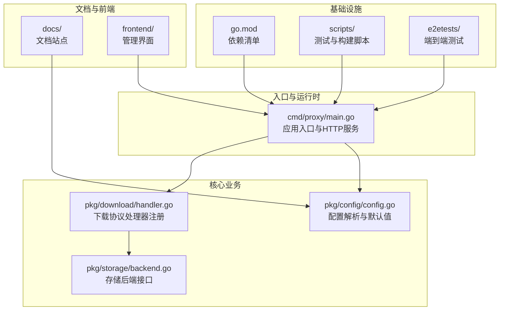
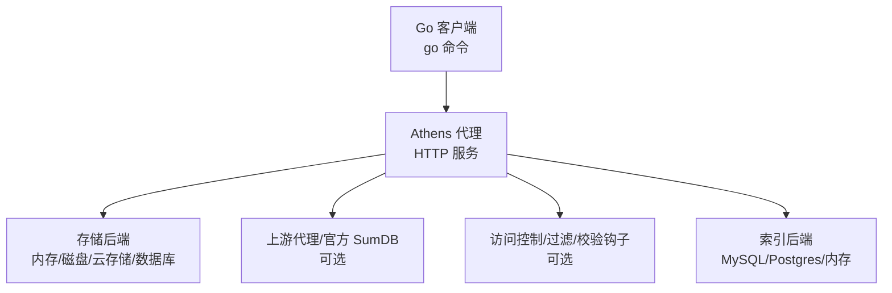
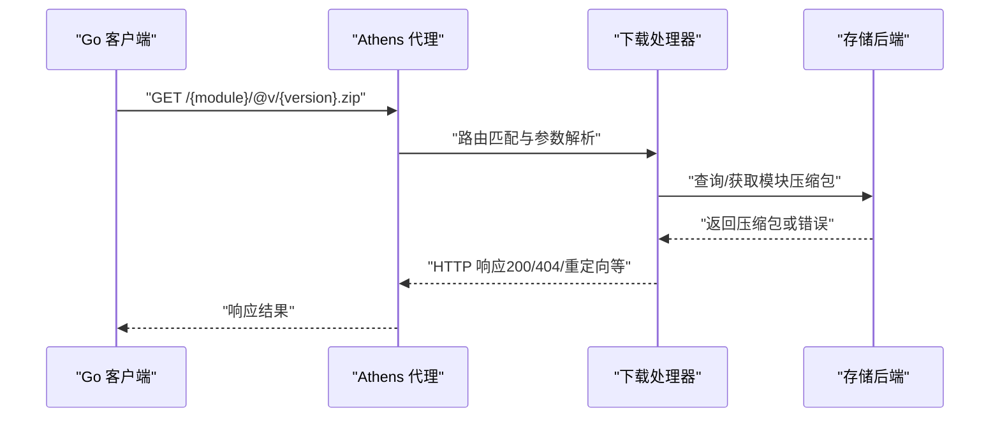
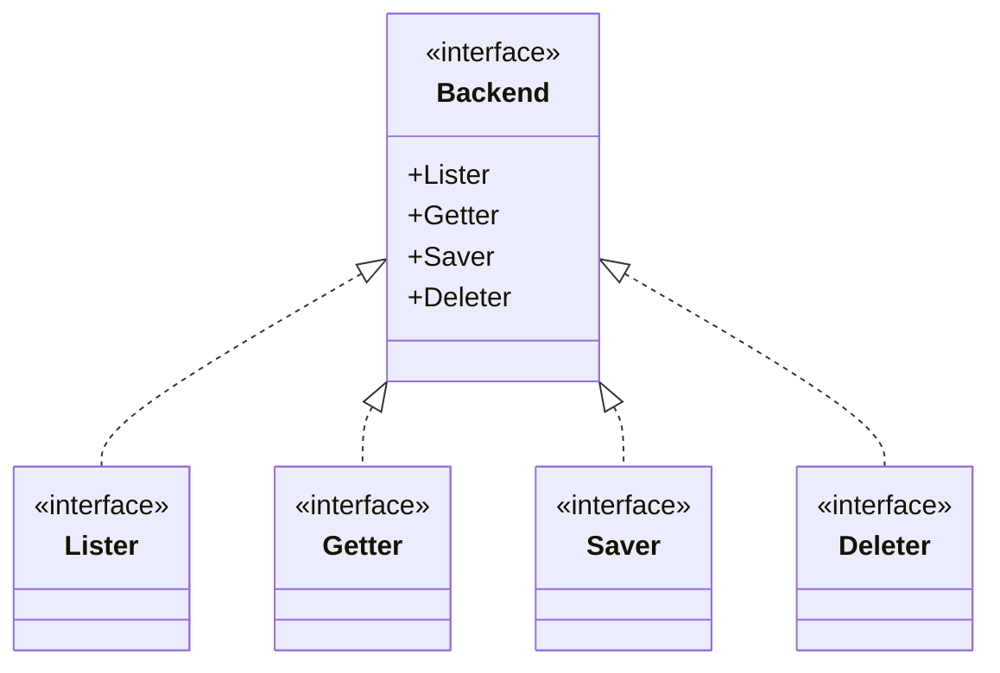
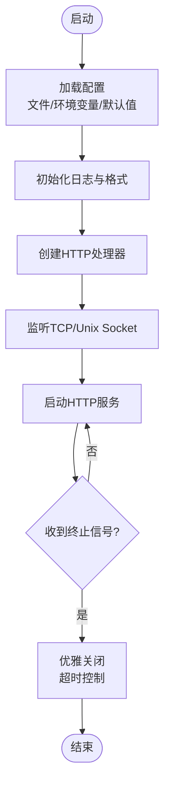
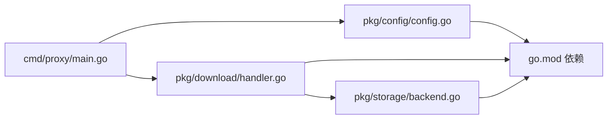

# 项目介绍

<cite>
**本文引用的文件**
- [README.md](file://README.md)
- [PHILOSOPHY.md](file://PHILOSOPHY.md)
- [cmd/proxy/main.go](file://cmd/proxy/main.go)
- [go.mod](file://go.mod)
- [docs/content/intro/why.md](file://docs/content/intro/why.md)
- [docs/content/intro/components.md](file://docs/content/intro/components.md)
- [docs/content/intro/protocol.md](file://docs/content/intro/protocol.md)
- [docs/content/design/proxy.md](file://docs/content/design/proxy.md)
- [pkg/config/config.go](file://pkg/config/config.go)
- [pkg/download/handler.go](file://pkg/download/handler.go)
- [pkg/storage/backend.go](file://pkg/storage/backend.go)
- [config.dev.toml](file://config.dev.toml)
- [CONTRIBUTING.md](file://CONTRIBUTING.md)
- [DEVELOPMENT.md](file://DEVELOPMENT.md)
</cite>

## 目录
1. [引言](#引言)
2. [项目结构](#项目结构)
3. [核心组件](#核心组件)
4. [架构总览](#架构总览)
5. [详细组件分析](#详细组件分析)
6. [依赖关系分析](#依赖关系分析)
7. [性能考量](#性能考量)
8. [故障排查指南](#故障排查指南)
9. [结论](#结论)
10. [附录](#附录)

## 引言
Athens 是一个开源的企业级 Go 模块代理服务器，旨在为企业提供稳定、可扩展且可控的模块下载与分发能力。它的核心价值在于：
- 稳定性：通过不可变存储确保依赖版本不会因上游仓库变更而中断构建。
- 安全性：支持访问控制、过滤策略与校验钩子，阻止恶意或不合规模块进入企业环境。
- 性能：以 HTTP 压缩包形式提供模块下载，显著优于直接从 VCS 克隆的速度。
- 可治理：在企业内部部署代理，集中管理私有模块、排除公共模块，并实现统一的镜像与缓存策略。

在 Go 生态中，Athens 实现了官方模块下载协议，兼容 go 命令行工具，使企业能够在本地网络内安全高效地获取依赖，同时保留对上游代理（如官方 sum.golang.org）的透明桥接能力。

## 项目结构
该项目采用模块化与分层设计，主要目录与职责如下：
- cmd/proxy：代理服务入口，负责加载配置、启动 HTTP 服务、处理信号与优雅关闭。
- pkg/*：核心业务包，包括配置解析、下载协议处理器、存储后端抽象、索引、中间件、日志等。
- docs：官方文档站点，涵盖安装、配置、设计与使用场景说明。
- frontend：可选的 Web 管理界面（Vue + TypeScript），用于仪表盘、上传与设置管理。
- scripts：开发与测试脚本，包括 Docker 配置、单元测试与端到端测试命令。
- e2etests：端到端测试框架，验证代理与 go CLI 的交互行为。

**图表来源**
- [cmd/proxy/main.go](file://cmd/proxy/main.go#L29-L128)
- [pkg/config/config.go](file://pkg/config/config.go#L127-L254)
- [pkg/download/handler.go](file://pkg/download/handler.go#L39-L67)
- [pkg/storage/backend.go](file://pkg/storage/backend.go#L1-L10)
- [go.mod](file://go.mod#L1-L194)

**章节来源**
- [README.md](file://README.md#L1-L96)
- [go.mod](file://go.mod#L1-L194)

## 核心组件
- 应用入口与生命周期
  - 负责解析命令行参数、加载配置、初始化日志、创建 HTTP 服务器、监听 Unix Socket 或 TCP 端口、处理信号并优雅关闭。
- 下载协议处理器
  - 注册 /list、/@latest、/@v/{version}.info、/@v/{version}.mod、/@v/{version}.zip 等端点，遵循 Go 模块下载协议。
- 存储后端抽象
  - 统一的 Backend 接口封装 Lister、Getter、Saver、Deleter，支持内存、磁盘、云存储、数据库等多种实现。
- 配置系统
  - 支持 TOML 文件、环境变量覆盖与默认值；涵盖日志级别、存储类型、索引类型、单飞机制、网络模式、下载模式、SumDB 列表等。
- 文档与前端
  - 文档站点提供安装、配置、设计与使用场景说明；前端提供仪表盘、模块上传与设置管理。

**章节来源**
- [cmd/proxy/main.go](file://cmd/proxy/main.go#L29-L128)
- [pkg/download/handler.go](file://pkg/download/handler.go#L39-L67)
- [pkg/storage/backend.go](file://pkg/storage/backend.go#L1-L10)
- [pkg/config/config.go](file://pkg/config/config.go#L127-L254)
- [docs/content/intro/protocol.md](file://docs/content/intro/protocol.md#L1-L79)

## 架构总览
下图展示了 Athens 在企业网络中的典型部署位置与数据流：客户端（go 命令）通过 GOPROXY 指向 Athens，Athens 根据配置决定是否命中本地存储、上游代理或执行访问控制逻辑。

**图表来源**
- [docs/content/design/proxy.md](file://docs/content/design/proxy.md#L15-L86)
- [docs/content/intro/protocol.md](file://docs/content/intro/protocol.md#L1-L79)
- [pkg/config/config.go](file://pkg/config/config.go#L146-L213)

## 详细组件分析

### 组件 A：下载协议处理器
- 职责
  - 将 Go CLI 请求映射到具体的模块版本信息、go.mod 内容与源码压缩包。
  - 提供 /list、/@latest、/@v/{version}.info、/@v/{version}.mod、/@v/{version}.zip 等端点。
- 设计要点
  - 使用 Gorilla Mux 进行路径注册与方法限制。
  - 通过中间件设置缓存控制策略（no-cache）。
  - 日志上下文注入，便于请求级追踪与审计。
- 处理流程（序列图）

**图表来源**
- [pkg/download/handler.go](file://pkg/download/handler.go#L39-L67)

**章节来源**
- [pkg/download/handler.go](file://pkg/download/handler.go#L1-L67)
- [docs/content/intro/protocol.md](file://docs/content/intro/protocol.md#L17-L79)

### 组件 B：存储后端抽象与实现
- 职责
  - 统一的 Backend 接口定义 Lister、Getter、Saver、Deleter 四类能力。
  - 支持多种实现：内存、磁盘、MongoDB、MinIO、GCS、S3、Azure Blob、外部存储等。
- 设计要点
  - 通过配置驱动选择具体存储类型与参数。
  - 单飞（Single Flight）机制避免并发写入冲突。
- 类图

**图表来源**
- [pkg/storage/backend.go](file://pkg/storage/backend.go#L1-L10)

**章节来源**
- [pkg/storage/backend.go](file://pkg/storage/backend.go#L1-L10)
- [pkg/config/config.go](file://pkg/config/config.go#L299-L333)

### 组件 C：应用入口与生命周期管理
- 职责
  - 解析配置文件与环境变量，初始化日志、HTTP 服务器与 TLS/Unix Socket。
  - 注册信号处理，优雅关闭并等待子进程退出。
  - 可选启用 pprof 性能分析端口。
- 关键流程（流程图）

**图表来源**
- [cmd/proxy/main.go](file://cmd/proxy/main.go#L29-L128)

**章节来源**
- [cmd/proxy/main.go](file://cmd/proxy/main.go#L29-L128)

### 组件 D：配置系统与部署选项
- 职责
  - 支持 TOML 配置文件与环境变量覆盖，默认值与校验。
  - 关键配置项：存储类型、索引类型、日志级别、网络模式、下载模式、单飞机制、SumDB 列表、过滤文件、基本认证等。
- 配置示例与说明
  - 开发示例配置文件展示了所有受支持的属性及其默认值与覆盖方式。
- 部署建议
  - 支持 Docker Compose、SystemD、Kubernetes 等多种部署形态；生产环境建议启用 HTTPS、访问控制与监控导出。

**章节来源**
- [pkg/config/config.go](file://pkg/config/config.go#L127-L254)
- [config.dev.toml](file://config.dev.toml#L1-L628)
- [DEVELOPMENT.md](file://DEVELOPMENT.md#L39-L164)

## 依赖关系分析
- 外部依赖
  - Go 标准库与第三方库广泛用于 HTTP 路由、日志、配置解析、存储 SDK、分布式锁与指标导出等。
- 模块间耦合
  - 应用入口仅依赖配置与处理器工厂，耦合度低、可替换性强。
  - 下载处理器依赖协议接口与中间件，保持协议无关性。
  - 存储后端通过接口抽象解耦具体实现。
- 依赖可视化

**图表来源**
- [cmd/proxy/main.go](file://cmd/proxy/main.go#L29-L128)
- [pkg/config/config.go](file://pkg/config/config.go#L127-L254)
- [pkg/download/handler.go](file://pkg/download/handler.go#L39-L67)
- [pkg/storage/backend.go](file://pkg/storage/backend.go#L1-L10)
- [go.mod](file://go.mod#L1-L194)

**章节来源**
- [go.mod](file://go.mod#L1-L194)

## 性能考量
- 下载性能
  - 通过 HTTP 压缩包替代 VCS 克隆，显著降低网络与 CPU 开销。
- 并发与一致性
  - 单飞（Single Flight）机制避免并发写入导致的重复下载与存储竞争。
- 缓存与索引
  - 本地存储与索引后端（MySQL/Postgres/内存）提升版本列表与元数据查询效率。
- 网络模式
  - 支持 strict/offline/fallback 三种模式，平衡一致性与可用性。

**章节来源**
- [docs/content/intro/why.md](file://docs/content/intro/why.md#L27-L37)
- [docs/content/design/proxy.md](file://docs/content/design/proxy.md#L25-L46)
- [pkg/config/config.go](file://pkg/config/config.go#L282-L333)

## 故障排查指南
- 常见问题定位
  - 日志级别与格式：检查配置中的 LogLevel 与 LogFormat，必要时开启 pprof 端口进行性能分析。
  - 存储连接：确认存储类型与对应参数（如 S3/Mongo/GCS 等）正确无误。
  - 访问控制：若出现 404/403，检查过滤文件与排除列表配置。
  - 上游代理：在 strict 模式下，若上游不可达，需切换到 fallback/offline 模式或修复上游。
- 开发与测试
  - 使用 Docker Compose 快速搭建开发环境与依赖服务。
  - 运行单元测试与端到端测试，验证代理行为与 go CLI 交互。

**章节来源**
- [cmd/proxy/main.go](file://cmd/proxy/main.go#L69-L77)
- [pkg/config/config.go](file://pkg/config/config.go#L127-L254)
- [DEVELOPMENT.md](file://DEVELOPMENT.md#L166-L220)

## 结论
Athens 以“稳定、安全、高性能”为核心目标，为企业提供可治理的 Go 模块代理能力。通过实现官方下载协议、提供丰富的存储与索引后端、完善的访问控制与过滤机制，以及可扩展的部署形态，Athens 成为现代企业 Go 依赖管理的关键基础设施。随着生态演进，Athens 将持续增强可观测性、安全性与易用性，助力团队在复杂环境中高效、可靠地交付软件。

## 附录
- 项目背景与动机
  - 不可变性：防止依赖消失或被强制推送破坏构建。
  - 逻辑扩展：支持自定义验证钩子与访问控制。
  - 性能提升：HTTP 压缩包下载显著优于 VCS 克隆。
  - 访问控制：通过过滤策略阻止恶意或不合规模块。
- 组件与角色
  - 客户端：Go 命令行工具。
  - VCS：外部版本控制系统（GitHub、Bitbucket 等）。
  - 代理：企业内部部署，提供私有模块托管、公共模块存储与访问控制。
- 与标准 Go 模块代理的关系
  - Athens 完整实现 Go 模块下载协议，兼容 go 命令行工具；可作为企业内部代理或公共镜像，同时保留对上游代理的桥接能力。

**章节来源**
- [docs/content/intro/why.md](file://docs/content/intro/why.md#L10-L37)
- [docs/content/intro/components.md](file://docs/content/intro/components.md#L7-L26)
- [docs/content/intro/protocol.md](file://docs/content/intro/protocol.md#L1-L79)
- [docs/content/design/proxy.md](file://docs/content/design/proxy.md#L6-L25)