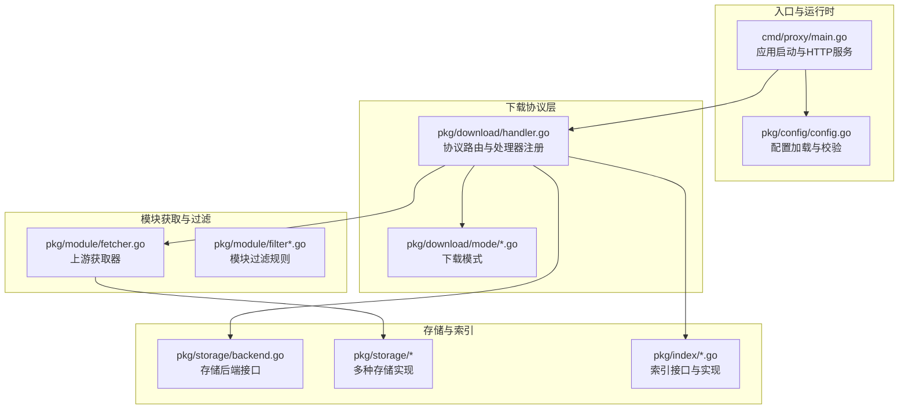
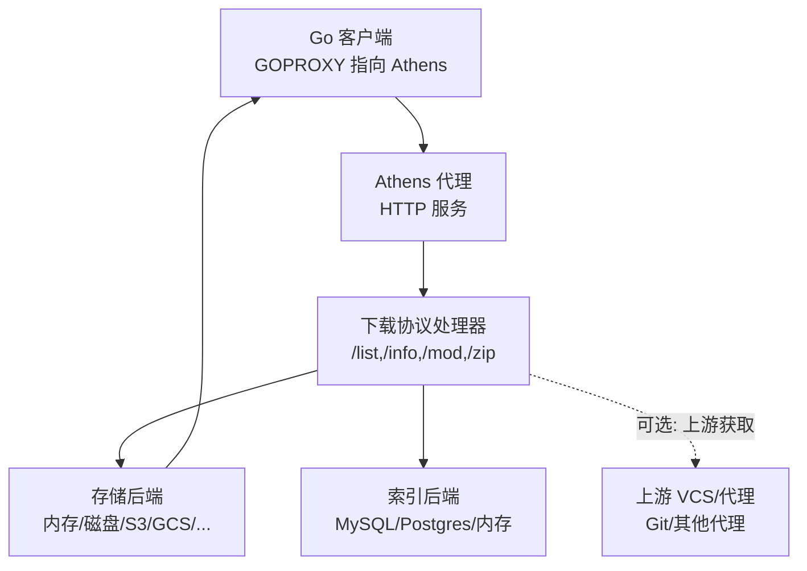
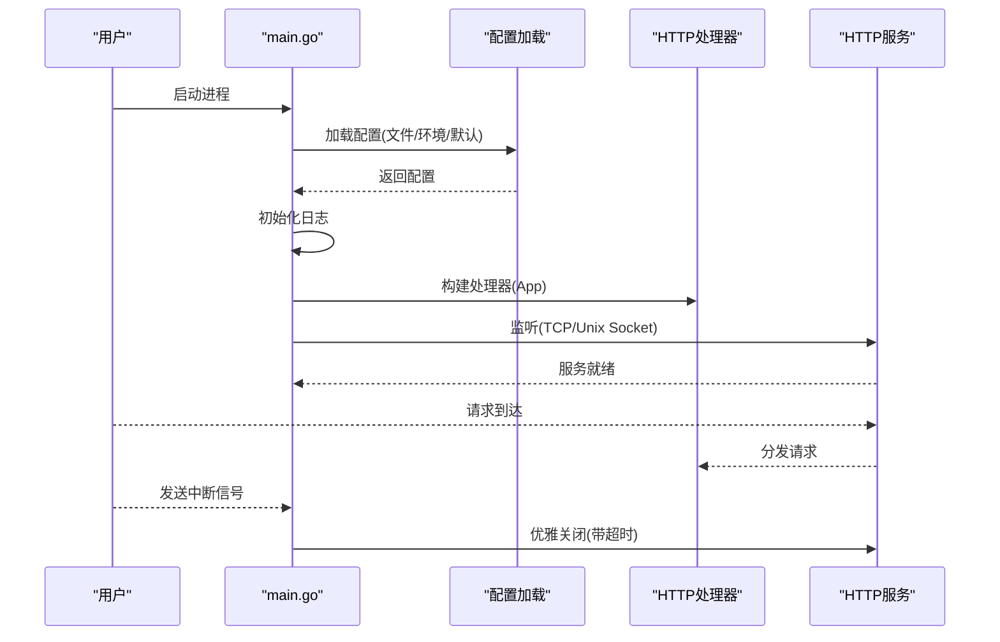
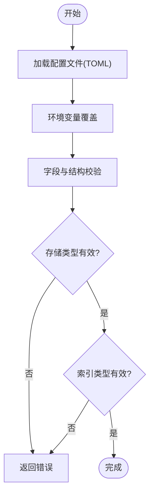
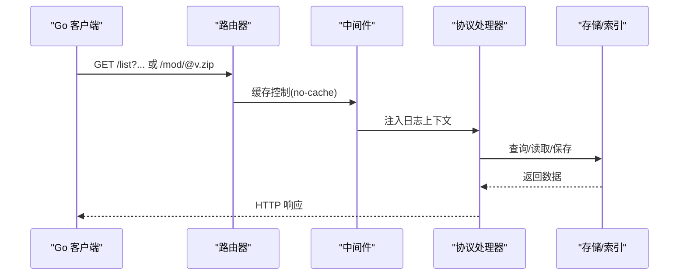
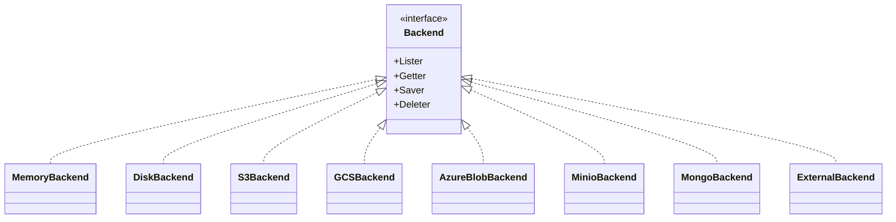
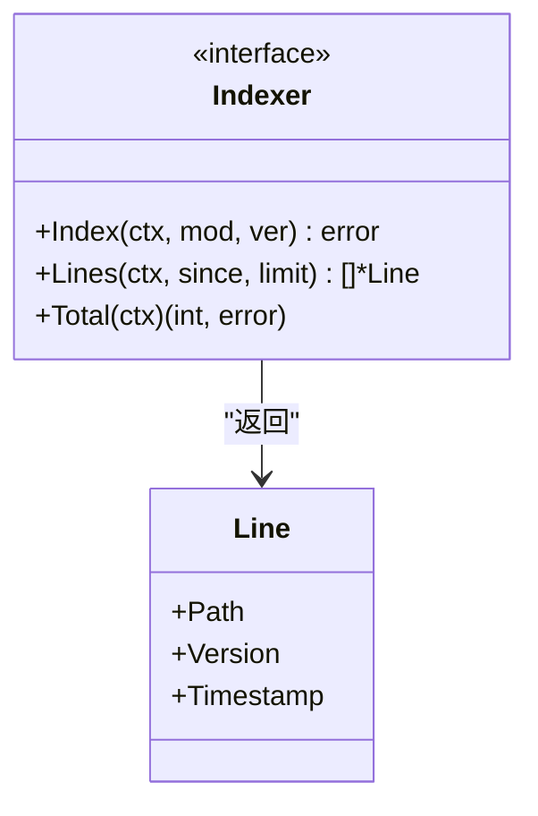
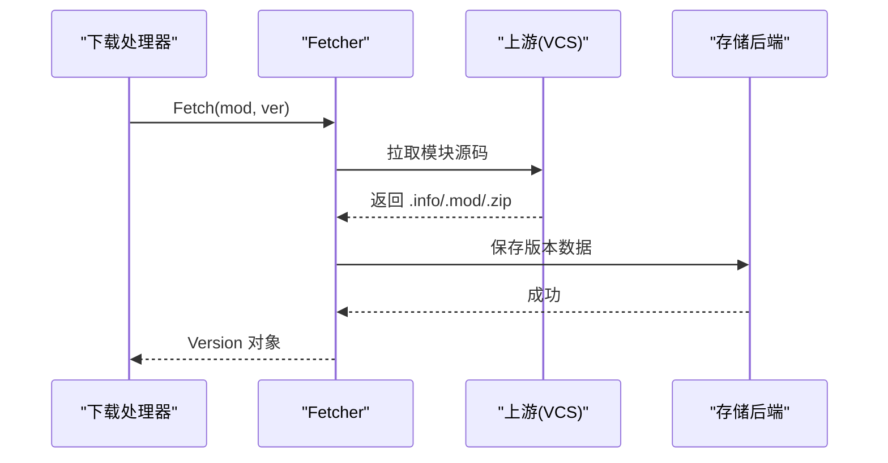
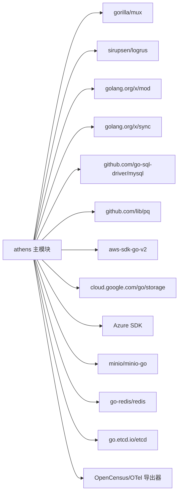

# 项目概述

<cite>
**本文引用的文件**
- [README.md](file://README.md)
- [go.mod](file://go.mod)
- [cmd/proxy/main.go](file://cmd/proxy/main.go)
- [pkg/config/config.go](file://pkg/config/config.go)
- [pkg/config/storage.go](file://pkg/config/storage.go)
- [pkg/config/index.go](file://pkg/config/index.go)
- [pkg/download/handler.go](file://pkg/download/handler.go)
- [pkg/storage/backend.go](file://pkg/storage/backend.go)
- [pkg/index/indexer.go](file://pkg/index/indexer.go)
- [pkg/module/fetcher.go](file://pkg/module/fetcher.go)
- [docs/content/intro/why.md](file://docs/content/intro/why.md)
- [docs/content/design/proxy.md](file://docs/content/design/proxy.md)
- [CONTRIBUTING.md](file://CONTRIBUTING.md)
- [PHILOSOPHY.md](file://PHILOSOPHY.md)
</cite>

## 目录
1. [引言](#引言)
2. [项目结构](#项目结构)
3. [核心组件](#核心组件)
4. [架构总览](#架构总览)
5. [详细组件分析](#详细组件分析)
6. [依赖关系分析](#依赖关系分析)
7. [性能考量](#性能考量)
8. [故障排查指南](#故障排查指南)
9. [结论](#结论)
10. [附录](#附录)

## 引言
Athens 是一个开源的企业级 Go 模块代理（Go Module Proxy）实现，完全兼容 Go Modules 下载协议与下载 API。它的目标是在企业内部提供可编程、可控制、可扩展的模块分发能力，解决依赖不可变性、访问控制、性能与合规等关键问题。通过将上游 VCS 的模块拉取并持久化到多种后端存储中，Athens 实现了模块的不可变性与离线可用；同时，它支持过滤、鉴权、单飞（single-flight）、索引与可观测性等能力，满足生产环境对安全与性能的要求。

本项目在 Go 生态中的定位是“企业级模块代理”，既可作为私有模块托管与访问控制的基础设施，也可作为公共模块的本地镜像与加速节点，从而降低网络抖动与上游波动带来的风险。

## 项目结构
项目采用按功能域划分的层次化组织方式：
- cmd/proxy：入口程序与 HTTP 服务启动逻辑
- pkg/*：核心业务包，包括配置、下载协议处理、存储抽象、索引、中间件、日志、统计与可观测性等
- docs：官方文档站点与设计说明
- frontend：管理界面前端（Vue/TypeScript）
- scripts、test、e2etests：测试与脚本工具
- 配置与示例：多语言文档与示例配置

下面给出一个概念性的项目结构示意，帮助初学者快速理解各模块职责与交互关系。

图表来源
- [cmd/proxy/main.go](file://cmd/proxy/main.go#L29-L127)
- [pkg/config/config.go](file://pkg/config/config.go#L129-L254)
- [pkg/download/handler.go](file://pkg/download/handler.go#L39-L57)
- [pkg/storage/backend.go](file://pkg/storage/backend.go#L3-L9)
- [pkg/module/fetcher.go](file://pkg/module/fetcher.go#L9-L14)

章节来源
- [README.md](file://README.md#L13-L38)
- [go.mod](file://go.mod#L1-L53)

## 核心组件
- 应用入口与运行时
  - 启动参数解析、配置加载、日志初始化、HTTP 服务监听（TCP/Unix Socket）、TLS 支持、优雅关闭与信号处理
- 配置系统
  - TOML 文件 + 环境变量双源覆盖，内置默认值与严格校验；支持存储类型、索引类型、下载模式、网络模式、单飞策略、追踪与指标导出等
- 下载协议处理
  - 注册 /list、/latest、/info、/mod、/zip 等路径，统一注入日志上下文与缓存控制中间件
- 存储抽象与实现
  - 统一的 Lister/Getter/Saver/Deleter 接口，支持内存、磁盘、S3、GCS、Azure Blob、MinIO、MongoDB、外部代理等多种后端
- 索引
  - 提供模块版本索引接口，支持按时间窗口与限制返回条目数
- 模块获取与过滤
  - 从上游 VCS 获取模块，结合私有模块过滤与排除列表实现访问控制与合规

章节来源
- [cmd/proxy/main.go](file://cmd/proxy/main.go#L29-L127)
- [pkg/config/config.go](file://pkg/config/config.go#L21-L66)
- [pkg/download/handler.go](file://pkg/download/handler.go#L39-L57)
- [pkg/storage/backend.go](file://pkg/storage/backend.go#L3-L9)
- [pkg/index/indexer.go](file://pkg/index/indexer.go#L15-L29)
- [pkg/module/fetcher.go](file://pkg/module/fetcher.go#L9-L14)

## 架构总览
下图展示了 Athens 的高层架构：客户端通过 GOPROXY 指向 Athens，Athens 在本地存储中查找模块；若缺失则根据网络模式与过滤规则决定是否从上游获取或重定向；最终将模块写入存储并返回给客户端。

图表来源
- [pkg/download/handler.go](file://pkg/download/handler.go#L39-L57)
- [pkg/storage/backend.go](file://pkg/storage/backend.go#L3-L9)
- [pkg/index/indexer.go](file://pkg/index/indexer.go#L15-L29)
- [docs/content/design/proxy.md](file://docs/content/design/proxy.md#L25-L46)

## 详细组件分析

### 组件A：应用启动与生命周期管理
- 职责
  - 解析命令行参数（版本查询、配置文件路径）
  - 加载配置并进行环境变量覆盖与校验
  - 初始化日志、构建 HTTP 处理器、选择监听方式（TCP/Unix Socket）、可选 TLS
  - 启动 pprof（独立端口）、优雅关闭、信号处理与子进程清理
- 关键流程
  - 配置加载与校验失败直接退出
  - 日志输出重定向至 logrus，保证统一格式
  - 服务启动后等待中断信号，超时优雅关闭

图表来源
- [cmd/proxy/main.go](file://cmd/proxy/main.go#L29-L127)

章节来源
- [cmd/proxy/main.go](file://cmd/proxy/main.go#L29-L127)

### 组件B：配置系统与环境覆盖
- 职责
  - 支持从 TOML 文件与环境变量加载配置
  - 内置默认值与字段级校验（如日志级别、网络模式枚举、存储/索引类型）
  - 支持生产环境文件权限检查
- 关键点
  - 环境变量优先级高于配置文件
  - 端口格式自动补全
  - 存储与索引类型分别进行结构化校验

图表来源
- [pkg/config/config.go](file://pkg/config/config.go#L129-L254)
- [pkg/config/storage.go](file://pkg/config/storage.go#L3-L12)
- [pkg/config/index.go](file://pkg/config/index.go#L3-L7)

章节来源
- [pkg/config/config.go](file://pkg/config/config.go#L129-L254)
- [pkg/config/storage.go](file://pkg/config/storage.go#L3-L12)
- [pkg/config/index.go](file://pkg/config/index.go#L3-L7)

### 组件C：下载协议处理与路由
- 职责
  - 注册 /list、/latest、/info、/mod、/zip 等路径
  - 统一注入日志上下文与缓存控制中间件
  - 将请求转发给具体协议处理器
- 特性
  - GET/HEAD 方法区分
  - 无缓存策略用于 /list 与 /latest

图表来源
- [pkg/download/handler.go](file://pkg/download/handler.go#L39-L57)

章节来源
- [pkg/download/handler.go](file://pkg/download/handler.go#L39-L57)

### 组件D：存储抽象与实现
- 职责
  - 定义统一的存储接口：Lister、Getter、Saver、Deleter
  - 提供多种后端实现：内存、磁盘、S3、GCS、Azure Blob、MinIO、MongoDB、外部代理
- 设计要点
  - 接口最小化，便于替换与扩展
  - 与下载协议解耦，便于横向扩展

图表来源
- [pkg/storage/backend.go](file://pkg/storage/backend.go#L3-L9)

章节来源
- [pkg/storage/backend.go](file://pkg/storage/backend.go#L3-L9)

### 组件E：索引接口与实现
- 职责
  - 记录模块版本索引，支持按时间窗口与限制返回条目
  - 提供总数查询能力
- 适用场景
  - /catalog 分页列举本地已存储模块
  - 与存储后端配合实现模块发现与审计

图表来源
- [pkg/index/indexer.go](file://pkg/index/indexer.go#L8-L29)

章节来源
- [pkg/index/indexer.go](file://pkg/index/indexer.go#L8-L29)

### 组件F：模块获取器与上游交互
- 职责
  - 从上游 VCS 获取模块，产出 .info、.mod、.zip 文件
  - 与下载模式、过滤规则协同工作
- 与存储的关系
  - 获取成功后写入存储后端，后续直接从存储返回

图表来源
- [pkg/module/fetcher.go](file://pkg/module/fetcher.go#L9-L14)

章节来源
- [pkg/module/fetcher.go](file://pkg/module/fetcher.go#L9-L14)

## 依赖关系分析
- 技术栈选择
  - 语言与版本：Go 1.23.5
  - Web 框架：gorilla/mux（路由）
  - 日志：logrus
  - 数据库驱动：lib/pq（PostgreSQL）、go-sql-driver/mysql（MySQL）
  - 对象存储：aws-sdk-go-v2（S3）、google/cloud（GCS）、azure-storage-blob-go（Azure Blob）、minio/minio-go（MinIO）
  - 缓存与分布式锁：go-redis/redis、etcd 客户端
  - 观测性：OpenCensus/Opentelemetry 生态导出器
  - 其他：golang.org/x/mod（模块协议）、golang.org/x/sync（并发工具）
- 依赖可视化

图表来源
- [go.mod](file://go.mod#L5-L53)

章节来源
- [go.mod](file://go.mod#L1-L53)

## 性能考量
- 单飞（Single Flight）
  - 避免同一模块版本并发拉取上游，减少重复 IO 与网络开销
- 下载模式
  - 支持同步/异步/池化等模式，按部署需求调整吞吐与资源占用
- 缓存控制
  - 列表与最新版本接口强制无缓存，确保客户端获取最新状态
- 存储后端
  - 云对象存储与 CDN 可显著提升公共模块的下载速度
- 索引与目录
  - 使用索引后端加速模块发现与 /catalog 列表查询

## 故障排查指南
- 启动失败
  - 检查配置文件与环境变量是否正确，确认端口、存储类型、索引类型与必要字段
  - 查看日志级别与格式，确保输出到预期位置
- 连接上游失败
  - 校验网络模式（strict/offline/fallback），确认过滤规则未误伤目标模块
  - 检查认证信息（Basic Auth、GitHub Token、netrc 等）
- 存储异常
  - 确认存储后端可达且凭据正确；查看对应后端日志
- 性能问题
  - 开启 pprof（独立端口）进行分析；评估单飞与池化配置
  - 调整下载工作者数量与超时配置

章节来源
- [pkg/config/config.go](file://pkg/config/config.go#L282-L297)
- [cmd/proxy/main.go](file://cmd/proxy/main.go#L69-L77)

## 结论
Athens 以“可编程、可控制、可扩展”为核心设计理念，为企业提供稳定可靠的 Go 模块代理能力。其通过不可变存储、访问控制、性能优化与可观测性，有效降低了依赖漂移与供应链风险，并提升了团队协作效率。对于初学者，建议从官方文档入手，逐步掌握配置与部署；对于有经验的开发者，可深入模块获取、存储与索引扩展，结合自身业务定制化增强。

## 附录

### 项目目标与价值主张
- 不可变性：将上游模块复制到本地存储，避免删除、回滚与篡改带来的破坏
- 可编程逻辑：通过过滤与验证钩子实现准入控制与合规扫描
- 性能提升：HTTP 下载压缩包远快于 VCS 克隆
- 访问控制：基于私有模块过滤与排除列表，实现内外网隔离
- 供应商无关：支持多种云存储与自建存储后端

章节来源
- [docs/content/intro/why.md](file://docs/content/intro/why.md#L10-L37)

### 企业级定位与差异化优势
- 与官方代理对比
  - 更强的可编程性与访问控制
  - 更丰富的存储与索引后端
  - 更完善的可观测性与运维工具链
- 与通用镜像方案对比
  - 针对 Go 模块协议的专用优化
  - 严格的不可变性保障
  - 与 Go 工具链更紧密的一致性

章节来源
- [docs/content/design/proxy.md](file://docs/content/design/proxy.md#L6-L24)

### 社区贡献与路线图
- 社区参与
  - 提交 Issue、PR，参与维护者评审流程
  - 参考贡献指南与开发环境搭建步骤
- 路线图方向
  - 持续完善存储与索引后端生态
  - 加强可观测性与自动化运维能力
  - 扩展访问控制与合规能力

章节来源
- [CONTRIBUTING.md](file://CONTRIBUTING.md#L1-L41)
- [PHILOSOPHY.md](file://PHILOSOPHY.md#L1-L5)